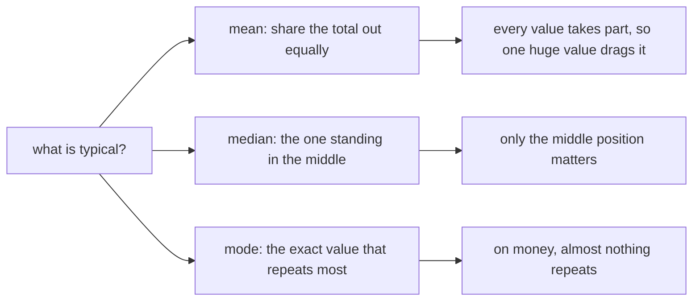

# Cheat sheet: typical, spread and denominators

Week 1, Day 4. Landscape, eight panels. Print it, keep it beside the keyboard.

Every number here comes off Kalpa's 44 profiled orders: total Rs 561,145, mean Rs 12,753.30, median Rs 1,910.00.

---

## Panel 1: the three "typical" numbers



| | Answers | Reach for it when |
|---|---|---|
| **Mean** | Total shared out equally | The shape is roughly even |
| **Median** | The record in the middle of the queue | Money, durations, anything with a tail |
| **Mode** | The value that repeats most | The column is a category |

**Crux:** nobody is right, they answer different questions, and the asker rarely says which one they meant.

---

## Panel 2: the one-line skew test

```python
mean / median
```

| Ratio | Shape | Send |
|---|---|---|
| Close to 1 | Roughly even | Either |
| Well above 1 | Right tail, something large | Median |
| Well below 1 | Left tail, something small | Median |

Run it first on any column you have never seen. It costs one line and it tells you which statistic you are allowed to quote.

---

## Panel 3: what one record does

```
seven orders             mean Rs  1,676.43   median Rs 1,310
swap the top for 480000  mean Rs 69,842.86   median Rs 1,310
```

**Crux:** the mean grew nearly 42 times, the median moved by zero. Not "a little". Zero.

---

## Panel 4: the fence

```python
q1, _, q3 = statistics.quantiles(values, n=4)
iqr = q3 - q1
upper = q3 + 1.5 * iqr
lower = q1 - 1.5 * iqr
```

**Crux:** a fence is a flag, never a delete key. It says look at this record. An outlier is a finding to investigate before it is a row to delete.

---

## Panel 5: grouping without knowing the categories

```python
buckets = {}
for r in orders:
    key = r[field]
    if key not in buckets:
        buckets[key] = {"count": 0, "amounts": [], "returned": 0}
    buckets[key]["count"] += 1
    buckets[key]["amounts"].append(r["amount"])
    if r["status"] == "returned":
        buckets[key]["returned"] += 1
```

Short form of the same idea: `counts[key] = counts.get(key, 0) + 1`

**Crux:** every hard-coded list of categories is a promise about data you have not read yet. Hard-code three and Kalpa has four, and you get `KeyError: 'Student'`.

---

## Panel 6: count first, then median

| Accumulate one record at a time | Needs the whole group first |
|---|---|
| count, sum, returned count, min, max | median, quartiles, the fence |

**Crux:** collect the amounts into a list during the pass and take the median after the loop ends. There is no running median.

---

## Panel 7: the honest sentence

```
[the number]   [the denominator]   [what it does not yet support]
```

> Business: returned on 1 of 9 orders, 11.1 percent. Lowest in the file and the smallest segment in it. One more return takes it to 22.2 percent and behind Student.

**Crux:** the third part is the one that goes missing between your notebook and somebody else's slide, so it goes in the sentence rather than in a footnote.

---

## Panel 8: before you send a rate

| Check | If it fails |
|---|---|
| Denominator on the same line as the number | It is not ready |
| Any group under your stated floor | Say so in words, in that line |
| Ranked groups of very different sizes | Say what the ranking is partly measuring |
| A mean quoted on a money column | Replace it with the median |
| A difference being called real | Park it and name what would settle it |

**Crux:** every rate carries its denominator, or it lies for you while you are not in the room.

---

## The three lines worth memorising

1. The mean was right and the description was wrong.
2. On a money column, send the median, and say that is what you sent.
3. Every rate carries its denominator, or it lies for you while you are not in the room.
