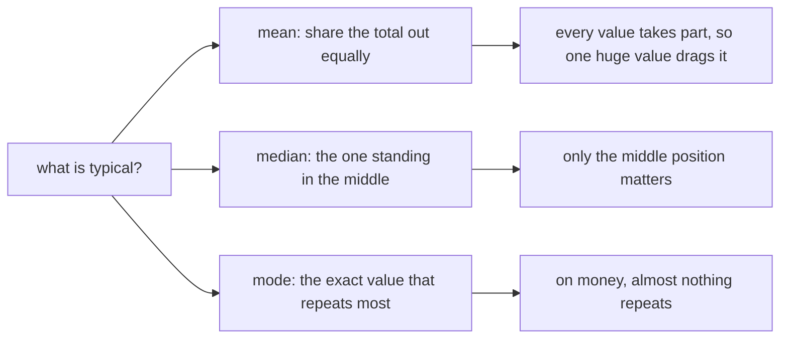
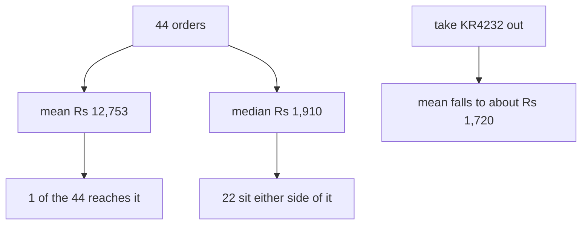
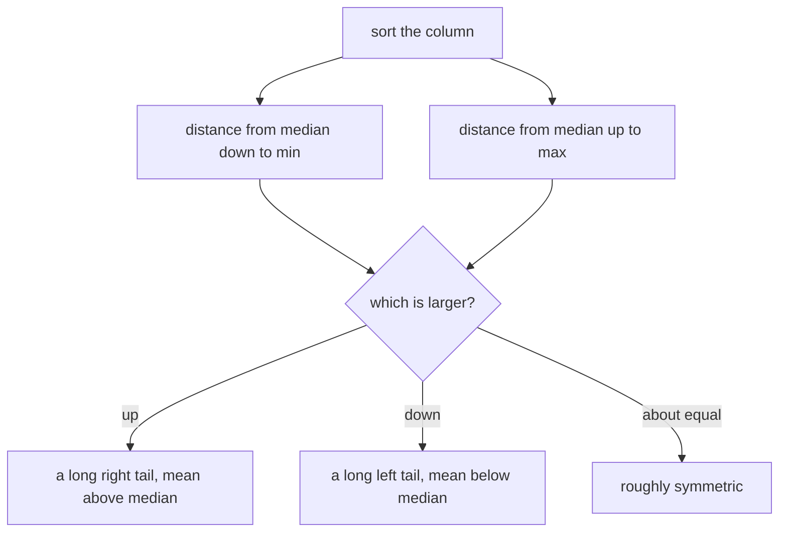
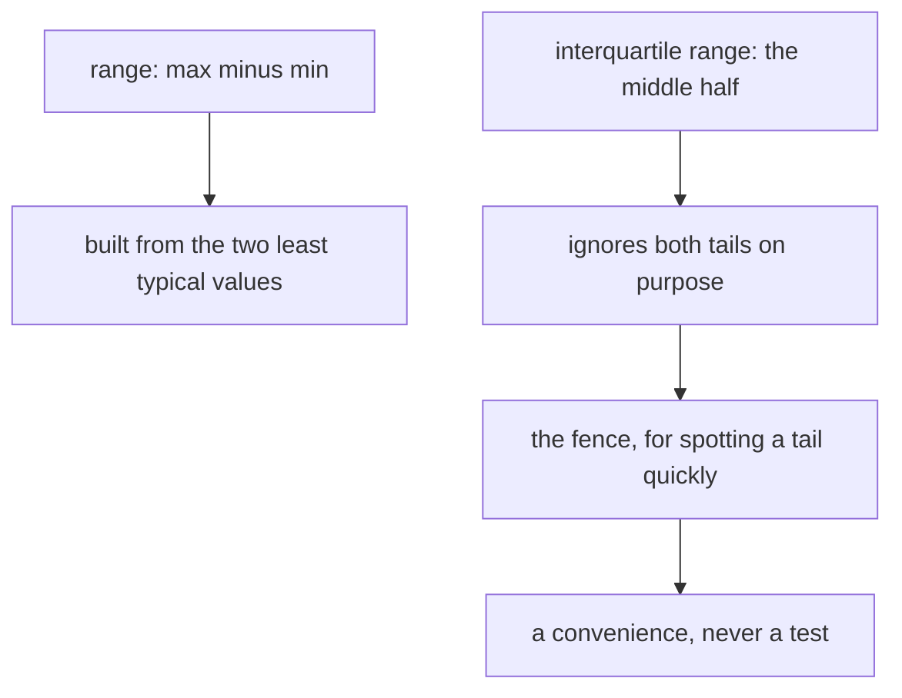
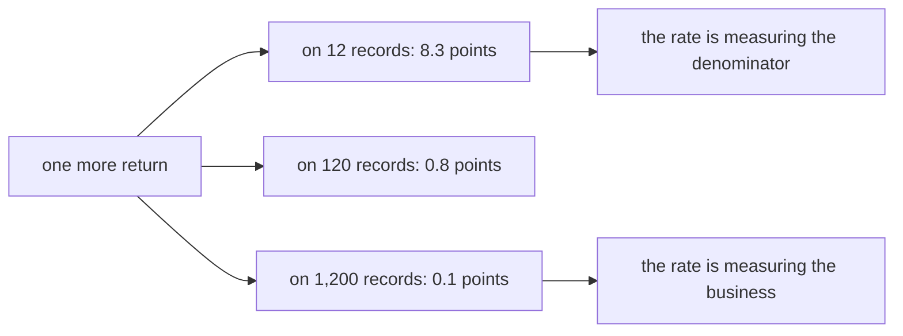
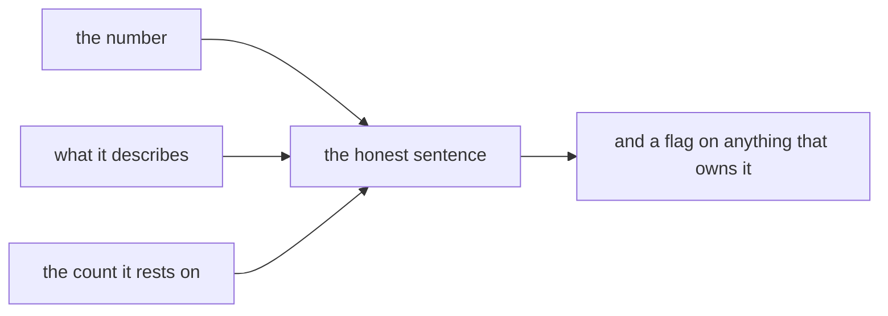

# Visual sheet: typical, spread and the count underneath

Week 1, Day 4. Print landscape. Six panels, pictures only. The text sheet beside this one carries the words.

---

## Panel 1: three answers to one question

**Crux:** the shape of the column decides which of the three is honest.

---

## Panel 2: what one order does

**Crux:** a mean that only one record reaches is a number about that record.

---

## Panel 3: reading the shape with no chart

**Crux:** skew reads off sorted values, with no library and no formula.

---

## Panel 4: spread, and what each measure is made of

**Crux:** the fence spots the tail, and it proves nothing about the row it catches.

---

## Panel 5: one event, three denominators

**Crux:** every rate travels with the count it rests on.

---

## Panel 6: what leaves your desk

**Crux:** the deliverable is the sentence, and the table is the working.

---

