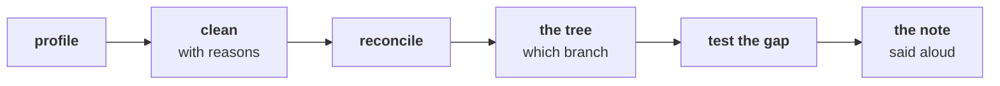

# Before tomorrow: the week, rebuilt alone

Ships tonight. Fifteen minutes of reading and one check to run. Tomorrow is the AI-free lab and the
growth-review rehearsal, and a room that has read this walks in knowing what the day asks of it.

---

## What tomorrow is about

Kavya takes Friday:

> "Before anything goes to Meera, rebuild the week from a raw export with no assistant and no notes.
> Then say it to me the way you will say it to her, because I will push the way Marketing will."
>
> Kavya Nair, senior analyst, Kalpa Retail

The lab adds no new idea. It finds out which of the week's ideas are yours when the notebook is
closed.

---

## The words you will hear tomorrow

Fill these in from memory tonight. The lab assumes you can, and nobody will explain them again.

| Word | What you think it means, in your own words |
|---|---|
| Profile | |
| Reconcile | |
| Decisions log | |
| Chance reference | |
| Confounder | |
| Caveat | |

If you cannot fill one in, that is the one to reread in this week's study notes.

---

## One thing to think about

Tomorrow's rehearsal partner plays Marketing and is told to push. Which of your three answers to
Meera is the weakest, and what is the one question that would expose it? Write that question down;
you will be asked something close to it.

---

## The check for tonight

Open a Codespace and run `notebooks/C2_W01_D04_01_real_or_wobble_STUDENT.ipynb` with Restart and Run
All. If it does not reach the last cell with every check passing, tell the support TA before the lab
opens, because tomorrow no one will help you debug the environment during the timed part.

---

## The line worth carrying in

A method is yours when you can run it cold on a file you have never seen, in the same order every
time, and say what it found in two minutes to someone who disagrees.
