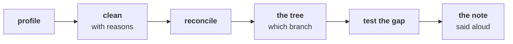

# What will Friday's lab and rehearsal ask of you, and how do you get ready tonight?

This takes fifteen minutes tonight and ends on one check to run. Friday adds no new idea.

---

## What does Kavya ask of you on Friday?

Kavya Nair, the team's senior analyst, takes Friday. The growth review is on Monday, and Marketing
will be in the room.

> "Before anything goes to Meera, rebuild the week from a raw export with no assistant and no notes.
> Then say it to me the way you will say it to her, because I will push the way Marketing will."
>
> Kavya Nair, senior analyst, Kalpa Retail

The day has two halves. In the AI-free lab you run the whole week's method alone, in about two hours,
on an export you have not seen: no assistant, notes closed, with the TAs watching where each person
stalls. After a debrief of the lab, you read the one-page note you wrote today for Meera Raghavan,
Kalpa's CEO, aloud to a partner who plays Marketing and pushes, and then answer a few analyst cases
aloud. Nothing on Friday is graded.

These are the week's steps in the order the lab runs them, with your notes closed: Wednesday's
cleaning, then Monday's revenue tree and Tuesday's branch that moved, then today's test and note.

---

## Which of the week's words does the lab assume you know?

Fill in the last column from memory tonight, one line each, without opening a notebook. The lab
assumes every one, and nobody explains them again. The ones you cannot fill in are the ones to
reread in that day's study notes.

| Word | Taught on | What it means, in your own words |
|---|---|---|
| Revenue tree | Monday | |
| Mix | Tuesday | |
| Profile | Wednesday | |
| Decisions log | Wednesday | |
| Reconcile | Wednesday | |
| Chance reference | Thursday | |
| p-value | Thursday | |
| Confounder | Thursday | |
| Caveat | Thursday | |

---

## Which of your three answers to Meera would Marketing push on first?

Your note answers three questions: whether the Retail-Plus fall is real and worth acting on, whether
Student's 40 percent rise deserves budget, and whether the monsoon sale worked. Tomorrow's partner
plays Marketing and is told to push. Pick the answer you trust least, and write down the one
question that would expose it; you will be asked something close to it.

---

## Does today's first notebook run top to bottom in a fresh Codespace?

Open a fresh Codespace and run `notebooks/C2_W01_D04_01_real_or_wobble_STUDENT.ipynb`, today's
chapter 1 notebook, with Restart and Run All. If it does not reach the last cell with every check passing,
tell the support TA before the lab opens, because during the timed part nobody will help you debug
the environment.

---

## Which line do you carry into Friday?

A method is yours when you can run it without notes or an assistant on a file you have never seen,
in the same order every time, and say what it found in two minutes to someone who disagrees.
