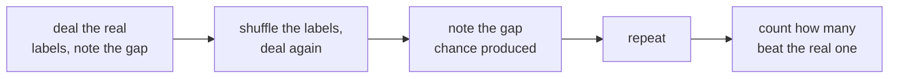
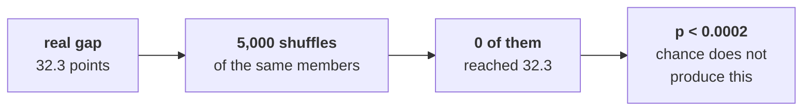
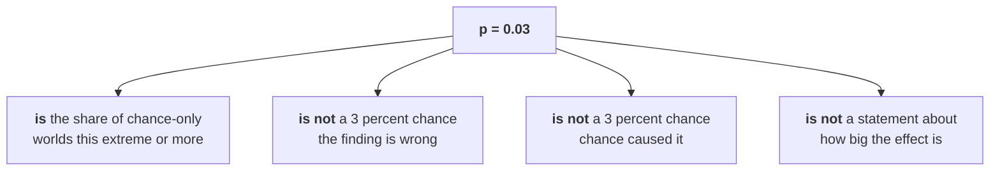
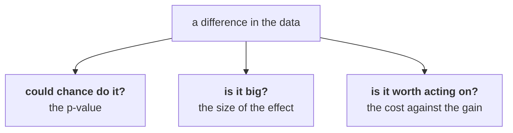
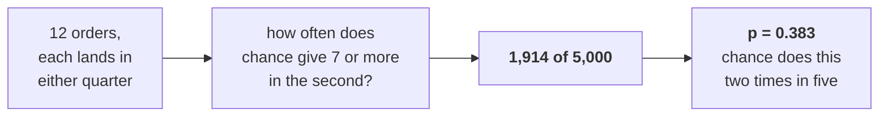

# Half one: is it real, or is it the wobble?

Week 1, Day 4. Slide source. One idea per slide.

Position bar, repeated at every section boundary:
`[three questions] > [the shuffle] > [the p-value] > [sample size]`

---

## SECTION A. Three questions

---

## S1. The growth review is on Monday
Meera, with Finance reconciled:

> "One: Retail-Plus is down, smaller than first reported. Real, or the wobble we see every quarter?
> Two: Student is up 40 percent; should I move budget there? Three: marketing ran a monsoon-sale
> discount for Retail-Plus in August, says it lifted revenue 6 percent, and wants to repeat it for
> Diwali. Did the discount work, or did those customers buy anyway?"

---

## S2. And the constraint
> "One page, two minutes. If the honest answer is 'we do not know yet', say so and tell me what
> would tell us."

That last clause is the job. It is also the sentence most analysts never say.

---

## S3. Three questions, three different habits
| Her question | The habit it needs |
|---|---|
| Real, or the wobble? | A chance reference |
| Should I fund Student? | Sample size |
| Did the discount work? | A fair comparison |

They look alike and they are not. Answering one with another's method is the most common way this day goes wrong.

---

## SECTION B. The shuffle

---

## S4. Suppose the labels mean nothing
The Retail-Plus members fell 35 percent and the Retail-Core members fell 2.7. The gap is 32.3 points.

Now suppose the two labels were meaningless and the same customers had been split between them at random. **Would a gap that big turn up anyway?**

---

## S5. Ten cards answer it


Ten cards, four minutes, no formula. Everything in the code is this move done five thousand times.

---

## S6. The count, over the tries, is the p-value
```
how many chance-only worlds were at least this extreme
-------------------------------------------------------  =  p
                 how many worlds you made
```

That is the whole definition. It is a share of a thing you simulated, and nothing else.

---

## S7. What the shuffle said about Retail-Plus


Chance alone does not produce this gap. The fall is real.

---

## D8. Why not write `p = 0`?
**Question.** Zero of five thousand shuffles beat it. Is the p-value zero?

---

## D9. Answer: 5,000 shuffles resolve to one in 5,000
You did not test every possible world. You made five thousand of them, so the smallest number you can honestly report is the one your simulation can see.

```
p < 0.0002
```

Writing `p = 0` claims a certainty your method cannot produce.

---

## SECTION C. The p-value

---

## S10. Three things it is not


The first wrong reading is the one that gets said in meetings, and it reverses what the number means.

---

## S11. Statistically real and worth acting on


| Question | Answered by |
|---|---|
| Could chance have done this? | The p-value |
| Is it big enough to care about? | The size of the effect |
| Is it worth doing something about? | The cost of the action against the value of the gain |

Three separate calls. A tiny p-value on a tiny effect is a real finding about something that does not matter.

---

## S12. Retail-Plus, all three calls
| Call | Answer |
|---|---|
| Chance? | No. `p < 0.0002` |
| Big? | Yes. Orders per member fell about a third |
| Worth acting on? | The 22 members are the paid tier, so yes |

Only the first of those three came from the shuffle. The other two came from knowing the business.

---

## SECTION D. Sample size

---

## S13. Student is up 40 percent
Five orders in the first quarter and seven in the second. Orders per member went from 2.50 to 3.50.

Forty percent. On twelve orders.

---

## S14. Flip a coin twelve times


The rise is real in the file and it is worthless as evidence.

---

## S15. The rule of thumb
**Distrust any rate computed on fewer than about thirty observations.**

It is a rule of thumb rather than a law, and saying which it is out loud is part of using it honestly.

Student has twelve. Retail-Plus has sixty-six.

---

## S16. What you would tell Meera about Student
> "Student is up 40 percent on twelve orders. Chance alone produces a rise that large about two times
> in five, so I would not move budget on it. If Student matters, the fastest way to find out is to
> give it a full quarter and look again at around fifty orders."

Not yet, and here is what would tell us.
