# Which of Meera's three numbers is real?

Week 1, Day 4. Morning.

Kicker: WEEK 1  ·  THURSDAY  ·  MORNING
Quote: Real, or the wobble we see every quarter? Should I move budget to Student? Did the discount work, or did those customers buy anyway?
Who: Meera Raghavan, CEO, Kalpa Retail, to the data and AI team at Kalpa's Global Capability Centre, before Monday's growth review

```notes
LIVE, one minute. Read Meera's three questions aloud and leave them on screen while the room settles.
Say the week's arc in one breath: Monday drew the revenue tree, Tuesday found the branch that moved,
Wednesday made the numbers trustworthy, and today asks whether what moved is real, whether it
matters, and whether anyone caused it. Friday rebuilds the week without an assistant.
Then the day's question and its six chapters.
```

---

## S1. Six chapters, each asking what the last answer raised
*Is the Retail-Plus fall real, is Student's 40 percent worth budget, and did the monsoon sale work?*

```timeline
label: Chapter 1 | title: Real, or the wobble? | body: Is the Retail-Plus fall more than chance makes?
label: Chapter 2 | title: Worth acting on? | body: How big is it, against what a fix costs?
label: Chapter 3 | title: How many behind 40%? | body: Should budget move to Student?
label: Chapter 4 | title: Did the discount work? | body: Or did those customers buy anyway?
label: Chapter 5 | title: What goes on the page? | body: And when is "not yet" the answer?
label: Chapter 6 | title: What would settle it? | body: After lunch: who got it, and Diwali | tone: dark
```

```notes
LIVE, 2 minutes. Read the day's question, then the six chapter questions in order. Each is the
question the answer before it raises, and each chapter closes on its own answer with a number.
Chapters 1 to 5 run this morning and chapter 6 after lunch. Leave the question up while you set
the scene. Then Meera's message in full.
```

---

## S2. Three questions, one page, before Monday
*What exactly is Meera asking, and what does she want back?*

**The client asks.** "One: Retail-Plus is down, smaller than first reported. Real, or the wobble we see every quarter? Two: Student is up 40 percent; should I move budget there? Three: marketing ran a monsoon-sale discount for Retail-Plus in August, says it lifted revenue 6 percent, and wants to repeat it for Diwali. Did the discount work, or did those customers buy anyway?"

```stats
value: 3 | label: questions | note: before Monday's growth review
value: 40% | label: Student's rise | note: as Meera heard it
value: 6% | label: marketing's lift | note: the monsoon sale, as claimed
value: 1 page | label: two minutes | note: her constraint on the answer
```

```notes
LIVE, 4 minutes. Read the message aloud. Then read her constraint: "One page, two minutes. If the
honest answer is 'we do not know yet', say so and tell me what would tell us." Retail-Plus is
Kalpa's paid membership tier, where the customers who buy most often sit. Ask which of the three questions would cost Kalpa the most if
answered wrongly. Most say the discount, because it is about to be repeated for Diwali. Hold that;
chapters 4 and 6 answer it. Watch for anyone answering a question now: every number on this slide
is somebody's claim, and today tests each one. Then the question of which check each claim needs.
```

---

## S3. Question: which check does each question need?
*Three questions look alike: which check must each pass before its number goes in the note?*

| Meera's question | The claim inside it |
|---|---|
| Is the Retail-Plus drop real? | A gap between two quarters |
| Should budget move to Student? | A rate that rose 40 percent |
| Did the discount work? | Revenue that rose after a campaign |

**Question.** Which pairing is right? a) all three need a bigger sample; b) chance for the first, the count behind the rate for the second, a fair comparison for the third; c) a significance test for all three; d) chance for the first two, and the campaign's own report for the third.

```notes
LIVE, 3 minutes. One minute in pairs, then letters. Expect a and c, which both sound rigorous.
Do not resolve it here. Then the answer.
```

---

## S4. Answer: chance, the count, a fair comparison
*Which check must each of Meera's questions pass before its number goes in the note?*

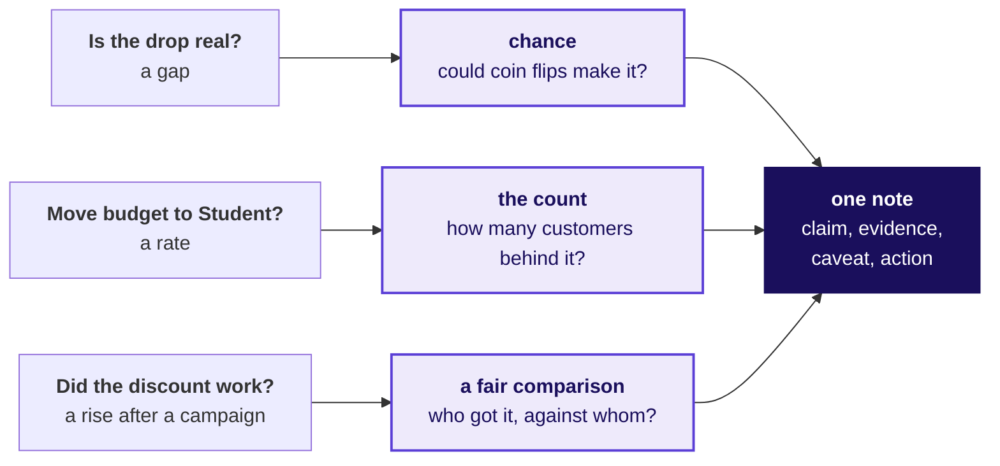
```mermaid
flowchart LR
    Q1["<b>Is the drop real?</b><br/>a gap"] --> H1["<b>chance</b><br/>could coin flips make it?"]
    Q2["<b>Move budget to Student?</b><br/>a rate"] --> H2["<b>the count</b><br/>how many customers behind it?"]
    Q3["<b>Did the discount work?</b><br/>a rise after a campaign"] --> H3["<b>a fair comparison</b><br/>who got it, against whom?"]
    H1 --> N["<b>one note</b><br/>claim, evidence,<br/>caveat, action"]
    H2 --> N
    H3 --> N
    classDef known fill:#EEEAFB,stroke:#5B3FD6,color:#1A0F5C,stroke-width:2px
    classDef bet fill:#1A0F5C,stroke:#1A0F5C,color:#FFFFFF
    class H1,H2,H3 known
    class N bet
```

The answer is b. Option d trusts the one party with a stake in the answer, and options a and c apply one tool to three different failures.

```notes
LIVE, 4 minutes. Draw this on the board and leave it there all day. Chapters 1 and 2 climb the
first check, chapter 3 the second, chapters 4 and 6 the third, and chapter 5 writes the note on the
right. Every chapter ends on one line of that note. Then the note's four parts.
```

---

## S5. The note: claim, evidence, caveat, action
*What does Meera read in her two minutes, and in what order?*

```timeline
label: Part 1 | title: Claim | body: One sentence Meera can act on, with the number that carries it.
label: Part 2 | title: Evidence | body: The number with its denominator, its window and how it was checked.
label: Part 3 | title: Caveat | body: What would change the claim, said before anyone else says it.
label: Part 4 | title: Action | body: What to do next, and what it costs, including "wait and measure". | tone: dark
```

**In the interview.** [S] Explain a finding to a non-technical stakeholder.

```notes
LIVE, 3 minutes. Every chapter today ends on one line of this note. The caveat is the part most
analysts leave out and the part a CEO keeps them for. Model it once: "Not yet, and here is what
would tell us" is a claim, a caveat and an action in one sentence. Then what the week has already
settled.
```

---

## S6. Three days of work stand behind today's file
*What has the week already settled, and what does today's file hold?*

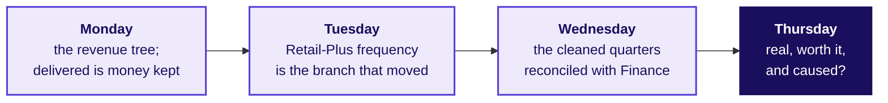
```mermaid
flowchart LR
    M["<b>Monday</b><br/>the revenue tree;<br/>delivered is money kept"] --> T["<b>Tuesday</b><br/>Retail-Plus frequency<br/>is the branch that moved"]
    T --> W["<b>Wednesday</b><br/>the cleaned quarters<br/>reconciled with Finance"]
    W --> R["<b>Thursday</b><br/>real, worth it,<br/>and caused?"]
    classDef known fill:#EEEAFB,stroke:#5B3FD6,color:#1A0F5C,stroke-width:2px
    classDef bet fill:#1A0F5C,stroke:#1A0F5C,color:#FFFFFF
    class M,T,W known
    class R bet
```

Today's file is Wednesday's cleaned two quarters of orders, plus the Student segment's own orders and the campaigns table. Retail-Plus is Kalpa's paid membership tier, and delivered revenue, the money kept once cancelled and returned orders are left out, is the measure all day.

```notes
LIVE, 3 minutes. Name what not to redo: nobody re-cleans the file, and nobody re-derives the tree.
Monday's revenue tree wrote revenue as customers times orders per customer times revenue per order;
Tuesday found Retail-Plus's orders per customer was the branch that moved; Wednesday reconciled the
quarters to Finance's books. The retail dossier from Monday
(content/W01/D1/study-notes/C2_W01_D01_domain_retail_STUDENT.md) tells why a fall in the membership
tier worries its head. Wednesday's return question is the Kahoot's last item. Then chapter 1.
```

---

## SECTION 1: Real, or the wobble?
*Is the Retail-Plus fall real, or the wobble Kalpa sees every quarter?*

```notes
LIVE. Thirty minutes: the need and the company (4), the options and the call (4), five members'
cards by hand (8, never cut), the code, Retail-Core and the room's Retail-Plus run (7), the trap and
its fix (5), the second route (1), and the close (1). Notebook 1 runs beside it.
```

---

## S7. Answered in six questions, before Monday's review
*Who needs this answer, and which questions lead to it?*

**Who needs the answer.** Meera decides at Monday's growth review whether the Retail-Plus tier's fall gets a budget of its own. A wobble read as a real fall funds a fix for nothing, and a real fall read as a wobble lets the tier drain.

```timeline
label: 1 | title: Which way fits? | body: Four ways to ask "is it real?"
label: 2 | title: Is Rs 880 surprising? | body: Five members' cards, by hand
label: 3 | title: What is a wobble? | body: Retail-Core, 5,000 flips
label: 4 | title: How often by chance? | body: Retail-Plus, 5,000 flips
label: 5 | title: What does a share never say? | body: The plausible wrong answer
label: 6 | title: Do other routes agree? | body: The paired test, every pattern | tone: dark
```

```notes
LIVE, 1 minute. Read the six questions. Each gets its answer before the next is asked, and the
chapter's last slide answers all six in a line each. Then the need.
```

---

## S8. The measure: revenue per member, the same 22 twice
*Who asks, what is measured, and what does a wrong call cost?*

```cards
icon: user | eyebrow: Who asks | title: Meera, the CEO | body: She decides on Monday whether the tier's fall gets a budget of its own.
icon: chart-line | eyebrow: The metric | title: Revenue per member | body: Delivered revenue per Retail-Plus member per quarter, the same 22 members in Q1 and in Q2.
icon: triangle-alert | eyebrow: A wrong call costs | title: A budget spent on noise | body: A wobble read as a real fall funds a fix for nothing, and a real fall read as wobble lets the tier drain. | tone: dark
```

```notes
LIVE, 2 minutes. Delivered revenue per member is the measure all day: Monday settled that
cancelled and returned orders are not money kept, and a member is the unit that exists in both
quarters. Say it plainly: the same 22 people are measured twice, and that fact chooses the test.
Write the measure on the board beside the tree. Then a company that tests changes all year.
```

---

## S9. Booking.com reads every change against chance
*Has a real company learned that most changes do nothing at all?*

```stats
value: 25,000 | label: tests a year | note: Booking.com, as Stefan Thomke reported in HBR in 2020
value: 1,000+ | label: running at once | note: at any point in time, the same source
value: 9 in 10 | label: experiments that fail | note: to improve anything, Thomke on HBR's podcast, 2019
```

When most changes are noise, the first question about any move is how often chance alone makes one that size.

```notes
LIVE, 1 minute. Sources: HBR, "Building a Culture of Experimentation" (2020), and the HBR podcast
"At Booking.com, Innovation Means Constant Failure" (2019).
Checked 30 September 2026: https://hbr.org/2020/03/building-a-culture-of-experimentation
Checked 30 September 2026: https://hbr.org/podcast/2019/09/at-booking-com-innovation-means-constant-failure
The 25,000 a year is Thomke's figure; say "about". A company that tests constantly treats a gap as
noise until it beats chance. Then the four ways a team could ask.
```

---

## S10. Flip each member's pair; pooling treats 22 as 44
*Which of four ways to ask "is it real?" fits 22 members measured twice?*

| Option | What it stands on | What it assumes | What it risks |
|---|---|---|---|
| A. Flip each member's pair | 22 members, one Q1 less Q2 each | either order of a member's quarters was as likely | moves 0.004 across seeds |
| B. Pool and deal two piles | 44 totals as 44 people | the quarters hold different customers | counts gaps between members as chance |
| C. Textbook paired test | 22 differences, one call | a bell-shaped average difference | a formula on lumpy totals: 8 of 44 are zero |
| D. Wait for Q3 | 22 more member-quarters | nothing new | Monday passes unanswered |

**The call.** A: the same members sit in both quarters, so the test keeps each member's two quarters together.

```notes
LIVE, 2 minutes. What separates the options is the design of the data, and compute decides nothing
here. The same 22 members sit in both quarters; B treats them as 44 strangers, which is the right
test only when the two groups are different customers. How far B strays rests on how well a
member's Q1 predicts their Q2: on this file the correlation is 0.04, so it strays little, and on a
tier where heavy buyers stay heavy it strays far. Eight of the 44 totals are zero (six members
bought nothing in Q2, two nothing in Q1), the lumpy shape a formula assumes away. Then what would
switch the call.
```

---

## S11. Scale or different customers would switch the call
*What fact would move the call away from the flips?*

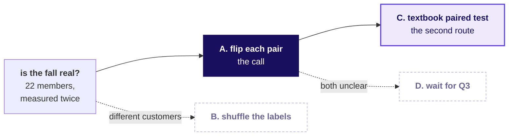
```mermaid
flowchart LR
    Q["<b>is the fall real?</b><br/>22 members,<br/>measured twice"] --> A["<b>A. flip each pair</b><br/>the call"]
    A --> X["<b>C. textbook paired test</b><br/>the second route"]
    A -.->|"both unclear"| D["<b>D. wait for Q3</b>"]
    Q -.->|"different customers"| B["<b>B. shuffle the labels</b>"]
    classDef known fill:#EEEAFB,stroke:#5B3FD6,color:#1A0F5C,stroke-width:2px
    classDef unknown fill:#FFFFFF,stroke:#B8B2D6,color:#6B6690,stroke-dasharray:4 3
    classDef bet fill:#1A0F5C,stroke:#1A0F5C,color:#FFFFFF
    class A bet
    class X known
    class B,D unknown
```

**The fact that would change the call.** Thousands of well-behaved members make the textbook paired test the house standard; two groups of different customers make the label shuffle the test.

```notes
LIVE, 1 minute. The flips assume only that, if nothing changed, each member's two quarters could
have come in either order; they do not assume a bell shape. Say the switch facts aloud: at
Booking.com's scale the textbook call is the standard, and chapter 6, comparing Retail-Plus with
Retail-Core, is where the label shuffle comes back, because those are different customers. Then the
picture of one chance-only world.
```

---

## S12. A coin per member builds one chance-only world
*If the quarter made no difference, what could each member's two quarters have been?*

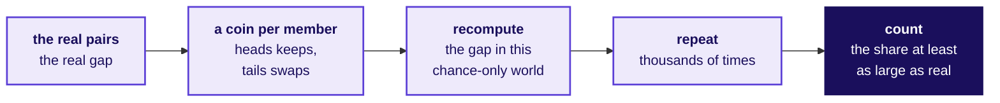
```mermaid
flowchart LR
    A["<b>the real pairs</b><br/>the real gap"] --> B["<b>a coin per member</b><br/>heads keeps,<br/>tails swaps"]
    B --> C["<b>recompute</b><br/>the gap in this<br/>chance-only world"]
    C --> D["<b>repeat</b><br/>thousands of times"]
    D --> E["<b>count</b><br/>the share at least<br/>as large as real"]
    classDef known fill:#EEEAFB,stroke:#5B3FD6,color:#1A0F5C,stroke-width:2px
    classDef bet fill:#1A0F5C,stroke:#1A0F5C,color:#FFFFFF
    class A,B,C,D known
    class E bet
```

That share has a name, the p-value, and it is only ever a share of chance-only worlds.

```notes
LIVE, 1 minute. Say the name once and move on; the definition earns its place after the room has
counted shares by hand. No formulas today, and no test catalogue. For two groups of different
customers the same idea deals the labels at random instead; that version returns in chapter 6.
Then the cards.
```

---

## S13. Five members' cards: heads keeps, tails swaps
*How is one chance-only world tossed by hand on five members?*

| Member | Q1, Rs | Q2, Rs | Q1 less Q2, Rs |
|---|---|---|---|
| A | 3,400 | 2,400 | 1,000 |
| B | 2,900 | 2,200 | 700 |
| C | 4,100 | 3,100 | 1,000 |
| D | 2,500 | 1,900 | 600 |
| E | 3,800 | 2,700 | 1,100 |
| **Mean** | **3,340** | **2,460** | **880** |

Invented for the table. The real gap is Rs 880. Toss a coin per member: heads keeps the pair, tails swaps it, so that member's difference changes sign. Add the five signed differences, divide by five, and write the gap. Ten tosses per pair.

```notes
LIVE, 6 minutes, never cut. Hand each pair five members' cards, two per member, with these amounts.
For each toss, a coin per member: heads keeps the member's pair as recorded, tails swaps it. Each
pair tosses ten times and writes each gap on the board in a row. Then count, as a room, how many
gaps reached Rs 880 or more. Ask: if the quarter made no difference, how surprising is 880? The
guided sheet is exercises/guided/C2_W01_D04_ten_cards_STUDENT.md. Then the question on the board's
row of gaps.
```

---

## S14. Question: is a gap of Rs 880 surprising?
*None of the room's ten tosses reached Rs 880: what do you say?*

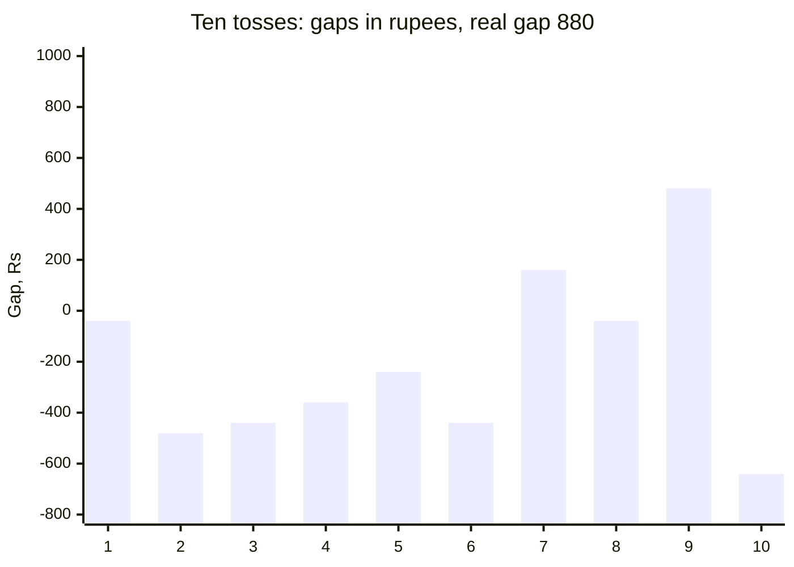
```mermaid
xychart-beta
    title "Ten tosses: gaps in rupees, real gap 880"
    x-axis ["1", "2", "3", "4", "5", "6", "7", "8", "9", "10"]
    y-axis "Gap, Rs" -800 --> 1000
    bar [-40, -480, -440, -360, -240, -440, 160, -40, 480, -640]
```

**Question.** None of the ten tosses reached Rs 880. What do you say? a) the gap is real, since no toss reached it; b) chance never makes 880, so it is a finding; c) ten tosses are too few to say, so run many more; d) nothing, since tossing destroys the data.

```notes
LIVE, 1 minute. These ten gaps are the first ten a seeded computer toss produced, a fair stand-in
for a pair's ten. Take letters. The traps are a and b: none in ten sounds rare, and ten draws say
almost nothing about a share. Then the answer.
```

---

## S15. Answer: ten tosses cannot measure a share
*How often do coin tosses on five members' cards make a gap of Rs 880?*

```stats
value: 1,000 | label: tosses | note: five coins each, seeded
value: 35 | label: gaps of Rs 880 or more | note: in chance-only worlds
value: 1 in 32 | label: the exact share | note: 2 in 32 counting either way
```

The answer is c. Ten hand tosses taught what a flip is; a thousand measure how rare the real gap is, and with five members the rarest a gap can be is 1 in 32.

```notes
LIVE, 1 minute. Why 1 in 32: a gap of Rs 880 needs every member to keep their order, and five coins
land that way once in 32; swapping any one member pulls the gap down by at least Rs 240. Say the
sentence aloud: "If the quarter made no difference, a gap of Rs 880 or more turns up in about 3 of
every 100 tosses." Then the same steps as code.
```

---

## S16. The flip is five lines, each a step done by hand
*What does a coin per member look like in code?*

```python
diffs = [a - b for a, b in zip(q1, q2)]    # each member's Q1 less Q2
for _ in range(5000):                       # 5,000 chance-only worlds
    coins = [d if random.random() < 0.5 else -d for d in diffs]
    gaps.append(mean(coins))                # heads keeps, tails swaps
share = sum(g >= real for g in gaps) / 5000
```

The last line counts the worlds with a gap at least as large as the real one, which is the share the cards counted by hand.

```notes
LIVE, 1 minute. Read each line against the cards: the differences, a coin per member, the average,
the count. The notebook's helper is flip_gaps, with random.seed(2026) so every laptop gets the same
coins. A NameError from an unrun cell gets Restart and Run All and two minutes, no more. Then an
ordinary quarter.
```

---

## S17. Retail-Core's Rs 110 fall: a third of flips match it
*What does the usual wobble look like on Retail-Core?*

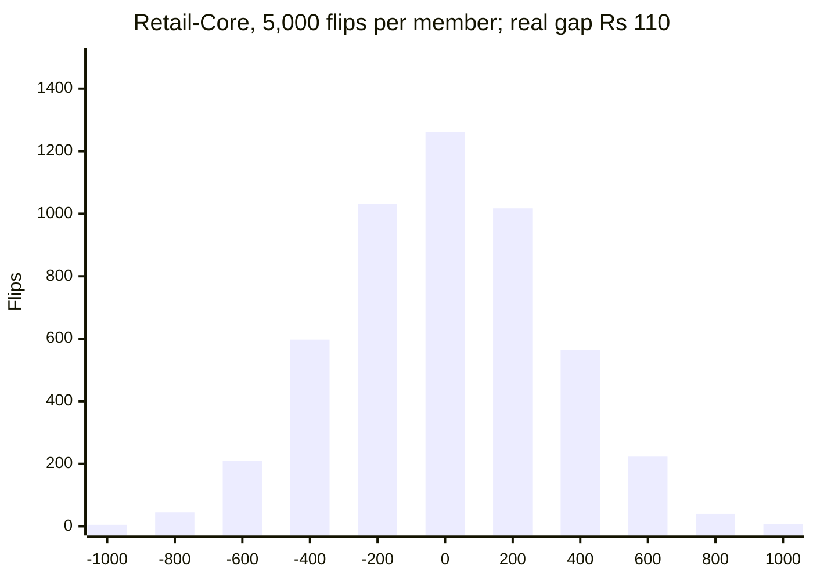
```mermaid
xychart-beta
    title "Retail-Core, 5,000 flips per member; real gap Rs 110"
    x-axis ["-1000", "-800", "-600", "-400", "-200", "0", "200", "400", "600", "800", "1000"]
    y-axis "Flips" 0 --> 1500
    bar [5, 45, 210, 597, 1031, 1261, 1017, 564, 223, 40, 7]
```

The real gap is Rs 110 across 34 members. 1,789 of the 5,000 flips made a fall at least that large, a share of 0.36, and 3,617 a move that large either way: an ordinary quarter.

```notes
LIVE, 2 minutes. Run live in notebook 1. The bars are chance-only worlds, and the real gap sits in
the tallest bars. Kavya's point: this is what "nothing happened" looks like, and the room needs to
have seen it before judging Retail-Plus. Then the room's own run.
```

---

## S18. Question: how often does chance match Retail-Plus?
*Run the same flips on the segment Meera asked about: will chance make its fall as often?*

```timeline
label: Step 1 | title: The measure | body: Delivered revenue per Retail-Plus member, Q1 and Q2.
label: Step 2 | title: The real gap | body: Q1 mean less Q2 mean, printed in rupees before any flip runs.
label: Step 3 | title: The flips | body: 5,000, seed 2026: the share at least as large, then the share either way. | tone: dark
```

**Question.** Against Retail-Core's third, Retail-Plus's share will be: a) about the same; b) larger, since the segment is smaller; c) much smaller, if its fall is bigger than chance makes; d) impossible to compute, since some members have zeros.

```notes
LIVE, 3 minutes. The room predicts, then runs notebook 1's Retail-Plus section and writes a first
draft sentence to Meera without help. Do not read a number out first; every laptop gets the same
shares because of the seed. Ask one pair to read theirs aloud and write it on the board. Those
numbers belong to the room, and the next slides work on them. Then the answer.
```

---

## S19. Answer: 145 of 5,000 flips, and 286 either way
*How often does chance alone make a fall as large as Retail-Plus's?*

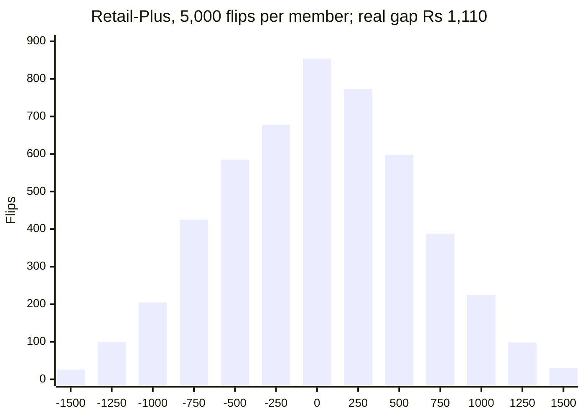
```mermaid
xychart-beta
    title "Retail-Plus, 5,000 flips per member; real gap Rs 1,110"
    x-axis ["-1500", "-1250", "-1000", "-750", "-500", "-250", "0", "250", "500", "750", "1000", "1250", "1500"]
    y-axis "Flips" 0 --> 900
    bar [26, 99, 205, 425, 585, 678, 854, 773, 598, 388, 225, 98, 30]
```

The answer is c. Retail-Plus members delivered Rs 3,279 each in Q1 and Rs 2,169 in Q2, a fall of Rs 1,110. Counting falls, 145 of 5,000 flips made one that large (0.029); counting either way, 286 did (0.057).

```notes
LIVE, 1 minute. Read the two numbers off the room's board. The real gap sits out in the right-hand
tail, past the Rs 1,000 bar: far outside Retail-Core's pile, at the edge of what chance makes. Which
of the two shares is the p-value is a choice made before the test runs, and Meera asked after the
fall was seen, so both go in. Then the first draft most of the room wrote.
```

---

## S20. The plausible wrong answer: a 3% chance we're wrong
*What does the share say about the chance that the finding is wrong?*


```mermaid
flowchart LR
    R["<b>your result</b><br/>falls only, 0.029"] --> W["<b>the draft note</b><br/>p = 0.03, so there is<br/>a 3% chance we are wrong"]
    W --> D["<b>the decision it drives</b><br/>treat the fall as<br/>97 percent certain"]
    classDef bad fill:#FBE9EF,stroke:#D63A6A,color:#1A0F5C
    class W,D bad
```

**What breaks.** "p = 0.03, so there is a 3% chance we are wrong about the drop" reads as precise, sounds like probability, and sends Meera into Monday certain.

```notes
LIVE, 2 minutes. Put the sentence up next to the room's share and ask whose first draft looks like
it. Most hands go up; it is the most common p-value sentence in industry. Then why it is wrong.
```

---

## S21. Why it is wrong: counted where nothing changed
*In which world was the share counted, and what does that make it?*

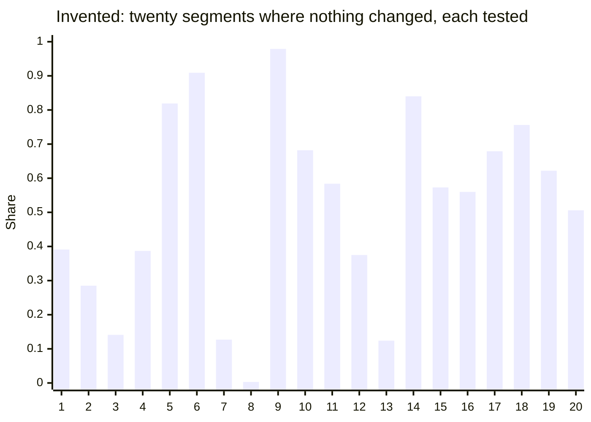
```mermaid
xychart-beta
    title "Invented: twenty segments where nothing changed, each tested"
    x-axis ["1", "2", "3", "4", "5", "6", "7", "8", "9", "10", "11", "12", "13", "14", "15", "16", "17", "18", "19", "20"]
    y-axis "Share" 0 --> 1
    bar [0.391, 0.285, 0.141, 0.387, 0.819, 0.909, 0.127, 0.003, 0.979, 0.682, 0.584, 0.375, 0.124, 0.84, 0.573, 0.56, 0.679, 0.756, 0.622, 0.506]
```

**The check.** Every flip assumed the quarter made no difference. One no-change segment came back at 0.003: its note would say "a 0.3 percent chance we are wrong", and it would be wrong for certain.

```notes
LIVE, 2 minutes. These are notebook 1's twenty invented segments with nothing changed, the shares
its run produced. Segment 8 comes back at 0.003. Ask of any p-value sentence: in which world was
this share counted? The chance that a finding is wrong depends on what the flips never saw: how
plausible a fall was before the data, what else changed, how many segments were tested, and
whether the direction was chosen before the fall was seen. Then the sentence that survives.
```

---

## S22. The fix: the share, its world, both directions
*Which sentence does the share support?*

| Draft | Rewritten |
|---|---|
| "There is a 3% chance we are wrong." | "If nothing had changed between the quarters, a fall of Rs 1,110 per member or more would turn up in about 3 of every 100 flips, and a move that large either way in about 6." |
| "The drop is 97 percent certain." | "The question came after the fall was seen, so we read it as borderline: well outside the usual wobble, at the edge of what chance makes." |
| "p = 0.03, so it is significant." | "It is more than the usual wobble by a borderline margin; its size is the next question." |

**The rule.** A p-value is a share of chance-only worlds; it is never the chance the finding is wrong.

```notes
LIVE, 1 minute. The numbers stay 0.029 and 0.057; the claim shrinks from "97 percent certain" to
"borderline". Both directions go in because nobody fixed the direction before the fall was seen.
Each pair rewrites its first draft in the right-hand form. Then a second route.
```

---

## S23. Every pattern and the paired test agree: 0.027
*Do the textbook paired test and an exact count reach the same reading?*

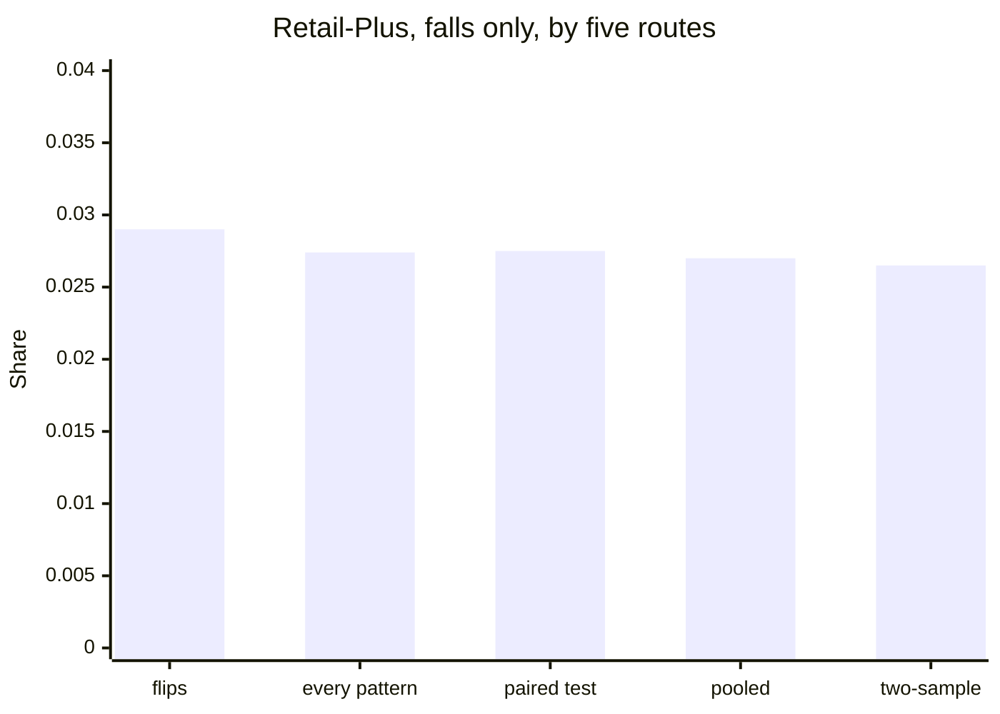
```mermaid
xychart-beta
    title "Retail-Plus, falls only, by five routes"
    x-axis ["flips", "every pattern", "paired test", "pooled", "two-sample"]
    y-axis "Share" 0 --> 0.04
    bar [0.029, 0.0274, 0.0275, 0.027, 0.0265]
```

Either way, the three paired routes give 0.055 to 0.057. The last two bars ignore the pairing, and land close only because a member's Q1 barely predicts their Q2 here. **When to switch.** The textbook paired call for thousands of well-behaved members or a team standard; the flips for few members or lumpy data, or when the reader needs to see how it was made.

```notes
LIVE, 1 minute. Notebook 1's second route: the exact count covers all 4,194,304 ways 22 coins can
land; the paired test gives t = 2.03 on 21 degrees of freedom. The pooled shuffle and the two-sample
test are the unpaired numbers: here they sit near the paired ones because the correlation between a
member's quarters is 0.04, and on a tier where heavy buyers stay heavy they would sit far higher. The
formula behind the paired test is a later week's topic; today it is a second opinion. Then the
chapter's answer.
```

---

## S24. Borderline: outside the wobble, at chance's edge
*So is the Retail-Plus fall real, or the wobble Kalpa sees every quarter?*

| The question on the way | The answer |
|---|---|
| 1. Which way fits 22 members twice? | Flip each member's pair; 8 of 44 totals are zero |
| 2. Is Rs 880 surprising? | 35 of 1,000 tosses; exactly 1 of 32 patterns |
| 3. What is the usual wobble? | Retail-Core's Rs 110: 0.358 falls, 0.723 either way |
| 4. How often by chance? | Rs 1,110: 0.029 counting falls, 0.057 either way |
| 5. What does a share never say? | The chance that the finding is wrong |
| 6. Do other routes agree? | Yes: every pattern 0.027, the paired test 0.0275 |

**Kavya's review.** Retail-Core's third is the wobble. Retail-Plus sits at about 3 in 100 counting falls and 6 in 100 either way, three routes that keep each member's pair agree, and you said which direction you counted and why. Borderline is an honest answer. Now tell me how much money it is.

**In the interview.** [S] What does p = 0.03 mean, and not mean? [S] How do you know whether a change in a metric is significant?

```notes
LIVE, 1 minute. Kavya Nair is the team's senior analyst, who checks every number before it leaves.
The design question for the drill: four ways to ask whether a fall is real, which would you run for
a CEO's Monday? The chapter 1 set (exercises/unguided/C2_W01_D04_ch1_real_or_wobble_STUDENT.md)
runs its items 1 and 2 now if the chapter ran to time. Then chapter 2: the fall is borderline, so
is it worth money?
```

---

## SECTION 2: Worth acting on?
*The fall edges past chance: is it big enough, in rupees against what a fix costs, to act on?*

```notes
LIVE. Thirty minutes: the need and the company (4), the options and the two axes (5), the fall in
rupees and against the company (8), the trap and its check (6), the offer priced (4), the second
route (3), and the close (1). Notebook 2 runs beside it.
```

---

## S25. Answered in six questions, before the budget line
*Who needs this answer, and which questions lead to it?*

**Who needs the answer.** The head of Retail-Plus wants a retention budget, and Meera weighs it against every other line in the quarter. A wrong call funds an offer that cannot pay back, or ignores a fall that keeps draining the tier.

```timeline
label: 1 | title: Which way can Monday use? | body: Break-even, range, test, benchmark
label: 2 | title: How much in rupees? | body: Per member and for the tier
label: 3 | title: Against the company? | body: Where the quarter's money sits
label: 4 | title: Smallest share first? | body: The plausible wrong answer
label: 5 | title: What must an offer win back? | body: A Rs 500 offer, priced
label: 6 | title: How small could it be? | body: The range of the members' falls | tone: dark
```

```notes
LIVE, 1 minute. Read the six questions. Chapter 1 left the fall borderline: about 3 in 100 flips
counting falls, 6 either way, on Rs 1,110 a member. Then the ask.
```

---

## S26. The head of Retail-Plus asks for a retention budget
*What does the tier's head want, and what is missing before anyone talks money?*

**The client asks.** "So my tier really is slipping. What do I get to fix it?" The head of Retail-Plus, before the growth review

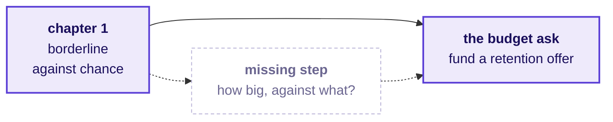
```mermaid
flowchart LR
    S["<b>chapter 1</b><br/>borderline<br/>against chance"] --> B["<b>the budget ask</b><br/>fund a retention offer"]
    S -.-> Q["<b>missing step</b><br/>how big, against what?"]
    Q -.-> B
    classDef known fill:#EEEAFB,stroke:#5B3FD6,color:#1A0F5C,stroke-width:2px
    classDef unknown fill:#FFFFFF,stroke:#B8B2D6,color:#6B6690,stroke-dasharray:4 3
    class S,B known
    class Q unknown
```

```notes
LIVE, 2 minutes. The metric is the same revenue per member, now multiplied out to rupees a quarter.
A wrong call either funds an offer that cannot pay back or ignores a fall that keeps draining the
tier. Ask what the missing box should hold before anyone talks budget. Then a company where size
decided.
```

---

## S27. Microsoft Bing: the size in money decided
*Has a real company told one change from the rest by its size in money?*

```stats
value: 12% | label: revenue lift | note: a change to how Bing showed ad headlines
value: $100M+ | label: a year, US alone | note: Kohavi and Thomke, HBR, 2017
value: 1 in 3 | label: experiments that helped | note: Kohavi and others, Microsoft, 2009
```

A test that says "real" starts the question, and the rupees beside the cost finish it.

```notes
LIVE, 1 minute. Sources: HBR, "The Surprising Power of Online Experiments" (2017) for the 12
percent and the 100 million dollars; "Online Experimentation at Microsoft" (2009) for about a third
of experiments improving the metric they were built for.
Checked 30 September 2026: https://hbr.org/2017/09/the-surprising-power-of-online-experiments
Checked 30 September 2026: https://ai.stanford.edu/~ronnyk/ExPThinkWeek2009Public.pdf
Then the four ways to answer "worth acting on?".
```

---

## S28. Break-even for Monday, with the range as its check
*Which of four ways to answer "worth acting on?" can Monday use?*

| Option | What it does | What it risks |
|---|---|---|
| A. Break-even on the estimate | The fall against the company's quarter and the offer's cost | Treats Rs 1,110 as the true fall |
| B. The low end of a range | Redraws the members' own falls: can even a small fall clear the cost? | A rough low end from 22 members |
| C. Test the offer on half | A coin-chosen half gets it; the other half is held back | A quarter's wait; eleven a side shows only a large recovery |
| D. A past offer's recovery | Reads what an earlier offer won back | Kalpa has never measured one |

**The call.** A, with B as the second route; C is where the answer can lead. **What would change it.** A measured recovery rate, option D, which lets the break-even decide alone.

```notes
LIVE, 3 minutes. Each option reaches a decision by a different kind of evidence: arithmetic on an
estimate, a range, an experiment, a benchmark. The call follows the decision: a budget line needs
rupees beside the quarter and the cost. The low end of the range moves between about Rs 15 and
Rs 100 with the seed, which is what "rough" means here. Then the picture of the two calls.
```

---

## S29. Real and worth acting on are two separate axes
*Where can a finding land once it is sized, and which box earns a budget line?*

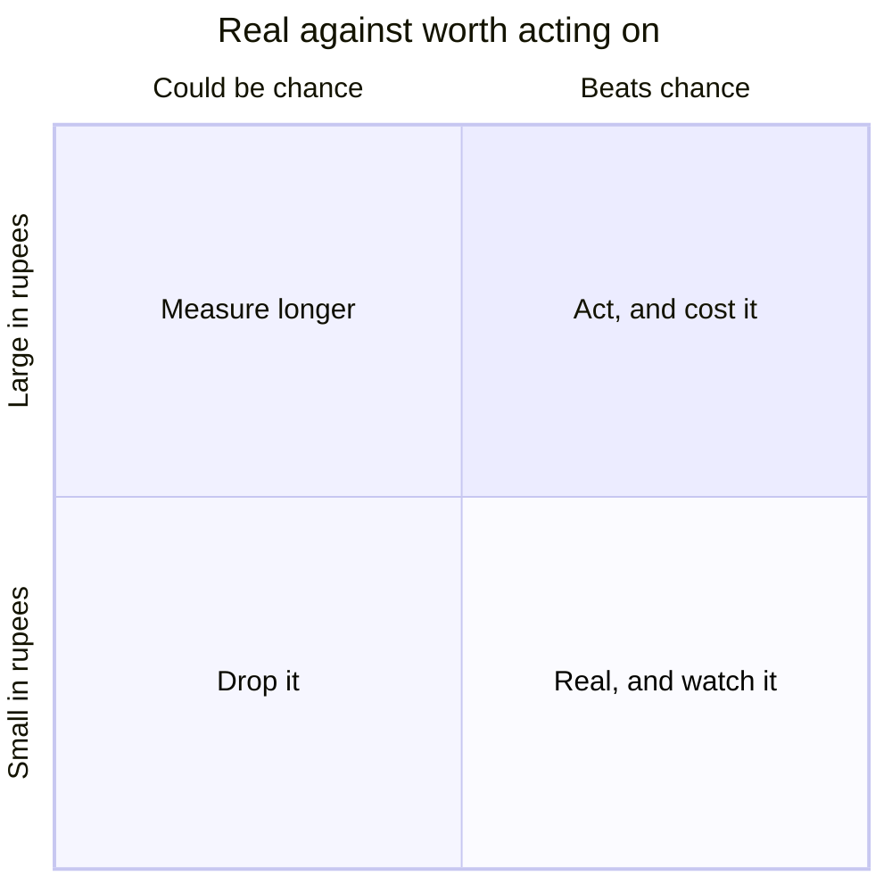
```mermaid
quadrantChart
    title Real against worth acting on
    x-axis Could be chance --> Beats chance
    y-axis Small in rupees --> Large in rupees
    quadrant-1 Act, and cost it
    quadrant-2 Measure longer
    quadrant-3 Drop it
    quadrant-4 Real, and watch it
```

A finding can edge past chance and sit in the bottom right. A large gap on few members can sit top left.

```notes
LIVE, 2 minutes. Ask where Retail-Core's Rs 110 belongs: bottom left. Hold Retail-Plus until the
room has sized it; a borderline share puts it near the middle of the chance axis. The quadrant is
the day's second board drawing. Then the first size.
```

---

## S30. Question: how much is the fall in rupees a quarter?
*Retail-Plus lost Rs 1,110 per member: what is that for the whole tier?*

```python
fall = round(real * len(plus_q1))             # Rs 1,110 x 22 members
company_q2 = sum(delivered(s, "Q2") for s in SEGMENTS)
print(fall, f"{fall / company_q2:.2%}")       # rupees, and share of Q2
```

**Question.** In total, per quarter, the fall is roughly: a) Rs 2,400; b) Rs 24,000; c) Rs 2.4 lakh; d) Rs 24 lakh.

```notes
LIVE, 1 minute. Pairs work it on paper first: a rate per member times the members who exist in both
quarters. The second line is the company's quarter, which the next slides need. Then the answer.
```

---

## S31. Answer: Rs 24,420 a quarter, a third of the tier
*How much is the fall in rupees, per member and for the tier?*

```timeline
label: Per member | title: The gap | body: Q1 mean less Q2 mean: Rs 1,110 of delivered revenue.
label: Segment | title: Times members | body: Rs 1,110 times 22 members is Rs 24,420 a quarter, a third of the tier.
label: Company | title: Against the quarter | body: Rs 24,420 over Rs 1,28,64,680 is 0.19 percent.
label: Decision | title: Against the cost | body: The fall a quarter against what the fix costs a quarter. | tone: dark
```

The answer is b. The tier delivered Rs 72,130 in Q1 and Rs 47,710 in Q2, so for the segment the fall is a third of its money.

```notes
LIVE, 3 minutes. The room computes these in notebook 2's first two sections. A third of the tier is
why the head of Retail-Plus is worried; the company line is why Meera may not be. Then the whole
company on one chart.
```

---

## S32. Against the company, the fall is 0.19 percent of Q2
*How big is the fall against the company's quarter?*

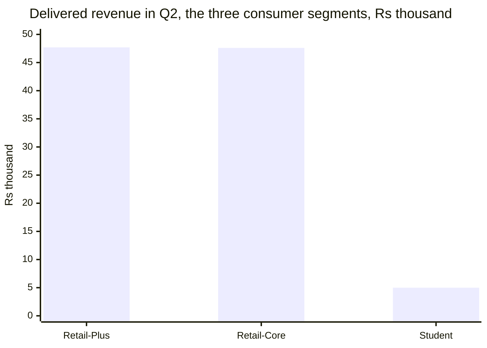
```mermaid
xychart-beta
    title "Delivered revenue in Q2, the three consumer segments, Rs thousand"
    x-axis ["Retail-Plus", "Retail-Core", "Student"]
    y-axis "Rs thousand" 0 --> 50
    bar [47.7, 47.6, 5.0]
```

Business delivered Rs 1,27,64,460 in the same quarter, about 268 times Retail-Plus, so on this axis its bar would stand 268 times as tall. The company's Q2 was Rs 1,28,64,680.

```notes
LIVE, 2 minutes. The chart draws the consumer segments alone so their bars stand in proportion;
with Business on one axis all three would sit on the floor. Business is Kalpa's sales to companies,
every order in lakhs. Then the draft that ranks the review.
```

---

## S33. The plausible wrong answer: rank the review by share
*Should the smallest share open the growth review?*

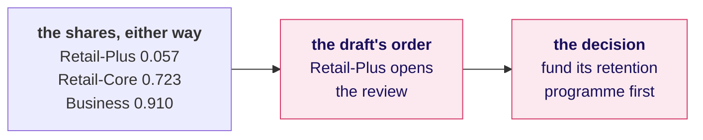
```mermaid
flowchart LR
    P["<b>the shares, either way</b><br/>Retail-Plus 0.057<br/>Retail-Core 0.723<br/>Business 0.910"] --> C["<b>the draft's order</b><br/>Retail-Plus opens<br/>the review"]
    C --> D["<b>the decision</b><br/>fund its retention<br/>programme first"]
    classDef bad fill:#FBE9EF,stroke:#D63A6A,color:#1A0F5C
    class C,D bad
```

**What breaks.** "Retail-Plus is the surest move of the quarter, so it opens the growth review: fund its retention programme first." Significant becomes big, and the smallest share takes the first budget line.

```notes
LIVE, 2 minutes. This is the day's second trap and the one that costs money. The shares count a
move that large either way, since no direction was fixed before the quarter was seen. Ask what the
share would be for a twenty-rupee gap on twenty thousand orders. Take guesses. Then why the share
cannot rank the review.
```

---

## S34. Why it is wrong: big samples make tiny gaps rare
*Why can a small share sit on a tiny gap, and which order does money give?*

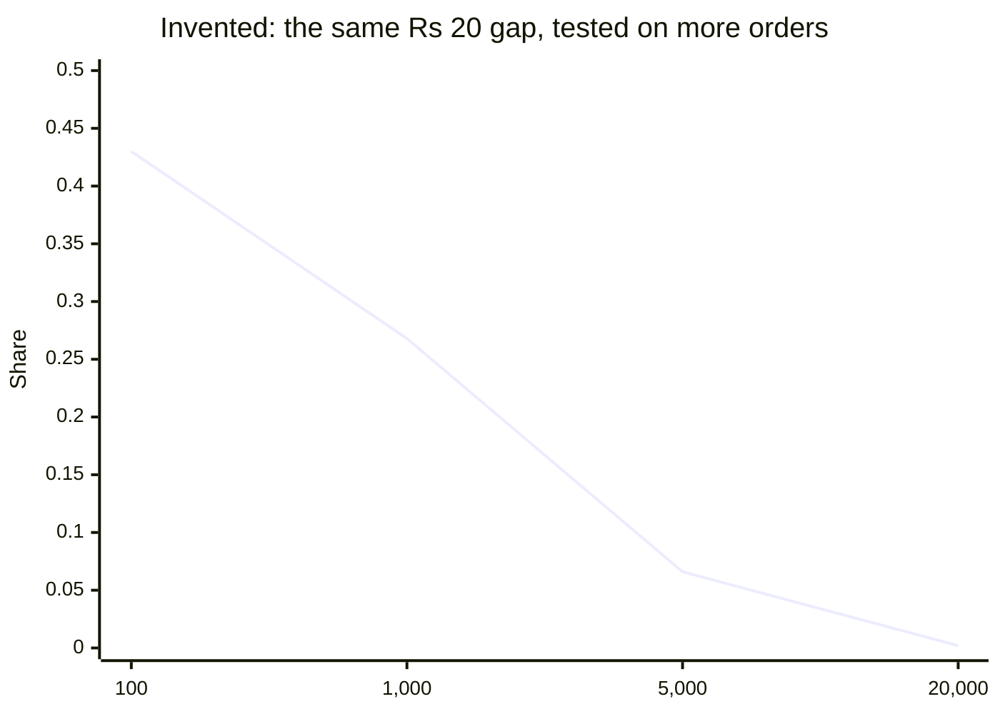
```mermaid
xychart-beta
    title "Invented: the same Rs 20 gap, tested on more orders"
    x-axis ["100", "1,000", "5,000", "20,000"]
    y-axis "Share" 0 --> 0.5
    line [0.430, 0.268, 0.066, 0.002]
```

**The check.** Order the same three segments by money: Business moved Rs 6,18,460, Retail-Plus Rs 24,420, Retail-Core Rs 3,750. The review opens on Business, and Retail-Plus's fall is judged on its own terms, against the company's quarter and the offer's cost.

```notes
LIVE, 4 minutes. The orders are invented in notebook 2: two quarters of different orders, the
earlier one set exactly Rs 20 higher at every size. The share falls from 0.43 to 0.002 on sample
size alone. The share measures how surely a gap beats chance; the rupees measure how big it is.
Business's rise does not shrink the Retail-Plus fall; it changes what the review opens on. The fix
is two sentences: borderline against chance, and Rs 24,420 a quarter, 0.19 percent of the company.
Then the cost of a fix.
```

---

## S35. Question: what must the offer win back?
*The head of Retail-Plus proposes Rs 500 per member a quarter: how much of the fall must it win back?*

```stats
value: Rs 24,420 | label: the fall | note: a quarter, the whole tier
value: 22 | label: members | note: in both quarters
value: Rs 500 | label: the offer | note: per member a quarter, assumed
```

**Question.** What share of the fall must the offer win back just to pay for itself in revenue? a) all of it; b) about 45 percent; c) about 5 percent; d) none, since any recovery is a gain.

```notes
LIVE, 2 minutes. No Kalpa figure exists for the offer's cost; the notebook labels it assumed. Pairs
work it on paper before running the notebook's offer section. Then the answer.
```

---

## S36. Answer: about 45 percent, before margin
*What must a Rs 500 retention offer win back to pay for itself?*

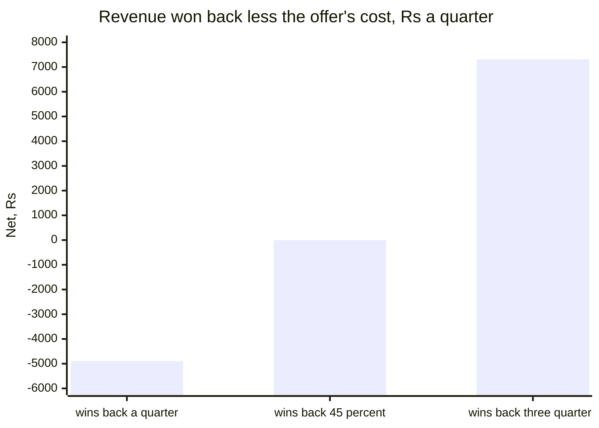
```mermaid
xychart-beta
    title "Revenue won back less the offer's cost, Rs a quarter"
    x-axis ["wins back a quarter", "wins back 45 percent", "wins back three quarters"]
    y-axis "Net, Rs" -6000 --> 8000
    bar [-4895, 0, 7315]
```

The answer is b. Rs 11,000 a quarter against a Rs 24,420 fall means winning back almost half, and the decision rests on a recovery rate nobody has measured.

```notes
LIVE, 2 minutes. At an assumed 30 percent margin (notebook 2's depth section) the offer would need
to win back 150 percent, more than the whole fall. Say that revenue is not margin, once. Then how
small the fall could really be.
```

---

## S37. A second route: the fall could be as small as Rs 80
*How small could the fall really be, and does even that clear the offer?*

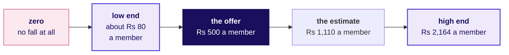
```mermaid
flowchart LR
    Z["<b>zero</b><br/>no fall at all"] --> L["<b>low end</b><br/>about Rs 80<br/>a member"]
    L --> O["<b>the offer</b><br/>Rs 500 a member"]
    O --> R["<b>the estimate</b><br/>Rs 1,110 a member"]
    R --> H["<b>high end</b><br/>Rs 2,164 a member"]
    classDef bad fill:#FBE9EF,stroke:#D63A6A,color:#1A0F5C
    classDef known fill:#EEEAFB,stroke:#5B3FD6,color:#1A0F5C,stroke-width:2px
    classDef bet fill:#1A0F5C,stroke:#1A0F5C,color:#FFFFFF
    class Z bad
    class L,H known
    class O bet
```

Redrawing the 22 members' own falls 5,000 times gives an approximate 95 percent range that only just stays above zero, and the offer sits far above its low end. Such a range is a **confidence interval**; building one properly comes later.

```notes
LIVE, 3 minutes. Under 2 in 100 redraws land at or below zero (0.016), a consistency check beside
the flips' 0.029. The low end moves between about Rs 15 and Rs 100 with the seed, so it sits close
to zero, and at about Rs 80 a member it is about Rs 1,780 a quarter for the tier. That is why the
line is "watch it", and a test on a coin-chosen half if anyone acts. CUT FIRST if the chapter runs
long: say the name and the verdict only. Then the chapter's answer.
```

---

## S38. Worth watching, and not worth acting on alone
*So is the fall big enough, in rupees against what a fix costs, to act on?*

| The question on the way | The answer |
|---|---|
| 1. Which way can Monday use? | Break-even, with the range as its check |
| 2. How much in rupees? | Rs 1,110 a member, Rs 24,420 a quarter |
| 3. Against the company? | 0.19 percent of Q2's Rs 1,28,64,680 |
| 4. Smallest share first? | No: by rupees, Business opens the review |
| 5. What must the offer win back? | 45 percent: Rs 11,000 against Rs 24,420 |
| 6. How small could it be? | About Rs 80 a member, far below Rs 500 |

**Kavya's review.** Borderline by two routes, worth Rs 24,420 a quarter and 0.19 percent of the company. The range's low end sits far below the offer's cost, so watch it; to act, offer it to a coin-chosen half and hold back the rest.

**In the interview.** [F] The test says significant; should the business act?

```notes
LIVE, 1 minute. The interview line in full: a metric moved and the test says significant; how do
you decide whether the business should act? The half-tier test costs Rs 5,500 a quarter; eleven members a side can show only a
large recovery, and how many a test needs is power, a later week. The design question for the
drill: break-even, a range, a test on half, or a past offer's rate, which goes to the budget
meeting? Then chapter 3: Meera's second question is about a rise, the biggest on the page.
```

---

## SECTION 3: How many behind 40%?
*Student is up 40 percent, the fastest rise on the page: how many customers stand behind it, and should budget move there?*

```notes
LIVE. Thirty minutes: the need and the company (4), the options and the call (3), the trap and the
check (5), why small counts swing (3), the room's count (5), chance on the count (4), the interview
pair (3), the second route (2), and the close (1). Notebook 3 runs beside it.
```

---

## S39. Answered in six questions, before budget moves
*Who needs this answer, and which questions lead to it?*

**Who needs the answer.** Meera decides whether acquisition budget follows the fastest-growing segment. A rise that chance made sends a quarter's spend to a segment that may be flat next quarter.

```timeline
label: 1 | title: Which way fits Monday? | body: Trust, test, rule, wait
label: 2 | title: Which segment rose fastest? | body: Every segment's orders, Q2 against Q1
label: 3 | title: Budget to the fastest riser? | body: The plausible wrong answer
label: 4 | title: How often by chance? | body: A coin flip per order
label: 5 | title: 42 on 12, or 31 on 1,200? | body: The interview's version
label: 6 | title: Do other routes agree? | body: Every deal, and real handfuls | tone: dark
```

```notes
LIVE, 1 minute. Read the six questions. Chapters 1 and 2 answered Meera's first question: borderline,
worth watching, and not worth acting on alone. Then her second.
```

---

## S40. Student rose 40 percent, and budget may follow it
*Who asks, what rides on the answer, and what would a wrong call cost?*

**The client asks.** "Student is up 40 percent; should I move budget there?" Meera Raghavan

```cards
icon: chart-bar | eyebrow: The metric | title: Orders a quarter | body: Student's Q2 orders for every 100 in Q1, beside every other segment's.
icon: wallet | eyebrow: What rides on it | title: Acquisition budget | body: Money moved to the fastest riser, before anyone asks what the rise stands on.
icon: triangle-alert | eyebrow: A wrong call costs | title: A quarter's spend | body: Budget follows a rate that may be flat next quarter. | tone: dark
```

```notes
LIVE, 2 minutes. Read Meera's question. Her 40 percent counts orders placed, whatever their status.
Ask which number the room would want beside the 40 percent before answering. Hold the answers.
Then a funder that learned what small groups do.
```

---

## S41. Small schools topped the charts, and the bottom
*Has a real funder paid for trusting a small group's rate?*

```stats
value: 3% | label: expected | note: small schools among the best, if size did not matter
value: 12% | label: found | note: small schools among the best, Wainer's data
value: $1.7B | label: to education projects | note: the Gates Foundation, by 2001
```

Howard Wainer showed small schools were over-represented among the worst as well: small counts produce extremes at both ends.

```notes
LIVE, 1 minute. Source: Howard Wainer, "The Most Dangerous Equation", reprinted in Picturing the
Uncertain World (Princeton University Press, 2009).
Checked 30 September 2026: https://assets.press.princeton.edu/chapters/s8863.pdf
The Foundation backed small schools partly because they appeared at the top; Wainer's point is
that they appeared at the bottom too. Then the four ways to answer Meera.
```

---

## S42. Coin flips on the count, said with the rule
*Which of four ways to answer "should budget follow the 40 percent?" fits Monday?*

| Option | What it does | What it risks |
|---|---|---|
| A. Trust the headline | Fund the fastest riser | Budget follows a coin |
| B. Coin-flip reference | Deal each order to a quarter by coin, 5,000 times | Nothing, once the count is found |
| C. Rule of thumb | Under thirty customers, a rate is a lead | Says careful, and stops there |
| D. Wait for thirty customers | Hold the decision | How long depends on new customers |

**The call.** B, said with C. **What would change it.** A cheap way to reach new students fast, which turns D into a two-week experiment.

```notes
LIVE, 3 minutes. The rule counts customers because more orders from the same few customers add
orders and no new evidence: thirty orders from three people are still three people's habits. D is
the action the answer may lead to, and the room sizes it in notebook 3's second empty cell, once
the count is found. Then the leaderboard a hurried draft reads.
```

---

## S43. The plausible wrong answer: fund the fastest riser
*Which segment rose fastest, and should acquisition budget follow it?*

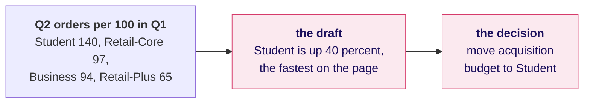
```mermaid
flowchart LR
    H["<b>Q2 orders per 100 in Q1</b><br/>Student 140, Retail-Core 97,<br/>Business 94, Retail-Plus 65"] --> C["<b>the draft</b><br/>Student is up 40 percent,<br/>the fastest on the page"]
    C --> D["<b>the decision</b><br/>move acquisition<br/>budget to Student"]
    classDef bad fill:#FBE9EF,stroke:#D63A6A,color:#1A0F5C
    class C,D bad
```

**What breaks.** "Student is up 40 percent, the fastest on the page: move acquisition budget to Student." A rate travels without its count, and the budget follows the rate.

```notes
LIVE, 2 minutes. Student is the only segment above 100. The rate is correct arithmetic. What is
wrong is repeating it without the count, the same mistake as Monday's number without its
definition. Then the check that comes first.
```

---

## S44. Question: what do you check before answering?
*Meera wants a yes or no on Student: which check comes before any other?*

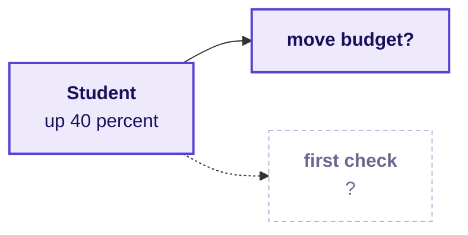
```mermaid
flowchart LR
    R["<b>Student</b><br/>up 40 percent"] --> B["<b>move budget?</b>"]
    R -.-> C["<b>first check</b><br/>?"]
    classDef known fill:#EEEAFB,stroke:#5B3FD6,color:#1A0F5C,stroke-width:2px
    classDef unknown fill:#FFFFFF,stroke:#B8B2D6,color:#6B6690,stroke-dasharray:4 3
    class R,B known
    class C unknown
```

**Question.** What do you check first? a) the rise in rupees, since money is what moves; b) the number of orders and customers the rate stands on; c) whether 40 percent beats every other segment; d) Student's rise in the previous year.

```notes
LIVE, 1 minute. Letters. Expect a, which is chapter 2's habit, and c, which is the headline habit.
Both are reasonable later steps and neither comes first. Then the answer.
```

---

## S45. Answer: count what the rate stands on
*Which check comes before any other on a rate?*

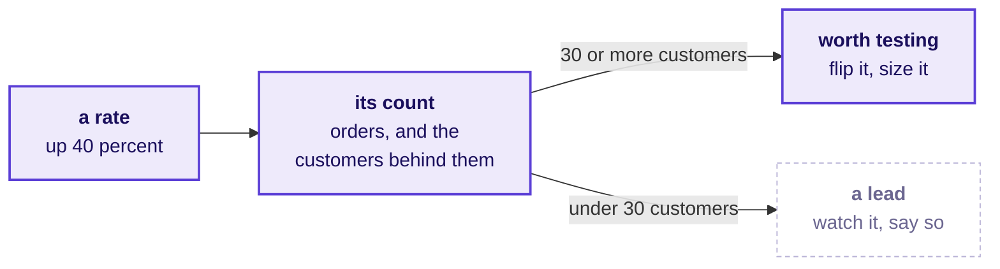
```mermaid
flowchart LR
    R["<b>a rate</b><br/>up 40 percent"] --> N["<b>its count</b><br/>orders, and the<br/>customers behind them"]
    N -->|"30 or more customers"| F["<b>worth testing</b><br/>flip it, size it"]
    N -->|"under 30 customers"| L["<b>a lead</b><br/>watch it, say so"]
    classDef known fill:#EEEAFB,stroke:#5B3FD6,color:#1A0F5C,stroke-width:2px
    classDef unknown fill:#FFFFFF,stroke:#B8B2D6,color:#6B6690,stroke-dasharray:4 3
    class R,N,F known
    class L unknown
```

The answer is b. Rupees and rankings come after the count, and the count that settles a rate is customers: more orders from the same few people add no new evidence.

```notes
LIVE, 2 minutes. Do not say Student's count. The room counts it, orders and customers, in notebook
3's empty cell in a few minutes. Then why small counts swing.
```

---

## S46. Why it is wrong: small counts swing by chance
*How far can chance alone swing a rate on a small count?*

```mermaid
xychart-beta
    title "Chance of a 40 percent rise from coin-flip splits alone"
    x-axis ["10", "20", "30", "50", "100", "200", "400"]
    y-axis "Share of chance-only worlds" 0 --> 0.4
    line [0.377, 0.252, 0.181, 0.101, 0.044, 0.010, 0.0004]
```

With ten independent buyers, more than a third of chance-only worlds show a 40 percent rise; with four hundred, almost none do. Orders from the same customer move together, so the count that matters is customers.

```notes
LIVE, 3 minutes. The chart is fair coin flips, one flip per independent buyer deciding its
quarter, with no Kalpa data in it. Ten buyers, 38 percent of worlds; four hundred, four in ten
thousand. That curve is why the rule of thumb exists, and why it counts customers: thirty orders
from three customers are three buyers, and the curve reads them at three. Then the room's count.
```

---

## S47. Your turn: count the orders and the customers
*How many orders and customers stand behind Meera's 40 percent?*

```cards
icon: hash | eyebrow: Empty cell 1 | title: Count | body: Student's orders in Q1 and Q2, and the distinct customers who placed them.
icon: users | eyebrow: Empty cell 2 | title: Size the wait | body: How many of those customers are new in Q2, and how long thirty would take at that pace.
icon: message-square | eyebrow: The note | title: One line | body: The rate, its count in customers, and what would make it worth testing. | tone: dark
```

```notes
LIVE, 5 minutes. The count is the room's discovery; do not say it, and no slide shows it. When a
pair has it, ask how many customers stand behind the orders, and watch the faces. Then the wait: at
the pace new customers arrive, how long until thirty? Collect two lines aloud. Then how often chance
makes the rise on that count.
```

---

## S48. Question: how often does chance make that rise?
*On Student's own count, how often would coin flips alone show a 40 percent rise?*

```python
for _ in range(5000):                       # 5,000 chance-only worlds
    q2 = sum(random.random() < 0.5 for _ in range(n_orders))
    q1 = n_orders - q2                      # each order lands by a coin
    rises.append(q2 / q1 - 1)               # one world's rise
```

**Question.** What share of coin-flip worlds show a rise of 40 percent or more? a) under 1 percent; b) about 5 percent; c) about 40 percent; d) all of them.

```notes
LIVE, 2 minutes. If Student's ordering had not changed, each order was as likely to land in Q1 as
in Q2. The notebook's helper, flip_rises, also counts a world with no Q1 orders as a rise. Letters,
then the run. Then the answer.
```

---

## S49. Answer: 0.397 of worlds, about four in ten
*How often does chance alone make a 40 percent rise on Student's count?*

```mermaid
xychart-beta
    title "Student's orders dealt to quarters by coin, 5,000 times"
    x-axis ["fell", "rose under 40%", "rose 40% or more"]
    y-axis "Coin-flip worlds" 0 --> 2500
    bar [1882, 1133, 1985]
```

The answer is c. Chance makes Meera's headline in 1,985 of 5,000 worlds, 0.397. On Retail-Core's 73 orders the same rise turns up in 0.086, and on an invented 400 in under 0.002.

```notes
LIVE, 2 minutes. The flips are generous: they treat each order as its own draw, while Student's
orders come from very few customers, whose orders move together. The fix, said aloud: "Not yet: we
watch Student until more customers buy, thirty or more behind the rise." Then the interview's
version of the same question.
```

---

## S50. Question: 42 percent on 12, or 31 on 1,200?
*Which rate does an interviewer expect you to trust, and why?*

**In the interview.** [F] 42 percent on 12 users against 31 percent on 1,200; which do you trust?

**Question.** Which answer earns the offer? a) 42 percent, since it is higher; b) 31 percent, since 1,200 is more; c) 31 percent as the estimate, 42 percent as a lead to measure further; d) neither, since they cannot be compared.

```mermaid
flowchart LR
    S["<b>42 percent</b><br/>on 12 users"] --> Q{"<b>which do<br/>you trust?</b>"}
    L["<b>31 percent</b><br/>on 1,200 users"] --> Q
    classDef known fill:#EEEAFB,stroke:#5B3FD6,color:#1A0F5C,stroke-width:2px
    class S,L known
```

```notes
LIVE, 2 minutes. Letters, then one learner answers aloud in thirty seconds. Listen for the count,
the swing, and what they would do next. Then the answer.
```

---

## S51. Answer: trust the count, and keep the lead
*Which do you trust, 42 percent on 12 users or 31 percent on 1,200?*

| | 42 percent on 12 | 31 percent on 1,200 |
|---|---|---|
| One person changes it by | about 8 points | under a tenth of a point |
| What it is | a lead to measure | an estimate to use |
| What you say | "promising, measure more" | "our working number" |

The answer is c. Option b is right for the wrong reason: 1,200 makes 31 stable, and stability is what earns trust. At a true 31 percent, groups of twelve show 42 or more about a third of the time.

```notes
LIVE, 1 minute. Notebook 3's invented simulation: a true 31 percent shows 42 or more in about 31
percent of groups of twelve, and groups of 1,200 land between about 28 and 35 percent. Then a second
route to the Student share.
```

---

## S52. A second route: every deal, and real handfuls
*Do an exact count of every deal, and real handfuls from another segment, agree?*

```stats
value: 0.397 | label: coin flips | note: 5,000 sampled worlds
value: 0.387 | label: every deal, counted | note: the exact share
value: 0.344 | label: Retail-Core handfuls | note: Student-sized, from a segment that fell 3 percent
```

**When to switch.** Count every deal while the count is small enough to list; flip coins once the list runs into the billions. The handfuls show the swing belongs to small counts, whatever segment they come from.

```notes
LIVE, 2 minutes. Notebook 3's second route. The exact count checks the arithmetic; the handfuls
check the idea: Retail-Core's orders fell 3 percent, yet a Student-sized handful of them shows a 40
percent rise about a third of the time, and a handful of sixty almost never does. Do not name the
number of deals or the size of a handful, which would give the count away. Then the chapter's answer.
```

---

## S53. Not yet: too few customers behind the rise
*So how many customers stand behind the 40 percent, and should budget move there?*

| The question on the way | The answer |
|---|---|
| 1. Which way fits Monday? | Coin flips on the count, said with the rule |
| 2. Which segment rose fastest? | Student: 140 orders for every 100 in Q1 |
| 3. Budget to the fastest riser? | Not on the rate: under thirty customers stand behind it |
| 4. How often by chance? | 0.397 of worlds; 0.086 on Retail-Core's 73 orders |
| 5. 42 on 12, or 31 on 1,200? | 31 as the estimate; 42 as a lead to measure |
| 6. Do other routes agree? | Yes: every deal 0.387, real handfuls 0.344 |

**Kavya's review.** Student's rise is real arithmetic on too few orders, from too few customers, to act on. Count both, say how often chance makes the rise, and give Meera the number of customers that would reopen it. That is a complete answer, and it costs nothing to be right later.

**In the interview.** [F] 42 percent on 12 users against 31 percent on 1,200; which do you trust?

```notes
LIVE, 1 minute. The line for the note: "Not yet: we watch Student until more customers buy, thirty
or more behind the rise, before any budget moves." The design question for the drill: a segment is
up 40 percent and the CEO wants to move budget; trust, test or wait? Break for 10 minutes after this
slide. Then chapter 4, the discount.
```

---

## SECTION 4: Did the discount work?
*Marketing says the monsoon sale lifted revenue 6 percent: did the discount work, or did those customers buy anyway?*

```notes
LIVE. Thirty minutes: the need and the companies (5), the options and the call (3), Marketing's
number reproduced (4), the trap (2), why a blend can mislead (4), the room's split and its result
(7), the fix (2), the second route (2), and the close (1). Notebook 4 runs beside it.
```

---

## S54. Answered in six questions, before Diwali is booked
*Who needs this answer, and which questions lead to it?*

**Who needs the answer.** Meera signs the Diwali budget, and the marketing lead, who owns the campaign, wants it repeated at 15 percent off. A wrong yes gives 15 percent of the price to customers who would have bought anyway, at Diwali's scale.

```timeline
label: 1 | title: Which way can the files support? | body: Before-after, blend, split, one mix
label: 2 | title: Does the 6 percent rebuild? | body: Marketing's number, reproduced
label: 3 | title: Repeat it for Diwali? | body: The plausible wrong answer
label: 4 | title: Inside each segment? | body: The split, by the room
label: 5 | title: What does the note say? | body: The line to Meera
label: 6 | title: One mix, the same answer? | body: What it can and cannot check | tone: dark
```

```notes
LIVE, 1 minute. Read the six questions. Chapters 1 to 3 answered Meera's first two: the Retail-Plus
fall is borderline and worth watching, and Student is not yet. Then her third.
```

---

## S55. Marketing claims 6 percent, and wants it for Diwali
*What did the sale do, what does Marketing claim, and what would a repeat cost?*

**The client asks.** "Did the discount work, or did those customers buy anyway?" Meera Raghavan, with the marketing lead's report open

```stats
value: 15% | label: off | note: Monsoon Sale, 5 to 19 August, aimed at Retail-Plus
value: 6% | label: the claimed lift | note: the marketing lead's report
value: 17.6% | label: more orders | note: needed at 15 percent off just to stand still
```

```notes
LIVE, 2 minutes. The 17.6 percent is Monday's rule: at 15 percent off, orders must rise by 1 over
0.85 less 1 to keep revenue flat. A sale that did not lift spend gives margin away. The metric:
August revenue per customer, for customers who got the sale against customers who did not. Then
two cases where an average hid a split.
```

---

## S56. eBay and Berkeley: averages that hid a split
*Have real organisations seen a total say the opposite of its parts?*

```cards
icon: search | eyebrow: A marketplace | title: eBay, search ads | body: New and infrequent users bought more after an ad; frequent users, whose buying the ads did not change, took most of the ad spend, so the average return was negative.
icon: graduation-cap | eyebrow: A public case | title: UC Berkeley, 1973 | body: About 44 percent of men and 35 percent of women were admitted overall; department by department the small bias ran in favour of women. | tone: dark
```

```notes
LIVE, 2 minutes. Sources: Blake, Nosko and Tadelis, NBER working paper 20171; Bickel, Hammel and
O'Connell, Science, 1975, as quoted by Alex Reinhart (8,442 men, 4,321 women).
Checked 30 September 2026: https://www.nber.org/papers/w20171
Checked 30 September 2026: https://www.refsmmat.com/posts/2016-05-08-simpsons-paradox-berkeley.html
eBay's average hid a split by customer type; Berkeley's total hid a split by department, because
women applied more to departments that admitted few applicants. Do not draw the Kalpa parallel;
the room finds it. Then the four ways to answer.
```

---

## S57. Split inside each segment; one mix as its line
*Which of four ways to answer "did the discount work?" can the files support?*

| Option | What it compares | What it risks |
|---|---|---|
| A. Before and after | Finance's file: the sale month against the month before | Everything else that changed that month |
| B. Blended | The platform's list: everyone who got it against everyone who did not | Two groups built from different customers |
| C. Inside each segment | The same comparison, segment by segment | Anything that differs inside a segment |
| D. Both on one mix | Segment averages weighted to one mix | Nothing beyond C: it agrees with C by construction |

**The call.** C, with D as its one-line form. **What would change it.** A group chosen at random, which makes B fair.

```notes
LIVE, 3 minutes. What separates the options is which file each stands on and what each takes on
trust; the call rests on one check the notebook runs before any spend is compared: who is in each
group. A returns in chapter 6. Then Marketing's own number, rebuilt.
```

---

## S58. Question: does Marketing's number reproduce?
*Before disagreeing with anyone's number, does it rebuild from the same tables?*

```mermaid
flowchart LR
    E["<b>the platform's list</b><br/>160 customers,<br/>got it or not"] --> A["<b>everyone who got it</b><br/>August spend<br/>per customer"]
    E --> B["<b>everyone who did not</b><br/>August spend<br/>per customer"]
    A --> L["<b>the lift</b><br/>?"]
    B --> L
    classDef known fill:#EEEAFB,stroke:#5B3FD6,color:#1A0F5C,stroke-width:2px
    classDef unknown fill:#FFFFFF,stroke:#B8B2D6,color:#6B6690,stroke-dasharray:4 3
    class E,A,B known
    class L unknown
```

The exposure table is the campaign platform's August list: 160 customers under its own ids, one average August spend per group, recording who received the sale whatever it was aimed at. It cannot be matched to Finance's order file.

**Question.** Marketing's lift will come out at: a) about 6 percent, as reported; b) about 3 percent; c) negative; d) impossible to reproduce from these tables.

```notes
LIVE, 2 minutes. Say the list in full once: the 160 Retail-Plus and Retail-Core customers the
platform held, under the platform's own customer ids, with one average August spend for each group.
It records who received the sale, whatever it was aimed at, which is why it shows Retail-Core
customers among them although the campaigns table aimed the sale at Retail-Plus. Finance's order
file, whose 22 Retail-Plus members and discount column carry no record of the sale, cannot be
matched to it. So the list answers who got the sale and how the groups differ; the Diwali hold-back
is sized on it and the retention offer on Finance's file. Predict, then run notebook 4. Then the
answer.
```

---

## S59. Answer: 6.1 percent, as reported
*Does Marketing's 6 percent rebuild from the same tables?*

```stats
value: Rs 3,395 | label: got the sale | note: August revenue per customer
value: Rs 3,200 | label: did not | note: August revenue per customer
value: +6.1% | label: the blended lift | note: Marketing's number, reproduced
```

The answer is a. Marketing's arithmetic is right, so any disagreement has to be about which customers the two averages compare.

```notes
LIVE, 2 minutes. Say it plainly: nobody made an arithmetic mistake. Reproducing the number first is
what keeps Monday civil. The question is whether the comparison is fair. Then the draft that trusts it.
```

---

## S60. The plausible wrong answer: repeat it for Diwali
*Should the reproduced lift send the sale to Diwali?*

```mermaid
flowchart LR
    N["<b>the reproduced number</b><br/>Rs 3,395 against<br/>Rs 3,200, +6.1%"] --> C["<b>the draft</b><br/>the discount worked"]
    C --> D["<b>the decision</b><br/>repeat it for Diwali<br/>at 15 percent off"]
    classDef bad fill:#FBE9EF,stroke:#D63A6A,color:#1A0F5C
    class C,D bad
```

**What breaks.** "The discount worked: exposed customers spent Rs 3,395 against Rs 3,200, up 6.1%; repeat it for Diwali." A correct number on a comparison nobody checked.

```notes
LIVE, 2 minutes. Ask what would have to be true of the two groups for this sentence to hold. Take
two answers. Then, on invented stores, how a blend can say the opposite of its parts.
```

---

## S61. Why it can be wrong: a blend of unlike groups
*How can a blend rise while every group inside it falls?*

| Invented, 20 customers | Promoted, 10 customers | Others, 10 customers |
|---|---|---|
| Big-store customers | 8, spending Rs 900 each | 2, spending Rs 1,000 each |
| Small-store customers | 2, spending Rs 180 each | 8, spending Rs 200 each |
| **Blended, per customer** | **Rs 756** | **Rs 360** |

**The check.** Split by segment before trusting a blend, and ask who is in each group: here both stores' promoted customers spent 10 percent less, and the blend more than doubles.

```notes
LIVE, 4 minutes. The numbers are invented for the illustration. The blend more than doubles because
eight of the ten promoted customers are big-store customers. This is the Berkeley pattern in rupees.
Do not state Kalpa's split: the room runs it next. Then the room's split.
```

---

## S62. Your turn: the same comparison inside each segment
*What does the comparison show inside Retail-Plus and inside Retail-Core?*

```python
for s in ["Retail-Plus", "Retail-Core"]:
    got, did_not = spend(group("yes", s)), spend(group("no", s))
    print(s, f"{got / did_not - 1:+.1%}")      # inside one segment
share_plus = len(group("yes", "Retail-Plus")) / len(group("yes"))
```

Run it, read the change inside each segment and the share of each group who are Retail-Plus members, and write what you would tell Meera.

```notes
LIVE, 5 minutes. The room runs notebook 4's split. When most laptops show the chart, ask one pair to
read the two segment changes and the two mixes aloud. The reversal belongs to the room. Then point
at the blended column and ask how both can be true. Then the result on one slide.
```

---

## S63. Inside both segments, the exposed spent 3% less
*What did the split show, and why did the blend rise?*

```stats
value: -3.0% | label: inside Retail-Plus | note: Rs 4,850 against Rs 5,000
value: -3.0% | label: inside Retail-Core | note: Rs 1,940 against Rs 2,000
value: 50 vs 40% | label: Retail-Plus share | note: of the group who got it, and of the rest
```

The blend rose because the group who got the sale held more Retail-Plus members, who spend more than twice as much whatever the sale does: one way in every segment, the other in the blend.

```notes
LIVE, 2 minutes. Thirty exposed customers in each segment, against 40 Retail-Plus and 60
Retail-Core who did not get it. This is Simpson's reversal, with segment as the confounder: a
thing that differs between the groups and moves the outcome on its own. Then the line to Meera.
```

---

## S64. The fix: do not repeat it as designed
*What does the note tell Meera about the discount?*

| The draft | The fix |
|---|---|
| "The discount worked, up 6.1%." | "Inside each segment, customers who got the sale spent 3 percent less than customers who did not." |
| "Repeat it for Diwali." | "The blend rose because the group who got it held more Retail-Plus members, who spend more anyway." |
| | "Do not repeat it as designed; if Diwali runs a sale, hold back a random slice of each segment." |

**The rule.** Split a campaign's lift by segment, and name who got it, before the lift goes in a note.

```notes
LIVE, 2 minutes. What changed: the decision, from repeat to redesign, and the reason is a mix of
customers; Marketing's arithmetic was right. Then a second route, and what it can check.
```

---

## S65. One mix gives 3.0 percent less both ways
*Does one mix for both groups give the same answer, and what can it check?*

```mermaid
flowchart LR
    S["<b>the four cells</b><br/>segment by group"] --> A["<b>unexposed mix</b><br/>got it Rs 3,104<br/>against Rs 3,200"]
    S --> B["<b>exposed mix</b><br/>got it Rs 3,395<br/>against Rs 3,500"]
    A --> V["<b>one verdict</b><br/>3.0 percent less<br/>both ways"]
    B --> V
    classDef known fill:#EEEAFB,stroke:#5B3FD6,color:#1A0F5C,stroke-width:2px
    classDef bet fill:#1A0F5C,stroke:#1A0F5C,color:#FFFFFF
    class S,A,B known
    class V bet
```

It reuses the split's four cells, so it agrees by construction and cannot catch an error in them; it checks that the mix explains the whole 6.1 percent. **When to switch.** The split when the reader takes a table; one mix when the answer must be one number.

```notes
LIVE, 2 minutes. Notebook 4's second route. Putting both groups on one mix removes the whole 6.1
percent, both ways round, which is what it would do if the mix were the whole story. The
independent check, from Finance's months, comes in chapter 6. Then the chapter's answer.
```

---

## S66. Not as designed: the mix made the 6 percent
*So did the discount work, or did those customers buy anyway?*

| The question on the way | The answer |
|---|---|
| 1. Which way can the files support? | The split inside each segment, one mix as its line |
| 2. Does the 6 percent rebuild? | Yes: Rs 3,395 against Rs 3,200, +6.1 percent |
| 3. Repeat it for Diwali? | Not before asking who is in each group |
| 4. Inside each segment? | 3.0 percent less in both segments |
| 5. What does the note say? | Do not repeat as designed; hold back at Diwali |
| 6. One mix, the same answer? | Yes, 3.0 percent less both ways, by construction |

**Kavya's review.** You rebuilt Marketing's number before disagreeing with it. The split says 3 percent less in both segments, one mix says the same by construction, and the reason is who got the sale. Now tell me what else changed in August, because neither can see that.

**In the interview.** [F] Revenue rose after a discount; did the campaign work, and what would you need to know?

```notes
LIVE, 1 minute. The follow-up for the drill: the campaign lifted revenue overall but every segment
fell; which do you report? Chapter 6 opens the afternoon on "what else changed". Then the note:
three questions answered, one page for Meera.
```

---

## SECTION 5: What goes on the page?
*Three answers are in: what goes on Meera's one page, and when is "not yet" the honest answer?*

```notes
LIVE. Thirty minutes: the need and the company (4), the options and the call (3), each number's
partner (2), the trap and the audit (6), the Retail-Plus line built together (6), the audit's logic
(1), the not-yet lines (4), the second route (3), and the close (1). Notebook 5 runs beside it.
```

---

## S67. Answered in six questions, before the page goes
*Who needs this answer, and which questions lead to it?*

**Who needs the answer.** Meera reads the page in two minutes before Monday's growth review, where Marketing will defend its campaign against it. A line that loses its base sends money the wrong way, and a line that hedges everything gives her nothing to decide.

```timeline
label: 1 | title: Which form fits two minutes? | body: Yes-no, dashboard, note, deck
label: 2 | title: What sits beside each number? | body: One table, four chapters
label: 3 | title: What goes wrong? | body: The plausible wrong answer
label: 4 | title: How does a line pass? | body: The four-part note, guided
label: 5 | title: When is not yet an answer? | body: The Student and discount lines
label: 6 | title: Do the decisions follow? | body: The day's rules, applied | tone: dark
```

```notes
LIVE, 1 minute. Read the six questions. The morning's three answers are in: borderline and worth
watching; not yet; not as designed. Then Meera's terms for the page.
```

---

## S68. One page, two minutes, and "not yet" allowed
*What does Meera ask of the page, and what does a line without its base cost?*

**The client asks.** "One page, two minutes. If the honest answer is 'we do not know yet', say so and tell me what would tell us." Meera Raghavan

```mermaid
flowchart LR
    C1["<b>chapters 1 and 2</b><br/>real, sized"] --> N["<b>the note</b><br/>one page"]
    C3["<b>chapter 3</b><br/>a rate and its count"] --> N
    C4["<b>chapter 4</b><br/>the discount, split"] --> N
    N --> M["<b>Monday</b><br/>Marketing in the room"]
    classDef known fill:#EEEAFB,stroke:#5B3FD6,color:#1A0F5C,stroke-width:2px
    classDef bet fill:#1A0F5C,stroke:#1A0F5C,color:#FFFFFF
    class C1,C3,C4 known
    class N bet
```

```notes
LIVE, 2 minutes. A line that loses its base sends money the wrong way; a line that hedges everything
gives Meera nothing to decide. The note carries every number the chapters produced, each with the
partner it needs. Then a company that writes where others present.
```

---

## S69. Amazon writes memos where others show slides
*Has a real company made each claim sit beside its evidence?*

> "We don't do PowerPoint (or any other slide-oriented) presentations at Amazon. Instead, we write narratively structured six-page memos. We silently read one at the beginning of each meeting."
> Jeff Bezos, letter to shareholders, 2017

```notes
LIVE, 1 minute. Source: Jeff Bezos, 2017 letter to shareholders.
Checked 30 September 2026: https://www.aboutamazon.com/news/company-news/2017-letter-to-shareholders
A narrative forces each claim to sit beside its evidence, which is the note's whole job. Meera asked
for one page, which is Amazon's idea at a sixth of the length. Then the four ways to write it.
```

---

## S70. A four-part note under 200 words fits two minutes
*Which of four ways to answer Meera in writing fits two minutes?*

| Option | Words | What it carries | What it loses |
|---|---|---|---|
| A. A yes or no per question | 13 | nothing but the verdicts | every caveat, and "not yet" |
| B. The dashboard | 506 | every number, unsorted | the decision |
| C. The four-part note | under 200 | each claim with its base | only length |
| D. A slide deck | ten slides | what the slides draw | a meeting to present it |

**The call.** C, under 200 words. **What would change it.** A weekly review of the same metrics, where a small dashboard with fixed bases beats rewriting the note each week.

```notes
LIVE, 3 minutes. Notebook 5's sizing cell counts the words; the dashboard is everything notebooks
1 to 4 printed. A drops what Meera explicitly allowed; B and D hand her the analysis instead of the
answer. Then what each number needs beside it.
```

---

## S71. Every number needs its partner before a sentence
*What must sit beside each of the day's numbers before it goes in a sentence?*

| The number | Its partner |
|---|---|
| A share: 0.029 counting falls | The world it was counted in, and both directions |
| Rupees: Rs 24,420 a quarter | The whole: 0.19 percent of the company's quarter |
| A rate: Student up 40 percent | Its count, and how often chance makes it |
| A lift: 6.1 percent blended | The groups it compares, split by segment |

The notebook gathers nine of the day's numbers into one table, and not one can go in a sentence alone.

```notes
LIVE, 2 minutes. Ask which of the four rows the room would have written without a partner. Most say
the 40 percent. A number without its partner is the next slide's trap. Then the headline note.
```

---

## S72. The plausible wrong answer: the headline note
*What goes wrong when each number is written the way it first appeared?*

```mermaid
flowchart LR
    H["<b>the headline note</b><br/>Retail-Plus revenue fell 34%.<br/>Student is up 40%. The<br/>monsoon sale lifted revenue 6%."] --> D1["<b>retention offer</b><br/>for Retail-Plus"]
    H --> D2["<b>budget</b><br/>to Student"]
    H --> D3["<b>the sale again</b><br/>for Diwali"]
    classDef bad fill:#FBE9EF,stroke:#D63A6A,color:#1A0F5C
    class H,D1,D2,D3 bad
```

**What breaks.** Thirty words, three correct percentages, and three wrong decisions, because no number carries its base.

```notes
LIVE, 3 minutes. The 34 percent is Rs 24,420 over the tier's Rs 72,130 in Q1: true, and a crisis
only for a tier that delivered under one percent of the company's revenue. The 40 percent and the 6
percent are chapters 3 and 4's traps, back in a note. Then the audit that catches all three.
```

---

## S73. The check: the headline note fails nine of nine
*Which three questions does every line of a note have to pass?*

| Line | A base? | A count or chance? | A caveat? |
|---|---|---|---|
| Retail-Plus revenue fell 34% | missing | missing | missing |
| Student is up 40% | missing | missing | missing |
| The monsoon sale lifted revenue 6% | missing | missing | missing |

**The rule.** Every number in a note carries its base, its count or its chance, and the caveat that would change it.

```notes
LIVE, 3 minutes. Notebook 5 runs the audit as a small function over each line and draws this grid.
Ask the room for the base each line needs: the company's quarter, the count and the coin flips, who
got the sale. Then the first line, built together.
```

---

## S74. The fix: the Retail-Plus line, in four parts
*How does the Retail-Plus line survive the audit?*

```timeline
label: Claim | title: Borderline, and small | body: Retail-Plus is spending less by a borderline amount, and it is small against the company.
label: Evidence | title: With its base | body: Rs 1,110 less a member, Rs 24,420 a quarter, 0.19 percent of the company; about 3 in 100 flips counting falls, 6 either way.
label: Caveat | title: What would change it | body: We asked after seeing the fall, and it could be as small as Rs 80 a member.
label: Action | title: With its cost | body: Watch it; if we act, test the offer on a coin-chosen half, Rs 5,500 a quarter, holding back the rest. | tone: dark
```

```notes
LIVE, 6 minutes. Build it on the board part by part, with the room dictating. The caveat is the
part most often missing and the one a CEO keeps an analyst for. This line is built together; the
Student and discount lines are the room's. Then the audit's logic.
```

---

## S75. The audit is three yes-or-no tests per line
*What does the audit check in each line, as logic?*

```python
def audit(line):
    base = "a quarter" in line or "of the company" in line
    count = "in 100" in line or "customers" in line
    caveat = any(w in line for w in ["if ", "until", "not yet"])
    return base, count, caveat          # three yes-or-no answers
```

The notebook's version looks for more words of each kind; the idea is three tests a reader can run by eye on any line.

```notes
LIVE, 1 minute. A test that runs on every line cannot be talked round. The Retail-Plus line passes
all three. Then the two lines that say not yet.
```

---

## S76. Question: when is "not yet" an answer?
*The Student line and the discount line both carry a verdict that is no yes: what makes it usable?*

```mermaid
flowchart LR
    N["<b>not yet</b>"] --> A["<b>a claim</b><br/>what we saw"]
    N --> B["<b>a caveat</b><br/>why it cannot<br/>be trusted yet"]
    N --> C["<b>an action</b><br/>?"]
    classDef known fill:#EEEAFB,stroke:#5B3FD6,color:#1A0F5C,stroke-width:2px
    classDef unknown fill:#FFFFFF,stroke:#B8B2D6,color:#6B6690,stroke-dasharray:4 3
    class N,A,B known
    class C unknown
```

**Question.** What turns "not yet" into an answer Meera can use? a) a promise to look again later; b) the count or the test that would turn it into a yes; c) a softer word such as "possibly"; d) a second analyst's agreement.

```notes
LIVE, 2 minutes. Take letters; most rooms pick a, so hold it until the answer slide. Then the answer.
```

---

## S77. Answer: name what would turn it into a yes
*When is "not yet" an answer Meera can use?*

| Question | Today's line | What would turn it |
|---|---|---|
| Student | Not yet: no budget moves | Thirty or more customers behind the rise, with the rise holding |
| Discount | Do not repeat it as designed | A random hold-back at Diwali showing a lift inside segments |
| Retail-Plus | Borderline and small: watch it | A second quarter's fall, or a recovery rate from a half-tier test |

The answer is b. The full note, all three lines, runs to 193 words, and each of its 11 figures traces to a number a chapter computed.

```notes
LIVE, 2 minutes. Notebook 5 writes both lines, audits the whole note and traces every figure:
every line passes all three questions, and 11 of 11 figures trace. Then a second route to the
note's decisions.
```

---

## S78. A second route: the day's rules reach all three
*Do the note's decisions follow from its numbers alone?*

```mermaid
flowchart LR
    T["<b>the numbers</b><br/>from chapters 1 to 4"] --> F["<b>each chapter's rule</b><br/>range below cost, under<br/>thirty customers, blend<br/>up while segments fall"]
    F --> M["<b>the decisions</b><br/>reached mechanically"]
    M --> R["<b>three of three</b><br/>match the note"]
    classDef known fill:#EEEAFB,stroke:#5B3FD6,color:#1A0F5C,stroke-width:2px
    classDef bet fill:#1A0F5C,stroke:#1A0F5C,color:#FFFFFF
    class T,F,M known
    class R bet
```

**When to switch.** Apply the rules by hand for a one-off note; write them as code when the same note comes every week, because a rule in code cannot drift toward the answer someone wants.

```notes
LIVE, 3 minutes. A note whose action does not follow from its own numbers would pass every figure
check and fail here. Notebook 5's second route applies chapter 2's, 3's and 4's rules to the
numbers and reaches the note's three decisions. Then the chapter's answer.
```

---

## S79. A 193-word note: watch, not yet, not as designed
*So what goes on Meera's one page, and when is "not yet" the honest answer?*

| The question on the way | The answer |
|---|---|
| 1. Which form fits two minutes? | The four-part note, under 200 words |
| 2. What sits beside each number? | Its world, its whole, its count or its groups |
| 3. What goes wrong? | Three true numbers, three wrong decisions |
| 4. How does a line pass? | Claim, evidence with its base, caveat, action |
| 5. When is not yet an answer? | When it names what would make it a yes |
| 6. Do the decisions follow? | Yes: the rules reach 3 of 3; 11 of 11 figures trace |

**Kavya's review.** Three answers, each with its base, its caveat and a cost, and two of them say not yet with the thing that would change them. Marketing will push on the third on Monday; this afternoon is the ground you will stand on.

**In the interview.** [D] The CEO wants a yes or no and the honest answer is "not yet"; what do you say, and how do you hold the line when marketing pushes?

```notes
LIVE, 1 minute. The morning ends here. The afternoon opens on chapter 6: who got the discount, who
did not, and what else changed.
```

---

## D80. Depth: the direction is fixed before the test runs
*Why did chapter 1 report both directions for Retail-Plus?*

| Counted | What it asks | For Retail-Plus |
|---|---|---|
| Falls at least as large | Could chance make a drop this big? | 0.029 by the flips, 0.027 exactly |
| Falls or rises at least as large | Could chance make a move this big either way? | 0.057 by the flips, 0.055 exactly |

The direction is decided before the test is run. Had Meera asked before Q2 closed, 0.029 would carry the reading alone; she asked after, so the note reports both.

```notes
SELF-STUDY, 5 minutes. For learners who ask why a tool reports a bigger p-value. Notebook 1's depth
section runs both counts under five other seeds: 0.026 to 0.030 counting falls, 0.051 to 0.059
either way.
```
