# Real, or the usual wobble?

Week 1, Day 4. Morning.

Kicker: WEEK 1  ·  THURSDAY  ·  MORNING
Quote: Real, or the wobble we see every quarter? Should I move budget to Student? Did the discount work, or did those customers buy anyway?
Who: Meera Raghavan, CEO, Kalpa Retail, to the data and AI team at Kalpa's Global Capability Centre, before Monday's growth review

```notes
LIVE, one minute. Read Meera's three questions aloud and leave them on screen while the room settles.
Say the week's arc in one breath: Monday drew the tree, Tuesday found the branch that moved,
Wednesday made the numbers trustworthy, and today asks whether what moved is real, whether it
matters, and whether anyone caused it. Friday rebuilds the week without an assistant.
Transition: the next 19 minutes are the ask and the thinking, with no laptop open.
```

---

## S1. Meera's three questions, in her words
*Finance has reconciled the quarters, so the numbers are trusted; now she asks what they mean.*

**The client asks.** "One: Retail-Plus is down, smaller than first reported. Real, or the wobble we see every quarter? Two: Student is up 40 percent; should I move budget there? Three: marketing ran a monsoon-sale discount for Retail-Plus in August, says it lifted revenue 6 percent, and wants to repeat it for Diwali. Did the discount work, or did those customers buy anyway?"

```stats
value: 3 | label: questions | note: before Monday's growth review
value: 40% | label: Student's rise | note: as Meera heard it
value: 6% | label: marketing's lift | note: the monsoon sale, as claimed
value: 1 page | label: two minutes | note: her constraint on the answer
```

```notes
LIVE, 4 minutes. Read the message aloud. Then read her constraint from the row: "One page, two
minutes. If the honest answer is 'we do not know yet', say so and tell me what would tell us."
Ask which of the three questions would cost Kalpa the most if answered wrongly. Most say the
discount, because it is about to be repeated for Diwali. Hold that; chapters 4 and 6 answer it.
Watch for anyone answering a question now. Every number on this slide is somebody's claim, and
today tests each one.
```

---

## S2. Question: which habit does each question need?
*Three questions look alike and need three different checks before any number goes in the note.*

| Meera's question | The claim inside it |
|---|---|
| Is the Retail-Plus drop real? | A gap between two quarters |
| Should budget move to Student? | A rate that rose 40 percent |
| Did the discount work? | Revenue that rose after a campaign |

**Question.** Which pairing is right? a) all three need a bigger sample; b) chance for the first, the count behind the rate for the second, a fair comparison for the third; c) a significance test for all three; d) chance for the first two, and the campaign's own report for the third.

```notes
LIVE, 3 minutes. One minute in pairs, then letters. Expect a and c, which both sound rigorous.
Do not resolve it here; the answer slide does.
```

---

## S3. Answer: chance, the count, a fair comparison
*Each question fails in its own way, so each gets its own check before it reaches the note.*

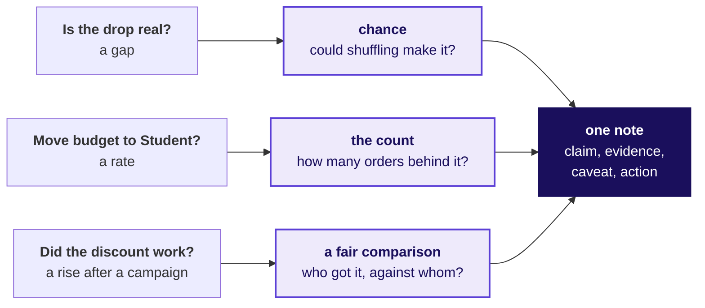
```mermaid
flowchart LR
    Q1["<b>Is the drop real?</b><br/>a gap"] --> H1["<b>chance</b><br/>could shuffling make it?"]
    Q2["<b>Move budget to Student?</b><br/>a rate"] --> H2["<b>the count</b><br/>how many orders behind it?"]
    Q3["<b>Did the discount work?</b><br/>a rise after a campaign"] --> H3["<b>a fair comparison</b><br/>who got it, against whom?"]
    H1 --> N["<b>one note</b><br/>claim, evidence,<br/>caveat, action"]
    H2 --> N
    H3 --> N
    classDef known fill:#EEEAFB,stroke:#5B3FD6,color:#1A0F5C,stroke-width:2px
    classDef bet fill:#1A0F5C,stroke:#1A0F5C,color:#FFFFFF
    class H1,H2,H3 known
    class N bet
```

The answer is b. Option d trusts the one party with a stake in the answer, and options a and c apply one tool to three different failures.

```notes
LIVE, 4 minutes. Draw this on the board and leave it there all day. Chapters 1 and 2 climb the
first habit, chapter 3 the second, chapters 4 and 6 the third, and chapter 5 writes the note on
the right. Say that every chapter ends on one line of that note.
```

---

## S4. The note Meera reads in two minutes
*Four parts, in order, and "not yet" is an answer when the evidence says so.*

```timeline
label: Part 1 | title: Claim | body: One sentence Meera can act on, with the number that carries it.
label: Part 2 | title: Evidence | body: The number with its denominator, its window and how it was checked.
label: Part 3 | title: Caveat | body: What would change the claim, said before anyone else says it.
label: Part 4 | title: Action | body: What to do next, and what it costs, including "wait and measure". | tone: dark
```

**In the interview.** [S] Explain a finding to a non-technical stakeholder.

```notes
LIVE, 4 minutes. Every chapter today ends on one line of this note. The caveat is the part most
analysts leave out and the part a CEO keeps them for. Model it once: "Not yet, and here is what
would tell us" is a claim, a caveat and an action in one sentence.
```

---

## S5. What the week has already settled
*Three days of work stand behind today's numbers, so today inherits them rather than redoing them.*

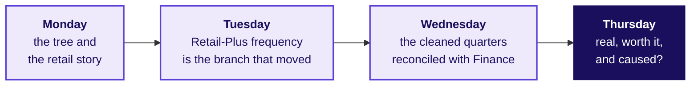
```mermaid
flowchart LR
    M["<b>Monday</b><br/>the tree and<br/>the retail story"] --> T["<b>Tuesday</b><br/>Retail-Plus frequency<br/>is the branch that moved"]
    T --> W["<b>Wednesday</b><br/>the cleaned quarters<br/>reconciled with Finance"]
    W --> R["<b>Thursday</b><br/>real, worth it,<br/>and caused?"]
    classDef known fill:#EEEAFB,stroke:#5B3FD6,color:#1A0F5C,stroke-width:2px
    classDef bet fill:#1A0F5C,stroke:#1A0F5C,color:#FFFFFF
    class M,T,W known
    class R bet
```

Today's file is Wednesday's cleaned two quarters, plus the Student segment's own orders and the campaigns table. Retail-Plus is Kalpa's membership tier, as Monday's domain story told it.

```notes
LIVE, 4 minutes. Name what not to redo: nobody re-cleans the file, and nobody re-derives the tree.
Recall from Monday's domain story (content/W01/D1/study-notes/C2_W01_D01_domain_retail_STUDENT.md)
that a membership tier is where a retailer's most frequent buyers sit, which is why a fall there
worries the head of the tier. Wednesday's return question is the Kahoot's last item.
Transition: a gap exists; chapter 1 asks whether chance alone could have made it.
```

---

## SECTION 1: Real, or the usual wobble
*Shuffle the quarter labels thousands of times and see how often chance alone makes a gap this large.*

```notes
LIVE. Thirty minutes: the need and the company (3), the options and the call (5), the ten cards by
hand (8, never cut), Retail-Core and the room's Retail-Plus run (6), the trap and its fix (5), the
second route (2), and Kavya's review (1). Notebook 1 runs beside it.
```

---

## S6. The need: is the Retail-Plus fall real
*Meera's first question, the metric at stake, and what a wrong call costs before Monday.*

```cards
icon: user | eyebrow: Who asks | title: Meera, the CEO | body: She decides on Monday whether the tier's fall gets a budget of its own.
icon: chart-line | eyebrow: The metric | title: Revenue per member | body: Delivered revenue per Retail-Plus member per quarter, Q1 against Q2.
icon: triangle-alert | eyebrow: A wrong call costs | title: A budget spent on noise | body: A wobble read as a real fall funds a fix for nothing, and a real fall read as wobble lets the tier drain. | tone: dark
```

```notes
LIVE, 2 minutes. Delivered revenue per member is the measure all day: Monday settled that
cancelled and returned orders are not money kept, and a member is the unit that exists in both
quarters. Write the measure on the board beside the tree.
```

---

## S7. Booking.com reads every change against chance
*A company that runs thousands of tests a year learned that most changes do nothing at all.*

```stats
value: 25,000 | label: tests a year | note: Booking.com, as Stefan Thomke reported in HBR in 2020
value: 1,000+ | label: running at once | note: at any point in time, the same source
value: 9 in 10 | label: ideas that were wrong | note: Thomke's account on HBR's podcast, 2019
```

When most changes are noise, the first question about any move is how often chance alone makes one that size.

```notes
LIVE, 1 minute. Sources: HBR, "Building a Culture of Experimentation" (2020), and the HBR podcast
"At Booking.com, Innovation Means Constant Failure" (2019).
Checked 30 September 2026: https://hbr.org/2020/03/building-a-culture-of-experimentation
Checked 30 September 2026: https://hbr.org/podcast/2019/09/at-booking-com-innovation-means-constant-failure
The 25,000 a year is Thomke's figure; say "about". The point: a company that tests constantly treats a gap as noise until it beats chance.
```

---

## S8. Four ways to ask "is it real?"
*Each option sized on this file: 44 member totals, one quarter against the other.*

| Option | What it touches | Time here | What it risks |
|---|---|---|---|
| A. Shuffle test | 44 totals, 5,000 deals | under a second | a few thousandths between seeds |
| B. Textbook two-sample test | 44 totals, one call | instant | assumes bell-shaped totals; 6 of 44 are zero |
| C. Bootstrap interval | 44 totals, 5,000 redraws | under a second | says how big more than how rare |
| D. Wait for Q3 | 22 more member-quarters | one quarter | Monday passes with no answer |

```notes
LIVE, 3 minutes. Compute decides nothing at 44 rows: every option is instant. What decides is the
shape of the data and the reader. Six members bought nothing in one of the quarters, which is the
lumpy shape a textbook formula assumes away. Notebook 1's sizing cell times each option live.
```

---

## S9. The call for Monday: the shuffle
*It assumes nothing about shape and Meera can watch it done with ten cards.*

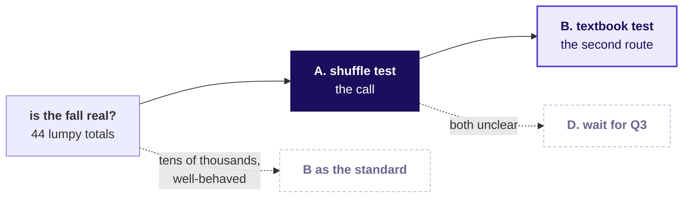
```mermaid
flowchart LR
    Q["<b>is the fall real?</b><br/>44 lumpy totals"] --> A["<b>A. shuffle test</b><br/>the call"]
    A --> X["<b>B. textbook test</b><br/>the second route"]
    A -.->|"both unclear"| D["<b>D. wait for Q3</b>"]
    Q -.->|"tens of thousands,<br/>well-behaved"| B["<b>B as the standard</b>"]
    classDef known fill:#EEEAFB,stroke:#5B3FD6,color:#1A0F5C,stroke-width:2px
    classDef unknown fill:#FFFFFF,stroke:#B8B2D6,color:#6B6690,stroke-dasharray:4 3
    classDef bet fill:#1A0F5C,stroke:#1A0F5C,color:#FFFFFF
    class A bet
    class X known
    class B,D unknown
```

**The fact that would change the call.** Tens of thousands of members and a well-behaved metric, where the textbook call gives the same answer in one line.

```notes
LIVE, 2 minutes. C, the bootstrap, returns in chapter 2 where the question becomes how big. Say
the switch fact aloud: at Booking.com's scale the textbook test is the house standard.
```

---

## S10. The chance reference: shuffle the labels
*If the quarter made no difference, the Q1 and Q2 labels are arbitrary, so mixing them changes nothing real.*

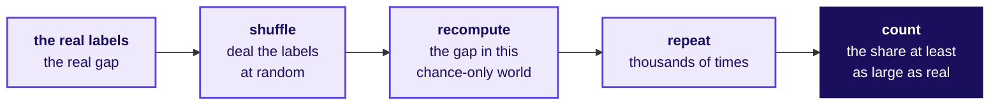
```mermaid
flowchart LR
    A["<b>the real labels</b><br/>the real gap"] --> B["<b>shuffle</b><br/>deal the labels<br/>at random"]
    B --> C["<b>recompute</b><br/>the gap in this<br/>chance-only world"]
    C --> D["<b>repeat</b><br/>thousands of times"]
    D --> E["<b>count</b><br/>the share at least<br/>as large as real"]
    classDef known fill:#EEEAFB,stroke:#5B3FD6,color:#1A0F5C,stroke-width:2px
    classDef bet fill:#1A0F5C,stroke:#1A0F5C,color:#FFFFFF
    class A,B,C,D known
    class E bet
```

That share has a name, the p-value, and it is only ever a share of chance-only worlds.

```notes
LIVE, 1 minute. Say the name once and move on; the definition earns its place after the room has
counted shares by hand. No formulas today, and no test catalogue.
```

---

## S11. Ten cards, shuffled by hand
*Five members' Q1 spend and five members' Q2 spend, in rupees, invented for the table.*

| Card | Q1, Rs | Card | Q2, Rs |
|---|---|---|---|
| A | 3,400 | F | 2,200 |
| B | 2,900 | G | 3,100 |
| C | 4,100 | H | 1,900 |
| D | 2,500 | I | 2,700 |
| E | 3,800 | J | 2,400 |
| **Mean** | **3,340** | **Mean** | **2,460** |

The real gap is Rs 880. Shuffle the ten cards, deal five to each pile, and write down the new gap. Ten shuffles per pair.

```notes
LIVE, 6 minutes, never cut. Hand each pair ten index cards with these amounts; the numbers are
invented and the slide says so. Each pair shuffles ten times and writes each gap on the board in a
row. Then count, as a room, how many gaps reached Rs 880 or more. Ask: if the quarter made no
difference, how surprising is 880? The guided sheet is exercises/guided/C2_W01_D04_ten_cards_STUDENT.md.
```

---

## S12. Question: is a gap of Rs 880 surprising?
*The room's shuffles are on the board, and the real gap sits among them.*

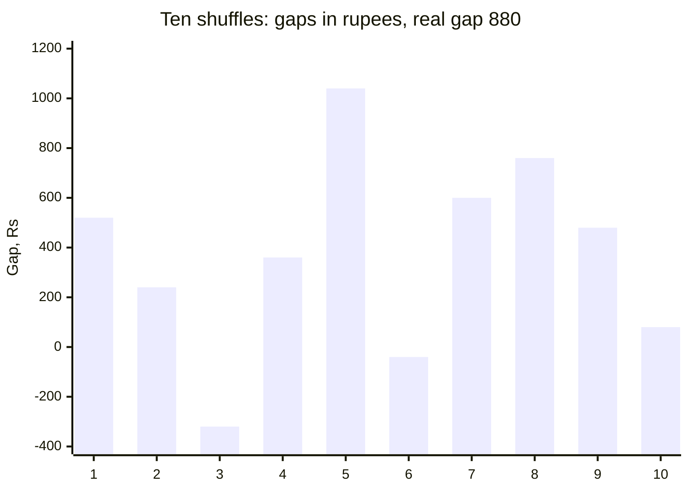
```mermaid
xychart-beta
    title "Ten shuffles: gaps in rupees, real gap 880"
    x-axis ["1", "2", "3", "4", "5", "6", "7", "8", "9", "10"]
    y-axis "Gap, Rs" -400 --> 1200
    bar [520, 240, -320, 360, 1040, -40, 600, 760, 480, 80]
```

**Question.** One shuffle in ten reached Rs 880. What do you say? a) the gap is real, since 880 is large; b) chance makes 880 often, so it is noise; c) ten shuffles are too few to say, so run many more; d) nothing, since shuffling destroys the data.

```notes
LIVE, 1 minute. These ten gaps are the first ten a seeded computer shuffle produced, a fair stand-in
for a pair's ten. Take letters. The trap is b: one in ten sounds common, but ten draws say almost
nothing about a share.
```

---

## S13. Answer: ten shuffles cannot measure a share
*A thousand shuffles by computer show 21 gaps at Rs 880 or more, a share of about 2 in 100.*

```stats
value: 1,000 | label: shuffles | note: the same ten cards, seeded
value: 21 | label: gaps of Rs 880 or more | note: in chance-only worlds
value: 0.021 | label: the share | note: this is the p-value
```

The answer is c. Ten hand shuffles taught what a shuffle is; a thousand measure how rare the real gap is.

```notes
LIVE, 1 minute. Say the sentence aloud: "If the quarter made no difference, a gap of Rs 880 or more
turns up in about 2 of every 100 shuffles." The loop in notebook 1 is twelve lines, and every line
is something the room just did with cards: pool, shuffle, deal, subtract, count.
```

---

## S14. The usual wobble, measured on Retail-Core
*Retail-Core spent Rs 110 less per member in Q2, and 5,000 shuffles make gaps like that all the time.*

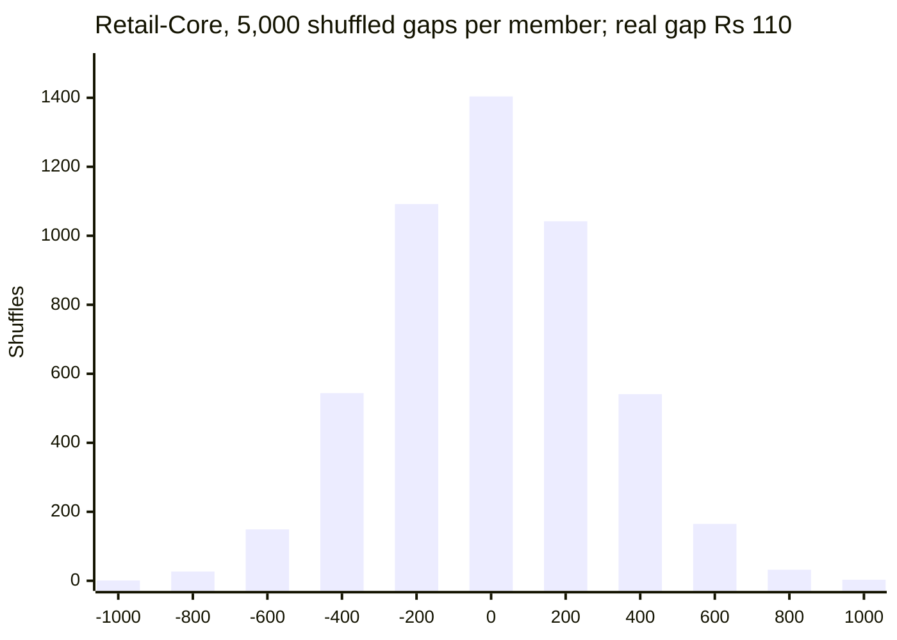
```mermaid
xychart-beta
    title "Retail-Core, 5,000 shuffled gaps per member; real gap Rs 110"
    x-axis ["-1000", "-800", "-600", "-400", "-200", "0", "200", "400", "600", "800", "1000"]
    y-axis "Shuffles" 0 --> 1500
    bar [1, 27, 149, 544, 1092, 1404, 1042, 541, 165, 32, 3]
```

The real gap is Rs 110 across 34 members. 1,724 of the 5,000 shuffles made a gap at least that large, a share of 0.34: an ordinary quarter.

```notes
LIVE, 3 minutes. Run live in notebook 1, level 2. The bars are chance-only worlds, and the real gap
sits in the tallest bar. Kavya's point: this is what "nothing happened" looks like, and the room
needs to have seen it before judging Retail-Plus.
```

---

## S15. Your turn: Retail-Plus, 5,000 shuffles
*The same loop on the segment Meera asked about, run by the room before anyone says a number.*

```timeline
label: Step 1 | title: The measure | body: Delivered revenue per Retail-Plus member, Q1 and Q2, notebook 1, level 3.
label: Step 2 | title: The real gap | body: Q1 mean less Q2 mean, printed in rupees before any shuffle runs.
label: Step 3 | title: The shuffles | body: 5,000, seed 2026, and the share at least as large as the real gap.
label: Step 4 | title: The first draft | body: One line to Meera on what your share means, written fast and kept. | tone: dark
```

```notes
LIVE, 3 minutes. The room runs level 3 of notebook 1 and writes a first-draft sentence without help.
Do not read a number out first; every laptop gets the same share because of the seed. Ask one pair
to read theirs aloud and write it on the board. That number belongs to the room, and the next
three slides work on it.
```

---

## S16. The plausible wrong answer
*A draft note, written in a hurry from the share the room has just computed.*

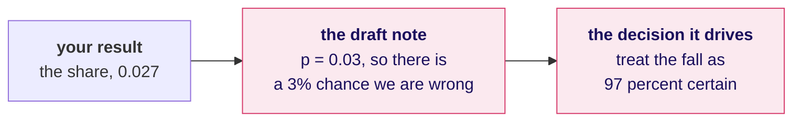
```mermaid
flowchart LR
    R["<b>your result</b><br/>the share, 0.027"] --> W["<b>the draft note</b><br/>p = 0.03, so there is<br/>a 3% chance we are wrong"]
    W --> D["<b>the decision it drives</b><br/>treat the fall as<br/>97 percent certain"]
    classDef bad fill:#FBE9EF,stroke:#D63A6A,color:#1A0F5C
    class W,D bad
```

**What breaks.** "p = 0.03, so there is a 3% chance we are wrong about the drop" reads as precise, sounds like probability, and sends Meera into Monday certain.

```notes
LIVE, 2 minutes. Put the sentence up next to the room's share and ask whose first draft looks like
it. Most hands go up; it is the most common p-value sentence in industry. The next slide corrects it.
```

---

## S17. Why it is wrong: counted in a no-change world
*Every shuffle assumed the quarter made no difference, so the share says nothing about being wrong.*


```mermaid
xychart-beta
    title "Invented: twenty segments where nothing changed, each tested"
    x-axis ["1", "2", "3", "4", "5", "6", "7", "8", "9", "10", "11", "12", "13", "14", "15", "16", "17", "18", "19", "20"]
    y-axis "Share" 0 --> 1
    bar [0.383, 0.288, 0.191, 0.385, 0.833, 0.929, 0.071, 0.005, 0.971, 0.635, 0.585, 0.367, 0.108, 0.867, 0.576, 0.604, 0.663, 0.768, 0.609, 0.484]
```

**The check.** One no-change segment came back at 0.005. Its note would say "a 0.5 percent chance we are wrong", and it would be wrong for certain.

```notes
LIVE, 2 minutes. These are notebook 1's twenty invented segments with nothing changed, the shares
its run produced. Segment 8 comes back at 0.005. Ask of any p-value sentence: in which world was
this share counted? The chance that a finding is wrong depends on what the shuffle never saw: how
plausible a fall was before the data, what else changed, and how many segments were tested.
```

---

## S18. The fix: the sentence that survives an audit
*Say the share, the world it was counted in, and what it lets you conclude, in that order.*

| Draft | Rewritten |
|---|---|
| "There is a 3% chance we are wrong." | "If nothing had changed between the quarters, a fall of Rs 1,110 per member or more would turn up in about 3 of every 100 shuffles." |
| "The drop is 97 percent certain." | "Chance alone rarely makes a fall this large, so we treat the drop as real." |
| "p = 0.03, so it is significant." | "The fall is larger than the usual wobble; its size is the next question." |

**The rule.** A p-value is a share of chance-only worlds; it is never the chance the finding is wrong.

```notes
LIVE, 1 minute. The number stays 0.027; the claim shrinks from "97 percent certain" to "larger than
the usual wobble". Each pair rewrites its first draft in the right-hand form.
```

---

## S19. A second route: the textbook test agrees
*The library's two-sample test, named today and taught later, reaches the same verdict.*

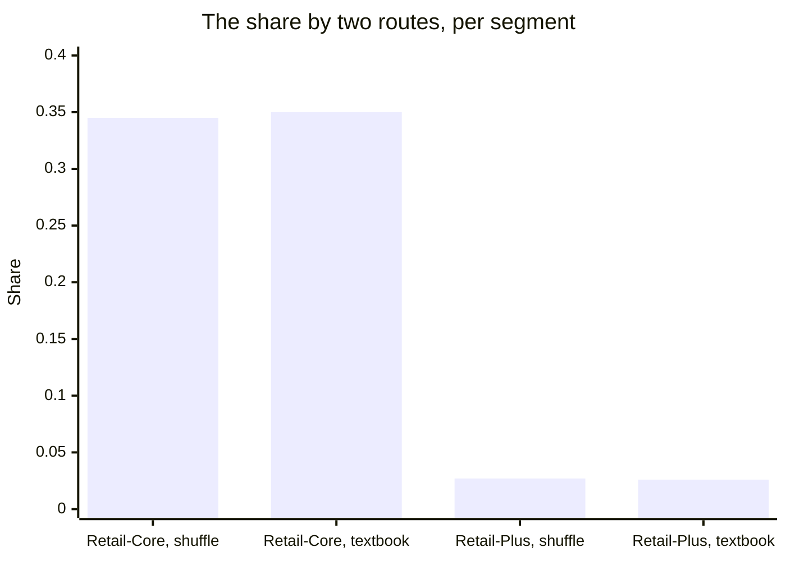
```mermaid
xychart-beta
    title "The share by two routes, per segment"
    x-axis ["Retail-Core, shuffle", "Retail-Core, textbook", "Retail-Plus, shuffle", "Retail-Plus, textbook"]
    y-axis "Share" 0 --> 0.4
    bar [0.345, 0.350, 0.027, 0.026]
```

**When to switch.** The textbook call for large, well-behaved data or a team standard; the shuffle for small or lumpy data, or when the reader needs to see how it was made.

```notes
LIVE, 2 minutes. Notebook 1's second route. Two routes built on different ideas land within a
thousandth or so, so the verdict can go in the note. The formula behind the textbook test is a
later week's topic; today it is a second opinion.
```

---

## S20. Kavya's review of chapter 1
*A senior reads the sentence before the number, because the sentence is what Meera repeats.*

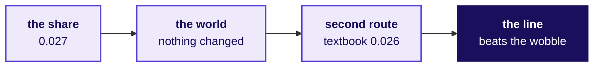
```mermaid
flowchart LR
    K0["<b>the share</b><br/>0.027"]
    K1["<b>the world</b><br/>nothing changed"]
    K2["<b>second route</b><br/>textbook 0.026"]
    K3["<b>the line</b><br/>beats the wobble"]
    K0 --> K1 --> K2 --> K3
    classDef known fill:#EEEAFB,stroke:#5B3FD6,color:#1A0F5C,stroke-width:2px
    classDef bet fill:#1A0F5C,stroke:#1A0F5C,color:#FFFFFF
    class K0,K1,K2 known
    class K3 bet
```

**Kavya's review.** Retail-Core's third is the baseline, Retail-Plus's 0.03 is the gap against it, the textbook test agrees, and your sentence would still be true if the drop turned out to be a fluke. Now tell me how much money it is.

**In the interview.** [S] What does p = 0.03 mean, and not mean? [S] How do you know whether a change in a metric is significant? [D] A shuffle test, a textbook test, or wait a quarter: which do you run for a CEO's Monday?

```notes
LIVE, 1 minute. The answers are in notebook 1 and in one breath in the afternoon drill. The
chapter 1 set (exercises/unguided/C2_W01_D04_ch1_real_or_wobble_STUDENT.md) is self-study or the
lab's warm-up if the chapter ran to time. Transition: Retail-Plus beat the wobble; is it worth money?
```

---

## SECTION 2: Real, and worth acting on
*A gap can beat chance and still be too small to spend on, so size it in rupees before ranking it.*

```notes
LIVE. Thirty minutes: the need and the company (3), the options and the call (4), the two axes (3),
the trap and its check (7), the sizing and the offer (8), the second route (4), and Kavya's review
(1). Notebook 2 runs beside it.
```

---

## S21. The need: what does the tier get to fix it
*The head of Retail-Plus wants a retention budget, and Meera has to weigh it against the quarter.*

**The client asks.** "So my tier really is slipping. What do I get to fix it?" The head of Retail-Plus, before the growth review

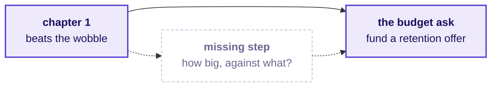
```mermaid
flowchart LR
    S["<b>chapter 1</b><br/>beats the wobble"] --> B["<b>the budget ask</b><br/>fund a retention offer"]
    S -.-> Q["<b>missing step</b><br/>how big, against what?"]
    Q -.-> B
    classDef known fill:#EEEAFB,stroke:#5B3FD6,color:#1A0F5C,stroke-width:2px
    classDef unknown fill:#FFFFFF,stroke:#B8B2D6,color:#6B6690,stroke-dasharray:4 3
    class S,B known
    class Q unknown
```

```notes
LIVE, 2 minutes. The metric is the same revenue per member, now multiplied out to rupees a quarter.
A wrong call either funds an offer that cannot pay back or ignores a fall that keeps draining the
tier. Ask what the missing box should hold before anyone talks budget.
```

---

## S22. Microsoft Bing: the size in money decided
*One small change was worth a fortune, and most changes were worth nothing, so size told them apart.*

```stats
value: 12% | label: revenue lift | note: a change to how Bing showed ad headlines
value: $100M+ | label: a year, US alone | note: Kohavi and Thomke, HBR, 2017
value: 1 in 3 | label: experiments that helped | note: Kohavi and others, Microsoft, 2009
```

A test that says "real" is the start of the question. The rupees, beside the cost, finish it.

```notes
LIVE, 1 minute. Sources: HBR, "The Surprising Power of Online Experiments" (2017) for the 12
percent and the 100 million dollars; "Online Experimentation at Microsoft" (2009) for about a third
of experiments improving the metric they were built for.
Checked 30 September 2026: https://hbr.org/2017/09/the-surprising-power-of-online-experiments
Checked 30 September 2026: https://ai.stanford.edu/~ronnyk/ExPThinkWeek2009Public.pdf
```

---

## S23. Four ways to answer "worth acting on"
*Rank, size against the tier, size against the company and the cost, or read a range.*

| Option | What it does | What it risks |
|---|---|---|
| A. Rank by p-value | Fix the smallest share first | Ranks a Rs 24,420 fall above a Rs 6 lakh move |
| B. Against the segment | The fall as a share of the tier | A third of a small tier reads as a crisis |
| C. Against company and cost | Rupees beside the quarter and the offer, with a break-even | Needs a cost; today's is assumed |
| D. Bootstrap range | How small or large the fall could be | A stakeholder has to read a range |

**The call.** C, with D as the second route. **What would change it.** A recovery rate from a past retention offer, which lets C decide alone.

```notes
LIVE, 4 minutes. Every option runs in under a second on this file; notebook 2's sizing cell times
them. The call follows the decision: a budget line needs rupees beside the quarter and the cost.
```

---

## S24. Real and important are two different axes
*Every finding lands in one of four boxes, and only one box earns a budget line on Monday.*

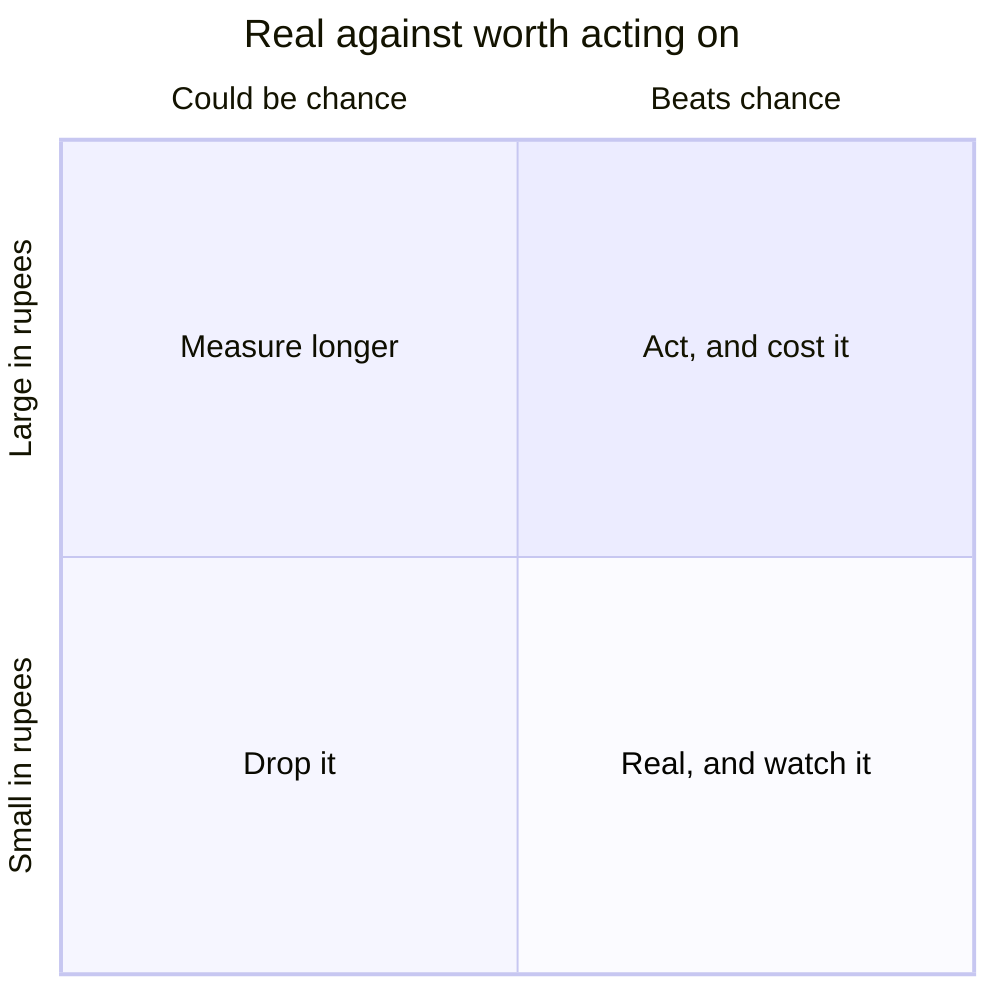
```mermaid
quadrantChart
    title Real against worth acting on
    x-axis Could be chance --> Beats chance
    y-axis Small in rupees --> Large in rupees
    quadrant-1 Act, and cost it
    quadrant-2 Measure longer
    quadrant-3 Drop it
    quadrant-4 Real, and watch it
```

A finding can beat chance and sit in the bottom right. A large gap on few members can sit top left.

```notes
LIVE, 3 minutes. Ask where Retail-Core's Rs 110 belongs: bottom left. Hold Retail-Plus until the
room has sized it. The quadrant is the day's second board drawing.
```

---

## S25. The plausible wrong answer: ranked by share
*The draft ranks Retail-Plus first because its share is the smallest on the page.*

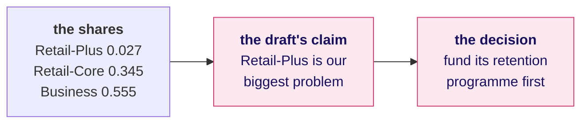
```mermaid
flowchart LR
    P["<b>the shares</b><br/>Retail-Plus 0.027<br/>Retail-Core 0.345<br/>Business 0.555"] --> C["<b>the draft's claim</b><br/>Retail-Plus is our<br/>biggest problem"]
    C --> D["<b>the decision</b><br/>fund its retention<br/>programme first"]
    classDef bad fill:#FBE9EF,stroke:#D63A6A,color:#1A0F5C
    class C,D bad
```

**What breaks.** "Significant" becomes "big", and the smallest share becomes the first budget line.

```notes
LIVE, 2 minutes. This is the second trap of the day and the one that costs money. Ask what the
share would be for a twenty-rupee gap on twenty thousand orders. Take guesses; the next slide shows it.
```

---

## S26. Why it is wrong: big samples make tiny gaps real
*With enough orders, chance never makes even a trivial gap, so a small share can carry a tiny finding.*


```mermaid
xychart-beta
    title "Invented: the same Rs 20 gap, tested on more orders"
    x-axis ["100", "1,000", "5,000", "20,000"]
    y-axis "Share" 0 --> 0.5
    line [0.446, 0.292, 0.076, 0.002]
```

**The check.** Put the rupees beside the share: Retail-Plus fell Rs 24,420 in the quarter while Business moved Rs 6,18,460.

```notes
LIVE, 3 minutes. The orders are invented in notebook 2, level 3, and the gap is Rs 20 at every
size. The share falls from 0.45 to 0.002 on sample size alone. The share measures how surely a gap
beats chance; it never measures how big the gap is.
```

---

## S27. The check: the gap in rupees, three ways
*Per member, for the whole segment, and as a share of the company's quarter.*

```timeline
label: Per member | title: The gap | body: Q1 mean less Q2 mean: Rs 1,110 of delivered revenue.
label: Segment | title: Times members | body: Rs 1,110 times 22 members is Rs 24,420 a quarter, a third of the tier.
label: Company | title: Against the quarter | body: Rs 24,420 over Rs 1,28,64,680 is 0.19 percent.
label: Decision | title: Against the cost | body: The fall a quarter against what the fix costs a quarter. | tone: dark
```

**The rule.** Real and worth acting on are two separate calls: the shuffle answers the first, rupees against cost answer the second.

```notes
LIVE, 2 minutes. The room computes these in notebook 2, levels 1 and 2. Business carries the
company's quarter, which is why every consumer segment's move is small against it.
```

---

## S28. Where the company's delivered revenue sits
*Business carries the quarter, so every consumer segment's gap is small against the whole.*

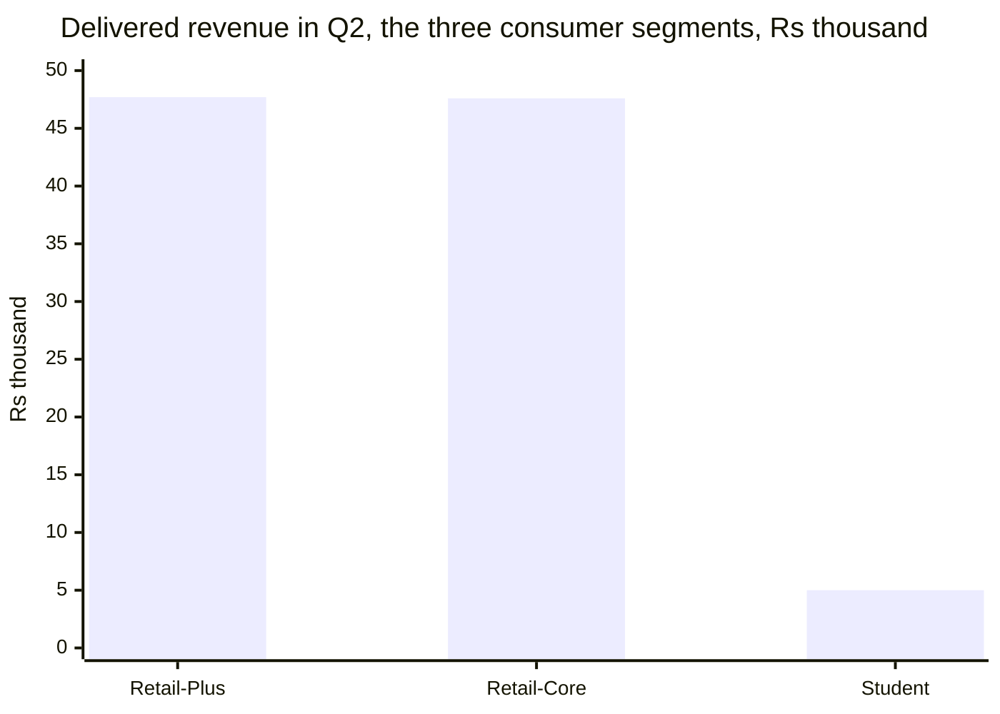
```mermaid
xychart-beta
    title "Delivered revenue in Q2, the three consumer segments, Rs thousand"
    x-axis ["Retail-Plus", "Retail-Core", "Student"]
    y-axis "Rs thousand" 0 --> 50
    bar [47.7, 47.6, 5.0]
```

Business delivered Rs 1,27,64,460 in the same quarter, about 268 times Retail-Plus, so on this axis its bar would stand 268 times as tall.

```notes
LIVE, 1 minute. The chart draws the consumer segments alone so their bars stand in proportion; with
Business on one axis all three would sit on the floor. Company Q2 delivered revenue: Rs 1,28,64,680.
```

---

## S29. Question: what must the offer win back?
*The head of Retail-Plus proposes a retention offer of Rs 500 per member a quarter, a figure assumed for the chapter.*

```stats
value: Rs 24,420 | label: the fall | note: a quarter, the whole tier
value: 22 | label: members | note: in both quarters
value: Rs 500 | label: the offer | note: per member a quarter, assumed
```

**Question.** What share of the fall must the offer win back just to pay for itself in revenue? a) all of it; b) about 45 percent; c) about 5 percent; d) none, since any recovery is a gain.

```notes
LIVE, 2 minutes. No Kalpa figure exists for the offer's cost; the notebook labels it assumed. Pairs
work it on paper before running notebook 2, level 4.
```

---

## S30. Answer: about 45 percent, before margin
*Rs 11,000 a quarter against a Rs 24,420 fall, so the offer must win back almost half.*

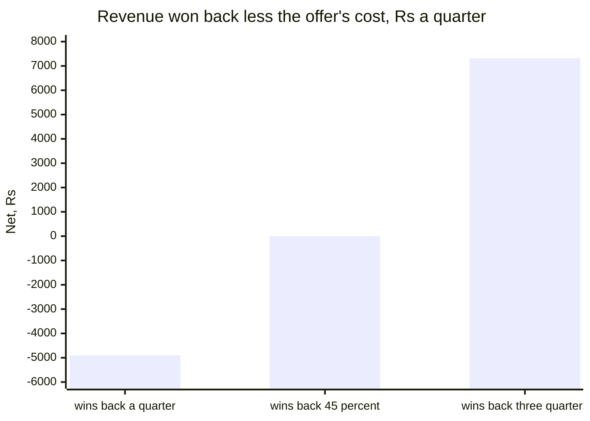
```mermaid
xychart-beta
    title "Revenue won back less the offer's cost, Rs a quarter"
    x-axis ["wins back a quarter", "wins back 45 percent", "wins back three quarters"]
    y-axis "Net, Rs" -6000 --> 8000
    bar [-4895, 0, 7315]
```

The answer is b. The decision rests on a recovery rate nobody has measured, which is what the note should say.

```notes
LIVE, 2 minutes. At an assumed 30 percent margin (notebook 2's depth section) the offer would need
to win back more than the whole fall. Say that revenue is not margin, once.
```

---

## S31. A second route: the bootstrap range
*Redraw each quarter's members 5,000 times and read the middle 95 percent of the gaps.*

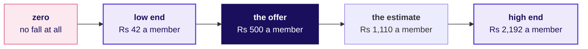
```mermaid
flowchart LR
    Z["<b>zero</b><br/>no fall at all"] --> L["<b>low end</b><br/>Rs 42 a member"]
    L --> O["<b>the offer</b><br/>Rs 500 a member"]
    O --> R["<b>the estimate</b><br/>Rs 1,110 a member"]
    R --> H["<b>high end</b><br/>Rs 2,192 a member"]
    classDef bad fill:#FBE9EF,stroke:#D63A6A,color:#1A0F5C
    classDef known fill:#EEEAFB,stroke:#5B3FD6,color:#1A0F5C,stroke-width:2px
    classDef bet fill:#1A0F5C,stroke:#1A0F5C,color:#FFFFFF
    class Z bad
    class L,H known
    class O bet
```

The range stays above zero, the same verdict as the shuffle, and the offer sits inside it. That range is a **confidence interval**; building one properly comes later.

```notes
LIVE, 4 minutes. About 2 in 100 redraws land at or below zero, against the shuffle's 0.027: two
routes, one verdict. The low end, about Rs 920 a quarter for the tier, is why the offer goes to half
the members first. CUT FIRST if the chapter runs long: say the name and the verdict only.
```

---

## S32. Kavya's review of chapter 2
*A senior asks for the size before the significance, because size is what gets funded.*

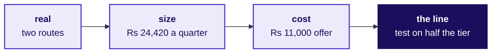
```mermaid
flowchart LR
    K0["<b>real</b><br/>two routes"]
    K1["<b>size</b><br/>Rs 24,420 a quarter"]
    K2["<b>cost</b><br/>Rs 11,000 offer"]
    K3["<b>the line</b><br/>test on half the tier"]
    K0 --> K1 --> K2 --> K3
    classDef known fill:#EEEAFB,stroke:#5B3FD6,color:#1A0F5C,stroke-width:2px
    classDef bet fill:#1A0F5C,stroke:#1A0F5C,color:#FFFFFF
    class K0,K1,K2 known
    class K3 bet
```

**Kavya's review.** Real, yes, by two routes. Worth Rs 24,420 a quarter, small against Business and a third of the tier. The range dips below what the offer costs, so offer it to half, hold back half, and measure. That is a watch item with a test attached, never a budget line.

**In the interview.** [F] A metric moved and the test says significant; how do you decide whether the business should act? [D] Rank by p-value, by rupees, or by rupees against the cost: which goes to the budget meeting?

```notes
LIVE, 1 minute. The answers are in notebook 2. Transition: Meera's second question is about a
rise, the biggest on the page, and it needs a different check first.
```

---

## SECTION 3: The count behind 40 percent
*A rate is only as good as the count it stands on, so count before you repeat it.*

```notes
LIVE. Thirty minutes: the need and the company (3), the options and the call (4), the check first
(3), the trap (3), why small counts swing (4), the room's count and flips (7), the interview pair
(3), the second route (2), and Kavya's review (1). Notebook 3 runs beside it.
```

---

## S33. The need: should budget move to Student
*Student rose 40 percent, the fastest rise on the page, and Meera asked about it by name.*

**The client asks.** "Student is up 40 percent; should I move budget there?" Meera Raghavan

```cards
icon: chart-bar | eyebrow: The metric | title: Orders a quarter | body: Student's Q2 orders for every 100 in Q1, beside every other segment's.
icon: wallet | eyebrow: What rides on it | title: Acquisition budget | body: Money moved to the fastest riser, before anyone asks what the rise stands on.
icon: triangle-alert | eyebrow: A wrong call costs | title: A quarter's spend | body: Budget follows a rate that may be flat next quarter. | tone: dark
```

```notes
LIVE, 2 minutes. Read Meera's question. Ask which number the room would want beside the 40 percent
before answering. Hold the answers; the question slide asks it properly.
```

---

## S34. Small schools topped the charts, and the bottom
*Small groups swing further in both directions, and a foundation learned it at scale.*

```stats
value: 3% | label: expected | note: small schools among the best, if size did not matter
value: 12% | label: found | note: small schools among the best, Wainer's data
value: $1.7B | label: to education projects | note: the Gates Foundation, by 2001
```

Howard Wainer showed small schools were over-represented among the worst as well: small counts produce extremes at both ends.

```notes
LIVE, 1 minute. Source: Howard Wainer, "The Most Dangerous Equation", reprinted in Picturing the
Uncertain World (Princeton University Press, 2009).
Checked 30 September 2026: https://assets.press.princeton.edu/chapters/s8863.pdf
The Foundation backed small schools partly because they appeared at the top; Wainer's point is
that they appeared at the bottom too.
```

---

## S35. Four ways to answer "follow the 40 percent"
*Trust it, test it on its count, apply the rule of thumb, or wait for more orders.*

| Option | What it does | What it risks |
|---|---|---|
| A. Trust the headline | Fund the fastest riser | Budget follows a coin |
| B. Coin-flip reference | Deal each order to a quarter by coin, 5,000 times | Nothing, once the count is found |
| C. Rule of thumb | Under thirty observations, a rate is a lead | Says careful, never how careful |
| D. Wait for thirty orders | Hold the decision | Several quarters at today's pace |

**The call.** B, said with C. **What would change it.** A cheap way to buy Student orders fast, which turns D into a two-week experiment.

```notes
LIVE, 4 minutes. Notebook 3's sizing cell runs B in well under a second. D is the action the
answer leads to; the note names the count that would reopen the question.
```

---

## S36. Question: what do you check before answering?
*Meera wants a yes or no on Student, and one check comes before any other.*

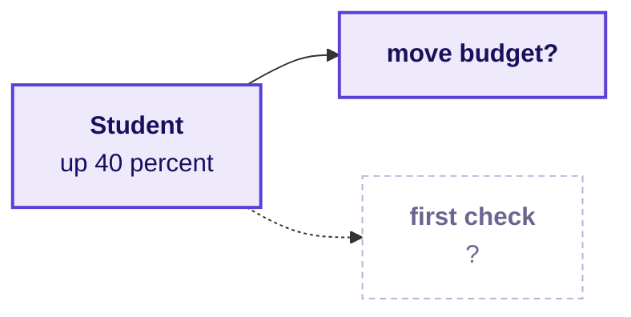
```mermaid
flowchart LR
    R["<b>Student</b><br/>up 40 percent"] --> B["<b>move budget?</b>"]
    R -.-> C["<b>first check</b><br/>?"]
    classDef known fill:#EEEAFB,stroke:#5B3FD6,color:#1A0F5C,stroke-width:2px
    classDef unknown fill:#FFFFFF,stroke:#B8B2D6,color:#6B6690,stroke-dasharray:4 3
    class R,B known
    class C unknown
```

**Question.** What do you check first? a) the rise in rupees, since money is what moves; b) the number of orders and customers the rate stands on; c) whether 40 percent beats every other segment; d) Student's rise in the previous year.

```notes
LIVE, 1 minute. Letters. Expect a, which is chapter 2's habit, and c, which is the headline habit.
Both are reasonable later steps and neither comes first.
```

---

## S37. Answer: count what the rate stands on
*Forty percent of a handful is a few orders, and a few orders move by chance every quarter.*

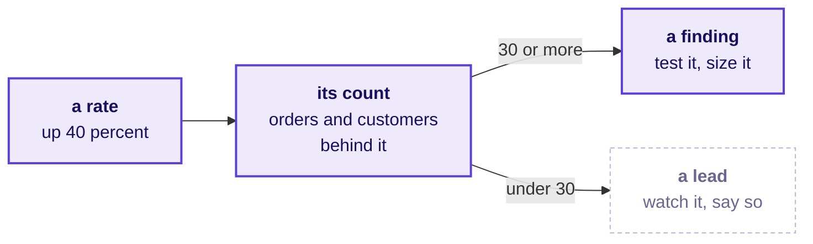
```mermaid
flowchart LR
    R["<b>a rate</b><br/>up 40 percent"] --> N["<b>its count</b><br/>orders and customers<br/>behind it"]
    N -->|"30 or more"| F["<b>a finding</b><br/>test it, size it"]
    N -->|"under 30"| L["<b>a lead</b><br/>watch it, say so"]
    classDef known fill:#EEEAFB,stroke:#5B3FD6,color:#1A0F5C,stroke-width:2px
    classDef unknown fill:#FFFFFF,stroke:#B8B2D6,color:#6B6690,stroke-dasharray:4 3
    class R,N,F known
    class L unknown
```

The answer is b. Rupees and rankings come after the count, because a rate on a handful can rank first by accident.

```notes
LIVE, 2 minutes. Do not say Student's count. The room counts it in notebook 3's empty cell.
```

---

## S38. The plausible wrong answer
*The draft leads with the biggest rate on the page and moves money to it.*

```mermaid
flowchart LR
    H["<b>the headline</b><br/>Student +40, Retail-Core -3,<br/>Business -6, Retail-Plus -35"] --> C["<b>the draft</b><br/>Student is up 40 percent,<br/>the fastest on the page"]
    C --> D["<b>the decision</b><br/>move acquisition<br/>budget to Student"]
    classDef bad fill:#FBE9EF,stroke:#D63A6A,color:#1A0F5C
    class C,D bad
```

**What breaks.** A rate travels without its count, and the budget follows the rate.

```notes
LIVE, 3 minutes. The rate is correct arithmetic. What is wrong is repeating it without the count,
the same mistake as Monday's number without its definition.
```

---

## S39. Why it is wrong: small counts swing by chance
*Split a small number of orders between two quarters at random, and big rises appear on their own.*

```mermaid
xychart-beta
    title "Chance of a 40 percent rise from coin-flip splits alone"
    x-axis ["10", "20", "30", "50", "100", "200", "400"]
    y-axis "Share of chance-only worlds" 0 --> 0.4
    line [0.377, 0.252, 0.181, 0.101, 0.044, 0.010, 0.0004]
```

With ten orders, more than a third of chance-only worlds show a 40 percent rise. With four hundred, almost none do.

```notes
LIVE, 4 minutes. The chart is exact arithmetic on fair coin flips, one flip per order deciding its
quarter, with no Kalpa data in it. Ten orders, 38 percent of worlds; four hundred, four in ten
thousand. That curve is why the rule of thumb exists.
```

---

## S40. Your turn: Student, counted and flipped
*The room counts the orders behind the 40 percent, flips them, and writes Meera's line.*

```cards
icon: hash | eyebrow: Level 2 | title: Count | body: Orders and distinct customers, Q1 and Q2, in the empty cell of notebook 3.
icon: shuffle | eyebrow: Level 3 | title: Flip | body: A coin per order, 5,000 times; the share with a 40 percent rise or more.
icon: message-square | eyebrow: The note | title: One line | body: The rate, its count, and what would make it a finding. | tone: dark
```

```notes
LIVE, 7 minutes. The count is the room's discovery; do not say it. When a pair has it, ask how many
customers stand behind the orders, and watch the faces. The flips come back near four in ten.
Collect two lines aloud.
```

---

## S41. Question: 42 percent on 12, or 31 on 1,200?
*The interview's version of Student, asked with users where Kalpa has orders.*

**In the interview.** [F] 42 percent on 12 users against 31 percent on 1,200; which do you trust?

**Question.** Which answer earns the offer? a) 42 percent, since it is higher; b) 31 percent, since 1,200 is more; c) 31 percent as the estimate, 42 percent as a lead to measure further; d) neither, since they cannot be compared.

```notes
LIVE, 2 minutes. Letters, then one learner answers aloud in thirty seconds. Listen for the count,
the swing, and what they would do next.
```

---

## S42. Answer: trust the count, keep the lead
*One user moves a rate on twelve by eight points, so 42 is a lead and 31 is the estimate.*

| | 42 percent on 12 | 31 percent on 1,200 |
|---|---|---|
| One person changes it by | about 8 points | under a tenth of a point |
| What it is | a lead to measure | an estimate to use |
| What you say | "promising, measure more" | "our working number" |

The answer is c. Option b is right for the wrong reason: 1,200 makes 31 stable, and stability is what earns trust.

```notes
LIVE, 1 minute. Notebook 3, level 4: a true 31 percent shows 42 or more in about 31 percent of
groups of twelve, and groups of 1,200 land between about 28 and 35 percent.
```

---

## S43. A second route: count every possible deal
*With a count this small, every way of dealing the orders to two quarters can be listed and counted.*

```stats
value: 0.397 | label: coin flips | note: 5,000 sampled worlds
value: 0.387 | label: every deal, counted | note: the exact share
value: 4 in 10 | label: the verdict | note: chance makes Meera's headline often
```

**When to switch.** Count every deal while the count is small enough to list; flip coins once the list runs into the billions.

```notes
LIVE, 2 minutes. Notebook 3's second route. The two routes land within a point. Do not name the
number of deals, which would give the count away.
```

---

## S44. Kavya's review of chapter 3
*A senior repeats a rate only with its count beside it, every time.*

```mermaid
flowchart LR
    K0["<b>the rate</b><br/>up 40 percent"]
    K1["<b>the count</b><br/>under thirty"]
    K2["<b>chance</b><br/>about 4 in 10"]
    K3["<b>the line</b><br/>not yet, watch it"]
    K0 --> K1 --> K2 --> K3
    classDef known fill:#EEEAFB,stroke:#5B3FD6,color:#1A0F5C,stroke-width:2px
    classDef bet fill:#1A0F5C,stroke:#1A0F5C,color:#FFFFFF
    class K0,K1,K2 known
    class K3 bet
```

**Kavya's review.** Student's rise is real arithmetic on too few orders to act on. Count them, say how often chance makes the rise, and give Meera the count that would reopen it. That is a complete answer, and it costs nothing to be right later.

**In the interview.** [F] 42 percent on 12 users against 31 percent on 1,200; which do you trust? [D] A segment is up 40 percent and the CEO wants to move budget: trust, test or wait?

```notes
LIVE, 1 minute. The line for the note: "Not yet: we watch Student until it carries thirty orders a
quarter before any budget moves." Break for 10 minutes after this slide.
```

---

## SECTION 4: The discount, split by segment
*A campaign's lift is a comparison of two groups, so check who is in each group before trusting it.*

```notes
LIVE. Thirty minutes: the need and the companies (4), the options and the call (4), Marketing's
number reproduced (3), the trap (3), why it can be wrong (4), the room's split (6), the fix (2),
the second route (3), and Kavya's review (1). Notebook 4 runs beside it.
```

---

## S45. The need: did the monsoon sale work
*Marketing says it lifted revenue 6 percent and wants it again for Diwali, at 15 percent off.*

**The client asks.** "Did the discount work, or did those customers buy anyway?" Meera Raghavan, with the marketing lead's report open

```stats
value: 15% | label: off | note: Monsoon Sale, 5 to 19 August, aimed at Retail-Plus
value: 6% | label: the claimed lift | note: the marketing lead's report
value: 17.6% | label: more orders | note: needed at 15 percent off just to stand still
```

```notes
LIVE, 2 minutes. The 17.6 percent is Monday's rule: at 15 percent off, orders must rise by 1 over
0.85 less 1 to keep revenue flat. A sale that did not lift spend gives margin away. The metric:
August revenue per customer, for customers who got the sale against customers who did not.
```

---

## S46. A sale's lift, and a blend that reverses
*A marketplace reads every sale's lift, and a university's admissions show how a blend can mislead.*

```cards
icon: shopping-cart | eyebrow: A marketplace | title: Flipkart, Big Billion Days | body: The 2022 sale ran 23 to 30 September and passed a billion customer visits for the first time; the question is which customers the rise came from.
icon: graduation-cap | eyebrow: A public case | title: UC Berkeley, 1973 | body: About 44 percent of men and 35 percent of women were admitted overall; department by department the small bias ran in favour of women. | tone: dark
```

```notes
LIVE, 2 minutes. Sources: Walmart's corporate newsroom, 25 October 2022; Bickel, Hammel and
O'Connell, Science, 1975, as quoted by Alex Reinhart (8,442 men, 4,321 women).
Checked 30 September 2026: https://corporate.walmart.com/news/2022/10/25/ahead-of-the-u-s-holidays-indias-shoppers-and-sellers-go-big
Checked 30 September 2026: https://www.refsmmat.com/posts/2016-05-08-simpsons-paradox-berkeley.html
Women applied more to departments that admitted few applicants. Do not draw the Kalpa parallel;
the room finds it.
```

---

## S47. Four ways to answer "did the discount work"
*Each compares two things, and each rests on a different assumption.*

| Option | What it compares | What it risks |
|---|---|---|
| A. Before and after | The sale month against the month before | Everything else that changed that month |
| B. Blended | Everyone who got it against everyone who did not | Two groups built from different customers |
| C. Inside each segment | The same comparison, segment by segment | Anything that differs inside a segment |
| D. Both on one mix | Segment averages weighted to one mix | The same as C, said as one number |

**The call.** C, with D as the second route. **What would change it.** A group chosen at random, which makes B fair.

```notes
LIVE, 3 minutes. All four run instantly on 160 customers; notebook 4's sizing cell shows it. The
call rests on one check the notebook runs before any spend is compared: who is in each group. A
returns in chapter 6.
```

---

## S48. Question: does Marketing's number reproduce?
*Before disagreeing with anyone's number, rebuild it from the same tables.*

```mermaid
flowchart LR
    E["<b>exposure table</b><br/>160 customers,<br/>got it or not"] --> A["<b>everyone who got it</b><br/>August revenue<br/>per customer"]
    E --> B["<b>everyone who did not</b><br/>August revenue<br/>per customer"]
    A --> L["<b>the lift</b><br/>?"]
    B --> L
    classDef known fill:#EEEAFB,stroke:#5B3FD6,color:#1A0F5C,stroke-width:2px
    classDef unknown fill:#FFFFFF,stroke:#B8B2D6,color:#6B6690,stroke-dasharray:4 3
    class E,A,B known
    class L unknown
```

**Question.** Marketing's lift will come out at: a) about 6 percent, as reported; b) about 3 percent; c) negative; d) impossible to reproduce from these tables.

```notes
LIVE, 1 minute. Predict, then run notebook 4, level 1.
```

---

## S49. Answer: 6.1 percent, as reported
*Marketing's arithmetic is right, which is why the next step matters.*

```stats
value: Rs 3,395 | label: got the sale | note: August revenue per customer
value: Rs 3,200 | label: did not | note: August revenue per customer
value: +6.1% | label: the blended lift | note: Marketing's number, reproduced
```

The answer is a. Reproducing the number first is what keeps Monday civil.

```notes
LIVE, 2 minutes. Say it plainly: nobody made an arithmetic mistake. The question is whether the
comparison is fair.
```

---

## S50. The plausible wrong answer
*The draft trusts the reproduced number and writes the plan.*

```mermaid
flowchart LR
    N["<b>the reproduced number</b><br/>Rs 3,395 against<br/>Rs 3,200, +6.1%"] --> C["<b>the draft</b><br/>the discount worked"]
    C --> D["<b>the decision</b><br/>repeat it for Diwali<br/>at 15 percent off"]
    classDef bad fill:#FBE9EF,stroke:#D63A6A,color:#1A0F5C
    class C,D bad
```

**What breaks.** "The discount worked: exposed customers spent Rs 3,395 against Rs 3,200, up 6.1%; repeat it for Diwali." A correct number on a comparison nobody checked.

```notes
LIVE, 3 minutes. Ask what would have to be true of the two groups for this sentence to hold. Take
two answers. The next slide shows, on invented stores, how a blend can say the opposite of its parts.
```

---

## S51. Why it can be wrong: a blend of unlike groups
*Invented: two stores, a promotion, and a total that rises while both stores fall.*

| Invented | Promoted customers | Others |
|---|---|---|
| Big store, spend per customer | Rs 900 (8 of 10 promoted) | Rs 1,000 (2 of 10 others) |
| Small store, spend per customer | Rs 180 (2 of 10 promoted) | Rs 200 (8 of 10 others) |
| **Blended** | **Rs 756** | **Rs 360** |

**The check.** Split by segment before trusting a blend, and ask who is in each group.

```notes
LIVE, 4 minutes. The numbers are invented for the illustration. Both stores' promoted customers
spent 10 percent less, and the blend more than doubles because the promoted group is mostly
big-store customers. This is the Berkeley pattern in rupees. Do not state Kalpa's split: the room
runs it next.
```

---

## S52. Your turn: the split, inside each segment
*The same comparison run in Retail-Plus and in Retail-Core, with the count behind every average.*

```timeline
label: Step 1 | title: The mix | body: The share of each group who are Retail-Plus members, from notebook 4's options cell.
label: Step 2 | title: The split | body: Got it against did not, inside Retail-Plus and inside Retail-Core, notebook 4, level 3.
label: Step 3 | title: The picture | body: Both segments and the blend side by side, one column chart.
label: Step 4 | title: The line | body: What you tell Meera, with the reason the blend and the segments differ. | tone: dark
```

```notes
LIVE, 6 minutes. The room runs level 3. When most laptops show the chart, ask one pair to read the
two segment changes and the two mixes aloud. The reversal belongs to the room. Then point at the
blended column and ask how both can be true.
```

---

## S53. The fix: what to tell Meera
*The segments are the fair comparison, and the mix of customers is the reason the blend rose.*

| The draft | The fix |
|---|---|
| "The discount worked, up 6.1%." | "Inside each segment, customers who got the sale spent ___ percent less than customers who did not." |
| "Repeat it for Diwali." | "The blend rose because the group who got it held more Retail-Plus members, who spend more anyway." |
| | "Do not repeat it as designed; if Diwali runs a sale, hold back a random slice of each segment." |

**The rule.** Split a campaign's lift by segment, and name who got it, before the lift goes in a note.

```notes
LIVE, 2 minutes. The blank is filled from the room's own run. What changed: the decision, from
repeat to redesign, and the reason is a mix of customers, never a mistake in Marketing's arithmetic.
```

---

## S54. A second route: both groups on one mix
*Put each group's segment averages into the other group's mix, and compare again.*

```mermaid
flowchart LR
    S["<b>the four cells</b><br/>segment by group"] --> A["<b>unexposed mix</b><br/>got it Rs 3,104<br/>against Rs 3,200"]
    S --> B["<b>exposed mix</b><br/>got it Rs 3,395<br/>against Rs 3,500"]
    A --> V["<b>one verdict</b><br/>3.0 percent less<br/>both ways"]
    B --> V
    classDef known fill:#EEEAFB,stroke:#5B3FD6,color:#1A0F5C,stroke-width:2px
    classDef bet fill:#1A0F5C,stroke:#1A0F5C,color:#FFFFFF
    class S,A,B known
    class V bet
```

**When to switch.** The split when the reader takes a table; one mix when the answer must be one number, or when there are too many segments to show.

```notes
LIVE, 3 minutes. Notebook 4's second route. This slide comes after the room's split, so the
numbers are theirs already. Both directions give the same 3.0 percent, which is the split said as
one number.
```

---

## S55. Kavya's review of chapter 4
*A senior rebuilds the other side's number before disagreeing with it.*

```mermaid
flowchart LR
    K0["<b>reproduced</b><br/>+6.1 percent"]
    K1["<b>the split</b><br/>inside each segment"]
    K2["<b>the reason</b><br/>who got it"]
    K3["<b>the line</b><br/>do not repeat as designed"]
    K0 --> K1 --> K2 --> K3
    classDef known fill:#EEEAFB,stroke:#5B3FD6,color:#1A0F5C,stroke-width:2px
    classDef bet fill:#1A0F5C,stroke:#1A0F5C,color:#FFFFFF
    class K0,K1,K2 known
    class K3 bet
```

**Kavya's review.** You rebuilt Marketing's number before disagreeing with it. The split and one mix say the same thing, and the reason is who got the sale. Now tell me what else changed in August, because the split cannot see that.

**In the interview.** [F] Revenue rose after a discount; did the campaign work, and what would you need to know? [F] The campaign lifted revenue overall but every segment fell; which do you report?

```notes
LIVE, 1 minute. Chapter 6 opens the afternoon on "what else changed". Transition: three questions
answered; now one page for Meera.
```

---

## SECTION 5: The note that may say not yet
*Three answers, one page, each number with its base, and "not yet" where the evidence says so.*

```notes
LIVE. Thirty minutes: the need and the company (3), the options and the call (4), the trap (4), the
audit (4), the Retail-Plus line built together (7), the not-yet lines (4), the second route (3),
and Kavya's review (1). Notebook 5 runs beside it.
```

---

## S56. The need: one page, two minutes
*Meera's constraint, and what a line without its base costs on Monday.*

**The client asks.** "One page, two minutes. If the honest answer is 'we do not know yet', say so and tell me what would tell us." Meera Raghavan

```mermaid
flowchart LR
    C1["<b>chapters 1 and 2</b><br/>real, sized"] --> N["<b>the note</b><br/>one page"]
    C3["<b>chapter 3</b><br/>a rate and its count"] --> N
    C4["<b>chapter 4</b><br/>the discount, split"] --> N
    N --> M["<b>Monday</b><br/>Marketing in the room"]
    classDef known fill:#EEEAFB,stroke:#5B3FD6,color:#1A0F5C,stroke-width:2px
    classDef bet fill:#1A0F5C,stroke:#1A0F5C,color:#FFFFFF
    class C1,C3,C4 known
    class N bet
```

```notes
LIVE, 2 minutes. A line that loses its base sends money the wrong way; a line that hedges everything
gives Meera nothing to decide. The note carries every number the chapters produced, each with the
partner it needs.
```

---

## S57. Amazon writes memos where others show slides
*A narrative forces each claim to sit beside its evidence, which is the note's whole job.*

> "We don't do PowerPoint (or any other slide-oriented) presentations at Amazon. Instead, we write narratively structured six-page memos. We silently read one at the beginning of each meeting."
> Jeff Bezos, letter to shareholders, 2017

```notes
LIVE, 1 minute. Source: Jeff Bezos, 2017 letter to shareholders.
Checked 30 September 2026: https://www.aboutamazon.com/news/company-news/2017-letter-to-shareholders
Meera asked for one page, which is Amazon's idea at a sixth of the length. Say it and move on.
```

---

## S58. Four ways to answer Meera in writing
*Sized in the words she has to read and in what each carries.*

| Option | Words, about | What it carries | What it loses |
|---|---|---|---|
| A. A yes or no per question | 13 | nothing but the verdicts | every caveat, and "not yet" |
| B. The dashboard | 443 | every number, unsorted | the decision |
| C. The four-part note | under 200 | each claim with its base | only length |
| D. A slide deck | ten slides | what the slides draw | a meeting to present it |

**The call.** C, under 200 words. **What would change it.** A weekly review of the same metrics, where a small dashboard with fixed bases beats rewriting the note each week.

```notes
LIVE, 4 minutes. Notebook 5's sizing cell counts the words; the dashboard is everything notebooks
1 to 4 printed. A drops what Meera explicitly allowed;
B and D hand her the analysis instead of the answer.
```

---

## S59. The plausible wrong answer: the headline note
*Three true numbers, each written the way it first appeared, and three decisions they drive.*

```mermaid
flowchart LR
    H["<b>the headline note</b><br/>Retail-Plus revenue fell 34%.<br/>Student is up 40%. The<br/>monsoon sale lifted revenue 6%."] --> D1["<b>retention offer</b><br/>for Retail-Plus"]
    H --> D2["<b>budget</b><br/>to Student"]
    H --> D3["<b>the sale again</b><br/>for Diwali"]
    classDef bad fill:#FBE9EF,stroke:#D63A6A,color:#1A0F5C
    class H,D1,D2,D3 bad
```

**What breaks.** Thirty words, three correct percentages, and three wrong decisions, because no number carries its base.

```notes
LIVE, 4 minutes. The 34 percent is Rs 24,420 over the tier's Rs 72,130 in Q1: true, and a crisis
only for a tier that delivered under one percent of the company's revenue. The 40 percent and the 6
percent are chapters 3 and 4's traps, back in a note.
```

---

## S60. The check: an audit for every line
*Three yes-or-no questions per line, and the headline note fails nine of nine.*

| Line | A base? | A count or chance? | A caveat? |
|---|---|---|---|
| Retail-Plus revenue fell 34% | missing | missing | missing |
| Student is up 40% | missing | missing | missing |
| The monsoon sale lifted revenue 6% | missing | missing | missing |

**The rule.** Every number in a note carries its base, its count or its chance, and the caveat that would change it.

```notes
LIVE, 4 minutes. Notebook 5, level 2, runs the audit as a small function over each line and draws
this grid. Ask the room for the base each line needs: the company's quarter, the count and the
coin flips, who got the sale.
```

---

## S61. The fix: the Retail-Plus line, together
*Claim, evidence with its base, caveat, action with its cost: built as a room.*

```timeline
label: Claim | title: Real, and small | body: Retail-Plus really is spending less, and it is small against the company.
label: Evidence | title: With its base | body: Rs 1,110 less a member, Rs 24,420 a quarter, 0.19 percent of the company; about 3 in 100 shuffles.
label: Caveat | title: What would change it | body: The size could be much smaller than Rs 1,110 a member, so an offer may not pay back.
label: Action | title: With its cost | body: Test a Rs 11,000 offer on half the tier and hold back half. | tone: dark
```

```notes
LIVE, 7 minutes. Build it on the board part by part, with the room dictating. The caveat is the
part most often missing and the one a CEO keeps an analyst for. The row asks for this line guided;
the Student and discount lines are the room's.
```

---

## S62. Question: when is "not yet" an answer?
*The Student line and the discount line both carry a verdict that is not a yes.*

```mermaid
flowchart LR
    N["<b>not yet</b>"] --> A["<b>a claim</b><br/>what we saw"]
    N --> B["<b>a caveat</b><br/>why it cannot<br/>be trusted yet"]
    N --> C["<b>an action</b><br/>?"]
    classDef known fill:#EEEAFB,stroke:#5B3FD6,color:#1A0F5C,stroke-width:2px
    classDef unknown fill:#FFFFFF,stroke:#B8B2D6,color:#6B6690,stroke-dasharray:4 3
    class N,A,B known
    class C unknown
```

**Question.** What turns "not yet" into an answer Meera can use? a) a promise to look again later; b) the count or the test that would turn it into a yes; c) a softer word such as "possibly"; d) a second analyst's agreement.

```notes
LIVE, 2 minutes. Letters. Expect a. Hold it for the answer slide.
```

---

## S63. Answer: name what would turn it into a yes
*A "not yet" with its threshold is a decision; without one it is a shrug.*

| Question | Today's line | What would turn it |
|---|---|---|
| Student | Not yet: no budget moves | Thirty orders a quarter with the rise holding |
| Discount | Do not repeat it as designed | A random hold-back at Diwali showing a lift inside segments |
| Retail-Plus | Real, small: test the offer on half | A recovery rate from the test |

The answer is b. The full note, all three lines, runs to about 170 words.

```notes
LIVE, 2 minutes. Notebook 5, level 4, writes both lines and audits the whole note: every line passes
all three questions.
```

---

## S64. A second route: every figure traced back
*Pull every number out of the note and trace each one to the chapter that computed it.*

```mermaid
flowchart LR
    T["<b>the note's text</b><br/>ten figures"] --> F["<b>find each figure</b><br/>rupees, percentages,<br/>in 100"]
    F --> M["<b>match it</b><br/>to the chapters'<br/>numbers"]
    M --> R["<b>ten of ten</b><br/>traced"]
    classDef known fill:#EEEAFB,stroke:#5B3FD6,color:#1A0F5C,stroke-width:2px
    classDef bet fill:#1A0F5C,stroke:#1A0F5C,color:#FFFFFF
    class T,F,M known
    class R bet
```

**When to switch.** Trace by hand for a one-off note; generate the note from the numbers when it repeats weekly, because a template cannot mistype.

```notes
LIVE, 3 minutes. A figure that traces nowhere was typed by hand and is the likeliest to be wrong.
Notebook 5's second route finds ten figures and traces all ten.
```

---

## S65. Kavya's review of chapter 5
*A note is done when every line would survive Marketing reading it first.*

```mermaid
flowchart LR
    K0["<b>claim</b><br/>one sentence"]
    K1["<b>evidence</b><br/>with its base"]
    K2["<b>caveat</b><br/>what would flip it"]
    K3["<b>action</b><br/>with its cost"]
    K0 --> K1 --> K2 --> K3
    classDef known fill:#EEEAFB,stroke:#5B3FD6,color:#1A0F5C,stroke-width:2px
    classDef bet fill:#1A0F5C,stroke:#1A0F5C,color:#FFFFFF
    class K0,K1,K3 known
    class K2 bet
```

**Kavya's review.** Three answers, each with its base, its caveat and a cost, and two of them say not yet with the thing that would change them. Marketing will push on the third on Monday; this afternoon is the ground you will stand on.

**In the interview.** [D] The CEO wants a yes or no and the honest answer is "not yet"; what do you say, and how do you hold the line when marketing pushes?

```notes
LIVE, 1 minute. The morning ends here. The afternoon opens on chapter 6: who got the discount, who
did not, and what else changed.
```

---

## D66. Depth: one direction or both
*Chapter 1 counted falls at least as large; counting rises as well roughly doubles the share.*

| Counted | What it asks | For Retail-Plus |
|---|---|---|
| Falls at least as large | Could chance make a drop this big? | 0.027 |
| Falls or rises at least as large | Could chance make a move this big either way? | 0.050 |

Meera asked about a drop, so the chapter counted drops. A note that tested both directions says so, and reports the two-direction share.

```notes
SELF-STUDY, 5 minutes. For learners who ask why a tool reports a bigger p-value. Notebook 1's depth
section runs both counts on the same 5,000 shuffles, and five other seeds give 0.026 to 0.029.
```
