# Real, or the usual wobble?

Week 1, Day 4. Morning.

Kicker: WEEK 1  ·  THURSDAY  ·  MORNING
Quote: Real, or the wobble we see every quarter? Should I move budget to Student? Did the discount work, or did those customers buy anyway?
Who: Meera Raghavan, CEO, Kalpa Retail, to the data and AI team at Kalpa's Global Capability Centre, before Monday's growth review

```notes
LIVE, one minute. Read Meera's three questions aloud and leave them on screen while the room settles.
Say the week's arc in one breath: Monday drew the tree, Tuesday found the branch that moved,
Wednesday made the numbers trustworthy, and today asks whether what moved is real, whether it
matters, and whether anyone caused it. Friday rebuilds the week without an assistant.
```

---

## SECTION 1: The ask
*Three questions before Monday's growth review, one page to answer them, and "not yet" allowed.*

```notes
LIVE. Twenty minutes, no Python. The job of this chapter is to sort Meera's three questions into
three habits and to draw the note's shape before any tool opens. Draw each habit on the board as the
slides build it; the board stays up all day.
```

---

## S1. Meera's three questions, in her words
*Finance has reconciled the quarters, so the numbers are trusted; now she asks what they mean.*

**The client asks.** "One: Retail-Plus is down, smaller than first reported. Real, or the wobble we see every quarter? Two: Student is up 40 percent; should I move budget there? Three: marketing ran a monsoon-sale discount for Retail-Plus in August, says it lifted revenue 6 percent, and wants to repeat it for Diwali. Did the discount work, or did those customers buy anyway?"

```stats
value: 3 | label: questions | note: before Monday's growth review
value: 40% | label: Student's rise | note: as Meera heard it
value: 6% | label: marketing's lift | note: the monsoon sale, as claimed
value: 1 page | label: two minutes | note: her constraint on the answer
```

```notes
LIVE, 4 minutes. Read the message aloud. Then read her constraint from the row: "One page, two
minutes. If the honest answer is 'we do not know yet', say so and tell me what would tell us."
Ask which of the three questions would cost Kalpa the most if answered wrongly. Most say the
discount, because it is about to be repeated for Diwali. Hold that; it is the afternoon.
Watch for anyone answering a question now. Every number on this slide is somebody's claim, and
today tests each one.
```

---

## S2. Question: which habit does each question need?
*Three questions look alike and need three different checks before any number goes in the note.*

| Meera's question | The claim inside it |
|---|---|
| Is the Retail-Plus drop real? | A gap between two quarters |
| Should budget move to Student? | A rate that rose 40 percent |
| Did the discount work? | Revenue that rose after a campaign |

**Question.** Which pairing is right? a) all three need a bigger sample; b) chance for the first, the count behind the rate for the second, a fair comparison for the third; c) a significance test for all three; d) chance for the first two, and the campaign's own report for the third.

```notes
LIVE, 3 minutes. One minute in pairs, then letters. Expect a and c, which both sound rigorous.
Do not resolve it here; the answer slide does.
```

---

## S3. Answer: chance, the count, a fair comparison
*Each question fails in its own way, so each gets its own check before it reaches the note.*

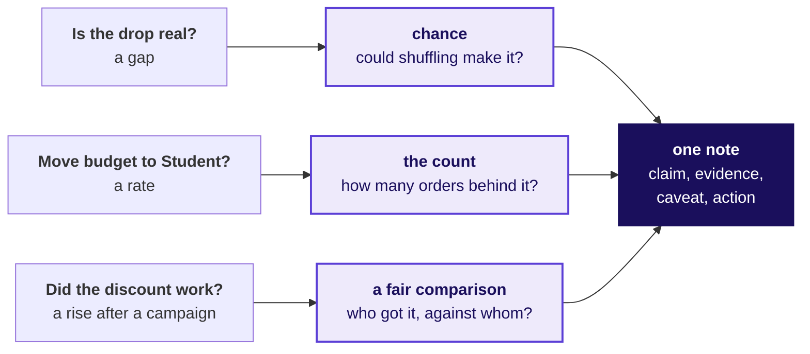
```mermaid
flowchart LR
    Q1["<b>Is the drop real?</b><br/>a gap"] --> H1["<b>chance</b><br/>could shuffling make it?"]
    Q2["<b>Move budget to Student?</b><br/>a rate"] --> H2["<b>the count</b><br/>how many orders behind it?"]
    Q3["<b>Did the discount work?</b><br/>a rise after a campaign"] --> H3["<b>a fair comparison</b><br/>who got it, against whom?"]
    H1 --> N["<b>one note</b><br/>claim, evidence,<br/>caveat, action"]
    H2 --> N
    H3 --> N
    classDef known fill:#EEEAFB,stroke:#5B3FD6,color:#1A0F5C,stroke-width:2px
    classDef bet fill:#1A0F5C,stroke:#1A0F5C,color:#FFFFFF
    class H1,H2,H3 known
    class N bet
```

The answer is b. Option d trusts the one party with a stake in the answer, and options a and c apply one tool to three different failures.

```notes
LIVE, 4 minutes. Draw this on the board and leave it there. Rounds one to three climb the first
two habits this morning; the third habit is the afternoon's case. Say that the note on the right
is where every round ends.
```

---

## S4. The note Meera reads in two minutes
*Four parts, in order, and "not yet" is an answer when the evidence says so.*

```timeline
label: Part 1 | title: Claim | body: One sentence Meera can act on, with the number that carries it.
label: Part 2 | title: Evidence | body: The number with its denominator, its window and how it was checked.
label: Part 3 | title: Caveat | body: What would change the claim, said before anyone else says it.
label: Part 4 | title: Action | body: What to do next, and what it costs, including "wait and measure". | tone: dark
```

**In the interview.** [S] Explain a finding to a non-technical stakeholder.

```notes
LIVE, 4 minutes. Every round today ends on one line of this note. The caveat is the part most
analysts leave out and the part a CEO keeps them for. Model it once: "Not yet, and here is what
would tell us" is a claim, a caveat and an action in one sentence.
```

---

## S5. What the week has already settled
*Three days of work stand behind today's numbers, so today inherits them rather than redoing them.*

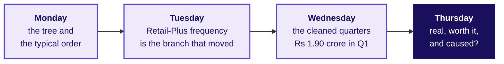
```mermaid
flowchart LR
    M["<b>Monday</b><br/>the tree and<br/>the typical order"] --> T["<b>Tuesday</b><br/>Retail-Plus frequency<br/>is the branch that moved"]
    T --> W["<b>Wednesday</b><br/>the cleaned quarters<br/>Rs 1.90 crore in Q1"]
    W --> R["<b>Thursday</b><br/>real, worth it,<br/>and caused?"]
    classDef known fill:#EEEAFB,stroke:#5B3FD6,color:#1A0F5C,stroke-width:2px
    classDef bet fill:#1A0F5C,stroke:#1A0F5C,color:#FFFFFF
    class M,T,W known
    class R bet
```

Today's file is Wednesday's cleaned two quarters, plus two things they did not have: the Student segment's own orders and the campaigns table.

```notes
LIVE, 3 minutes. Name what not to redo: nobody re-cleans the file, and nobody re-derives the tree.
Wednesday's return question is the Kahoot's last item: the duplicates shrank the Retail-Plus drop,
so does it survive? That is round one's question.
Transition: a gap exists; the first habit asks whether chance alone could have made it.
```

---

## SECTION 2: Round 1. Real, or the wobble
*Shuffle the quarter labels thousands of times and see how often chance alone makes a gap this large.*

```notes
LIVE. Fifty minutes: the question and its picture (5), the ten-card shuffle by hand (12), the loop
in code and the Retail-Core demonstration (13), the room's Retail-Plus run (8), the trap staged on
the room's own share and its fix (10), and Kavya's review (2). Notebook 1 runs beside it.
```

---

## S6. Two stories fit any gap between two quarters
*Either something changed for these members, or the same members just had an ordinary quarter.*

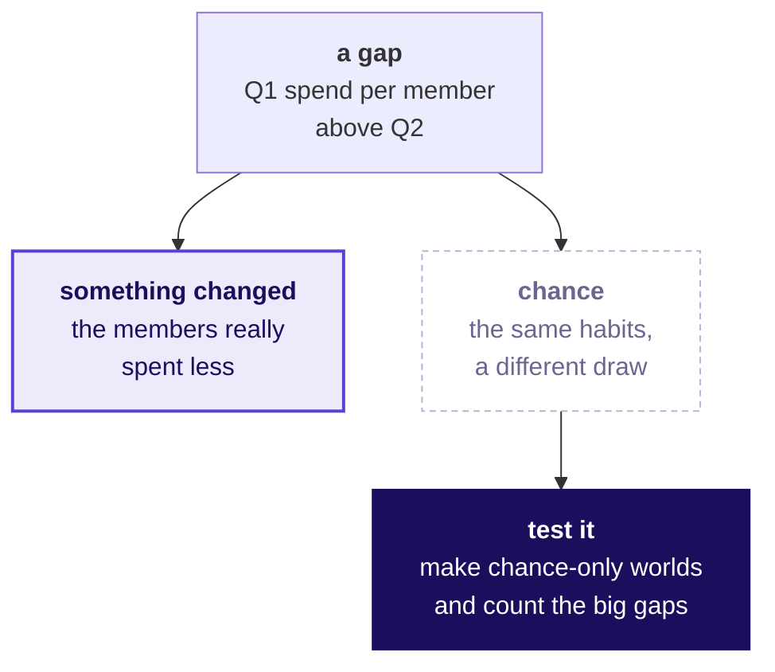
```mermaid
flowchart TB
    G["<b>a gap</b><br/>Q1 spend per member<br/>above Q2"] --> A["<b>something changed</b><br/>the members really<br/>spent less"]
    G --> B["<b>chance</b><br/>the same habits,<br/>a different draw"]
    B --> C["<b>test it</b><br/>make chance-only worlds<br/>and count the big gaps"]
    classDef known fill:#EEEAFB,stroke:#5B3FD6,color:#1A0F5C,stroke-width:2px
    classDef unknown fill:#FFFFFF,stroke:#B8B2D6,color:#6B6690,stroke-dasharray:4 3
    classDef bet fill:#1A0F5C,stroke:#1A0F5C,color:#FFFFFF
    class A known
    class B unknown
    class C bet
```

Meera's word for the second story is "wobble". The test asks how big the wobble gets when nothing has changed at all.

```notes
LIVE, 3 minutes. The measure all morning is delivered revenue per member per quarter: Monday
settled that cancelled and returned orders are not money kept, and a member is the unit that
exists in both quarters. Write the measure on the board beside the tree.
```

---

## S7. The chance reference: shuffle the labels
*If the quarter made no difference, the Q1 and Q2 labels are arbitrary, so mixing them changes nothing real.*

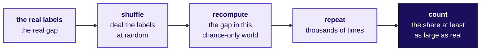
```mermaid
flowchart LR
    A["<b>the real labels</b><br/>the real gap"] --> B["<b>shuffle</b><br/>deal the labels<br/>at random"]
    B --> C["<b>recompute</b><br/>the gap in this<br/>chance-only world"]
    C --> D["<b>repeat</b><br/>thousands of times"]
    D --> E["<b>count</b><br/>the share at least<br/>as large as real"]
    classDef known fill:#EEEAFB,stroke:#5B3FD6,color:#1A0F5C,stroke-width:2px
    classDef bet fill:#1A0F5C,stroke:#1A0F5C,color:#FFFFFF
    class A,B,C,D known
    class E bet
```

That share has a name, the p-value, and it is only ever a share of chance-only worlds.

```notes
LIVE, 2 minutes. Say the name once and move on; the definition earns its place after the room has
counted shares by hand. No formulas today, and no test catalogue: the shuffle is the whole idea.
```

---

## S8. Ten cards, shuffled by hand
*Five members' Q1 spend and five members' Q2 spend, in hundreds of rupees, invented for the table.*

| Card | Q1, Rs | Card | Q2, Rs |
|---|---|---|---|
| A | 3,400 | F | 2,200 |
| B | 2,900 | G | 3,100 |
| C | 4,100 | H | 1,900 |
| D | 2,500 | I | 2,700 |
| E | 3,800 | J | 2,400 |
| **Mean** | **3,340** | **Mean** | **2,460** |

The real gap is Rs 880. Shuffle the ten cards, deal five to each pile, and write down the new gap. Ten shuffles per pair.

```notes
LIVE, 10 minutes. Hand each pair ten index cards with these amounts written on them; the numbers are
invented and the slide says so. Each pair shuffles ten times and writes each gap on the board in a
row. Then count, as a room, how many gaps reached Rs 880 or more. Expect one or two out of a
hundred and some. Ask: if the quarter made no difference, how surprising is 880?
```

---

## S9. Question: is a gap of Rs 880 surprising?
*The room's shuffles are on the board, and the real gap sits among them.*

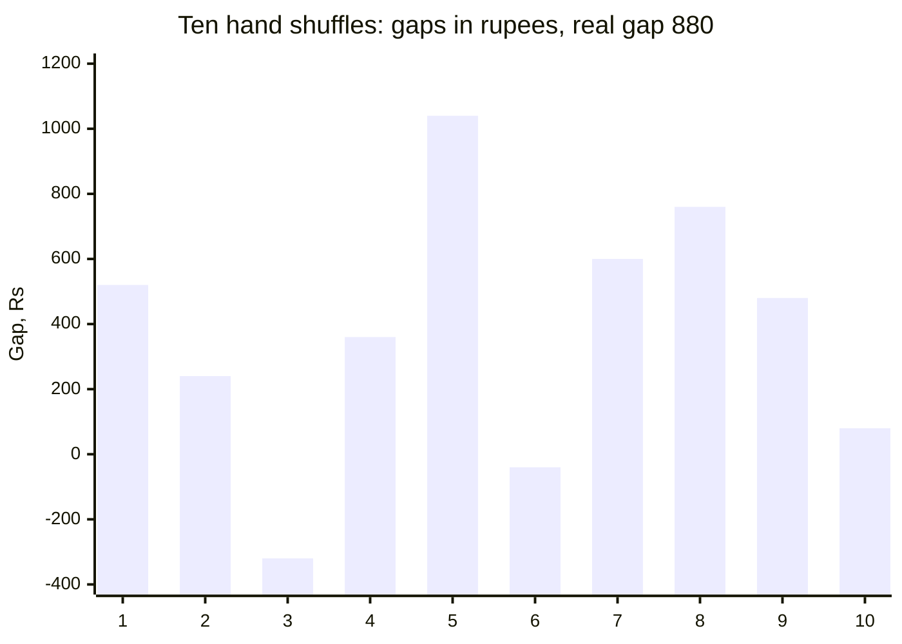
```mermaid
xychart-beta
    title "Ten hand shuffles: gaps in rupees, real gap 880"
    x-axis ["1", "2", "3", "4", "5", "6", "7", "8", "9", "10"]
    y-axis "Gap, Rs" -400 --> 1200
    bar [520, 240, -320, 360, 1040, -40, 600, 760, 480, 80]
```

**Question.** One shuffle in ten reached Rs 880. What do you say? a) the gap is real, since 880 is large; b) chance makes 880 often, so it is noise; c) ten shuffles are too few to say, so run many more; d) nothing, since shuffling destroys the data.

```notes
LIVE, 2 minutes. These ten gaps are the first ten a seeded computer shuffle produced, which is a
fair stand-in for a pair's ten. Take letters. The trap is b: one in ten sounds common, but ten
draws say almost nothing about a share.
```

---

## S10. Answer: ten shuffles cannot measure a share
*A thousand shuffles by computer show 21 gaps at Rs 880 or more, a share of about 2 in 100.*

```stats
value: 1,000 | label: shuffles | note: the same ten cards, seeded
value: 21 | label: gaps of Rs 880 or more | note: in chance-only worlds
value: 0.021 | label: the share | note: this is the p-value
```

The answer is c. Ten hand shuffles taught what a shuffle is; a thousand measure how rare the real gap is.

```notes
LIVE, 2 minutes. The hand shuffle was for the idea; the loop is for the number. Say the sentence
aloud: "If the quarter made no difference, a gap of Rs 880 or more turns up in about 2 of every 100
shuffles." That is the only sentence a p-value supports.
```

---

## S11. The shuffle, as a loop in Python
*Twelve lines, and every one of them is something the room just did with cards.*

```python
import random

def shuffle_gaps(q1, q2, times, seed):
    random.seed(seed)                  # the same shuffles every run
    pool = q1 + q2                     # all the cards, labels ignored
    gaps = []
    for _ in range(times):
        random.shuffle(pool)           # deal at random
        a, b = pool[:len(q1)], pool[len(q1):]
        gaps.append(sum(a) / len(a) - sum(b) / len(b))
    return gaps

gaps = shuffle_gaps(q1, q2, 1000, seed=2026)
share = sum(1 for g in gaps if g >= real_gap) / len(gaps)
```

```notes
LIVE, 5 minutes. Walk each line against the cards: pool is the ten cards face down, shuffle is the
deal, the two slices are the two piles, and the gap is what pairs wrote on the board. The seed is
there so every laptop in the room gets the same thousand shuffles; say that a different seed moves
the share a little and never the verdict. If someone meets a NameError, it is an unrun cell: two
minutes, the last line of the trace, Restart and Run All.
```

---

## S12. The usual wobble, measured on Retail-Core
*Retail-Core spent Rs 110 less per member in Q2, and 5,000 shuffles make gaps like that all the time.*

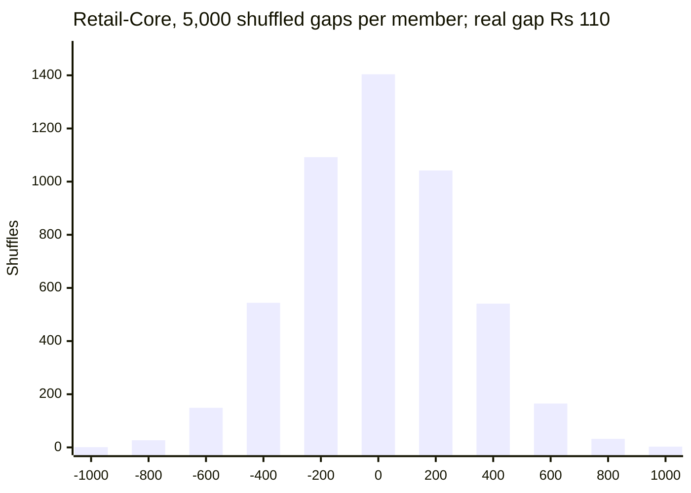
```mermaid
xychart-beta
    title "Retail-Core, 5,000 shuffled gaps per member; real gap Rs 110"
    x-axis ["-1000", "-800", "-600", "-400", "-200", "0", "200", "400", "600", "800", "1000"]
    y-axis "Shuffles" 0 --> 1500
    bar [1, 27, 149, 544, 1092, 1404, 1042, 541, 165, 32, 3]
```

The real gap is Rs 110 across 34 members. 1,724 of the 5,000 shuffles made a gap at least that large, a share of 0.34, which is what an ordinary quarter looks like.

```notes
LIVE, 6 minutes. This is the demonstration on Kalpa data, run live in notebook 1, level 3. Read the
picture: the bars are chance-only worlds, and the real gap sits in the tallest bar. One shuffle in
three makes a gap at least that large, so Retail-Core's dip is exactly the wobble Meera means.
Kavya's point to make: this is what "nothing happened" looks like, and the room needs to have seen
it before judging Retail-Plus.
```

---

## S13. Your turn: Retail-Plus, 5,000 shuffles
*The same loop on the segment Meera asked about, run by the room before anyone says a number.*

```timeline
label: Step 1 | title: The measure | body: Delivered revenue per Retail-Plus member, Q1 and Q2, from notebook 1, level 4.
label: Step 2 | title: The real gap | body: Q1 mean less Q2 mean, printed in rupees before any shuffle runs.
label: Step 3 | title: The shuffles | body: 5,000, seed 2026, and the share at least as large as the real gap.
label: Step 4 | title: The first draft | body: One line to Meera on what your share means, written fast and kept. | tone: dark
```

```notes
LIVE, 8 minutes. The room runs level 4 of notebook 1 and writes a first-draft sentence without help.
Do not read a number out first; every laptop gets the same share because of the seed. When most
laptops show a share, ask one pair to read theirs aloud and write it on the board. That number is
the one the next three slides work on, and it belongs to the room.
```

---

## S14. The plausible wrong answer
*A draft note, written in a hurry from the share the room has just computed.*

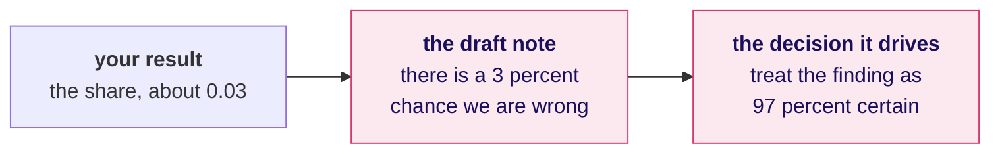
```mermaid
flowchart LR
    R["<b>your result</b><br/>the share, about 0.03"] --> W["<b>the draft note</b><br/>there is a 3 percent<br/>chance we are wrong"]
    W --> D["<b>the decision it drives</b><br/>treat the finding as<br/>97 percent certain"]
    classDef bad fill:#FBE9EF,stroke:#D63A6A,color:#1A0F5C
    class W,D bad
```

**What breaks.** "p = 0.03, so there is a 3 percent chance we are wrong" reads as precise, sounds like probability, and sends Meera into Monday certain.

```notes
LIVE, 3 minutes. Put the sentence up next to the room's share on the board and ask whose first
draft looks like it. Most hands go up; it is the most common p-value sentence in industry and it
appears in the row's list of what the room must handle. Do not correct it yet; the next slide does.
```

---

## S15. Why it is wrong: the share was counted under chance
*Every shuffle assumed the quarter made no difference, so the share says nothing about being wrong.*

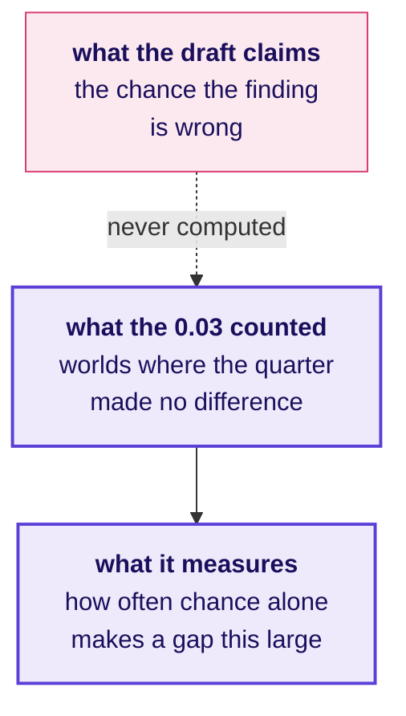
```mermaid
flowchart TB
    S["<b>what the 0.03 counted</b><br/>worlds where the quarter<br/>made no difference"] --> F["<b>what it measures</b><br/>how often chance alone<br/>makes a gap this large"]
    X["<b>what the draft claims</b><br/>the chance the finding<br/>is wrong"] -.->|"never computed"| S
    classDef known fill:#EEEAFB,stroke:#5B3FD6,color:#1A0F5C,stroke-width:2px
    classDef bad fill:#FBE9EF,stroke:#D63A6A,color:#1A0F5C
    class S,F known
    class X bad
```

**The check.** Ask of any p-value sentence: in which world was this share counted? If the sentence talks about the real world, it has claimed what the shuffle never measured.

```notes
LIVE, 3 minutes. The chance that a finding is wrong depends on things the shuffle never saw: how
plausible a drop was before the data, what else changed, how many segments were tested. Name that
in one line and stop; it is a later week's topic.
```

---

## S16. The fix: the sentence that survives an audit
*Say the share, the world it was counted in, and what it lets you conclude, in that order.*

| Draft | Rewritten |
|---|---|
| "There is a 3 percent chance we are wrong." | "If nothing had changed between the quarters, a fall this large would turn up in about 3 of every 100 shuffles." |
| "The drop is 97 percent certain." | "Chance alone rarely makes a fall this large, so we treat the drop as real." |
| "p = 0.03, so it is significant." | "The fall is larger than the usual wobble; its size is the next question." |

**The rule.** A p-value is a share of chance-only worlds; it is never the chance the finding is wrong.

```notes
LIVE, 4 minutes. Each pair rewrites its first draft in the rewritten form and reads it to the
partner. Collect three sentences aloud and have the room vote each one defensible or wrong. The
rewritten column is what Kavya signs. The third row hands over to round two: real is one call,
worth acting on is another.
```

---

## S17. Kavya's review of round one
*A senior reads the sentence before the number, because the sentence is what Meera repeats.*

**Kavya's review.** Show me the usual wobble first, then the gap against it. Say the share and the world it was counted in. If your sentence would still be true when the drop was a fluke, it is the right sentence.

**In the interview.** [S] What does p = 0.03 mean, and not mean? [S] How do you know whether a change in a metric is significant?

```notes
LIVE, 2 minutes. The two interview questions are answered in full in notebook 1 and in one breath in
the drill this afternoon. Transition: Retail-Plus beat the wobble, so the next question is whether
the gap is big enough to act on.
```

---

## SECTION 3: Round 2. Worth acting on
*A gap can beat chance and still be too small to spend on, so size it in rupees before ranking it.*

```notes
LIVE. Fifty minutes: the question (5), the two calls drawn (8), the trap (10), the check and the fix
(12), the room sizes it (12), and Kavya's review (3). Notebook 2 runs beside it.
```

---

## S18. Question: Retail-Plus beat the wobble. Now what?
*The shuffle said the fall is larger than chance makes, and the head of Retail-Plus wants a budget.*

**The client asks.** "So my tier really is slipping. What do I get to fix it?" The head of Retail-Plus, before the growth review

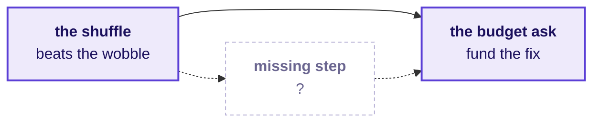
```mermaid
flowchart LR
    S["<b>the shuffle</b><br/>beats the wobble"] --> B["<b>the budget ask</b><br/>fund the fix"]
    S -.-> Q["<b>missing step</b><br/>?"]
    Q -.-> B
    classDef known fill:#EEEAFB,stroke:#5B3FD6,color:#1A0F5C,stroke-width:2px
    classDef unknown fill:#FFFFFF,stroke:#B8B2D6,color:#6B6690,stroke-dasharray:4 3
    class S,B known
    class Q unknown
```

**Question.** What comes before any budget talk? a) nothing, since the test settled it; b) the fall in rupees against what fixing it would cost; c) a second test with a smaller p-value; d) the fall as a percentage, since percentages compare across segments.

```notes
LIVE, 3 minutes. Pairs, then letters. Expect d from anyone who liked Tuesday's percentages. Do not
settle it here.
```

---

## S19. Answer: rupees against the cost of acting
*Significance answers "is it real"; only size against cost answers "is it worth money".*

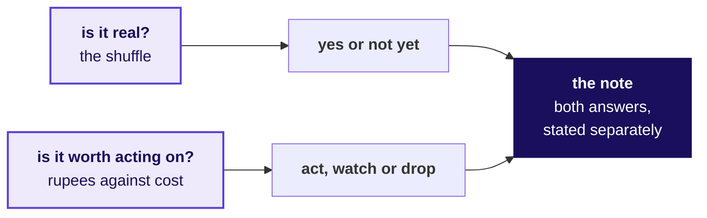
```mermaid
flowchart LR
    Q1["<b>is it real?</b><br/>the shuffle"] --> A1["<b>yes or not yet</b>"]
    Q2["<b>is it worth acting on?</b><br/>rupees against cost"] --> A2["<b>act, watch or drop</b>"]
    A1 --> N["<b>the note</b><br/>both answers,<br/>stated separately"]
    A2 --> N
    classDef known fill:#EEEAFB,stroke:#5B3FD6,color:#1A0F5C,stroke-width:2px
    classDef bet fill:#1A0F5C,stroke:#1A0F5C,color:#FFFFFF
    class Q1,Q2 known
    class N bet
```

The answer is b. A percentage on a small segment inflates; a second test answers the same question twice.

```notes
LIVE, 2 minutes. Two calls, two questions, two lines in the note. Draw them side by side on the
board under the morning's three habits.
```

---

## S20. Real and important are two different axes
*Every finding lands in one of four boxes, and only one box earns a budget line on Monday.*

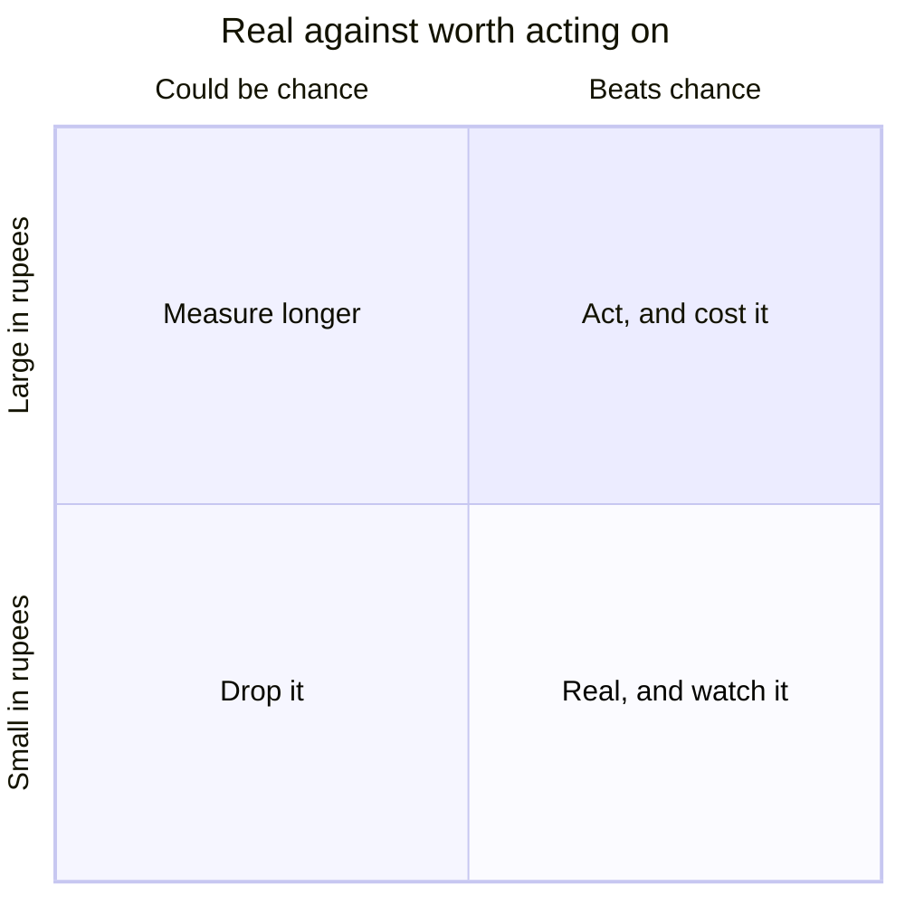
```mermaid
quadrantChart
    title Real against worth acting on
    x-axis Could be chance --> Beats chance
    y-axis Small in rupees --> Large in rupees
    quadrant-1 Act, and cost it
    quadrant-2 Measure longer
    quadrant-3 Drop it
    quadrant-4 Real, and watch it
```

A finding can beat chance and sit in the bottom right. A large gap on few members can sit top left.

```notes
LIVE, 5 minutes. Ask where Retail-Core's Rs 110 belongs: bottom left, chance-sized and small. Ask
where the room would put Retail-Plus; hold the answer until they have sized it. The quadrant is the
day's second board drawing.
```

---

## S21. The plausible wrong answer
*The draft ranks Retail-Plus first because the room's own p-value is the smallest on the page.*

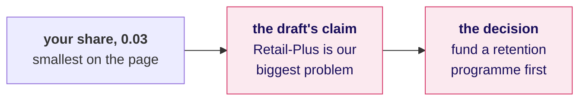
```mermaid
flowchart LR
    P["<b>your share, 0.03</b><br/>smallest on the page"] --> C["<b>the draft's claim</b><br/>Retail-Plus is our<br/>biggest problem"]
    C --> D["<b>the decision</b><br/>fund a retention<br/>programme first"]
    classDef bad fill:#FBE9EF,stroke:#D63A6A,color:#1A0F5C
    class C,D bad
```

**What breaks.** "Significant" becomes "big", and the smallest p-value becomes the first budget line.

```notes
LIVE, 3 minutes. This is the second trap of the day and the one that costs money. Ask what the
p-value would be for a gap of five rupees on two lakh orders. Take guesses, then show the next slide.
```

---

## S22. Why it is wrong: big samples make tiny gaps real
*With enough orders, chance never makes even a trivial gap, so a small p-value can carry a tiny finding.*

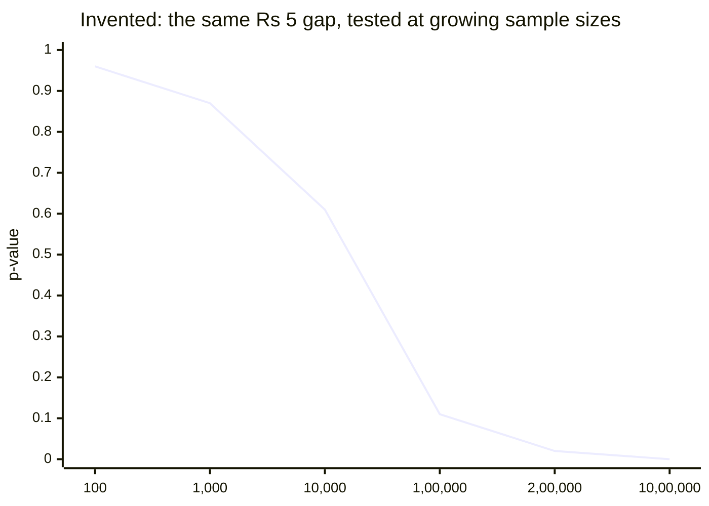
```mermaid
xychart-beta
    title "Invented: the same Rs 5 gap, tested at growing sample sizes"
    x-axis ["100", "1,000", "10,000", "1,00,000", "2,00,000", "10,00,000"]
    y-axis "p-value" 0 --> 1
    line [0.96, 0.87, 0.61, 0.11, 0.02, 0.0000004]
```

The gap never changes and the p-value falls toward zero. The p-value measures how surely a gap beats chance; it never measures how big the gap is.

```notes
LIVE, 4 minutes. The numbers are invented for the illustration: a Rs 5 gap between two quarters
whose orders vary by about Rs 700, with the count on the axis being orders in each quarter, and the
title says so. With two lakh orders a quarter the five-rupee gap reaches 0.02; with ten lakh it is
off the chart. Five rupees on an order of about Rs 2,200 is a quarter of one percent: "significant",
and whether it is worth anything depends on what acting costs. Size is a separate measurement.
```

---

## S23. The check: the gap in rupees, three ways
*Per member, for the whole segment, and as a share of the company's quarter.*

```timeline
label: Per member | title: The gap | body: Q1 mean less Q2 mean, in rupees of delivered revenue.
label: Segment | title: Times members | body: The gap times the members who exist in both quarters.
label: Company | title: Against the quarter | body: The segment's loss over the company's delivered revenue in Q2.
label: Decision | title: Against the cost | body: The loss a quarter against what the fix would cost a quarter. | tone: dark
```

**The rule.** Real and worth acting on are two separate calls: the shuffle answers the first, rupees against cost answer the second.

```notes
LIVE, 5 minutes. Walk the four steps without numbers; the room computes them in notebook 2, level 3.
The company's Q2 delivered revenue is Tuesday's and Wednesday's number and is on their sheets.
Business carries most of it, which the next slide shows.
```

---

## S24. Where the company's delivered revenue sits
*Business carries the quarter, so every consumer segment's gap is small against the whole.*

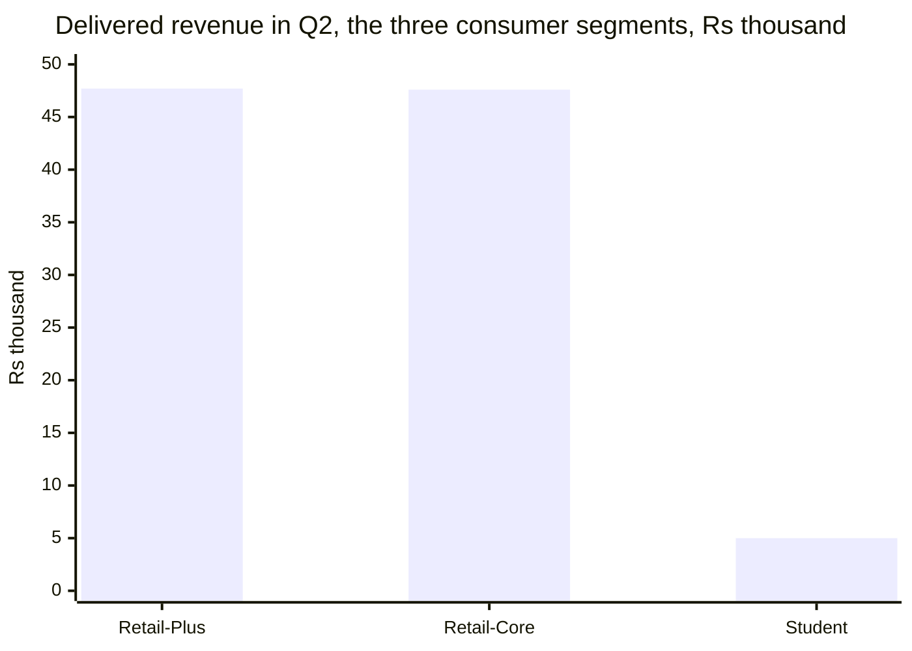
```mermaid
xychart-beta
    title "Delivered revenue in Q2, the three consumer segments, Rs thousand"
    x-axis ["Retail-Plus", "Retail-Core", "Student"]
    y-axis "Rs thousand" 0 --> 50
    bar [47.7, 47.6, 5.0]
```

Business delivered Rs 1,27,64,460 in the same quarter, about 268 times Retail-Plus, so on this axis its bar would stand 268 times as tall. Size every consumer gap against a quarter that Business dominates.

```notes
LIVE, 3 minutes. The chart draws the consumer segments alone so their bars stand in proportion; a
single axis with Business on it would flatten all three to the floor. Delivered revenue in Q2 was
Rs 1,28,64,680, of which Business delivered Rs 1,27,64,460. The room computed these on Tuesday and Wednesday. Do not state the Retail-Plus gap
in rupees; the room computes it next.
```

---

## S25. The fix: two sentences where the draft had one
*One sentence for real, one for size, and the decision follows the second.*

| The draft | The fix |
|---|---|
| "Retail-Plus is significant, so it is our biggest problem." | "The Retail-Plus fall is larger than the usual wobble." |
| | "It is worth Rs ___ a quarter, which is ___ percent of the company's delivered revenue." |
| | "A fix is worth funding only if it costs less than Rs ___ a quarter." |

**Kavya's review.** Fill the blanks from your notebook, not from the p-value.

```notes
LIVE, 4 minutes. The blanks are on purpose: the room fills them in notebook 2, level 3, and reads
the three sentences to a partner. Walk the room and check that the second blank is a share of the
company, not of the segment.
```

---

## S26. A range, named once: the confidence interval
*The gap is an estimate, so a careful note gives a range of plausible sizes; building one comes later.*

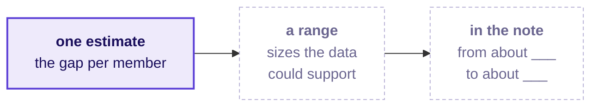
```mermaid
flowchart LR
    E["<b>one estimate</b><br/>the gap per member"] --> R["<b>a range</b><br/>sizes the data<br/>could support"]
    R --> N["<b>in the note</b><br/>from about ___<br/>to about ___"]
    classDef known fill:#EEEAFB,stroke:#5B3FD6,color:#1A0F5C,stroke-width:2px
    classDef unknown fill:#FFFFFF,stroke:#B8B2D6,color:#6B6690,stroke-dasharray:4 3
    class E known
    class R,N unknown
```

Today the name is enough: a confidence interval is that range. How it is built arrives in a later week.

```notes
LIVE, 2 minutes. CUT FIRST if the round runs long. Say the name, say that the gap per member is one
estimate from 22 members, and stop.
```

---

## S27. Your turn: size it, then decide
*The head of Retail-Plus proposes a retention offer, and the room decides whether the fall pays for it.*

```cards
icon: calculator | eyebrow: Level 3 | title: Size it | body: Compute the three sizes from notebook 2 and fill the fix's blanks.
icon: scale | eyebrow: Level 4 | title: Price the fix | body: A retention offer of Rs 500 per member a quarter, a figure assumed for the exercise, against the fall it would have to recover.
icon: message-square | eyebrow: The note | title: Two sentences | body: One for real, one for worth, read aloud to your partner. | tone: dark
```

```notes
LIVE, 12 minutes. The Rs 500 per member offer is an assumption for the exercise and the notebook
labels it so. Pairs compute whether recovering half the fall would cover it. Watch for pairs
comparing the offer with the percentage fall; send them back to rupees.
```

---

## S28. Kavya's review of round two
*A senior asks for the size before the significance, because size is what gets funded.*

**Kavya's review.** Tell me how big it is in rupees, next to the whole company, and next to what the fix costs. Then tell me it is real. A small p-value on a small gap is a watch item, never a budget line.

**In the interview.** [F] A metric moved and the test says significant; how do you decide whether the business should act?

```notes
LIVE, 3 minutes. The interview question is a case follow-up built on the row's staple; its answer is
in notebook 2 and the day sheet. Break for 10 minutes after this slide.
```

---

## SECTION 4: Round 3. The count behind 40 percent
*A rate is only as good as the count it stands on, so count before you repeat it.*

```notes
LIVE. Fifty minutes: the question (5), the trap (8), the check with the chance reference (15), the
rule of thumb and the interview pair (10), the room's run (10), and Kavya's review (2). Notebook 3
runs beside it.
```

---

## S29. Question: should budget move to Student?
*Student rose 40 percent, the fastest rise on the page, and Meera asked about it by name.*

**The client asks.** "Student is up 40 percent; should I move budget there?" Meera Raghavan

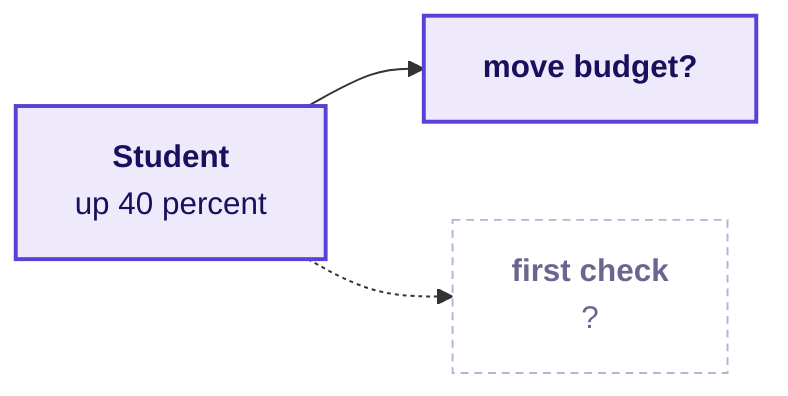
```mermaid
flowchart LR
    R["<b>Student</b><br/>up 40 percent"] --> B["<b>move budget?</b>"]
    R -.-> C["<b>first check</b><br/>?"]
    classDef known fill:#EEEAFB,stroke:#5B3FD6,color:#1A0F5C,stroke-width:2px
    classDef unknown fill:#FFFFFF,stroke:#B8B2D6,color:#6B6690,stroke-dasharray:4 3
    class R,B known
    class C unknown
```

**Question.** What do you check before answering her? a) the rise in rupees, since money is what moves; b) the number of orders and customers the rate stands on; c) whether 40 percent beats every other segment; d) Student's rise in the previous year.

```notes
LIVE, 3 minutes. Letters. Expect a, which is round two's habit, and c, which is the headline habit.
Both are reasonable next steps and neither comes first.
```

---

## S30. Answer: count what the rate stands on
*Forty percent of a handful is a few orders, and a few orders move by chance every quarter.*

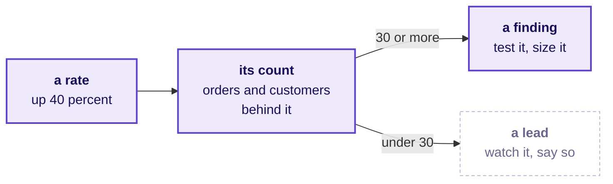
```mermaid
flowchart LR
    R["<b>a rate</b><br/>up 40 percent"] --> N["<b>its count</b><br/>orders and customers<br/>behind it"]
    N -->|"30 or more"| F["<b>a finding</b><br/>test it, size it"]
    N -->|"under 30"| L["<b>a lead</b><br/>watch it, say so"]
    classDef known fill:#EEEAFB,stroke:#5B3FD6,color:#1A0F5C,stroke-width:2px
    classDef unknown fill:#FFFFFF,stroke:#B8B2D6,color:#6B6690,stroke-dasharray:4 3
    class R,N,F known
    class L unknown
```

The answer is b. Rupees and rankings come after the count, because a rate on a handful can rank first by accident.

```notes
LIVE, 2 minutes. Do not say Student's count. The room counts it in notebook 3, level 3.
```

---

## S31. The plausible wrong answer
*The draft leads with the biggest rate on the page and moves money to it.*

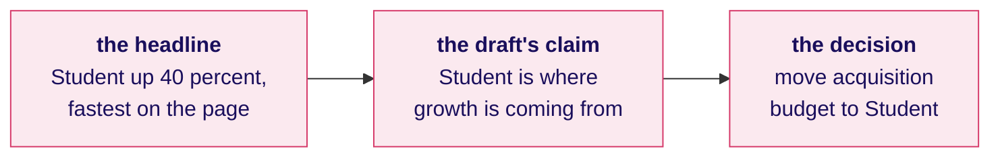
```mermaid
flowchart LR
    H["<b>the headline</b><br/>Student up 40 percent,<br/>fastest on the page"] --> C["<b>the draft's claim</b><br/>Student is where<br/>growth is coming from"]
    C --> D["<b>the decision</b><br/>move acquisition<br/>budget to Student"]
    classDef bad fill:#FBE9EF,stroke:#D63A6A,color:#1A0F5C
    class H,C,D bad
```

**What breaks.** A rate travels without its count, and the budget follows the rate.

```notes
LIVE, 3 minutes. Point out that the rate is correct arithmetic. What is wrong is repeating it without
the count, the same mistake as Monday's number without its definition.
```

---

## S32. Why it is wrong: small counts swing by chance
*Split a small number of orders between two quarters at random, and big "rises" appear on their own.*

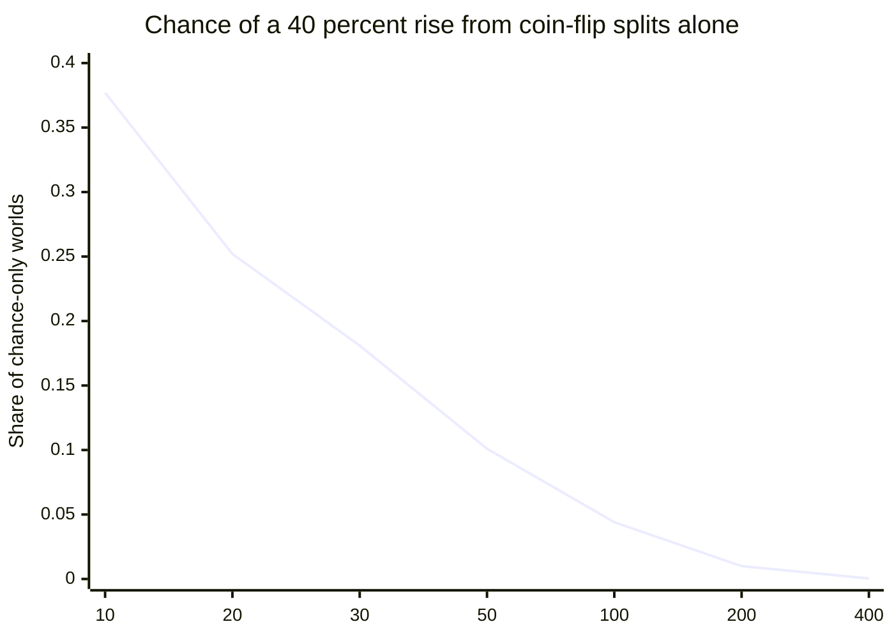
```mermaid
xychart-beta
    title "Chance of a 40 percent rise from coin-flip splits alone"
    x-axis ["10", "20", "30", "50", "100", "200", "400"]
    y-axis "Share of chance-only worlds" 0 --> 0.4
    line [0.377, 0.252, 0.181, 0.101, 0.044, 0.010, 0.0004]
```

With ten orders, more than a third of chance-only worlds show a 40 percent rise. With four hundred, almost none do.

```notes
LIVE, 5 minutes. The chart is exact arithmetic on fair coin flips, one flip per order deciding its
quarter, with no Kalpa data in it. Read two points aloud: ten orders, 38 percent of worlds; four
hundred, four in ten thousand. That curve is why the rule of thumb exists.
```

---

## S33. The check: count, then shuffle the count
*The same chance reference as round one, run on the orders behind the rate.*

```timeline
label: Step 1 | title: Count | body: Orders and distinct customers behind Student's rate, in both quarters.
label: Step 2 | title: Shuffle | body: Deal the same orders to Q1 and Q2 at random, 5,000 times.
label: Step 3 | title: Share | body: How often chance alone makes a rise of 40 percent or more.
label: Step 4 | title: Compare | body: The same rise on a segment the size of Retail-Core. | tone: dark
```

**The rule.** Count what a rate stands on before you repeat it; under thirty, it is a lead.

```notes
LIVE, 5 minutes. This is round one's shuffle, pointed at a count. The room runs it in notebook 3,
levels 3 and 4. The rule of thumb is thirty; say that it is a habit, not a law, and that it is the
row's rule.
```

---

## S34. Question: 42 percent on 12, or 31 on 1,200?
*The interview's version of Student, asked with users where Kalpa has orders.*

**In the interview.** [F] 42 percent on 12 users against 31 percent on 1,200; which do you trust?

**Question.** Which answer earns the offer? a) 42 percent, since it is higher; b) 31 percent, since 1,200 is more; c) 31 percent as the estimate, 42 percent as a lead to measure further; d) neither, since they cannot be compared.

```notes
LIVE, 3 minutes. Letters, then one learner answers aloud in thirty seconds. Listen for the count,
the swing, and what they would do next.
```

---

## S35. Answer: trust the count, keep the lead
*One user moves a rate on twelve by eight points, so 42 is a lead and 31 is the estimate.*

| | 42 percent on 12 | 31 percent on 1,200 |
|---|---|---|
| One person changes it by | about 8 points | under a tenth of a point |
| What it is | a lead to measure | an estimate to use |
| What you say | "promising, measure more" | "our working number" |

The answer is c. Option b is right for the wrong reason: 1,200 does not make 31 true, it makes it stable.

```notes
LIVE, 2 minutes. The one-person swing is the fastest way to say it in an interview: one user out of
12 is 8.3 points.
```

---

## S36. Your turn: Student, counted and shuffled
*The room counts the orders behind the 40 percent, shuffles them, and writes Meera's line.*

```cards
icon: hash | eyebrow: Level 3 | title: Count | body: Orders and distinct customers, Q1 and Q2, in the empty cell of notebook 3.
icon: shuffle | eyebrow: Level 4 | title: Shuffle | body: 5,000 random splits of the same orders; the share with a 40 percent rise or more.
icon: message-square | eyebrow: The note | title: One line | body: The rate, its count, and what would make it a finding. | tone: dark
```

```notes
LIVE, 10 minutes. The count is the room's discovery; do not say it. When a pair has it, ask them how
many customers stand behind the orders, and watch the faces. Collect two lines aloud.
```

---

## S37. Kavya's review of round three
*A senior repeats a rate only with its count beside it, every time.*

**Kavya's review.** Write the count next to the rate, and say whether chance makes that rate on that count. If it does, the line to Meera is "not yet": what we saw, what it stands on, and how many more orders would settle it.

**In the interview.** [F] 42 percent on 12 users against 31 percent on 1,200; which do you trust?

```notes
LIVE, 2 minutes. The morning closes on three lines of the note, one per round. The afternoon adds the
discount and ships the page.
```

---

## S38. What the morning settled, and what it did not
*Two of Meera's questions have a habit and a number; the third needs a fair comparison.*

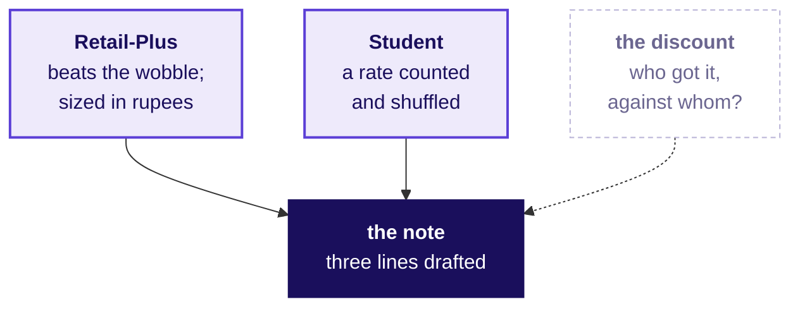
```mermaid
flowchart TB
    A["<b>Retail-Plus</b><br/>beats the wobble;<br/>sized in rupees"] --> N["<b>the note</b><br/>three lines drafted"]
    B["<b>Student</b><br/>a rate counted<br/>and shuffled"] --> N
    C["<b>the discount</b><br/>who got it,<br/>against whom?"] -.-> N
    classDef known fill:#EEEAFB,stroke:#5B3FD6,color:#1A0F5C,stroke-width:2px
    classDef unknown fill:#FFFFFF,stroke:#B8B2D6,color:#6B6690,stroke-dasharray:4 3
    classDef bet fill:#1A0F5C,stroke:#1A0F5C,color:#FFFFFF
    class A,B known
    class C unknown
    class N bet
```

The afternoon opens on the discount, unguided, with the whole note due at the end of the hour.

```notes
LIVE, 2 minutes. Point at the dashed arrow. Tuesday's mix against rate is the tool the afternoon
needs; say that once and stop.
```

---

## D39. Depth: one direction or both
*The morning counted falls at least as large; counting rises as well roughly doubles the share.*

| Counted | What it asks | For Retail-Plus |
|---|---|---|
| Falls at least as large | Could chance make a drop this big? | The morning's share |
| Falls or rises at least as large | Could chance make a move this big either way? | About twice the morning's share |

Meera asked about a drop, so the morning counted drops. A note that tested both directions says so, and the share it reports is the two-sided one.

```notes
SELF-STUDY, 5 minutes. For learners who ask why their friend's tool reports a bigger p-value. Notebook
1's depth section runs both counts on the same 5,000 shuffles.
```
