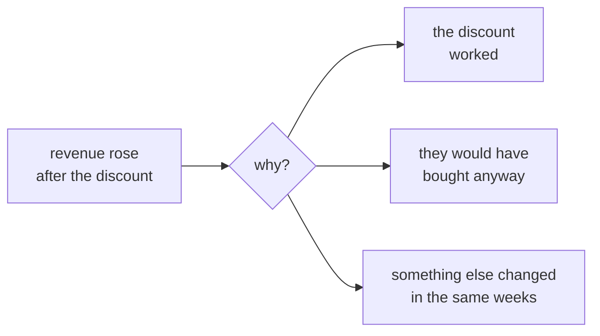
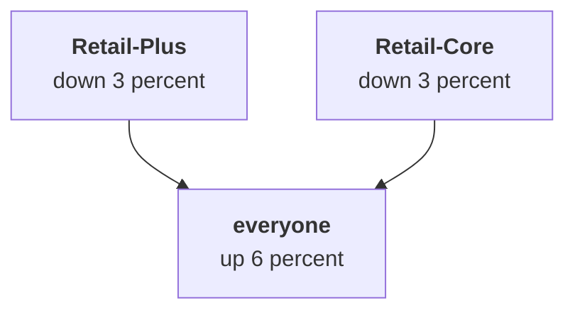
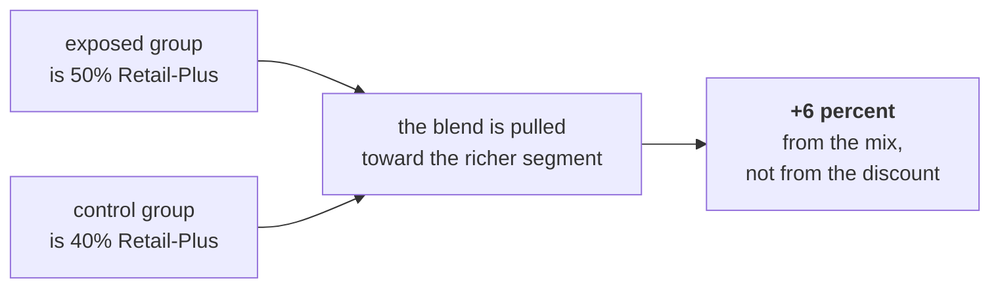
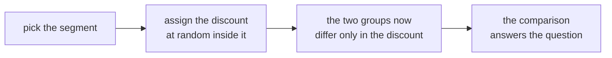
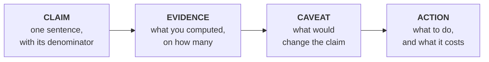

# Half two: cause or coincidence, and the one page

Week 1, Day 4. Slide source. One idea per slide.

Position bar, repeated at every section boundary:
`[after is not because] > [the fair comparison] > [the flip] > [the note]`

---

## SECTION A. After is not because

---

## S1. Marketing's claim
The monsoon sale ran for two weeks in August, targeted at Retail-Plus members.

> "Revenue from exposed customers was six percent higher than from unexposed ones. The campaign
> worked. Let us repeat it for Diwali."

The number is correct. Nobody has made an arithmetic error.

---

## S2. Three things could be true

The data as presented cannot tell these apart. Only a fair comparison can.

---

## S3. What a fair comparison needs
A group that **did not** get the thing, that is **like** the group that did, in the ways that matter.

Both halves are load-bearing. A control group that differs from the treated group answers a different question, confidently.

---

## D4. Who received the monsoon sale?
**Question.** Marketing targeted it. Before computing anything, what does targeting do to a comparison?

---

## D5. Answer: it makes the two groups different on purpose
Targeting is the point of a campaign and it is fatal to a naive comparison.

The sale went to Retail-Plus members, who already spend two and a half times what Retail-Core members spend. So the exposed group is richer than the control group **before the discount does anything at all**.

---

## SECTION B. The fair comparison

---

## S6. The exposure table
| Group | Retail-Plus | Retail-Core | Total |
|---|---|---|---|
| Exposed | 30 | 30 | 60 |
| Not exposed | 40 | 60 | 100 |

Half the exposed group is Retail-Plus, against forty percent of the control. That difference is small to look at and it is the whole result.

---

## S7. Within each segment, compared properly
| Segment | Exposed | Not exposed | Change |
|---|---|---|---|
| Retail-Plus | Rs 4,850 | Rs 5,000 | down 3 percent |
| Retail-Core | Rs 1,940 | Rs 2,000 | down 3 percent |

Every segment that received the discount spent **less** than the comparable customers who did not.

---

## SECTION C. The flip

---

## S8. And yet the blend rose

| Group | Exposed | Not exposed | Change |
|---|---|---|---|
| Retail-Plus | Rs 4,850 | Rs 5,000 | down 3 percent |
| Retail-Core | Rs 1,940 | Rs 2,000 | down 3 percent |
| **Everyone** | **Rs 3,395** | **Rs 3,200** | **up 6 percent** |

Both parts fell. The whole rose. Nobody made an error.

---

## S9. Where the six percent came from

The campaign changed **who is in the average**, not what they spent.

---

## S10. The name for it, now that you have met it
When a comparison reverses once a group is split, the aggregate was being driven by the mix.

You will meet it again in Week 2 in SQL, in Week 5 on a model's segments, and in every interview that asks why a metric moved.

---

## S11. What you can and cannot say
| Can say | Cannot say |
|---|---|
| Exposed customers spent 6 percent more in the blend | The discount lifted revenue 6 percent |
| Within both segments, exposed customers spent 3 percent less | The discount reduced spending by 3 percent |
| The groups differ in composition | The campaign had no effect |

The third row on the right is the mistake of the over-corrected analyst, and it is as wrong as the claim it replaces.

---

## S12. What would settle it

> Assign the next discount at random within a segment, hold the segment mix equal in both groups, and compare.

An experiment nobody ran cannot be recovered from the data afterwards. Saying that plainly is the answer.

---

## SECTION D. The note

---

## S13. Four parts, in this order

Claim first, because a CEO reads two minutes and stops.

---

## S14. The page Meera gets
> **Retail-Plus.** Orders per member fell about a third against Retail-Core's 2.7 percent. Chance
> alone produced a gap this large in none of 5,000 shuffles, so it is real. These are 22 paid-tier
> members and I would act on it.
>
> **Student.** Up 40 percent on twelve orders. Chance produces a rise that large two times in five,
> so I would not move budget yet. A full quarter would tell us.
>
> **The monsoon sale.** The six percent is a mix effect. Within both segments, exposed customers
> spent three percent less than comparable unexposed ones. I cannot say the campaign failed either,
> because nobody randomised it. Repeating it as designed is a bet with no evidence behind it.

---

## S15. Three answers, three shapes
| Question | The answer's shape |
|---|---|
| Retail-Plus | Real, big, act on it |
| Student | Real in the file, not yet evidence |
| The discount | We do not know, and here is what would tell us |

Only one of the three is a yes. A page where all three are yes is a page that was written to please.

---

## S16. The sentence you are paid for
> "We do not know yet, and here is what would tell us."

It is the hardest sentence to say to somebody who wants a decision today, and it is the reason they keep an analyst rather than a dashboard.
