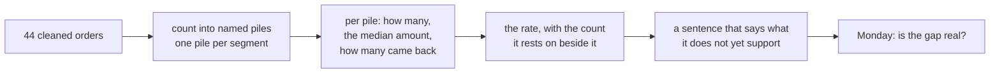
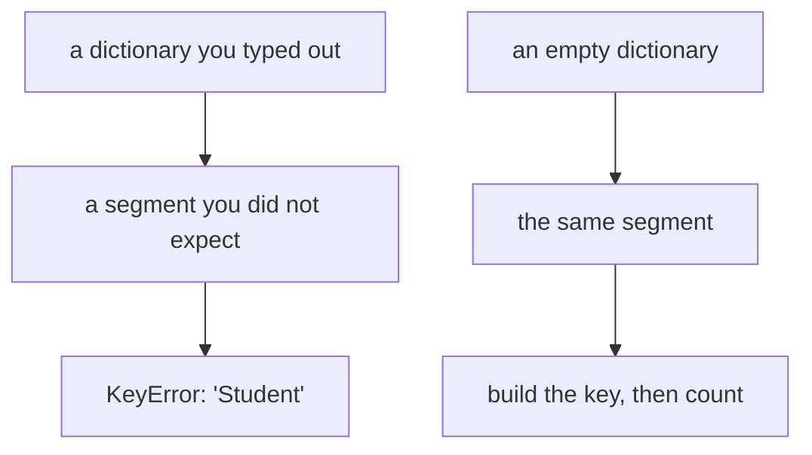
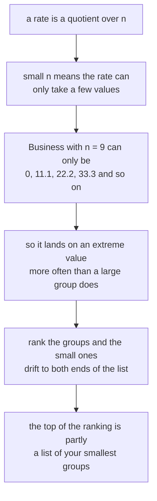
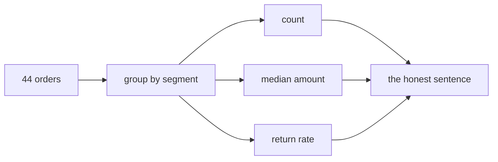
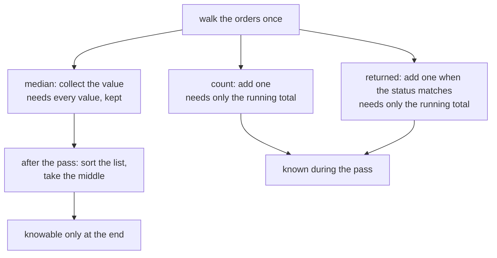
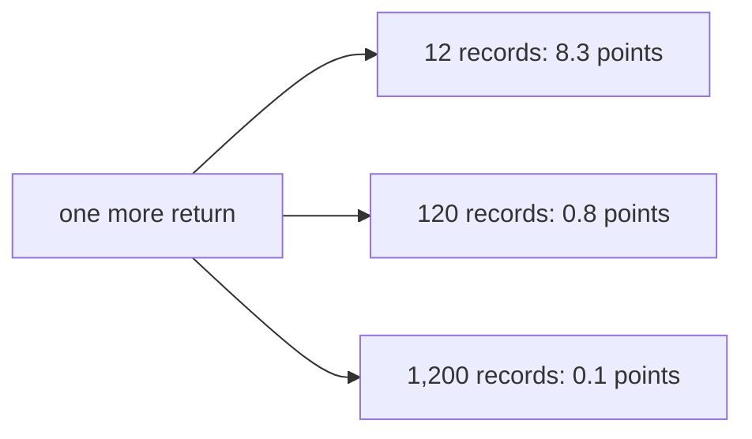
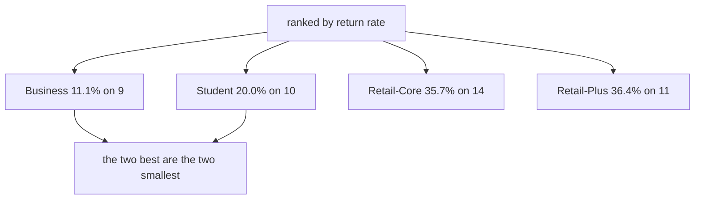
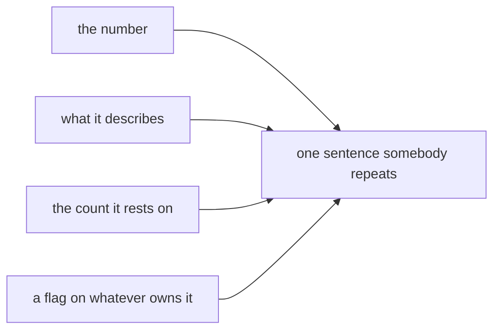

# Half two: the segment summary, and the count it rests on

Week 1, Day 4. Slide source. One idea per slide.

Slides numbered S are the spine and are delivered in order. Slides numbered D go deeper and carry a DEPTH mark. A trainer skips them live when time is short, and you read them afterwards.

Position bar, repeated at every section boundary:
`[one column] > [what is typical] > [what one order does] > [what the shape says] > [per segment, with denominators]`

---

## S1. Per segment, with denominators
Half one gave you one number for the whole file. Nobody runs a business unit on one number.

The question is always the same one level down: which part of Kalpa Retail is working, and how sure can you be.

---

---

## S2. Where we are
`[one column] > [what is typical] > [what one order does] > [what the shape says] > **[per segment, with denominators]**`

You can now pick an honest statistic for a column. Half two splits the file by segment, computes that statistic per group, and attaches the one thing that decides whether the answer means anything.

---

---

## S2b. The metric, named before it is computed
Kalpa Retail cares about returns. A returned order costs the delivery, the reverse logistics and usually the margin.

```
return rate  =  orders with status "returned"  /  all orders in the group
```

This is the first metric in the programme where **lower is better**. A ranking of return rates puts the best performer at the top with the smallest number beside it. Keep that straight or the next four slides will read backwards.

---

---

## S2c. Where this is going
```
segment        orders   median amount   return rate
Business            9        Rs 2,050          11.1%
Student            10        Rs 1,430          20.0%
Retail-Core        14        Rs 1,910          35.7%
Retail-Plus        11        Rs 1,435          36.4%
```

You will have built this inside the hour. Then you will spend the rest of the session refusing to send it as it stands.

---

---

## S2d. Half two in one picture


---

---

## SECTION 1: THE DENOMINATOR
`[one column] > [what is typical] > [what one order does] > [what the shape says] > **[per segment, with denominators]**`

---

---

## S3. One rate, two files
Two segments in two different companies, same reported number:

```
segment X:   returned 5 of 12          41.7%
segment Y:   returned 500 of 1200      41.7%
```

Identical rates. Which one would you build a quarter's plan on?

---



---

## S4. Why the small one moves
In the 12-order segment, one order changing its status moves the rate by 8.3 points.

In the 1,200-order segment, one order moves it by 0.08 points.

The small segment is not wrong. It is loud. Its number swings on evidence too thin to swing on, and next month it will report something different for no reason you can name.

---

---

## S5. What a rate actually is
```
rate = how many did the thing  /  how many could have
```

Two numbers, and the reporting convention throws one of them away.

Every argument in this section comes from the thrown-away number.

---

---

## D1. A rate written properly, and the number nobody prints
$$\text{rate} = \frac{k}{n} \qquad \text{where } k \text{ did the thing and } n \text{ could have}$$

The reporting convention prints the quotient and discards $n$, and $n$ is the number that decides whether the quotient means anything.

Here is the arithmetic that makes the discard visible. One record changing side moves the rate by

$$\Delta = \frac{1}{n} \qquad \text{or, in percentage points, } \frac{100}{n}$$

| Segment | $n$ | One order moves the rate by |
|---|---|---|
| Business | 9 | 11.1 points |
| Student | 10 | 10.0 points |
| Retail-Plus | 11 | 9.1 points |
| Retail-Core | 14 | 7.1 points |

Business's entire lead over Student is 8.9 points. One order in Business is worth 11.1. The lead is smaller than the resolution of the instrument that measured it.

---

---

## D2. A ranking of small groups reads size


Nothing is causing this and nothing is wrong with the data. It is what quotients over small denominators do, and it is why the fix is the denominator column rather than a better statistic.

---

---

## S6. The rule
> A rate travels with its denominator or it does not travel.

Write it as `11.1 percent of 9` and nobody can misread it. Write it as `11.1 percent` and everybody will.

---

---

## SECTION 2: THE ACCUMULATOR
`[one column] > [what is typical] > [what one order does] > [what the shape says] > **[per segment, with denominators]**`

---

---

## S7. Counting into buckets
Monday you counted orders that passed a test. Today you count them into named piles, one pile per segment.

```
counts = {"Retail-Core": 0, "Retail-Plus": 0, "Business": 0}

for r in orders:
    counts[r["segment"]] = counts[r["segment"]] + 1
```

Reasonable code. The analyst listed the segments they remembered.

---



---

## S8. Run it
```
KeyError: 'Student'
```

It failed on the very first order in the file.

---

---

## S9. Reading it
`KeyError` means a dictionary was asked for a key it does not hold. The key it did not hold is printed for you: `Student`.

The dictionary held three segments because a person typed three segments. Kalpa Retail has four.

Every hard-coded list of categories is a promise about data you have not read yet.

This one is loud, because the first order in the file is a Student order. The dangerous version runs for six months and breaks the week a new segment launches.

---


---

## D3. The failure that is worse than the KeyError
The `KeyError` was the good case, because it stopped.

```
counts = {"Retail-Core": 0, "Retail-Plus": 0, "Business": 0}

for r in orders:
    if r["segment"] in counts:
        counts[r["segment"]] = counts[r["segment"]] + 1
```

Somebody who has met a `KeyError` once often writes this next. It never raises. It silently ignores every Student order, so the counts come to 34 rather than 44, the totals are all understated, and the file looks fine.

The check that catches it is the one you already write: the segment counts have to add up to the order count. Ten orders are missing and the last line is the only place that shows.

---

---

## S10. Build the key when you first see it
```
counts = {}

for r in orders:
    key = r["segment"]
    if key not in counts:
        counts[key] = 0
    counts[key] = counts[key] + 1
```

Three lines instead of one declaration, and the code now works on a file with segments nobody told you about.

The same shape written shorter, which you will meet again in Week 2:

```
counts[key] = counts.get(key, 0) + 1
```

That is Monday's `.get()` with a default, doing exactly what it did on Monday.

---

---

## S11. The fixed count
```
Business       9
Retail-Core   14
Retail-Plus   11
Student       10
      total   44
```

The total matches your profiled order count. If it did not, you would have a bug and the last line is how you would know.

One number here deserves a second look. Student holds ten. The raw file held twelve, and two Student orders were rejected yesterday for failing conversion. **Your cleaning changed the denominator of your smallest segment by seventeen percent**, and nothing in today's code would tell you. Yesterday's rejects log is the only place it is written down.

---

---

## SECTION 3: THE SEGMENT SUMMARY
`[one column] > [what is typical] > [what one order does] > [what the shape says] > **[per segment, with denominators]**`

---

---

## D4. Why the median cannot be accumulated and the count can


A count is a running total, so it is finished the moment the pass is. A median is a position in a sorted list, so it cannot exist until every value has arrived. That distinction is why the code collects amounts into a list rather than trying to be clever, and it is the same reason a median is expensive on data too large to hold.

---

---

## S12. Three accumulators, one pass
Per segment you need three things: how many orders, what a typical amount looks like, and what share came back.

```
per_segment[key] = {
    "count":    how many orders landed here,
    "amounts":  every amount, collected so the median can be taken at the end,
    "returned": how many had status "returned",
}
```

The median cannot be accumulated one order at a time. It needs the whole list sorted, so the list is collected during the pass and the median is taken after it.

---



---

## S13. The table
```
segment        orders   median amount   returned   rate
Business            9        Rs 2,050          1   11.1%
Retail-Core        14        Rs 1,910          5   35.7%
Retail-Plus        11        Rs 1,435          4   36.4%
Student            10        Rs 1,430          2   20.0%
```

Note what is absent from every row: the mean. Half one settled that.

---

---

## S14. Sort by rate, the way anyone would
```
Business      11.1%
Student       20.0%
Retail-Core   35.7%
Retail-Plus   36.4%
```

A clean ranking. Business returns at less than a third of the worst segment.

Somebody in a meeting is about to move budget towards Business.

---



---

## S15. Put the count back
```
Business      11.1%   on  9 orders
Student       20.0%   on 10 orders
Retail-Core   35.7%   on 14 orders
Retail-Plus   36.4%   on 11 orders
```

The top two performers are the two smallest segments in the file.

Business wins on nine orders.

---

---

## D5. The same argument, run on every segment
Take each segment in turn and ask what one more return would do.

| Segment | Now | With one more return | Does the ranking change |
|---|---|---|---|
| Business | 1 of 9, 11.1 percent | 2 of 9, 22.2 percent | Yes. It falls behind Student and stops being the best segment. |
| Student | 2 of 10, 20.0 percent | 3 of 10, 30.0 percent | No. It stays second, because it was already ahead of Retail-Core. |
| Retail-Core | 5 of 14, 35.7 percent | 6 of 14, 42.9 percent | Yes. It becomes the worst segment. |
| Retail-Plus | 4 of 11, 36.4 percent | 5 of 11, 45.5 percent | It was already last and stays there. |

Two of the four positions change on one order, and one of those two is the top of the table. A ranking whose leader can be overturned by a single record is a ranking that should be sent with its counts and a sentence, which is exactly what the next section builds.

---

---

## S16. One order
```
if 0 more Business orders had been returned:  11.1%   still best
if 1 more Business order  had been returned:  22.2%   no longer best
```

**One order** out of forty-four, in a segment of nine, and the best segment in the file is no longer the best segment in the file.

Small groups produce extreme rates in both directions, in any dataset, with nothing causing it. Rank groups by a rate and the smallest drift to both ends of the list, so the ranking reads group size as much as performance.

The fix is not a cleverer statistic. It is the column you already have.

---

---

## SECTION 4: THE HONEST SENTENCE
`[one column] > [what is typical] > [what one order does] > [what the shape says] > **[per segment, with denominators]**`

---

---

## S17. The shape of the sentence
Three parts, in this order, every time:

```
[the number]   [the denominator]   [what it does not yet support]
```

Leaving out the third part is how a caveat gets lost between your notebook and a slide somebody else builds.

---



---

## S18. Four sentences, one per segment
```
Business:    returned on 1 of 9 orders, 11.1 percent. Lowest in the file and the
             smallest segment in it. One more return takes it to 22.2 percent and
             behind Student, so this is not yet a finding.

Student:     returned on 2 of 10 orders, 20.0 percent. Ten orders, and the raw file
             held twelve before two failed conversion. Treat as unmeasured.

Retail-Core: returned on 5 of 14 orders, 35.7 percent. Largest segment and the
             steadiest number here. Median order Rs 1,910; the mean of Rs 36,027.14
             is the Rs 480,000 order and should not be quoted.

Retail-Plus: returned on 4 of 11 orders, 36.4 percent. Highest in the file, within
             one order of Retail-Core. The two are not separated by this data.
```

Two decline to make a claim and a third says two segments cannot be told apart. That is the sentence doing its job.

---

---

## S19. The convention this follows
Retail-Core's mean order value is Rs 36,027.14. Its median is Rs 1,910. One order separates those.

Reporting the median for money is the standing convention wherever a few very large values sit in a long tail, which is why national statistics report median household income. You applied it in half one to a column. Here it applies to a cell in a table somebody will screenshot.

---

---

## S20. The question you are not answering today
Is Business genuinely better than Retail-Plus, or is 11.1 against 36.4 what four groups of these sizes do on their own?

That question has a real answer and a method behind it, and it is Monday's session.

Today you name the question, write it in the notebook, and stop. Saying "we do not know yet, and here is what would tell us" is a complete professional answer.

---

---

## D6. Where the number thirty comes from
You will hear that a group under about thirty is too small to trust. It is a useful habit and a bad rule, and knowing why is worth more than obeying it.

The thirty is a rule of thumb from a result about how averages of samples behave as samples get larger. It is a threshold about a particular kind of approximation becoming reasonable, not a line where a number becomes true.

Two things follow. A group of forty can still be far too small when the thing you are counting is rare, because what matters is how many events you saw rather than how many rows. And a group of twenty can be perfectly informative when you are describing it rather than generalising from it.

So the honest habit is not a threshold. It is to say the count out loud and let the reader judge, which is what the sentence on the table above does, and to name what would settle the question, which is Monday.

---

---

## D7. Where the median convention comes from
Reporting the median rather than the mean on money is not this programme's preference. It is what statistical agencies do with household income, because a small number of very large incomes drag the mean away from anything a household would recognise.

The same shape appears wherever money is measured: salaries, claim sizes, invoice amounts, basket totals and order values. All of them have a floor at zero and no ceiling, so all of them have a right tail.

Retail-Core in your own table is the case in miniature. Its mean order value is Rs 36,027.14 and its median is Rs 1,910, and one order out of fourteen separates them. If you put the mean in that cell, every reader who screenshots the table carries that one order into their next meeting without knowing it.

---

---

## S21. The decision card
| Before you send a rate | Check |
|---|---|
| Is the denominator on the same line as the number | If not, it is not ready |
| Is any group under about 30 orders | Say so in the sentence, in words |
| Did you rank groups of very different sizes | Say what the ranking is partly measuring |
| Is a mean quoted on a money column | Replace it with the median |
| Is a difference being called real | Park it and name what would settle it |

---


---

## SECTION 5: THE INTERVIEW BLOCK
`[one column] > [what is typical] > [what one order does] > [what the shape says] > **[per segment, with denominators]**`

---

---

## S21b. Question: why does every rate need its denominator?
What does the count underneath a rate tell you?

a) When the rate was computed
b) How far one event moves the rate
c) Which tool produced it
d) Whether the rate is above average

---

## S21a. Answer: how far one event can move it
**The claim.** One event is worth 100 divided by the count, in percentage points. On nine records that is 11 points; on 1,200 it is 0.1.

| Option | Why it does not hold |
|---|---|
| a) When | Provenance, useful and separate. |
| c) Which tool | The same. |
| d) Above average | A comparison, which needs every rate's count before it means anything. |

**The mental model.** A rate with no count beside it is a claim nobody can argue with.


---

## S21c. Question: your smallest segment has the best rate?
Business returns at 11.1 percent, the best of the four. What do you say?

a) Business is our best segment
b) Business returned 1 of 9 orders, a base too small to rank on
c) Business beat Retail-Plus by 25 points
d) Business is best, subject to confirmation

---

## S21f. Answer: name the count, and decline to rank
**The claim.** One of nine is 11.1 percent, and one more return would read 22.2 percent, which would put Business behind Student. The ranking is measuring the denominator.

| Option | Why it does not hold |
|---|---|
| a) Best segment | Travels into a slide with nothing attached to it. |
| c) Beat by 25 points | Precise about a gap that one order erases. |
| d) Subject to confirmation | A hedge with no number in it, which nobody acts on. |

**The mental model.** The finding is that a 44 order file cannot rank segments. The table is the working.


---

## S21d. Question: a count and a rate, what is the difference?
Which statement is true of a rate and false of a count?

a) It can be computed from the file
b) It hides how many records it rests on
c) It is always between zero and one
d) It is easier to compare across groups

---

## S21g. Answer: a rate hides its own base
**The claim.** A count carries its own size. A rate divides that size away, which is exactly what makes it comparable and exactly what makes it dangerous.

| Option | Why it does not hold |
|---|---|
| a) Computed from the file | True of both. |
| c) Between zero and one | True of a proportion and beside the point here. |
| d) Easier to compare | True, and it is the benefit rather than the difference being asked about. |

**The mental model.** Comparability is bought by throwing away the base, so you carry the base back yourself.


---

## S21e. Question: average order value, one whale?
What do you hand over?

a) The mean, since that is what average means
b) The median, with the mean and its owner named
c) The mean with the large order removed
d) The mean, rounded down

---

## S21h. Answer: the median, and say what the mean is
**The claim.** Give the median, then say the mean and name the record that owns it. That is one sentence and it closes every follow-up.

| Option | Why it does not hold |
|---|---|
| a) The mean | Describes one order out of forty-four. |
| c) Mean without it | Silently deletes a real order to produce a nicer number. |
| d) Rounded down | Rounding a wrong number does not make it right. |

**The mental model.** Choose the number, then say what you chose and why.


---

## S22. Crux
> Every rate carries its denominator, or it lies for you while you are not in the room.
> The best-performing segment in this file is also the smallest, and one order takes the lead away.

Tomorrow is Gandhi Jayanti and the institute is closed. These same orders, cleaned by you, come back as SQL tables and pandas frames in Week 2, and the summary you built by hand today becomes one line of code you will already know the answer to.

---
