# Did the discount work?

Week 1, Day 4. Afternoon.

Kicker: WEEK 1  ·  THURSDAY  ·  AFTERNOON
Quote: Diwali is five weeks away. I want the monsoon sale again, and I want it for more of the base.
Who: The marketing lead, Kalpa Retail, answering the morning's note before Monday's growth review

```notes
LIVE, one minute. Read the marketing lead's words aloud. The morning answered Meera's three
questions and wrote the note; this afternoon opens on chapter 6, the fair comparison Marketing's
reply demands, then the escalated case, the debrief, the second case, the interview drill and the
Kahoot.
```

---

## SECTION 6: The fair comparison
*Who got it, who did not, and what else changed: the three questions every campaign readout needs.*

```notes
LIVE. Thirty minutes: the need and the company (3), the options and the call (5), who got it (3),
the trap (3), what else changed (6), the fix (3), the hold-back designed (4), the second route (2),
and Kavya's review (1). Notebook 6 runs beside it. The chapter opener prints 06 because the
afternoon deck is renumbered after it is built; see the day sheet.
```

---

## S1. The need: Marketing wants the sale again
*The morning's note said do not repeat it as designed, and Marketing has replied with a bigger ask.*

**The client asks.** "Diwali is five weeks away. I want the monsoon sale again, and I want it for more of the base." The marketing lead, Kalpa Retail

```cards
icon: tag | eyebrow: The metric | title: Revenue without the sale | body: What the targeted customers would have spent in August if nobody had offered them 15 percent off.
icon: user | eyebrow: Who decides | title: Meera signs Diwali | body: A sale that lifts nothing gives 15 percent of the price to customers who would have bought anyway.
icon: triangle-alert | eyebrow: A wrong call costs | title: Margin, at scale | body: Widening the sale to more of the base multiplies whatever it gives away. | tone: dark
```

```notes
LIVE, 2 minutes. The question under the ask is counterfactual: what would these customers have
spent without the sale? Nobody can observe it directly, which is why the comparison group matters.
```

---

## S2. eBay's ads went to people who would buy anyway
*A controlled test showed that most of what the ads were credited with arrived without them.*

```cards
icon: search | eyebrow: Brand-name ads | title: No measurable benefit | body: When eBay stopped them in a test, almost all of the lost clicks arrived through ordinary search results instead.
icon: users | eyebrow: Other search ads | title: Frequent buyers took most | body: The customers who saw most of the ads would have bought anyway, so the average return was negative. | tone: dark
```

Blake, Nosko and Tadelis, NBER Working Paper 20171. The lesson travels: a campaign is credited with sales it did not cause unless someone asks who would have bought anyway.

```notes
LIVE, 1 minute. Source, checked 30 September 2026: https://www.nber.org/papers/w20171. Quotes from
the paper: "brand-keyword ads have no measurable short-term benefits"; "almost all of the forgone
click traffic and attributed sales were captured by natural search".
```

---

## S3. Four ways to ask "did the sale cause it"
*Each compares two things, and each assumes something about what else was going on.*

| Option | What it stands on | What it assumes |
|---|---|---|
| A. Before and after | 13 Retail-Plus orders, July and August | Nothing else changed between the months |
| B. The change beside the change | 31 orders, Retail-Plus and Retail-Core | Both segments would have moved alike |
| C. Inside each segment | 160 customers, chapter 4 | Who got it was as good as random inside a segment |
| D. A random hold-back at Diwali | a fifth of 70 Retail-Plus customers | Nothing: a coin decides |

```notes
LIVE, 3 minutes. Notebook 6's sizing cell counts what each option stands on. A and B stand on a
handful of orders a month, and chapter 3 already said what a handful is worth.
```

---

## S4. The call: C today, D for Diwali
*The fairest comparison the files hold now, and the one comparison that settles it next time.*

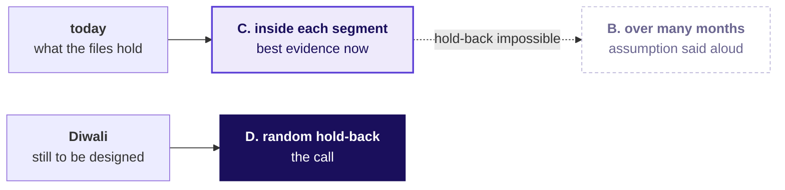
```mermaid
flowchart LR
    T["<b>today</b><br/>what the files hold"] --> C["<b>C. inside each segment</b><br/>best evidence now"]
    N["<b>Diwali</b><br/>still to be designed"] --> D["<b>D. random hold-back</b><br/>the call"]
    C -.->|"hold-back impossible"| B["<b>B. over many months</b><br/>assumption said aloud"]
    classDef known fill:#EEEAFB,stroke:#5B3FD6,color:#1A0F5C,stroke-width:2px
    classDef unknown fill:#FFFFFF,stroke:#B8B2D6,color:#6B6690,stroke-dasharray:4 3
    classDef bet fill:#1A0F5C,stroke:#1A0F5C,color:#FFFFFF
    class C known
    class D bet
    class B unknown
```

**The fact that would change the call.** A campaign so large, or a hold-back so hard, that the forgone lift runs into lakhs; then B over a long run of months, with its assumption said aloud.

```notes
LIVE, 2 minutes. D is cheap here, which the design slide prices. Leave the board drawing up.
```

---

## S5. Question: who got the monsoon sale?
*The campaigns table says who it was aimed at; the exposure table says who received it.*

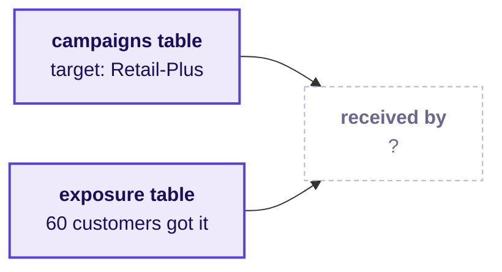
```mermaid
flowchart LR
    T["<b>campaigns table</b><br/>target: Retail-Plus"] --> Q["<b>received by</b><br/>?"]
    E["<b>exposure table</b><br/>60 customers got it"] --> Q
    classDef known fill:#EEEAFB,stroke:#5B3FD6,color:#1A0F5C,stroke-width:2px
    classDef unknown fill:#FFFFFF,stroke:#B8B2D6,color:#6B6690,stroke-dasharray:4 3
    class T,E known
    class Q unknown
```

**Question.** Of the customers who got the sale, the share who are Retail-Plus members is: a) all of them, since it targeted Retail-Plus; b) about half; c) about a tenth; d) none.

```notes
LIVE, 1 minute. Predict, then notebook 6, level 1.
```

---

## S6. Answer: half, so a rule chose them
*Aimed at Retail-Plus, received by 30 Retail-Plus and 30 Retail-Core customers.*

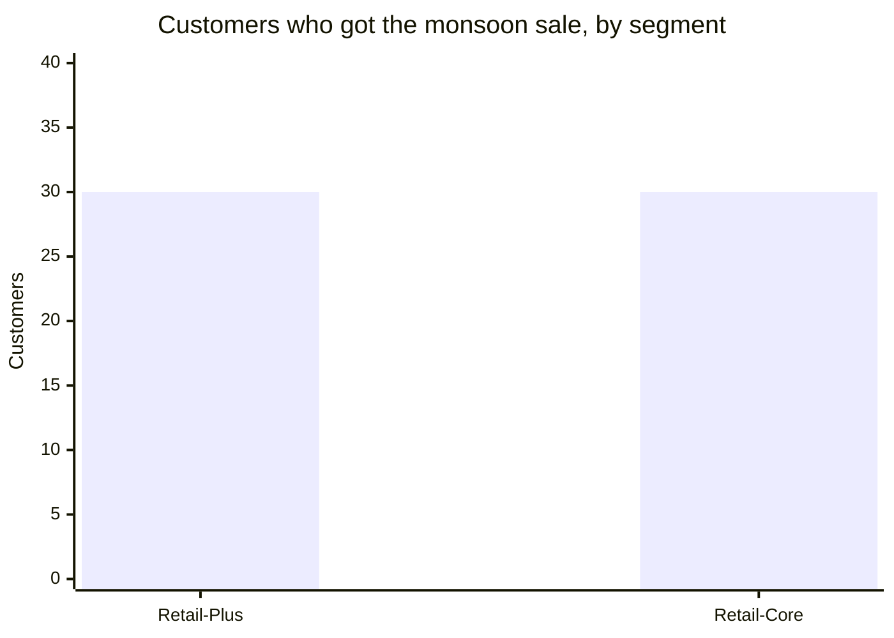
```mermaid
xychart-beta
    title "Customers who got the monsoon sale, by segment"
    x-axis ["Retail-Plus", "Retail-Core"]
    y-axis "Customers" 0 --> 40
    bar [30, 30]
```

The answer is b. Whatever rule chose them, it was a rule and never a coin, and a rule can pick the customers who were going to buy anyway.

```notes
LIVE, 2 minutes. That is the first of the three questions answered: the groups were chosen. Ask
what a rule that picks "engaged" customers would do to any comparison.
```

---

## S7. The plausible wrong answer: August against July
*A hurried readout opens the orders file and compares the sale month with the month before.*

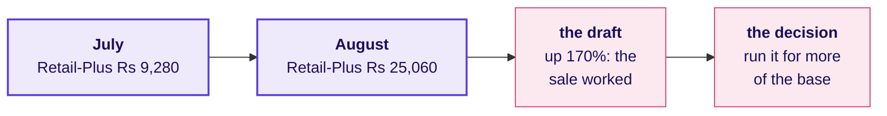
```mermaid
flowchart LR
    J["<b>July</b><br/>Retail-Plus Rs 9,280"] --> A["<b>August</b><br/>Retail-Plus Rs 25,060"]
    A --> C["<b>the draft</b><br/>up 170%: the<br/>sale worked"]
    C --> D["<b>the decision</b><br/>run it for more<br/>of the base"]
    classDef known fill:#EEEAFB,stroke:#5B3FD6,color:#1A0F5C,stroke-width:2px
    classDef bad fill:#FBE9EF,stroke:#D63A6A,color:#1A0F5C
    class J,A known
    class C,D bad
```

**What breaks.** "Retail-Plus delivered Rs 25,060 in August against Rs 9,280 in July, up 170%: the monsoon sale worked, so run it for more of the base at Diwali."

```notes
LIVE, 3 minutes. The arithmetic is right. Ask what else happened between July and August, and how
many orders July's figure stands on. Take two answers.
```

---

## S8. Why it is wrong: August moved for everyone
*The segment the sale was not aimed at jumped too, and months swing by half with no sale at all.*

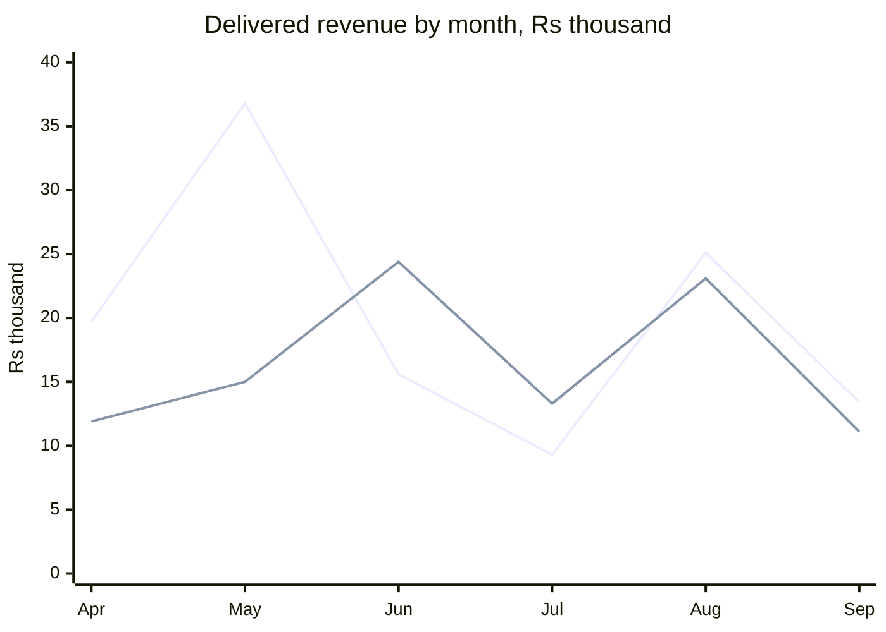
```mermaid
xychart-beta
    title "Delivered revenue by month, Rs thousand"
    x-axis ["Apr", "May", "Jun", "Jul", "Aug", "Sep"]
    y-axis "Rs thousand" 0 --> 40
    line [19.7, 36.8, 15.6, 9.3, 25.1, 13.4]
    line [11.9, 15.0, 24.4, 13.3, 23.1, 11.1]
```

**The check.** Retail-Core, the segment the sale was not aimed at, rose 73 percent from July to August. Retail-Plus fell 58 percent from May to June with no sale running. July's Retail-Plus figure stands on 4 delivered orders.

```notes
LIVE, 4 minutes. The first line is Retail-Plus, the second Retail-Core, from notebook 6, level 3.
Point at May to June: a fall of more than half, no campaign anywhere. A month's revenue on a few
orders swings by half on its own.
```

---

## S9. The fix: August's share, against chance
*Compare like with like in time: August's share of each segment's quarter, and how often chance makes it.*

```stats
value: 52.5% | label: Retail-Plus | note: August's share of its Q2, targeted
value: 48.6% | label: Retail-Core | note: August's share of its Q2, not targeted
value: 6 in 100 | label: chance | note: deals that give Retail-Plus's August that share
```

The 170 percent becomes an August four points busier than the untargeted segment's, a gap chance alone reaches often enough. The month file cannot separate the sale from a busy August.

```notes
LIVE, 3 minutes. The chance reference deals each of Retail-Plus's delivered Q2 orders to a month at
random, 5,000 times, and asks how often August takes at least 52.5 percent of the quarter. About 6
in 100: not rare. What changed: a 170 percent claim shrinks to "cannot tell from months".
```

---

## S10. The design: a hold-back at Diwali
*Decide before the sale, inside each segment, with a coin, and agree the measure in advance.*

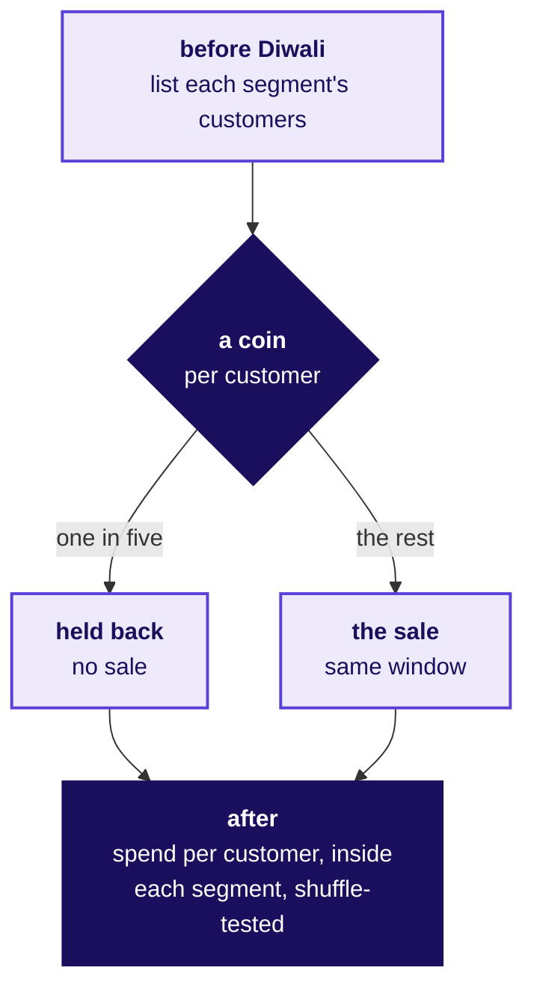
```mermaid
flowchart TB
    L["<b>before Diwali</b><br/>list each segment's customers"] --> C{"<b>a coin</b><br/>per customer"}
    C -->|"one in five"| H["<b>held back</b><br/>no sale"]
    C -->|"the rest"| S["<b>the sale</b><br/>same window"]
    H --> M["<b>after</b><br/>spend per customer, inside<br/>each segment, shuffle-tested"]
    S --> M
    classDef known fill:#EEEAFB,stroke:#5B3FD6,color:#1A0F5C,stroke-width:2px
    classDef bet fill:#1A0F5C,stroke:#1A0F5C,color:#FFFFFF
    class L,H,S known
    class C,M bet
```

**The price of knowing.** Holding back 14 of 70 Retail-Plus customers at Marketing's own 6 percent lift forgoes about Rs 4,200, and nothing if the lift is not real.

```notes
LIVE, 4 minutes. Name it as a held-back group, or a holdout; experiment design proper comes later in
the programme. Chance decides who gets the sale, so the groups are alike in everything else on
average, including who was going to buy anyway.
```

---

## S11. A second route: chapter 4's split agrees
*A different table and a different idea reach the same verdict, with an honest difference.*

| Route | What it finds | What it says |
|---|---|---|
| The months, beside Retail-Core | August's share 4 points higher, chance makes that about 6 in 100 | Cannot tell |
| Inside each segment, chapter 4 | Got it spent 3.0 percent less, in both segments | No lift, and possibly a loss |

**When to switch.** The months when no exposure table exists; the split when one does; the hold-back whenever the next campaign can still be designed.

```notes
LIVE, 2 minutes. Neither route shows the lift Marketing claimed, and neither is a fair comparison,
because nobody tossed a coin. That is why the line stays "do not repeat it as designed" and the
action is the hold-back.
```

---

## S12. Kavya's review of chapter 6
*A senior offers the test as a way forward, never as a verdict on Marketing's work.*

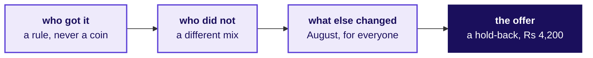
```mermaid
flowchart LR
    W["<b>who got it</b><br/>a rule, never a coin"] --> N["<b>who did not</b><br/>a different mix"]
    N --> E["<b>what else changed</b><br/>August, for everyone"]
    E --> T["<b>the offer</b><br/>a hold-back, Rs 4,200"]
    classDef known fill:#EEEAFB,stroke:#5B3FD6,color:#1A0F5C,stroke-width:2px
    classDef bet fill:#1A0F5C,stroke:#1A0F5C,color:#FFFFFF
    class W,N,E known
    class T bet
```

**Kavya's review.** Two routes find no lift, and you priced the test that would settle it. Take that to Marketing as an offer, never as a verdict on their work.

**In the interview.** [F] How would you set up the Diwali campaign so you can tell whether it worked? [D] Before and after, the change beside the change, the split, or a hold-back: which would you defend to a CFO?

```notes
LIVE, 1 minute. Transition: the escalated case, fifty minutes alone, on everything the six chapters
built.
```

---

## SECTION 7: The escalated case
*Fifty minutes alone: the Retail-Plus test, Student, the discount, and the whole note.*

```notes
LIVE. Fifty minutes, unguided. The TODO notebook is notebooks/C2_W01_D04_ex1_escalated_case_STUDENT.ipynb
and the brief is exercises/unguided/C2_W01_D04_escalated_STUDENT.md. The support TA answers
environment problems only. Collect the room's part 4 and part 5 answers for the debrief.
```

---

## S13. The brief: five parts, one page
*Everything the chapters built, alone and against the clock, ending in the note Meera reads.*

```timeline
label: Part 1 | title: Real? | body: Retail-Plus, 5,000 shuffles, seed 2026, and the p-value sentence.
label: Part 2 | title: Worth it? | body: The fall in rupees against the company's quarter.
label: Part 3 | title: Student | body: The rate with its count and its chance reference.
label: Part 4 | title: The discount | body: Did the monsoon sale lift revenue, and for whom?
label: Part 5 | title: The note | body: Claim, evidence, caveat, action for all three questions, under 200 words. | tone: dark
```

```notes
LIVE, 2 minutes. Read the five parts. Say that the case repeats the chapters on purpose, alone and
fast, with twelve choices to make in the notebook and a note to write at the end. Start the clock.
```

---

## S14. What the case asks that the chapters did not
*Every choice is yours, and the note has to survive Marketing's reply from chapter 6.*

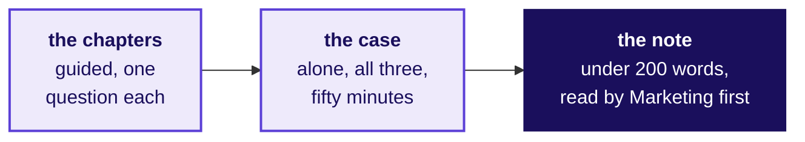
```mermaid
flowchart LR
    C["<b>the chapters</b><br/>guided, one<br/>question each"] --> A["<b>the case</b><br/>alone, all three,<br/>fifty minutes"]
    A --> N["<b>the note</b><br/>under 200 words,<br/>read by Marketing first"]
    classDef known fill:#EEEAFB,stroke:#5B3FD6,color:#1A0F5C,stroke-width:2px
    classDef bet fill:#1A0F5C,stroke:#1A0F5C,color:#FFFFFF
    class C,A known
    class N bet
```

**The rule.** Each number in the note carries its base, its count or chance, and the caveat that would change it.

```notes
LIVE, 1 minute. Leave this slide up while the room works.
```

---

## SECTION 8: The debrief
*Fifteen minutes on the answers the room got wrong, starting with the one most people got wrong.*

```notes
LIVE. Fifteen minutes. Before this chapter, collect the room's part 4 letters and three anonymised
note lines. Run the wrong answers in order of how many made them.
```

---

## S15. The wrong lines the case produced
*Each is a trap from a chapter, back in a new place, with the line that replaces it.*

| Wrong line | Why it fails | The line that replaces it |
|---|---|---|
| "A 3 percent chance we are wrong." | The share was counted in chance-only worlds. | "A fall this large turns up in about 3 of every 100 shuffles." |
| "Retail-Plus fell 34 percent." | A third of a tier that is under one percent of the company. | "Rs 24,420 a quarter, 0.19 percent of the company." |
| "Student is the growth story." | The rate stands on a handful of orders. | "Not yet: no budget moves until thirty orders a quarter." |
| "The discount lifted spend 6 percent." | The blend compares two different mixes. | "Inside each segment, the customers who got it spent less." |

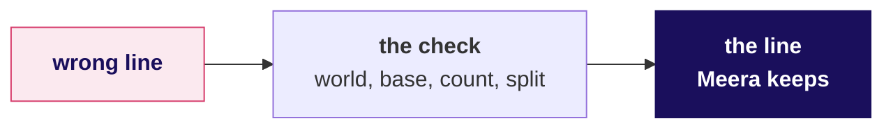
```mermaid
flowchart LR
    W["<b>wrong line</b>"] --> C["<b>the check</b><br/>world, base, count, split"] --> R["<b>the line<br/>Meera keeps</b>"]
    classDef bad fill:#FBE9EF,stroke:#D63A6A,color:#1A0F5C
    classDef bet fill:#1A0F5C,stroke:#1A0F5C,color:#FFFFFF
    class W bad
    class R bet
```

```notes
LIVE, 7 minutes. Read one real sentence from the room for each row, anonymised, and have the room
fix it aloud. A note with no caveat is the most common gap; read one and ask what would change it.
```

---

## S16. Question: which discount line survives review?
*Four drafts of the note's third line, written by the room this afternoon.*

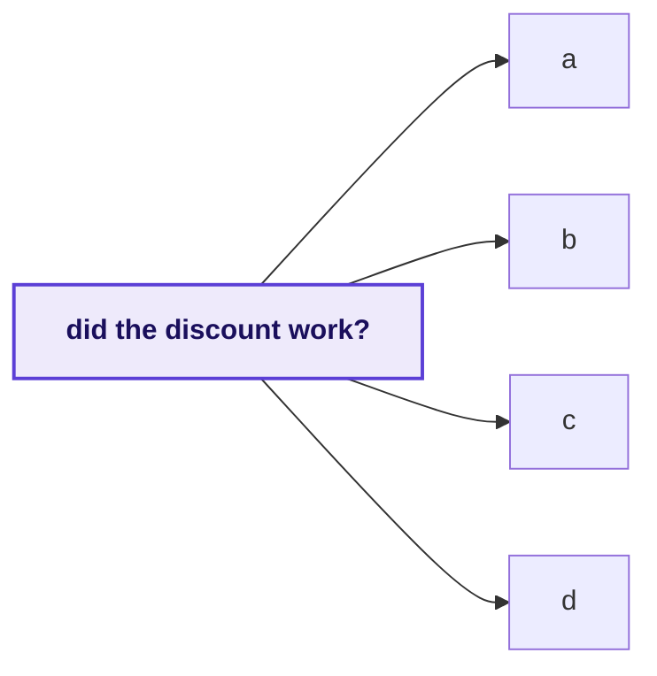
```mermaid
flowchart LR
    Q["<b>did the discount work?</b>"] --> A["a"]
    Q --> B["b"]
    Q --> C["c"]
    Q --> D["d"]
    classDef known fill:#EEEAFB,stroke:#5B3FD6,color:#1A0F5C,stroke-width:2px
    class Q known
```

**Question.** Which line goes to Meera? a) "Revenue per customer rose 6.1 percent, so repeat it for Diwali"; b) "It reached a group with more Retail-Plus members, and inside each segment the customers who got it spent less, so do not repeat it as designed and hold back a random slice at Diwali"; c) "The data is mixed, so more analysis is needed before anyone can say anything"; d) "The discount lost money, so end every discount from Monday."

```notes
LIVE, 3 minutes. Letters. Option c sounds careful and gives Meera nothing to act on. Option d
overclaims in the other direction.
```

---

## S17. Answer: the finding, the reason, the next test
*A position, the confounder named, and what would settle it next time.*

```timeline
label: Claim | title: A position | body: The sale did not lift spend inside either segment.
label: Evidence | title: Within each segment | body: Got it against did not, per customer, with counts.
label: Caveat | title: Who got it | body: The mix of the two groups, and August for everyone.
label: Action | title: The next test | body: Hold back a random fifth inside each segment at Diwali. | tone: dark
```

The answer is b. It takes a position, gives the reason, and says what would change it.

```notes
LIVE, 5 minutes. Read b aloud against the room's own lines. Transition to the break, then the second
case, where Marketing pushes back with a new number.
```

---

## SECTION 9: The second case
*Forty minutes in pairs: Marketing defends the monsoon sale, and the pair holds the caveat.*

```notes
LIVE. Ten-minute break before this chapter. Pairs work from exercises/unguided/C2_W01_D04_pushback_STUDENT.md
and notebooks/C2_W01_D04_ex2_second_case_STUDENT.ipynb. One partner plays Marketing for the last ten
minutes.
```

---

## S18. Marketing pushes back
*The rebuttal arrives in the meeting, in front of Meera, with a fresh number.*

**The client asks.** "Your segment split is slicing the data until it says what you want. Exposed Retail-Plus members spent Rs 4,850 in August. That is far above the Rs 3,200 our unexposed customers averaged. The sale works." The marketing lead

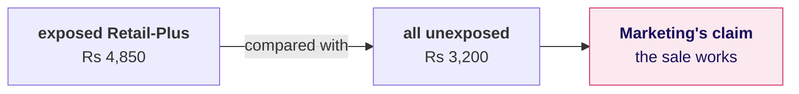
```mermaid
flowchart LR
    A["<b>exposed Retail-Plus</b><br/>Rs 4,850"] -->|"compared with"| B["<b>all unexposed</b><br/>Rs 3,200"]
    B --> C["<b>Marketing's claim</b><br/>the sale works"]
    classDef bad fill:#FBE9EF,stroke:#D63A6A,color:#1A0F5C
    class C bad
```

```notes
LIVE, 3 minutes. Both numbers are in the exposure table and the pair can reproduce them. The trap is
the comparison: one segment's exposed members against everyone unexposed. Let the pairs find it.
```

---

## S19. The pair's job, in four moves
*Reproduce Marketing's number, find what it compares, rebuild it fairly, and hold the line politely.*

```cards
icon: repeat | eyebrow: Move 1 | title: Reproduce | body: Compute Rs 4,850 and Rs 3,200 from the exposure table.
icon: search-check | eyebrow: Move 2 | title: Name the mismatch | body: Say which customers sit in each group, and what else differs.
icon: columns-2 | eyebrow: Move 3 | title: Rebuild | body: Like for like, inside Retail-Plus, with the counts beside each average.
icon: message-square | eyebrow: Move 4 | title: Hold the line | body: One reply to Marketing, in two sentences, with the Diwali hold-back offered. | tone: dark
```

```notes
LIVE, 2 minutes. Move 4 is spoken, never written first. The partner playing Marketing is allowed to
push once more, and the pair answers with chapter 6's design and its price.
```

---

## S20. Monday's rule returns: what 15 percent off costs
*A discount of 15 percent needs 17.6 percent more volume just to stand still.*

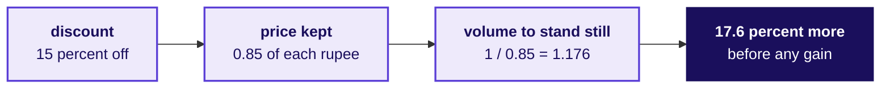
```mermaid
flowchart LR
    D["<b>discount</b><br/>15 percent off"] --> P["<b>price kept</b><br/>0.85 of each rupee"]
    P --> V["<b>volume to stand still</b><br/>1 / 0.85 = 1.176"]
    V --> R["<b>17.6 percent more</b><br/>before any gain"]
    classDef known fill:#EEEAFB,stroke:#5B3FD6,color:#1A0F5C,stroke-width:2px
    classDef bet fill:#1A0F5C,stroke:#1A0F5C,color:#FFFFFF
    class D,P,V known
    class R bet
```

**Kavya's review.** Even a real lift has to clear the discount's cost. Ask Marketing for the volume lift, and set it against 17.6 percent.

```notes
LIVE, 3 minutes. The campaigns table records 15 percent off; the break-even is Monday's companion
experiment C. The exposure table does not say whether August revenue is before or after the
discount, and the pair should list that as a question for Marketing rather than assume it.
```

---

## SECTION 10: The interview drill
*Twenty minutes aloud: the row's six questions, the follow-ups and the design question, sixty seconds each.*

```notes
LIVE. Twenty minutes. Pairs: one asks, one answers in sixty seconds, the asker scores on the four
parts. Swap every question. The model answers are in the study notes and the day sheet.
```

---

## S21. The six questions every screen asks
*The row's anchors, tagged the way the programme tags them.*

| Tag | Question |
|---|---|
| [S] | How do you know whether a change in a metric is significant? |
| [S] | Explain a finding to a non-technical stakeholder. |
| [S] | What does p = 0.03 mean, and not mean? |
| [F] | 42 percent on 12 users against 31 percent on 1,200; which do you trust? |
| [F] | Revenue rose after a discount; did the campaign work, and what would you need to know? |
| [D] | The CEO wants a yes or no and the honest answer is "not yet"; what do you say, and how do you hold the line when marketing pushes? |


```mermaid
flowchart LR
    S["<b>[S]</b> staple"] --> F["<b>[F]</b> frequent"] --> D["<b>[D]</b> differentiator"]
    classDef known fill:#EEEAFB,stroke:#5B3FD6,color:#1A0F5C,stroke-width:2px
    classDef bet fill:#1A0F5C,stroke:#1A0F5C,color:#FFFFFF
    class S,F known
    class D bet
```

```notes
LIVE, 8 minutes. About a minute and a half per question including the swap. Listen for p-value
sentences that talk about the real world; stop the pair and ask which world the share was counted in.
```

---

## S22. Follow-ups and the design question
*The same ideas pushed one step further, the way a second-round interviewer pushes.*

| Tag | Follow-up |
|---|---|
| [F] | A metric moved and the test says significant; how do you decide whether the business should act? |
| [F] | The campaign lifted revenue overall but every segment fell; how is that possible, and which do you report? |
| [S] | What is a confounder? Give an example from a campaign. |
| [D] | Marketing says your segment split is cherry-picking; how do you respond? |
| [D] | Design: a shuffle test, a textbook test, a bootstrap range or wait a quarter; which do you choose for Monday, sized how, and what would switch it? |
| [D] | You tested twenty segments and one came back at p = 0.03; what do you say? |

```notes
LIVE, 8 minutes. The design question is the one the day added: the answer names the option, sizes
it on this file, and names the fact that would switch it. The last one is recognition only: one in
twenty chance-only tests reaches 0.05 by itself.
```

---

## S23. How a sixty-second answer is scored
*The note's four parts, said aloud, are the scoring sheet for every answer in the drill.*

```bar
label: Claim | value: 15 | caption: one sentence, first
label: Evidence | value: 20 | caption: a number with its count
label: Caveat | value: 15 | caption: what would change it
label: Action | value: 10 | caption: what to do next
```

The seconds are a guide for sixty in total: the evidence gets the most, and the claim comes first.

```notes
LIVE, 4 minutes. The asker ticks each part heard. A missing caveat is the most common gap; the
second most common is evidence with no count.
```

---

## SECTION 11: The close
*The sentence to Meera, the six lines worth keeping, the Kahoot, and Friday's question.*

```notes
LIVE. Fifteen minutes: the sentence and the crux lines (4), the Kahoot (9), Friday's question (2).
```

---

## S24. The sentence to Meera
*The whole page compressed into what she will repeat in the growth review.*

| Question | Your line carries |
|---|---|
| Retail-Plus | Real, its size in rupees against the quarter, and the offer tested on half |
| Student | The rate, its count, whether chance makes it, and the count that reopens it |
| The discount | The split by segment, who got it, what else changed, and the Diwali hold-back |

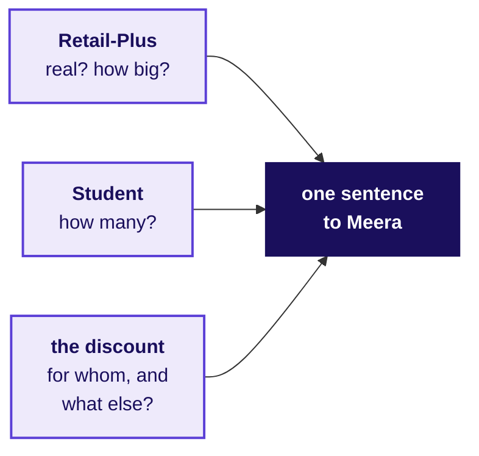
```mermaid
flowchart LR
    A["<b>Retail-Plus</b><br/>real? how big?"] --> N["<b>one sentence<br/>to Meera</b>"]
    B["<b>Student</b><br/>how many?"] --> N
    C["<b>the discount</b><br/>for whom, and<br/>what else?"] --> N
    classDef known fill:#EEEAFB,stroke:#5B3FD6,color:#1A0F5C,stroke-width:2px
    classDef bet fill:#1A0F5C,stroke:#1A0F5C,color:#FFFFFF
    class A,B,C known
    class N bet
```

```notes
LIVE, 2 minutes. Three learners read their one sentence aloud. The model sentence is in the day
sheet; read it only after three learners have read theirs.
```

---

## S25. Six lines worth keeping
*One line per chapter; the same six close the study notes and head the cheat sheet, word for word.*

| # | The line |
|---|---|
| 1 | A p-value is a share of chance-only worlds; it is never the chance the finding is wrong. |
| 2 | Real and worth acting on are two separate calls: the shuffle answers the first, rupees against cost answer the second. |
| 3 | Count what a rate stands on before you repeat it; under thirty, it is a lead. |
| 4 | Split an aggregate by segment before you credit a campaign, and name who got it. |
| 5 | The note is claim, evidence, caveat, action, and "not yet, and here is what would tell us" is a complete answer. |
| 6 | A fair comparison asks who got it, who did not, and what else changed; only a coin makes the two groups alike. |

```notes
LIVE, 2 minutes. Have the room read line 1 aloud together. Line 5 is the one Saturday's paper asks
for from memory.
```

---

## S26. The Kahoot: eight items, ungraded
*Seven on today and one return question from Wednesday.*

```stats
value: 8 | label: items | note: including Wednesday's return question
value: 0 | label: scores kept | note: ungraded, as every Kahoot is
value: 9 min | label: to run it | note: then two answers discussed
```

```notes
LIVE, 9 minutes. Run kahoot/C2_W01_D04_quiz_STUDENT.md. Stop after item 2 and item 5 for thirty
seconds each; they are the two traps of the day.
```

---

## S27. Friday's question, left open
*Tomorrow the week is rebuilt without an assistant, on a file nobody has seen.*

**The client asks.** "Can you do all of this again, alone, on a fresh export, and defend it to Marketing's face?" Meera Raghavan

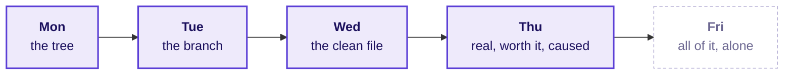
```mermaid
flowchart LR
    M["<b>Mon</b><br/>the tree"] --> T["<b>Tue</b><br/>the branch"] --> W["<b>Wed</b><br/>the clean file"] --> H["<b>Thu</b><br/>real, worth it, caused"] --> F["<b>Fri</b><br/>all of it, alone"]
    classDef known fill:#EEEAFB,stroke:#5B3FD6,color:#1A0F5C,stroke-width:2px
    classDef unknown fill:#FFFFFF,stroke:#B8B2D6,color:#6B6690,stroke-dasharray:4 3
    class M,T,W,H known
    class F unknown
```

```notes
LIVE, 2 minutes. Do not preview the lab's file or its defects. Say tonight's take-home and the
pre-read, and that the note is read aloud to someone outside the programme before Friday.
```
