# Should the sale run again at Diwali?

Week 1, Day 4. Afternoon.

Kicker: WEEK 1  ·  THURSDAY  ·  AFTERNOON
Quote: Diwali is five weeks away. I want the monsoon sale again, and I want it for more of the base.
Who: The marketing lead, Kalpa Retail, answering the morning's note before Monday's growth review

```notes
LIVE, one minute. Read the marketing lead's words aloud. The morning answered Meera's three
questions and wrote the note; this afternoon opens on chapter 6, the fair comparison Marketing's
reply demands, then the escalated case, the debrief, the second case, the interview drill and the
Kahoot. Then what the morning settled.
```

---

## S1. Borderline, watch it, not yet, and not as designed
*What did the morning settle, and what does Marketing's reply now ask?*

| Chapter | Its question | The answer |
|---|---|---|
| 1 | Real, or the wobble? | Borderline: 0.029 of flips counting falls, 0.057 either way |
| 2 | Worth acting on? | Worth watching, and not worth acting on alone: Rs 24,420 a quarter |
| 3 | How many behind 40%? | Not yet: under thirty customers, and chance makes it 4 times in 10 |
| 4 | Did the discount work? | Not as designed: 3 percent less inside each segment |
| 5 | What goes on the page? | A four-part note of 193 words |

Kavya Nair, the team's senior analyst, reviewed each answer before it reached Meera. Marketing's reply asks chapter 6's question: who got the sale, what else changed, and what would settle it at Diwali?

```notes
LIVE, 2 minutes. Read the five answers down the right-hand column. Retail-Plus is Kalpa's paid
membership tier. The monsoon sale gave 15 percent off from 5 to 19 August, aimed at Retail-Plus.
Then chapter 6.
```

---

## SECTION 6: What would settle it?
*Marketing wants the sale again for more of the base: who got it, what else changed, and what would settle it at Diwali?*

```notes
LIVE. Thirty minutes with the cover and the recap: the need and the company (4), the options and
the call (4), who got it (3), the trap and what else changed (5), the fix and its code (4), the
hold-back designed (4), the second route (2), and the close (1). Notebook 6 runs beside it.
```

---

## S2. Answering it before Meera signs Diwali's plan
*Who needs to know what would settle the sale at Diwali, and which six questions lead there?*

**Who needs the answer.** Meera signs the Diwali plan, and Marketing will defend its campaign on Monday. A sale widened on a jump that belongs to the month multiplies the margin it gives away.

```timeline
label: 1 | title: Which way can the files answer? | body: Before-after, beside, inside, hold-back
label: 2 | title: Who got it? | body: The target against the platform's list
label: 3 | title: August against July? | body: The plausible wrong answer
label: 4 | title: What else changed? | body: The segment beside it
label: 5 | title: How would Diwali settle it? | body: A hold-back, priced
label: 6 | title: Do quiet months agree? | body: The same test, no sale | tone: dark
```

```notes
LIVE, 1 minute. Read the six questions. Each gets its answer before the next is asked, and the
chapter's last slide answers all six. Then Marketing's ask.
```

---

## S3. Marketing wants the sale again, for more of the base
*What does Marketing want for Diwali?*

**The client asks.** "Diwali is five weeks away. I want the monsoon sale again, and I want it for more of the base." The marketing lead, Kalpa Retail

```cards
icon: tag | eyebrow: The metric | title: Revenue without the sale | body: What the targeted customers would have spent in August if nobody had offered them 15 percent off.
icon: user | eyebrow: Who decides | title: Meera signs Diwali | body: A sale that lifts nothing gives 15 percent of the price to customers who would have bought anyway.
icon: triangle-alert | eyebrow: A wrong call costs | title: Margin, at scale | body: Widening the sale to more of the base multiplies whatever it gives away. | tone: dark
```

```notes
LIVE, 2 minutes. The question under the ask is counterfactual: what would these customers have
spent without the sale? Nobody can observe it directly, which is why the comparison group matters.
Then a company that tested what its ads caused.
```

---

## S4. eBay's test found most ad credit arrived anyway
*Has a real company tested what its campaign caused?*

```cards
icon: search | eyebrow: Brand-name ads | title: No measurable benefit | body: When eBay stopped them in a test, almost all of the lost clicks arrived through ordinary search results instead.
icon: scale | eyebrow: Controlled against usual | title: A fraction of the credit | body: Because search clicks and purchases go together, the returns a controlled test found were a fraction of what the usual readings had credited. | tone: dark
```

Blake, Nosko and Tadelis, NBER Working Paper 20171: a campaign is credited with sales it did not cause unless someone asks who would have bought anyway.

```notes
LIVE, 1 minute. Source, checked 30 September 2026: https://www.nber.org/papers/w20171. Quotes from
the abstract: "brand-keyword ads have no measurable short-term benefits"; "returns from paid search
are a fraction of conventional non-experimental estimates". The same paper's split by customer type
was chapter 4's company case. Then the four ways to ask.
```

---

## S5. The split today; a random hold-back for Diwali
*Which of four ways to ask "did the sale cause it?" can the files answer?*

| Option | What it stands on | What it assumes |
|---|---|---|
| A. Before and after | Finance's file: 13 Retail-Plus orders, July and August | Nothing else changed between the months |
| B. The change beside the change | Finance's file: 31 orders, Retail-Plus and Retail-Core | Both segments would have moved alike |
| C. Inside each segment | The platform's list: 160 customers, chapter 4 | Who got it was as good as random inside a segment |
| D. A random hold-back at Diwali | The platform's list: a fifth of its 70 Retail-Plus customers | Nothing: a coin decides |

The platform's list records who received the sale, under its own ids, and cannot be matched to Finance's order file, so each option stands on the file that can answer it.

```notes
LIVE, 3 minutes. Notebook 6's sizing cell counts what each option stands on. A and B stand on a
handful of orders a month, and chapter 3 already said what a handful is worth. Say the list in full
once: the campaign platform's August list of 160 Retail-Plus and Retail-Core customers, under the
platform's own customer ids, with one average August spend for each group, recording who received
the sale whatever it was aimed at. It cannot be matched to Finance's order file, whose 22
Retail-Plus members and discount column carry no record of the sale. So it answers who got the sale
and how the groups differ, and it sizes the Diwali hold-back; the retention offer was sized on
Finance's file. Then the call.
```

---

## S6. The split today; a Diwali hold-back unless lakhs ride
*Why does Diwali get a hold-back, and what fact would switch the call?*

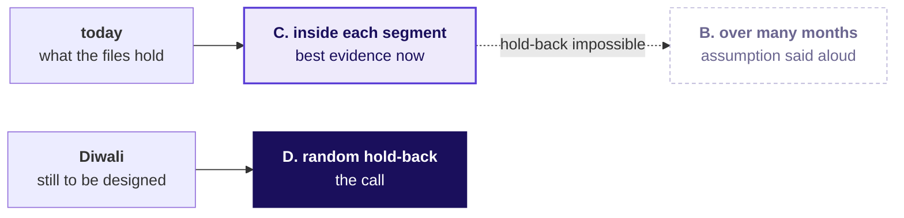
```mermaid
flowchart LR
    T["<b>today</b><br/>what the files hold"] --> C["<b>C. inside each segment</b><br/>best evidence now"]
    N["<b>Diwali</b><br/>still to be designed"] --> D["<b>D. random hold-back</b><br/>the call"]
    C -.->|"hold-back impossible"| B["<b>B. over many months</b><br/>assumption said aloud"]
    classDef known fill:#EEEAFB,stroke:#5B3FD6,color:#1A0F5C,stroke-width:2px
    classDef unknown fill:#FFFFFF,stroke:#B8B2D6,color:#6B6690,stroke-dasharray:4 3
    classDef bet fill:#1A0F5C,stroke:#1A0F5C,color:#FFFFFF
    class C known
    class D bet
    class B unknown
```

**The fact that would change the call.** A campaign so large, or a hold-back so hard, that the forgone lift runs into lakhs; then B over a long run of months, with its assumption said aloud.

```notes
LIVE, 1 minute. D is cheap here, which the design slide prices. Leave the board drawing up. Then the
first of the three questions every readout needs.
```

---

## S7. Question: who got the monsoon sale?
*The campaigns table says whom the sale was aimed at: who actually received it?*

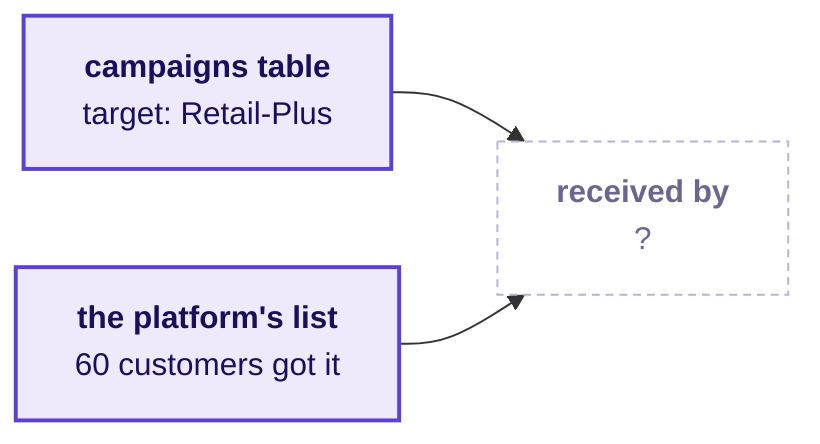
```mermaid
flowchart LR
    T["<b>campaigns table</b><br/>target: Retail-Plus"] --> Q["<b>received by</b><br/>?"]
    E["<b>the platform's list</b><br/>60 customers got it"] --> Q
    classDef known fill:#EEEAFB,stroke:#5B3FD6,color:#1A0F5C,stroke-width:2px
    classDef unknown fill:#FFFFFF,stroke:#B8B2D6,color:#6B6690,stroke-dasharray:4 3
    class T,E known
    class Q unknown
```

**Question.** Of the customers who got the sale, the share who are Retail-Plus members is: a) all of them, since it targeted Retail-Plus; b) about half; c) about a tenth; d) none.

```notes
LIVE, 1 minute. Predict, then notebook 6's first section. The campaigns table is the plan; the
platform's list is what was sent, so where they disagree the list is the one to trust for who got
the sale. Then the answer.
```

---

## S8. Answer: half were Retail-Core, so a rule chose them
*Who got the monsoon sale?*

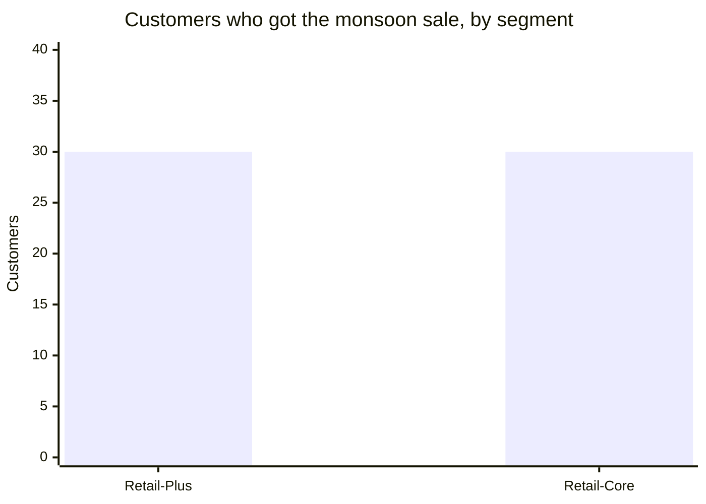
```mermaid
xychart-beta
    title "Customers who got the monsoon sale, by segment"
    x-axis ["Retail-Plus", "Retail-Core"]
    y-axis "Customers" 0 --> 40
    bar [30, 30]
```

The answer is b. Aimed at Retail-Plus, received by 30 Retail-Plus and 30 Retail-Core customers: whatever chose them was a rule, and a rule can pick the customers who were going to buy anyway.

```notes
LIVE, 2 minutes. That is the first of the three questions answered: the groups were chosen. Ask
what a rule that picks "engaged" customers would do to any comparison. Then the readout a hurried
analyst writes.
```

---

## S9. The plausible wrong answer: August against July
*Does August against July show the sale worked?*

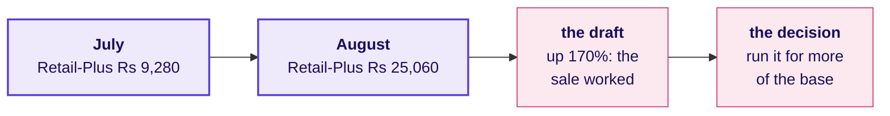
```mermaid
flowchart LR
    J["<b>July</b><br/>Retail-Plus Rs 9,280"] --> A["<b>August</b><br/>Retail-Plus Rs 25,060"]
    A --> C["<b>the draft</b><br/>up 170%: the<br/>sale worked"]
    C --> D["<b>the decision</b><br/>run it for more<br/>of the base"]
    classDef known fill:#EEEAFB,stroke:#5B3FD6,color:#1A0F5C,stroke-width:2px
    classDef bad fill:#FBE9EF,stroke:#D63A6A,color:#1A0F5C
    class J,A known
    class C,D bad
```

**What breaks.** "Retail-Plus delivered Rs 25,060 in August against Rs 9,280 in July, up 170%: the monsoon sale worked, so run it for more of the base at Diwali."

```notes
LIVE, 2 minutes. The arithmetic is right. Ask what else happened between July and August, and how
many orders July's figure stands on. Take two answers. Then what else changed.
```

---

## S10. Why it is wrong: August moved for everyone
*Why does August against July mislead, and what does a month stand on?*

| Delivered, Rs | Apr | May | Jun | Jul | Aug | Sep |
|---|---|---|---|---|---|---|
| Retail-Plus, targeted | 19,650 | 36,840 | 15,640 | 9,280 | 25,060 | 13,370 |
| Retail-Core, not aimed at | 11,920 | 15,000 | 24,380 | 13,320 | 23,090 | 11,140 |

**The check.** Retail-Core, the segment the sale was not aimed at (though the platform's list shows it reached some Retail-Core customers), rose 73 percent from July to August. Retail-Plus fell 58 percent from May to June with no sale running. July's Retail-Plus figure stands on 4 delivered orders.

```notes
LIVE, 3 minutes. Notebook 6 draws these two rows as lines. Point at May to June: a fall of more than
half, no campaign anywhere. A month's revenue on a few orders swings by half on its own. Then the
like-for-like comparison.
```

---

## S11. August was busy for both segments, 4 points apart
*What else changed in August?*

```stats
value: 52.5% | label: Retail-Plus | note: August's share of its Q2, targeted
value: 48.6% | label: Retail-Core | note: August's share of its Q2, not aimed at
value: 8 in 10 | label: either way | note: label shuffles making a 4-point gap; 4 in 10 in Marketing's direction
```

The 170 percent becomes an August four points busier than the untargeted segment's, a gap chance makes about eight times in ten either way, and four in ten in the direction Marketing's claim points. The months show no sign of the sale beyond a busy August for everyone.

```notes
LIVE, 3 minutes. These are different customers in each segment, so the chance reference shuffles the
segment labels across both segments' delivered Q2 orders, 5,000 times. As in chapter 1, both
directions are reported, since neither was fixed before August was seen: 0.82 either way, 0.40 for a
Retail-Plus share that much higher. What changed: a 170 percent claim shrinks to "no sign in the
months". Then the test as code.
```

---

## S12. The month test deals the segment labels at random
*What does the like-for-like test look like in code?*

```python
gap = share(plus_orders) - share(core_orders)   # August's share of Q2
for _ in range(5000):
    random.shuffle(rows)                         # deal the segment labels
    chance.append(share(rows[:n_plus]) - share(rows[n_plus:]))
either = sum(abs(c) >= abs(gap) for c in chance) / 5000
```

The label shuffle fits here because Retail-Plus and Retail-Core are different customers; chapter 1 flipped each member's own pair because there the same members were measured twice.

```notes
LIVE, 1 minute. Read the loop against chapter 1's: the same idea, a chance-only world built many
times, with the design deciding how. The notebook's function is month_share_test, seed 2026. Then
the comparison that would settle it.
```

---

## S13. A coin holds back one in five, about Rs 4,200 forgone
*How would a hold-back at Diwali be designed and priced?*

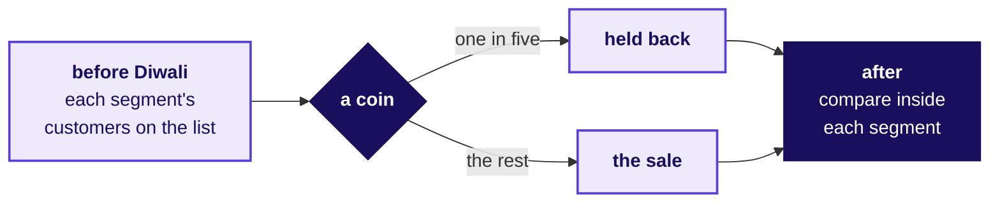
```mermaid
flowchart LR
    L["<b>before Diwali</b><br/>each segment's<br/>customers on the list"] --> C{"<b>a coin</b>"}
    C -->|"one in five"| H["<b>held back</b>"]
    C -->|"the rest"| S["<b>the sale</b>"]
    H --> M["<b>after</b><br/>compare inside<br/>each segment"]
    S --> M
    classDef known fill:#EEEAFB,stroke:#5B3FD6,color:#1A0F5C,stroke-width:2px
    classDef bet fill:#1A0F5C,stroke:#1A0F5C,color:#FFFFFF
    class L,H,S known
    class C,M bet
```

Holding back 14 of the platform's 70 Retail-Plus customers at Marketing's own 6 percent lift forgoes about Rs 4,200, and nothing if the lift is not real. The retention test was sized on Finance's 22 members; each decision is sized on the list it acts on.

**In the interview.** [F] How would you set up the Diwali campaign so you can tell whether it worked?

```notes
LIVE, 4 minutes. Meet the two lists head-on. The morning priced the retention offer on "the whole
tier" of 22 and tests it on half of them, and this hold-back takes 14 of 70. Both are right: the 22
are Finance's order file, where Retail-Plus members delivered about Rs 1,139 each in August; the 70
are the platform's list, where Retail-Plus customers who did not get the sale averaged Rs 5,000.
Different ids and different measures, delivered revenue per member against the platform's average
spend, so neither checks the other. Fourteen are too few to see a 6 percent lift; sizing a hold-back
is power, which comes later. Chance decides who gets the sale, so the groups are alike in everything
else on average, including who was going to buy anyway. Then a second route.
```

---

## S14. Quiet months make gaps of 4, 22 and 26 points
*Does the month-share test, run on Q1's months with no sale, find gaps as large as August's?*

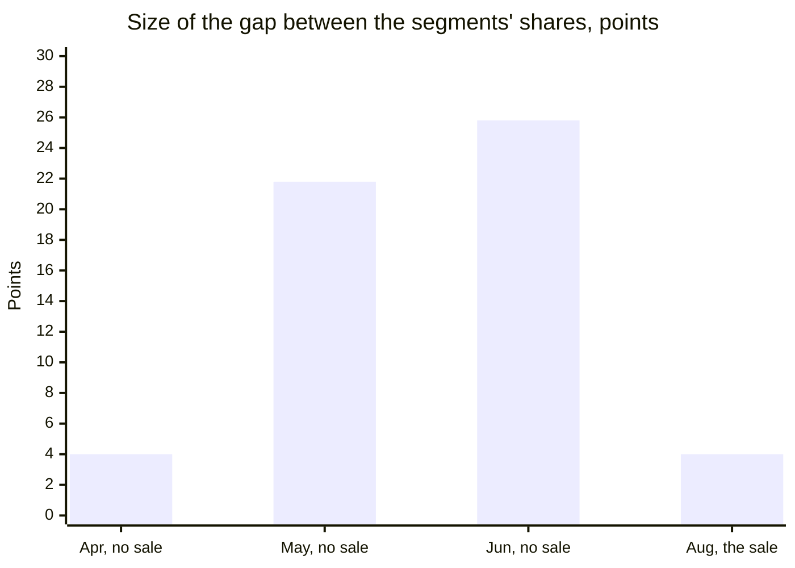
```mermaid
xychart-beta
    title "Size of the gap between the segments' shares, points"
    x-axis ["Apr, no sale", "May, no sale", "Jun, no sale", "Aug, the sale"]
    y-axis "Points" 0 --> 30
    bar [4.0, 21.8, 25.8, 4.0]
```

Months with no sale make gaps as large as August's and far larger (June's is -25.8 points, drawn by its size), so August's four points carry no sign of the sale. **When to switch.** The months when no exposure list exists; the split when one does; the hold-back whenever the next campaign can still be designed.

```notes
LIVE, 2 minutes. Notebook 6's second route, a placebo: the same month-share test on a different
quarter of Finance's file, sharing nothing with chapter 4's split. Shuffled labels make May's and
June's gaps in about 15 and 7 deals in 100 counting either way. Chapter 4's split found 3 percent
less in both segments; neither route shows the lift Marketing claimed, and neither is a fair
comparison, because nobody tossed a coin. That is why the action is the hold-back. Then the
chapter's answer.
```

---

## S15. No lift the sale can claim: hold back at Diwali
*So who got the sale, what else changed, and what would settle it at Diwali?*

| The question on the way | The answer |
|---|---|
| 1. Which way can the files answer? | The split today, a random hold-back for Diwali |
| 2. Who got it? | 30 Retail-Plus and 30 Retail-Core: a rule chose them |
| 3. August against July? | Up 170 percent, but Retail-Core rose 73 too |
| 4. What else changed? | August, for everyone: 52.5 against 48.6 percent |
| 5. How would Diwali settle it? | One in five held back by coin, about Rs 4,200 |
| 6. Do quiet months agree? | Yes: gaps of 4, 22 and 26 points with no sale |

**Kavya's review.** Two routes find no lift, and a quarter with no sale swings further than August. You priced the hold-back on the list it acts on; take it to Marketing as an offer.

```notes
LIVE, 1 minute. Kavya keeps any verdict on Marketing's work out of it: the test is a way forward.
The design question for the drill: before and after, the change beside the change, the split, or a
hold-back, which would you defend to a CFO? Then the escalated case, fifty minutes alone.
```

---

## SECTION 7: Can you do it alone?
*Can you answer Meera's three questions alone in fifty minutes, and ship a note under 200 words that survives Marketing?*

```notes
LIVE. Fifty minutes, unguided. The TODO notebook is notebooks/C2_W01_D04_ex1_escalated_case_STUDENT.ipynb
and the brief is exercises/unguided/C2_W01_D04_escalated_STUDENT.md. The support TA answers
environment problems only. Collect the room's part 4 and part 5 answers for the debrief.
```

---

## S16. Answer it in five parts, one page by the end
*What does the case ask for, part by part?*

```timeline
label: Part 1 | title: More than the wobble? | body: The Retail-Plus fall, counted in both directions.
label: Part 2 | title: How big, and who is tested? | body: The fall against the company's quarter, and the offer's first test.
label: Part 3 | title: What stands behind 40%? | body: Student's orders, and how often chance makes the rise.
label: Part 4 | title: Did the sale lift spend? | body: The monsoon sale, and for whom.
label: Part 5 | title: What does the note say? | body: The Diwali hold-back sized, then the note under 200 words. | tone: dark
```

```notes
LIVE, 2 minutes. Read the five parts. The case repeats the chapters on purpose, alone and fast,
with twelve choices to make in the notebook and a note to write at the end. Each check cell compares
the learner's numbers with the numbers they should reach. Start the clock. Then leave the next slide
up while the room works.
```

---

## S17. Every choice is yours, and Marketing reads it first
*What does the case ask that the chapters did not?*

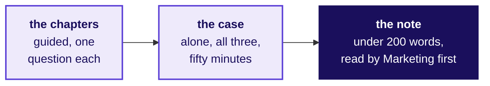
```mermaid
flowchart LR
    C["<b>the chapters</b><br/>guided, one<br/>question each"] --> A["<b>the case</b><br/>alone, all three,<br/>fifty minutes"]
    A --> N["<b>the note</b><br/>under 200 words,<br/>read by Marketing first"]
    classDef known fill:#EEEAFB,stroke:#5B3FD6,color:#1A0F5C,stroke-width:2px
    classDef bet fill:#1A0F5C,stroke:#1A0F5C,color:#FFFFFF
    class C,A known
    class N bet
```

**The rule.** Each number in the note carries its base, its count or chance, and the caveat that would change it.

```notes
LIVE, 48 minutes. Leave this slide up while the room works. Then the debrief.
```

---

## SECTION 8: Which lines broke?
*Which lines did the room get wrong this afternoon, which chapter's trap made each, and what replaces it?*

```notes
LIVE. Fifteen minutes. Before this chapter, collect the room's part 4 letters and three anonymised
note lines. Run the wrong answers in order of how many made them.
```

---

## S18. Answer: four wrong lines, each a chapter's trap
*Which chapter's trap made each wrong line, and what replaces it?*

| Wrong line | Why it fails | The line that replaces it |
|---|---|---|
| "A 3 percent chance we are wrong." | The share was counted in chance-only worlds. | "A fall this large turns up in about 3 of every 100 flips, 6 either way." |
| "Retail-Plus fell 34 percent." | A third of a tier that is under one percent of the company. | "Rs 24,420 a quarter, 0.19 percent of the company." |
| "Student is the growth story." | The rate stands on a handful of orders from few customers. | "Not yet: no budget moves until more customers buy." |
| "The discount lifted spend 6 percent." | The blend compares two different mixes. | "Inside each segment, the customers who got it spent less." |

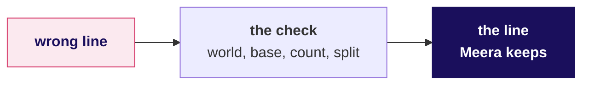
```mermaid
flowchart LR
    W["<b>wrong line</b>"] --> C["<b>the check</b><br/>world, base, count, split"] --> R["<b>the line<br/>Meera keeps</b>"]
    classDef bad fill:#FBE9EF,stroke:#D63A6A,color:#1A0F5C
    classDef bet fill:#1A0F5C,stroke:#1A0F5C,color:#FFFFFF
    class W bad
    class R bet
```

```notes
LIVE, 7 minutes. Read one real sentence from the room for each row, anonymised, and have the room
fix it aloud. A note with no caveat is the most common gap; read one and ask what would change it.
Then the discount line.
```

---

## S19. Question: which discount line survives review?
*Which of four drafts of the note's third line goes to Meera?*

| Draft | The note's third line |
|---|---|
| a | "Revenue per customer rose 6.1 percent, so repeat it for Diwali." |
| b | "It reached a group with more Retail-Plus members, and inside each segment the customers who got it spent less, so do not repeat it as designed and hold back a random slice at Diwali." |
| c | "The data is mixed, so more analysis is needed before anyone can say anything." |
| d | "The discount lost money, so end every discount from Monday." |

**Question.** Which of the four drafts goes to Meera?

```notes
LIVE, 3 minutes. Letters. Option c sounds careful and gives Meera nothing to act on. Option d
overclaims in the other direction. Then the answer.
```

---

## S20. Answer: the finding, the reason, the next test
*Which discount line survives review, and why?*

```timeline
label: Claim | title: A position | body: The sale did not lift spend inside either segment.
label: Evidence | title: Within each segment | body: Got it against did not, per customer, with counts.
label: Caveat | title: Who got it | body: The mix of the two groups, and August for everyone.
label: Action | title: The next test | body: Hold back a random fifth inside each segment at Diwali. | tone: dark
```

The answer is b. It takes a position, gives the reason, and says what would change it.

```notes
LIVE, 5 minutes. Read b aloud against the room's own lines. Then the break, then the second case,
where Marketing pushes back with a new number.
```

---

## SECTION 9: Is the split fair?
*Marketing calls the segment split cherry-picking and brings Rs 4,850 against Rs 3,200: is their comparison fair, and how do you hold the line?*

```notes
LIVE. Ten-minute break before this chapter, then forty minutes in pairs. Pairs work from
exercises/unguided/C2_W01_D04_pushback_STUDENT.md and notebooks/C2_W01_D04_ex2_second_case_STUDENT.ipynb.
One partner plays Marketing for the last eight minutes.
```

---

## S21. Answering Marketing in four parts, in front of Meera
*Who needs a fair reply to Marketing, and which four parts lead to it?*

**Who needs the answer.** Meera hears both sides in the meeting. If Marketing's number wins the room, the sale runs again at Diwali on an unfair comparison; if the pair only says no, Marketing hears a verdict and nothing it can use.

```cards
icon: repeat | eyebrow: Part 1 | title: Reproduce | body: Make Rs 4,850 and Rs 3,200 appear from the platform's list.
icon: search-check | eyebrow: Part 2 | title: Name the mismatch | body: Who sits in each of Marketing's two groups, and what else differs.
icon: columns-2 | eyebrow: Part 3 | title: Rebuild | body: Compared like for like, how the groups differ and how many stand behind each.
icon: message-square | eyebrow: Part 4 | title: Hold the line | body: What the exposed paid at list price, and what a Diwali hold-back costs, in two sentences. | tone: dark
```

```notes
LIVE, 3 minutes. Part 4 is spoken before anything is written. The partner playing Marketing is
allowed to push once more, and the pair answers with chapter 6's design and its price. Then
Marketing's rebuttal.
```

---

## S22. Marketing sets Rs 4,850 against everyone unexposed
*What number does Marketing bring, and which groups does it compare?*

**The client asks.** "Your segment split is slicing the data until it says what you want. Exposed Retail-Plus members spent Rs 4,850 in August. That is far above the Rs 3,200 our unexposed customers averaged. The sale works." The marketing lead

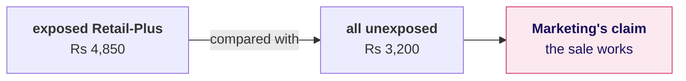
```mermaid
flowchart LR
    A["<b>exposed Retail-Plus</b><br/>Rs 4,850"] -->|"compared with"| B["<b>all unexposed</b><br/>Rs 3,200"]
    B --> C["<b>Marketing's claim</b><br/>the sale works"]
    classDef bad fill:#FBE9EF,stroke:#D63A6A,color:#1A0F5C
    class C bad
```

```notes
LIVE, 3 minutes. Both numbers are in the platform's list and the pair can reproduce them. The trap is
the comparison: one segment's exposed members against everyone unexposed. Let the pairs find it.
Then what the discount cost.
```

---

## S23. Question: what did the exposed pay at list price?
*If the list's August spend is counted at list price, what did each exposed customer pay Kalpa?*

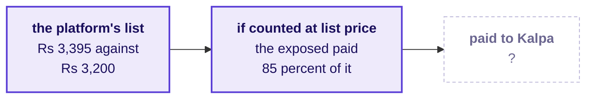
```mermaid
flowchart LR
    D["<b>the platform's list</b><br/>Rs 3,395 against<br/>Rs 3,200"] --> P["<b>if counted at list price</b><br/>the exposed paid<br/>85 percent of it"]
    P --> V["<b>paid to Kalpa</b><br/>?"]
    classDef known fill:#EEEAFB,stroke:#5B3FD6,color:#1A0F5C,stroke-width:2px
    classDef unknown fill:#FFFFFF,stroke:#B8B2D6,color:#6B6690,stroke-dasharray:4 3
    class D,P known
    class V unknown
```

**Question.** If the list's spend is at list price, what did each exposed customer pay Kalpa, against the Rs 3,200 the rest spent? Work it in part 4 before the next slide.

```notes
LIVE, 3 minutes, then the pairs work for the rest of the forty. The campaigns table records 15
percent off. The platform's list does not say whether its August spend is before or after the
discount; the pair sizes it both ways and lists the question for Marketing rather than assuming it.
Show the next slide only after the pairs have spoken their replies.
```

---

## S23a. Answer: about Rs 2,886, some 10 percent less paid
*What did 15 percent off cost Kalpa, read at list price?*

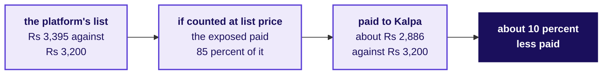
```mermaid
flowchart LR
    D["<b>the platform's list</b><br/>Rs 3,395 against<br/>Rs 3,200"] --> P["<b>if counted at list price</b><br/>the exposed paid<br/>85 percent of it"]
    P --> V["<b>paid to Kalpa</b><br/>about Rs 2,886<br/>against Rs 3,200"]
    V --> R["<b>about 10 percent<br/>less paid</b>"]
    classDef known fill:#EEEAFB,stroke:#5B3FD6,color:#1A0F5C,stroke-width:2px
    classDef bet fill:#1A0F5C,stroke:#1A0F5C,color:#FFFFFF
    class D,P,V known
    class R bet
```

**Kavya's review.** Even a real lift has to clear the discount's cost: at 15 percent off, Monday's rule asks for about 17.6 percent more volume just to stand still. Ask Marketing which way the list counts before anyone argues.

```notes
LIVE, 2 minutes, after the replies. Notebook ex2, part 4, computes the 9.8 percent: 85 percent of
Rs 3,395 is about Rs 2,886, against Rs 3,200. Then the interview drill.
```

---

## SECTION 10: Sixty seconds each?
*Can you answer each of the day's interview questions in sixty seconds, claim first and caveat said?*

```notes
LIVE. Twenty minutes. Pairs: one asks, one answers in sixty seconds, the asker scores on the four
parts. Swap every question. The model answers are in the study notes and the day sheet.
```

---

## S24. Answer the six core questions first, a minute each
*Which six questions does every analytics screen ask about today's work?*

| Tag | Question |
|---|---|
| [S] | How do you know whether a change in a metric is significant? |
| [S] | Explain a finding to a non-technical stakeholder. |
| [S] | What does p = 0.03 mean, and not mean? |
| [F] | 42 percent on 12 users against 31 percent on 1,200; which do you trust? |
| [F] | Revenue rose after a discount; did the campaign work, and what would you need to know? |
| [D] | The CEO wants a yes or no and the honest answer is "not yet"; what do you say, and how do you hold the line when marketing pushes? |

The tags: [S] a staple asked everywhere, [F] frequent in GCC and product screens, [D] a differentiator.

```notes
LIVE, 8 minutes. About a minute and a half per question including the swap. Listen for p-value
sentences that talk about the real world; stop the pair and ask which world the share was counted
in. Then the follow-ups.
```

---

## S25. Six follow-ups push past the first answer
*Which follow-ups does a second-round interviewer push with?*

| Tag | Follow-up |
|---|---|
| [F] | A metric moved and the test says significant; how do you decide whether the business should act? |
| [F] | The campaign lifted revenue overall but every segment fell; how is that possible, and which do you report? |
| [S] | What is a confounder? Give an example from a campaign. |
| [D] | Marketing says your segment split is cherry-picking; how do you respond? |
| [D] | Design: flip each pair, pool and shuffle, the textbook paired test, or wait a quarter; which for Monday, sized how, and what would switch it? |
| [D] | You tested twenty segments and one came back at p = 0.03; what do you say? |

```notes
LIVE, 8 minutes. The design question is the one the day added: the answer names the option, sizes
it on this file, and names the fact that would switch it, including the design of the data (the same
customers twice, or different customers). The last one is recognition only: about one in twenty
chance-only tests reaches 0.05 by itself. Then how an answer is scored.
```

---

## S26. Score each answer on the note's four parts
*How is a sixty-second answer scored?*

| Part | Seconds | What the asker listens for |
|---|---|---|
| Claim | 15 | One sentence, first |
| Evidence | 20 | A number with its count |
| Caveat | 15 | What would change it |
| Action | 10 | What to do next |

The seconds are a guide for sixty in total: the evidence gets the most, and the claim comes first.

```notes
LIVE, 4 minutes. The asker ticks each part heard. A missing caveat is the most common gap; the
second most common is evidence with no count. Then the close.
```

---

## SECTION 11: What do we tell Meera?
*Is the Retail-Plus fall real, is Student's 40 percent worth budget, and did the monsoon sale work?*

```notes
LIVE. Fifteen minutes: the sentence to Meera (2), the six lines (2), the Kahoot (9), Friday's
question (2).
```

---

## S27. Answer: watch it, not yet, and not as designed
*Is the Retail-Plus fall real, is Student's 40 percent worth budget, and did the monsoon sale work?*

| Meera's question | The answer, with its number |
|---|---|
| Is the Retail-Plus fall real? | Borderline, 0.029 and 0.057; worth watching, and not worth acting on alone |
| Is Student's 40 percent worth budget? | Not yet: too few customers, and chance makes it 4 times in 10 |
| Did the monsoon sale work? | Not as designed: 3 percent less in each segment; hold back at Diwali |

**The claim.** Retail-Plus is down by a borderline amount, worth watching and small against the quarter; Student is too thin to fund yet; and the monsoon sale did not work as designed, so test Diwali against a held-back group before repeating it.

```notes
LIVE, 2 minutes. Keep this slide back until three learners have read their own sentence to Meera
aloud, then show it and compare. Each line carries a number and a caveat, and none is a yes. Then the
six lines worth keeping.
```

---

## S28. Six lines worth keeping, one per chapter
*Which line from each chapter should you be able to say from memory?*

| # | The line |
|---|---|
| 1 | A p-value is a share of chance-only worlds; it is never the chance the finding is wrong. |
| 2 | Real and worth acting on are two separate calls: a chance reference answers the first, rupees against cost answer the second. |
| 3 | Count what a rate stands on, in customers as well as orders, before you repeat it; under thirty customers, it is a lead. |
| 4 | Split an aggregate by segment before you credit a campaign, and name who got it. |
| 5 | The note is claim, evidence, caveat, action, and "not yet, and here is what would tell us" is a complete answer. |
| 6 | A fair comparison asks who got it, who did not, and what else changed; only a coin makes the two groups alike. |

```notes
LIVE, 2 minutes. The same six close the study notes and appear on the cheat sheet, word for word. Have
the room read line 1 aloud together. Line 5 is the one Saturday's paper asks for from memory. Then
the Kahoot.
```

---

## S29. The Kahoot: eight items, and none of them graded
*How does the day's Kahoot run?*

```stats
value: 8 | label: items | note: including Wednesday's return question
value: 0 | label: scores kept | note: ungraded, as every Kahoot is
value: 9 min | label: to run it | note: then two answers discussed
```

```notes
LIVE, 9 minutes. Run kahoot/C2_W01_D04_quiz_STUDENT.md. Stop after item 2 and item 7 for thirty
seconds each: the p-value read as the chance of being wrong, and significance read as importance.
Then Friday's question.
```

---

## S30. Friday rebuilds the week alone, then defends it
*What does Kavya ask of tomorrow, and can you do it without help?*

> "Before anything goes to Meera, rebuild the week from a raw export with no assistant and no notes. Then say it to me the way you will say it to her, because I will push the way Marketing will."
> Kavya Nair, senior analyst

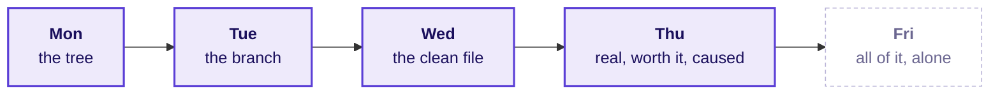
```mermaid
flowchart LR
    M["<b>Mon</b><br/>the tree"] --> T["<b>Tue</b><br/>the branch"] --> W["<b>Wed</b><br/>the clean file"] --> H["<b>Thu</b><br/>real, worth it, caused"] --> F["<b>Fri</b><br/>all of it, alone"]
    classDef known fill:#EEEAFB,stroke:#5B3FD6,color:#1A0F5C,stroke-width:2px
    classDef unknown fill:#FFFFFF,stroke:#B8B2D6,color:#6B6690,stroke-dasharray:4 3
    class M,T,W,H known
    class F unknown
```

```notes
LIVE, 2 minutes. Kavya takes Friday, as the pre-read tells the room. Leave the question open: can
each of you run the week's method alone, and hold the note when Marketing pushes? Do not preview the
lab's file or its defects. Say tonight's take-home and the pre-read, and that the note is read aloud
to someone outside the programme before Friday.
```
