# Did the discount work?

Week 1, Day 4. Afternoon.

Kicker: WEEK 1  ·  THURSDAY  ·  AFTERNOON
Quote: One page, two minutes. If the honest answer is 'we do not know yet', say so and tell me what would tell us.
Who: Meera Raghavan, CEO, Kalpa Retail, on the note she will read before Monday's growth review

```notes
LIVE, one minute. Read Meera's constraint aloud. The morning drafted two lines of the note; this
afternoon adds the third question, the discount, and ships the page. Then the second case, the
interview drill and the Kahoot.
```

---

## SECTION 1: The escalated case
*Sixty minutes alone: the Retail-Plus test, Student, the discount, and the whole note.*

```notes
LIVE. Sixty minutes, unguided. The TODO notebook is notebooks/C2_W01_D04_ex1_escalated_case_STUDENT.ipynb
and the brief is exercises/unguided/C2_W01_D04_escalated_STUDENT.md. The support TA answers
environment problems only. Do not help with the discount; the debrief is built on what the room
gets wrong there.
```

---

## S1. The brief: five parts, one page
*Everything the morning drafted, plus the question the morning left open.*

```timeline
label: Part 1 | title: Real? | body: Retail-Plus, 5,000 shuffles, seed 2026, and the p-value sentence.
label: Part 2 | title: Worth it? | body: The fall in rupees against the company's quarter.
label: Part 3 | title: Student | body: The rate with its count and its chance reference.
label: Part 4 | title: The discount | body: Did the monsoon sale lift revenue, and for whom?
label: Part 5 | title: The note | body: Claim, evidence, caveat, action for all three questions, under 200 words. | tone: dark
```

```notes
LIVE, 3 minutes. Read the five parts. Say that parts 1 to 3 repeat the morning on purpose, alone and
fast, and that part 4 is new. Start the clock.
```

---

## S2. The discount, in marketing's words
*The campaign table and the exposure table arrive with a claim already attached.*

**The client asks.** "The monsoon sale lifted revenue 6 percent. Customers who got it spent more in August than customers who did not. We want to repeat it for Diwali." The marketing lead, Kalpa Retail

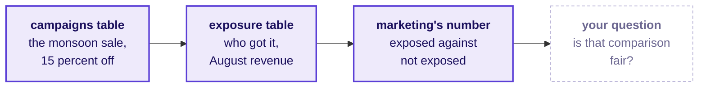
```mermaid
flowchart LR
    C["<b>campaigns table</b><br/>the monsoon sale,<br/>15 percent off"] --> E["<b>exposure table</b><br/>who got it,<br/>August revenue"]
    E --> M["<b>marketing's number</b><br/>exposed against<br/>not exposed"]
    M --> Q["<b>your question</b><br/>is that comparison<br/>fair?"]
    classDef known fill:#EEEAFB,stroke:#5B3FD6,color:#1A0F5C,stroke-width:2px
    classDef unknown fill:#FFFFFF,stroke:#B8B2D6,color:#6B6690,stroke-dasharray:4 3
    class C,E,M known
    class Q unknown
```

```notes
LIVE, 2 minutes. Do not tell the room how to read the exposure table. Say only: the same habit as
the morning, a number is a claim until it is checked, and Tuesday's segment split is allowed.
```

---

## S3. What a fair comparison needs
*The group that got the discount and the group that did not have to be alike in everything else.*

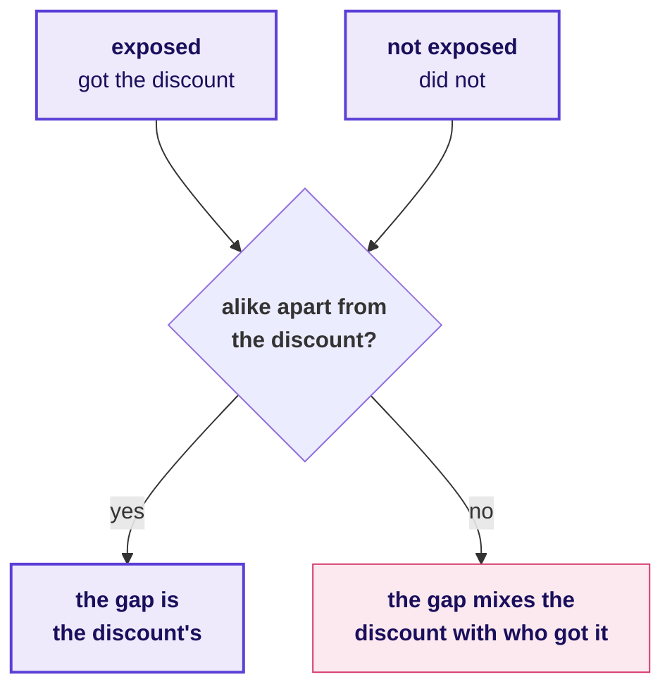
```mermaid
flowchart TB
    T["<b>exposed</b><br/>got the discount"] --> F{"<b>alike apart from<br/>the discount?</b>"}
    U["<b>not exposed</b><br/>did not"] --> F
    F -->|"yes"| G["<b>the gap is<br/>the discount's</b>"]
    F -->|"no"| B["<b>the gap mixes the<br/>discount with who got it</b>"]
    classDef known fill:#EEEAFB,stroke:#5B3FD6,color:#1A0F5C,stroke-width:2px
    classDef bad fill:#FBE9EF,stroke:#D63A6A,color:#1A0F5C
    class T,U,G known
    class B bad
```

**The rule.** Split an aggregate by segment before you credit a campaign, and name who got it.

```notes
LIVE, 2 minutes. This is the third habit from the morning's board. The word for what makes the two
groups unalike is a confounder; say it once and leave the slide up while the room works.
```

---

## SECTION 2: The debrief
*Fifteen minutes on the answers the room got wrong, starting with the one most people got wrong.*

```notes
LIVE. Fifteen minutes. Collect the room's part 4 answers by show of letters before this chapter:
a) the discount worked, b) it did not, c) not yet. Then run the four wrong answers in order.
```

---

## S4. The plausible wrong answer
*The blended comparison, computed the way a hurried analyst computes it, agrees with marketing.*

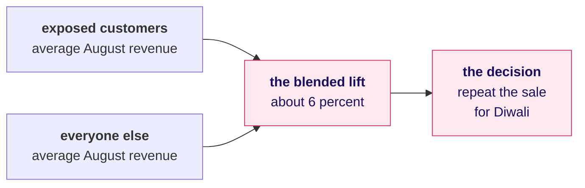
```mermaid
flowchart LR
    A["<b>exposed customers</b><br/>average August revenue"] --> L["<b>the blended lift</b><br/>about 6 percent"]
    B["<b>everyone else</b><br/>average August revenue"] --> L
    L --> D["<b>the decision</b><br/>repeat the sale<br/>for Diwali"]
    classDef bad fill:#FBE9EF,stroke:#D63A6A,color:#1A0F5C
    class L,D bad
```

**What breaks.** The two groups were never alike, so the 6 percent carries who got the discount as well as what the discount did.

```notes
LIVE, 3 minutes. Ask who wrote "the discount worked". Ask what they checked before writing it. Then
ask who split by segment, and have one of them say what the split showed. The room's own numbers
carry this; the slide never states them.
```

---

## S5. Why a blend can rise while every group falls
*Invented numbers for two groups of customers, chosen only to show the mechanism.*

| Invented | Not exposed | Exposed | Change |
|---|---|---|---|
| Big spenders, per customer | Rs 5,000 | Rs 4,800 | falls 4 percent |
| Small spenders, per customer | Rs 1,000 | Rs 960 | falls 4 percent |
| Share who are big spenders | 20 percent | 80 percent | the mix |
| **Blended, per customer** | **Rs 1,800** | **Rs 4,032** | **rises 124 percent** |

Each group spends less with the discount, and the blend more than doubles, because the discount went mostly to people who spend a lot anyway.

```notes
LIVE, 4 minutes. The numbers are invented and deliberately extreme so the mechanism is visible; the
table says so. Work one blend aloud: 80 percent of 4,800 plus 20 percent of 960 is 4,032. This is
Tuesday's mix against rate in a new place, and its name is Simpson's reversal, at recognition depth.
```

---

## S6. The same reversal, drawn
*Two falls and one rise on one chart, from the invented table on the slide before this one.*

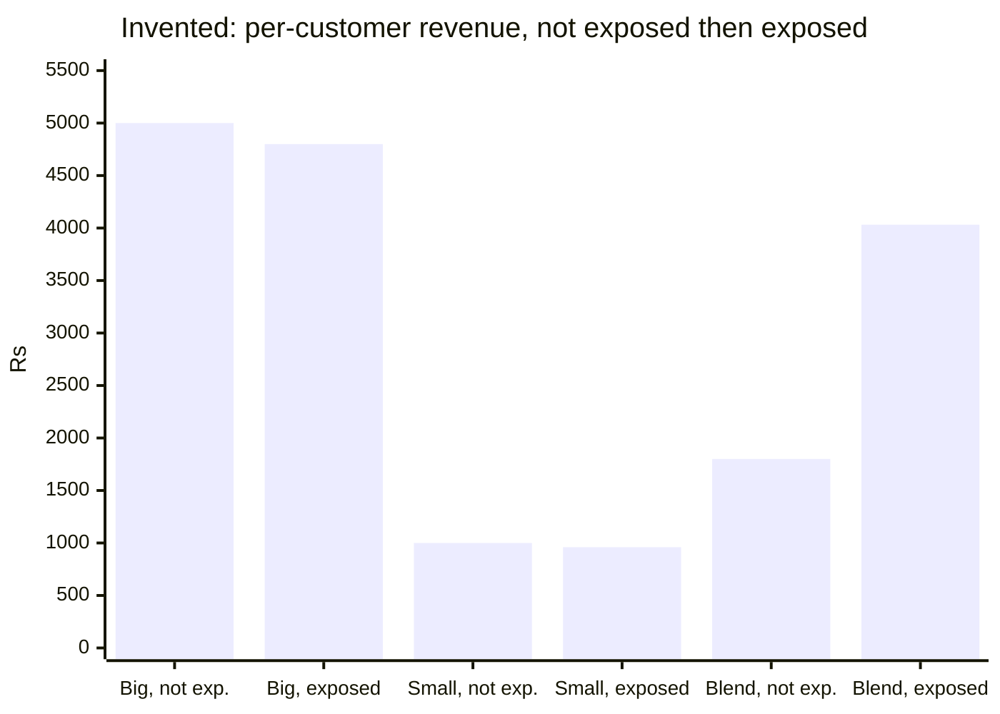
```mermaid
xychart-beta
    title "Invented: per-customer revenue, not exposed then exposed"
    x-axis ["Big, not exp.", "Big, exposed", "Small, not exp.", "Small, exposed", "Blend, not exp.", "Blend, exposed"]
    y-axis "Rs" 0 --> 5500
    bar [5000, 4800, 1000, 960, 1800, 4032]
```

**The check.** Compute the comparison inside each segment, then compare the mix of the two groups. If the mix differs, the blend is answering a question nobody asked.

```notes
LIVE, 2 minutes. Point at the pairs, then at the blend. Ask which number marketing quoted.
```

---

## S7. Three more wrong answers from the morning
*Each one reappeared in the escalated case, and each has a one-line fix.*

| Wrong answer | Why it fails | The line that replaces it |
|---|---|---|
| "A 3 percent chance we are wrong." | The share was counted in chance-only worlds. | "A fall this large turns up in about 3 of every 100 shuffles." |
| "Student is the growth story." | The rate stands on a handful of orders. | "Promising, and too few orders to act on yet." |
| A note with no caveat | Meera cannot see what would change it. | "This changes if ___; we will know by ___." |

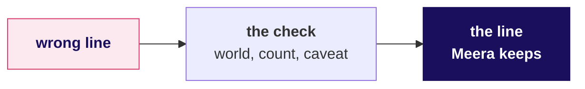
```mermaid
flowchart LR
    W["<b>wrong line</b>"] --> C["<b>the check</b><br/>world, count, caveat"] --> R["<b>the line<br/>Meera keeps</b>"]
    classDef bad fill:#FBE9EF,stroke:#D63A6A,color:#1A0F5C
    classDef bet fill:#1A0F5C,stroke:#1A0F5C,color:#FFFFFF
    class W bad
    class R bet
```

```notes
LIVE, 3 minutes. Read one real sentence from the room for each row, anonymised, and have the room fix
it aloud.
```

---

## S8. Question: which line survives Kavya's review?
*Four drafts about the invented campaign on the slides before this one.*

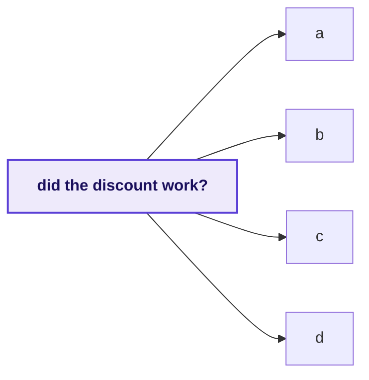
```mermaid
flowchart LR
    Q["<b>did the discount work?</b>"] --> A["a"]
    Q --> B["b"]
    Q --> C["c"]
    Q --> D["d"]
    classDef known fill:#EEEAFB,stroke:#5B3FD6,color:#1A0F5C,stroke-width:2px
    class Q known
```

**Question.** Which line goes to the CEO about the invented campaign? a) "Revenue per customer rose 124 percent, so repeat it"; b) "It reached mostly big spenders, and both groups spent less with it, so do not repeat it as designed and test the next one against a held-back group"; c) "Inconclusive, so no view"; d) "It failed, so end all discounts".

```notes
LIVE, 2 minutes. Letters. Option c sounds careful and gives Meera nothing to act on. Option d
overclaims in the other direction.
```

---

## S9. Answer: the finding, the reason, and the next test
*A position, the confounder named, and what would settle it next time.*

```timeline
label: Claim | title: A position | body: What the split says about the campaign, in one sentence.
label: Evidence | title: Within each segment | body: Exposed against not exposed, per customer, with counts.
label: Caveat | title: Who got it | body: The mix of the two groups, and why it differs.
label: Action | title: The next test | body: Hold back a random group inside each segment and compare after. | tone: dark
```

The answer is b. It takes a position, gives the reason, and says what would change it.

```notes
LIVE, 1 minute. Your own discount line takes this shape with your own numbers. Transition to the break, then the second case, where
marketing pushes back.
```

---

## SECTION 3: The second case
*Forty-five minutes in pairs: marketing defends the monsoon sale, and the pair holds the caveat.*

```notes
LIVE. Ten-minute break before this chapter. Pairs work from exercises/unguided/C2_W01_D04_pushback_STUDENT.md
and notebooks/C2_W01_D04_ex2_second_case_STUDENT.ipynb. One partner plays marketing for the last ten
minutes.
```

---

## S10. Marketing pushes back
*The rebuttal arrives in the meeting, in front of Meera, with a fresh number.*

**The client asks.** "Your segment split is slicing the data until it says what you want. Exposed Retail-Plus members spent Rs 4,850 in August. That is far above the Rs 3,200 our unexposed customers averaged. The sale works." The marketing lead

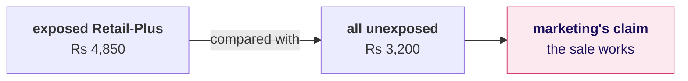
```mermaid
flowchart LR
    A["<b>exposed Retail-Plus</b><br/>Rs 4,850"] -->|"compared with"| B["<b>all unexposed</b><br/>Rs 3,200"]
    B --> C["<b>marketing's claim</b><br/>the sale works"]
    classDef bad fill:#FBE9EF,stroke:#D63A6A,color:#1A0F5C
    class C bad
```

```notes
LIVE, 3 minutes. Both numbers are in the exposure table and the pair can reproduce them. The trap is
the comparison: one segment's exposed members against everyone unexposed. Let the pairs find it.
```

---

## S11. The pair's job, in four moves
*Reproduce marketing's number, find what it compares, rebuild it fairly, and hold the line politely.*

```cards
icon: repeat | eyebrow: Move 1 | title: Reproduce | body: Compute Rs 4,850 and Rs 3,200 from the exposure table.
icon: search-check | eyebrow: Move 2 | title: Name the mismatch | body: Say which customers sit in each group, and what else differs.
icon: columns-2 | eyebrow: Move 3 | title: Rebuild | body: Like for like, inside Retail-Plus, with the counts beside each average.
icon: message-square | eyebrow: Move 4 | title: Hold the line | body: One reply to marketing, in two sentences, with the Diwali test offered. | tone: dark
```

```notes
LIVE, 2 minutes. Move 4 is spoken, never written first. The partner playing marketing is allowed to
push once more.
```

---

## S12. What would settle it: a held-back group
*For Diwali, keep the discount from a random slice of each segment, and compare like with like.*

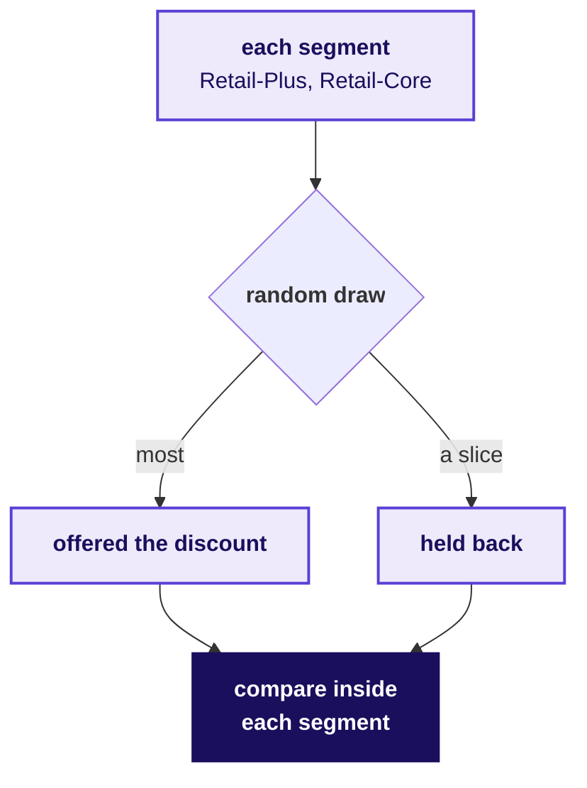
```mermaid
flowchart TB
    S["<b>each segment</b><br/>Retail-Plus, Retail-Core"] --> R{"<b>random draw</b>"}
    R -->|"most"| X["<b>offered the discount</b>"]
    R -->|"a slice"| H["<b>held back</b>"]
    X --> C["<b>compare inside<br/>each segment</b>"]
    H --> C
    classDef known fill:#EEEAFB,stroke:#5B3FD6,color:#1A0F5C,stroke-width:2px
    classDef bet fill:#1A0F5C,stroke:#1A0F5C,color:#FFFFFF
    class S,X,H known
    class C bet
```

Chance decides who gets the discount, so the two groups are alike in everything else on average.

```notes
LIVE, 3 minutes. Name it as a held-back group, or a holdout; experiment design proper comes later in
the programme. The point for today: "not yet" comes with a plan that turns it into a yes or a no.
```

---

## S13. Monday's rule returns: what 15 percent off costs
*A discount of 15 percent needs 17.6 percent more volume just to stand still.*

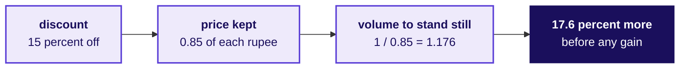
```mermaid
flowchart LR
    D["<b>discount</b><br/>15 percent off"] --> P["<b>price kept</b><br/>0.85 of each rupee"]
    P --> V["<b>volume to stand still</b><br/>1 / 0.85 = 1.176"]
    V --> R["<b>17.6 percent more</b><br/>before any gain"]
    classDef known fill:#EEEAFB,stroke:#5B3FD6,color:#1A0F5C,stroke-width:2px
    classDef bet fill:#1A0F5C,stroke:#1A0F5C,color:#FFFFFF
    class D,P,V known
    class R bet
```

**Kavya's review.** Even a real lift has to clear the discount's cost. Ask marketing for the volume lift, and set it against 17.6 percent.

```notes
LIVE, 3 minutes. The campaigns table records 15 percent off; the break-even is Monday's companion
experiment C. The exposure table does not say whether August revenue is before or after the
discount, and the pair should list that as a question for marketing rather than assume it.
```

---

## SECTION 4: The interview drill
*Thirty minutes aloud: the row's six questions and six case follow-ups, sixty seconds each.*

```notes
LIVE. Thirty minutes. Pairs: one asks, one answers in sixty seconds, the asker scores on the four
parts. Swap every question. The model answers are in the study notes and the day sheet.
```

---

## S14. The six questions every screen asks
*The row's anchors, tagged the way the programme tags them.*

| Tag | Question |
|---|---|
| [S] | How do you know whether a change in a metric is significant? |
| [S] | Explain a finding to a non-technical stakeholder. |
| [S] | What does p = 0.03 mean, and not mean? |
| [F] | 42 percent on 12 users against 31 percent on 1,200; which do you trust? |
| [F] | Revenue rose after a discount; did the campaign work, and what would you need to know? |
| [D] | The CEO wants a yes or no and the honest answer is "not yet"; what do you say, and how do you hold the line when marketing pushes? |


```mermaid
flowchart LR
    S["<b>[S]</b> staple"] --> F["<b>[F]</b> frequent"] --> D["<b>[D]</b> differentiator"]
    classDef known fill:#EEEAFB,stroke:#5B3FD6,color:#1A0F5C,stroke-width:2px
    classDef bet fill:#1A0F5C,stroke:#1A0F5C,color:#FFFFFF
    class S,F known
    class D bet
```

```notes
LIVE, 12 minutes. Two minutes per question including the swap. Listen for p-value sentences that talk
about the real world; stop the pair and ask which world the share was counted in.
```

---

## S15. Six follow-ups a case interviewer adds
*The same ideas pushed one step further, the way a second-round interviewer pushes.*

| Tag | Follow-up |
|---|---|
| [F] | A metric moved and the test says significant; how do you decide whether the business should act? |
| [F] | The campaign lifted revenue overall but every segment fell; how is that possible, and which do you report? |
| [F] | How would you set up the Diwali campaign so that afterwards you can tell whether it worked? |
| [S] | What is a confounder? Give an example from a campaign. |
| [D] | Marketing says your segment split is cherry-picking; how do you respond? |
| [D] | You tested twenty segments and one came back at p = 0.03; what do you say? |

```notes
LIVE, 12 minutes. The last one is recognition only: one in twenty chance-only tests reaches 0.05 by
itself, so one small p-value among twenty is a lead. Say "later in the programme" if the room wants
more.
```

---

## S16. How a sixty-second answer is scored
*The note's four parts, said aloud, are the scoring sheet for every answer in the drill.*

```bar
label: Claim | value: 15 | caption: one sentence, first
label: Evidence | value: 20 | caption: a number with its count
label: Caveat | value: 15 | caption: what would change it
label: Action | value: 10 | caption: what to do next
```

The seconds are a guide for sixty in total: the evidence gets the most, and the claim comes first.

```notes
LIVE, 6 minutes. The asker ticks each part heard. A missing caveat is the most common gap; the
second most common is evidence with no count.
```

---

## SECTION 5: The close
*The sentence to Meera, the five lines worth keeping, the Kahoot, and Friday's question.*

```notes
LIVE. Twenty minutes: the sentence and the crux lines (5), the Kahoot (12), Friday's question (3).
```

---

## S17. The sentence to Meera
*The whole page compressed into what she will repeat in the growth review.*

| Question | Your line carries |
|---|---|
| Retail-Plus | Real or not yet, and its size in rupees against the quarter |
| Student | The rate, its count, and whether chance makes it |
| The discount | The split by segment, who got it, and the Diwali test |

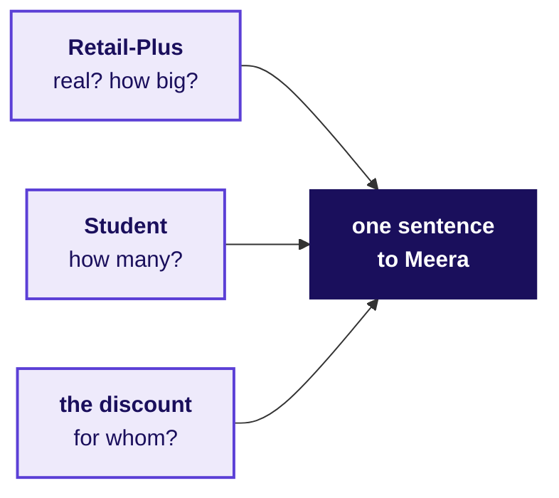
```mermaid
flowchart LR
    A["<b>Retail-Plus</b><br/>real? how big?"] --> N["<b>one sentence<br/>to Meera</b>"]
    B["<b>Student</b><br/>how many?"] --> N
    C["<b>the discount</b><br/>for whom?"] --> N
    classDef known fill:#EEEAFB,stroke:#5B3FD6,color:#1A0F5C,stroke-width:2px
    classDef bet fill:#1A0F5C,stroke:#1A0F5C,color:#FFFFFF
    class A,B,C known
    class N bet
```

```notes
LIVE, 2 minutes. Three learners read their one sentence aloud. The model sentence is in the day
sheet; read it only after three learners have read theirs.
```

---

## S18. Five lines worth keeping
*The same five lines close the study notes and head the cheat sheet, word for word.*

| # | The line |
|---|---|
| 1 | A p-value is a share of chance-only worlds; it is never the chance the finding is wrong. |
| 2 | Real and worth acting on are two separate calls: the shuffle answers the first, rupees against cost answer the second. |
| 3 | Count what a rate stands on before you repeat it; under thirty, it is a lead. |
| 4 | Split an aggregate by segment before you credit a campaign, and name who got it. |
| 5 | The note is claim, evidence, caveat, action, and "not yet, and here is what would tell us" is a complete answer. |

```notes
LIVE, 3 minutes. Have the room read line 1 aloud together. Line 5 is the one Saturday's paper asks
for from memory.
```

---

## S19. The Kahoot: eight items, ungraded
*Seven on today and one return question from Wednesday.*

```stats
value: 8 | label: items | note: including Wednesday's return question
value: 0 | label: scores kept | note: ungraded, as every Kahoot is
value: 12 min | label: to run it | note: then the answers discussed
```

```notes
LIVE, 12 minutes. Run kahoot/C2_W01_D04_quiz_STUDENT.md. Stop after item 2 and item 5 for thirty
seconds each; they are the two traps of the day.
```

---

## S20. Friday's question, left open
*Tomorrow the week is rebuilt without an assistant, on a file nobody has seen.*

**The client asks.** "Can you do all of this again, alone, on a fresh export, and defend it to marketing's face?" Meera Raghavan

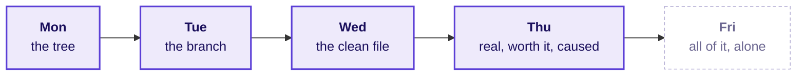
```mermaid
flowchart LR
    M["<b>Mon</b><br/>the tree"] --> T["<b>Tue</b><br/>the branch"] --> W["<b>Wed</b><br/>the clean file"] --> H["<b>Thu</b><br/>real, worth it, caused"] --> F["<b>Fri</b><br/>all of it, alone"]
    classDef known fill:#EEEAFB,stroke:#5B3FD6,color:#1A0F5C,stroke-width:2px
    classDef unknown fill:#FFFFFF,stroke:#B8B2D6,color:#6B6690,stroke-dasharray:4 3
    class M,T,W,H known
    class F unknown
```

```notes
LIVE, 3 minutes. Do not preview the lab's file or its defects. Say tonight's take-home and the
pre-read, and that the note is read aloud to someone outside the programme before Friday.
```
