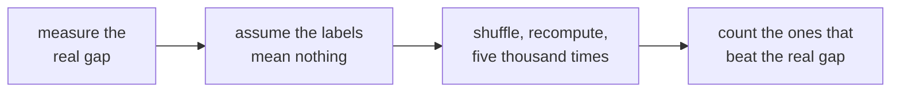
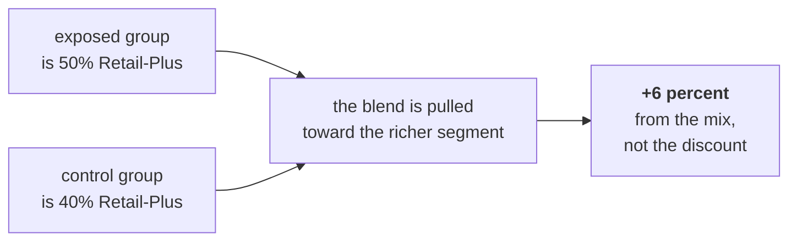

# Day 4: real or noise, cause or coincidence

Kalpa Retail, Week 1 Thursday. Read this after the session. It is the longest set of notes in the
week because it carries three habits rather than one.

---

## The situation

With Finance reconciled, Meera set the growth review for Monday and sent three questions.

> "One: Retail-Plus is down, smaller than first reported. Real, or the wobble we see every quarter?
> Two: Student is up 40 percent; should I move budget there? Three: marketing ran a monsoon-sale
> discount for Retail-Plus in August, says it lifted revenue 6 percent, and wants to repeat it for
> Diwali. Did the discount work, or did those customers buy anyway?"
>
> "One page, two minutes. If the honest answer is 'we do not know yet', say so and tell me what
> would tell us."

Three questions that look alike and need three different habits. Answering one with another's method
is how this day goes wrong.

| Her question | The habit |
|---|---|
| Real, or the wobble? | A chance reference |
| Should I fund Student? | Sample size |
| Did the discount work? | A fair comparison |

---

## Habit one: the chance reference



Retail-Plus fell 35 percent and Retail-Core fell 2.7, a gap of **32.3 points**. Suppose the two
labels meant nothing and the same members had been split between them at random. Would a gap that
large turn up anyway?

Shuffle the labels, keeping the group sizes, and recompute. **The unit you shuffle is the customer,
not the order**, because a customer's orders belong together and splitting them across both labels
builds a world that could not exist.

| | |
|---|---|
| Shuffles at least as extreme | **0 of 5,000** |
| Reported as | **p < 0.0002** |

### Never write `p = 0`

Five thousand shuffles can only resolve down to one in five thousand. Writing `p = 0` claims a
certainty the method cannot produce. The number you report is the resolution of your own simulation.

### What a p-value is, and is not

It is **the share of chance-only worlds that produce a result at least this extreme**.

| It is not | Why that matters |
|---|---|
| The probability the finding is wrong | It reverses what the number measures, and it is the version said aloud in meetings |
| The probability chance caused it | Same reversal, worded differently |
| A statement about size | On a large enough sample, almost any difference reaches significance |

### Three separate calls

| Call | Answered by | For Retail-Plus |
|---|---|---|
| Could chance have done this? | The p-value | No |
| Is it big? | The size of the effect | Yes, about a third |
| Is it worth acting on? | The cost against the gain | Yes, 22 paid-tier members |

**Only the first came from the shuffle.** The other two came from knowing the business, and saying
so out loud is what stops a p-value being used as a decision.

---

## Habit two: sample size

Student went from 2.50 to 3.50 orders per member. Forty percent. **On twelve orders**, five in the
first quarter and seven in the second.

Suppose each of those twelve orders landed in either quarter by chance. How often does that alone
give seven or more in the second?

| | |
|---|---|
| Chance-only worlds at least this extreme | **1,914 of 5,000** |
| Reported as | **p = 0.383** |
| Reads as | Chance does this about two times in five |

The rise is real in the file and it is worthless as evidence.

**The rule of thumb:** distrust any rate computed on fewer than about thirty observations. It is a
rule of thumb rather than a law, and saying which it is out loud is part of using it honestly.

---

## Habit three: the fair comparison

Marketing's claim is arithmetically correct:

> "Revenue from exposed customers was six percent higher than from unexposed ones."

**A fair comparison needs a group that did not get the thing, that is like the group that did, in
the ways that matter.** Both halves are load-bearing, and targeting breaks the second half on
purpose: the sale went to Retail-Plus members, who already spend two and a half times what
Retail-Core members spend.

### The table, one row at a time

| Group | Exposed | Not exposed | Change |
|---|---|---|---|
| Retail-Plus | Rs 4,850 (30) | Rs 5,000 (40) | **down 3 percent** |
| Retail-Core | Rs 1,940 (30) | Rs 2,000 (60) | **down 3 percent** |
| **Everyone** | **Rs 3,395 (60)** | **Rs 3,200 (100)** | **up 6 percent** |

Both parts fell. The whole rose. Nobody made an arithmetic error.



**The campaign changed who is in the average, not what they spent.** When a comparison reverses once
a group is split, the aggregate was being driven by the mix. You meet this again in Week 2 in SQL,
in Week 5 on a model's segments, and in every interview that asks why a metric moved.

### What you cannot say either

The campaign did not "reduce spending by 3 percent". Nobody randomised it, so the exposed and
unexposed groups may differ in ways the segment split does not capture. **Over-correcting is as
wrong as the claim it replaces.**

What would settle it: assign the next discount at random within a segment, so the two groups differ
only in the discount. An experiment nobody ran cannot be recovered from the data afterwards.

---

## The note, four parts

```
CLAIM      one sentence, with the number and its denominator
EVIDENCE   what you computed, and on how many observations
CAVEAT     the thing that would change the claim
ACTION     what to do, and what it costs
```

Claim first, because a CEO reads two minutes and stops.

> **Retail-Plus.** Orders per member fell about a third, against Retail-Core's 2.7 percent. Chance
> alone produced a gap this large in none of 5,000 shuffles, so the fall is real. These are 22
> paid-tier members and I would act on it.
>
> **Student.** Up 40 percent on twelve orders. Chance produces a rise that large about two times in
> five, so I would not move budget yet. A full quarter at around fifty orders would tell us.
>
> **The monsoon sale.** The six percent is a mix effect: half the exposed group is Retail-Plus
> against forty percent of the control, and Retail-Plus spends two and a half times more. Within
> both segments, exposed customers spent three percent **less**. I cannot say the campaign failed
> either, because nobody randomised it. Randomising the next one inside a segment would settle it.

**Three answers, three different shapes, and only one is a yes.** A page where all three are yes is a
page that was written to please.

---

## Glossary

| Term | What it means here |
|---|---|
| Chance reference | A set of worlds built by shuffling, against which the real result is compared |
| Permutation test | Shuffling the labels many times and counting the extremes |
| p-value | The share of those worlds at least as extreme as what you saw |
| Resolution | The smallest p-value a simulation of that size can report |
| Effect size | How big the difference is, which the p-value says nothing about |
| Sample size | How many observations sit behind a rate |
| Control group | Those who did not get the thing, used as the comparison |
| Confounder | Something that differs between the groups and also affects the outcome |
| Mix effect | An aggregate moving because the composition changed rather than the parts |
| Randomisation | Assigning the treatment by chance, which is what makes a comparison fair |

---

## The questions this day now makes answerable

- How do you know whether a change in a metric is significant?
- Explain a finding to a non-technical stakeholder.
- What does `p = 0.03` mean, and not mean?
- 42 percent on 12 users against 31 percent on 1,200: which do you trust?
- Revenue rose after a discount. Did the campaign work, and what would you need to know?
- The CEO wants a yes or no and the honest answer is "not yet". What do you say?

---

## What Saturday does with this

Saturday is the pen-and-paper recap and the interview-answer discussion. The note is the thing you
will be asked to defend, and the p-value sentence is the one most often lost under pressure.

---

## Reading, if you want it

- Seeing Theory, frequentist inference, interactive (verified 05 Sep 2026):
  https://seeing-theory.brown.edu/frequentist-inference/index.html
- StatQuest video index, the two hypothesis-testing videos (verified 05 Sep 2026):
  https://statquest.org/video_index.html
- Exponent, analyst questions including conveying insights to a non-technical audience
  (verified 13 Sep 2026): https://www.tryexponent.com/blog/top-data-analyst-interview-questions
