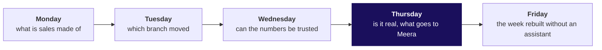
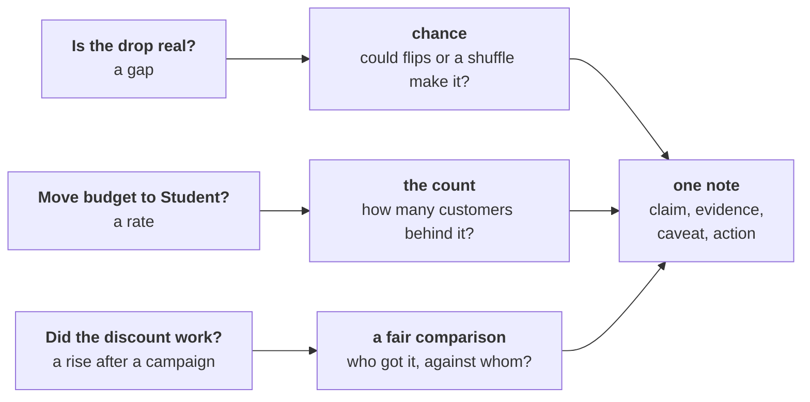

# Real, worth it, and caused

**Week 1, Thursday. Study notes, read after the session.** Monday morning, before the growth
review, Meera Raghavan has three questions and two minutes: is the Retail-Plus fall real or the
usual wobble, should budget follow Student's 40 percent, and did the monsoon sale work or did those
customers buy anyway? Each question met its own check today: a chance reference that fits the way
the data was collected, the count beneath a rate, and a fair comparison. The answers went onto one
page that is allowed to say "not yet". Reading time: about 25 minutes.

---

## What you can now do

1. You can choose the chance reference that fits the design (flip each member's own pair for the
   same members measured twice, shuffle the labels for different customers), read its share one
   way and either way, and check the verdict by a second route.
2. You can size a real gap per member, for the segment, against the company and against the cost
   of a fix.
3. You can count what a rate stands on, in customers as well as orders, run a coin-flip reference
   on the count, and call a rate on fewer than thirty customers a lead.
4. You can split a campaign's lift by segment and see why a blend rose while every segment fell.
5. You can write Meera's note as claim, evidence, caveat and action, with "not yet" as a complete
   answer.
6. You can ask who got a campaign, who did not and what else changed, and design the hold-back that
   would settle it.

---

## Where this sits

**What the session covered.** Six chapters on one Kalpa case, each worked in full: is the
Retail-Plus fall real, is it worth acting on, what count stands behind Student's 40 percent, did
the monsoon discount work inside each segment, what goes in the note, and what comparison would be
fair at Diwali. Mentioned only: the textbook test's formula, building a confidence interval, power,
and difference in differences, named once. Kalpa Retail's business, its Retail-Plus membership tier
and its metrics are told in the retail domain dossier,
`content/W01/D1/study-notes/C2_W01_D01_domain_retail_STUDENT.md`.

```mermaid
flowchart LR
    M["<b>Monday</b><br/>what is sales made of"] --> T["<b>Tuesday</b><br/>which branch moved"]
    T --> W["<b>Wednesday</b><br/>can the numbers be trusted"]
    W --> H["<b>Thursday</b><br/>is it real, what goes to Meera"]
    H --> F["<b>Friday</b><br/>the week rebuilt without an assistant"]
    classDef today fill:#1A0F5C,stroke:#1A0F5C,color:#FFFFFF
    class H today
```

This week map is the programme's own construction.

**The outcome tie.** Friday's growth-review rehearsal, where you defend a one-page note aloud to
someone playing marketing, is built from today's checks and today's note shape.

**What was left out.** The formulas, building a confidence interval and power (how many members a
test needs to see a gap) arrive in later weeks.

---

## The picture to remember: three checks, one note

```mermaid
flowchart LR
    Q1["<b>Is the drop real?</b><br/>a gap"] --> H1["<b>chance</b><br/>could flips or a shuffle make it?"]
    Q2["<b>Move budget to Student?</b><br/>a rate"] --> H2["<b>the count</b><br/>how many customers behind it?"]
    Q3["<b>Did the discount work?</b><br/>a rise after a campaign"] --> H3["<b>a fair comparison</b><br/>who got it, against whom?"]
    H1 --> N["<b>one note</b><br/>claim, evidence,<br/>caveat, action"]
    H2 --> N
    H3 --> N
```

Each of Meera's questions fails in its own way, so each gets its own check before any number
reaches the note on the right. That note is the running thread: every chapter adds a line to it or
tests one.

**CALLBACK.** Week 1, Monday settled that delivered revenue is the money kept, and that a number
leaves the team with its definition.

---

## Chapter 1: Real, or the usual wobble?

Meera Raghavan, Kalpa's CEO, asked before Monday's growth review: "Retail-Plus is down, smaller than
first reported. Real, or the wobble we see every quarter?" The metric is delivered revenue per
Retail-Plus member per quarter. A real fall opens a retention budget; a wobble read as real spends
it chasing noise.

**IN THE FIELD.** Booking.com runs about 25,000 tests a year and more than 1,000 at once (Thomke,
HBR, 2020), and, by Thomke's account, about nine in ten of its experiments improve nothing (HBR podcast, 2019), so every
change there is read against chance before anyone acts.

| Option | Sized on this file | Call |
|---|---|---|
| A. Flip each member's pair | 22 members, one Q1 less Q2 each; the share moves by 0.004 across five seeds | Best fit |
| B. Pool and shuffle | 44 totals treated as 44 different people | The design for different customers |
| C. Textbook paired test | One call on 22 differences, built for bell shapes; 8 of 44 totals are zero | Second route |
| D. Wait for Q3 | One quarter; Monday passes unanswered | If A and C are unclear |

The same 22 members sit in both quarters, so a coin per member, deciding which of its two quarters
counts as Q1, keeps each member compared with themselves. Pooling the 44 totals counts the gaps
between members as chance; here a member's Q1 barely predicts their Q2 (a correlation of 0.04), so
the two land close, but where heavy buyers stay heavy, pooling overstates chance and can miss a real
fall. The switch: different customers in each group, where the label shuffle is the design.

**The build.** On five invented members' cards with a real gap of Rs 880, 35 of 1,000 tosses
reached it, against an exact 1 of the 32 ways five coins can land. Retail-Core's 34 members fell Rs
110 each, a gap flips matched in 0.358 of 5,000 counting falls and 0.723 either way: the usual
wobble. Retail-Plus's 22 members fell from Rs 3,279 to Rs 2,169, Rs 1,110 each; 145 of 5,000 flips
made a fall that large (0.029) and 286 a move that large either way (0.057). Meera asked after the
fall was seen, so no direction was fixed in advance, and both go in the note: borderline, and
modest.

**The trap.** "p = 0.03, so there is a 3% chance we are wrong about the drop." Meera would treat the
fall as 97 percent certain, but every flip assumed nothing changed, so the share describes only that
world. **The check:** of twenty invented segments where nothing changed, one came back at 0.003.
**The fix:** "If nothing had changed between the quarters, a fall of Rs 1,110 per member or more
would turn up in about 3 of every 100 flips, and a move that large either way in about 6; the
question came after the fall was seen, so we read it as borderline."

**The second route.** Counting all 4,194,304 coin patterns gives 0.027 one way and 0.055 either way,
and the textbook paired test agrees. Switch to that one call when members run to thousands; keep
the flips for small or lumpy data, or a reader who needs to see how the number was made.

**ORIGIN.** Ronald Fisher's The Design of Experiments (1935) is an original reference for testing
by rearranging labels (checked 29 Sep 2026).

> **Kavya's review.** "Retail-Core's third is the wobble. Retail-Plus sits at about 3 in 100
> counting falls and 6 in 100 either way, three routes that keep each member's pair agree, and you
> said which direction you counted and why. Borderline is an honest answer. Now tell me how much
> money it is."

---

## Chapter 2: Real, and worth acting on?

The head of Retail-Plus asked: "So my tier really is slipping. What do I get to fix it?" Fund an
offer that cannot pay back and the money is gone; ignore a growing fall and the tier drains.

**IN THE FIELD.** A change to how Bing showed ad headlines raised revenue 12 percent, more than 100
million dollars a year in the US (Kohavi and Thomke, HBR, 2017), while only about a third of
Microsoft experiments designed to improve a key metric succeeded (Kohavi and colleagues, 2009).

| Option | What it needs | Call |
|---|---|---|
| A. Break-even on the estimate | One pass over the orders, and a cost, assumed today | Best fit for Monday |
| B. The low end of a range | 22 differences redrawn 5,000 times | Second route |
| C. Test the offer on half the tier | Rs 5,500 and a quarter | Where the answer can lead |
| D. A past offer's recovery rate | A measured rate, which Kalpa does not have | Cannot run today |

**The build.** Rs 1,110 times 22 members is Rs 24,420 a quarter, a third of the tier's Q1 money and
0.19 percent of the company's Q2 delivered revenue of Rs 1,28,64,680. Business moved plus Rs
6,18,460 between the quarters, which is where the company's money sits.

**The trap.** A hurried draft ranked the segments by the share, counted either way (Retail-Plus
0.057, Retail-Core 0.723, Business 0.910), and wrote: "Retail-Plus is the surest move of the
quarter, so it opens the growth review: fund its retention programme first." **The check** puts
rupees beside every share: by rupees moved, Business opens the review. An invented Rs 20 gap shows
how far the columns part: its share was 0.43 on 100 orders and 0.002 on 20,000. **The fix** is two
sentences: the fall is borderline against chance, about 3 in 100 flips one way and 6 either way, and
it is worth Rs 24,420 a quarter, 0.19 percent of the company.

**The cost.** An assumed offer at Rs 500 per member costs Rs 11,000 a quarter and must win back 45
percent of the fall to break even; at an assumed 30 percent margin it needs 150 percent.

**The second route.** Redrawing the members' own falls 5,000 times puts an approximate 95 percent
range at about Rs 80 to Rs 2,160 per member, a confidence interval to be built properly later. Its
low end sits far below the offer's Rs 500, so the fall is worth watching and not worth acting on
alone; if the head of Retail-Plus acts, the offer goes to a coin-chosen half first.

**WATCH OUT.** A list ranked by p-value has ranked certainty and called it importance.

> **Kavya's review.** "Borderline against chance by two routes, worth Rs 24,420 a quarter, 0.19
> percent of the company and a third of the tier. The range's low end sits far below what the offer
> costs, so this is a watch item. If the head of Retail-Plus wants to act, offer it to a coin-chosen
> half and hold back the other half."

**CALLBACK.** Week 1, Tuesday found Retail-Plus frequency was the branch that moved; today priced it.

---

## Chapter 3: The count behind 40 percent

Meera again: "Student is up 40 percent; should I move budget there?" Move acquisition money on a
rate chance made and it lands on a segment that may be flat next quarter.

**IN THE FIELD.** The Gates Foundation backed small schools partly because they were
over-represented among top performers. Howard Wainer found them at both tails: "we would expect 3%
of small schools" and "we found 12%". By 2001 the Foundation had given about 1.7 billion dollars to
education projects (Wainer, "The Most Dangerous Equation", 2009).

| Option | What it needs | Call |
|---|---|---|
| A. Trust the headline | Four segments and two quarters | The trap |
| B. Coin flips on the count | The count behind the rate, found by you | Best fit |
| C. The rule of thumb | The customers behind the rate, against thirty | The summary line |
| D. Wait for thirty customers | How fast new customers arrive, sized once they are counted | The action |

The rule counts customers, because more orders from the same few customers add orders and no new
evidence: thirty orders from three people are still three people's habits. The switch: a cheap way
to reach more student customers fast, such as a small paid test, turns D into a two-week
experiment.

**The build.** For every 100 Q1 orders, Q2 brought Retail-Core 97, Retail-Plus 65, Business 94 and
Student 140. As a leaderboard, Student wins.

**The trap.** "Student is up 40 percent, the fastest on the page: move acquisition budget to
Student." **The check** counts what the rate stands on: a count of orders under thirty, from very
few customers. On invented bases, one extra order moves a rate 10 points on 10 orders and 0.25 on
400. If nothing changed, each order lands in Q1 or Q2 on a coin flip; across 5,000 worlds, Student's
orders made a 40 percent rise in 0.397 of them. Retail-Core's 73 orders did it in 0.086 and an
invented 400 in under 0.002. **The fix:** "Not yet: no budget moves until more customers buy,
thirty or more behind the rise."

**The second route.** Listing every possible deal gives an exact 0.387 against the flips' 0.397, and
Student-sized handfuls of Retail-Core's own orders make the rise in 0.344, while handfuls of sixty
almost never do. The swing belongs to small counts, whatever segment they come from.

**WATCH OUT.** The largest percentage on a page most often sits on the smallest base.

> **Kavya's review.** "Student's rise is real arithmetic on too few orders, from too few customers,
> to act on. Count both, say how often chance makes the rise, and give Meera the number of customers
> that would reopen it."

**CALLBACK.** Monday's first rate carried its numerator and denominator; today the denominator's
size held the rate back.

---

## Chapter 4: The discount, split by segment

Meera, with the marketing lead's report open: "Did the discount work, or did those customers buy
anyway?" The Monsoon Sale gave 15 percent off from 5 to 19 August 2026, aimed at Retail-Plus, and
at that discount orders must rise 17.6 percent just for revenue to stand still.

**IN THE FIELD.** eBay's search-advertising experiments found new and infrequent users bought more
after seeing an ad, while frequent users, whose buying the ads did not change, took most of the ad
spend, so the average hid the split (Blake, Nosko and Tadelis, NBER Working Paper 20171). UC
Berkeley's 1973 admissions took about 44 percent of 8,442 men and 35 percent of 4,321 women, yet
department by department the small bias favoured women (Bickel, Hammel and O'Connell, Science,
1975).

| Option | What it assumes | Call |
|---|---|---|
| A. Before and after, a handful of orders a month | Nothing else changed that month | Chapter 6 |
| B. Exposed against not, blended | The two groups hold the same mix | Marketing's |
| C. Exposed against not, per segment | Who got it inside a segment was as good as random | Best fit |
| D. Both groups on one mix | The mix is the whole story | Second route |

**Where the exposure table comes from.** It is the campaign platform's August list: 160 Retail-Plus
and Retail-Core customers under the platform's own ids, with one average August spend per group. It
records who received the sale, whatever the sale was aimed at, which is why it holds Retail-Core
customers although the campaigns table aimed the sale at Retail-Plus, and it cannot be matched to
Finance's order file. Read it for who got the sale; the mixes differ, 50 percent Retail-Plus among
the exposed and 40 among the rest.

**The build.** Rebuild Marketing's number first: exposed customers spent Rs 3,395 in August against
Rs 3,200, a lift of 6.1 percent.

**The trap.** "The discount worked: exposed customers spent Rs 3,395 against Rs 3,200, up 6.1%;
repeat it for Diwali." **The check** splits by segment:

| Segment | Exposed | Spend | Not exposed | Spend |
|---|---|---|---|---|
| Retail-Plus | 30 | Rs 4,850 | 40 | Rs 5,000 |
| Retail-Core | 30 | Rs 1,940 | 60 | Rs 2,000 |

Both segments spent 3.0 percent less with the sale. The blend rose because the exposed group held
more Retail-Plus members, who spend more whatever happens: Simpson's reversal, with segment as the
confounder. **The fix:** "Do not repeat it as designed; if Diwali runs a sale, hold back a random
slice of each segment."

**The second route.** On one mix the exposed spend Rs 3,104 against Rs 3,200, 3.0 percent less, and
the other way round gives the same. This route reuses the split's four cells, so it cannot catch an
error in them; what it checks is that the mix explains the whole 6.1 percent. The independent check
comes from Finance's months in chapter 6.

**ORIGIN.** Edward Simpson described the reversal in the Journal of the Royal Statistical Society,
Series B, 1951 (checked 29 Sep 2026).

> **Kavya's review.** "You rebuilt Marketing's number before disagreeing with it. The split says 3
> percent less in both segments, one mix says the same by construction, and the reason is who got
> the sale. Now tell me what else changed in August, because neither of them can see that."

**CALLBACK.** Tuesday separated a change in mix from a change in rate; this is that split again.

---

## Chapter 5: The note that may say not yet

Meera's terms: "One page, two minutes. If the honest answer is 'we do not know yet', say so and tell
me what would tell us." A line that loses its base sends money the wrong way; a line that hedges
everything leaves her nothing to decide.

**IN THE FIELD.** "We don't do PowerPoint (or any other slide-oriented) presentations at Amazon.
Instead, we write narratively structured six-page memos" (Jeff Bezos, 2017 letter to shareholders).

| Option | What it risks | Call |
|---|---|---|
| A. Yes or no per question | Every caveat | Too thin |
| B. The dashboard | No decision on the page | Too much |
| C. Four-part note, under 200 words | Only the discipline | Best fit |
| D. A slide deck | Logic lives in the talk | A meeting |

The switch: a standing weekly review of the same metrics, where a dashboard with fixed bases wins
and the note covers what moved.

**The trap.** "Retail-Plus revenue fell 34%. Student is up 40%. The monsoon sale lifted revenue 6%.
We recommend a retention offer for Retail-Plus, budget to Student, and the sale again for Diwali."
Three true numbers lead to three wrong decisions. **The check** audits each line for a base, a
count or chance, and a caveat: 9 of 9 cells are empty. **The fix**, 190 words, is the model note
from the escalated case:

> **Claim.** Retail-Plus is down by a borderline amount and small against the company; Student is
> too thin to fund yet; the monsoon sale did not work as designed.
>
> **Evidence.** Retail-Plus members delivered Rs 1,110 less each in Q2; if nothing had changed, a
> fall that large turns up in about 3 of 100 flips, and a move that large either way in about 6. It
> is Rs 24,420 a quarter, 0.19 percent of delivered revenue. Student's 40 percent rise comes from
> very few customers, and coin flips make it in four worlds of ten. The sale's 6 percent is a blend:
> inside Retail-Plus and Retail-Core, exposed customers spent 3 percent less.
>
> **Caveat.** We asked after seeing the fall. The group who got the sale was half Retail-Plus
> against 40 percent of the rest, and Retail-Plus spends more anyway; the platform's list gives one
> August figure per group, so we cannot see the spread.
>
> **Action.** Watch Retail-Plus, and if we act, test the offer on a coin-chosen half; watch Student
> until more customers buy, thirty or more; do not repeat the sale as designed, and hold back a
> random slice of each segment at Diwali.

The caveat is the part a hurried analyst drops and the part a CEO keeps them for.

**The second route.** A note can quote correct numbers and still recommend the wrong thing, so apply
the rule each chapter ended on to its numbers and compare decisions. The rules reach all three of
the note's decisions: its actions follow from its evidence.

> **Kavya's review.** "Three answers, each with its base, its caveat and a cost, and two say not yet
> with what would change them. Marketing will push on the third on Monday."

---

## Chapter 6: The fair comparison

The marketing lead replied: "Diwali is five weeks away. I want the monsoon sale again, and I want it
for more of the base." A sale at 15 percent off either makes money or gives margin to customers who
would have bought anyway.

**IN THE FIELD.** eBay's paid search test found brand-keyword ads had "no measurable short-term
benefits", since "almost all of the forgone click traffic and attributed sales were captured by
natural search" (Blake, Nosko and Tadelis, NBER Working Paper 20171).

| Option | What it assumes | Call |
|---|---|---|
| A. Before and after | Nothing else changed | The trap |
| B. The change beside the change | Both segments move alike | A lead |
| C. Inside each segment | Exposure random within segment | Today's evidence |
| D. Random hold-back | Nothing; a coin decides | Best for Diwali |

The switch: a forgone lift running into lakhs makes B, on a long run of months, the working answer.

**The build.** The campaigns table aimed the sale at Retail-Plus; the platform's list, which records
who received it, shows 30 Retail-Plus and 30 Retail-Core customers. A rule chose them.

**The trap.** "Retail-Plus delivered Rs 25,060 in August against Rs 9,280 in July, up 170%: the
monsoon sale worked, so run it for more of the base at Diwali." **The check** asks what else
changed: Retail-Core rose 73 percent over the same months, Retail-Plus fell 58 percent from May to
June with no sale, and July stands on 4 orders. **The fix** compares August's share of each
segment's quarter: 52.5 percent for Retail-Plus, 48.6 for Retail-Core. Shuffling the segment labels
makes a gap that large in about eight deals in ten either way, and four in ten in Marketing's
direction. Retail-Core is an imperfect comparison, since the platform's list counts some of its
customers among those who got the sale, which is one more reason only a coin settles it.

**The design.** Before the sale, a coin holds back a fifth inside each segment of the platform's
list, 14 of its 70 Retail-Plus customers, forgoing about Rs 4,200 at Marketing's own 6 percent.
Fourteen are too few to see a 6 percent lift; how many a hold-back needs is power, a later week's
topic. The morning priced the retention offer on "the whole tier" of 22, Finance's members at about
Rs 1,139 each in August, and tests it on half of them; the 70 are the platform's customers at Rs
5,000. Different lists, ids and measures, so each decision is sized on the list it acts on.

**The second route.** The same month-share test on Q1, when no sale ran, finds gaps of 4, 22 and 26
points between the segments' monthly shares. Quiet months make gaps as large as August's and far
larger, so August carries no sign of the sale. This route shares nothing with chapter 4's split, and
the two agree: no lift the sale can claim.

**At depth.** Option B is a difference in differences: Retail-Plus rose Rs 6,010 more than
Retail-Core on 13 orders, and May to June says the two segments do not move alike. It is a lead to
follow up, and it settles nothing.

> **Kavya's review.** "Who got it: a rule chose them. Who did not: a different mix. What else
> changed: August, for everyone, and a quarter with no sale swings further. Two routes find no lift,
> and you priced the hold-back on the list it acts on. Take that to Marketing as an offer."

---

## Where this shows up in the work

**A dashboard that turns red.** Ask how big the ordinary weekly swings are before sizing a drop.
**A league table of stores or products.** The count behind each rate decides whether the ranking
means anything. **A campaign review before a budget renewal.** Ask who got it, whether the lift
holds inside each segment, and what else changed.

---

## Try this yourself

Pick a letter, then check the key.

1. A shuffle test returns 0.04. Which is right? a) there is a 4 percent chance that the fall in
   spending is not real; b) the fall is 96 percent certain; c) with no change, this fall turns up
   in about 4 of 100 shuffles; d) the fall is 4 percent of revenue.
2. A rate rose 50 percent on eight orders. The note says: a) move budget now, since 50 percent is
   the largest rise; b) a lead, and the count that would make it a finding; c) nothing, since small
   counts are errors; d) the rate is wrong.
3. Every segment spent less with a coupon and the blend rose. Likeliest reason: a) a bug in the
   blend; b) the coupon worked overall; c) the segments were counted twice in the blend; d) the
   coupon went mostly to higher spenders.
4. A targeted and an untargeted segment both jumped in the sale month. The jump shows: a) the sale
   worked, since the targeted segment jumped; b) a spillover; c) nothing the sale can claim yet;
   d) a mislabelled segment.

Key: 1c 2b 3d 4c. A miss sends you back to the trap in chapter 1, 3, 4 or 6.

---

## Where this gets tested

**[S] How do you know whether a change in a metric is significant?** "I build a reference for what
chance alone does, fitted to how the data was collected: for the same members measured twice I flip
each member's own pair thousands of times, and for different customers I shuffle the labels. Then I
count how often chance matches the real gap, one way and either way. Retail-Core's came back seven
in ten either way; Retail-Plus's about 3 in 100 one way and 6 either way, which is borderline. Then
I check the count and size it in money."

**[S] Explain a finding to a non-technical stakeholder.** "The decision first, in one sentence with
one number and its base, then the evidence, the caveat that would change my view, and the action
with its cost: Retail-Plus is spending about Rs 24,000 a quarter less, a fifth of one percent of the
company, which is worth watching, and if we act, an offer goes to a coin-chosen half first."

**[S] What does p = 0.03 mean, and not mean?** "If there were no real difference, a gap this large
would turn up about 3 times in 100 by chance. It never means a 3 percent chance we are wrong, and it
says nothing about size."

**[F] 42 percent on 12 users against 31 percent on 1,200; which do you trust?** "The 31 percent. One
user of 12 is 8.3 points, and at a true 31 percent groups of 12 show 42 or more about a third of the
time. The 42 is a lead to measure on more users."

**[F] Revenue rose after a discount; did the campaign work, and what would you need to know?** "Who
got it, who did not, and what else changed. I reproduce the lift, split by segment, and look at an
untargeted segment over the same months; next time, a random hold-back agreed in advance."

**[D] The CEO wants a yes or no and the honest answer is 'not yet'; what do you say, and how do you
hold the line when marketing pushes?** "Not yet, and here is what would tell us by when: a held-back
slice of each segment at Diwali. I hold the line with evidence: their number reproduced, then the
segments, and an invitation to find the flaw."

**[F] A metric moved and the test says significant; how do you decide to act?** "Size it against
the company and the cost: Rs 24,420 against an Rs 11,000 offer needs 45 percent back, and the
range's low end sits far below the offer's cost, so it is worth watching and not worth acting on
alone; a held-back test comes before any rollout."

**[F] The campaign lifted overall but every segment fell; which do you report?** "The segments, with
the mix named as why the blend rose."

**[F] How would you set up Diwali so you can tell?** "A coin inside each segment holds back a fifth
before the sale, with the measure and the direction fixed in advance; at the claimed lift it costs
about Rs 4,200, and how many to hold back so a small lift shows is a power question for later."

**[S] What is a confounder?** "Something that differs between groups and moves the outcome on its
own: the sale went to more high-spending Retail-Plus members."

**[D] Marketing says your split is cherry-picking.** "Segment was fixed before looking because it
is how the sale was targeted, the months on another file agree, and I will run any cut they name
in advance."

**[D] Chapter 1: flip, shuffle, textbook test or wait a quarter?** "Flip each member's pair, since
the same 22 members sit in both quarters, checked by the textbook paired test, which becomes the
default at scale; the label shuffle when the groups are different customers; wait only if both
routes are unclear."

**[D] Chapter 2: rank by p-value, by rupees, or by rupees against cost?** "Rupees against cost; a
known recovery rate would let break-even decide alone."

**[D] Chapter 3: trust the rise, test the count, or wait?** "Test the count, in customers as well as
orders; a cheap way to reach more customers would turn waiting into an experiment."

**[D] Chapter 4: before and after, blend, split or one mix?** "The split, with one mix as its one
line; the blend only after a coin."

**[D] Chapter 5: yes or no, dashboard or note?** "The note; a dashboard once the review is weekly."

**[D] Chapter 6: which comparison would you defend to a CFO?** "The hold-back; the change beside
the change over many months when a hold-back is impossible, its assumption said aloud."

---

## Six lines worth keeping

One line per chapter; the same six close the afternoon deck and head the cheat sheet, word for word.

1. A p-value is a share of chance-only worlds; it is never the chance the finding is wrong.
2. Real and worth acting on are two separate calls: a chance reference answers the first, rupees against cost answer the second.
3. Count what a rate stands on, in customers as well as orders, before you repeat it; under thirty customers, it is a lead.
4. Split an aggregate by segment before you credit a campaign, and name who got it.
5. The note is claim, evidence, caveat, action, and "not yet, and here is what would tell us" is a complete answer.
6. A fair comparison asks who got it, who did not, and what else changed; only a coin makes the two groups alike.

---

## Coming next

Friday is the AI-free lab and the growth-review rehearsal: the week rebuilt alone and the note
defended aloud. In Week 2 a hold-back becomes a SQL query.

---

## Glossary

| Term | What it means here | Where it appeared | Example |
|---|---|---|---|
| Flip test | A coin per member decides which of its two quarters counts as Q1 | Chapter 1 | 145 of 5,000 for Retail-Plus |
| Label shuffle | Dealing group labels at random across different customers | Chapters 1 and 6 | 4,124 of 5,000 in August |
| p-value | Share of chance-only worlds with a gap at least as large | Chapter 1 | 0.029 one way, 0.057 either way |
| Break-even recovery | Share of a fall a fix must win back | Chapter 2 | 45 percent |
| Lead | A rate on under thirty customers | Chapter 3 | Student's 40 percent |
| Mix | The share of each kind of customer inside a group | Chapter 4 | 50 against 40 percent Retail-Plus |
| Confounder | Drives both who got a campaign and the outcome | Chapters 4 and 6 | Segment |
| Held-back group | A random slice that does not get the campaign | Chapter 6 | 14 of the platform's 70 |
| Confidence interval | The range of sizes the data supports | Chapter 2 | About Rs 80 to Rs 2,160 |
| Blend | One average over groups mixed together | Chapter 4 | Rs 3,395 against Rs 3,200 |
| Lift | How much more the exposed spent, as a share of the rest | Chapters 4 and 6 | Marketing's 6.1 percent |
| Simpson's reversal | One way in every group, the other in the blend | Chapter 4 | Up 6.1, down 3.0 |
| Placebo test | The same test on months with no campaign | Chapter 6 | Gaps of 4, 22 and 26 points |

---

## Go deeper

| Order | What | Time | Why |
|---|---|---|---|
| 1 | Seeing Theory, https://seeing-theory.brown.edu/frequentist-inference/index.html (verified 29 Sep 2026) | 25 minutes | Chance references, drawn |
| 2 | StatQuest, hypothesis testing and p-values, https://statquest.org/video_index.html (verified 29 Sep 2026) | 30 minutes | The p-value sentence, slowly |
| 3 | Chapter 1: https://hbr.org/2020/03/building-a-culture-of-experimentation (checked 30 September 2026) | 20 minutes | Booking.com's tests |
| 4 | Chapter 1: https://hbr.org/podcast/2019/09/at-booking-com-innovation-means-constant-failure (checked 30 September 2026) | One episode | Nine in ten wrong |
| 5 | Chapter 2: https://hbr.org/2017/09/the-surprising-power-of-online-experiments (checked 30 September 2026) | 20 minutes | Bing's headline change |
| 6 | Chapter 2: https://ai.stanford.edu/~ronnyk/ExPThinkWeek2009Public.pdf (checked 30 September 2026) | 30 minutes | A third succeed |
| 7 | Chapter 3: https://assets.press.princeton.edu/chapters/s8863.pdf (checked 30 September 2026) | 30 minutes | Small counts swing |
| 8 | Chapter 4: https://www.refsmmat.com/posts/2016-05-08-simpsons-paradox-berkeley.html (checked 30 September 2026) | 15 minutes | Berkeley's reversal |
| 9 | Chapter 4: https://www.nber.org/papers/w20171 (checked 30 September 2026) | 10 minutes, the abstract | eBay's split by customer |
| 10 | Chapter 5: https://www.aboutamazon.com/news/company-news/2017-letter-to-shareholders (checked 30 September 2026) | 15 minutes | Memos over slides |
| 11 | Chapter 6: https://www.nber.org/papers/w20171 (checked 30 September 2026) | 40 minutes | eBay's search test |
