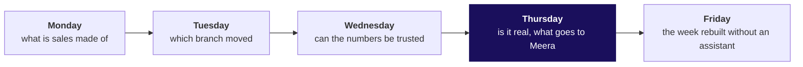
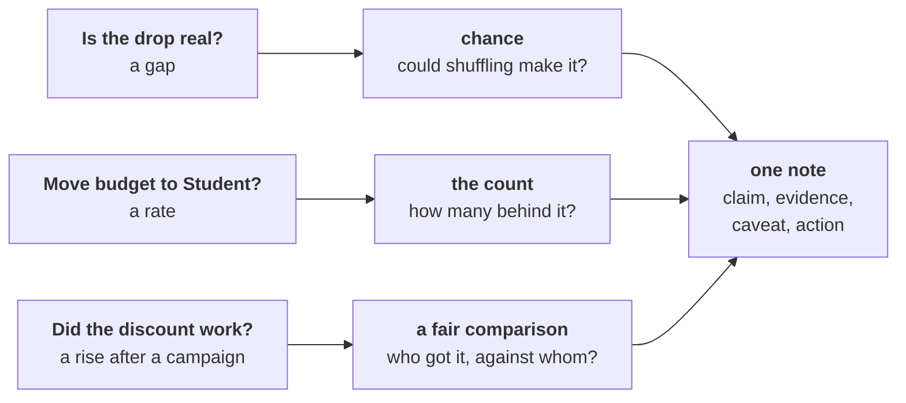
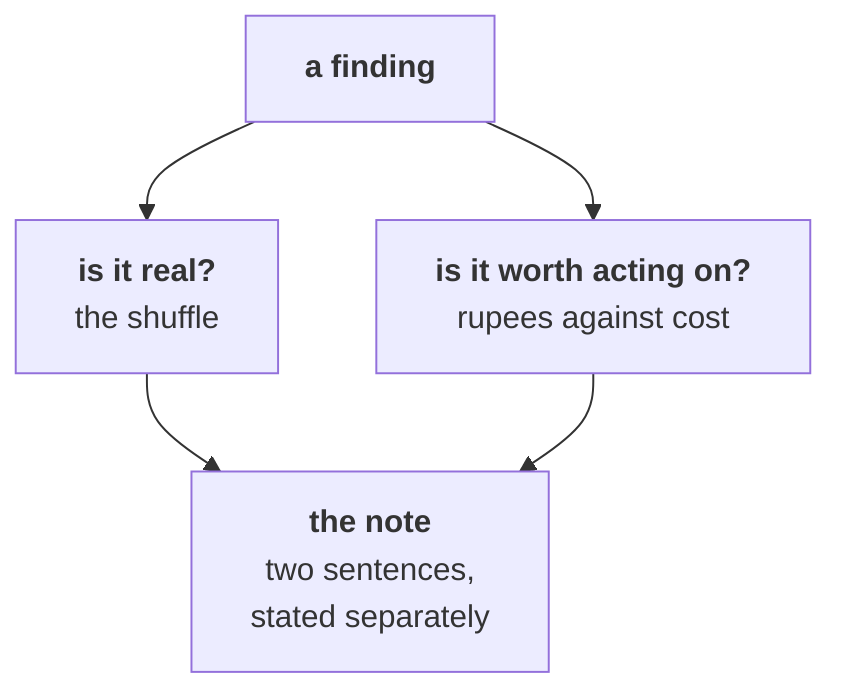
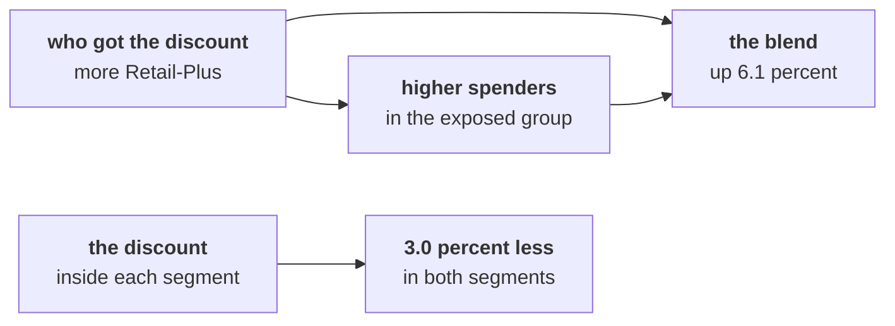

# Real, worth it, and caused

**Week 1, Thursday. Study notes, read after the session.** A gap earns the word real only against
the wobble chance makes, a real gap earns money only against what acting costs, a rate earns trust
only from the count beneath it, and a campaign earns credit only inside each segment it touched.
Reading time: about 22 minutes.

---

## What you can now do

1. You can shuffle two quarters' labels thousands of times and say how often chance alone makes a
   gap as large as the real one.
2. You can say what a p-value means in one sentence that survives an audit, and name the sentence
   that does not.
3. You can size a real gap three ways, per member, for the segment and against the company, and
   set it beside the cost of a fix.
4. You can count what a rate stands on before you repeat it, and call a rate on fewer than thirty
   observations a lead.
5. You can split a campaign's lift by segment, see a blend rise while every group falls, and name
   who got the campaign.
6. You can write Meera's note as claim, evidence, caveat and action, with "not yet" as a complete
   answer where the evidence is thin.

---

## Where this sits

**What the session covered.** Worked in full: the label shuffle by hand and in a loop, the
usual wobble on Retail-Core against the real test on Retail-Plus, the p-value sentence and its
misreading, the gap sized in rupees against a retention offer, the count behind Student's 40 percent,
and the monsoon discount split by segment. Mentioned only: the confidence interval, the
two-direction share, and testing many segments at once.

```mermaid
flowchart LR
    M["<b>Monday</b><br/>what is sales made of"] --> T["<b>Tuesday</b><br/>which branch moved"]
    T --> W["<b>Wednesday</b><br/>can the numbers be trusted"]
    W --> H["<b>Thursday</b><br/>is it real, what goes to Meera"]
    H --> F["<b>Friday</b><br/>the week rebuilt without an assistant"]
    classDef today fill:#1A0F5C,stroke:#1A0F5C,color:#FFFFFF
    class H today
```

This map of the week is this programme's own construction, drawn from the Week 1 rows.

**The outcome tie.** Friday's growth-review rehearsal, where you defend a one-page note aloud to
someone playing marketing, is built from today's four checks and today's note shape.

**What was left out.** Test formulas such as the t-test, building a confidence interval, and power
(how many members a test needs to see a gap) arrive in later weeks. Joining the campaigns table in
SQL and pandas is Week 2's work.

---

## The picture to remember: three checks, one note

```mermaid
flowchart LR
    Q1["<b>Is the drop real?</b><br/>a gap"] --> H1["<b>chance</b><br/>could shuffling make it?"]
    Q2["<b>Move budget to Student?</b><br/>a rate"] --> H2["<b>the count</b><br/>how many behind it?"]
    Q3["<b>Did the discount work?</b><br/>a rise after a campaign"] --> H3["<b>a fair comparison</b><br/>who got it, against whom?"]
    H1 --> N["<b>one note</b><br/>claim, evidence,<br/>caveat, action"]
    H2 --> N
    H3 --> N
```

Each of Meera's questions fails in its own way, so each gets its own check before any number
reaches the note on the right, which is the running thread here: every section adds one line to it.

Meera Raghavan, Kalpa's CEO, asked before Monday's growth review: is the Retail-Plus drop real, or the
usual wobble? Student is up 40 percent: should budget move there? Marketing's monsoon-sale discount
for Retail-Plus, 15 percent off from 5 to 19 August, "lifted revenue 6 percent": did it work, or did
those customers buy anyway? Her constraint: "One page, two minutes. If the honest answer is 'we do not know yet', say so and tell me what would tell us."

The measure all day is delivered revenue per member per quarter: delivered is the money kept, and a
member exists in both quarters.

**CALLBACK.** Week 1, Monday settled that delivered revenue is the money kept, and that a number
leaves the team with its definition.

---

## Round 1: is the Retail-Plus drop real, or the usual wobble?

Any gap fits two stories: something changed for these members, or they had an ordinary quarter and
the draw came out lower. If the quarter made no difference, the labels Q1 and Q2 are arbitrary, so
dealing them at random and recomputing the gap builds a world where only chance is at work. Do that
thousands of times and count the share of chance-only worlds with a gap at least as large as the
real one. That share is the p-value.

**The mechanism, on ten invented cards.** Five members' Q1 spend were Rs 3,400, 2,900, 4,100, 2,500
and 3,800, a mean of Rs 3,340. Five members' Q2 spend were Rs 2,200, 3,100, 1,900, 2,700 and 2,400, a
mean of Rs 2,460. The real gap is Rs 880. The first ten seeded shuffles gave gaps of 520, 240, -320,
360, 1,040, -40, 600, 760, 480 and 80 rupees: one of ten reached Rs 880. Ten shuffles cannot measure a
share. A thousand with seed 2026 gave 21 gaps at Rs 880 or more, a share of 0.021. All 252 possible
deals of ten cards into two piles of five give 6 that reach Rs 880, an exact share of 0.024, so the
loop landed close to the full count it stands in for.

**The usual wobble, measured.** Retail-Core's 34 members delivered a mean of Rs 1,509 in Q1 and Rs
1,399 in Q2, a gap of Rs 110. Of 5,000 shuffles, 1,724 made a gap at least that large, a share of
0.34. One chance-only world in three does it: this is what "nothing happened" looks like.

**Retail-Plus, the real test.** Its 22 members delivered a mean of Rs 3,279 in Q1 and Rs 2,169 in Q2, a
fall of Rs 1,110 per member. Of 5,000 shuffles, 135 made a fall at least that large, a share of 0.027,
which reads as 0.03. Five other seeds give 0.026 to 0.029, so the seed never moves the verdict.
Counting rises of that size as well gives the two-direction share, 0.050; which of the two to report is
chosen before looking, and Meera asked about a drop.

**The trap.** The draft note read: "p = 0.03, so there is a 3% chance we are wrong." It sends Meera
into Monday treating the finding as 97 percent certain. Every shuffle assumed the quarter made no
difference, so the share was counted in a world where the drop is chance by construction. The chance
of being wrong depends on what the shuffle never saw: how plausible a drop was beforehand, what else
changed, and how many segments were tested.

**The check.** Ask of any p-value sentence: in which world was this share counted? Of twenty invented
segments where nothing changed, one still came back at 0.005, smaller than Retail-Plus's share.

**The fix.** "If nothing had changed between the quarters, a fall of Rs 1,110 per member or more would
turn up in about 3 of every 100 shuffles, so we treat the Retail-Plus drop as real." The first line
of Meera's note is that sentence, shortened:

> Retail-Plus members delivered Rs 1,110 less each in Q2; chance makes a fall that large in about 3
> of 100 shuffles, so the drop is real.

**ORIGIN.** Ronald Fisher's The Design of Experiments (1935) is one of the original references for
testing by rearranging labels, known today as a permutation test (checked 29 Sep 2026). The loop you
ran is that argument with the arithmetic done by machine.

**IN THE FIELD.** The American Statistical Association's 2016 statement on p-values (Wasserstein and
Lazar, The American Statistician, volume 70) puts it as its second principle: "P-values do not measure
the probability that the studied hypothesis is true, or the probability that the data were produced by
random chance alone." (Wording checked 29 Sep 2026.)

---

## Round 2: real, and worth acting on, are two separate calls

The head of Retail-Plus asked: "So my tier really is slipping. What do I get to fix it?" Round one
said the fall beats chance and nothing about whether it is big enough to spend on.

```mermaid
flowchart TB
    F["<b>a finding</b>"] --> R["<b>is it real?</b><br/>the shuffle"]
    F --> S["<b>is it worth acting on?</b><br/>rupees against cost"]
    R --> N["<b>the note</b><br/>two sentences,<br/>stated separately"]
    S --> N
```

**Sized three ways.** Per member, the fall is Rs 1,110. For the segment, it is Rs 1,110 times 22
members, Rs 24,420 a quarter: Retail-Plus delivered Rs 72,130 in Q1 and Rs 47,710 in Q2, so the
segment lost about a third of its Q1 revenue (33.9 percent). Against the company, delivered revenue
was Rs 1,22,73,410 in Q1 and Rs 1,28,64,680 in Q2, and the Retail-Plus fall is 0.19 percent of Q2.
Between the quarters Retail-Core moved by -Rs 3,750, Retail-Plus by -Rs 24,420, Student by +Rs 980 and
Business by +Rs 6,18,460, about 25 times the Retail-Plus fall.

**The trap.** The draft ranked segments by their shares: Retail-Plus 0.027, Retail-Core 0.345,
Business 0.555. "Retail-Plus is our biggest problem; fund its retention programme first."
"Significant" had turned into "big", and the smallest share had become the first budget line.

**The check.** Put rupees beside every share. Then watch what a share does when only the count
changes. On invented orders with a fixed Rs 20 gap between two groups, the share was 0.446 at 100
orders, 0.292 at 1,000, 0.076 at 5,000 and 0.002 at 20,000. The gap never moved; only the count did. A
share measures how surely a gap beats chance, never how big it is.

**The fix, and the decision.** Two sentences where the draft had one: the fall is real, and it is
worth Rs 24,420 a quarter, 0.19 percent of the company's delivered revenue. The head of Retail-Plus
proposed a retention offer. As an assumption for the exercise, it costs Rs 500 per member per
quarter, which for 22 members is Rs 11,000. To break even the offer must win back 45 percent of the
fall (11,000 over 24,420). Winning back a quarter of the fall loses about Rs 4,895; winning back three
quarters gains about Rs 7,315. Kavya Nair, the senior analyst, turned that uncertainty into the
action: offer it to half the members, hold back half, and measure.

At depth it gets harsher: at an assumed 30 percent margin, the offer would need more than the whole
fall to pay for itself. And Rs 1,110 is one estimate from 22 members; the range of sizes the data
supports is a confidence interval, named today and built in a later week.

> The fall is Rs 24,420 a quarter, 0.19 percent of delivered revenue; test a retention offer on half
> the members and hold the other half back before funding it for all.

**WATCH OUT.** A ranked list of p-values with no rupees beside it has ranked certainty and called it
importance.

**CALLBACK.** Week 1, Tuesday found that Retail-Plus frequency was the branch that moved; today put a
price on it.

---

## Round 3: the count behind Student's 40 percent

In Q2, for every 100 orders in Q1, Retail-Core placed 97, Retail-Plus 65, Business 94 and Student
140. The rate is correct arithmetic; what is missing is the count it stands on.

**The trap.** "Student is up 40 percent, the fastest on the page: move acquisition budget to
Student." The rate travelled without its count, and the budget followed it.

**Why small counts swing.** On invented bases, one extra order moves a rate by 10 points on 10
orders, 3.33 points on 30, 1 point on 100 and 0.25 points on 400. Student's orders are a count well
under thirty.

**The check: shuffle the count.** In a world where nothing changed, each order falls in Q1 or Q2 on
a coin flip. Run that 5,000 times and count rises of 40 percent or more. For Student's own orders it
happened in 0.397 of the worlds, about four in ten. At Retail-Core's 73 orders it happened in 0.086. At an
invented 400 orders it happened in under 0.002.

| Orders behind the rate | Chance of a 40 percent rise from coin flips alone |
|---|---|
| 10 | 0.377 |
| 20 | 0.252 |
| 30 | 0.181 |
| 50 | 0.101 |
| 100 | 0.044 |
| 200 | 0.010 |
| 400 | 0.0004 |

The rule of thumb: under thirty observations a rate is a lead, never a finding. Thirty is a working
line and no law of nature.

**The same idea, as an interview pair.** One group shows 42 percent on 12 users; another shows 31
percent on 1,200. In an invented simulation where the true rate is 31 percent for everyone, groups of
12 showed 42 percent or more 30.9 percent of the time, while groups of 1,200 all landed between 27.7
and 34.8 percent. On 12 users, one user is 8.3 points of rate.

**The fix.** "Student orders rose 40 percent, on a count so small that chance alone makes a rise that
size in 40% of coin-flip worlds. Not yet: we watch Student until it carries at least thirty orders a
quarter before any budget moves." The note's third line:

> Student's 40 percent rests on a handful of orders and chance makes it in four worlds of ten; we
> watch it until it carries thirty orders a quarter.

**WATCH OUT.** The largest percentage on a page most often sits on the smallest base.

**CALLBACK.** Week 1, Monday's first rate carried its numerator, its denominator and its window;
today the denominator's size became a reason to hold the rate back.

---

## The discount: a blend that rose while every segment fell

The afternoon's exposure table covers 160 customers, 60 exposed to the discount and 100 not.

| Group | Exposed, count | Exposed, August spend each | Not exposed, count | Not exposed, August spend each |
|---|---|---|---|---|
| Retail-Plus | 30 | Rs 4,850 | 40 | Rs 5,000 |
| Retail-Core | 30 | Rs 1,940 | 60 | Rs 2,000 |
| **Blended** | **60** | **Rs 3,395** | **100** | **Rs 3,200** |

**The trap.** The blend: exposed customers spent Rs 3,395 against Rs 3,200, up 6.1 percent, so the
discount worked.

**The check.** Compare inside each segment. Exposed Retail-Plus members spent Rs 4,850 against Rs
5,000, 3.0 percent less. Exposed Retail-Core members spent Rs 1,940 against Rs 2,000, also 3.0
percent less. Every group spent less with the discount, and the blend rose. The reason is the mix:
the exposed group is 50 percent Retail-Plus, the unexposed group is 40 percent Retail-Plus, and
Retail-Plus members spend more whether or not they get a discount. Weight the exposed spending by the
unexposed group's mix, 40 percent Retail-Plus and 60 percent Retail-Core, and the exposed customers
spend Rs 3,104 against Rs 3,200, 3.0 percent less.

```mermaid
flowchart LR
    W["<b>who got the discount</b><br/>more Retail-Plus"] --> B["<b>the blend</b><br/>up 6.1 percent"]
    W --> X["<b>higher spenders</b><br/>in the exposed group"]
    X --> B
    D["<b>the discount</b><br/>inside each segment"] --> L["<b>3.0 percent less</b><br/>in both segments"]
```

This is Simpson's reversal, at recognition depth: a comparison that runs one way in every group and
the other way in the blend. Segment is the confounder, since it drives both who got the discount and
how much they spend.

Monday's rule makes it harsher. Fifteen percent off needs 17.6 percent more volume just to stand still
(1 / 0.85 = 1.176).

The table also has a limit, and the note says so. It carries one August figure per group, so the
spread from member to member is unseen.

**Marketing's pushback, the second case.** "Exposed Retail-Plus members spent Rs 4,850 in August, far
above the Rs 3,200 our unexposed customers averaged." The flaw is the comparison: one segment's
exposed members against all unexposed customers, who are mostly Retail-Core. The fair comparison is
exposed Retail-Plus against unexposed Retail-Plus, Rs 4,850 against Rs 5,000.

**What would settle it.** A held-back group chosen at random inside each segment. The two sides of
each comparison then differ only by the discount and by chance, which round one's shuffle can judge.

> The monsoon sale's 6 percent is a mix effect: inside Retail-Plus and Retail-Core, exposed customers
> spent 3.0 percent less. We do not repeat it as designed; Diwali holds back a random slice of each
> segment.

**ORIGIN.** Edward Simpson described the reversal in "The Interpretation of Interaction in Contingency
Tables", Journal of the Royal Statistical Society, Series B, 1951 (checked 29 Sep 2026), and it carries
his name.

**IN THE FIELD.** Bickel, Hammel and O'Connell, "Sex Bias in Graduate Admissions: Data from Berkeley",
Science, 1975 (checked 29 Sep 2026). Berkeley's fall 1973 admissions showed a clear bias against women
in the blend; department by department, few units departed significantly and about as many favoured
women as men, because women applied more to the departments that were harder to enter.

**CALLBACK.** Week 1, Tuesday separated a change in mix from a change in rate; the discount is the
same split in a new place.

---

## The note, assembled

The four lines above are the evidence; the model note from the escalated case wraps them in 154
words:

> **Claim.** Retail-Plus really is spending less, and it is small against the company; Student is too
> thin to fund yet; the monsoon sale did not work as designed.
>
> **Evidence.** Retail-Plus members delivered Rs 1,110 less each in Q2; chance makes a fall that large
> in about 3 of 100 shuffles. It is Rs 24,420 a quarter, 0.19 percent of delivered revenue. Student's
> 40 percent rise stands on under thirty orders, and coin flips make it in four worlds of ten. The
> sale's 6 percent is a blend: inside Retail-Plus and Retail-Core, exposed customers spent 3 percent
> less.
>
> **Caveat.** The sale went mostly to Retail-Plus, who spend more anyway, and the exposure table gives
> one August figure per group, so we cannot see the spread.
>
> **Action.** Test a retention offer on half of Retail-Plus; watch Student until thirty orders a
> quarter; do not repeat the sale as designed, and hold back a random slice of each segment at Diwali.

The caveat is the line most analysts leave out and the line a CEO keeps them for.

---

## Where this shows up in the work

**A dashboard that turns red.** A weekly metric drops. The first move is to ask how big the ordinary
weekly swings are, and only a drop outside them earns a size in rupees.

**A league table of stores, regions or products.** The top and bottom performers get circled. The count
behind each rate decides whether the ranking means anything.

**A campaign review before a budget renewal.** The questions are who received the campaign,
whether the lift holds inside each segment, and whether a random group can be held back next time.

---

## Try this yourself

No writing: pick a letter for each, then check the key.

1. A shuffle test on a fall in spending returns 0.04. Which sentence is right? a) there is a 4 percent
   chance the fall is not real; b) the fall is 96 percent certain; c) if nothing had changed, a fall
   this large would turn up in about 4 of every 100 shuffles; d) the fall is 4 percent of revenue.
2. Two segments beat chance. One lost Rs 3,000 a quarter, the other Rs 60,000; the first has the
   smaller share. Which goes first in the budget talk? a) the first, since its share is smaller; b)
   the second, after its size is set against the cost of a fix; c) neither, since both are real; d)
   both equally.
3. A rate rose 50 percent on eight orders. The note should say: a) move budget now; b) a lead, and
   what count would turn it into a finding; c) nothing, since small counts are errors; d) the rate
   is wrong.
4. Every segment spent less with a coupon and the blended figure rose. The likeliest reason: a) a
   bug in the blend; b) the coupon worked overall; c) the segments were added up twice; d) the coupon
   went mostly to customers who spend more anyway.
5. Which design lets a Diwali review say whether the discount worked? a) a random held-back group
   inside each segment; b) comparing Diwali with last year's Diwali; c) sending the discount to the
   best customers; d) asking customers whether the discount mattered.
6. From Monday: the note needs a typical order and one bulk order sits in the file. Report: a) the
   mean; b) the bulk order; c) the median, with the bulk order named; d) the mean without the bulk
   order.

Key: 1c 2b 3b 4d 5a 6c. If you missed 1, reread round one's trap; 2, round two's check; 3, round
three's table and rule of thumb; 4, the discount section; 5, "what would settle it"; 6, Monday's
notes, the average that lies.

---

## Where this gets tested

**[S] How do you know whether a change in a metric is significant?** Tested: comparing against
chance. Strong: "I shuffle the period labels thousands of times and count how often chance makes a gap
at least as large. Retail-Core's came back one in three, the ordinary wobble; Retail-Plus's about 3 in
100. Then I size it in rupees, because significant only means it beats chance." Weak: naming a test
with no idea what it compares against.

**[S] Explain a finding to a non-technical stakeholder.** Tested: the shape. Strong: the claim in one
sentence with its number, the evidence with its denominator and check, what would change it, then the
action and its cost. Weak: the method first, or no caveat.

**[S] What does p = 0.03 mean, and not mean?** Tested: the chance-only world. Strong: "If nothing had
changed, a result at least this extreme would turn up about 3 times in 100. It is never a 3 percent
chance we are wrong, which depends on things the test never saw, and it says nothing about size."
Weak: "97 percent sure".

**[F] 42 percent on 12 users against 31 percent on 1,200; which do you trust?** Tested: the count.
Strong: "The 31 percent. One user of 12 is 8.3 points, and at a true 31 percent, groups of 12 showed 42
percent or more about 31 percent of the time while groups of 1,200 stayed between about 28 and 35. The
42 is a lead." Weak: trusting the larger number.

**[F] Revenue rose after a discount; did the campaign work, and what would you need to know?** Tested:
the confounder. Strong: who received it, the comparison inside each segment, and the margin. At Kalpa
the blend rose 6.1 percent while both segments spent 3.0 percent less, and 15 percent off needs 17.6
percent more volume to stand still. Next time, a random held-back group. Weak: "Yes, revenue rose."

**[D] The CEO wants a yes or no and the honest answer is 'not yet'; what do you say, and how do you
hold the line when marketing pushes?** Tested: judgement under pressure. Strong: "Not yet, and here is
what would tell us: a random held-back slice of each segment at Diwali." Show marketing the split
table, agree the goal, and give them the route to an answer nobody can argue with. Weak: giving in, or
a flat no with no next step.

**[F] A metric moved and the test says significant; how do you decide whether the business should
act?** Size it per unit, for the segment and against the company, then against the cost of acting:
Rs 24,420 a quarter against an Rs 11,000 offer needs 45 percent recovered, so test on half first.
Weak: "significant, so act".

**[F] The campaign lifted revenue overall but every segment fell; how is that possible, and which do
you report?** The mix changed: the campaign reached more high spenders. Report the segment
comparisons with the mix stated. Weak: the blend, because it is the total.

**[F] How would you set up the Diwali campaign so that afterwards you can tell whether it worked?**
A random held-back group inside each segment chosen before launch, the measure fixed in advance, and
the comparison made within segments against the shuffle. Weak: comparing with last Diwali.

**[S] What is a confounder? Give an example from a campaign.** A variable that drives both who gets
the treatment and the outcome: segment decided who got the monsoon discount and how much people
spend. Weak: a definition with no example.

**[D] Marketing says your segment split is cherry-picking; how do you respond?** Segment was chosen
before looking, because it is how the discount was targeted, and every segment is shown. Invite
marketing to name any other cut in advance and run it too. Weak: getting defensive.

**[D] You tested twenty segments and one came back at p = 0.03; what do you say?** Recognition only:
one chance-only test in twenty reaches 0.05 by itself, so it is a lead to retest on fresh data. Weak:
announcing the one.

---

## Five lines worth keeping

1. A p-value is a share of chance-only worlds; it is never the chance the finding is wrong.
2. Real and worth acting on are two separate calls: the shuffle answers the first, rupees against cost answer the second.
3. Count what a rate stands on before you repeat it; under thirty, it is a lead.
4. Split an aggregate by segment before you credit a campaign, and name who got it.
5. The note is claim, evidence, caveat, action, and "not yet, and here is what would tell us" is a complete answer.

---

## Coming next

Friday is the AI-free lab and the growth-review rehearsal: the week rebuilt alone on a fresh export,
and the note defended aloud. Week 2 joins the campaigns table to orders in SQL and pandas, which is
where a held-back group becomes a query you can run.

---

## Glossary

| Term | What it means here | Where it appeared | Example |
|---|---|---|---|
| Label shuffle | Dealing the quarter labels at random and recomputing the gap, to make a chance-only world | Half one, S7 and S11; notebook 1 | Ten cards, 1,000 shuffles, 21 gaps at Rs 880 or more |
| Wobble | The gap chance produces between two ordinary quarters | Half one, S12; notebook 1 | Retail-Core's Rs 110, a share of 0.34 |
| p-value | The share of chance-only worlds with a gap at least as large as the real one | Half one, S10 and S15; notebook 1 | 0.027 for Retail-Plus |
| Confidence interval | The range of sizes the data supports, named today and built later | Half one, S26 | A range around Rs 1,110 per member |
| Lead | A rate on fewer than thirty observations, watched and never acted on | Half one, S30; notebook 3 | Student's 40 percent |
| Confounder | A variable that drives both who got a campaign and the outcome | Half two, S3 and S4 | Segment, in the monsoon sale |
| Simpson's reversal | A comparison that runs one way in every group and the other way in the blend | Half two, S5 and S6 | Up 6.1 percent blended, 3.0 percent less in each segment |
| Held-back group | A random slice inside each segment that does not get the campaign | Half two, S12 | A random slice of Retail-Plus with no Diwali discount |

---

## Go deeper

| Order | What | Time | Why this one |
|---|---|---|---|
| 1 | Seeing Theory, frequentist inference, https://seeing-theory.brown.edu/frequentist-inference/index.html (verified 29 Sep 2026) | 25 minutes | Interactive pictures of sampling and testing, the visual version of today's shuffles |
| 2 | StatQuest video index, "Hypothesis Testing and The Null Hypothesis" and "p-values: What they are and how to interpret them", https://statquest.org/video_index.html (verified 29 Sep 2026) | 30 minutes | The chance-only world and the p-value sentence, told slowly with pictures |
