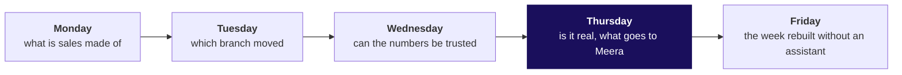
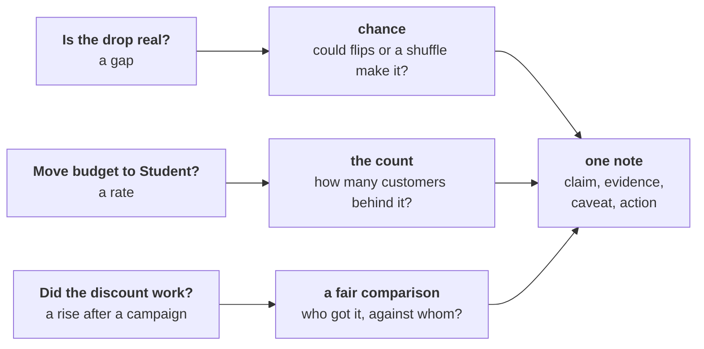

# Is the Retail-Plus fall real, is Student's 40 percent worth budget, and did the monsoon sale work?

**Week 1, Thursday. Study notes, read after the session.** Reading time: about 30 minutes.

Meera Raghavan, CEO of Kalpa Retail, sent three questions before Monday's growth review:

> "One: Retail-Plus is down, smaller than first reported. Real, or the wobble we see every quarter?
> Two: Student is up 40 percent; should I move budget there? Three: marketing ran a monsoon-sale
> discount for Retail-Plus in August, says it lifted revenue 6 percent, and wants to repeat it for
> Diwali. Did the discount work, or did those customers buy anyway? One page, two minutes. If the
> honest answer is 'we do not know yet', say so and tell me what would tell us."

The page is yours, and on Monday Marketing will defend its campaign against your reading of it.
Kavya Nair, the team's senior analyst, reviews each chapter's answer before it goes to Meera.

---

## What can you do now that you could not this morning?

1. You can pick the chance reference that fits how the data was collected and read its share one
   way and either way.
2. You can size a gap per member, for the segment, against the company and against a fix's cost.
3. You can count what a rate stands on, in customers as well as orders.
4. You can split a campaign's lift by segment and explain how a blend rose while every segment fell.
5. You can write Meera's note as claim, evidence, caveat and action, with "not yet" as a complete
   answer, and design the hold-back that would settle a campaign.

---

## Where does today sit in the week, and what does each of Meera's numbers measure?

**What the session covered.** Six chapters on one Kalpa case, each worked in full: whether the
Retail-Plus fall is real, whether it is worth acting on, what count stands behind Student's 40
percent, whether the monsoon discount worked inside each segment, what goes on Meera's page, and
what comparison would be fair at Diwali. Four ideas were only named: the textbook test's formula,
building a confidence interval, power, and difference in differences.

Monday settled delivered revenue, the rupees on orders whose status is delivered, as the money Kalpa
keeps; Tuesday found the fall in Retail-Plus, Kalpa's paid membership tier; Wednesday tied the order
file to Finance's books. Today's file holds 186 cleaned orders from 69 customers in Q1 and Q2, in
four segments: Retail-Core, Retail-Plus, Student and Business. Meera's three numbers are a gap per
member, a rate of orders and a lift from a sale.

```mermaid
flowchart LR
    M["<b>Monday</b><br/>what is sales made of"] --> T["<b>Tuesday</b><br/>which branch moved"]
    T --> W["<b>Wednesday</b><br/>can the numbers be trusted"]
    W --> H["<b>Thursday</b><br/>is it real, what goes to Meera"]
    H --> F["<b>Friday</b><br/>the week rebuilt without an assistant"]
    classDef today fill:#1A0F5C,stroke:#1A0F5C,color:#FFFFFF
    class H today
```

This week map is the programme's own construction.

**The outcome tie.** Friday's growth-review rehearsal, where you defend a one-page note aloud to a
partner playing Marketing, runs on today's checks and today's note.

**What was left out.** The formulas, building a confidence interval and power (how many members a
test needs to see a gap) arrive in later weeks.

---

## Which picture should you be able to redraw?

```mermaid
flowchart LR
    Q1["<b>Is the drop real?</b><br/>a gap"] --> H1["<b>chance</b><br/>could flips or a shuffle make it?"]
    Q2["<b>Move budget to Student?</b><br/>a rate"] --> H2["<b>the count</b><br/>how many customers behind it?"]
    Q3["<b>Did the discount work?</b><br/>a rise after a campaign"] --> H3["<b>a fair comparison</b><br/>who got it, against whom?"]
    H1 --> N["<b>one note</b><br/>claim, evidence,<br/>caveat, action"]
    H2 --> N
    H3 --> N
```

Each of Meera's questions fails in its own way, so each gets its own check before a number reaches
the note. A gap needs a chance reference: the gaps chance alone makes when nothing changed, built by
redrawing the data thousands of times, with the real gap read as the share of those chance-only
worlds that match it. A rate needs its count, and a campaign a fair comparison. Every chapter adds a
line to the note or tests one.

**CALLBACK.** Week 1, Monday settled that a number leaves the team with its definition.

---

## Chapter 1. Is the Retail-Plus fall real, or the wobble Kalpa sees every quarter?

**Who needs the answer.** Meera decides at Monday's growth review whether the Retail-Plus tier's
fall gets a budget of its own. A wobble read as a real fall funds a fix for nothing; a real fall read
as a wobble lets the tier drain. The metric is delivered revenue per Retail-Plus member per quarter.

**The questions on the way.**

1. Which of four ways to ask "is it real?" fits 22 members measured twice?
2. How often do coin tosses on five members' cards make a gap of Rs 880?
3. What does the usual wobble look like on Retail-Core?
4. How often does chance alone make a fall as large as Retail-Plus's?
5. What does the share say about the chance that the finding is wrong?
6. Do the textbook paired test and an exact count agree?

**IN THE FIELD.** Booking.com runs about 25,000 tests a year and more than 1,000 at once (Thomke,
HBR, 2020), and by Thomke's account about nine in ten of its experiments improve nothing (HBR
podcast, 2019).

### Which of four ways to ask "is it real?" fits 22 members measured twice?

| Option | Sized on this file | Call |
|---|---|---|
| A. Flip each member's pair | 22 members, one Q1 less Q2 each; the share moves by 0.004 across five sets of tosses | Best fit |
| B. Pool and shuffle | 44 totals treated as 44 different people | The design for different customers |
| C. Textbook paired test | One call on 22 differences, built for bell-shaped data; 8 of the 44 quarterly totals are zero | Second route |
| D. Wait for Q3 | One quarter; Monday passes unanswered | If A and C are unclear |

Flip each member's own pair: the same 22 members sit in both quarters, so a coin per member decides
which of its two quarters counts as Q1. Pooling counts the gaps between members as chance; here a
member's Q1 barely predicts their Q2 (a correlation of 0.04), so the two land close. Different
customers in each group would switch the call to the label shuffle, which deals the group labels at
random.

### How often do coin tosses on five members' cards make a gap of Rs 880?

In 35 of 1,000 tosses, and in exactly 1 of the 32 ways five coins can land. Five invented members
each hold a Q1 card and a Q2 card, Q1 averaging Rs 880 more, and the room's ten tosses were too few
to measure a share.

### What does the usual wobble look like on Retail-Core?

Retail-Core's 34 members fell Rs 110 each, a fall that flips match in 0.358 of 5,000 counting falls
and 0.723 either way: chance makes it easily.

### How often does chance alone make a fall as large as Retail-Plus's?

Retail-Plus's 22 members fell from Rs 3,279 to Rs 2,169, Rs 1,110 each: 145 of 5,000 flips made a
fall that large (0.029), and 286 a move that large either way (0.057). Meera asked after seeing the
fall, so no direction was fixed before the test, and both go in the note.

### What does the share say about the chance that the finding is wrong?

Nothing. The plausible wrong sentence, "p = 0.03, so there is a 3% chance we are wrong about the
drop", has Meera treat the fall as 97 percent certain, when every flip assumed nothing had changed.
The check: of twenty invented segments where nothing changed, one still came back at 0.003, so a
small share turns up even where there is nothing to find. The fix keeps the numbers and shrinks the
claim: "If nothing had changed, a fall of Rs 1,110 per member or more
would turn up in about 3 of every 100 flips, and a move that large either way in about 6; the
question came after the fall was seen, so we read it as borderline."

### Do the textbook paired test and an exact count agree?

Yes. Listing all 4,194,304 ways the 22 coins can land gives 0.027 one way and 0.055 either way, and
the textbook paired test gives 0.0275 and 0.055; that one library call takes over when members run
to thousands.

**ORIGIN.** Ronald Fisher's The Design of Experiments (1935) is an original reference for testing by
rearranging labels (checked 29 Sep 2026).

> **Kavya's review.** "About 3 in 100 counting falls and 6 either way, three routes agreeing, and you
> said which direction you counted and why. Borderline is an honest answer. Now tell me how much money
> it is."

The fall is borderline, about 3 in 100 flips one way and 6 either way: well outside the usual
wobble and at the edge of what chance makes.

---

## Chapter 2. The fall edges past chance: is it big enough, in rupees against what a fix costs, to act on?

**Who needs the answer.** The head of Retail-Plus wants a retention budget, and Meera weighs it
against the quarter. A wrong call funds an offer that cannot pay back, or ignores a fall that keeps
draining the tier.

**The questions on the way.**

1. Which of four ways to answer "worth acting on?" can Monday use?
2. How much is the fall in rupees, per member and for the tier?
3. How big is the fall against the company's quarter?
4. Should the smallest share open the growth review?
5. What must a Rs 500 retention offer win back to pay for itself?
6. How small could the fall really be?

**IN THE FIELD.** A change to how Bing showed ad headlines raised revenue 12 percent, more than 100
million dollars a year in the US (Kohavi and Thomke, HBR, 2017), while only about a third of
Microsoft's experiments improved the metric they targeted (Kohavi and colleagues, 2009).

### Which of four ways to answer "worth acting on?" can Monday use?

| Option | What it needs | Call |
|---|---|---|
| A. Break-even on the estimate | One pass over the orders, and a cost, assumed today | Best fit for Monday |
| B. The low end of a range | 22 differences redrawn 5,000 times | Its check |
| C. Test the offer on half the tier | Rs 5,500 and a quarter | Where the answer leads |
| D. A past offer's recovery rate | A measured rate, which Kalpa does not have | Cannot run today |

Break-even on the estimate, the share of the fall an offer must win back to pay for itself, with
the range as its check; a recovery rate measured on a past offer would let break-even decide alone.

### How much is the fall in rupees, per member and for the tier?

Rs 1,110 a member, times 22, is Rs 24,420 a quarter: a third of the tier's Q1, which fell from Rs
72,130 to Rs 47,710.

### How big is the fall against the company's quarter?

It is 0.19 percent of the company's Q2 delivered revenue of Rs 1,28,64,680.

### Should the smallest share open the growth review?

No. A hurried draft ranked the segments by the share counted either way (Retail-Plus 0.057,
Retail-Core 0.723, Business 0.910) and wrote: "Retail-Plus is the surest move of the quarter, so it
opens the growth review: fund its retention programme first." By rupees moved, Business opens the
review, up Rs 6,18,460, and an invented Rs 20 gap shows why a share cannot rank: it falls from 0.43
on 100 orders to 0.002 on 20,000. The fix is two sentences: borderline against chance, and worth Rs
24,420 a quarter, 0.19 percent of the company.

**WATCH OUT.** A list ranked by p-value has ranked certainty and called it importance.

### What must a Rs 500 retention offer win back to pay for itself?

45 percent of the fall. An assumed offer of Rs 500 a member costs Rs 11,000 a quarter for all 22,
against Rs 24,420 of revenue; counting only an assumed 30 percent margin, it would need 150
percent, more than the whole fall.

### How small could the fall really be?

About Rs 80 a member. Redrawing the members' own falls 5,000 times gives an approximate 95 percent
range of about Rs 80 to Rs 2,160, a confidence interval built properly later, with 0.016 of the
redraws at or below zero. Its low end sits far below the offer's Rs 500.

> **Kavya's review.** "Borderline, worth Rs 24,420 a quarter and 0.19 percent of the company, with a
> range that dips far below the offer's cost. If the head of Retail-Plus wants to act, offer it to a
> coin-chosen half and hold back the rest."

**CALLBACK.** Week 1, Tuesday found that Retail-Plus orders per customer were the branch that moved;
today priced the fall.

Worth watching, and not worth acting on alone. If anyone acts, a coin-chosen half of the tier gets
the offer first, Rs 5,500 a quarter, and eleven a side can show only a large recovery.

---

## Chapter 3. Student is up 40 percent, the fastest rise on the page: how many customers stand behind it, and should budget move there?

**Who needs the answer.** Meera decides whether acquisition budget follows the fastest riser. A rise
chance made sends a quarter's spend to a segment that may be flat next quarter.

**The questions on the way.**

1. Which of four ways to answer "should budget follow the 40 percent?" fits Monday?
2. Which segment's orders rose fastest from Q1 to Q2?
3. Should acquisition budget move to the fastest riser?
4. How often does chance alone make a 40 percent rise on Student's count?
5. Which do you trust, 42 percent on 12 users or 31 percent on 1,200?
6. Do an exact count of every deal, and real handfuls, agree?

**IN THE FIELD.** The Gates Foundation backed small schools partly because they were
over-represented among top performers; among the best, Howard Wainer wrote, "we would expect 3% of
small schools" and "we found 12%". He found them over-represented among the worst as well. By 2001 the
Foundation had given about 1.7 billion dollars to education projects (Wainer, "The Most Dangerous
Equation", 2009).

### Which of four ways to answer "should budget follow the 40 percent?" fits Monday?

| Option | What it needs | Call |
|---|---|---|
| A. Trust the headline | Four segments and two quarters | The trap |
| B. Coin flips on the count | The count behind the rate, found by you | Best fit |
| C. The rule of thumb | The customers behind the rate, against thirty | The summary line |
| D. Wait for thirty customers | How fast new customers arrive, sized once they are counted | The action |

Coin flips on the count, said with the rule of thumb. If nothing changed, each order lands in Q1 or
Q2 on a coin flip, and the flips show how often that alone makes the rise; the rule counts
customers, because thirty orders from three people are still three people's habits. A cheap paid
test aimed at new students would turn waiting into a two-week experiment.

### Which segment's orders rose fastest from Q1 to Q2?

Student, with 140 orders in Q2 for every 100 in Q1, against Retail-Core's 97, Business's 94 and
Retail-Plus's 65.

### Should acquisition budget move to the fastest riser?

Not on the rate alone. The plausible wrong answer is "Student is up 40 percent, the fastest on the
page: move acquisition budget to Student." The check counts what the rate stands on, and fewer than
thirty customers stand behind Student's rise; chapter 3's notebook leaves an empty cell for you to
count them. On invented bases, one more order moves a rate 10 points on 10 orders and 0.25 points
on 400.

### How often does chance alone make a 40 percent rise on Student's count?

In 0.397 of 5,000 coin-flip worlds, against 0.086 on Retail-Core's 73 orders and under 0.002 on an
invented 400.

### Which do you trust, 42 percent on 12 users or 31 percent on 1,200?

The 31 percent, as the estimate. One user of 12 moves the rate 8.3 points, and a true 31 percent
reads 42 or more in about a third of groups of 12.

### Do an exact count of every deal, and real handfuls, agree?

Yes. Listing every way the orders could be dealt to the two quarters gives an exact 0.387 against
the flips' 0.397. Handfuls of Retail-Core's own orders, drawn at Student's size, make the rise in
0.344, while handfuls of sixty almost never do.

**WATCH OUT.** The largest percentage on a page most often sits on the smallest base.

> **Kavya's review.** "Real arithmetic on too few customers to act on. Say how often chance makes the
> rise, and give Meera the number of customers that would reopen it."

**CALLBACK.** Monday's first rate carried its numerator and denominator; today the denominator's size
held the rate back.

Not yet: no budget moves until more customers buy, thirty or more behind the rise.

---

## Chapter 4. Marketing says the monsoon sale lifted revenue 6 percent: did the discount work, or did those customers buy anyway?

**Who needs the answer.** Meera signs off Diwali's sale, and the marketing lead wants the monsoon
discount again at 15 percent off. A wrong yes gives 15 percent of the price to customers who would
have bought anyway, at Diwali's scale.

**The questions on the way.**

1. Which of four ways to answer "did the discount work?" can the files support?
2. Does Marketing's 6 percent rebuild from the same tables?
3. Should the reproduced lift send the sale to Diwali?
4. What does the comparison show inside each segment?
5. What does the note tell Meera about the discount?
6. Does one mix for both groups give the same answer, and what can it check?

**IN THE FIELD.** In eBay's search-advertising experiments, new and infrequent users bought more
after seeing an ad, while frequent users, whose buying the ads did not change, took most of the ad
spend (Blake, Nosko and Tadelis, NBER Working Paper 20171). UC Berkeley's 1973 admissions took about
44 percent of 8,442 men and 35 percent of 4,321 women, yet department by department the small bias
favoured women (Bickel, Hammel and O'Connell, Science, 1975).

### Which of four ways to answer "did the discount work?" can the files support?

The Monsoon Sale gave 15 percent off from 5 to 19 August 2026, aimed at Retail-Plus, and at that
discount orders must rise 17.6 percent just for revenue to stand still. Customers who got it are
called exposed.

**Where the exposure table comes from.** It is the campaign platform's August list: 160 Retail-Plus
and Retail-Core customers under the platform's own ids, with one average August spend per group. It
records who received the sale, whatever the sale was aimed at, which is why it holds Retail-Core
customers although the campaigns table aimed the sale at Retail-Plus, and it cannot be matched to
Finance's order file. Read it for who got the sale; the mixes differ, 50 percent Retail-Plus among
the exposed and 40 among the rest.

| Option | What it assumes | Call |
|---|---|---|
| A. Before and after, a handful of orders a month | Nothing else changed that month | Chapter 6 |
| B. Exposed against not, blended | The two groups hold the same mix | Marketing's |
| C. Exposed against not, per segment | Who got it inside a segment was as good as random | Best fit |
| D. Both groups on one mix | The mix is the whole story | Second route |

The comparison inside each segment, with one mix as its one-line form; a group chosen at random
before the sale would make the blend itself fair.

### Does Marketing's 6 percent rebuild from the same tables?

Yes. Exposed customers spent Rs 3,395 in August against Rs 3,200 for the rest, a blended lift of 6.1
percent.

### Should the reproduced lift send the sale to Diwali?

Not before asking who is in each group. The plausible wrong answer is "The discount worked: exposed
customers spent Rs 3,395 against Rs 3,200, up 6.1%; repeat it for Diwali." In two invented stores,
promoted customers spent 10 percent less than the same store's others (Rs 900 against Rs 1,000, and
Rs 180 against Rs 200), yet the promoted blend reads Rs 756 against Rs 360, because 8 of the 10
promoted customers shop at the big store against 2 of the 10 others.

### What does the comparison show inside each segment?

| Segment | Exposed | Spend | Not exposed | Spend |
|---|---|---|---|---|
| Retail-Plus | 30 | Rs 4,850 | 40 | Rs 5,000 |
| Retail-Core | 30 | Rs 1,940 | 60 | Rs 2,000 |

The customers who got the sale spent 3.0 percent less in both segments. The blend rose because the
group who got it was 50 percent Retail-Plus against 40, and Retail-Plus members spend more whatever
happens. Every segment moving one way while the blend moves the other is Simpson's reversal, and
segment is the confounder, a difference between the groups that moves the outcome by itself.

### What does the note tell Meera about the discount?

Do not repeat it as designed, and if Diwali runs a sale, hold back a random slice of each segment.

### Does one mix for both groups give the same answer, and what can it check?

Yes. On the not-exposed group's mix the exposed spend Rs 3,104 against Rs 3,200, and the other way
round Rs 3,395 against Rs 3,500: 3.0 percent less both ways. The route reuses the split's four
cells, so it confirms that the mix explains the whole 6.1 percent and cannot catch an error in them.

**ORIGIN.** Edward Simpson described the reversal in the Journal of the Royal Statistical Society,
Series B, 1951 (checked 29 Sep 2026).

> **Kavya's review.** "You rebuilt Marketing's number before disagreeing with it. Now tell me what
> else changed in August, because neither table can see that."

**CALLBACK.** Tuesday separated a change in mix from a change in rate; this is that split again.

Not as designed: inside each segment the customers who got the sale spent 3 percent less, and the
blend rose only because of who got it.

---

## Chapter 5. Three answers are in: what goes on Meera's one page, and when is "not yet" the honest answer?

**Who needs the answer.** Meera reads the page in two minutes before Monday, with Marketing in the
room. A line without its base sends money the wrong way; a line that hedges everything gives her
nothing to decide.

**The questions on the way.**

1. Which of four ways to answer Meera in writing fits two minutes?
2. What must sit beside each of the day's numbers before it goes in a sentence?
3. What goes wrong when each number is written the way it first appeared?
4. How does the Retail-Plus line survive an audit?
5. When is "not yet" an answer Meera can use?
6. Do the note's decisions follow from its numbers?

**IN THE FIELD.** "We don't do PowerPoint (or any other slide-oriented) presentations at Amazon.
Instead, we write narratively structured six-page memos" (Jeff Bezos, 2017 letter to shareholders).

### Which of four ways to answer Meera in writing fits two minutes?

| Option | Size | What it risks | Call |
|---|---|---|---|
| A. Yes or no per question | 13 words | Every caveat | Too thin |
| B. The dashboard | 506 words, all that chapters 1 to 4 printed | No decision on the page | Too much |
| C. Four-part note | Under 200 words | Only the discipline | Best fit |
| D. A slide deck | Ten slides | The logic lives in the talk | A meeting |

The four-part note: claim, evidence with its base, the caveat that would change the claim, and the
action with its cost. A standing weekly review of the same metrics would switch the call to a
dashboard with fixed bases.

### What must sit beside each of the day's numbers before it goes in a sentence?

A partner: a share needs its world and its direction, a rupee figure its whole, a rate its count and
a lift its groups.

### What goes wrong when each number is written the way it first appeared?

Three true numbers drive three wrong decisions. The hurried note reads "Retail-Plus revenue fell
34%. Student is up 40%. The monsoon sale lifted revenue 6%." and recommends a retention offer,
budget to Student and the sale again. Audited for a base, a count or chance, and a caveat per line,
it has 9 of 9 cells missing.

### How does the Retail-Plus line survive an audit?

With all four parts: the claim of a borderline fall, small against the company; evidence of Rs
24,420 a quarter, 0.19 percent of the company, about 3 and 6 in 100 flips; the caveat that the
question came after the fall was seen, the part a hurried analyst drops; and the action, a half-tier
test at Rs 5,500 if anyone acts.

### When is "not yet" an answer Meera can use?

When it names what would turn it into a yes: thirty or more customers for Student, a random
hold-back for the discount.

### Do the note's decisions follow from its numbers?

Yes. Applying the rule each chapter ended on to that chapter's numbers reaches all three of the
note's decisions, and 11 of its 11 figures trace to a chapter.

> **Kavya's review.** "Three answers, each with its base, its caveat and a cost, and two say not yet
> with what would change them. Marketing will push on the third on Monday."

The chapter's note came to 193 words. The model note for the afternoon's case sets the same answers
out part by part in 190:

> **Claim.** Retail-Plus is down by a borderline amount and small against the company; Student is
> too thin to fund yet; the monsoon sale did not work as designed.
>
> **Evidence.** Retail-Plus members delivered Rs 1,110 less each in Q2; if nothing had changed, a
> fall that large turns up in about 3 of 100 flips, and a move that large either way in about 6. It
> is Rs 24,420 a quarter, 0.19 percent of delivered revenue. Student's 40 percent rise comes from
> very few customers, and coin flips make it in four worlds of ten. The sale's 6 percent is a blend:
> inside Retail-Plus and Retail-Core, exposed customers spent 3 percent less.
>
> **Caveat.** We asked after seeing the fall. The group who got the sale was half Retail-Plus
> against 40 percent of the rest, and Retail-Plus spends more anyway; the platform's list gives one
> August figure per group, so we cannot see the spread.
>
> **Action.** Watch Retail-Plus, and if we act, test the offer on a coin-chosen half; watch Student
> until more customers buy, thirty or more; do not repeat the sale as designed, and hold back a
> random slice of each segment at Diwali.

---

## Chapter 6. Marketing wants the sale again for more of the base: who got it, what else changed, and what would settle it at Diwali?

**Who needs the answer.** Meera signs the Diwali plan, and Marketing will defend its campaign on
Monday. A sale widened on a jump that belongs to the month multiplies the margin it gives away.

**The questions on the way.**

1. Which of four ways to ask "did the sale cause it?" can the files answer?
2. Who got the monsoon sale?
3. Does August against July show the sale worked?
4. What else changed in August?
5. How would a hold-back at Diwali be designed and priced?
6. Does the same test on months with no sale agree?

**IN THE FIELD.** eBay's paid search test found brand-keyword ads had "no measurable short-term
benefits", since "almost all of the forgone click traffic and attributed sales were captured by
natural search" (Blake, Nosko and Tadelis, NBER Working Paper 20171).

### Which of four ways to ask "did the sale cause it?" can the files answer?

| Option | What it assumes | Call |
|---|---|---|
| A. Before and after | Nothing else changed | The trap |
| B. The change beside the change | Both segments move alike | A lead |
| C. Inside each segment | Exposure random within segment | Today's evidence |
| D. Random hold-back | Nothing; a coin decides | Best for Diwali |

The split today, and a random hold-back for Diwali. A hold-back refused, or one whose forgone lift
runs into lakhs, would push the team to B over many months, its assumption said aloud.

### Who got the monsoon sale?

30 Retail-Plus and 30 Retail-Core customers on the platform's list, although the campaigns table
aimed it at Retail-Plus alone: a rule chose them, and no coin did.

### Does August against July show the sale worked?

No. The plausible wrong answer is "Retail-Plus delivered Rs 25,060 in August against Rs 9,280 in
July, up 170%: the monsoon sale worked, so run it for more of the base at Diwali." Retail-Core rose
73 percent over the same months, Retail-Plus fell 58 percent from May to June with no sale, and July
stands on 4 orders.

### What else changed in August?

August was busy for everyone: it holds 52.5 percent of Retail-Plus's Q2 delivered revenue and 48.6
percent of Retail-Core's. Shuffling the segment labels over both segments' Q2 orders, which come from different
customers, makes a gap that large in about 8 deals in 10 either way and 4 in 10 in Marketing's
direction. Retail-Core is an imperfect comparison, since the platform's list shows some of its
customers got the sale.

### How would a hold-back at Diwali be designed and priced?

Before the sale, a coin holds back one in five inside each segment of the platform's list: 14 of its
70 Retail-Plus customers, forgoing about Rs 4,200 at Marketing's own 6 percent. Fourteen are too few
to see a 6 percent lift, and how many a hold-back needs is power, a later week's topic. The morning's
offer was priced on Finance's 22 members, about Rs 1,139 each in August, and the 70 are the
platform's customers at Rs 5,000, so each decision is sized on the list it acts on.

### Does the same test on months with no sale agree?

Yes. On Q1, when no sale ran, the same test finds gaps of 4, 22 and 26 points between the segments'
monthly shares, so August's 4 carries no sign of the sale, and this placebo test shares nothing with
chapter 4's split. Option B, a difference in differences, has Retail-Plus rising Rs 6,010 more than
Retail-Core from July to August on 13 orders, but May to June shows the two do not move alike, so
it stays a lead.

> **Kavya's review.** "Who got it: a rule chose them. Who did not: a different mix. What else
> changed: August, for everyone. You priced the hold-back on the list it acts on; take it to
> Marketing as an offer."

Nothing in the files shows a lift the sale can claim. Hold back a random fifth of each segment at
Diwali and compare inside each segment.

---

## Where do today's three checks decide something at work?

- When a dashboard turns red, ask how big the ordinary weekly swings are before sizing the drop.
- A league table of stores or products means something only where the count behind each rate does.
- Before a campaign's budget is renewed, ask who got it, whether the lift holds inside each segment,
  and what else changed.

---

## Can you answer four questions on today's traps without writing anything?

Pick a letter, then check the key.

1. A shuffle test returns 0.04. Which is right? a) there is a 4 percent chance that the fall in
   spending is not real; b) the fall is 96 percent certain; c) with no change, this fall turns up
   in about 4 of 100 shuffles; d) the fall is 4 percent of revenue.
2. A rate rose 50 percent on eight orders. What does the note say? a) move budget now, since 50
   percent is the largest rise on the page; b) a lead, and the count that would make it a finding;
   c) nothing; d) the rate is wrong.
3. Every segment spent less with a coupon and the blend rose. Why? a) a bug in the blend; b) the
   coupon worked overall; c) the segments were counted twice in the blend; d) the coupon went mostly
   to higher spenders.
4. A targeted and an untargeted segment both jumped in the sale month. What does the jump show?
   a) the sale worked, since the targeted segment jumped; b) a spillover; c) nothing the sale can
   claim yet; d) a mislabelled segment.

Key: 1c 2b 3d 4c. A miss sends you back to the trap in chapter 1, 3, 4 or 6.

---

## What will an interviewer ask, and what does a strong answer sound like?

The tags are this programme's own calibration for 0 to 3 year Indian-market candidates: [S] a
staple asked everywhere, [F] frequent in GCC and product screens, [D] a differentiator. Each
chapter's first question is its design question, answered in the chapter; chapter 1's closes this
list.

**[S] How do you know whether a change in a metric is significant?** "I build a chance reference
that fits how the data was collected, flipping each member's own pair for the same members measured
twice or shuffling the labels for different customers, and count how often chance matches the real
gap, one way and either way: about 3 and 6 in 100 for Retail-Plus, which is borderline. Then I
check the count and size it in money." A weak answer names a test and a 0.05 cut-off and stops.

**[S] Explain a finding to a non-technical stakeholder.** "The decision first, with one number and
its base, then the evidence, the caveat that would change my view, and the action with its cost:
Retail-Plus spends about Rs 24,000 a quarter less, a fifth of one percent of the company, so we watch
it, and any offer goes to a coin-chosen half first."

**[S] What does p = 0.03 mean, and not mean?** "If there were no real difference, a gap this large
would turn up about 3 times in 100 by chance. It is never the chance we are wrong, and it says
nothing about size." A weak answer calls the finding 97 percent certain.

**[F] 42 percent on 12 users against 31 percent on 1,200; which do you trust?** "The 31 percent. One
user of 12 moves the rate 8.3 points, so the 42 is a lead to measure on more users."

**[F] Revenue rose after a discount; did the campaign work, and what would you need to know?** "Who
got it, who did not, and what else changed: I split the lift by segment, check an untargeted
segment over the same months, and ask for a random hold-back next time."

**[D] The CEO wants a yes or no and the honest answer is 'not yet'; what do you say, and how do you
hold the line when marketing pushes?** "Not yet, and here is what would tell us by when: a held-back
slice of each segment at Diwali. I hold the line with their number reproduced, then the segments."

**[F] A metric moved and the test says significant; how do you decide whether to act?** "I size it
against the company and the cost: Rs 24,420 a quarter against an Rs 11,000 offer needs 45 percent
back, and the range dips far below the cost, so a test on part of the group comes first."

**[F] The campaign lifted revenue overall but every segment fell; how, and which do you report?**
"The mix shifted toward high spenders. I report the segments and name the mix as the reason the
blend rose."

**[F] How would you set up the Diwali campaign so you can tell whether it worked?** "A coin per
customer inside each segment holds back a fifth before the sale, with the measure, the window and the
direction fixed in advance."

**[S] What is a confounder? Give an example from a campaign.** "Something that differs between the
groups and moves the outcome on its own: the sale went to more high-spending Retail-Plus members."

**[D] Marketing says your segment split is cherry-picking; how do you respond?** "I reproduce their
number first. Segment was fixed before looking, because it is how the sale was targeted, and I will
run any cut they name in advance. Then I offer the hold-back."

**[D] Design: flip, shuffle, textbook test or wait; which for Monday, sized how, and what would
switch it?** "Flip each member's pair, since the same 22 members sit in both quarters and 8 of their
44 totals are zero, with the textbook paired test as the cross-check and the default once members
run to thousands. Shuffle the labels for different customers, and wait only if both are unclear."

---

## Which words did today use, and what does each mean?

| Term | What it means here | Where it appeared | Example |
|---|---|---|---|
| Chance reference | The gaps chance alone makes when nothing changed, which a real gap is read against | Chapter 1 | 5,000 flips of Retail-Plus's pairs |
| Flip test | A coin per member decides which of its two quarters counts as Q1 | Chapter 1 | 145 of 5,000 for Retail-Plus |
| Label shuffle | Dealing group labels at random across different customers | Chapters 1 and 6 | 4,124 of 5,000 in August |
| p-value | Share of chance-only worlds with a gap at least as large | Chapter 1 | 0.029 one way, 0.057 either way |
| Break-even recovery | Share of a fall a fix must win back | Chapter 2 | 45 percent |
| Lead | A rate on under thirty customers | Chapter 3 | Student's 40 percent |
| Mix | The share of each kind of customer inside a group | Chapter 4 | 50 against 40 percent Retail-Plus |
| Confounder | Drives both who got a campaign and the outcome | Chapters 4 and 6 | Segment |
| Held-back group | A random slice that does not get the campaign | Chapter 6 | 14 of the platform's 70 |
| Confidence interval | The range of sizes the data supports | Chapter 2 | About Rs 80 to Rs 2,160 |
| Blend | One average over groups mixed together | Chapter 4 | Rs 3,395 against Rs 3,200 |
| Lift | How much more the exposed spent, as a share of the rest | Chapters 4 and 6 | Marketing's 6.1 percent |
| Simpson's reversal | One way in every group, the other in the blend | Chapter 4 | Up 6.1, down 3.0 |
| Placebo test | The same test on months with no campaign | Chapter 6 | Gaps of 4, 22 and 26 points |

---

## What should you read next, and in what order?

| Order | What | Time | Why |
|---|---|---|---|
| 1 | Seeing Theory, https://seeing-theory.brown.edu/frequentist-inference/index.html (verified 29 Sep 2026) | 25 minutes | Chance references, drawn |
| 2 | StatQuest, hypothesis testing and p-values, https://statquest.org/video_index.html (verified 29 Sep 2026) | 30 minutes | The p-value sentence, slowly |
| 3 | Chapter 1: https://hbr.org/2020/03/building-a-culture-of-experimentation (checked 30 September 2026) | 20 minutes | Booking.com's tests |
| 4 | Chapter 1: https://hbr.org/podcast/2019/09/at-booking-com-innovation-means-constant-failure (checked 30 September 2026) | One episode | Nine in ten improve nothing |
| 5 | Chapter 2: https://hbr.org/2017/09/the-surprising-power-of-online-experiments (checked 30 September 2026) | 20 minutes | Bing's headline change |
| 6 | Chapter 2: https://ai.stanford.edu/~ronnyk/ExPThinkWeek2009Public.pdf (checked 30 September 2026) | 30 minutes | A third succeed |
| 7 | Chapter 3: https://assets.press.princeton.edu/chapters/s8863.pdf (checked 30 September 2026) | 30 minutes | Small counts swing |
| 8 | Chapter 4: https://www.refsmmat.com/posts/2016-05-08-simpsons-paradox-berkeley.html (checked 30 September 2026) | 15 minutes | Berkeley's reversal |
| 9 | Chapter 4: https://www.nber.org/papers/w20171 (checked 30 September 2026) | 10 minutes, the abstract | eBay's split by customer |
| 10 | Chapter 5: https://www.aboutamazon.com/news/company-news/2017-letter-to-shareholders (checked 30 September 2026) | 15 minutes | Memos over slides |
| 11 | Chapter 6: https://www.nber.org/papers/w20171 (checked 30 September 2026) | 40 minutes | eBay's search test |

---

## Which six lines from today's chapters are worth keeping?

One line per chapter, in chapter order.

1. A p-value is a share of chance-only worlds; it is never the chance the finding is wrong.
2. Real and worth acting on are two separate calls: a chance reference answers the first, rupees against cost answer the second.
3. Count what a rate stands on, in customers as well as orders, before you repeat it; under thirty customers, it is a lead.
4. Split an aggregate by segment before you credit a campaign, and name who got it.
5. The note is claim, evidence, caveat, action, and "not yet, and here is what would tell us" is a complete answer.
6. A fair comparison asks who got it, who did not, and what else changed; only a coin makes the two groups alike.

---

## So, is the Retail-Plus fall real, is Student's 40 percent worth budget, and did the monsoon sale work?

The sentence to Meera: "Retail-Plus is down by a borderline amount, worth watching and small
against the quarter; Student is too thin to fund yet; and the monsoon sale did not work as designed,
so test Diwali against a held-back group before repeating it."

Each part names what would change it: a test on a coin-chosen half of the tier before any offer,
thirty or more customers behind Student's rise, and a random fifth held back at Diwali. On Friday you
rebuild the week alone, then say this note aloud to a partner playing Marketing.
