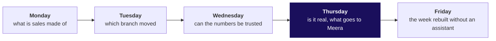
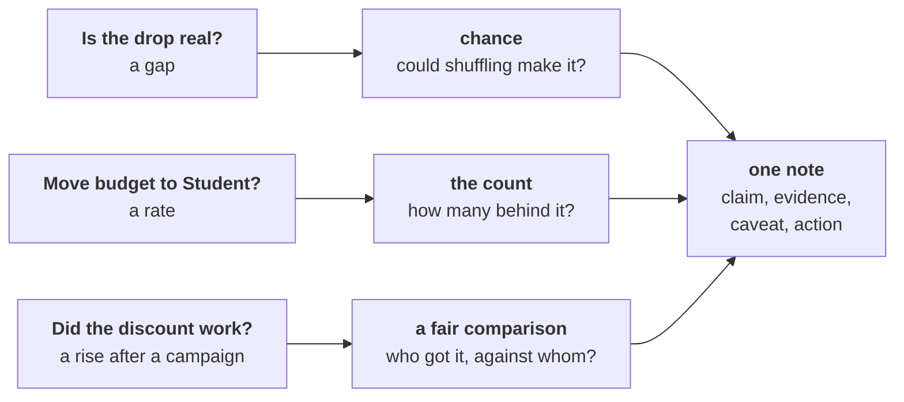

# Real, worth it, and caused

**Week 1, Thursday. Study notes, read after the session.** A gap earns the word real only against
the wobble chance makes, a real gap earns money only against what acting costs, a rate earns trust
only from the count beneath it, and a campaign earns credit only against a fair comparison.
Reading time: about 22 minutes.

---

## What you can now do

1. You can run a shuffle test on two quarters, read its share as a p-value, and check the verdict
   with the textbook test.
2. You can size a real gap per member, for the segment, against the company and against the cost
   of a fix.
3. You can count what a rate stands on, run a coin-flip reference on the count, and call a rate on
   fewer than thirty observations a lead.
4. You can split a campaign's lift by segment and see why a blend rose while every segment fell.
5. You can write Meera's note as claim, evidence, caveat and action, with "not yet" as a complete
   answer.
6. You can ask who got a campaign, who did not and what else changed, and design the hold-back that
   would settle it.

---

## Where this sits

**What the session covered.** Six chapters on one Kalpa case, each worked in full: is the
Retail-Plus fall real, is it worth acting on, what count stands behind Student's 40 percent, did
the monsoon discount work inside each segment, what goes in the note, and what comparison would be
fair at Diwali. Mentioned only: the textbook test's formula, building a confidence interval, power,
and difference in differences, named once. Kalpa Retail's business, its Retail-Plus membership tier
and its metrics are told in the retail domain dossier,
`content/W01/D1/study-notes/C2_W01_D01_domain_retail_STUDENT.md`.

```mermaid
flowchart LR
    M["<b>Monday</b><br/>what is sales made of"] --> T["<b>Tuesday</b><br/>which branch moved"]
    T --> W["<b>Wednesday</b><br/>can the numbers be trusted"]
    W --> H["<b>Thursday</b><br/>is it real, what goes to Meera"]
    H --> F["<b>Friday</b><br/>the week rebuilt without an assistant"]
    classDef today fill:#1A0F5C,stroke:#1A0F5C,color:#FFFFFF
    class H today
```

This week map is the programme's own construction.

**The outcome tie.** Friday's growth-review rehearsal, where you defend a one-page note aloud to
someone playing marketing, is built from today's checks and today's note shape.

**What was left out.** The formulas, building a confidence interval and power (how many members a
test needs to see a gap) arrive in later weeks.

---

## The picture to remember: three checks, one note

```mermaid
flowchart LR
    Q1["<b>Is the drop real?</b><br/>a gap"] --> H1["<b>chance</b><br/>could shuffling make it?"]
    Q2["<b>Move budget to Student?</b><br/>a rate"] --> H2["<b>the count</b><br/>how many behind it?"]
    Q3["<b>Did the discount work?</b><br/>a rise after a campaign"] --> H3["<b>a fair comparison</b><br/>who got it, against whom?"]
    H1 --> N["<b>one note</b><br/>claim, evidence,<br/>caveat, action"]
    H2 --> N
    H3 --> N
```

Each of Meera's questions fails in its own way, so each gets its own check before any number
reaches the note on the right. That note is the running thread: every chapter adds a line to it or
tests one.

**CALLBACK.** Week 1, Monday settled that delivered revenue is the money kept, and that a number
leaves the team with its definition.

---

## Chapter 1: Real, or the usual wobble?

Meera Raghavan, Kalpa's CEO, asked before Monday's growth review: "Retail-Plus is down, smaller than
first reported. Real, or the wobble we see every quarter?" The metric is delivered revenue per
Retail-Plus member per quarter. A real fall opens a retention budget; a wobble read as real spends
it chasing noise.

**IN THE FIELD.** Booking.com runs about 25,000 tests a year and more than 1,000 at once (Thomke,
HBR, 2020), and its teams are "wrong about nine out of ten times" (HBR podcast, 2019), so every
change there is read against chance before anyone acts.

| Option | Sized on this file | Call |
|---|---|---|
| A. Shuffle test | 44 member totals, 5,000 deals in under a second | Best fit |
| B. Textbook test | One call, built for bell shapes; 6 of 44 totals are zero | Second route |
| C. Bootstrap range | Answers how big, chapter 2's question | Later |
| D. Wait for Q3 | One quarter; Monday passes unanswered | If A and B are unclear |

Compute decides nothing at 44 totals; the lumpy file and a reader who can watch ten cards being
dealt decide. The switch: tens of thousands of well-behaved members, where B is the house standard.

**The build.** If the quarter made no difference, the labels are arbitrary, so dealing them at
random builds a chance-only world. On ten invented cards with a real gap of Rs 880, 21 of 1,000
shuffles reached it (0.021), against an exact 6 of 252 deals (0.024). Retail-Core's 34 members fell
from Rs 1,509 to Rs 1,399, a gap of Rs 110 that 1,724 of 5,000 shuffles matched, a share of 0.345:
the usual wobble. Retail-Plus's 22 members fell from Rs 3,279 to Rs 2,169, Rs 1,110 each, and only
135 of 5,000 shuffles matched it, 0.027. Five other seeds give 0.026 to 0.029, and counting rises
too gives 0.050.

**The trap.** "p = 0.03, so there is a 3% chance we are wrong about the drop." Meera would treat the
fall as 97 percent certain. Every shuffle assumed nothing changed, so the share describes that
world; the chance of being wrong depends on what the shuffle never saw. **The check:** of twenty
invented segments where nothing changed, one came back at 0.005. **The fix:** "If nothing had
changed between the quarters, a fall of Rs 1,110 per member or more would turn up in about 3 of
every 100 shuffles, so we treat the Retail-Plus drop as real."

**The second route.** The textbook (Welch) test gives 0.026 for Retail-Plus and 0.350 for
Retail-Core. Switch to it on large, well-behaved data; keep the shuffle for small or lumpy data or
a reader who needs to see how.

**ORIGIN.** Ronald Fisher's The Design of Experiments (1935) is an original reference for testing
by rearranging labels (checked 29 Sep 2026).

> **Kavya's review.** "Retail-Core's third is the baseline, Retail-Plus's 0.03 is the gap against
> it, the textbook test agrees, and your sentence would still be true if the drop were a fluke. Now
> tell me how much money it is."

---

## Chapter 2: Real, and worth acting on?

The head of Retail-Plus asked: "So my tier really is slipping. What do I get to fix it?" Fund an
offer that cannot pay back and the money is gone; ignore a growing fall and the tier drains.

**IN THE FIELD.** A change to how Bing showed ad headlines raised revenue 12 percent, more than 100
million dollars a year in the US (Kohavi and Thomke, HBR, 2017), while only about a third of
Microsoft experiments designed to improve a key metric succeeded (Kohavi and colleagues, 2009).

| Option | What it misses | Call |
|---|---|---|
| A. Rank by p-value | Size: a share says how sure, never how big | The trap |
| B. Size against the segment | The company around it | Partial |
| C. Size against the company and the cost | Nothing, if the cost is known | Best fit |
| D. A bootstrap range | Nothing; it tests the range against the cost | Second route |

The switch: a known recovery rate from an earlier offer, and then C alone decides.

**The build.** Rs 1,110 times 22 members is Rs 24,420 a quarter. The tier fell from Rs 72,130 to Rs
47,710, a third of its money (33.9 percent). The company delivered Rs 1,22,73,410 in Q1 and Rs
1,28,64,680 in Q2, so the fall is 0.19 percent of Q2. Between the quarters Retail-Core moved minus
Rs 3,750, Student plus Rs 980 and Business plus Rs 6,18,460, twenty-five times the Retail-Plus fall.

**The trap.** Shares ranked Retail-Plus 0.027, Retail-Core 0.345, Business 0.555, and the draft
wrote: "Retail-Plus is our biggest problem; fund its retention programme first." **The check** puts
rupees beside every share, and an invented Rs 20 gap shows why: its share was 0.446 on 100 orders,
0.292 on 1,000, 0.076 on 5,000 and 0.002 on 20,000. **The fix** is two sentences: the fall is real,
and it is worth Rs 24,420 a quarter, 0.19 percent of the company, while Business moved Rs 6,18,460.

**The cost.** An assumed offer at Rs 500 per member costs Rs 11,000 a quarter and must win back 45
percent of the fall to break even. Winning back a quarter loses about Rs 4,895; three quarters gains
about Rs 7,315. At an assumed 30 percent margin it needs 150 percent, so it cannot pay back.

**The second route.** Redrawing members 5,000 times puts the middle 95 percent of the fall at Rs 42
to Rs 2,192 per member (Rs 920 to Rs 48,220 a quarter), with 0.021 of redraws at or below zero. The
range, called a confidence interval and built later, dips below the offer's Rs 500, so test on half
the tier. Read a range whenever the decision has a cost to beat.

**WATCH OUT.** A list ranked by p-value has ranked certainty and called it importance.

> **Kavya's review.** "Real, yes, by two routes. Worth Rs 24,420 a quarter, small against Business
> and a third of the tier. The range dips below the offer's cost, so offer it to half, hold back
> half, and measure."

**CALLBACK.** Week 1, Tuesday found Retail-Plus frequency was the branch that moved; today priced it.

---

## Chapter 3: The count behind 40 percent

Meera again: "Student is up 40 percent; should I move budget there?" Move acquisition money on a
rate chance made and it lands on a segment that may be flat next quarter.

**IN THE FIELD.** The Gates Foundation backed small schools partly because they were
over-represented among top performers. Howard Wainer found them at both tails: "we would expect 3%
of small schools" and "we found 12%". By 2001 the Foundation had given about 1.7 billion dollars to
education projects (Wainer, "The Most Dangerous Equation", 2009).

| Option | What it risks | Call |
|---|---|---|
| A. Trust the headline | Money moved on a rate a coin could make | The trap |
| B. Coin-flip reference | Nothing, once the count is found | Best fit |
| C. Under thirty is a lead | Blunt: careful, never how careful | The summary line |
| D. Wait for thirty orders | Time, at the segment's pace | The action |

The switch: a cheap way to buy Student orders fast, such as a small paid test, turns D into a
two-week experiment.

**The build.** For every 100 Q1 orders, Q2 brought Retail-Core 97, Retail-Plus 65, Business 94 and
Student 140. As a leaderboard, Student wins.

**The trap.** "Student is up 40 percent, the fastest on the page: move acquisition budget to
Student." **The check** counts what the rate stands on: a count under thirty. On invented bases, one
extra order moves a rate 10 points on 10 orders and 0.25 on 400. If nothing changed, each order
lands in Q1 or Q2 on a coin flip; across 5,000 worlds, Student's orders made a 40 percent rise in
0.397 of them. Retail-Core's 73 orders did it in 0.086, an invented 400 in under 0.002, and the
chance falls below one in five by thirty orders. **The fix:** "Not yet: watch Student until it
carries thirty orders a quarter before any budget moves."

**The interview version.** Where the true rate is 31 percent for everyone, invented groups of 12
showed 42 percent or more 30.9 percent of the time, while groups of 1,200 landed between 27.7 and
34.8 percent.

**The second route.** Listing every possible deal gives an exact 0.387 against the flips' 0.397.
Count every deal while the list is short; on a few dozen orders it runs into billions and the flips
take over.

**WATCH OUT.** The largest percentage on a page most often sits on the smallest base.

> **Kavya's review.** "Student's rise is real arithmetic on too few orders to act on. Count them,
> say how often chance makes the rise, and give Meera the count that would reopen it."

**CALLBACK.** Monday's first rate carried its numerator and denominator; today the denominator's
size held the rate back.

---

## Chapter 4: The discount, split by segment

Meera, with the marketing lead's report open: "Did the discount work, or did those customers buy
anyway?" The Monsoon Sale gave 15 percent off from 5 to 19 August 2026, aimed at Retail-Plus, and
at that discount orders must rise 17.6 percent just for revenue to stand still.

**IN THE FIELD.** UC Berkeley's 1973 admissions took about 44 percent of 8,442 men and 35 percent of
4,321 women, yet department by department the small bias favoured women (Bickel, Hammel and
O'Connell, Science, 1975). Flipkart's Big Billion Days, 23 to 30 September 2022, passed one billion
customer visits (Walmart, 2022), a number useful only once someone asks whose.

| Option | What it risks | Call |
|---|---|---|
| A. Before and after | Everything else that month changed | Chapter 6 |
| B. Exposed against not, blended | Groups with different mixes | Marketing's |
| C. Exposed against not, per segment | Differences inside a segment | Best fit |
| D. Both groups on one mix | Nothing beyond C | Second route |

It is 160 customers in four cells, and the mixes differ: 50 percent Retail-Plus among the exposed,
40 among the rest. The switch: a group chosen at random, which makes B fair.

**The build.** Rebuild Marketing's number first: exposed customers spent Rs 3,395 in August against
Rs 3,200, a lift of 6.1 percent.

**The trap.** "The discount worked: exposed customers spent Rs 3,395 against Rs 3,200, up 6.1%;
repeat it for Diwali." **The check** splits by segment:

| Segment | Exposed | Spend | Not exposed | Spend |
|---|---|---|---|---|
| Retail-Plus | 30 | Rs 4,850 | 40 | Rs 5,000 |
| Retail-Core | 30 | Rs 1,940 | 60 | Rs 2,000 |

Both segments spent 3.0 percent less with the sale. The blend rose because the exposed group held
more Retail-Plus members, who spend more whatever happens: Simpson's reversal, with segment as the
confounder. **The fix:** "Do not repeat it as designed; if Diwali runs a sale, hold back a random
slice of each segment."

**The second route.** On the unexposed group's mix the exposed spend Rs 3,104 against Rs 3,200; on
the exposed mix the unexposed spend Rs 3,500 against Rs 3,395. Both are 3.0 percent less. Use one
mix when the answer must fit one line; show the split when the reader takes a table.

**ORIGIN.** Edward Simpson described the reversal in the Journal of the Royal Statistical Society,
Series B, 1951 (checked 29 Sep 2026).

> **Kavya's review.** "You rebuilt Marketing's number before disagreeing with it. The split says 3
> percent less in both segments, one mix agrees, and the reason is who got the sale. Now tell me what
> else changed in August."

**CALLBACK.** Tuesday separated a change in mix from a change in rate; this is that split again.

---

## Chapter 5: The note that may say not yet

Meera's terms: "One page, two minutes. If the honest answer is 'we do not know yet', say so and tell
me what would tell us." A line that loses its base sends money the wrong way; a line that hedges
everything leaves her nothing to decide.

**IN THE FIELD.** "We don't do PowerPoint (or any other slide-oriented) presentations at Amazon.
Instead, we write narratively structured six-page memos" (Jeff Bezos, 2017 letter to shareholders).

| Option | What it risks | Call |
|---|---|---|
| A. Yes or no per question | Every caveat | Too thin |
| B. The dashboard | No decision on the page | Too much |
| C. Four-part note, under 200 words | Only the discipline | Best fit |
| D. A slide deck | Logic lives in the talk | A meeting |

The switch: a standing weekly review of the same metrics, where a dashboard with fixed bases wins
and the note covers what moved.

**The trap.** "Retail-Plus revenue fell 34%. Student is up 40%. The monsoon sale lifted revenue 6%.
We recommend a retention offer for Retail-Plus, budget to Student, and the sale again for Diwali."
Three true numbers lead to three wrong decisions. **The check** audits each line for a base, a
count or chance, and a caveat: 9 of 9 cells are empty. **The fix**, about 170 words, is the model
note from the escalated case:

> **Claim.** Retail-Plus really is spending less, and it is small against the company; Student is
> too thin to fund yet; the monsoon sale did not work as designed.
>
> **Evidence.** Retail-Plus members delivered Rs 1,110 less each in Q2; chance makes a fall that
> large in about 3 of 100 shuffles. It is Rs 24,420 a quarter, 0.19 percent of delivered revenue.
> Student's 40 percent rise stands on under thirty orders, and coin flips make it in four worlds of
> ten. The sale's 6 percent is a blend: inside Retail-Plus and Retail-Core, exposed customers spent
> 3 percent less.
>
> **Caveat.** The sale went mostly to Retail-Plus, who spend more anyway, and the exposure table
> gives one August figure per group, so we cannot see the spread.
>
> **Action.** Test a retention offer on half of Retail-Plus; watch Student until thirty orders a
> quarter; do not repeat the sale as designed, and hold back a random slice of each segment at
> Diwali.

The caveat is the part a hurried analyst drops and the part a CEO keeps them for.

**The second route.** Trace every figure in the note to a computed number: 10 of 10 traced. Trace by
hand for a one-off; generate the note from the numbers when it repeats weekly.

> **Kavya's review.** "Three answers, each with its base, its caveat and a cost, and two say not yet
> with what would change them. Marketing will push on the third on Monday."

---

## Chapter 6: The fair comparison

The marketing lead replied: "Diwali is five weeks away. I want the monsoon sale again, and I want it
for more of the base." A sale at 15 percent off either makes money or gives margin to customers who
would have bought anyway.

**IN THE FIELD.** eBay's paid search test found brand-keyword ads had "no measurable short-term
benefits", since "almost all of the forgone click traffic and attributed sales were captured by
natural search" (Blake, Nosko and Tadelis, NBER Working Paper 20171).

| Option | What it assumes | Call |
|---|---|---|
| A. Before and after | Nothing else changed | The trap |
| B. The change beside the change | Both segments move alike | A lead |
| C. Inside each segment | Exposure random within segment | Today's evidence |
| D. Random hold-back | Nothing; a coin decides | Best for Diwali |

The switch: a forgone lift running into lakhs makes B, on a long run of months, the working answer.

**The build.** The sale was aimed at Retail-Plus and went to 30 Retail-Plus and 30 Retail-Core
customers. A rule chose them, never a coin.

**The trap.** "Retail-Plus delivered Rs 25,060 in August against Rs 9,280 in July, up 170%: the
monsoon sale worked, so run it for more of the base at Diwali." **The check** asks what else
changed: Retail-Core rose 73 percent over the same months (Rs 13,320 to Rs 23,090) with no sale
aimed at it, and Retail-Plus fell 58 percent from May to June with no sale. **The fix** compares
August's share of each quarter: 52.5 percent for Retail-Plus, 48.6 for Retail-Core, and chance gives
Retail-Plus that share in 0.059 of deals. The months cannot separate the sale from a busy August.

**The design.** Before the sale, a coin holds back a random fifth inside each segment, 14 of 70
Retail-Plus customers. At Marketing's own 6 percent that forgoes about Rs 4,200, the price of
knowing.

**The second route.** Chapter 4's split found 3.0 percent less in both segments. Both routes find no
lift the sale can claim: the months say cannot tell, the split says 3 percent less. Use the months
when no exposure table exists and the hold-back whenever the next campaign can still be designed.

**At depth.** Option B is a difference in differences: Retail-Plus moved plus Rs 15,780, Retail-Core
plus Rs 9,770, a difference of Rs 6,010 on 13 orders. A lead, never an answer.

> **Kavya's review.** "Who got it: a rule, never a coin. Two routes find no lift, and you priced the
> test that would settle it at about Rs 4,200. Take that to Marketing as an offer."

---

## Where this shows up in the work

**A dashboard that turns red.** Ask how big the ordinary weekly swings are before sizing a drop.
**A league table of stores or products.** The count behind each rate decides whether the ranking
means anything. **A campaign review before a budget renewal.** Ask who got it, whether the lift
holds inside each segment, and what else changed.

---

## Try this yourself

Pick a letter, then check the key.

1. A shuffle test returns 0.04. Which is right? a) there is a 4 percent chance that the fall in
   spending is not real; b) the fall is 96 percent certain; c) with no change, this fall turns up
   in about 4 of 100 shuffles; d) the fall is 4 percent of revenue.
2. A rate rose 50 percent on eight orders. The note says: a) move budget now, since 50 percent is
   the largest rise; b) a lead, and the count that would make it a finding; c) nothing, since small
   counts are errors; d) the rate is wrong.
3. Every segment spent less with a coupon and the blend rose. Likeliest reason: a) a bug in the
   blend; b) the coupon worked overall; c) the segments were counted twice in the blend; d) the
   coupon went mostly to higher spenders.
4. A targeted and an untargeted segment both jumped in the sale month. The jump shows: a) the sale
   worked, since the targeted segment jumped; b) a spillover; c) nothing the sale can claim yet;
   d) a mislabelled segment.

Key: 1c 2b 3d 4c. A miss sends you back to the trap in chapter 1, 3, 4 or 6.

---

## Where this gets tested

**[S] How do you know whether a change in a metric is significant?** "I build a reference for what
chance alone does: pool the two periods, deal the labels at random thousands of times, and count
how often the shuffled gap matches the real one. Retail-Core's came back one in three, Retail-Plus's
about 3 in 100. Then I check the count and size it in money."

**[S] Explain a finding to a non-technical stakeholder.** "The decision first, in one sentence with
one number and its base, then the evidence, the caveat that would change my view, and the action
with its cost: Retail-Plus is spending about Rs 24,000 a quarter less, a fifth of one percent of the
company, so test an offer on half the members."

**[S] What does p = 0.03 mean, and not mean?** "If there were no real difference, a gap this large
would turn up about 3 times in 100 by chance. It never means a 3 percent chance we are wrong, and it
says nothing about size."

**[F] 42 percent on 12 users against 31 percent on 1,200; which do you trust?** "The 31 percent. One
user of 12 is 8.3 points, and at a true 31 percent groups of 12 show 42 or more about a third of the
time. The 42 is a lead to measure on more users."

**[F] Revenue rose after a discount; did the campaign work, and what would you need to know?** "Who
got it, who did not, and what else changed. I reproduce the lift, split by segment, and look at an
untargeted segment over the same months; next time, a random hold-back agreed in advance."

**[D] The CEO wants a yes or no and the honest answer is 'not yet'; what do you say, and how do you
hold the line when marketing pushes?** "Not yet, and here is what would tell us by when: a held-back
slice of each segment at Diwali. I hold the line with evidence, never authority: their number
reproduced, then the segments, and an invitation to find the flaw."

**[F] A metric moved and the test says significant; how do you decide to act?** "Size it against
the company and the cost: Rs 24,420 against an Rs 11,000 offer needs 45 percent back, and the range
dips below the cost, so a held-back test comes before a rollout."

**[F] The campaign lifted overall but every segment fell; which do you report?** "The segments, with
the mix named as why the blend rose."

**[F] How would you set up Diwali so you can tell?** "A coin inside each segment holds back a fifth
before the sale, with the measure fixed in advance; at the claimed lift it costs about Rs 4,200."

**[S] What is a confounder?** "Something that differs between groups and moves the outcome on its
own: the sale went to more high-spending Retail-Plus members."

**[D] Marketing says your split is cherry-picking.** "Segment was fixed before looking because it
is how the sale was targeted, one mix agrees, and I will run any cut they name in advance."

**[D] Chapter 1: shuffle, textbook test or wait a quarter?** "The shuffle on a few dozen lumpy
totals, checked by the textbook test, which becomes the default at scale; wait only if both are
unclear."

**[D] Chapter 2: rank by p-value, by rupees, or by rupees against cost?** "Rupees against cost; a
known recovery rate would let break-even decide alone."

**[D] Chapter 3: trust the rise, test the count, or wait?** "Test the count; a cheap source of
orders would turn waiting into an experiment."

**[D] Chapter 4: before and after, blend, split or one mix?** "The split, with one mix as its one
line; the blend only after a coin."

**[D] Chapter 5: yes or no, dashboard or note?** "The note; a dashboard once the review is weekly."

**[D] Chapter 6: which comparison would you defend to a CFO?** "The hold-back; the change beside
the change over many months when a hold-back is impossible, its assumption said aloud."

---

## Six lines worth keeping

One line per chapter; the same six close the afternoon deck and head the cheat sheet, word for word.

1. A p-value is a share of chance-only worlds; it is never the chance the finding is wrong.
2. Real and worth acting on are two separate calls: the shuffle answers the first, rupees against cost answer the second.
3. Count what a rate stands on before you repeat it; under thirty, it is a lead.
4. Split an aggregate by segment before you credit a campaign, and name who got it.
5. The note is claim, evidence, caveat, action, and "not yet, and here is what would tell us" is a complete answer.
6. A fair comparison asks who got it, who did not, and what else changed; only a coin makes the two groups alike.

---

## Coming next

Friday is the AI-free lab and the growth-review rehearsal: the week rebuilt alone and the note
defended aloud. In Week 2 a hold-back becomes a SQL query.

---

## Glossary

| Term | What it means here | Where it appeared | Example |
|---|---|---|---|
| Label shuffle | Dealing labels at random to build a chance-only world | Chapter 1 | 21 of 1,000 at Rs 880 |
| p-value | Share of chance-only worlds with a gap at least as large | Chapter 1 | 0.027 for Retail-Plus |
| Break-even recovery | Share of a fall a fix must win back | Chapter 2 | 45 percent |
| Confidence interval | The range of sizes the data supports | Chapter 2 | Rs 42 to Rs 2,192 |
| Lead | A rate on under thirty observations | Chapter 3 | Student's 40 percent |
| Confounder | Drives both who got a campaign and the outcome | Chapters 4 and 6 | Segment |
| Simpson's reversal | One way in every group, the other in the blend | Chapter 4 | Up 6.1, down 3.0 |
| Held-back group | A random slice that does not get the campaign | Chapter 6 | 14 of 70 |

---

## Go deeper

| Order | What | Time | Why |
|---|---|---|---|
| 1 | Seeing Theory, https://seeing-theory.brown.edu/frequentist-inference/index.html (verified 29 Sep 2026) | 25 minutes | Today's shuffles, drawn |
| 2 | StatQuest, hypothesis testing and p-values, https://statquest.org/video_index.html (verified 29 Sep 2026) | 30 minutes | The p-value sentence, slowly |
| 3 | Chapter 1: https://hbr.org/2020/03/building-a-culture-of-experimentation (checked 30 September 2026) | 20 minutes | Booking.com's tests |
| 4 | Chapter 1: https://hbr.org/podcast/2019/09/at-booking-com-innovation-means-constant-failure (checked 30 September 2026) | One episode | Nine in ten wrong |
| 5 | Chapter 2: https://hbr.org/2017/09/the-surprising-power-of-online-experiments (checked 30 September 2026) | 20 minutes | Bing's headline change |
| 6 | Chapter 2: https://ai.stanford.edu/~ronnyk/ExPThinkWeek2009Public.pdf (checked 30 September 2026) | 30 minutes | A third succeed |
| 7 | Chapter 3: https://assets.press.princeton.edu/chapters/s8863.pdf (checked 30 September 2026) | 30 minutes | Small counts swing |
| 8 | Chapter 4: https://www.refsmmat.com/posts/2016-05-08-simpsons-paradox-berkeley.html (checked 30 September 2026) | 15 minutes | Berkeley's reversal |
| 9 | Chapter 4: https://corporate.walmart.com/news/2022/10/25/ahead-of-the-u-s-holidays-indias-shoppers-and-sellers-go-big (checked 30 September 2026) | 5 minutes | Big Billion Days |
| 10 | Chapter 5: https://www.aboutamazon.com/news/company-news/2017-letter-to-shareholders (checked 30 September 2026) | 15 minutes | Memos over slides |
| 11 | Chapter 6: https://www.nber.org/papers/w20171 (checked 30 September 2026) | 40 minutes | eBay's search test |
