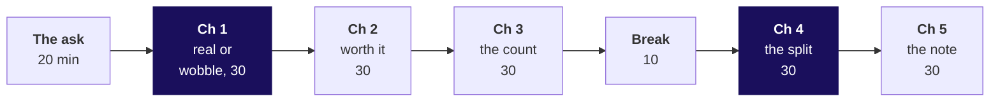
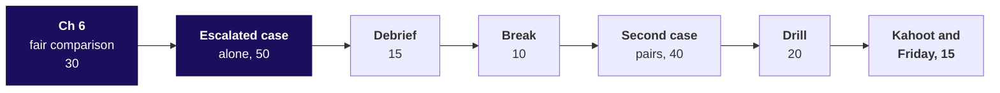

# Day sheet, Week 1 Thursday: is the Retail-Plus fall real, is Student's 40 percent worth budget, and did the monsoon sale work?

**TRAINER ONLY.** Nothing on this page reaches a learner.

Posts to <!-- sync:module:W01/D4 -->Module 1: Foundations of AI and Data<!-- /sync:module:W01/D4 -->, on <!-- sync:day-date:W01/D4 -->Thu 08 Oct 2026<!-- /sync:day-date:W01/D4 -->.

Built from the approved Weeks 1 and 2 spine (`docs/detailing/W01_W02_spine.md`, Thursday), raised to
the chapter standard and to the question ladder of 30 September 2026, and the Thursday row of
`docs/curriculum/W1_Data_analysis_found.md`. Data: client zero v3, generated by
`data/generate_client_zero.py`. Kalpa Retail's business, its membership tier and its metrics are
told once, on Monday, in the retail domain dossier
(`content/W01/D1/study-notes/C2_W01_D01_domain_retail_STUDENT.md`); today links to it and never
retells it.

## Which questions does the day ask, in the order the trainer asks them?

The day's question, in Meera Raghavan's words: **is the Retail-Plus fall real, is Student's 40
percent worth budget, and did the monsoon sale work?** Ask each question below before its answer is
shown; each chapter's map slide lists its six smaller questions, and its last slide answers them.

| Part | Its question | The smaller questions, in order |
|---|---|---|
| The ask | Which check does each of Meera's three questions need? | What exactly is Meera asking? Which check does each claim need? What goes in the note, in which order? What has the week already settled? |
| Chapter 1 | Is the Retail-Plus fall real, or the wobble Kalpa sees every quarter? | Which of four ways to ask "is it real?" fits 22 members measured twice? How often do coin tosses on five members' cards make a gap of Rs 880? What does the usual wobble look like on Retail-Core? How often does chance alone make a fall as large as Retail-Plus's? What does the share say about the chance that the finding is wrong? Do the textbook paired test and an exact count of every coin pattern give the flips' reading? |
| Chapter 2 | The fall edges past chance: is it big enough, in rupees against what a fix costs, to act on? | Which of four ways to answer "worth acting on?" can Monday use? How much is the fall in rupees, per member and for the tier? How big is the fall against the company's quarter? Should the smallest share open the growth review? What must a Rs 500 retention offer win back to pay for itself? How small could the fall really be? |
| Chapter 3 | Student is up 40 percent, the fastest rise on the page: how many customers stand behind it, and should budget move there? | Which of four ways to answer "should budget follow the 40 percent?" fits Monday? Which segment's orders rose fastest from Q1 to Q2? Should acquisition budget move to the fastest riser? How often does chance alone make a 40 percent rise on Student's count? Which do you trust, 42 percent on 12 users or 31 percent on 1,200? Do an exact count of every split between the quarters, and real Retail-Core orders, give the flips' share? |
| Chapter 4 | Marketing says the monsoon sale lifted revenue 6 percent: did the discount work, or did those customers buy anyway? | Which of four ways to answer "did the discount work?" can the files support? Does Marketing's 6 percent rebuild from the same tables? Should the reproduced lift send the sale to Diwali? What does the comparison show inside each segment? What does the note tell Meera about the discount? Put on the same segment mix, do the two groups still differ, and what can that check catch? |
| Chapter 5 | Three answers are in: what goes on Meera's one page, and when is "not yet" the honest answer? | Which of four ways to answer Meera in writing fits two minutes? What must sit beside each of the day's numbers before it goes in a sentence? What goes wrong when each number is written the way it first appeared? How does the Retail-Plus line survive an audit? When is "not yet" an answer Meera can use? Do the note's decisions follow from its numbers? |
| Chapter 6 | Marketing wants the sale again for more of the base: who got it, what else changed, and what would settle it at Diwali? | Which of four ways to ask "did the sale cause it?" can the files answer? Who got the monsoon sale? Does August against July show the sale worked? What else changed in August? How would a hold-back at Diwali be designed and priced? Does the month-share test, run on Q1's months with no sale, find gaps as large as August's? |
| The escalated case | Can you answer Meera's three questions alone in fifty minutes, and ship a note under 200 words that survives Marketing? | Is the Retail-Plus fall larger than the wobble chance makes, counted in both directions? How big is the fall against the company's quarter, and who gets the first test of the offer? How many orders stand behind Student's 40 percent, and how often does chance make the rise? Did the monsoon sale lift spend, and for whom? How many customers does the Diwali hold-back keep out, and what does the note say? |
| The debrief | Which lines did the room get wrong this afternoon, which chapter's trap made each, and what replaces it? | Which chapter's trap made each wrong line? Which discount line survives review? |
| The second case | Marketing calls the segment split cherry-picking and brings Rs 4,850 against Rs 3,200: is their comparison fair, and how do you hold the line? | Can you make Marketing's Rs 4,850 and Rs 3,200 appear from the platform's list? Who sits in each of Marketing's two groups, and what else differs between them? Compared like for like, how do exposed and unexposed customers differ, and how many stand behind each? If the list's August spend is at list price, what did the exposed pay Kalpa, and what would a Diwali hold-back cost? |
| The drill | Can you answer each of the day's interview questions in sixty seconds, claim first and caveat said? | The six staples, then the six follow-ups, the design question among them |
| The close | Is the Retail-Plus fall real, is Student's 40 percent worth budget, and did the monsoon sale work? | Which line from each chapter is worth keeping? What does Friday ask? |

**The day's answer, said at the afternoon deck's close (S27), read only after three learners have
read theirs.** "Retail-Plus is down by a borderline amount, worth watching and small against the
quarter; Student is too thin to fund yet; and the monsoon sale did not work as designed, so test
Diwali against a held-back group before repeating it."

---

## What does the day start from, and where does it stop?

| | |
|---|---|
| **Start from** | The cleaned two quarters from Wednesday. The day starts from the ideas, with no test catalogue and no formulas, and the hand tosses of five members' cards come before the loop in code. |
| **Go as far as** | Everyone picks the chance reference the design calls for, states a share in the sentence form with both directions beside it, sizes a borderline gap in rupees against cost, puts a count of customers beside every rate, splits a campaign by segment, asks who got it, who did not and what else changed, and ships the one-page note with all three answers. Every chapter names its options, its best-fit call and a second route. |
| **Stop before** | The t-test family's formulas (the textbook paired test appears as one library call, a second opinion), confidence-interval construction (the bootstrap range is drawn and named), power, multiple-testing corrections, chart libraries. Name each as later, once. |
| **Comes later** | Friday rebuilds the week alone and rehearses the note against Marketing. Week 2 joins the campaigns table in SQL and pandas, and its tentative IITGN faculty blocks cover statistical inference formally. Week 4 designs the metric the plan chases. |
| **Cut first** | The second route in chapter 2 (morning S37) to its verdict, then chapter 1's second route (S23) to one sentence, then S56 to its eBay card. Never the hand tosses, the split by segment, the audit of the note, or the hold-back design. |

---

## How does the morning's 180 minutes run?

| Part | Slides (morning deck) | Beside it | What must land | If short of time |
|---|---|---|---|---|
| The ask, 20 | Cover, S1 to S6 | The board's first drawing | The day's question and its six chapter questions (S1); three questions sorted into chance, the count and a fair comparison; the note's four parts drawn | S6 to one sentence |
| Chapter 1, 30 | SECTION 1, S7 to S24 | Notebook 1; `guided/C2_W01_D04_ten_cards_STUDENT.md`; the companion's walk | The map (S7); the options sized by design, and the call: the same 22 members twice, so flip each pair; the hand tosses (never cut); the flip as code (S16); Retail-Core as the wobble; the room's Retail-Plus run with both directions (S18, S19); the trap and its rewrite; the close answering all six (S24) | S23 to one sentence |
| Chapter 2, 30 | SECTION 2, S25 to S38 | Notebook 2 | Borderline and worth acting on as two sentences; the fall in rupees and against the company; the review ranked by money; the 45 percent break-even; the range's low end far below the offer: worth watching, and not worth acting on alone | S37 to its verdict |
| Chapter 3, 30 | SECTION 3, S39 to S53 | Notebook 3 | The count found by the room in the empty cell (S47), in orders and in customers, never on a slide; the coin-flip share (S48, S49); the rule of thumb in customers; the 42 against 31 pair | S52 to one sentence |
| Break, 10 | After S53 | | | |
| Chapter 4, 30 | SECTION 4, S54 to S66 | Notebook 4 | Marketing's number reproduced first; what the platform's list is (S58); the invented two stores; the room's split (S62) and its result (S63); the fix; one mix as the second route, and what it can and cannot check | S56 to its eBay card |
| Chapter 5, 30 | SECTION 5, S67 to S79 | Notebook 5 | Each number's partner; the headline note audited nine of nine missing; the Retail-Plus line built together; the audit's logic; "not yet" with what would turn it; the rules route reaching the note's decisions | S69 read aloud only |

D80 stays self-study. Each chapter's set (`exercises/unguided/C2_W01_D04_ch{n}_*_STUDENT.md`) runs
its items 1 and 2 live in the chapter's last three minutes; the remaining items are the practice
lab's stretch or tonight's work. Every set carries three design items, and each solution file marks
every item's kind.

## Which checkpoint question follows each chapter?

One learner each, under thirty seconds. After chapter 1: the Retail-Plus sentence in the form that
survives Kavya, with both directions. After chapter 2: how big is the fall against the company, and
what must the offer win back? After chapter 3: what goes beside every rate you repeat, and why does
the rule count customers? After chapter 4: why can the blend rise while both segments fall? After
chapter 5: what turns "not yet" into an answer?

---

## How does the afternoon's 180 minutes run?

| Part | Slides (afternoon deck) | Beside it | What must land | If short of time |
|---|---|---|---|---|
| Chapter 6, 30 | Cover, S1, SECTION 6, S2 to S15 | Notebook 6 | The morning's five answers (S1); who got it (a rule chose them, and no coin); August against July as the trap; Retail-Core beside it; the month test as code (S12); the same test on Q1's quiet months; the hold-back designed and priced on the platform's list, with the two lists met head-on (S13) | S14 to its chart and one sentence |
| Escalated case, 50 | SECTION 7, S16 to S17 | `unguided/C2_W01_D04_escalated_STUDENT.md`; notebook ex1 | Every learner ships a note under 200 words, with both directions beside the Retail-Plus share and the hold-back sized on the platform's list | Nothing; start on time |
| Debrief, 15 | SECTION 8, S18 to S20 | The room's own part 4 and part 5 answers | The room's wrong lines fixed aloud; the discount line that survives review | S19 and S20 to one reading |
| Break, 10 | | | | |
| Second case, 40 | SECTION 9, S21 to S23a (S23a only after the pairs' replies) | `unguided/C2_W01_D04_pushback_STUDENT.md`; notebook ex2 | Marketing's numbers reproduced, the mismatch named, like for like rebuilt with its counts, the list-price question asked, the reply spoken with the hold-back offered | S23a to its Kavya line |
| Interview drill, 20 | SECTION 10, S24 to S26 | This sheet's answers | Sixty seconds per question, scored on the note's four parts, the design question among them | The last two follow-ups |
| Kahoot and Friday, 15 | SECTION 11, S27 to S30 | `kahoot/C2_W01_D04_quiz_STUDENT.md` | Three learners read their sentence to Meera before S27 answers the day's question; the six crux lines read together; Friday left open | S27 read by the trainer alone |

**Which letters are keys?** The escalated case `bcbadcbadbac`, the second case `bcdabdab`. The
chapter sets: chapter 1 `bdcacb`, chapter 2 `accbda`, chapter 3 `badccb`, chapter 4 `cabdba`,
chapter 5 `bacdcdb`, chapter 6 `babbcdc`. The practice lab: problems 1 and 2 `bacdcbd`, problem 3
`cabdb`. Reasons for every letter are in `exercises/solutions/`.

---

## Which options, call and second route does each chapter take?

| Chapter | Options | Best-fit call, and what would change it | Second route |
|---|---|---|---|
| 1. Real, or the wobble? | Flip each member's pair, pool and shuffle, textbook paired test, wait | Flips: the same 22 members measured twice, 8 of 44 totals zero, explainable with cards; the label shuffle for different customers, the textbook paired call at scale | Every coin pattern and the textbook paired test: 0.027 one way and 0.055 either way, beside the flips' 0.029 and 0.057 |
| 2. Worth acting on? | Break-even on the estimate, the range's low end, a half-tier test, a past offer's rate | Break-even for Monday, with the range as its check; a measured recovery rate would let break-even decide alone | Bootstrap on the members' own differences: about Rs 80 to Rs 2,160 a member, 0.016 at or below zero |
| 3. How many behind 40%? | Trust, coin flips on the count, rule of thumb in customers, wait for thirty customers | Coin flips said with the rule; a cheap paid test for students would turn waiting into an experiment | Every deal counted exactly: 0.387 against the flips' 0.397; Student-sized handfuls of Retail-Core's orders 0.344 |
| 4. Did the discount work? | Before and after, blended, inside each segment, one mix | Inside each segment; a coin-chosen group would make the blend fair | One mix, both ways: 3.0 percent less, which checks the explanation and cannot catch an error in the four cells |
| 5. What goes on the page? | Yes or no, dashboard, four-part note, deck | Four-part note under 200 words; a standing weekly review would favour a fixed dashboard | The day's rules applied to the numbers reach all 3 of the note's decisions; its 11 figures trace, 11 of 11 |
| 6. What would settle it? | Before and after, change beside the change, inside each segment, hold-back | Hold-back for Diwali, the split as today's evidence; a hold-back refused, or one running into lakhs, would push to months of B | The same test on Q1's months, with no sale: gaps of 4, 22 and 26 points against August's 4 |

---

## Which trap prints which wrong number, and what catches it?

| Chapter | The plausible wrong answer, exactly | The decision it would mislead | The check that catches it | The fix and what it changes |
|---|---|---|---|---|
| 1 | "p = 0.03, so there is a 3% chance we are wrong about the drop." | Meera treats the fall as 97 percent certain | In which world was the share counted? Twenty invented no-change segments: one comes back at 0.003 | "If nothing had changed, a fall of Rs 1,110 per member or more would turn up in about 3 of every 100 flips, and a move that large either way in about 6; the question came after the fall was seen, so we read it as borderline." The numbers stay 0.029 and 0.057; the claim shrinks |
| 2 | Ranked by the share counted either way, Retail-Plus 0.057, Retail-Core 0.723, Business 0.910: "Retail-Plus is the surest move of the quarter, so it opens the growth review: fund its retention programme first." | The review opens on a borderline fall and funds a programme because a share was small, before its scale or cost was asked | Rupees beside the share: ordered by rupees moved, Business opens the review and Retail-Plus comes second; an invented Rs 20 gap goes from 0.43 to 0.002 on sample size alone | Two sentences: borderline against chance, and Rs 24,420 a quarter, 0.19 percent of the company. The fall is judged on its own terms against the offer's cost, so Business's rise does not shrink it: the Rs 500-a-member offer goes to a coin-chosen half (Rs 5,500 a quarter), since for all 22 (Rs 11,000) it pays only above 45 percent recovery; eleven a side shows only a large recovery |
| 3 | "Student is up 40 percent, the fastest on the page: move acquisition budget to Student." | Budget moves to a segment whose rise is a coin flip | Count what the rate stands on, orders and customers (the empty cell); coin flips make the rise in 0.397 of worlds on Student's count, 0.086 on Retail-Core's | "Not yet: no budget moves until more customers buy, thirty or more behind the rise." Budget moves nowhere |
| 4 | "The discount worked: exposed customers spent Rs 3,395 against Rs 3,200, up 6.1%; repeat it for Diwali." | The sale repeated for Diwali at 15 percent off | Split by segment: Retail-Plus Rs 4,850 against Rs 5,000, Retail-Core Rs 1,940 against Rs 2,000, both 3.0 percent less; the exposed group is 50 percent Retail-Plus against 40 | "Do not repeat it as designed; hold back a random slice of each segment." One mix gives Rs 3,104 against Rs 3,200 |
| 5 | "Retail-Plus revenue fell 34%. Student is up 40%. The monsoon sale lifted revenue 6%." with a retention offer, budget to Student and the sale again | Three wrong decisions from three true numbers | The audit: base, count or chance, caveat per line; nine of nine missing | The four-part note, 193 words in notebook 5 and 190 in the escalated case's model, every line passing the audit |
| 6 | "Retail-Plus delivered Rs 25,060 in August against Rs 9,280 in July, up 170%: the monsoon sale worked, so run it for more of the base at Diwali." | The sale widened on a jump that belongs to the month | Retail-Core, the segment not aimed at, rose 73 percent the same month (the platform's list shows some Retail-Core customers got the sale, so it is an imperfect comparison, and a trainer should say so); Retail-Plus fell 58 percent May to June with no sale; July stands on 4 orders | August's share of the quarter: 52.5 against 48.6 percent; a label shuffle makes the gap in about 8 deals in 10 either way and 4 in 10 in Marketing's direction; Q1's quiet months show gaps of 4, 22 and 26 points; the hold-back at Diwali, about Rs 4,200 at Marketing's own lift on the platform's list and too small to size a 6 percent lift |
| Second case | "Exposed Retail-Plus members spent Rs 4,850, far above the Rs 3,200 our unexposed customers averaged." | Marketing wins the room with a correct number on an unfair comparison | Who sits in each group: 30 exposed Retail-Plus against 100 unexposed, 60 of them Retail-Core | Like for like, 3.0 percent less on 30 and 40 customers; at list price the exposed paid Kalpa 9.8 percent less per customer; one in five of each segment held back at Diwali, 14 and 18 customers, about Rs 6,360 at Marketing's lift |

A syntax or runtime error met on the way gets two minutes and the last line of its trace: the usual
one today is a `NameError` from an unrun helper cell, fixed by Restart and Run All. A chapter 1
notebook that cannot import `scipy` needs `pip install scipy`; the Codespace's setup installs it with
scikit-learn.

---

## Which real company does each chapter name, and on what fact?

Every fact below was checked on 30 September 2026; the links are in the provenance and the study
notes.

| Chapter | Company | The fact used |
|---|---|---|
| 1 | Booking.com | About 25,000 tests a year and more than 1,000 at once; about nine in ten experiments improve nothing (Thomke, HBR, 2020, and HBR podcast, 2019) |
| 2 | Microsoft Bing | An ad-headline change lifted revenue 12 percent, over 100 million dollars a year in the US; about a third of experiments improved their metric |
| 3 | The Gates Foundation, via Howard Wainer | Small schools over-represented at both tails; about 1.7 billion dollars to education projects by 2001 |
| 4 | eBay; UC Berkeley | New and infrequent users bought more after a search ad while frequent users, who took most of the spend, did not (NBER 20171); Berkeley 1973, 44 against 35 percent admitted, reversing by department |
| 5 | Amazon | Six-page narrative memos read in silence in place of slides (Bezos, 2017 letter) |
| 6 | eBay | Brand-keyword ads had no measurable short-term benefit; frequent buyers who would buy anyway took most ad spend (NBER 20171) |

---

## What is planted, and what do you do if nobody finds it?

No learner file names the Student count, and no slide states the Retail-Plus verdict, the Student
share or the segment reversal before the room computes it: the map slides ask the questions without
their numbers, the numbers appear from S19, S49 and S63 on, and the room finds each plant in its own
run.

| Planted (client zero v3) | Where it is | What the room should do | If nobody finds it |
|---|---|---|---|
| Student holds exactly 12 orders, 5 in Q1 and 7 in Q2, from 2 customers | `C2_W01_D04_orders_STUDENT.csv`, segment Student | Run the empty cell in notebook 3 (morning S47) and say the count aloud next to the 40 percent, in orders and in customers | Ask: "How many orders is 40 percent of, and how many customers placed them?" Do not say the numbers |
| The Retail-Plus gap is borderline and modest | The same file, Retail-Plus, delivered revenue per member | Flip each member's pair: 145 of 5,000 flips counting falls (0.029) and 286 either way (0.057), then size it at Rs 24,420 a quarter, 0.19 percent of the company | Ask for the rupees before anyone mentions the share |
| The monsoon sale lifts the blend 6.1 percent while every segment fell 3 percent, because the exposed group skews to Retail-Plus | `C2_W01_D04_exposure_STUDENT.csv` and `C2_W01_D04_campaigns_STUDENT.csv` | Split by segment in notebook 4 (morning S62) and name who got the discount | Point at the options cell's mix chart and ask what it does to a blend |

**What is the exposure table, if a learner presses?** It is the campaign platform's August list:
160 customers, C-6000 to C-6159, under the platform's own ids, a separate population from Finance's
order file (whose customers run C-2000 to C-5003). It records who received the sale, whatever the
sale was aimed at, which is why it holds 30 Retail-Core customers although `campaigns.csv` targets
Retail-Plus: the campaigns table is the plan, the list is what the platform sent. That story is this
pack's own reading, logged in the provenance's invented list for a client zero v2.3 note; say it as
the pack's reading if a learner presses on it. The retention offer is sized on Finance's 22
Retail-Plus members and the hold-back on the platform's 70.

If a learner asks whether the data is rigged, answer with the question back: "What would you check?"

**What is planted in the take-home's file?** `C2_W01_D04_takehome_STUDENT.csv` is Wednesday's
take-home export (client zero v2, second sample), copied unchanged; the brief says so and starts
each learner from their Wednesday decisions log. Its plants, named only here: the header row pasted
in as the 45th body line (line 46 of the file); an amount of -2,400 on KR-02018, a refund posted as a
delivered order; a date in the other format on KR-02030 (12/05/2026); an empty status on KR-02052;
and six duplicated order ids (KR-02004, KR-02009, KR-02022, KR-02037, KR-02061, KR-02070). Cleaned:
90 orders, 59 delivered with a positive amount, 50 of them in Retail-Core and Retail-Plus, 12 of
those with a missing discount. Discounted baskets Rs 2,311 on 22 orders from 20 customers against
Rs 2,336 on 16 from 15 with a discount of zero; the label shuffle gives 0.54 overall, 0.52 in
Retail-Core and 0.59 in Retail-Plus in the claim's direction, and 0.94, 0.99 and 0.81 either way: no
sign that discounts grow baskets, on counts under thirty customers.

**What does Monday's sample carry into the practice lab?** `C2_W01_D04_monday_sample_STUDENT.py` is
Monday's take-home sample (client zero v0, second sample). Its plants stay Monday's: two Business
orders of Rs 3,12,000 and Rs 2,05,000 (excluded by problem 3's first choice) and the amount stored as
the text "1990" (converts cleanly with `int()`). Problem 3 runs the label shuffle, since the two
tiers' baskets are different customers' orders.

---

## Which numbers must the trainer know by heart?

| Measure | Value |
|---|---|
| Orders in the file | 186 across Q1 and Q2, 69 customers |
| Retail-Core, delivered revenue per member | Q1 Rs 1,509, Q2 Rs 1,399, gap Rs 110, 34 members; flips 0.358 counting falls, 0.723 either way |
| Retail-Plus, delivered revenue per member | Q1 Rs 3,279, Q2 Rs 2,169, gap Rs 1,110, 22 members; 145 of 5,000 flips counting falls (0.029), 286 either way (0.057); every one of the 4,194,304 coin patterns 0.027 and 0.055; textbook paired test 0.0275 and 0.055 (t = 2.03 on 21 degrees of freedom); pooled shuffle 0.027 and 0.050; two-sample test 0.0265 and 0.053; seeds 1 to 5 give 0.026 to 0.030 and 0.051 to 0.059; a member's Q1 predicts their Q2 at a correlation of 0.04 |
| Retail-Plus flips, as drawn on morning S19 | 5,000 flips in bins of Rs 250 from -1,500 to 1,500: 26, 99, 205, 425, 585, 678, 854, 773, 598, 388, 225, 98, 30, with 16 outside the axis |
| Retail-Plus, bootstrap on members' differences | Approximate 95 percent range Rs 81 to Rs 2,164 a member (low end seed-sensitive, Rs 16 to Rs 101 across seeds 1 to 5, so say "about Rs 80"), Rs 1,780 to Rs 47,610 a quarter; 0.016 at or below zero |
| Retail-Plus, segment | Q1 Rs 72,130, Q2 Rs 47,710, fall Rs 24,420, 33.9 percent of its Q1 |
| Company delivered revenue | Q1 Rs 1,22,73,410, Q2 Rs 1,28,64,680; the Retail-Plus fall is 0.19 percent of Q2 |
| Segment moves, Q1 to Q2, delivered | Retail-Core -Rs 3,750; Retail-Plus -Rs 24,420; Student +Rs 980; Business +Rs 6,18,460 |
| Retention offer (assumed) | Rs 500 a member, Rs 11,000 a quarter for all 22, Rs 5,500 for a coin-chosen half; break-even 45 percent; at an assumed 30 percent margin, 150 percent |
| Orders, Q2 per 100 in Q1 | Retail-Core 97, Retail-Plus 65, Business 94, Student 140 |
| Coin flips, 40 percent rise | Student's count 0.397 (1,882 worlds fell, 1,133 rose under 40 percent, 1,985 rose 40 percent or more, as drawn on morning S49), every deal counted 0.387; Student-sized handfuls of Retail-Core's orders 0.344, handfuls of sixty 0.0004; Retail-Core's 73 orders 0.086; invented 400 orders under 0.002 |
| Ten cards | Five invented members, real gap Rs 880; 35 of 1,000 tosses, 64 either way; exactly 1 of the 32 coin patterns (0.031), 2 of 32 either way |
| Twenty invented no-change segments | One of 20 at 0.05 or below, at 0.003 |
| Invented Rs 20 gap | 0.43, 0.268, 0.066 and 0.002 at 100, 1,000, 5,000 and 20,000 orders a quarter |
| Invented heavy-buyer tier (chapter 1 set, item 6; the extras stretch) | `random.Random(21)`, 30 members; a fall of Rs 314 a member; flips 0.004 counting falls, 0.007 either way; pooled shuffle 0.24 and 0.49; correlation 0.95 |
| Exposure table | The platform's August list, 160 customers; exposed 60 (30 Retail-Plus at Rs 4,850, 30 Retail-Core at Rs 1,940); not exposed 100 (40 at Rs 5,000, 60 at Rs 2,000); one mix Rs 3,104 against Rs 3,200 and Rs 3,395 against Rs 3,500; each cell holds one figure, so the split has no chance reference |
| Campaign | Monsoon Sale, CMP-MONSOON-26, 15 percent off, 5 to 19 August, targeted at Retail-Plus; break-even volume 17.6 percent |
| Months, delivered | Retail-Plus Apr to Sep: Rs 19,650, 36,840, 15,640, 9,280, 25,060, 13,370; Retail-Core: Rs 11,920, 15,000, 24,380, 13,320, 23,090, 11,140; July to August orders 4 to 9 and 6 to 12 |
| August's share of Q2 | Retail-Plus 52.5 percent, Retail-Core 48.6 percent; the segment-label shuffle makes a 4-point gap either way in 4,124 of 5,000 deals (0.82) and in Marketing's direction in 2,006 (0.40); difference in differences Rs 6,010, and May to June breaks the parallel assumption (Retail-Plus -58, Retail-Core +63 percent) |
| Q1's months, no sale | Gaps of +4.0, +21.8 and -25.8 points in April, May and June; either way 0.76, 0.15 and 0.07 |
| Hold-back | 14 of the platform's 70 Retail-Plus customers; about Rs 4,200 forgone at Marketing's 6 percent; too few to see a 6 percent lift, since Retail-Plus member totals vary by about two thirds of their mean, and power is a later week |
| Two lists | Finance's 22 Retail-Plus members delivered about Rs 1,139 each in August; the platform's 70, unexposed, averaged Rs 5,000 on its own measure; neither can check the other |
| Second case | At list price the exposed paid Rs 2,886 per customer against Rs 3,200, 9.8 percent less; one in five of each segment held back is 14 Retail-Plus and 18 Retail-Core, about Rs 6,360 at Marketing's lift |

Every share above comes from `random.seed(2026)` on Python 3.11 and runs identically on every laptop.

---

## How is each interview question answered in one breath?

| Tag | Question | The answer in one breath |
|---|---|---|
| [S] | How do you know whether a change in a metric is significant? | Build a chance reference that fits the design (flip each member's pair for the same members twice, shuffle the labels for different customers), see how often chance makes a change that large one way and either way, then check the count and size it in money. |
| [S] | Explain a finding to a non-technical stakeholder. | Claim first with one number and its base, then the evidence, the caveat that would change it, and the action with its cost. |
| [S] | What does p = 0.03 mean, and not mean? | If there were no difference, a gap this large would appear about 3 times in 100; it is not the chance we are wrong and says nothing about size. |
| [F] | 42 percent on 12 users against 31 percent on 1,200; which do you trust? | 31 as the estimate; one user moves 12 by 8 points, so 42 is a lead to measure on more users. |
| [F] | Revenue rose after a discount; did the campaign work, and what would you need to know? | Who got it, who did not and what else changed: compare inside each segment, check the mix and the month, and ask for a random hold-back next time. |
| [D] | The CEO wants a yes or no and the honest answer is "not yet"; what do you say, and how do you hold the line? | "Not yet, and here is what would tell us by when"; offer the cheapest test that settles it, and hold the line with the split and Marketing's own number reproduced. |
| [F] | A metric moved and the test says significant; how do you decide whether to act? | Size it in money against the business and the cost of acting, work out the break-even recovery, and test on part of the group when the range dips below the cost. |
| [F] | The campaign lifted revenue overall but every segment fell; how, and which do you report? | The mix shifted toward high spenders; report the segments, with the mix named as the reason the blend rose. |
| [F] | How would you set up the Diwali campaign so you can tell whether it worked? | A coin per customer inside each segment holds back one in five, the measure, window and direction agreed in advance, compared after with the label shuffle. |
| [S] | What is a confounder? Give an example from a campaign. | Something that differs between the groups and moves the outcome by itself: the sale went to members who spend more anyway, in a month busy for everyone. |
| [D] | Marketing says your segment split is cherry-picking; how do you respond? | Reproduce their number first, then show the split was chosen because the groups differ in mix, and offer the hold-back. |
| [D] | Design: flip, shuffle, textbook test or wait; which for Monday, sized how, and what would switch it? | Flip each member's pair on the same 22 members, under a second, with the textbook paired test as the cross-check; the label shuffle when the groups are different customers; wait only if both routes are unclear. |

The full answers, a design question per chapter among them, are in
`study-notes/C2_W01_D04_notes_STUDENT.md` and in each notebook's interview section.

---

## How does the practice lab run, and what is cut first?

The TA runs the lab's four problems in `exercises/practice/C2_W01_D04_lab_STUDENT.md` as the core,
about 60 minutes: problem 1 (10), problem 2 (15), problem 3 in its notebook (20) and problem 4 (15).
The chapter sets' remaining items are the stretch, for early finishers and tonight. The TA note,
`trainer/C2_W01_D04_lab_note_TRAINER.md`, carries the cut order for a shorter lab, where learners
stall and the one hint per problem.

---

## Which file serves which moment?

| Moment | File |
|---|---|
| Teaching | `slides/C2_W01_D04_half1_STUDENT.pptx` (morning, the ask and chapters 1 to 5) and `slides/C2_W01_D04_half2_STUDENT.pptx` (afternoon, chapter 6 onward), speaker notes on every slide |
| Live coding | `notebooks/C2_W01_D04_01` to `_06`, one per chapter, each carrying the toolkit forward |
| The projector's moving picture | `demos/C2_W01_D04_shuffle_lab_STUDENT.html`: the walk in chapter 1, the flip machine in chapter 2, experiment C in chapter 3, experiment D in chapter 4 |
| Early finishers | `demos/C2_W01_D04_decision_tool_STUDENT.xlsx`, four tabs with one formula defect each |
| The afternoon cases | `notebooks/C2_W01_D04_ex1_escalated_case_STUDENT.ipynb` and `_ex2_second_case_STUDENT.ipynb`, solutions in `exercises/solutions/` |
| The board | `whiteboards/C2_W01_D04_real_or_wobble_STUDENT.md`, the drawings in the order they go up |
| Close | `kahoot/C2_W01_D04_quiz_STUDENT.md`, keys inline |
| Tonight | `takehome/`, `preread/` for Friday, `extras/` for the stretch and the recovery |

**What if the Codespace will not start?** Pair the learner for the morning and fix it at the break;
every notebook opens read-only on GitHub with every output showing.
