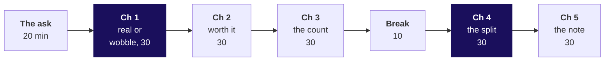
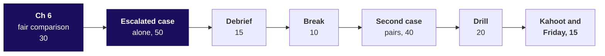

# Day sheet: Week 1, Thursday. Real, worth it, and caused?

**TRAINER ONLY.** Nothing on this page reaches a learner.

Posts to <!-- sync:module:W01/D4 -->Module 1: Foundations of AI and Data<!-- /sync:module:W01/D4 -->, on <!-- sync:day-date:W01/D4 -->Thu 08 Oct 2026<!-- /sync:day-date:W01/D4 -->.

Built from the approved Weeks 1 and 2 spine (`docs/detailing/W01_W02_spine.md`, Thursday), raised to
the chapter standard of 30 September 2026, and the Thursday row of
`docs/curriculum/W1_Data_analysis_found.md`. Data: client zero v3, generated by
`data/generate_client_zero.py`. Kalpa Retail's business, its membership tier and its metrics are
told once, on Monday, in the retail domain dossier
(`content/W01/D1/study-notes/C2_W01_D01_domain_retail_STUDENT.md`); today links to it and never
retells it.

| | |
|---|---|
| **Start from** | The cleaned two quarters from Wednesday. Concept-first: no test catalogue, no formulas. The shuffle by hand with cards comes before the loop in code. |
| **Go as far as** | Everyone states a p-value in the sentence form, sizes a real gap in rupees against cost, puts a count beside every rate, splits a campaign by segment, asks who got it, who did not and what else changed, and ships the one-page note with all three answers. Every chapter names its options, its best-fit call and a second route. |
| **Stop before** | The t-test family's formulas (the textbook test appears as one library call, a second opinion), confidence-interval construction (the bootstrap range is drawn and named), power, multiple-testing corrections, chart libraries. Name each as later, once. |
| **Comes later** | Friday rebuilds the week alone and rehearses the note against Marketing. Week 2 joins the campaigns table in SQL and pandas, and its tentative IITGN faculty blocks cover statistical inference formally. Week 4 designs the metric the plan chases. |
| **Cut first** | The bootstrap slide in chapter 2 (morning S31) to its verdict, then the textbook test in chapter 1 (S19) to one sentence, then the Berkeley card (S46). Never the hand shuffle, the split by segment, the audit of the note, or the hold-back design. |

---

## Morning, 180 minutes

| Part | Slides (morning deck) | Beside it | What must land | If short of time |
|---|---|---|---|---|
| The ask, 20 | S1 to S5 | The board's first drawing | Three questions sorted into chance, the count and a fair comparison; the note's four parts drawn | S5 to one sentence |
| Chapter 1, 30 | S6 to S20 | Notebook 1; `guided/C2_W01_D04_ten_cards_STUDENT.md`; the companion's walk | The options and the call; the hand shuffle (never cut); Retail-Core as the wobble; the room's Retail-Plus run; the trap and its rewrite | S19 to one sentence |
| Chapter 2, 30 | S21 to S32 | Notebook 2 | Real and worth acting on as two sentences; the fall against the company; the 45 percent break-even; the range dipping below the offer | S31 to its verdict |
| Chapter 3, 30 | S33 to S44 | Notebook 3 | The count found by the room in the empty cell; the coin-flip share; the rule of thumb; the 42 against 31 pair | S43 to one sentence |
| Break, 10 | after S44 | | | |
| Chapter 4, 30 | S45 to S55 | Notebook 4 | Marketing's number reproduced first; the invented two stores; the room's split; the fix; one mix as the second route | S46 to Flipkart only |
| Chapter 5, 30 | S56 to S65 | Notebook 5 | The headline note audited nine of nine missing; the Retail-Plus line built together; "not yet" with what would turn it | S57 read aloud only |

D66 stays self-study. Each chapter's set (`exercises/unguided/C2_W01_D04_ch{n}_*_STUDENT.md`) runs
its items 1 and 2 live in the chapter's last three minutes; items 3 to 6 open the practice lab.

**Checkpoints, one learner each, under thirty seconds.** After chapter 1: the Retail-Plus sentence in
the form that survives Kavya. After chapter 2: how big is the fall against the company, and what
must the offer win back? After chapter 3: what goes beside every rate you repeat? After chapter 4:
why can the blend rise while both segments fall? After chapter 5: what turns "not yet" into an
answer?

---

## Afternoon, 180 minutes

| Part | Slides (afternoon deck) | Beside it | What must land | If short of time |
|---|---|---|---|---|
| Chapter 6, 30 | S1 to S12 | Notebook 6 | Who got it (a rule, never a coin); August against July as the trap; Retail-Core beside it; the hold-back designed and priced | S11 to its table only |
| Escalated case, 50 | S13 to S14 | `unguided/C2_W01_D04_escalated_STUDENT.md`; notebook ex1 | Every learner ships a note under 200 words | Nothing; start on time |
| Debrief, 15 | S15 to S17 | The room's own part 4 and part 5 answers | The room's wrong lines fixed aloud; the discount line that survives review | S16 and S17 to one reading |
| Break, 10 | | | | |
| Second case, 40 | S18 to S20 | `unguided/C2_W01_D04_pushback_STUDENT.md`; notebook ex2 | Marketing's numbers reproduced, the mismatch named, like for like rebuilt, the reply spoken with the hold-back offered | S20 to its rule line |
| Interview drill, 20 | S21 to S23 | This sheet's answers | Sixty seconds per question, scored on the note's four parts, the design question among them | The last two follow-ups |
| Kahoot and Friday, 15 | S24 to S27 | `kahoot/C2_W01_D04_quiz_STUDENT.md` | Three learners read their sentence to Meera; the six crux lines read together; Friday left open | S24 read by the trainer alone |

**The afternoon deck's chapter numerals.** `scripts/build_deck.py` numbers chapter openers from 01 in
every deck, so after a rebuild run
`python3 content/W01/D4/internal/C2_W01_D04_renumber_afternoon_INTERNAL.py`, which sets the
afternoon's openers to 06 to 11 so chapter 6 matches notebook 6.

The case keys: the escalated case `bcacbadbaddc`, the second case `abcdcdba`. The chapter sets:
chapter 1 `cabdac`, chapter 2 `bcdabd`, chapter 3 `dbcdab`, chapter 4 `cabdda`, chapter 5 `bdacdc`,
chapter 6 `bdaccd`. Reasons for every letter are in `exercises/solutions/`.

**The model sentence to Meera, read only after three learners have read theirs.** "Retail-Plus
really is down, and it is small against the quarter; Student is too thin to fund yet; and the monsoon
sale did not work as designed, so test Diwali against a held-back group before repeating it."

---

## Each chapter's options, call and second route

| Chapter | Options | Best-fit call, and what would change it | Second route |
|---|---|---|---|
| 1. Real, or the usual wobble | Shuffle, textbook test, bootstrap, wait | Shuffle: 44 lumpy totals, 8 of them zero, explainable with cards; switch to the textbook test on large well-behaved data | Textbook test: 0.026 against the shuffle's 0.027 |
| 2. Real, and worth acting on | Rank by share, against the tier, against company and cost, bootstrap range | Company and cost with a break-even; a known recovery rate would let it decide alone | Bootstrap: Rs 42 to Rs 2,192 a member, 0.021 at or below zero |
| 3. The count behind 40 percent | Trust, coin flips on the count, rule of thumb, wait | Coin flips said with the rule; a cheap paid test for students would turn waiting into an experiment | Every deal counted exactly: 0.387 against the flips' 0.397 |
| 4. The discount, split by segment | Before and after, blended, inside each segment, one mix | Inside each segment; a coin-chosen group would make the blend fair | One mix, both ways: 3.0 percent less |
| 5. The note that may say not yet | Yes or no, dashboard, four-part note, deck | Four-part note under 200 words; a standing weekly review would favour a fixed dashboard | Every figure traced: 10 of 10 |
| 6. The fair comparison | Before and after, change beside the change, inside each segment, hold-back | Hold-back for Diwali, the split as today's evidence; a hold-back running into lakhs would push to months of B | Chapter 4's split agrees: no lift the sale can claim |

---

## The traps, with their exact wrong numbers

| Chapter | The plausible wrong answer, exactly | The decision it would mislead | The check that catches it | The fix and what it changes |
|---|---|---|---|---|
| 1 | "p = 0.03, so there is a 3% chance we are wrong about the drop." | Meera treats the fall as 97 percent certain | In which world was the share counted? Twenty invented no-change segments: one comes back at 0.005 | "If nothing had changed, a fall of Rs 1,110 per member or more would turn up in about 3 of every 100 shuffles." The number stays 0.027; the claim shrinks |
| 2 | Ranked by share, Retail-Plus 0.027, Retail-Core 0.345, Business 0.555: "Retail-Plus is our biggest problem; fund its retention programme first." | A programme funded because a share was small, before its scale or cost was asked; the harm is scale, since a ranking of falls by rupees would still put Retail-Plus first | Rupees beside the share: Retail-Plus fell Rs 24,420, 0.19 percent of the company's Q2, while Business rose Rs 6,18,460; an invented Rs 20 gap goes from 0.446 to 0.002 on sample size alone | Two sentences, and the Rs 500-a-member offer tested on half the tier (Rs 5,500 a quarter), since for all 22 (Rs 11,000) it pays only above 45 percent recovery |
| 3 | "Student is up 40 percent, the fastest on the page: move acquisition budget to Student." | Budget moves to a segment whose rise is a coin flip | Count what the rate stands on (the empty cell); coin flips make the rise in 0.397 of worlds on Student's count, 0.086 on Retail-Core's | "Not yet: watch Student until it carries thirty orders a quarter." Budget moves nowhere |
| 4 | "The discount worked: exposed customers spent Rs 3,395 against Rs 3,200, up 6.1%; repeat it for Diwali." | The sale repeated for Diwali at 15 percent off | Split by segment: Retail-Plus Rs 4,850 against Rs 5,000, Retail-Core Rs 1,940 against Rs 2,000, both 3.0 percent less; the exposed group is 50 percent Retail-Plus against 40 | "Do not repeat it as designed; hold back a random slice of each segment." One mix gives Rs 3,104 against Rs 3,200 |
| 5 | "Retail-Plus revenue fell 34%. Student is up 40%. The monsoon sale lifted revenue 6%." with a retention offer, budget to Student and the sale again | Three wrong decisions from three true numbers | The audit: base, count or chance, caveat per line; nine of nine missing | The four-part note of about 170 words, every line passing the audit |
| 6 | "Retail-Plus delivered Rs 25,060 in August against Rs 9,280 in July, up 170%: the monsoon sale worked, so run it for more of the base at Diwali." | The sale widened on a jump that belongs to the month | Retail-Core, not targeted, rose 73 percent the same month; Retail-Plus fell 58 percent May to June with no sale; July stands on 4 orders | August's share of the quarter: 52.5 against 48.6 percent; a label shuffle makes the gap in about 8 deals in 10; the hold-back at Diwali, about Rs 4,200 at Marketing's own lift and too small to size a 6 percent lift |
| Second case | "Exposed Retail-Plus members spent Rs 4,850, far above the Rs 3,200 our unexposed customers averaged." | Marketing wins the room with a correct number on an unfair comparison | Who sits in each group: 30 exposed Retail-Plus against 100 unexposed, 60 of them Retail-Core | Like for like, 3.0 percent less; plus Monday's rule, 17.6 percent more volume needed at 15 percent off |

A syntax or runtime error met on the way gets two minutes and the last line of its trace: the usual
one today is a `NameError` from an unrun helper cell, fixed by Restart and Run All. A chapter 1
notebook that cannot import `scipy` needs `pip install scipy`; the Codespace's setup installs it with
scikit-learn.

---

## The real company in each chapter

Every fact below was checked on 30 September 2026; the links are in the provenance and the study
notes.

| Chapter | Company | The fact used |
|---|---|---|
| 1 | Booking.com | About 25,000 tests a year and more than 1,000 at once; about nine in ten experiments improve nothing (Thomke, HBR, 2020, and HBR podcast, 2019) |
| 2 | Microsoft Bing | An ad-headline change lifted revenue 12 percent, over 100 million dollars a year in the US; about a third of experiments improved their metric |
| 3 | The Gates Foundation, via Howard Wainer | Small schools over-represented at both tails; about 1.7 billion dollars to education projects by 2001 |
| 4 | Flipkart; UC Berkeley | Big Billion Days 2022, 23 to 30 September, over a billion visits; Berkeley 1973, 44 against 35 percent admitted, reversing by department |
| 5 | Amazon | Six-page narrative memos read in silence in place of slides (Bezos, 2017 letter) |
| 6 | eBay | Brand-keyword ads had no measurable short-term benefit; frequent buyers who would buy anyway took most ad spend (NBER 20171) |

---

## What is planted, and what the room should find

The discovery is the lesson. No learner file names the Student count, and no slide states the
Retail-Plus verdict, the Student share or the segment reversal before the room computes it.

| Planted (client zero v3) | Where it is | What the room should do | If nobody finds it |
|---|---|---|---|
| Student holds exactly 12 orders, 5 in Q1 and 7 in Q2, from 2 customers | `C2_W01_D04_orders_STUDENT.csv`, segment Student | Run the empty cell in notebook 3, level 2, and say the count aloud next to the 40 percent | Ask: "How many orders is 40 percent of?" Do not say the number |
| The Retail-Plus gap is real but modest | The same file, Retail-Plus, delivered revenue per member | Find 135 of 5,000 shuffles (0.027), then size it at Rs 24,420 a quarter, 0.19 percent of the company | Ask for the rupees before anyone mentions the share |
| The monsoon sale lifts the blend 6.1 percent while every segment fell 3 percent, because the exposed group skews to Retail-Plus | `C2_W01_D04_exposure_STUDENT.csv` and `C2_W01_D04_campaigns_STUDENT.csv` | Split by segment in notebook 4, level 3, and name who got the discount | Point at the options cell's mix chart and ask what it does to a blend |

If a learner asks whether the data is rigged, answer with the question back: "What would you check?"

**The take-home's second export, for Friday's walk-through.** `C2_W01_D04_takehome_STUDENT.csv` is
Wednesday's take-home export (client zero v2, second sample), 97 lines of Q1 only. Its plants, named
only here: the header row pasted in as the 45th body line (line 46 of the file); an amount of -2,400 on KR-02018, a
refund posted as a delivered order; a date in the other format on KR-02030 (12/05/2026); an empty
status on KR-02052; and six duplicated order ids (KR-02004, KR-02009, KR-02022, KR-02037, KR-02061,
KR-02070). Cleaned: 90 orders, 59 delivered with a positive amount, 50 of them in Retail-Core and
Retail-Plus, 12 of those with a missing discount. Discounted baskets Rs 2,311 on 22 orders against
Rs 2,336 on 16 with a discount of zero, shares 0.54 overall, 0.52 in Retail-Core and 0.59 in
Retail-Plus: no sign that discounts grow baskets, on counts under thirty.

**Monday's sample, reused in the practice lab.** `C2_W01_D04_monday_sample_STUDENT.py` is Monday's
take-home sample (client zero v0, second sample). Its plants stay Monday's: two Business orders of
Rs 3,12,000 and Rs 2,05,000 (excluded by problem 3's first choice) and the amount stored as the text
"1990" (converts cleanly with `int()`).

---

## The day's numbers, so you are never caught out

| Measure | Value |
|---|---|
| Orders in the file | 186 across Q1 and Q2, 69 customers |
| Retail-Core, delivered revenue per member | Q1 Rs 1,509, Q2 Rs 1,399, gap Rs 110; 1,724 of 5,000 shuffles, 0.345; textbook test 0.350 |
| Retail-Plus, delivered revenue per member | Q1 Rs 3,279, Q2 Rs 2,169, gap Rs 1,110; 135 of 5,000 shuffles, 0.027; textbook test 0.026; both directions 0.050; seeds 1 to 5 give 0.026 to 0.029 |
| Retail-Plus, bootstrap | Approximate 95 percent range Rs 42 to Rs 2,192 a member (low end seed-sensitive, say "about Rs 40") (Rs 920 to Rs 48,220 a quarter); 0.021 at or below zero |
| Retail-Plus, segment | Q1 Rs 72,130, Q2 Rs 47,710, fall Rs 24,420, 33.9 percent of its Q1 |
| Company delivered revenue | Q1 Rs 1,22,73,410, Q2 Rs 1,28,64,680; the Retail-Plus fall is 0.19 percent of Q2 |
| Segment moves, Q1 to Q2, delivered | Retail-Core -Rs 3,750; Retail-Plus -Rs 24,420; Student +Rs 980; Business +Rs 6,18,460 |
| Retention offer (assumed) | Rs 500 a member, Rs 11,000 a quarter; break-even 45 percent; at an assumed 30 percent margin, 150 percent |
| Orders, Q2 per 100 in Q1 | Retail-Core 97, Retail-Plus 65, Business 94, Student 140 |
| Coin flips, 40 percent rise | Student's count 0.397, every deal counted 0.387; Retail-Core's 73 orders 0.086; invented 400 orders under 0.002 |
| Ten cards | Real gap Rs 880; 21 of 1,000 shuffles; exact 6 of 252 deals, 0.024 |
| Exposure table | Marketing's own extract, keyed separately from the order sample, so its 70 Retail-Plus customers do not reconcile with the 22 members, and each cell holds one figure, so the split has no chance reference; 160 customers; exposed 60 (30 Retail-Plus at Rs 4,850, 30 Retail-Core at Rs 1,940); not exposed 100 (40 at Rs 5,000, 60 at Rs 2,000); one mix Rs 3,104 against Rs 3,200 and Rs 3,395 against Rs 3,500 |
| Campaign | Monsoon Sale, CMP-MONSOON-26, 15 percent off, 5 to 19 August, targeted at Retail-Plus; break-even volume 17.6 percent |
| Months, delivered | Retail-Plus Apr to Sep: Rs 19,650, 36,840, 15,640, 9,280, 25,060, 13,370; Retail-Core: Rs 11,920, 15,000, 24,380, 13,320, 23,090, 11,140; July to August orders 4 to 9 and 6 to 12 |
| August's share of Q2 | Retail-Plus 52.5 percent, Retail-Core 48.6 percent; segment-label shuffle makes a 4-point gap either way in 0.82 of deals; difference in differences Rs 6,010, and May to June breaks the parallel assumption (Retail-Plus -58, Retail-Core +63 percent) |
| Hold-back | 14 of 70 Retail-Plus customers; about Rs 4,200 forgone at Marketing's 6 percent; too few to see a 6 percent lift, since spend per customer varies by more than its mean, and power is a later week |

Every share above comes from `random.seed(2026)` on Python 3.11 and runs identically on every laptop.

---

## The interview questions, answered in one breath

| Tag | Question | The answer in one breath |
|---|---|---|
| [S] | How do you know whether a change in a metric is significant? | Build a chance reference, a shuffle of the labels thousands of times, see how often chance makes a change that large, then check the count and size it in money. |
| [S] | Explain a finding to a non-technical stakeholder. | Claim first with one number and its base, then the evidence, the caveat that would change it, and the action with its cost. |
| [S] | What does p = 0.03 mean, and not mean? | If there were no difference, a gap this large would appear about 3 times in 100; it is not the chance we are wrong and says nothing about size. |
| [F] | 42 percent on 12 users against 31 percent on 1,200; which do you trust? | 31 as the estimate; one user moves 12 by 8 points, so 42 is a lead to measure on more users. |
| [F] | Revenue rose after a discount; did the campaign work, and what would you need to know? | Who got it, who did not and what else changed: compare inside each segment, check the mix and the month, and ask for a random hold-back next time. |
| [D] | The CEO wants a yes or no and the honest answer is "not yet"; what do you say, and how do you hold the line? | "Not yet, and here is what would tell us by when"; offer the cheapest test that settles it, and hold the line with the split, never with authority. |
| [F] | A metric moved and the test says significant; how do you decide whether to act? | Size it in money against the business and the cost of acting, work out the break-even recovery, and test on part of the group when the range dips below the cost. |
| [F] | The campaign lifted revenue overall but every segment fell; how, and which do you report? | The mix shifted toward high spenders; report the segments, with the mix named as the reason the blend rose. |
| [F] | How would you set up the Diwali campaign so you can tell whether it worked? | A coin per customer inside each segment holds back one in five, the measure and window agreed in advance, compared after with the shuffle. |
| [S] | What is a confounder? Give an example from a campaign. | Something that differs between the groups and moves the outcome by itself: the sale went to members who spend more anyway, in a month busy for everyone. |
| [D] | Marketing says your segment split is cherry-picking; how do you respond? | Reproduce their number first, then show the split was chosen because the groups differ in mix, and offer the hold-back. |
| [D] | Design: shuffle, textbook test, bootstrap or wait; which for Monday, sized how, and what would switch it? | The shuffle on 44 lumpy totals, under a second, with the textbook test as the cross-check; the textbook test on large well-behaved data; wait only if both are unclear. |

The full answers, a design question per chapter among them, are in
`study-notes/C2_W01_D04_notes_STUDENT.md` and in each notebook's interview section.

---

## The practice lab

The TA runs it from `exercises/practice/C2_W01_D04_lab_STUDENT.md`, after the chapter sets' items 3
to 6 (about 25 minutes, answered in chat as six letter lines); the TA note is
`trainer/C2_W01_D04_lab_note_TRAINER.md`, with where learners stall and the one hint per problem.

---

## Which file for which moment

| Moment | File |
|---|---|
| Teaching | `slides/C2_W01_D04_half1_STUDENT.pptx` (morning, the ask and chapters 1 to 5) and `slides/C2_W01_D04_half2_STUDENT.pptx` (afternoon, chapter 6 onward), speaker notes on every slide |
| Live coding | `notebooks/C2_W01_D04_01` to `_06`, one per chapter, each carrying the toolkit forward |
| The projector's moving picture | `demos/C2_W01_D04_shuffle_lab_STUDENT.html`: the walk in chapter 1, the shuffle machine in chapter 2, experiment C in chapter 3, experiment D in chapter 4 |
| Early finishers | `demos/C2_W01_D04_decision_tool_STUDENT.xlsx`, four tabs with one formula defect each |
| The afternoon cases | `notebooks/C2_W01_D04_ex1_escalated_case_STUDENT.ipynb` and `_ex2_second_case_STUDENT.ipynb`, solutions in `exercises/solutions/` |
| The board | `whiteboards/C2_W01_D04_real_or_wobble_STUDENT.md`, the drawings in the order they go up |
| Close | `kahoot/C2_W01_D04_quiz_STUDENT.md`, keys inline |
| Tonight | `takehome/`, `preread/` for Friday, `extras/` for the stretch and the recovery |

**If the Codespace will not start** for a learner, pair them for the morning and fix it at the break;
every notebook opens read-only on GitHub with every output showing.
