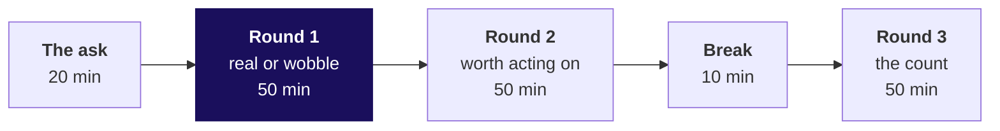
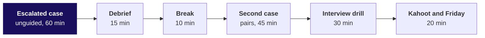

# Day sheet: Week 1, Thursday. Real, worth it, and caused?

**TRAINER ONLY.** Nothing on this page reaches a learner.

Posts to <!-- sync:module:W01/D4 -->Module 1: Foundations of AI and Data<!-- /sync:module:W01/D4 -->, on <!-- sync:day-date:W01/D4 -->Thu 08 Oct 2026<!-- /sync:day-date:W01/D4 -->.

Built from the approved Weeks 1 and 2 spine (`docs/detailing/W01_W02_spine.md`, Thursday) and the
Thursday row of `docs/curriculum/W1_Data_analysis_found.md`. Data: client zero v3, generated by
`data/generate_client_zero.py`.

| | |
|---|---|
| **Start from** | The cleaned two quarters from Wednesday. Concept-first: no test catalogue, no formulas. The shuffle by hand with cards comes before the loop in code. |
| **Go as far as** | Everyone states a p-value in the sentence form, sizes a real gap in rupees against cost, puts a count beside every rate, names the campaign's confounder, and ships the one-page note with all three answers. |
| **Stop before** | The t-test family, confidence-interval construction, power, multiple-testing corrections, chart libraries. Name each as later, once. |
| **Comes later** | Friday rebuilds the week alone and rehearses the note against Marketing. Week 2 joins the campaigns table in SQL and pandas, and its tentative IITGN faculty blocks cover statistical inference formally. Week 4 designs the metric the plan chases. |
| **Cut first** | The confidence-interval slide (morning S26), then the invented Simpson arithmetic (afternoon S5 and S6 to one sentence). Never the hand shuffle, the confounder, or the note. |

---

## Morning, 180 minutes

| Part | Slides (morning deck) | Beside it | What must land | If short of time |
|---|---|---|---|---|
| The ask, 20 | S1 to S5 | The board's first drawing | Three questions sorted into chance, the count and a fair comparison; the note's four parts drawn | S5 to one sentence |
| Round 1, 50 | S6 to S17 | Notebook 1; `guided/C2_W01_D04_ten_cards_STUDENT.md`; the companion's walk | The hand shuffle (10 minutes, never cut); the loop read against the cards; Retail-Core as the wobble; the trap and its rewrite; the room's Retail-Plus run | The exact-share section of notebook 1 stays self-study |
| Round 2, 50 | S18 to S28 | Notebook 2; `unguided/C2_W01_D04_round2_STUDENT.md` | Real and worth acting on as two sentences; the bridge by segment; the retention offer's 45 percent break-even | S26 first, then S22 to its headline |
| Break, 10 | after S28 | | | |
| Round 3, 50 | S29 to S38 | Notebook 3; `unguided/C2_W01_D04_round3_STUDENT.md` | The count found by the room in the empty cell; the coin-flip share; the rule of thumb; the confounder vignettes that prepare the afternoon | D39 stays self-study |

Round 1's set (`unguided/C2_W01_D04_round1_STUDENT.md`) runs in the last 15 minutes of round 1, and
each round's set closes its round; the key strings are `cadbacd` (round 1), `bdcacda` (round 2) and
`bcdabca` (round 3), with reasons in `exercises/solutions/`.

**Checkpoints, one learner each, under thirty seconds.** After round 1: say the Retail-Plus sentence
in the form that survives Kavya. After round 2: how big is the fall against the company, and what
would a fix have to win back? After round 3: what goes beside every rate you repeat?

---

## Afternoon, 180 minutes

| Part | Slides (afternoon deck) | Beside it | What must land | If short of time |
|---|---|---|---|---|
| Escalated case, 60 | S1 to S3 | `unguided/C2_W01_D04_escalated_STUDENT.md`; notebook ex1 | Every learner ships a note under 200 words; part 4 is met unguided | Nothing; start on time |
| Debrief, 15 | S4 to S9 | The room's own part 4 answers | The blend trusted, shown as the room's own wrong answer; Simpson named at recognition depth; three more wrong lines fixed aloud | S5 and S6 to one sentence |
| Break, 10 | | | | |
| Second case, 45 | S10 to S13 | `unguided/C2_W01_D04_pushback_STUDENT.md`; notebook ex2 | Marketing's numbers reproduced, the mismatch named, like for like rebuilt, the reply spoken | S13 to its rule line |
| Interview drill, 30 | S14 to S16 | This sheet's answers | Sixty seconds per question, scored on the note's four parts | The last three follow-ups |
| Kahoot and Friday, 20 | S17 to S20 | `kahoot/C2_W01_D04_quiz_STUDENT.md` | Three learners read their sentence to Meera; the five crux lines read together; Friday left open | S18 read by the trainer alone |

The escalated case's key is `bcacbadbaddc` and the second case's is `abcdcdba`.

**The model sentence to Meera, read only after three learners have read theirs.** "Retail-Plus
really is down, and it is small against the quarter; Student is too thin to fund yet; and the monsoon
sale did not work as designed, so test Diwali against a held-back group before repeating it."

---

## The traps, with their exact wrong numbers

| Where | The plausible wrong answer, exactly | The decision it would mislead | The check that catches it | The fix and what it changes |
|---|---|---|---|---|
| Round 1 | "p = 0.03, so there is a 3% chance we are wrong about the drop." | Meera treats the Retail-Plus drop as 97 percent certain | In which world was the share counted? Twenty invented no-change segments: one comes back at 0.005, a finding certainly wrong | "If nothing had changed, a fall of Rs 1,110 per member or more would turn up in about 3 of every 100 shuffles." The number stays 0.027; the claim shrinks to "beats the wobble" |
| Round 2 | Segments ranked by share, Retail-Plus 0.027 first: "Retail-Plus is our biggest problem; fund its retention programme first." | A retention programme funded ahead of anything that matters in rupees | Rupees beside the share: Retail-Plus fell Rs 24,420 while Business moved Rs 6,18,460; an invented Rs 20 gap goes from 0.446 to 0.002 on sample size alone | Two sentences: real, and worth Rs 24,420 a quarter, 0.19 percent of the company; a Rs 11,000 offer pays only above a 45 percent recovery, so test it on half the tier |
| Round 3 | "Student is up 40 percent, the fastest on the page: move acquisition budget to Student." | Acquisition budget moves to a segment whose rise is a coin flip | Count what the rate stands on (the room's empty cell); coin flips make a 40 percent rise in 0.397 of worlds on Student's count, 0.086 on Retail-Core's | "Not yet: watch Student until it carries thirty orders a quarter." Budget moves nowhere |
| Escalated case | "The discount worked: exposed customers spent Rs 3,395 against Rs 3,200, up 6.1 percent; repeat it for Diwali." | The sale is repeated for Diwali at 15 percent off | Split by segment: inside Retail-Plus Rs 4,850 against Rs 5,000 and inside Retail-Core Rs 1,940 against Rs 2,000, both 3.0 percent less; the exposed group is 50 percent Retail-Plus against 40 | "Do not repeat it as designed; hold back a random slice of each segment at Diwali." In the same mix the exposed spend Rs 3,104 against Rs 3,200 |
| Second case | "Exposed Retail-Plus members spent Rs 4,850, far above the Rs 3,200 our unexposed customers averaged." | Marketing wins the room with a correct number on an unfair comparison | Who sits in each group: 30 exposed Retail-Plus against 100 unexposed, 60 of them Retail-Core | Like for like, 3.0 percent less; plus Monday's rule, 17.6 percent more volume needed to stand still at 15 percent off |

A syntax or runtime error met on the way gets two minutes and the last line of its trace: the usual
one today is a `NameError` from an unrun helper cell, fixed by Restart and Run All.

---

## What is planted, and what the room should find

The discovery is the lesson. No learner file names the Student count, and no slide states any of the
three results before the room computes it. The notebooks show each result only after a predict prompt.

| Planted (client zero v3) | Where it is | What the room should do | If nobody finds it |
|---|---|---|---|
| Student holds exactly 12 orders, 5 in Q1 and 7 in Q2, from 2 customers | `C2_W01_D04_orders_STUDENT.csv`, segment Student | Run the empty cell in notebook 3, section 2, and say the count aloud next to the 40 percent | Ask: "How many orders is 40 percent of?" Do not say the number |
| The Retail-Plus gap is real but modest | The same file, Retail-Plus, delivered revenue per member | Find 135 of 5,000 shuffles (0.027), then size it at Rs 24,420 a quarter, 0.19 percent of the company | Ask for the rupees before anyone mentions the share |
| The monsoon sale lifts the blend 6.1 percent while every segment fell 3 percent, because the exposed group skews to Retail-Plus | `C2_W01_D04_exposure_STUDENT.csv` and `C2_W01_D04_campaigns_STUDENT.csv` | Split by segment in the escalated case, part 4, and name who got the discount | In the debrief, ask the room to fill the sixth board drawing's boxes with each group's mix |

If a learner asks whether the data is rigged, answer with the question back: "What would you check?"

**The take-home's second export, for Friday's walk-through.** `C2_W01_D04_takehome_STUDENT.csv` is
Wednesday's take-home export (client zero v2, second sample), 97 lines of Q1 only. Its plants, named
only here: the header row pasted in as the 45th body line (line 46 of the file); an amount of -2,400 on KR-02018, a
refund posted as a delivered order; a date in the other format on KR-02030 (12/05/2026); an empty
status on KR-02052; and six duplicated order ids (KR-02004, KR-02009, KR-02022, KR-02037, KR-02061,
KR-02070). Cleaned: 90 orders, 59 delivered with a positive amount, 50 of them in Retail-Core and
Retail-Plus, 12 of those with a missing discount. Discounted baskets Rs 2,311 on 22 orders against
Rs 2,336 on 16 with a discount of zero, shares 0.54 overall, 0.52 in Retail-Core and 0.59 in
Retail-Plus: no sign that discounts grow baskets, on counts under thirty.

**Monday's sample, reused in the practice lab.** `C2_W01_D04_monday_sample_STUDENT.py` is Monday's
take-home sample (client zero v0, second sample). Its plants stay Monday's: two Business orders of
Rs 3,12,000 and Rs 2,05,000 (excluded by problem 3's first choice) and the amount stored as the text
"1990" (converts cleanly with `int()`).

---

## The day's numbers, so you are never caught out

| Measure | Value |
|---|---|
| Orders in the file | 186 across Q1 and Q2, 69 customers |
| Retail-Core, delivered revenue per member | Q1 Rs 1,509, Q2 Rs 1,399, gap Rs 110; 1,724 of 5,000 shuffles, 0.345 |
| Retail-Plus, delivered revenue per member | Q1 Rs 3,279, Q2 Rs 2,169, gap Rs 1,110; 135 of 5,000 shuffles, 0.027; both directions 0.050; seeds 1 to 5 give 0.026 to 0.029 |
| Retail-Plus, segment | Q1 Rs 72,130, Q2 Rs 47,710, fall Rs 24,420, 33.9 percent of its Q1 |
| Company delivered revenue | Q1 Rs 1,22,73,410, Q2 Rs 1,28,64,680; the Retail-Plus fall is 0.19 percent of Q2 |
| Segment moves, Q1 to Q2, delivered | Retail-Core -Rs 3,750; Retail-Plus -Rs 24,420; Student +Rs 980; Business +Rs 6,18,460 |
| Orders, Q2 per 100 in Q1 | Retail-Core 97, Retail-Plus 65, Business 94, Student 140 |
| Coin flips, 40 percent rise | Student's count 0.397; Retail-Core's 73 orders 0.086; invented 400 orders 0.0008 |
| Ten cards | Real gap Rs 880; 21 of 1,000 shuffles; exact 6 of 252 deals, 0.024 |
| Exposure table | 160 customers; exposed 60 (30 Retail-Plus at Rs 4,850, 30 Retail-Core at Rs 1,940); not exposed 100 (40 at Rs 5,000, 60 at Rs 2,000) |
| Campaign | Monsoon Sale, CMP-MONSOON-26, 15 percent off, 5 to 19 August, targeted at Retail-Plus; break-even volume 17.6 percent |

Every share above comes from `random.seed(2026)` on Python 3.11 and runs identically on every laptop.

---

## The interview questions, answered in one breath

| Tag | Question | The answer in one breath |
|---|---|---|
| [S] | How do you know whether a change in a metric is significant? | Build a chance reference, a shuffle of the labels thousands of times, see how often chance makes a change that large, then check the count and size it in money. |
| [S] | Explain a finding to a non-technical stakeholder. | Claim first with one number and its base, then the evidence, the caveat that would change it, and the action with its cost. |
| [S] | What does p = 0.03 mean, and not mean? | If there were no difference, a gap this large would appear about 3 times in 100; it is not the chance we are wrong and says nothing about size. |
| [F] | 42 percent on 12 users against 31 percent on 1,200; which do you trust? | 31 as the estimate; one user moves 12 by 8 points, so 42 is a lead to measure on more users. |
| [F] | Revenue rose after a discount; did the campaign work, and what would you need to know? | Who got it and against whom: compare inside each segment, check the mix, and ask for a random held-back group next time. |
| [D] | The CEO wants a yes or no and the honest answer is "not yet"; what do you say, and how do you hold the line? | "Not yet, and here is what would tell us by when"; offer the cheapest test that settles it, and hold the line with the split, never with authority. |
| [F] | A metric moved and the test says significant; how do you decide whether to act? | Size it in money against the business and the cost of acting, work out the break-even recovery, and test before rolling out when it is uncertain. |
| [F] | The campaign lifted revenue overall but every segment fell; how, and which do you report? | The mix shifted toward high spenders; report the segments, with the mix named as the reason the blend rose. |
| [F] | How would you set up the Diwali campaign so you can tell whether it worked? | Hold back a random slice inside each segment, agree the measure and the window in advance, compare after. |
| [S] | What is a confounder? Give an example from a campaign. | Something that differs between the groups and moves the outcome by itself: the sale went to members who spend more anyway. |
| [D] | Marketing says your segment split is cherry-picking; how do you respond? | Reproduce their number first, then show the split was chosen before the result because the groups differ in mix, and offer the held-back test. |
| [D] | Twenty segments tested, one at p = 0.03; what do you say? | One chance-only test in twenty reaches 0.05 by itself, so it is a lead to retest on fresh data. |

The full answers are in `study-notes/C2_W01_D04_notes_STUDENT.md` and in the notebooks' interview
sections.

---

## The practice lab

The TA runs it from `exercises/practice/C2_W01_D04_lab_STUDENT.md`; the TA note is
`trainer/C2_W01_D04_lab_note_TRAINER.md`, with where learners stall and the one hint per problem.

---

## Which file for which moment

| Moment | File |
|---|---|
| Teaching | `slides/C2_W01_D04_half1_STUDENT.pptx` (morning) and `slides/C2_W01_D04_half2_STUDENT.pptx` (afternoon), speaker notes on every slide |
| Live coding | `notebooks/C2_W01_D04_01` to `_03`, one per round |
| The projector's moving picture | `demos/C2_W01_D04_shuffle_lab_STUDENT.html`: the walk in round 1, the shuffle machine in round 2, experiment C in round 3, experiment D in the debrief |
| Early finishers | `demos/C2_W01_D04_decision_tool_STUDENT.xlsx`, four tabs with one formula defect each |
| The afternoon cases | `notebooks/C2_W01_D04_ex1_escalated_case_STUDENT.ipynb` and `_ex2_second_case_STUDENT.ipynb`, solutions in `exercises/solutions/` |
| Close | `kahoot/C2_W01_D04_quiz_STUDENT.md`, keys inline |
| Tonight | `takehome/`, `preread/` for Friday, `extras/` for the stretch and the recovery |

**If the Codespace will not start** for a learner, pair them for the morning and fix it at the break;
every notebook opens read-only on GitHub with every output showing.
