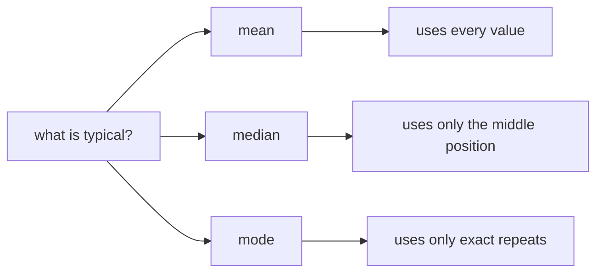
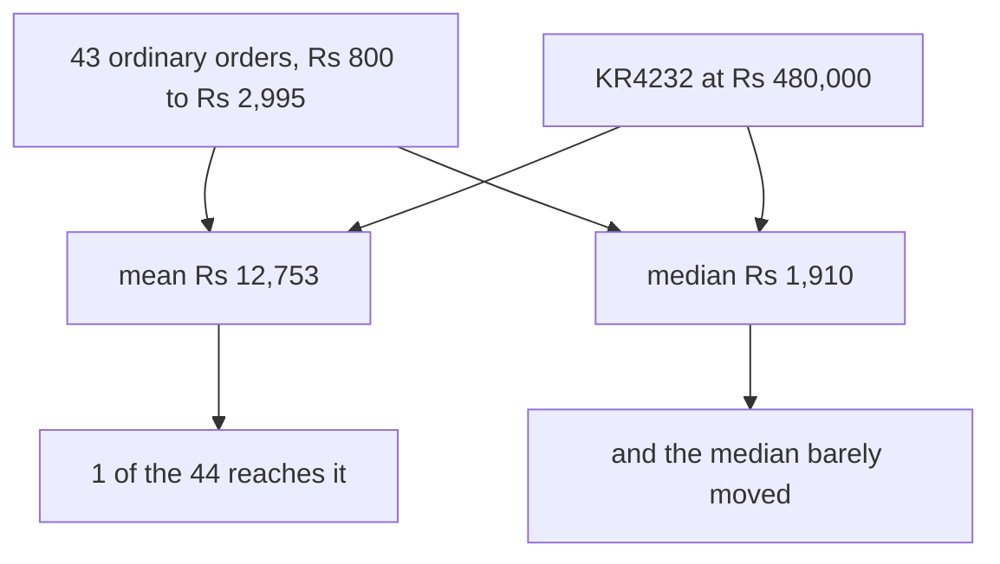
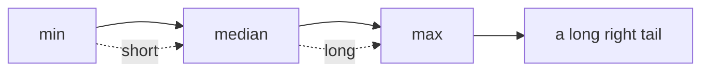
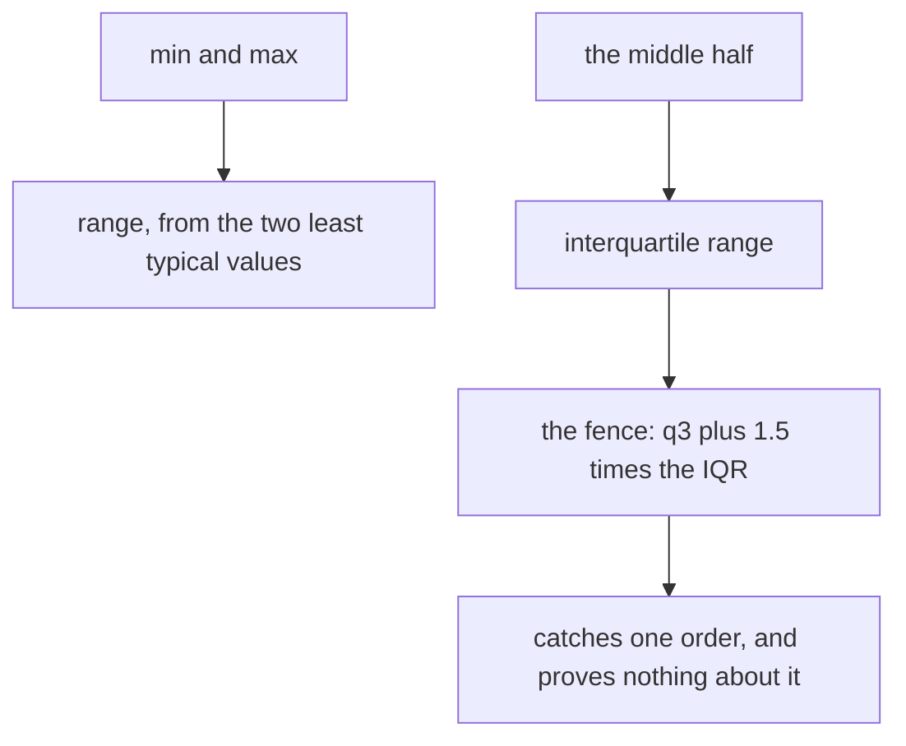
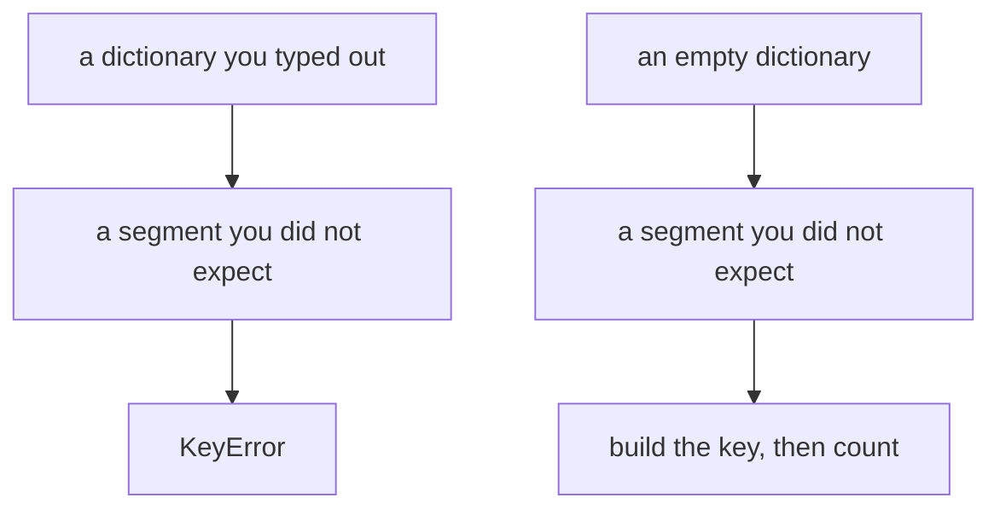
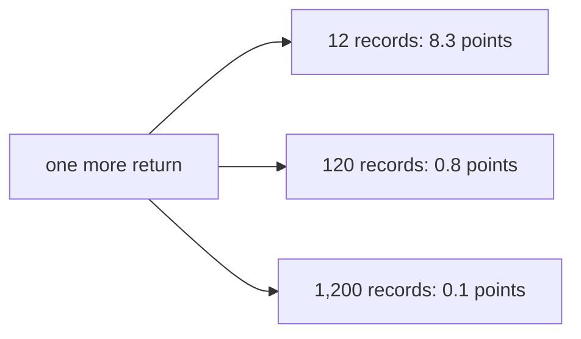
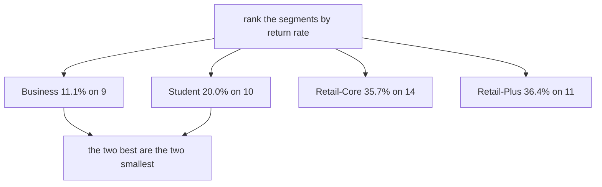
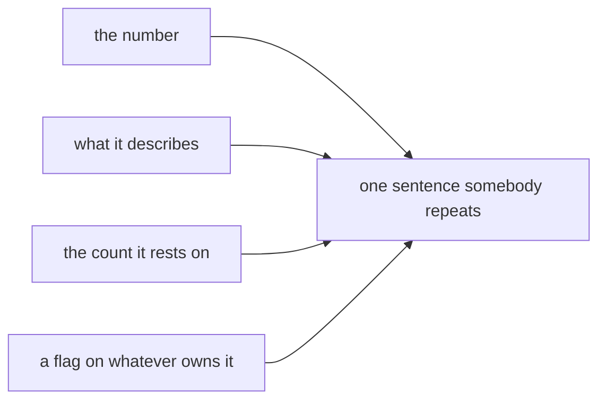

# Board diagrams: Week 1, Day 4

Every diagram the day uses, as a fence a trainer can draw from and a learner can redraw.

## 1. Three answers to what is typical

## 2. The whale

## 3. Reading skew off sorted values

## 4. Spread, three ways

## 5. Grouping without knowing the keys

## 6. One event, three denominators

## 7. The ranking, and what it measures

## 8. The honest sentence

