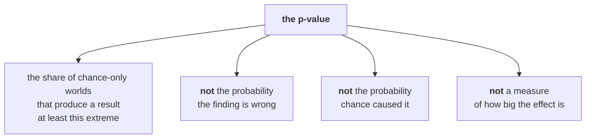
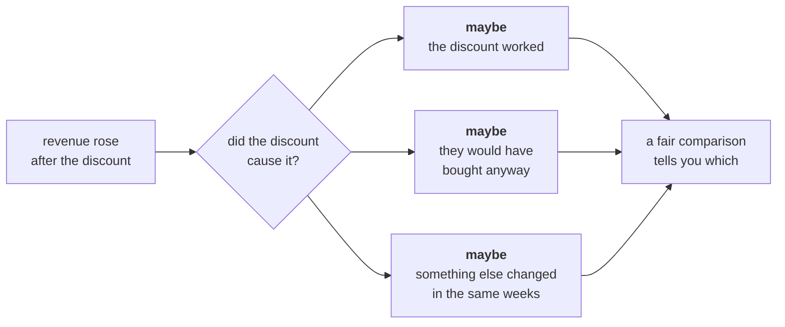

# The chance reference, and the fair comparison

The one drawing for Day 4, and it is really two. The first answers "could chance have done this".
The second answers "did the thing we did cause it". They are different questions and the room will
try to merge them.

---

## Drawing one: the shuffle, with ten playing cards

Do this before any code. It takes four minutes and it is the whole of inference.

**Step 1.** Take ten cards. Write `PLUS` on six and `CORE` on four. Deal them into two piles by the
labels and compute the gap between the piles on some number the room picks.

**Step 2.** Now say the sentence that matters:

> "Suppose the labels mean nothing at all."

**Step 3.** Collect the cards, shuffle, deal ten again into piles of six and four **ignoring the
labels**, and recompute the gap. Write it on the board.

**Step 4.** Do it nine more times. You now have ten gaps that chance alone produced.

**Step 5.** Count how many of the ten are at least as large as the real one.

```
that count, over ten  =  the p-value
```

That is it. Everything in the code is the same move done five thousand times instead of ten.

---

## What a p-value is, and what it is not



Write the three crossed-out lines on the board and leave them up. Somebody will say one of them
before the day ends, and pointing at the board is faster than arguing.

---

## Two results, opposite verdicts

| | Retail-Plus against Retail-Core | Student, up 40 percent |
|---|---|---|
| What was seen | A 32.3 point gap in the fall | 5 orders in Q1, 7 in Q2 |
| Shuffles at least as extreme | 0 of 5,000 | 1,914 of 5,000 |
| The p-value | **less than 0.0002** | **0.383** |
| Reads as | Chance alone does not produce this | Chance produces this two times in five |

**Never write p = 0.** Five thousand shuffles can only resolve down to one in five thousand, so the
honest report is `p < 0.0002`. The number you write is the resolution of your own simulation.

---

## The rule of thumb, and where it comes from

Student's 40 percent rise rests on twelve orders. Flip a fair coin twelve times and you get seven or
more heads about 39 percent of the time. That is the whole of the Student result.

**Distrust any rate under about thirty observations.** It is a rule of thumb rather than a law, and
saying which it is out loud matters.

---

## Drawing two: correlation and cause



**What a fair comparison needs:** a group that did not get the thing, that is like the group that
did, in the ways that matter.

Ask the room: who received the monsoon sale? Marketing targeted Retail-Plus, who already spend more.
So the treated group is not like the control group, and the comparison is not fair before anybody
computes anything.

---

## Drawing three: the aggregate that flips

Put the three rows up one at a time, in this order. The order is the reveal.

| Group | Exposed | Not exposed | Change |
|---|---|---|---|
| Retail-Plus | Rs 4,850 | Rs 5,000 | **down 3 percent** |
| Retail-Core | Rs 1,940 | Rs 2,000 | **down 3 percent** |
| **Everyone** | **Rs 3,395** | **Rs 3,200** | **up 6 percent** |

Both segments fell. The blend rose. Nobody made an arithmetic error.

**Why:** half the exposed group is Retail-Plus, against forty percent of the control, and Retail-Plus
spends two and a half times more. The campaign changed who is in the average, not what they spent.

---

## The note, four parts

```
CLAIM      one sentence, with the number and its denominator
EVIDENCE   what you computed, and on how many observations
CAVEAT     the thing that would change the claim
ACTION     what to do, and what it costs
```

**The sentence a CEO keeps you for:** "We do not know yet, and here is what would tell us." Write it
on the board and make somebody say it out loud, because most rooms will not.

---

## What has to be on the board when the day ends

1. The ten-card shuffle, with the count out of ten circled.
2. The three things a p-value is not.
3. Both results side by side, with `p < 0.0002` and `p = 0.383` written as they should be written.
4. The campaign table with all three rows and the mix explained underneath.
5. The four parts of the note.
