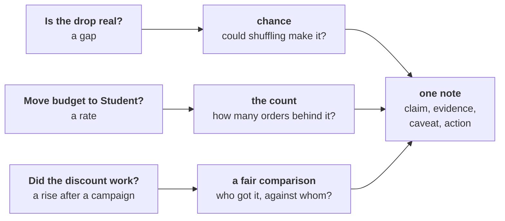
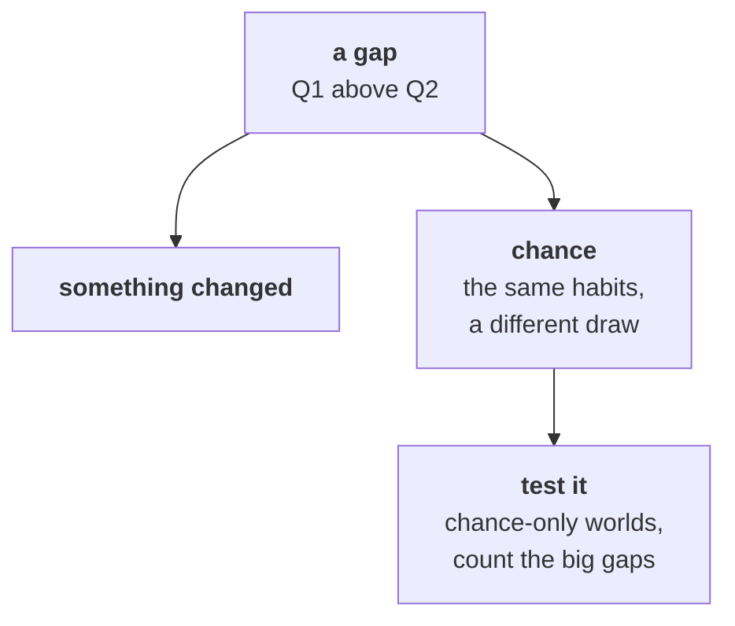
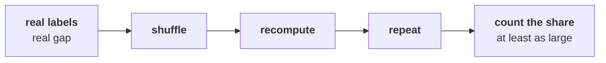
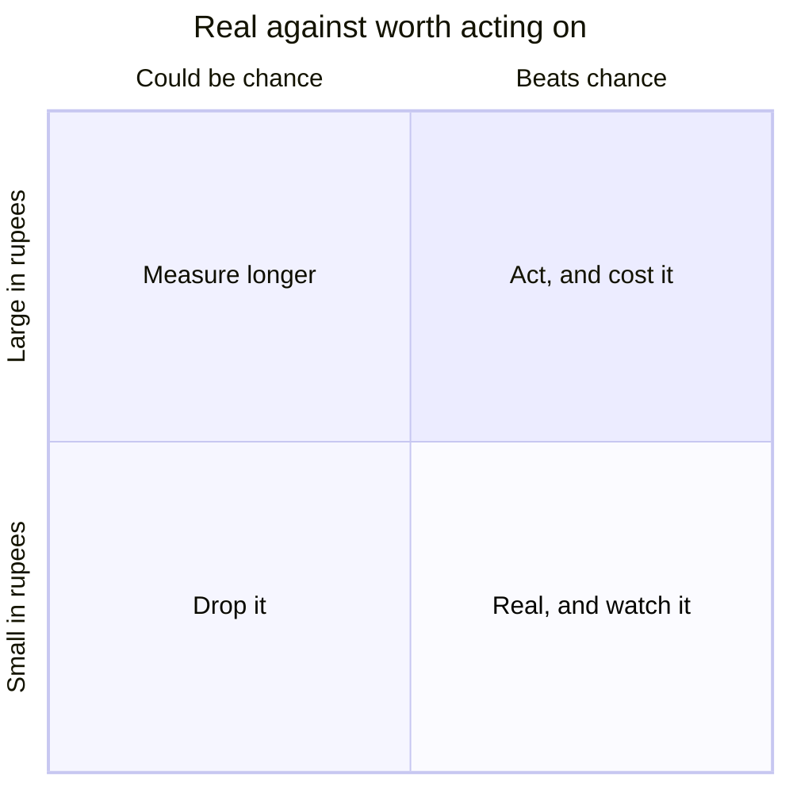
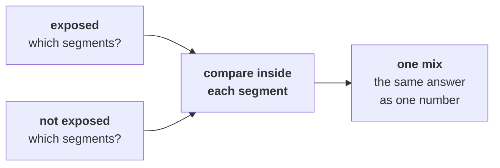
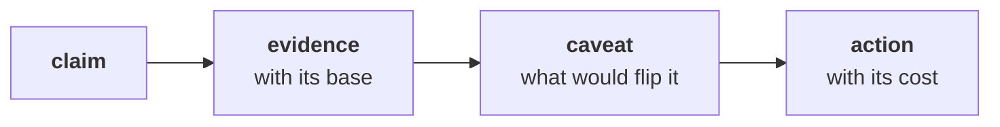
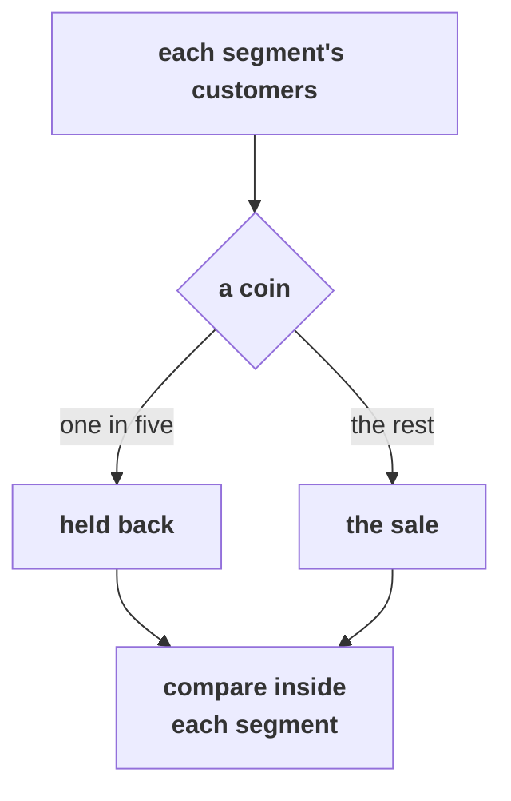

# Real, worth it, and caused: the board as it goes up

The board work for Week 1, Thursday, in the order it is drawn. The deck, the notebooks, the companion
page and the cheat sheet carry the same drawings, so what a learner copies here is what they meet
everywhere else today.

---

## First drawing: three questions, three checks, one note

Meera's three questions go up on the left, and the room names the check each one needs before any
tool opens. The note on the right stays on the board all day.

Beside it, the measure for the whole day in one line: **delivered revenue per member per quarter**.

---

## Second drawing, chapter 1: two stories for any gap, and four ways to test it

Under it, the four options in a row, each with what it costs on 44 member totals: the shuffle (under
a second, the call), the textbook test (one line, the second route), the bootstrap (chapter 2), and
waiting for Q3 (a quarter). The switch fact goes under the textbook test: thousands of well-behaved
rows.

---

## Third drawing, chapter 1: the shuffle, with the room's cards

The ten invented cards go up as two columns, Q1 and Q2, with the real gap of Rs 880 under them. Each
pair's ten shuffled gaps go up in a row beside their names. The room counts how many reached Rs 880,
and the trainer writes the computer's answer under it: 21 of 1,000.

Under it, the sentence in the form the room will use all day: "If nothing had changed, a gap this
large turns up in about ___ of every 100 shuffles."

---

## Fourth drawing, chapter 2: real against worth acting on

Retail-Core's Rs 110 goes in the bottom left. The room places Retail-Plus itself once it has sized
the fall and priced the offer, and writes the break-even beside it.

---

## Fifth drawing, chapter 3: the count behind a rate

A column of four counts, 10, 30, 100 and 400 orders, with how far one order moves a rate at each: 10
points, 3.3, 1 and 0.25. The line at thirty is drawn across the column and labelled "lead above,
finding below".

---

## Sixth drawing, chapter 4: who got it

Two boxes for the monsoon sale, exposed and not exposed, each split into Retail-Plus and Retail-Core.
The room fills in each box's mix and each cell's spend from its own run in chapter 4, never before.

---

## Seventh drawing, chapter 5: the note, audited

The note's four parts in a row, claim, evidence, caveat and action, with three questions written
under every line of it: a base, a count or chance, a caveat. The headline note goes up first and
the room crosses out what it is missing; the Retail-Plus line is then written into the four parts.

---

## Eighth drawing, chapter 6: the fair comparison

Three questions down the side, who got it, who did not, and what else changed, and the Diwali
design beside them: a coin per customer inside each segment, one in five held back, the measure
agreed in advance.

---

## What is on the board when the day ends

The first drawing, with a tick or "not yet" beside each question in the room's own words; the four
options under the shuffle with the call ringed; the sentence form; the quadrant with Retail-Plus
placed; the line at thirty; the mix boxes filled; the audited note; and the hold-back for Diwali. Photograph it before the room clears: it is Friday's rehearsal script.
