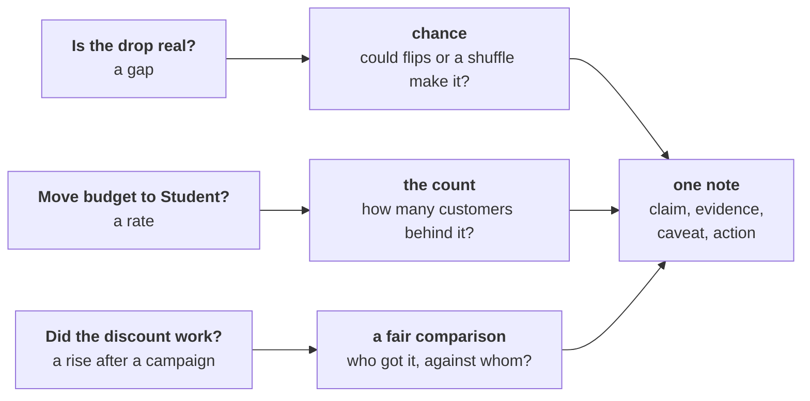
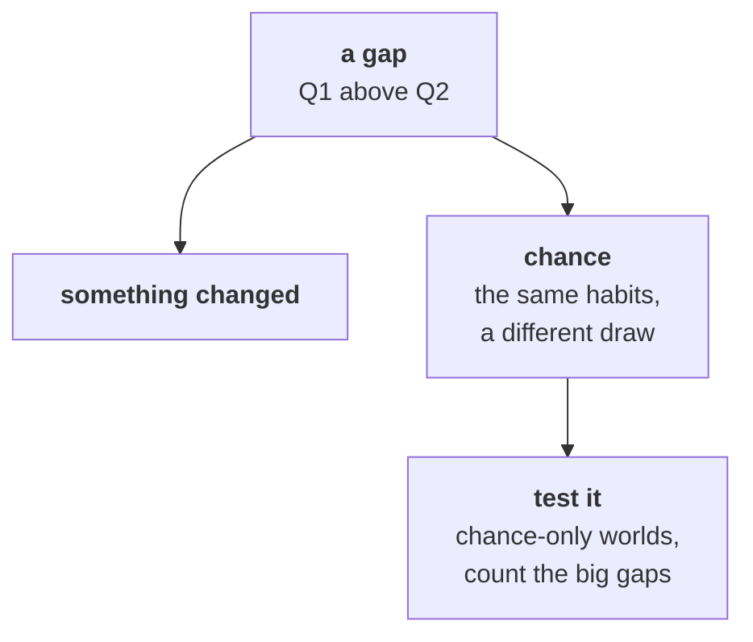
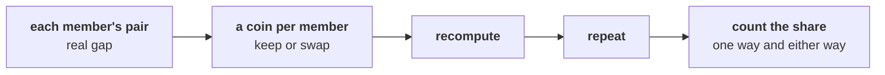
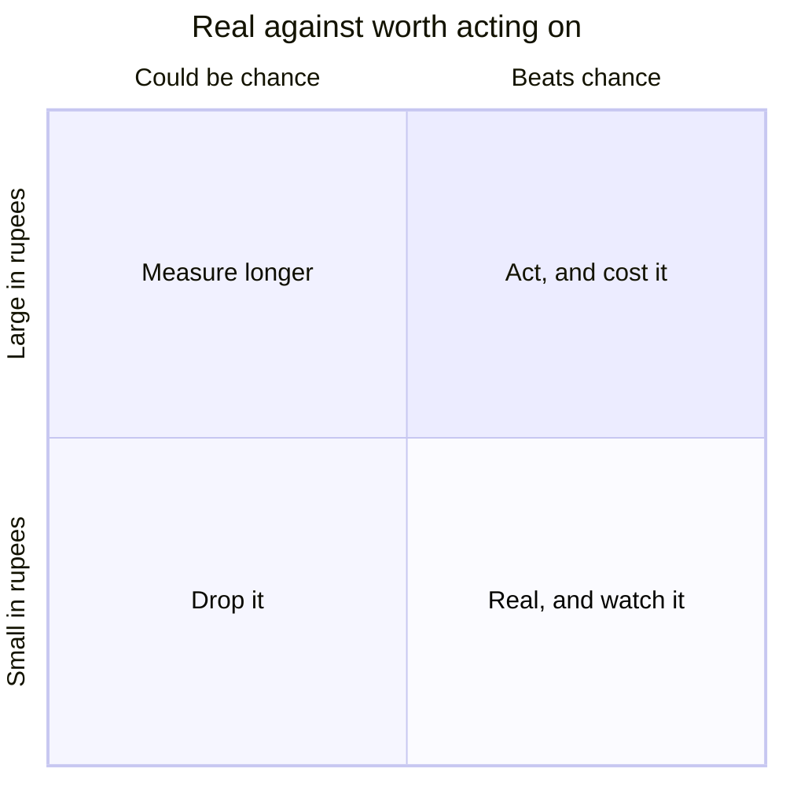
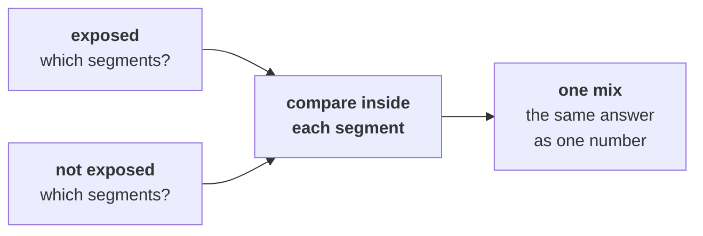
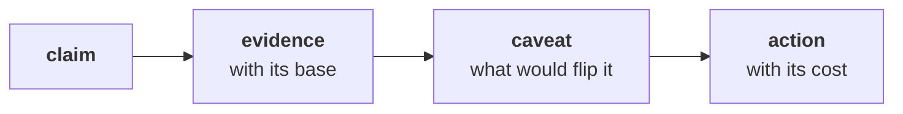
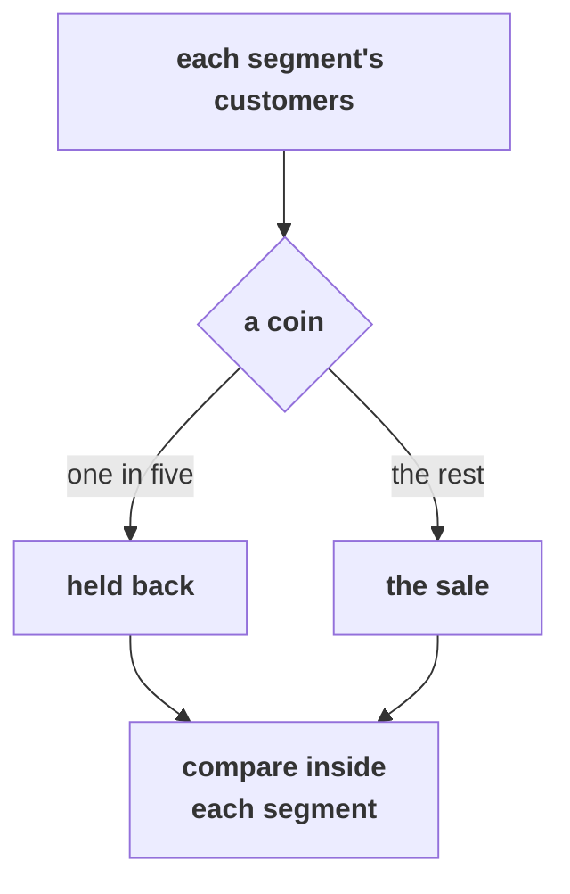

# Which drawings go up on the board, in order, to answer Meera's three questions?

Meera Raghavan, CEO of Kalpa Retail, asks three things before Monday's growth review: is the fall
in Retail-Plus, Kalpa's paid membership tier, real or the wobble every quarter shows; should budget
follow Student's 40 percent rise; and did the monsoon sale, a 15 percent discount aimed at
Retail-Plus in August, really lift revenue 6 percent? The answers go on one page she reads in two
minutes.

---

## Which check does each of Meera's three questions need before it reaches her note?

Meera's three questions go up on the left, and the room names the check each one needs before any
tool opens. The note on the right stays on the board all day, and it has four parts: the claim, the
evidence with its base, the caveat that would change the claim, and the action with its cost. Later
the note is audited: every line is checked for a base, a count or chance, and a caveat.

Beside it goes the measure for the whole day in one line: **delivered revenue per member per
quarter**, the rupees on delivered orders, which Monday settled as the money Kalpa keeps.

---

## Which of four ways to ask "is it real?" fits 22 members measured twice?

A gap between two quarters has two possible stories: something changed, or the same habits gave a
different draw, which is chance. The test builds worlds where only chance is at work and counts how
many of them show a gap as large as the real one.

Under it, the four options go up in a row, each with what separates it on the same 22 Retail-Plus
members measured in both quarters. Flipping each member's pair, a coin deciding which of a member's
two quarters counts as Q1, is the call. Pooling the 44 totals and shuffling them treats them as 44
different people, which is the design for different customers. The textbook paired test is one
library call and the second route, and waiting for Q3 costs a quarter. The switch facts go under the
shuffle (different customers in each group) and under the textbook test (thousands of well-behaved
members).

---

## How often do coin tosses on five members' cards make a gap of Rs 880?

Five invented members' cards go up in rows, each member's Q1 card beside its Q2 card, with the real
gap of Rs 880 under them. Ten tosses of five coins go up beside them, one coin per member, heads
keeping the pair as written and tails swapping it. The room counts how many tosses reached Rs 880,
and the trainer writes the computer's answer under it: 35 of 1,000 tosses, and exactly 1 of the 32
ways five coins can land. Ten tosses are too few to measure a share.

Under it goes the sentence in the form the room uses all day: "If nothing had changed, a gap this
large turns up in about ___ of every 100 flips, and a gap that large either way in about ___."

---

## The fall edges past chance: is it big enough, in rupees against what a fix costs, to act on?

Two questions become two axes: does the gap beat chance, and is it large in rupees against what a
fix would cost?

Retail-Core's fall of Rs 110 a member, which chance makes easily, goes in the bottom left. The room
places Retail-Plus itself once it has sized the fall and priced the offer, and writes the break-even
beside it: the share of the fall an offer must win back to pay for itself.

---

## How far does one more order move a rate, and why does the line sit at thirty customers?

A column of four counts goes up, 10, 30, 100 and 400, with how far one more order moves a rate at
each: 10 points, 3.3, 1 and 0.25. A line at thirty customers is drawn across the column and labelled
"lead above, worth testing below", and beside it goes the reason the line counts customers: thirty
orders from three customers are still three customers' habits.

---

## What does the comparison show inside each segment?

Two boxes go up for the monsoon sale, exposed (the customers who got it) and not exposed, each split
into Retail-Plus and Retail-Core. The room fills in each box's mix and each cell's spend only after
its own run in chapter 4.

---

## How does the Retail-Plus line survive an audit?

The note's four parts go up in a row, and three questions are written under every line of it: does
it carry a base, a count or chance, and a caveat? The headline note goes up first and the room
crosses out what it is missing; the Retail-Plus line is then written into the four parts.

---

## Marketing wants the sale again for more of the base: who got it, what else changed, and what would settle it at Diwali?

Three questions go down the side, who got it, who did not, and what else changed, and the Diwali
design goes beside them: a coin per customer inside each segment, one in five held back, the
measure agreed in advance.

---

## What is on the board when the day ends?

The first drawing stays, with a tick or "not yet" beside each of Meera's questions in the room's own
words. Under the flips sit the four options with the call ringed, and the sentence form. The
quadrant has Retail-Plus placed, the count column its line at thirty customers, the mix boxes their
numbers, the note its audited Retail-Plus line, and the hold-back for Diwali its coin. Photograph it
before the room clears, because it is Friday's rehearsal script.
