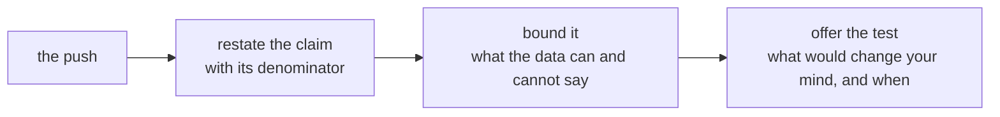

# The growth-review rehearsal

Kavya Nair: "Then say it to me the way you will say it to her, because I will push the way
Marketing will."

## What you defend

The final version of your one-page note from Thursday: Meera's three questions (Retail-Plus, the
Student rise, and the monsoon sale), each with its claim, evidence, caveat and action. That is the
note that goes to Monday's growth review.

## Round one: pairs, then a new pair (50 minutes)

| Part | Minutes | What happens |
|---|---|---|
| The brief and set up | 6 | Monday's room, the note's shape, the pushes and the card; then find a partner. |
| Pair one, first defence | 12 | Two minutes of the note read aloud; six of pushes and answers; four for the partner to fill the feedback card and hand it over. |
| Pair one, swap | 12 | The same, with the roles reversed. |
| Pair two, new partner | 20 | Both defences again, ten minutes each (two to read, five of pushes, three for the card), with a new partner using the harder pushes below. |

## Round two: to the whole room (50 minutes)

Names are called at random. You read your note standing, in two minutes; one person who has not yet
been called puts one push from the lists below; Kavya's review follows in a minute.

## Playing Marketing

You are the marketing lead. You own the campaigns and the Rs 12 crore acquisition request, and you
believe in both. Push hard and fair: ask the question, not an insult, and let the defender finish.
Ask these as they are written or in your own words.

### For pair one

- "Revenue went up 6 percent after the monsoon sale. What more proof do you want?"
- "We asked for Rs 12 crore to bring in new customers. Where does your note say we do not need them?"
- "Student is up 40 percent. Why are you telling Meera not to move budget there?"
- "You removed rows from Finance's data. Whose rows, and who said you could?"
- "Your caveat says 'not yet'. Meera needs a decision on Monday. Which is it?"
- "What would change your mind?"

### For pair two, harder

- "Your p-value is 0.03. So you are 97 percent sure. Why the hedging?"
- "Every quarter wobbles. Why is this one any different?"
- "If the sale had gone to everybody, would you still say it did not work?"
- "You are two weeks into this job. Why should Meera trust your number over our dashboard?"
- "Give me one number I can take to the board. Just one."
- "If the broken reorder feature explains the tier, why do we need your note at all?"

## Marketing's sharpest push, answered

Of all the pushes, this is the one most likely to land on Monday, because it arrives with numbers and
every one of them is true.

> "Customers who got the monsoon sale spent Rs 3,395 each. Customers who did not spent Rs 3,200.
> That is 6.1 percent more, it is our best campaign of the year, and your note tells Meera not to
> repeat it."

**The numbers it cites.** The blend is right: 60 customers got the sale and spent Rs 3,395 on
average; 100 did not and spent Rs 3,200. What the push leaves out is who the 60 were. Half of them
were Retail-Plus members, who spend more in any month, against 40 percent of the 100 the sale missed.

| Segment | Got the sale | Did not | Inside the segment |
|---|---|---|---|
| Retail-Plus | Rs 4,850 (30 customers) | Rs 5,000 (40 customers) | 3.0 percent less with the sale |
| Retail-Core | Rs 1,940 (30 customers) | Rs 2,000 (60 customers) | 3.0 percent less with the sale |
| Blended | Rs 3,395 (60) | Rs 3,200 (100) | 6.1 percent more, because of the mix |

**The answer the evidence supports.** "The 6.1 percent is real arithmetic on a mix. The sale went
mostly to members who spend more anyway, and inside each segment the customers who got it spent 3.0
percent less than the ones who did not: Rs 4,850 against Rs 5,000, and Rs 1,940 against Rs 2,000. At
15 percent off, the sale needed 17.6 percent more volume just to stand still, so as it was designed it
did not pay. I am not saying never run a sale. I am saying run Diwali with a random slice of each
segment held back, agreed in advance, so the next time we say a sale worked, the number holds up in
front of Anand."

**Why it holds.** It agrees with every number Marketing cited, so there is no fight about the data. It
names the one fact the blend hides, who got the sale, and shows it inside each segment. It closes on a
test with a date, which turns the disagreement into a plan Marketing can own. Folding ("fair point, I
will soften it") loses the finding, and overclaiming ("the sale lost money, full stop") loses the
room, since a test has not yet been run on a design that might work.

## Defending

Three moves keep a claim the size the data supports when it is attacked.

Folding drops the caveat to end the argument. Overclaiming calls the uncertainty a certainty in the
other direction. Both lose Meera's trust by Monday afternoon.

## The interview question this trains

[D] A stakeholder attacks your caveat in front of the room; how do you hold it without overclaiming?
