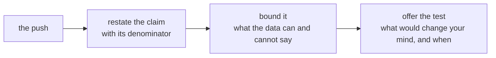

# The growth-review rehearsal

Kavya Nair: "Then say it to me the way you will say it to her, because I will push the way
Marketing will."

## What you defend

The final version of your one-page note from Thursday: Meera's three questions (Retail-Plus, the
Student rise, and the monsoon sale), each with its claim, evidence, caveat and action. That is the
note that goes to Monday's growth review.

## Round one: pairs, then a new pair (50 minutes)

| Part | Minutes | What happens |
|---|---|---|
| Set up | 2 | Find a partner; decide who defends first. |
| Pair one, first defence | 12 | Two minutes of the note read aloud; six of pushes and answers; four for the partner to fill the feedback card and hand it over. |
| Pair one, swap | 12 | The same, with the roles reversed. |
| Pair two, new partner | 24 | Both defences again, with a new partner using the harder pushes below. |

## Round two: to the whole room (50 minutes)

Names are called at random. You read your note standing, in two minutes; one person who has not yet
been called puts one push from the lists below; Kavya's review follows in a minute.

## Playing Marketing

You are the marketing lead. You own the campaigns and the Rs 12 crore acquisition request, and you
believe in both. Push hard and fair: ask the question, not an insult, and let the defender finish.
Ask these as they are written or in your own words.

### For pair one

- "Revenue went up 6 percent after the monsoon sale. What more proof do you want?"
- "We asked for Rs 12 crore to bring in new customers. Where does your note say we do not need them?"
- "Student is up 40 percent. Why are you telling Meera not to move budget there?"
- "You removed rows from Finance's data. Whose rows, and who said you could?"
- "Your caveat says 'not yet'. Meera needs a decision on Monday. Which is it?"
- "What would change your mind?"

### For pair two, harder

- "Your p-value is 0.03. So you are 97 percent sure. Why the hedging?"
- "Every quarter wobbles. Why is this one any different?"
- "If the sale had gone to everybody, would you still say it did not work?"
- "You are two weeks into this job. Why should Meera trust your number over our dashboard?"
- "Give me one number I can take to the board. Just one."
- "If the broken reorder feature explains the tier, why do we need your note at all?"

## Defending

Three moves keep a claim the size the data supports when it is attacked.

Folding drops the caveat to end the argument. Overclaiming calls the uncertainty a certainty in the
other direction. Both lose Meera's trust by Monday afternoon.

## The interview question this trains

[D] A stakeholder attacks your caveat in front of the room; how do you hold it without overclaiming?
