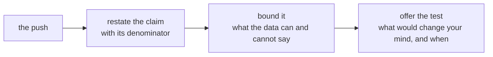

# Does your note hold when Marketing pushes?

Kavya Nair: "Then say it to me the way you will say it to her, because I will push the way
Marketing will."

**Who needs the answer.** Meera Raghavan, Kalpa Retail's CEO, at Monday's growth review, with the
marketing lead in the room. A caveat that folds under a push sends her budget after a number that has
not earned it, and one that overclaims loses the room.

**The questions on the way.**

1. What are you defending?
2. How does round one run, and how does round two?
3. What will a partner playing Marketing push on?
4. How do you answer the push whose every number is true?
5. How do you hold a caveat without folding or overclaiming?

## What are you defending?

The final version of your one-page note from Thursday, the note that goes to Monday's growth review.
It answers Meera's three questions, each in four parts: the claim with its number and what it is out
of, the evidence and how it was checked, the caveat that would change the claim, and the action with
its cost. Bring your own note; the rules it rests on, as the room drew them on Thursday, are these.

| Meera's question | The rule your answer rests on |
|---|---|
| Is Retail-Plus's gap real, and is it worth acting on? | Real and worth acting on are two questions: a shuffle test says how often chance alone makes a gap that large, and the gap's size in rupees against the cost of acting says whether to act, and at what scale |
| Should budget move to the Student rise? | A rate on a handful of orders goes beside its count, and a count too small to call a trend carries no budget until it grows |
| Did the monsoon sale work? | A blended average can rise while every segment falls, when the people who got the sale differ from those who did not; compare like with like, inside each segment |

One thread from Tuesday runs through the Retail-Plus answer: the head of Retail-Plus forwarded a member's
complaint that the app's reorder feature had been broken for six weeks, and your note carries that
cause as a hypothesis with the test that would settle it.

## How does round one run, and how does round two?

Round one runs in pairs for 50 minutes.

| Part | Minutes | What happens |
|---|---|---|
| The brief and the modelled push | 12 | Monday's room, the note's shape, the pushes and the card; Marketing's sharpest push, below, answered once aloud with a TA reading Marketing's lines; then find a partner. |
| Pair one, first defence | 10 | Two minutes of the note read aloud; five of pushes and answers; three for the partner to fill the feedback card and hand it over. |
| Pair one, swap | 10 | The same, with the roles reversed. |
| Pair two, new partner | 18 | Both defences again, nine minutes each (two to read, four of pushes, three for the card), with a new partner using the harder pushes below. |

Round two runs to the whole room for 50 minutes. Names are called at random. You read your note
standing, in two minutes; one person who has not yet been called puts one push from the lists below;
Kavya's review follows in a minute.

## What will a partner playing Marketing push on?

You are the marketing lead. You own the campaigns and the Rs 12 crore acquisition request, and you
believe in both. Push hard and fair: put each push as a question and let the defender finish.
Ask these as they are written or in your own words.

### Which pushes does pair one use?

- "We asked for Rs 12 crore to bring in new customers. Where does your note say we do not need them?"
- "Student is up 40 percent. Why are you telling Meera not to move budget there?"
- "You removed rows from Finance's data. Whose rows, and who said you could?"
- "Your caveat says 'not yet'. Meera needs a decision on Monday. Which is it?"
- "What would change your mind?"

### Which harder pushes does pair two use?

- "Your p-value is 0.03. So you are 97 percent sure. Why the hedging?"
- "Every quarter wobbles. Why is this one any different?"
- "If the sale had gone to everybody, would you still say it did not work?"
- "You are two weeks into this job. Why should Meera trust your number over our dashboard?"
- "Give me one number I can take to the board. Just one."
- "If the broken reorder feature explains the tier, why do we need your note at all?"

## How do you answer the push whose every number is true?

Of all the pushes, this is the one most likely to land on Monday, because it arrives with numbers and
every one of them is true.

> "Customers who got the monsoon sale spent Rs 3,395 each. Customers who did not spent Rs 3,200.
> That is 6.1 percent more, it is our best campaign of the year, and your note tells Meera not to
> repeat it."

**The numbers it cites.** The blend is right: 60 customers got the sale and spent Rs 3,395 on
average; 100 did not and spent Rs 3,200. What the push leaves out is who the 60 were. Half of them
were Retail-Plus members, who spend more in any month, against 40 percent of the 100 the sale missed.

| Segment | Got the sale | Did not | Inside the segment |
|---|---|---|---|
| Retail-Plus | Rs 4,850 (30 customers) | Rs 5,000 (40 customers) | 3.0 percent less with the sale |
| Retail-Core | Rs 1,940 (30 customers) | Rs 2,000 (60 customers) | 3.0 percent less with the sale |
| Blended | Rs 3,395 (60) | Rs 3,200 (100) | 6.1 percent more, because of the mix |

**The answer the evidence supports.** "The 6.1 percent is real arithmetic on a mix: the average rose
only because more high spenders got the sale. Half the customers who got it were members who spend
more anyway, and inside each segment the customers who got it spent 3.0 percent less than the ones
who did not: Rs 4,850 against Rs 5,000, and Rs 1,940 against Rs 2,000. At 15 percent off, the sale
needed 17.6 percent more volume just to stand still, so as it was designed it did not pay. Run
Diwali with a random slice of each segment held back, agreed in advance, so the next time we say a
sale worked, the number holds up in front of Anand."

**Why it holds.** It agrees with every number Marketing cited, so there is no fight about the data. It
names the one fact the blend hides, who got the sale, and shows it inside each segment. It closes on a
test with a date, which turns the disagreement into a plan Marketing can own. Folding ("fair point, I
will soften it") loses the finding, and overclaiming ("the sale lost money, full stop") loses the
room, since a test has not yet been run on a design that might work.

## How do you hold a caveat without folding or overclaiming?

Three moves keep a claim the size the data supports when it is attacked.

Folding drops the caveat to end the argument. Overclaiming calls the uncertainty a certainty in the
other direction. Both lose Meera's trust by Monday afternoon.

## Which interview question does this train?

[D] A stakeholder attacks your caveat in front of the room; how do you hold it without overclaiming?
