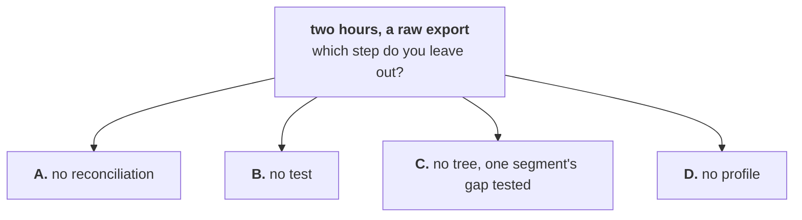

# Which approach fits each case, sized how, and what would make you switch?

Each case is a question an analytics screen asks, set at Kalpa: a situation, a few ways a team could
answer it, and a clock. Read it once, think for three minutes on paper, then answer aloud to your
partner in two minutes. Two answers go to the room before the model answer is read.

**Who needs the answer.** An interviewer asking the design question needs it, and so does the Kalpa
stakeholder behind each case who acts on the call: Meera Raghavan, the CEO; Anand Iyer, the finance
controller; and the app team's head of product. Each of them hears a call without a size, or without
the fact that would switch it, as an opinion.

**The questions on the way.**

1. What do you leave out when Meera wants a first read in two hours?
2. Which check runs first when zero rejects meet a Rs 20 lakh gap?
3. Can 5 of 12 visits beat 31 percent of 1,200?

Every case asks the same three things, because every design question in an interview does: which
approach fits, sized how, and what would make you switch. The numbers marked illustrative are set
for the case and are not Kalpa's records.

## Case 1: what do you leave out when Meera wants a first read in two hours?

*[F] You have two hours and a raw export; what do you do first, and what do you skip?* At work,
this is the call an analyst makes on every quarter's first read, when the books are still open and
the review is fixed.

Meera Raghavan wants a first read on Q3 booked revenue by segment before Monday's review. The raw
export from the ERP, the enterprise system where Kalpa's orders and books are recorded, lands on
your screen with two hours to go, about 2,000 orders (illustrative),
and nobody has checked it. Finance will close the quarter's books after the review.

**The real company it is like.** DMart (Avenue Supermarts) published its July to September 2025
standalone revenue, Rs 16,218.79 crore across 432 stores, as a business update on 3 October 2025,
with the figures stated as provisional and subject to limited review, and reported the quarter's
results in a regulatory filing on 11 October 2025 (Business Today, 11 October 2025). A first read
that goes out before the books close is normal, and its worth depends on what it has been checked
against.

Every plan below fits inside the two hours and leaves out one step. Size each from the lab's pace:
profile every field 20 minutes; clean with a decisions log 30; reconcile to the ERP's own control
totals, its count of orders and sum of rupees for the quarter, 15; decompose the change along the
revenue tree by segment 25; one shuffle test of whether chance alone could make the gap 15; and the
four-part note (claim, evidence, caveat, action) 15.

| Option | What it does |
|---|---|
| A | Profile, clean with a log, decompose, one shuffle test on the biggest segment gap, and the note |
| B | Profile, clean with a log, reconcile, decompose, and the note marked provisional, with no test |
| C | Profile, clean with a log, reconcile, one shuffle test on one segment's gap, and the note on that segment |
| D | Clean with a log, reconcile, decompose, one shuffle test, and the note, with no profile first |

On your paper, write the option you choose and the minutes each plan costs, the one step you will
not drop at any point on the clock and why, and the fact about the export that would make you
switch, and to what.

## Case 2: which check runs first when zero rejects meet a Rs 20 lakh gap?

*[S] Walk me through how you clean and check a dataset you have never seen.* At work, this is the
first quarter out of any new system, when Finance and a dashboard disagree and someone must say
which number is the reference.

The first full quarter out of the migrated ERP is about 50,000 rows (illustrative). Your cleaning
pass reports zero rejects. The dashboard built on it shows the quarter Rs 20 lakh above Anand
Iyer's books, and Anand wants to know by tomorrow which number Meera should see.

**The real company it is like, loosely.** TSB, the UK bank, moved its customers' records from Lloyds
Banking Group's platform to its owner Sabadell's Proteo4UK platform in April 2018. The Register,
reporting the independent review in November 2019, said the move left 1.9 million customers unable
to view their accounts, and in December 2022 the UK's Financial Conduct Authority and Prudential
Regulation Authority fined TSB a total of £48.65 million.
The likeness is loose, since TSB's customers were locked out of a new platform and this case is a
quarter's total trusted before it was reconciled; what the two share is that a new system's output
is the first thing to check.

A bridge walks one total to another, one explained move at a time, and Finance's ledger is its own
record of every order.

| Check | What it catches | Cost on 50,000 rows |
|---|---|---|
| A. Rows against distinct order ids | A batch posted twice | One cell, seconds |
| B. What the code did with values it could not read | Values set to zero or skipped without a log line | One cell, a few minutes to read |
| C. A rupee bridge by month against Finance | How big the gap is, and in which month | About 30 minutes |
| D. Every order matched against Finance's ledger | Which orders differ, by name | Most of a day, and the ledger from Finance |

On your paper, write the order you run them in and why, the point at which you stop, and what you
tell Anand tonight, before the gap is explained.

## Case 3: can 5 of 12 visits beat 31 percent of 1,200?

*[D] A stakeholder attacks your caveat in front of the room; how do you hold it without
overclaiming?* At work, this is every pilot a product team wants to ship on a week's numbers.

Kalpa's app team tried a redesigned checkout for a week: 5 of 12 visits converted, 42 percent. The
current checkout converted 31 percent of 1,200 visits in the same week (illustrative). Your note says
"promising, still to be proven". In the review, the product head says: "Forty-two beats thirty-one. Your
caveat is costing us a week. Ship it to everyone."

**The real company it is like.** At Microsoft's Bing, an idea for showing ad headlines sat unbuilt
for more than six months. When it was finally tested, revenue jumped so far that an alert for "too
good to be true" results fired; the analysis showed a real 12 percent lift, worth more than $100
million a year in the US (Kohavi and Thomke, Harvard Business Review, September to October 2017).
That number was checked on the test's own traffic before anyone believed it.

| Option | What it does | What it costs |
|---|---|---|
| A. Ship to everyone now | Replace the checkout on the 42 percent | Nothing today; a loss nobody measures if the 42 is luck |
| B. Keep the caveat, keep the pilot small | Wait for more weeks at about 12 visits a week, with the current checkout's visits beside them | About 14 weeks |
| C. Split the traffic in half | Each checkout gets half the visits until each has about 300 | About half a week at 1,200 visits a week |
| D. Give the new checkout one visit in ten for a fortnight | A cautious rollout | About 240 new-checkout visits beside about 2,160 on the current one, over two weeks |

Take about 300 visits per checkout as the case's given size for telling 42 percent from 31 percent at
the usual bar, and size each option in visits and days from the traffic above.

On your paper, write your first sentence back to the product head, the option you offer with its
size and its time, and what would make you agree to ship without it.
