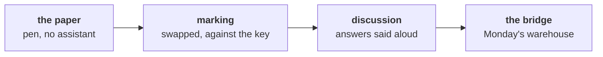

# What will Saturday's paper ask, and how do you get ready tonight?

Ships tonight. Twenty minutes of reading and recall, and nothing to install. Saturday puts the week
under questioning on paper, and Monday's growth review is the real audience for every answer.

---

## What does Saturday's paper test, and how is it marked?

Meera set the bar on Thursday, and it is the bar Saturday's paper and Monday's review both hold you
to:

> "One page, two minutes. If the honest answer is 'we do not know yet', say so and tell me what
> would tell us."

Every question on the paper is a Kalpa business question first and a technique question second, the
order interviewers use.

The paper is objective and runs two hours: blanks answered from a word bank, pairs from a match
table, statements judged true or false with their reason, one correct option, more than one correct
option, scenario sets, applied maths with the working shown, and putting steps in order. Most items
are hard, because they are written the way an interview asks: a situation, the number on the table,
and the call you would make. It is
ungraded. Papers are swapped and marked against the key, then the most-missed questions and the
week's interview questions are discussed aloud, with names called at random.

---

## Which words does the paper assume you know?

Fill these in from memory tonight, one line each, without opening a notebook. The ones you cannot
fill in are the ones to reread.

| Word | What it means, in your own words |
|---|---|
| Orders per customer | |
| Like-for-like | |
| Identity rule | |
| Reconciliation | |
| Rejects log | |
| Chance-only world | |
| p-value | |
| Confounder | |
| Caveat | |

---

## How can a number be computed correctly and still be wrong?

A number can be wrong in two different ways. It can be computed wrongly, or it can be computed
correctly on the wrong rows, the wrong window or the wrong unit. The paper tests the second kind far
more than the first, because the second kind is what reaches a CEO.

Pick one number you computed this week and write one sentence on how it could have been computed
correctly and still have been wrong. Bring the sentence; it is a good answer to have ready when your
name is called.

---

## What do you check tonight?

1. Write the note's four parts, in order, and the p-value sentence, from memory. Then check both
   against Thursday's material. Both are on Saturday's paper.
2. Rerun the one step of the lab your TA marked for you, on the practice export, and write one line
   under your lab note on what you will do differently.
3. Nothing to install. Week 2 works in a live Postgres connection from VS Code, and the setup steps
   arrive on Sunday evening.

---

## Which line do you carry into Saturday?

> A total you have not reconciled is a guess with a decimal point.
