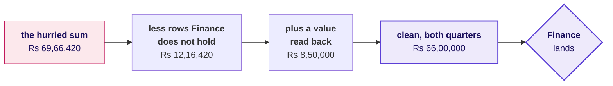
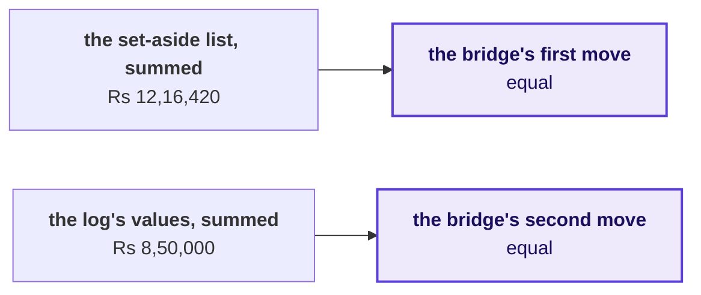
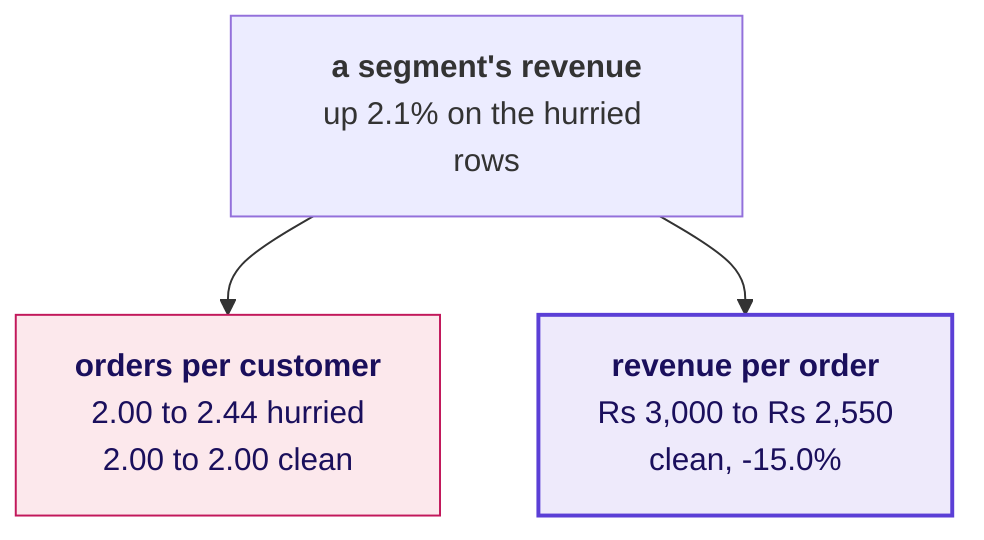
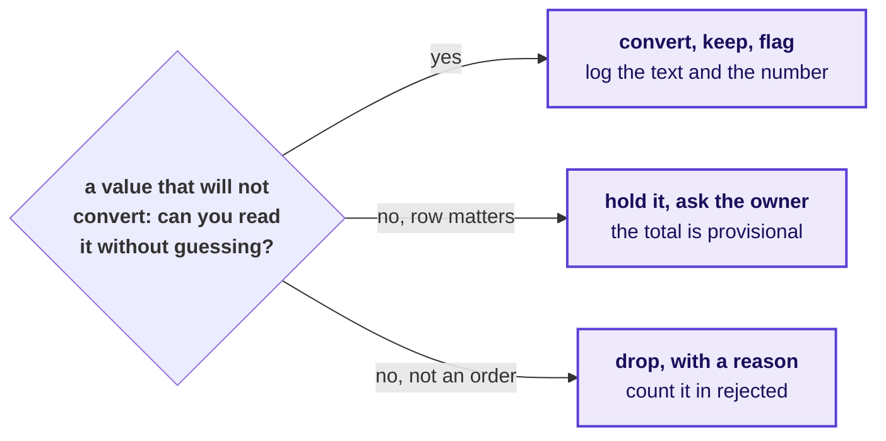
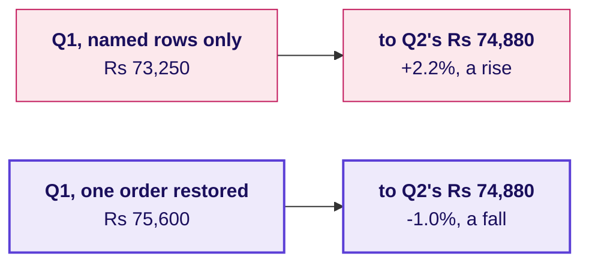
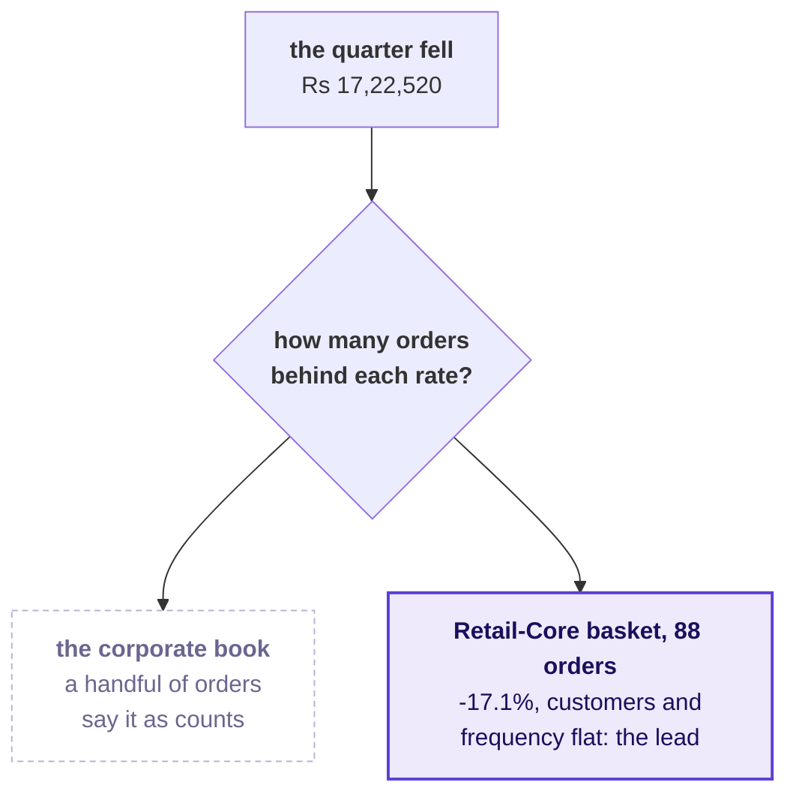
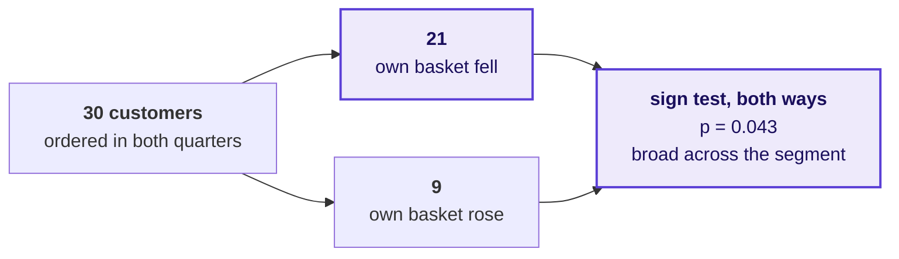

# Where the room broke

Week 1, Day 5. The lab debrief.

Kicker: WEEK 1  ·  FRIDAY  ·  THE LAB DEBRIEF
Quote: Until your numbers match ours, Finance will not act on a drop measured from an ERP export.
Who: Anand Iyer, finance controller, Kalpa Retail, to the data and AI team at Kalpa's Global Capability Centre

```notes
LIVE, one minute. Anand said this on Wednesday, and this morning most of the room shipped a number
Finance would have sent back. The debrief runs forty minutes as three chapters, one per place most
rooms break: chapter 1 before lunch (20 minutes, this minute included), chapters 2 and 3 after it
(10 minutes each, the last slide included). Each chapter pairs with a notebook of the same number in
notebooks/, which runs on this morning's export and opens now that the clock has stopped. The slides
that show a trap's mechanism carry an invented export's numbers, labelled invented on the slide;
this morning's own numbers are in the day sheet's debrief table, to say aloud, and in the notebooks'
your-turn cells, to type live on the projector.
```

---

## SECTION 1: The reconciliation, skipped
*The step with no new number in it goes first when the clock runs, and Finance reads it first.*

```notes
LIVE. Twenty minutes, before lunch. Notebook 1, C2_W01_D05_01_debrief_quarters_STUDENT.ipynb, goes on
the projector at S5 and stays there to S9. Close with two learners reading their second-look line
from the lab notebook.
```

---

## S1. Anand reads the note before Meera does
*The metric is booked revenue per quarter, and the note's first line is its Q1 to Q2 change.*

```stats
value: Anand Iyer | label: who asks first | note: the finance controller, before any number reaches Meera
value: Q1 to Q2 | label: the metric | note: booked revenue, the note's first line
value: direction | label: what a wrong number costs | note: a quarter reported the wrong way round
```

**The client asks.** Can the number in your note go to Meera as it stands?

```notes
LIVE, 2 minutes. Say who asks and why it matters to them: Anand returns any figure that does not tie
to his control total, and Meera acts on the first line of the note. A wrong first line sends
Monday's review after the wrong question, while Marketing's Rs 12 crore request is judged against a
quarter that did not happen. Then one sentence of likeness, even when D2 is left to self-study:
Nykaa reports gross merchandise value of Rs 4,182 crore and revenue from operations of Rs 2,155
crore for the same quarter, so every figure there names its base and bridges to the books.
```

---

## D2. Two companies that bridge before they claim
*A retailer that reports two numbers every quarter, and a pipeline that lost rows without a sound.*

```cards
icon: receipt | eyebrow: Nykaa, April to June 2025 | title: GMV Rs 4,182 cr, revenue Rs 2,155 cr | body: GMV is everything ordered, before cancellations, returns and tax come out; revenue from operations is what the company books as its income. Quote one to the owner of the other and you are out by nearly half. Source: FSN E-Commerce Ventures press release, 12 August 2025. | tone: dark
icon: file-x | eyebrow: Public Health England, October 2020 | title: 15,841 cases left out | body: Positive cases from 25 September to 2 October missed the daily figures because files exceeded a size limit. No step raised an error. Source: UK government statement, 4 October 2020.
```

```notes
SELF-STUDY, or one minute live if the room is ahead. The point of both: an error that drops or
doubles rows is silent, and only a comparison with a total from outside the file finds it.
```

---

## S3. The headline a hurried run sends
*Invented export: rows kept as they arrived and a value that would not convert set to zero, with no error.*

```stats
value: Rs 31,50,000 | label: Q1 as summed | note: 83 rows, invented
value: Rs 38,16,420 | label: Q2 as summed | note: 92 rows, invented
value: +21.2% | label: Q1 to Q2 | note: "Q2 grew; no action on the top line"
```

The arithmetic is right, the file is Finance's own export, and the note built on it tells Meera the quarter was a good one.

```notes
LIVE, 2 minutes. The numbers are the invented export's, so the mechanism shows without naming what
this morning's file holds. Read the three numbers and the sentence, then say the room's own hurried
headline aloud from the day sheet's debrief table and ask how many sent a headline with a plus sign,
without naming anyone; the TA tally already knows, and the room should say it.
```

---

## S4. Question: what do you check before sending it?
*The export came with Finance's control totals, and a note that says nothing else.*

**Question.** Choose one: a) the median order, in case one large order moved the total on its own; b) the p-value of the Q1 to Q2 change, with 2,000 shuffles; c) orders and rupees per quarter against Finance's control totals; d) the segment split, to see which of the four segments grew the most.

```notes
LIVE, 1 minute. Take letters. Option a is Monday's instinct and a good one on a different day; d
is the decomposition, which is the right step on data you already trust.
```

---

## S5. Answer: both quarters miss the books
*Invented export: the hurried run against the control totals, in orders and in rupees.*

| Quarter | Rows summed | Finance's orders | Rupees summed | Finance's rupees |
|---|---|---|---|---|
| Q1 | 83 | 83 | Rs 31,50,000 | Rs 40,00,000 |
| Q2 | 92 | 84 | Rs 38,16,420 | Rs 26,00,000 |

Two different errors, and the headline carries them both.

```notes
LIVE, 2 minutes. The answer is c. Open notebook 1 on the projector: its first level prints this
morning's hurried headline beside the books, and its your-turn cell, typed live, prints this
morning's version of this table. Point at the two kinds of miss: a quarter with the right count and
the wrong rupees is chapter 2.
```

---

## S6. Four ways to check, sized
*Invented export: minutes of thought decide it, and what each option needs from outside the file.*

| Option | Analyst minutes | Needs | Headline it lets through | Points off the books |
|---|---|---|---|---|
| A. Trust the pass | 0 | nothing | +21.2% | 56.2 |
| B. Count check only | 2 | Finance's order counts | -17.5% | 17.5 |
| C. Counts and rupees, with a bridge | 15 | Finance's rupee totals | -35.0% | 0.0 |
| D. Match every order to the ledger | about 120 | Finance's ledger | not run: no ledger came with the export | not run |

**The rule.** C, because it needs only the control file that came with the export and lands to the rupee. Switch to D when there is no control total, or when C's bridge will not close.

```notes
LIVE, 3 minutes. Then run the sizing cell in notebook 1, which sizes the same options on this
morning's file, with D marked not run for the same reason: no ledger came with either export. Land
two points: B is where most people who did check stopped, and it still leaves the headline well off
the books; D would name every order that differs and costs the afternoon, once Finance sends the
ledger. Minutes are the lab brief's pace, D's an estimate for a request to Finance and a join.
```

---

## S7. The bridge from the hurried sum to the books
*Invented export: two moves, each a line in the decisions log, and the walk closes on Finance's total.*



With both quarters on the books, the invented export's headline is a fall of 35.0 percent, Rs 40,00,000 to Rs 26,00,000.

```notes
LIVE, 3 minutes. Ask which move is larger before revealing it. Then run level 3 of notebook 1: its
checks say this morning's bridge lands, and its your-turn cell, typed live, draws it; say this
morning's two moves aloud from the day sheet. The your-turn cell after it lists the rows; leave that
to the room tonight.
```

---

## S8. The decision the wrong number would have made
*Invented export: growth reads as no action, a fall reads as find the branch, and only one is true.*

```cards
icon: circle-x | eyebrow: The hurried note | title: Q2 grew 21.2% | body: No investigation, and Monday's review hears the quarter was fine. | tone: dark
icon: circle-alert | eyebrow: Counts checked | title: Q2 fell 17.5% | body: The right direction at half the size, so the fix gets half the attention.
icon: circle-check | eyebrow: Counts and rupees | title: Q2 fell 35.0% | body: Rs 14,00,000 to explain, and the tree says where.
```

**In the interview.** [F] You have two hours and a raw export; what do you do first, and what do you skip?

```notes
LIVE, 2 minutes. The error changed the sign, so it changed the decision itself. Say this morning's
three headlines aloud from the day sheet's debrief table, then ask one learner what Meera would have
done on Monday with each of the three notes.
```

---

## S9. A second route: sum the decisions themselves
*Invented export: the set-aside list and the log, each summed on its own, against the bridge's moves.*



**The rule.** Show Finance the forward bridge, because it starts from their export. Run the two sums before you send it: they prove every rupee the bridge moved is a row set aside or a value in the log, and whether each decision was right is the order-level match's question.

```notes
LIVE, 2 minutes. Run the second-route cell in notebook 1; both checks pass on this morning's file.
Say what the route proves and what it leaves open: the bridge's moves were found by subtracting
totals, and these sums count the decisions themselves, so a row set aside without its log line, or a
value zeroed where it should have been read, makes the two disagree.
```

---

## D10. The same rows can also move a branch
*Invented export: repeated rows for the same customers read as customers ordering more often.*



Rows Finance does not hold manufacture a frequency rise where nothing changed, and hide a basket fall behind a segment that looks steady. Chapter 3 reads the clean tree.

```notes
SELF-STUDY, in the depth section of notebook 1, whose your-turn cell runs the same comparison on
this morning's file. Run it live for two minutes only if the tally shows more than a quarter of notes
named a frequency branch.
```

---

## S11. Why the clock removes this step first
*Fifteen of ninety minutes, and its only output is a yes or a no, so it feels like the step that can wait.*

```bar
label: Profile | value: 20
label: Clean | value: 30
label: Reconcile | value: 15
label: Decompose | value: 25
```

**Kavya's review.** A number that has not been reconciled can point the wrong way, and this morning it did. Put the two checks in a cell before the first number you plan to send.

```notes
LIVE, 2 minutes, then two learners read their second-look line: one whose totals landed and one
whose did not. Thank both the same way. Then lunch.
```

---

## SECTION 2: The pass that looks clean
*A zero-reject pass on a file you know is dirty is the first thing to investigate.*

```notes
LIVE, after lunch. Ten minutes. Notebook 2, C2_W01_D05_02_debrief_values_STUDENT.ipynb, on the
projector from S14.
```

---

## S12. Anand's analyst audits the note first
*The Q1 total is the base every Q1 to Q2 rate divides by.*

```stats
value: Q1 booked | label: the metric | note: the base every Q1 to Q2 rate divides by
value: the analyst | label: who asks | note: Anand's auditor, then Meera
value: half | label: what a wrong base can cost | note: the fall reported at half its size
```

**The client asks.** Your pass reports zero rejects and every count lands. Is it finished?

```notes
LIVE, 1 minute. A base that is short by one large order can halve the fall the note reports. Nobody
argues with the direction, so nobody acts at the right scale, and when Finance finds the order, every
other number in the note is doubted with it. One sentence of likeness, even when D13 is self-study:
JPMorgan's own task force found a risk spreadsheet that divided by a sum instead of an average and
never raised an error.
```

---

## D13. A formula that ran clean and was wrong
*JPMorgan's own task force found a spreadsheet that never errored and halved a risk measure.*

```cards
icon: landmark | eyebrow: JPMorgan Chase, 2012 | title: A sum where an average belonged | body: A risk model run through spreadsheets "divided by their sum instead of their average", likely muting volatility, how far prices were shown to swing, by a factor of two, and lowering the VaR, the bank's estimate of a bad day's loss. Source: the task force report, January 2013, as quoted by The Baseline Scenario, 9 February 2013. | tone: dark
icon: trending-down | eyebrow: The cost | title: $6.2 billion | body: The trading losses from what became known as the "London Whale" trades in the bank's Chief Investment Office. Source: FCA press release, 19 September 2013.
```

```notes
SELF-STUDY. The parallel to land: the sheet produced a plausible number every day, and only a check
against something outside the sheet could have caught it.
```

---

## S14. Zero rejects, and every count lands
*Invented export: the most natural line of Python in the week, a try that sets a failure to zero.*

```python
def to_int_or_zero(v):
    try:
        return int(v)
    except ValueError:
        return 0          # the file now "converts" cleanly
```

```stats
value: 83 | label: Q1 orders | note: Finance: 83, invented
value: 0 | label: rejects reported | note: the try swallowed every failure
value: Rs 31,50,000 | label: Q1 as summed | note: every row kept, invented
```

```notes
LIVE, 2 minutes. Read the code as a hurried analyst's honest attempt: it runs, it reports nothing and
every count lands. Nobody in the room should feel caught. Notebook 2's first level prints this
morning's count and rejects beside it.
```

---

## S15. Question: the rows reconcile, so what is left?
*Input equals kept plus rejected, and the order counts match Finance's.*

**Question.** Choose one: a) nothing, since every row is accounted for; b) the rupees against each control total; c) the median, since one large order may have gone; d) the dates, since the quarter may be cut wrong.

```notes
LIVE, 1 minute. Take letters. The popular wrong answer is a, and it is the answer the zeroing pass
was built, by accident, to produce.
```

---

## S16. Answer: the rupees, and one quarter is short
*Invented export: counts reconcile while rupees do not, and the gap is the value the try swallowed.*


With the base short by 21.3 percent, the note reports a fall of 17.5 percent where the books show 35.0.

```notes
LIVE, 2 minutes. The answer is b. Run level 2 of notebook 2: its checks say this morning's rupees
miss in one quarter while every count lands, and its your-turn cell, typed live, prints which quarter
and by how much; the day sheet's debrief table has the figure. The your-turn cell that finds the row
is for the room tonight.
```

---

## S17. Four answers to a value that will not convert
*Invented export, one value sized: what each option sends and what the checks then show.*

| Option | Minutes | Log lines | Count check | Rupee check | Headline |
|---|---|---|---|---|---|
| A. Zero in a try | 1 | 0 | passes | fails | -17.5% |
| B. Drop with a reason | 2 | 1 | fails | fails | -17.5% |
| C. Read, convert, keep and flag | 3 | 1 | passes | passes | -35.0% |
| D. Hold and ask the owner | a wait | 1 | fails | fails | provisional |

**The rule.** C, when the value can be read without guessing, as an amount exported with its paise, the invented export's 850000.00, can. D when it cannot: a word, a unit that could be lakh or crore. B when the row is not an order. A is the one option that hides its gap.

```notes
LIVE, 2 minutes. Run the options cell in notebook 2, which sizes the same four on this morning's
file. Land the contrast between A and B: the same wrong headline, and B fails the count check, so B's
gap is visible and A's is not.
```

---

## S18. Three honest answers to a value that fails
*Every branch leaves a log line and a number in the reconciliation.*



**In the interview.** [S] Walk me through how you clean and check a dataset you have never seen. A zero-reject pass is a finding: check ids against rows, check what the code did with a value it could not read, and reconcile the rupees.

```notes
LIVE, 1 minute. Ask two learners which branch their own row took this morning and why.
```

---

## D19. The same shape one step later
*Invented export: a filter on the segment name never sees a row whose segment is empty.*



**The rule.** The segments add back to the quarter, in orders and in rupees, before any segment is read. On the invented export they fall one order short in Q1, and a segment that fell reads as a rise.

```notes
SELF-STUDY, level 4 of notebook 2, whose your-turn cells run the same check on this morning's file.
Run it live for two minutes if the tally shows notes that read a segment's move the wrong way round.
```

---

## S20. A second route: account for every value
*Invented export: the rupee check finds the gap from outside the file; this finds it from inside.*


**Kavya's review.** A count check proves the rows are there. Only a rupee check proves the values survived. Setting a value to zero claims the order was worth nothing, so that decision belongs in the log with a reason.

```notes
LIVE, 1 minute. Run the second-route cell of notebook 2; both checks pass on this morning's file. On
a file with no control total, this is the check you still have: it needs nothing outside the file and
tells you where, where the rupee check tells you how much.
```

---

## SECTION 3: The headline on too few orders
*What can a handful of orders carry in the note's first line?*

```notes
LIVE, after lunch. Ten minutes, the last slide included. Notebook 3,
C2_W01_D05_03_debrief_segments_STUDENT.ipynb, on the projector from S25.
```

---

## S21. Choosing which right number leads the note
*The data ties to the books. Which finding does Meera read first?*

```stats
value: Rs 17,22,520 | label: the fall | note: Q1 to Q2, reconciled
value: four | label: segments | note: each with its own count
value: one line | label: what Meera acts on | note: the note's first
```

**The client asks.** Which branch do I open first, and can I act on it on Monday?

```notes
LIVE, 1 minute. Meera and Marketing both read the first line: Meera acts on it, and Marketing
attacks any rate that rests on a handful of orders. A trend claimed from a few orders sends a team
to fix a segment that did nothing while the branch that moved goes unopened. One sentence of
likeness, even when D22 is self-study: IMDb will not rank a title in its Top 250 until it has 25,000
ratings.
```

---

## D22. Two places that count before they rank
*A ratings site that will not rank a title on a few votes, and a foundation that did.*

```cards
icon: star | eyebrow: IMDb Top 250 | title: 25,000 ratings first | body: A title needs at least 25,000 ratings from regular voters, and the weighted rating pulls a title with few votes toward the average of all titles. Source: IMDb Help, ratings FAQ, updated 9 February 2026. | tone: dark
icon: school | eyebrow: Small schools, a public case | title: Best and worst, both small | body: Small schools are over-represented at both ends of the rankings because small samples vary more. Source: Howard Wainer, "The Most Dangerous Equation", in Picturing the Uncertain World, Princeton University Press, 2009.
```

```notes
SELF-STUDY. Wainer's chapter also records that the Gates Foundation had given about $1.7 billion in
education grants by 2001, with small schools central to them; notebook 3 carries the source.
```

---

## S23. A corporate book falls 36.3 percent
*Invented export: true to the rupee, the biggest number on the page, and the headline a hurried note leads with.*

```stats
value: -36.3% | label: corporate revenue | note: Q1 to Q2, invented
value: 5 then 2 | label: orders | note: what the rate rests on, invented
value: Rs 13,88,200 | label: the fall it carries | note: 99.2% of the quarter's, invented
```

```notes
LIVE, 2 minutes. Read it as the headline "corporate is declining; we recommend a retention plan".
The number is correct. What can seven orders carry? This morning's own corporate headline and its
count are in the day sheet's debrief table; say them after the room answers S24.
```

---

## S24. Question: how does it enter the note?
*Meera reads the first line and acts on it.*

**Question.** Choose one: a) as the headline trend, since it is the largest move in rupees on the page; b) as the headline, with a test's p-value printed beside the rate; c) left out of the note, since a handful of orders is too few to matter to anyone; d) as counts, the orders in each quarter, with a question to their owner.

```notes
LIVE, 1 minute. Take letters. Option c is the overcorrection: the corporate rupees are real money
and Meera should hear them, as counts.
```

---

## S25. Answer: count before rate, then choose the lead
*Invented counts: seven orders split by coin flips come out at least as uneven as five and two in 45 percent of worlds.*



```notes
LIVE, 1 minute. The answer is d. The coin flips in the subtitle are the invented export's; type the
your-turn cell in notebook 3 live for this morning's corporate count and its share. The corporate
action is a phone call, which costs nothing; a retention plan built on a handful of orders costs a
quarter.
```

---

## S26. Four ways to choose the lead, sized
*This morning's file: what each option leads with, on how many orders, and how often chance alone produces it.*

| Option | Leads with | Orders | Chance alone | Minutes |
|---|---|---|---|---|
| A. Biggest rupee move | the corporate rate | under thirty | most coin-flip worlds | 5 |
| B. The total, unsplit | revenue -28.5% | 197 | not asked | 2 |
| C. Count before rate | Retail-Core basket -17.1%, Rs 15,400 | 88 | 0.006, quarters flipped | 15 |
| D. Test every segment, run | the smallest of four p-values | under thirty to 88 | 0.006, one of four under 0.05 | 45 |

**The rule.** C: the one consumer move on enough orders to test, small in rupees (0.9 percent of the fall) and led beside the corporate move said as counts. Switch when Meera's question is about accounts rather than rates, when a segment carries hundreds of orders a quarter, or when a second quarter repeats the move.

```notes
LIVE, 2 minutes. Run the options cell in notebook 3; it runs D's four tests, Retail-Core at 0.006 and
the other three from 0.27 to 0.79. B hides that nearly all of the fall is the corporate book. D finds
the same lead here at three times the minutes, and four tests at 0.05 carry about a one-in-five chance
that one looks real by luck, so on another file D leads with a fluke.
```

---

## S27. The branch that moved, tested on its own customers
*The same 30 customers sit in both quarters, so each customer's own two quarters are flipped at random.*

```stats
value: -17.1% | label: revenue per order | note: Retail-Core, Q1 to Q2
value: 12 of 2,000 | label: flipped worlds as large | note: either direction, random.Random(7)
value: p = 0.006 | label: a share of chance-only worlds | note: never the chance of being wrong
```

**In the interview.** [S] Tell me about an analysis you did: what did you find, and how sure are you? The claim with its count, the check that it ties to the books, a test that keeps each customer's two quarters together, and the caveat.

```notes
LIVE, 1 minute. Run the flip cell in notebook 3. The fall was found in the tree, so the note reports
both directions. Read the p-value sentence aloud once, word for word, because Saturday's paper asks
for it. A learner who shuffled segment labels across whole customers reached 0.0195: that answers a
different question, whether Retail-Core moved differently from Retail-Plus, and it is fair for it.
```

---

## S28. A second route: customer by customer
*Of Retail-Core's 30 customers, how many saw their own basket fall, and how often would coin flips split them so?*



**Kavya's review.** Say the count before the rate, every time: the orders in each quarter, and then the percentage.

```notes
The rule to say: the flips say whether the change is bigger than chance, the customer count says
whether it is broad; when they disagree, a handful of customers moved the average. The sign test uses
only each customer's direction, so its p sits above the flips'. LIVE, 1 minute. Run the second-route
cell. Then close the chapter with the note as it should read, from notebook 3.
```

---

## D29. Reserve: keep each customer's quarters together
*The same fall in revenue per customer, tested two ways, and two verdicts.*

```cards
icon: users | eyebrow: Flip each customer's own two quarters | title: p = 0.0015 | body: Every world is one these 30 customers could have produced, so a real fall shows as one. | tone: dark
icon: shuffle | eyebrow: Pool the Q1 and Q2 figures and deal them | title: p = 0.0765 | body: Each customer's two quarters are dealt as strangers, the steadiness of each customer is thrown away, and a real fall reads as chance.
```

**The rule.** Keep each customer's own two quarters together: flip them as a pair when the same customers sit in both quarters, and shuffle labels across whole customers when the groups are different customers. Pooling paired data is the hurried mistake.

```notes
SELF-STUDY, in the depth section of notebook 3, unless more than a quarter of the room pooled the
quarters or shuffled single orders; then run it for three minutes in place of S28. Both cards are
2,000 runs on random.Random(7). The same cell shows single orders shuffled between segments at
0.0755, against 0.0195 with the label moving with the whole customer.
```

---

## D30. Reserve: the typical order
*A few corporate orders drag the mean far from any order a consumer placed.*

```stats
value: Rs 52,657 | label: mean order, clean | note: pulled up by the corporate orders
value: Rs 2,120 | label: median order, clean | note: the typical one
value: 25 times | label: the gap | note: mean over median
```

**The rule.** Describe a file with its median and say what sits above it. Keep the mean for anything that has to reconcile.

```notes
SELF-STUDY unless the tally shows notes quoting a mean as the typical order; then three minutes.
```

---

## S31. The one line you write tonight
*The step where you stalled, rerun alone, and what you will do differently.*

```timeline
label: Tonight | title: Rerun the step | body: On the practice export, the step the TA marked, with the practice set beside it.
label: One line | title: What changes | body: Written under your lab note: the check you will put first next time.
label: Saturday | title: The paper | body: The note's four parts and the p-value sentence, from memory.
```

**Kavya's review.** The lab told you which step you do not own yet. Rerun that step tonight on the practice export.

```notes
LIVE, 1 minute. Close the debrief. The TAs tell each person their marked step privately during the
rehearsal, never aloud to the room.
```
