# Where did the room break?

Week 1, Day 5. The lab debrief.

Kicker: WEEK 1  ·  FRIDAY  ·  THE LAB DEBRIEF
Quote: Until your numbers match ours, Finance will not act on a drop measured from an ERP export.
Who: Anand Iyer, finance controller, Kalpa Retail, to the data and AI team at Kalpa's Global Capability Centre

```notes
LIVE, half a minute. Anand said this on Wednesday, and the lunch tally says how many notes this
morning sent a number Finance would have returned. The debrief runs forty minutes as three chapters, one per place most
rooms break: chapter 1 before lunch (20 minutes, this minute included), chapters 2 and 3 after it
(10 minutes each). Each chapter pairs with a notebook of the same number in notebooks/, which opens
now that the clock has stopped. Every number on these slides comes from an invented export,
labelled invented. This morning's own numbers are in the day sheet's debrief table, to say aloud at each slide,
and in the notebooks' empty your-turn cells, to type live on the projector.
```

---

## S1. Three questions decide whether a note reaches Meera
*Where did this morning's notes break, and what should each step have been?*

```timeline
label: Chapter 1 | title: Do the quarters tie? | body: Do the two quarters in your note match Finance's books?
label: Chapter 2 | title: Is a clean pass done? | body: Every count reconciles and nothing was rejected: is the pass finished?
label: Chapter 3 | title: Which number leads? | body: Which finding leads the note, and how sure can Meera be of it? | tone: dark
```

Each answer raises the next question: a note whose counts tie to the books can still be short in rupees, and a note that is right to the rupee can still lead with the wrong number.

```notes
LIVE, 1 minute. Read the three questions in order and say that each is the question the one before
it leaves open. Say once that the slides run on an invented export so that they name nothing in
this morning's file, and that the notebooks' your-turn cells are where this morning's numbers
appear. Then chapter 1.
```

---

## SECTION 1: Do the quarters tie?
*Do the two quarters in your note match Finance's books, and what did the note say when nobody checked?*

```notes
LIVE. Twenty minutes, before lunch. Notebook 1, C2_W01_D05_01_debrief_quarters_STUDENT.ipynb, goes
on the projector at S7 and stays there to S15, its your-turn cells typed live. Close with two
learners reading their second-look line from the lab notebook.
```

---

## S2. Answered in five questions, before Anand signs
*Who needs the quarters to tie, and which five questions lead there?*

**Who needs the answer.** Anand Iyer, the finance controller, reads the note's first line against his control totals before any number reaches Meera; a first line the wrong way round sends Monday's review after a quarter that did not happen.

```timeline
label: Question 1 | title: What did the hurried pass send? | body: A hurried pass sends a headline.
label: Question 2 | title: Which check, at what cost? | body: Four checks are sized side by side.
label: Question 3 | title: What does a count check fix? | body: It lands the rows and leaves something.
label: Question 4 | title: Which moves close the bridge? | body: Two moves walk the sum to the books.
label: Question 5 | title: Do the decisions sum the same? | body: The log's own sums are the second route. | tone: dark
```

```notes
LIVE, half a minute. Read who needs the answer, then the five questions. Ask the room to hold one
number in mind: the headline their own note led with this morning.
```

---

## S3. Anand reads the note before Meera acts on it
*Who reads the first line first, and what does a wrong one cost?*

```stats
value: Anand Iyer | label: who asks first | note: the finance controller, before any number reaches Meera
value: Q1 to Q2 | label: the metric | note: booked revenue per quarter, the note's first line
value: direction | label: what a wrong number costs | note: a quarter reported the wrong way round
```

**The client asks.** Can the number in your note go to Meera as it stands?

```notes
LIVE, 1 minute. Booked revenue is the rupees of the orders recorded as sales in a quarter, and a
control total is the source system's own count of orders and sum of rupees for a period. Anand
returns any figure that does not tie to his control total, and Meera acts on the first line of the
note: a wrong first line sends Monday's review after the wrong question while Marketing's Rs 12
crore request is judged against a quarter that did not happen. One sentence of likeness, even when
D4 is left to self-study: Nykaa reports gross merchandise value and revenue from operations for the
same quarter, so every figure there names its base and bridges to the books.
```

---

## D4. Nykaa reports two true numbers for one quarter
*Who else has to bridge before they claim a number?*

```cards
icon: receipt | eyebrow: Nykaa, April to June 2025 | title: GMV Rs 4,182 cr, revenue Rs 2,155 cr | body: GMV is everything ordered, before cancellations, returns and tax come out; revenue from operations is what the company books as its income. Quote one to the owner of the other and you are out by nearly half. Source: FSN E-Commerce Ventures press release, 12 August 2025. | tone: dark
icon: file-x | eyebrow: Public Health England, October 2020 | title: 15,841 cases left out | body: Positive cases from 25 September to 2 October missed the daily figures because files exceeded a size limit. No step raised an error. Source: UK government statement, 4 October 2020.
```

```notes
SELF-STUDY, or one minute live if the room is ahead. What both show: an error that drops or doubles
rows makes no sound, and only a comparison with a total from outside the file finds it.
```

---

## S5. The hurried run says Q2 grew 21.2 percent
*What headline does a pass that skips the reconciliation send?*

```stats
value: Rs 31,50,000 | label: Q1 as summed | note: 83 rows, invented
value: Rs 38,16,420 | label: Q2 as summed | note: 92 rows, invented
value: +21.2% | label: Q1 to Q2 | note: "Q2 grew; no action on the top line"
```

On the invented export the pass kept the rows as they arrived and set to zero any value that would not convert; the arithmetic is right, and the note built on it tells Meera the quarter was a good one.

```notes
LIVE, 2 minutes. The numbers are the invented export's, so the mechanism shows without naming what
this morning's file holds. Read the three numbers, then say this morning's hurried headline aloud
from the day sheet's debrief table and ask how many sent a headline with a plus sign, without naming
anyone; the TA tally already knows. Then the question.
```

---

## S6. Question: what do you check before sending it?
*Which check stands between the hurried headline and Meera?*

**Question.** Choose one: a) the median order, in case one large order moved the total on its own; b) the p-value of the Q1 to Q2 change, with 2,000 shuffles; c) orders and rupees per quarter against Finance's control totals; d) the segment split, to see which of the four segments grew the most.

```notes
LIVE, 1 minute. Take letters. Option a is Monday's instinct and a good one on another day; d is
the decomposition, which is the right step on data you already trust.
```

---

## S7. Answer: both quarters miss Finance's books
*What does the control file show against the hurried run?*

| Quarter | Rows summed | Finance's orders | Rupees summed | Finance's rupees |
|---|---|---|---|---|
| Q1 | 83 | 83 | Rs 31,50,000 | Rs 40,00,000 |
| Q2 | 92 | 84 | Rs 38,16,420 | Rs 26,00,000 |

The answer is c. Q1 has the right count and the wrong rupees, and Q2 has too many rows and too many rupees, so the invented headline carries both errors.

```notes
LIVE, 2 minutes. Open notebook 1 on the projector and type its first your-turn cell: it prints this
morning's version of this table and this morning's hurried headline beside the books. Point at the
two kinds of miss: a quarter with the right count and the wrong rupees is chapter 2's question.
```

---

## S8. Four checks, sized: only C lands on the books
*Which of four checks should run, and what does each one cost?*

| Option | Analyst minutes | Needs | Headline it lets through | Points off the books |
|---|---|---|---|---|
| A. Trust the pass | 0 | nothing | +21.2% | 56.2 |
| B. Count check only | 2 | Finance's order counts | -17.5% | 17.5 |
| C. Counts and rupees, with a bridge | 15 | Finance's rupee totals | -35.0% | 0.0 |
| D. Match every order to the ledger | about 120 | Finance's ledger | not run: no ledger came | not run |

**The rule.** On the invented export only C lands: it needs only the control file that came with the export, and its bridge walks the hurried total to Finance's, one explained move at a time. Switch to D when there is no control total, or when C's bridge will not close.

```notes
LIVE, 2 and a half minutes. Invented numbers. Then type the sizing your-turn cell in notebook 1, which sizes
the same options on this morning's file, with D marked not run for the same reason: no ledger came
with either export. Land two points: B is where most people who did check stopped, and it still
leaves the headline well off the books; D would name every order that differs and costs the
afternoon, once Finance sends the ledger. Minutes are the lab brief's pace, and D's is an estimate
for a request to Finance and a join.
```

---

## D9. Each check sees one more kind of error
*What can each check see that the one before it cannot?*

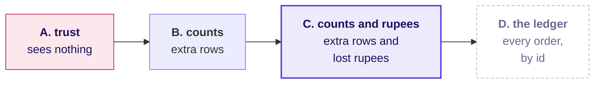

Each step to the right costs more and needs more from Finance, and C is the first that lands on the books.

```notes
SELF-STUDY. The picture behind S8: a count check cannot see a value that went missing inside a row
that is still there, and only the rupees can.
```

---

## S10. Question: what does the count check leave behind?
*Once every order count lands on Finance's, what can still be wrong in the invented export?*

**Question.** Choose one: a) the rows that repeat an order, which the check has not yet removed; b) a value inside a kept row, which the check cannot see; c) nothing, since the counts now land on the books; d) the order ids, which the check trusts without reading.

```notes
LIVE, 1 minute. Take letters. The popular wrong answer is c: people expect the count fix to fix
everything.
```

---

## S11. Answer: a value inside a kept row, and Q1 is short
*What does one row per order id fix, and what does it leave?*

```python
kept = {}
for r in rows:
    kept.setdefault(r["order_id"], r)   # Wednesday's identity rule
```

```stats
value: 83 and 84 | label: orders kept | note: Finance: 83 and 84, invented
value: Rs 31,50,000 | label: Q1 kept | note: Finance: Rs 40,00,000
value: -17.5% | label: Q1 to Q2 | note: the right way round, at half the size
```

```notes
LIVE, 1 and a half minutes. The answer is b. Every count lands and Q1 is still short in rupees: a
count check proves the rows are there and says nothing about each row's value. Type the count-check your-turn
cell in notebook 1 for this morning's numbers.
```

---

## S12. Question: which move in the bridge is larger?
*Walking the invented hurried sum to Finance's total, which move carries more rupees?*

**Question.** Choose one: a) the rows Finance does not hold; b) the value that would not convert; c) they are equal; d) neither, since the walk closes with no moves.

```notes
LIVE, half a minute. Take letters, then reveal.
```

---

## S13. Answer: the rows Finance does not hold
*Which two moves walk the hurried sum to Finance's total?*

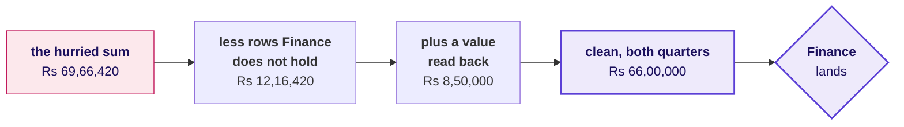

The answer is a. With both quarters on the books, the invented headline is a fall of 35.0 percent, Rs 40,00,000 to Rs 26,00,000: the sign changed, so the decision changes.

```notes
LIVE, 2 minutes. Then type the bridge your-turn cell in notebook 1, which draws this morning's
bridge; say this morning's two moves aloud from the day sheet.
```

---

## S14. A wrong sign changes the decision itself
*What would Meera have done with each headline?*

```cards
icon: circle-x | eyebrow: The hurried note, invented | title: Q2 grew 21.2% | body: No investigation, and Monday's review hears the quarter was fine. | tone: dark
icon: circle-alert | eyebrow: Counts checked, invented | title: Q2 fell 17.5% | body: The right direction at half the size, so the fix gets half the attention.
icon: circle-check | eyebrow: Counts and rupees, invented | title: Q2 fell 35.0% | body: Rs 14,00,000 to explain, and the tree says where.
```

**In the interview.** [F] You have two hours and a raw export; what do you do first, and what do you skip? Profile first, and never skip the reconciliation: it costs fifteen minutes and can flip the headline's sign.

```notes
LIVE, 1 minute. Say this morning's three headlines aloud from the day sheet's debrief table, then
ask one learner what Meera would have done on Monday with each of the three notes.
```

---

## S15. Summed on their own, the decisions match the bridge
*Does a sum of the decisions themselves land on the bridge's two moves?*

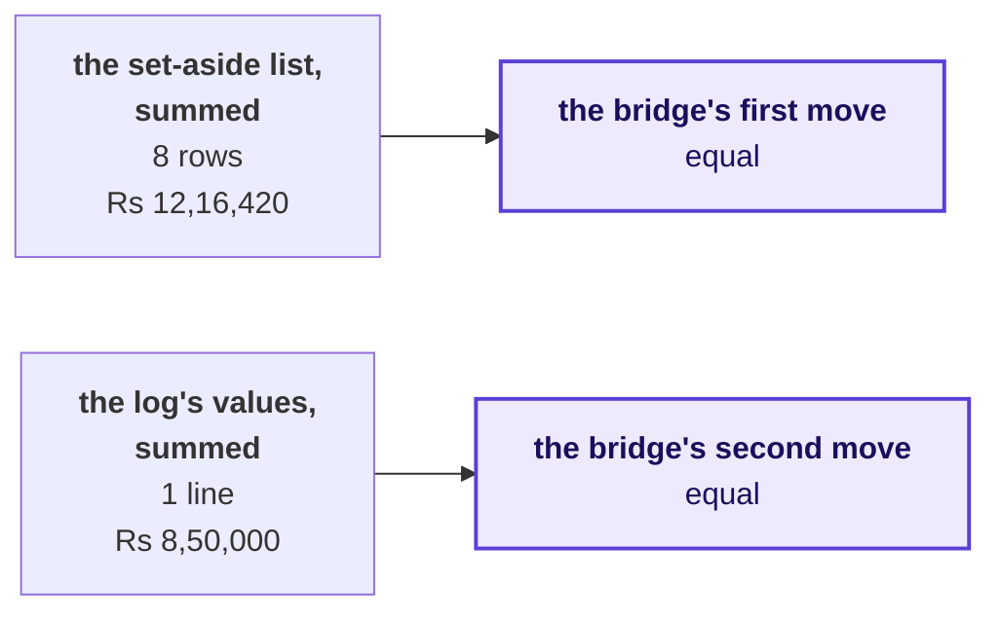

**The rule.** Show Finance the forward bridge, because it starts from their export, and run these two sums before you send it: on the invented export they prove every rupee the bridge moved is a row set aside or a value in the log. Whether each decision was right is the order-level match's question.

```notes
LIVE, 1 minute. Type the second-route your-turn cell in notebook 1; both checks pass on this
morning's file, and the table it prints lists the rows Finance does not hold. The bridge's moves
were found by subtracting totals, and these sums count the decisions themselves, so a row set aside
without its log line, or a value set to zero where it should have been read, makes the two
disagree.
```

---

## D16. Repeats read as members ordering more often
*Can the same repeated rows move a branch of the tree?*

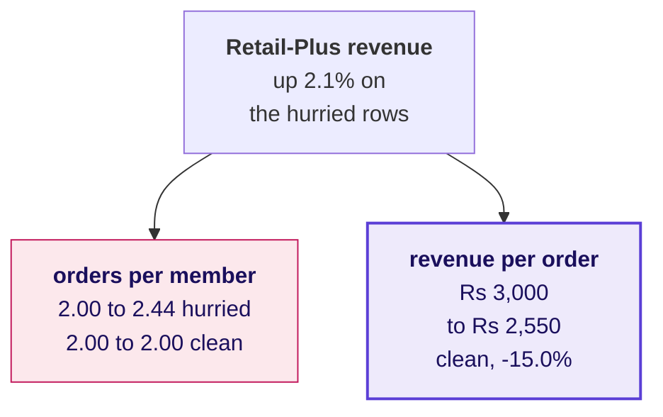

On the invented export, rows Finance does not hold manufacture a frequency rise where nothing changed, and hide a basket fall behind a tier that looks steady. Chapter 3 reads the clean tree.

```notes
SELF-STUDY, in the depth section of notebook 1, whose your-turn cell runs the same comparison on
this morning's file. Run it live for two minutes only if the tally shows more than a quarter of
notes named a frequency branch.
```

---

## S17. Only once counts and rupees both land
*Do the two quarters in your note match Finance's books?*

| The question | The answer, on the invented export |
|---|---|
| What did the hurried pass send? | Q2 up 21.2%, where the books say down 35.0% |
| Which check, at what cost? | C, counts and rupees with a bridge, 15 minutes |
| What does a count check fix? | The rows; the headline stays at -17.5% |
| Which moves close the bridge? | Rs 12,16,420 out, Rs 8,50,000 back in |
| Do the decisions sum the same? | Yes: the list and the log equal both moves |

**Kavya's review.** A number that has not been reconciled can point the wrong way, as the invented export's hurried run did. Put the two checks in a cell before the first number you plan to send, so the clock cannot remove them.

```notes
LIVE, 2 and a half minutes, two learners' second-look lines included: one whose totals landed and
one whose did not. Thank both the same way. The clock removes this step first because it produces no
new number, only a yes or a no, and it takes fifteen of the lab's 120 minutes. Then lunch.
```

---

## SECTION 2: Is a clean pass done?
*Every count reconciles and nothing was rejected: is the cleaning pass finished?*

```notes
LIVE, after lunch. Ten minutes. Notebook 2, C2_W01_D05_02_debrief_values_STUDENT.ipynb, on the
projector from S22, its your-turn cells typed live.
```

---

## S18. Answered in six questions, from the rupees back
*Who needs the pass's rupees checked, and which six questions lead there?*

**Who needs the answer.** Anand's analyst audits every note before Meera reads it; a base quarter short by one large order halves the fall the note reports, and nobody acts at the right scale.

```timeline
label: Question 1 | title: What does zeroing report? | body: A zeroing pass reports its counts.
label: Question 2 | title: What do the rupees say? | body: The rupees show what counts cannot.
label: Question 3 | title: Which answer fits? | body: Four answers meet an unreadable value.
label: Question 4 | title: What does reading change? | body: Reading the value moves the headline.
label: Question 5 | title: Can a filter drop a row? | body: A filter can lose a row without a word.
label: Question 6 | title: Can the file find the gap? | body: The file alone can find the gap. | tone: dark
```

```notes
LIVE, half a minute. Read who needs the answer and the six questions, and start.
```

---

## S19. Anand's analyst audits the rupees before the rows
*Who audits the note, and what does a short base quarter cost?*

```stats
value: Q1 booked | label: the metric | note: the base every Q1 to Q2 rate divides by
value: the analyst | label: who asks | note: Anand's auditor, then Meera
value: scale | label: what a short base can cost | note: the fall reported at the wrong size
```

**The client asks.** Your pass reports zero rejects and every count lands. Is it finished?

```notes
LIVE, 1 minute. A base short by one large order can halve the fall the note reports: nobody argues
with the direction, so nobody acts at the right scale, and when Finance finds the order every other
number in the note is doubted with it. One sentence of likeness, even when D20 is self-study:
JPMorgan's own task force found a risk spreadsheet that divided by a sum instead of an average and
never raised an error.
```

---

## D20. JPMorgan's risk sheet ran clean and was wrong
*Who else trusted a sheet that never raised an error?*

```cards
icon: landmark | eyebrow: JPMorgan Chase, 2012 | title: A sum where an average belonged | body: A risk model run through spreadsheets "divided by their sum instead of their average", likely muting volatility, how far prices were shown to swing, by a factor of two, and lowering the VaR, the bank's estimate of a bad day's loss. Source: the task force report, January 2013, as quoted by The Baseline Scenario, 9 February 2013. | tone: dark
icon: trending-down | eyebrow: The cost | title: $6.2 billion | body: The trading losses from what became known as the "London Whale" trades in the bank's Chief Investment Office. Source: FCA press release, 19 September 2013.
```

```notes
SELF-STUDY. The parallel: the sheet produced a plausible number every day, and only a check against
something outside the sheet could have caught it.
```

---

## S21. Zero rejects, and every count lands
*What does a pass that sets unreadable values to zero report?*

```python
def to_int_or_zero(v):
    try:
        return int(v)
    except ValueError:
        return 0          # the file now "converts" cleanly
```

```stats
value: 83 | label: Q1 orders | note: Finance: 83, invented
value: 0 | label: rejects reported | note: the try swallowed every failure
value: Rs 31,50,000 | label: Q1 as summed | note: every row kept, invented
```

```notes
LIVE, 1 and a half minutes. Read the code as a hurried analyst's honest attempt: it runs, it
reports nothing and every count lands. Nobody in the room should feel caught. Notebook 2's first
your-turn cell prints this morning's counts and rejects.
```

---

## S22. Question: what do Finance's rupee totals show?
*Every order count lands and nothing was rejected: against Finance's rupees, what does the invented pass show?*

**Question.** Choose one: a) both quarters land to the rupee; b) one quarter over, the other landing; c) one quarter short, the other landing; d) both quarters short by a few rupees of rounding.

```notes
LIVE, half a minute. Take letters. The popular wrong answer is a, and it is the answer the zeroing
pass was built, by accident, to produce.
```

---

## S23. Answer: Q1 is Rs 8,50,000 short, and Q2 lands
*What do the rupees say when every count lands?*

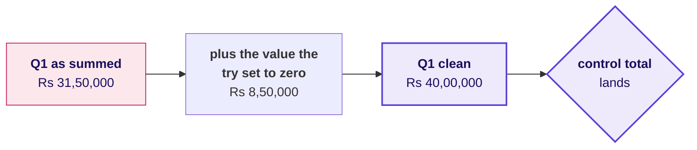

The answer is c. With the invented base short by about a fifth, the note reports a fall of 17.5 percent where the books show 35.0.

```notes
LIVE, 1 and a half minutes. Type the gap your-turn cell in notebook 2: it prints which of this
morning's quarters misses and by how much; the day sheet's debrief table has the figure. The
your-turn cell that finds the row is for the room tonight.
```

---

## S24. Four answers, sized: C lands, A hides its gap
*Which of four answers fits a value that will not convert?*

| Option | Minutes | Log lines | Count check | Rupee check | Headline |
|---|---|---|---|---|---|
| A. Zero in a try | 1 | 0 | passes | fails | -17.5% |
| B. Drop with a reason | 2 | 1 | fails | fails | -17.5% |
| C. Read, convert, keep and flag | 3 | 1 | passes | passes | -35.0% |
| D. Hold and ask the owner | a wait | 1 | fails | fails | provisional |

**The rule.** Choose C when the value can be read without a guess, as the invented export's "850000.00", an amount exported with its paise, can. Choose D when reading it needs a guess, such as a word or a unit that could be lakh or crore, and B when the row is not an order at all. A is the one option that hides its gap.

```notes
LIVE, 2 minutes. Invented numbers. Type the options your-turn cell in notebook 2, which sizes the
same four on this morning's file and prints the row that would not convert. Land the contrast
between A and B: the same wrong headline, and B fails the count check, so B's gap is visible and
A's is not.
```

---

## D25. One question sorts every unreadable value
*Which question decides what to do with a value that will not convert?*

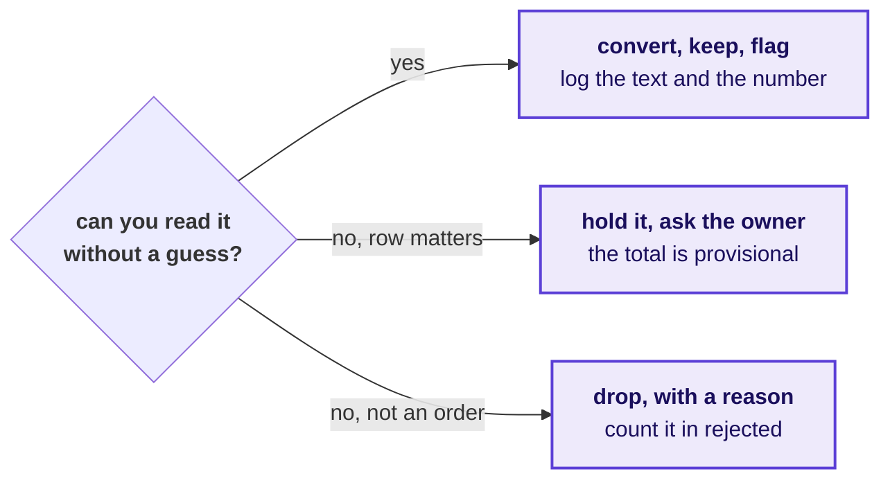

**In the interview.** [S] Walk me through how you clean and check a dataset you have never seen. A zero-reject pass is a finding: check ids against rows, check what the code did with a value it could not read, and reconcile the rupees.

```notes
SELF-STUDY, or one minute live: ask two learners which branch their own row took this morning and
why.
```

---

## S26. Question: how much more fall does reading add?
*Reading the value moves the invented headline from -17.5 to -35.0 percent: how many more rupees of fall must the review explain?*

**Question.** Choose one: a) Rs 5,50,000; b) Rs 8,50,000; c) Rs 14,00,000; d) Rs 26,00,000.

```notes
LIVE, half a minute. Take letters.
```

---

## S27. Answer: Rs 8,50,000 more, a Rs 14,00,000 fall
*What does one log line change in the note?*

```python
def read_value(text):
    t = str(text).strip().replace("Rs", "").replace(",", "").replace(" ", "")
    try:
        return round(float(t))      # read without a guess
    except ValueError:
        return None                 # needs a guess: hold and ask
```

```stats
value: Rs 40,00,000 | label: Q1, value read | note: lands on the control total, invented
value: Rs 14,00,000 | label: the fall on the books | note: was Rs 5,50,000 with the zero, invented
value: 1 | label: log line | note: the text and the number it was read as
```

```notes
LIVE, 1 minute. The answer is b. One log line adds Rs 8,50,000 of fall: the reported fall grows
from Rs 5,50,000, 17.5 percent, to Rs 14,00,000, 35.0 percent, the difference between "a soft
quarter" and "a quarter to explain".
```

---

## D28. An order with no segment turns a fall into a rise
*Can a segment filter drop a row without a word, as the zero did?*

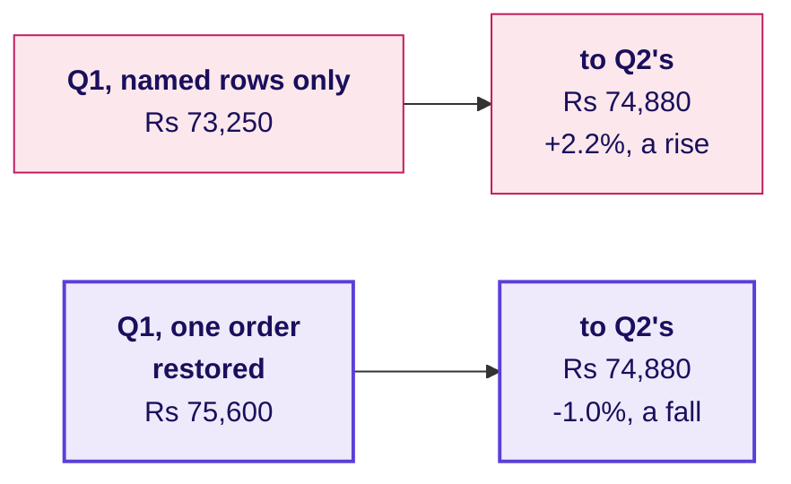

**The rule.** The segments add back to the quarter, in orders and in rupees, before any segment is read. On the invented export they fall one order short in Q1, and Retail-Core, which fell, reads as a rise.

```notes
SELF-STUDY, level 5 of notebook 2, whose your-turn cell runs the same check on this morning's file.
Run it live for two minutes if the tally shows notes that read a segment's move the wrong way round.
```

---

## S29. Summed or logged: the logged value is the gap
*Can the file alone, with no control total, find the gap?*

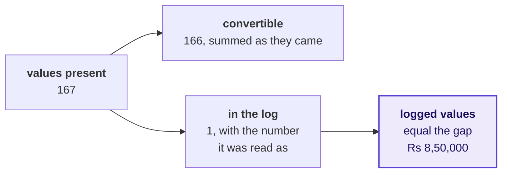

On the invented export the account balances. The rupee check needs a total from outside and says how much is missing, and this needs only the file and says where, so on a file with no control total it is the check you still have.

```notes
LIVE, 1 minute. Type the second-route your-turn cell of notebook 2; the account balances on this
morning's file too.
```

---

## S30. Only once the rupees land as well
*Every count reconciles and nothing was rejected: is the pass finished?*

| The question | The answer, on the invented export |
|---|---|
| What does a zeroing pass report? | 83 Q1 orders of 83, and 0 rejects |
| What do the rupees say? | Q1 Rs 8,50,000 short: -17.5% against -35.0% |
| Which of four answers fits? | C, read and flag; D when it needs a guess |
| What does reading it change? | The fall doubles to 35.0%, Rs 14,00,000 |
| Can a filter drop a row? | Yes: Retail-Core reads +2.2% where it fell 1.0% |
| Can the file find the gap? | Yes: 167 = 166 + 1, and the log is the gap |

**Kavya's review.** A count check proves the rows are there. Only a rupee check proves the values survived. Setting a value to zero claims the order was worth nothing, so that decision belongs in the log with a reason.

```notes
LIVE, half a minute. Then chapter 3.
```

---

## SECTION 3: Which number leads?
*Which finding leads the note, and how sure can Meera be of it?*

```notes
LIVE, after lunch. Ten minutes, the last slide included. Notebook 3,
C2_W01_D05_03_debrief_segments_STUDENT.ipynb, on the projector from S35, its your-turn cells typed
live.
```

---

## S31. Answered in five questions, from tree to test
*Who needs the right lead, and which five questions lead there?*

**Who needs the answer.** Meera acts on the note's first line and Marketing attacks any rate on a handful of orders; a trend claimed from a few orders sends a team after a segment that did nothing.

```timeline
label: Question 1 | title: Where does the fall sit? | body: The clean tree splits it by segment.
label: Question 2 | title: On how many orders? | body: The biggest move rests on a count.
label: Question 3 | title: How to choose the lead? | body: Four ways to choose are sized.
label: Question 4 | title: More than chance? | body: Each member's two quarters are flipped.
label: Question 5 | title: Broad, or a few members? | body: The second route counts members. | tone: dark
```

```notes
LIVE, half a minute. Read who needs the answer and the five questions.
```

---

## S32. Meera acts on the line Marketing will attack
*Who reads the first line, and what does a wrong lead cost?*

```stats
value: Rs 14,00,000 | label: the fall | note: Q1 to Q2, reconciled, invented
value: four | label: segments | note: each with its own count
value: one line | label: what Meera acts on | note: the note's first
```

**The client asks.** Which branch do I open first, and can I act on it on Monday?

```notes
LIVE, 1 minute. Meera and Marketing both read the first line: Meera acts on it, and Marketing
attacks any rate that rests on a handful of orders. A trend claimed from a few orders sends a team
to fix a segment that did nothing while the branch that moved goes unopened. One sentence of
likeness, even when D33 is self-study: IMDb will not rank a title in its Top 250 until it has 25,000
ratings.
```

---

## D33. IMDb counts votes before it ranks a title
*Who else refuses to rank on a handful of cases?*

```cards
icon: star | eyebrow: IMDb Top 250 | title: 25,000 ratings first | body: A title needs at least 25,000 ratings from regular voters, and the weighted rating pulls a title with few votes toward the average of all titles. Source: IMDb Help, ratings FAQ, updated 9 February 2026. | tone: dark
icon: school | eyebrow: Small schools, a public case | title: Best and worst, both small | body: Small schools are over-represented at both ends of the rankings because small samples vary more. Source: Howard Wainer, "The Most Dangerous Equation", in Picturing the Uncertain World, Princeton University Press, 2009.
```

```notes
SELF-STUDY. Wainer's chapter also records that the Gates Foundation had given about $1.7 billion in
education grants by 2001, with small schools central to them; notebook 3 carries the source.
```

---

## S34. Question: which segment carries most of the fall?
*Of the invented Rs 14,00,000 fall, where does most of it sit?*

**Question.** Choose one: a) Retail-Core, the segment with the most orders; b) Retail-Plus, the members' tier; c) Business, the corporate book; d) Student, the smallest segment.

```notes
LIVE, half a minute. Take letters.
```

---

## S35. Answer: the corporate book, 99.2 percent of it
*Where in the tree does the invented fall sit?*

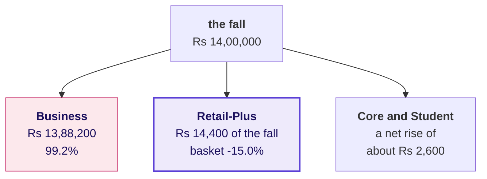

The answer is c. Retail-Plus kept its 16 members and their 2.00 orders each while its revenue per order, the basket, fell from Rs 3,000 to Rs 2,550.

```notes
LIVE, half a minute. Type the tree your-turn cell in notebook 3 for this morning's tree, and say
this morning's split aloud from the day sheet.
```

---

## S36. The corporate book falls 36.3 percent
*What headline does the biggest move tempt a hurried note into?*

```stats
value: -36.3% | label: corporate revenue | note: Q1 to Q2, invented
value: 5 then 2 | label: orders | note: what the rate rests on
value: Rs 13,88,200 | label: the fall it carries | note: 99.2% of the quarter's
```

The rate is true to the rupee and the biggest move on the page, so a hurried note leads with it: "corporate is declining; we recommend a retention plan".

```notes
LIVE, 1 minute. The number is correct. What can seven orders carry? This morning's own corporate
headline and its count are in the day sheet's debrief table; say them after the room answers S37.
```

---

## S37. Question: how does it enter the note?
*Meera reads the first line and acts on it: where does the corporate move go?*

**Question.** Choose one: a) as the headline trend, since it is the largest move in rupees on the page; b) as the headline, with a test's p-value printed beside the rate; c) left out of the note, since a handful of orders is too few to matter to anyone; d) as counts, the orders in each quarter, with a question to their owner.

```notes
LIVE, half a minute. Take letters. Option c is the overcorrection: the corporate rupees are real
money and Meera should hear them, as counts.
```

---

## S38. Answer: as counts, five orders then two
*Where does the corporate move go in the note, and why there?*

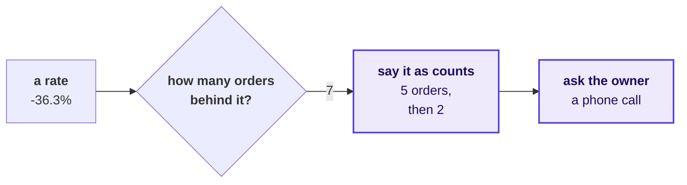

The answer is d. On the invented export, seven orders dealt at random between two quarters come out at least as uneven as five and two in 45 percent of coin-flip worlds, so the rate says nothing a count does not.

```notes
LIVE, 1 minute. Type the coin-flip your-turn cell in notebook 3 for this morning's corporate count
and its share. The corporate action is a phone call, which costs nothing; a retention plan built on
a handful of orders costs a quarter.
```

---

## S39. Four ways to choose the lead: C leads on 64 orders
*How should a team choose the lead, and what does each way cost?*

| Option | Leads with | Orders | Chance alone | Minutes |
|---|---|---|---|---|
| A. Biggest rupee move | Business -36.3% | 7 | 45% of coin-flip worlds | 5 |
| B. The total, unsplit | revenue -35.0% | 167 | not asked | 2 |
| C. Count before rate | Retail-Plus basket -15.0%, Rs 14,400 | 64 | one test on each member's two quarters | 15 |
| D. Test every segment | the smallest of four p-values | 7 to 72 | four tests, a one-in-five fluke risk | 45 |

**The rule.** On the invented export, C, because Retail-Plus's basket is the one consumer move on enough orders to test; it is small in rupees, so it leads beside the corporate move, which is said as counts. Switch when Meera's question is about accounts, when a segment carries hundreds of orders a quarter, or when a second quarter repeats the move.

```notes
LIVE, 1 and a half minutes. Invented numbers. B hides that nearly all of the fall is the corporate
book. D, run in notebook 3 after the lead's own test, finds the same lead at three times the minutes, and four tests at 0.05 carry about a one-in-five
chance that one looks real by luck, so on another file D leads with a fluke. Type the option D
your-turn cell in notebook 3 to run the four tests on this morning's file.
```

---

## D40. Orders and a test decide the first line
*Where does each finding go in the note?*

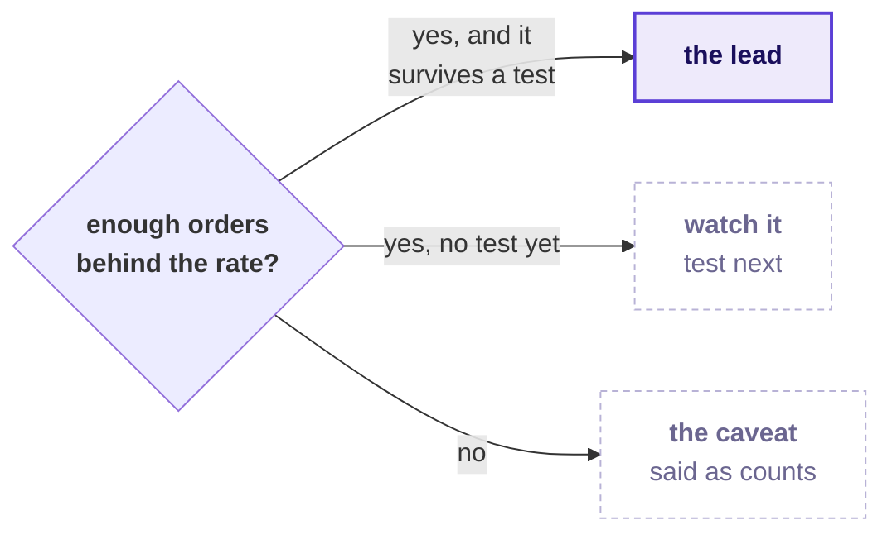

The rupees decide whether a move reaches Meera at all, and its order count and its test decide whether it leads the note or sits in the caveat.

```notes
SELF-STUDY. The picture behind S39's call, and the order of the note's claim and caveat.
```

---

## S41. Question: where does the real change sit?
*Among 2,000 worlds with each member's two quarters flipped, how extreme is -15.0 percent?*

**Question.** Choose one: a) in the middle of the pile; b) at the edge, with about two dozen worlds as extreme; c) beyond every flipped world; d) nowhere, since members placed different numbers of orders.

```notes
LIVE, half a minute. The same 16 members sit in both quarters, so each member's own two quarters
are swapped at random, keeping every member's orders together. Take letters.
```

---

## S42. Answer: at the edge, 22 of 2,000 worlds
*Is the lead's fall more than chance on its members' own two quarters?*

```python
rng = random.Random(7)
for _ in range(2000):                        # one world per pass
    swaps = [rng.random() < 0.5 for _ in per]    # each member's quarters, kept together
    worlds.append(flipped_change(per, swaps))
```

```stats
value: 22 of 2,000 | label: flipped worlds as large | note: either direction, invented
value: p = 0.011 | label: a share of chance-only worlds | note: never the chance of being wrong
value: 0.0107 | label: counted exactly | note: over all 65,536 ways to flip 16 members
```

```notes
LIVE, 1 minute. The answer is b. The fall was found in the tree, so the note reports both
directions. Read the p-value sentence aloud once, word for word, because Saturday's paper asks for
it: "In 1.1 percent of worlds where the quarter made no difference to each member's basket, chance
produced a change this large, either way." Type the paired-test your-turn cell in notebook 3 with
the segment each learner's lab tree named.
```

---

## D43. Yes, apart from Retail-Core's, at p = 0.0385
*Did Retail-Plus's basket move differently from Retail-Core's?*

```cards
icon: users | eyebrow: Same members, two quarters | title: Did Retail-Plus's basket fall? | body: The fair test flips each member's own two quarters at random: p = 0.011, invented. | tone: dark
icon: shuffle | eyebrow: Different customers | title: Did it move differently from Retail-Core's? | body: The fair test shuffles the segment label across whole customers, each carrying all their orders: p = 0.0385, invented.
```

Both are fair, each for its own question, and a note says which question it tested.

```notes
SELF-STUDY. A learner who shuffled segment labels across whole customers this morning answered the
second question fairly; accept it with the question named.
```

---

## S44. 13 of 16 members' baskets fell: p = 0.021
*Is the fall broad, or carried by a few members?*

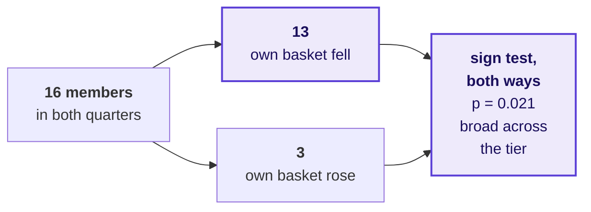

On the invented export the flips say whether the change is bigger than chance and the member count says whether it is broad. The sign test uses only each member's direction, so its p sits above the flips'.

```notes
LIVE, 1 minute. Type the sign-test your-turn cell in notebook 3 on the lab lead. When the flips and
the count disagree, a handful of members moved the average, and the note says so.
```

---

## D45. Pooling the quarters reads a real fall as chance
*What happens when a test splits a member's two quarters?*

```cards
icon: users | eyebrow: Flip each member's own two quarters | title: p = 0.0025 | body: Revenue per member, invented. Every world is one these 16 members could have produced, so a real fall shows as one. | tone: dark
icon: shuffle | eyebrow: Pool the Q1 and Q2 figures and deal them | title: p = 0.222 | body: The same figures dealt as strangers: members differ in size far more than in their change, and the fall reads as chance.
```

**The rule.** Keep each customer's own two quarters together: flip them as a pair when the same customers sit in both quarters, and shuffle labels across whole customers when the groups are different customers. Pooling paired data is the hurried mistake.

```notes
SELF-STUDY, in the depth section of notebook 3, unless more than a quarter of the room pooled the
quarters or shuffled single orders; then run it for three minutes in place of S44. Both cards are
2,000 runs on random.Random(7). The same cell shows single orders shuffled between Retail-Plus and
Retail-Core at 0.0945, against 0.0385 with the label moving with the whole customer. The your-turn
cell runs all four on this morning's file.
```

---

## D46. The median is the typical order: Rs 2,350
*Which number describes a typical order in a file with seven corporate orders?*

```stats
value: Rs 39,521 | label: mean order, clean | note: pulled up by 7 corporate orders, invented
value: Rs 2,350 | label: median order, clean | note: the typical one
value: 17 times | label: the gap | note: mean over median
```

**The rule.** Describe a file with its median and say what sits above it. Keep the mean for anything that has to reconcile.

```notes
SELF-STUDY unless the tally shows notes quoting a mean as the typical order; then three minutes, and
say this morning's mean and median aloud from the day sheet.
```

---

## S47. Retail-Plus's basket leads, with corporate as counts
*Which finding leads the note, and how sure can Meera be of it?*

| The question | The answer, on the invented export |
|---|---|
| Where does the fall sit? | Business, Rs 13,88,200 of Rs 14,00,000 |
| On how many orders? | 5 then 2; coin flips do that in 45% of worlds |
| How to choose the lead? | C: Retail-Plus's basket, -15.0% on 64 orders |
| More than chance? | Yes: 22 of 2,000 flipped worlds, p = 0.011 |
| Broad, or a few members? | Broad: 13 of 16 fell, sign test p = 0.021 |

**Kavya's review.** Say the count before the rate, every time: the orders in each quarter, and then the percentage.

```notes
LIVE, half a minute. The note as it should read, on the invented export: booked revenue fell 35.0
percent, Rs 40,00,000 to Rs 26,00,000; Rs 13,88,200 of it is the corporate book on five orders then
two; among consumers Retail-Plus's revenue per order fell 15.0 percent with its members and their
frequency unchanged, p = 0.011 with each member's quarters flipped; the corporate move is a
question to its account owner.
```

---

## S48. Rerun the step you stalled on, tonight
*What do you do with the step the lab says you do not own yet?*

```timeline
label: Tonight | title: Rerun the step | body: On the practice export, the step the TA marked, with the practice set beside it.
label: One line | title: What changes | body: Written under your lab note: the check you will put first next time.
label: Saturday | title: The paper | body: The note's four parts and the p-value sentence, from memory.
```

```notes
LIVE, half a minute. Close the debrief. The TAs tell each person their marked step privately during
the rehearsal, one learner at a time.
```
