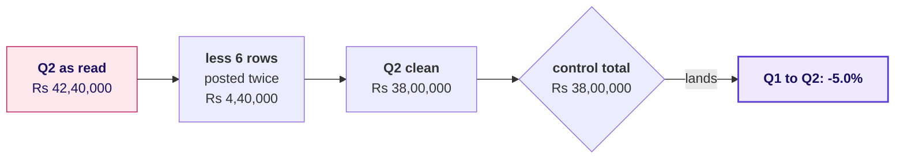
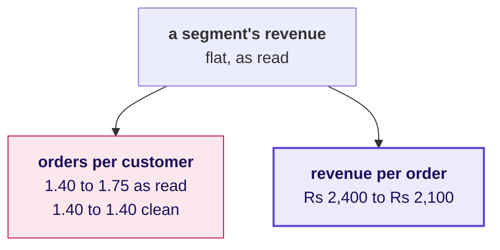
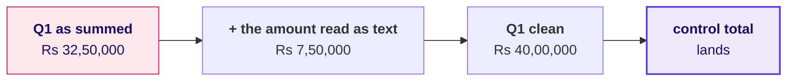
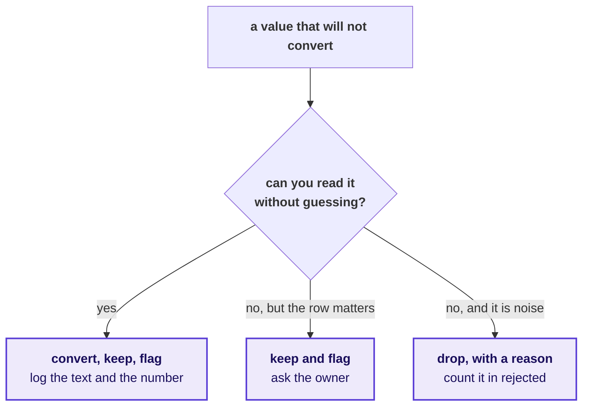
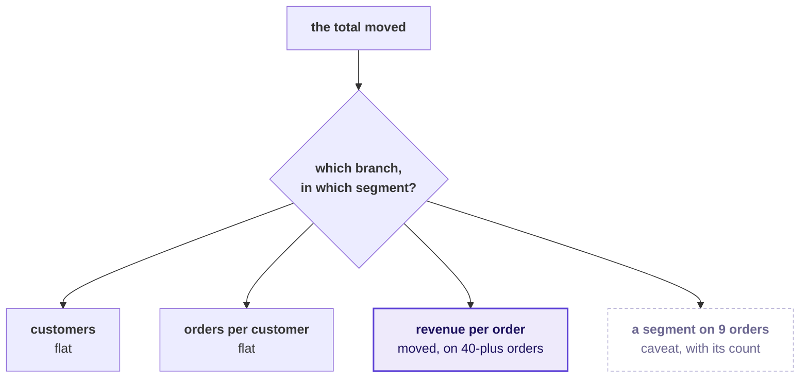

# Where the room broke

Week 1, Day 5. The lab debrief.

Kicker: WEEK 1  ·  FRIDAY  ·  THE LAB DEBRIEF
Quote: Until your numbers match ours, Finance will not act on a drop measured from an ERP export.
Who: Anand Iyer, finance controller, Kalpa Retail, to the data and AI team at Kalpa's Global Capability Centre

```notes
LIVE, one minute. Anand said this on Wednesday, and this morning most of the room shipped a number
Finance would have sent back. The debrief runs forty minutes in two halves: the reconciliation
before lunch, then the two breaks the TAs' tally names after lunch. Every example on these slides
is invented, labelled invented, and none uses a number from the lab file. The rerun on the real file
happens live in the notebook, from the lab key.
```

---

## SECTION 1: The reconciliation, skipped
*The step with no new number in it is the one a clock removes first, and it is the one Finance reads.*

```notes
LIVE. Twenty minutes, before lunch: the invented case on S1 to S6, then one rerun on the projector
from trainer/C2_W01_D05_lab_reference_TRAINER.ipynb, section 3, then two learners read their
second-look line.
```

---

## S1. The headline a hurried run sends
*Invented numbers: a two-quarter export, summed as it arrived.*

```stats
value: Rs 40,00,000 | label: Q1, summed as read | note: invented
value: Rs 42,40,000 | label: Q2, summed as read | note: invented
value: +6.0% | label: Q1 to Q2 | note: "Q2 grew, no action needed"
```

The number is plausible, the arithmetic is right, and the note built on it tells Meera the quarter that fell was a good one.

```notes
LIVE, 2 minutes. Read the three numbers and the sentence a hurried note would carry. Ask how many
sent a headline in this shape this morning, by hand, without naming anyone. The TA tally already
knows; the room should say it.
```

---

## S2. Question: what would you check before sending it?
*The export came with Finance's control totals, and a note that says nothing else.*

**Question.** Choose one: a) the median order, in case one large order moved the total; b) the p-value of the Q1 to Q2 change; c) rows read against clean plus rejected, and each quarter's rupees against the control total; d) the segment split, to see which segment grew.

```notes
LIVE, 2 minutes. Take letters. Option a is Monday's instinct and a good one on a different day; d
is the decomposition, which is the right step on data you already trust.
```

---

## S3. Answer: counts and rupees, against the control totals
*Invented numbers: 120 rows, 114 distinct orders, and a batch posted twice.*



Input 120 equals clean 114 plus rejected 6, and both quarters land on the control totals to the rupee. The headline turns from +6.0 percent to -5.0.

```notes
LIVE, 3 minutes. The answer is c. Walk the bridge left to right. Then open the reference notebook,
section 3, and run the bridge cell and the four-headline table on the projector: this is the one
rerun on the real file. Read the four headlines aloud and let the room match its own number to a
row.
```

---

## S4. The decision the wrong number would have made
*Growth reads as no action; a fall reads as find the branch, and only one of them is true.*

```cards
icon: circle-x | eyebrow: The hurried note | title: Q2 grew 6.0% | body: No investigation, and Monday's review hears the quarter was fine. | tone: dark
icon: circle-check | eyebrow: The reconciled note | title: Q2 fell 5.0% | body: Decompose along the tree and name the branch that moved.
```

**Kavya's review.** A number that has not been reconciled is not a smaller version of the right number. It can point the other way.

```notes
LIVE, 2 minutes. The point to land: the error changed the sign of the finding, so it changed the
decision, not the precision. Ask one learner what Meera would have done on Monday with each note.
```

---

## S5. The same batch also moves a branch
*Invented numbers: repeated rows add orders, so frequency rises where nothing changed.*



On the rows as read, customers seem to order a quarter more often and the segment looks flat. Clean, frequency holds and the basket falls by an eighth, which is a different branch and a different owner.

```notes
LIVE, 2 minutes. This is why the reconciliation comes before the tree in the method: repeated rows
do not only inflate a total, they manufacture a frequency rise. If the tally shows people named a
frequency branch this morning, this slide is theirs.
```

---

## S6. Why the clock removes this step first
*It produces no new number, so it feels like the step that can wait.*

```bar
label: Profile | value: 20 | caption: a new picture of the file
label: Clean | value: 30 | caption: a smaller, tidier file
label: Reconcile | value: 15 | caption: no new number, only a yes or a no
label: Decompose | value: 25 | caption: the finding
```

**The rule.** Reconcile before you decompose, every time, and write the two checks before you write the tree. Fifteen minutes here is the cheapest insurance in the week.

**Kavya's review.** A check you meant to write is a check you did not write. Put `input == clean + rejected` in a cell before the first number you compute.

```notes
LIVE, 3 minutes, then two learners read their second-look line from the lab notebook: one whose
totals landed and one whose did not. Thank both the same way. Then lunch. The TAs' tally over lunch
picks the next two breaks from the three that follow; the others become self-study.
```

---

## SECTION 2: The pass that looks clean
*Zero rejects on a file you know is dirty is a finding, not a result.*

```notes
LIVE, after lunch. Ten minutes. Run this chapter if the tally shows people set an unconvertible
amount to zero or skipped it without logging it. If fewer than a quarter did, make it self-study
and run S14 in its place.
```

---

## S7. Zero rejects, and a quarter short
*Invented numbers: one amount arrives as the text "7,50,000", and a try sets it to zero.*

```python
def to_int(v):
    try:
        return int(v)
    except ValueError:
        return 0          # the file now "converts" cleanly

q1 = sum(to_int(r["amount"]) for r in q1_rows)
```

```stats
value: 0 | label: rejects reported | note: invented
value: Rs 32,50,000 | label: Q1 as summed | note: invented
value: Rs 40,00,000 | label: Q1 control total | note: invented
```

```notes
LIVE, 2 minutes. Read the code as a hurried analyst's honest attempt: it runs, it reports no
errors, and it is short by exactly one large order. Nobody in the room should feel caught; this is
the most natural line of Python in the week.
```

---

## S8. Question: the rows reconcile, so what is left?
*Input equals clean plus rejected: every row is accounted for.*

**Question.** Choose one: a) nothing, since every row is accounted for; b) the rupees, each quarter against its control total; c) the median, since one large order may have gone; d) the dates, since the quarter may be cut wrong.

```notes
LIVE, 1 minute. Take letters. The popular wrong answer is a, and it is the answer the zero-coercing
pass was designed, by accident, to produce.
```

---

## S9. Answer: the rupees reconcile too, or nothing does
*Counts reconcile while rupees do not: the gap is the row the try swallowed.*



**Kavya's review.** A count check proves the rows are there. Only a rupee check proves the values survived the conversion.

```notes
LIVE, 2 minutes. The answer is b. Then run the reference notebook's zero-coercing cell in section 2
on the projector: one line, and the real Q1 falls short of the control total by one order.
```

---

## S10. The fix: convert and flag, never zero
*Three answers for a value that will not convert, and zero is none of them.*



Every branch leaves a line in the decisions log and a number in the reconciliation. Setting a value to zero leaves neither.

```notes
LIVE, 3 minutes. Ask two learners which branch their own row took this morning and why. The
decision is theirs to defend; the only wrong answer is the one with no log line.
```

---

## SECTION 3: The headline on too few orders
*A rate on a handful of orders is a rumour with a percent sign.*

```notes
LIVE, after lunch. Ten minutes. Run this chapter if the tally shows notes that lead with a segment's
rate without its order count, or a shuffle on the wrong unit. The reserve slides D14 and D15 cover
the other two breaks the lab produces.
```

---

## S11. The corporate book fell 45 percent
*Invented numbers: a segment's revenue, true to the rupee, on nine orders.*

```stats
value: -45.0% | label: corporate revenue, Q1 to Q2 | note: invented
value: 6 then 3 | label: orders | note: invented
value: 3 | label: orders that explain it | note: out of nine
```

The rupees reconcile and the percentage is right. A note that leads with it sends Meera after three invoices.

```notes
LIVE, 2 minutes. Read it as the headline many notes led with. The number is correct; the question
is whether it deserves the first line.
```

---

## S12. Question: does it lead the note?
*Meera reads the first line and acts on it.*

**Question.** Choose one: a) yes, since it is the largest move in rupees; b) yes, with the p-value beside it; c) no, drop the segment from the note entirely; d) no, name the count, keep it in the caveat, and lead with the branch that moved on enough orders.

```notes
LIVE, 1 minute. Take letters. Option c is the overcorrection: the move is real money and Meera
should hear it, in the caveat, with its count.
```

---

## S13. Answer: count before rate, tree before total
*The branch that leads a note is the one that moved on enough orders to trust.*



**Kavya's review.** Say the count before the rate, every time: "9 orders, down 45 percent" is honest, and "down 45 percent" alone is a headline.

```notes
LIVE, 3 minutes. The answer is d. Then open the reference notebook, section 4, and show the tree
table on the projector: the room reads which branch moved and on how many orders. Do not read it
for them.
```

---

## D14. Reserve: shuffle what belongs together
*Invented numbers: the same gap, tested two ways, and two verdicts.*

```cards
icon: users | eyebrow: Shuffle customers | title: p = 0.01 | body: A customer's orders move together, so every world is one that could exist. | tone: dark
icon: shuffle | eyebrow: Shuffle orders | title: p = 0.11 | body: A customer's orders split across groups, the chance spread widens and a real gap reads as noise.
```

**The rule.** The unit you shuffle is the unit that carries the label. On Thursday and today, that is the customer.

```notes
SELF-STUDY unless the tally shows more than a quarter of the room shuffled orders; then run it for
five minutes in place of chapter 2 or 3, and show the reference notebook's wrong-unit cell in
section 5.
```

---

## D15. Reserve: the typical order
*Invented numbers: ninety consumer orders and five corporate ones.*

```stats
value: Rs 48,900 | label: mean order | note: invented
value: Rs 1,980 | label: median order | note: invented
value: 5 | label: orders above Rs 5 lakh | note: invented
```

**The rule.** Describe a file with its median and say what sits above it. The mean belongs in anything that has to reconcile, never in a sentence about a typical order.

```notes
SELF-STUDY unless the tally shows notes quoting a mean as the typical order; then run it for
three minutes.
```

---

## S16. The one line you write tonight
*The step where you stalled, rerun alone, and what you will do differently.*

```timeline
label: Tonight | title: Rerun the step | body: On the practice export, the step the TA marked, with the practice set beside it.
label: One line | title: What changes | body: Written under your lab note: the check you will put first next time.
label: Saturday | title: The paper | body: The note's four parts and the p-value sentence, from memory.
```

**Kavya's review.** The lab told you which step you do not own yet. One rerun tonight is worth more than rereading all four days.

```notes
LIVE, 2 minutes. Close the debrief. Each learner already has a step marked on their observation
line; the TAs tell each person theirs privately during the rehearsal, never aloud to the room.
```
