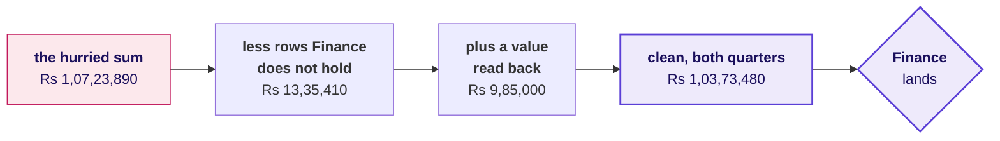
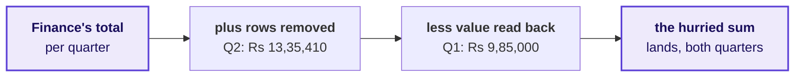
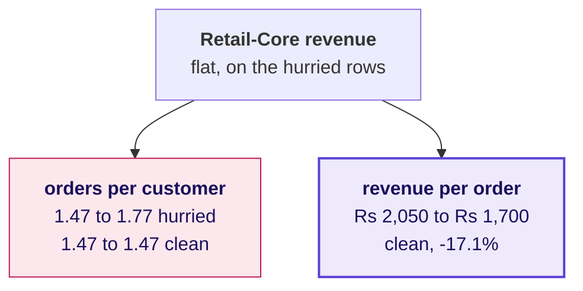
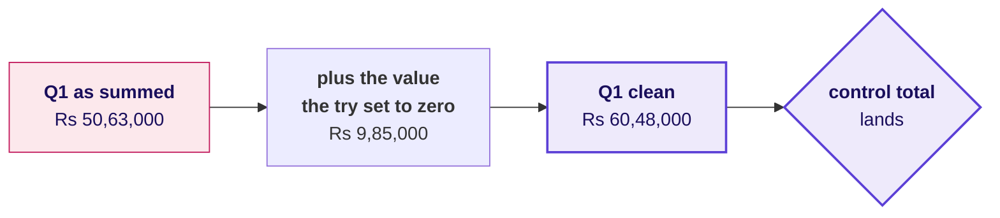
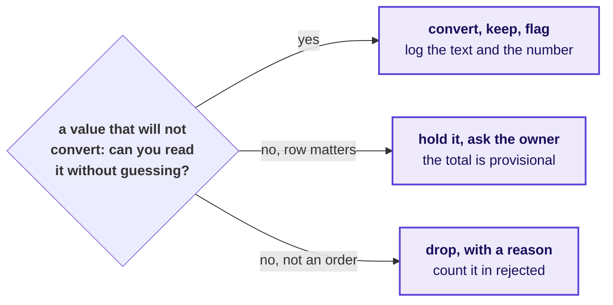
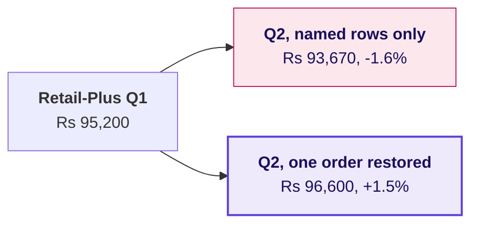
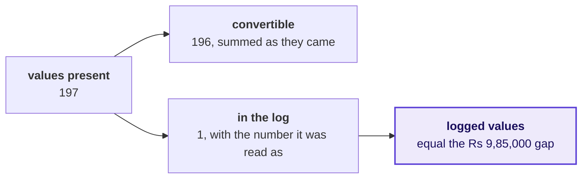
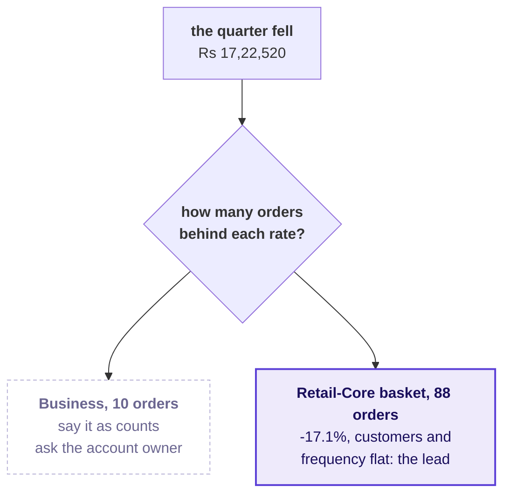
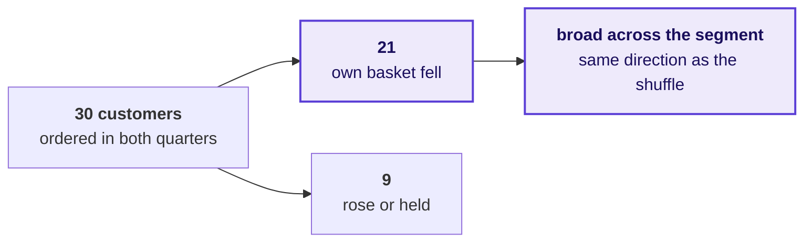

# Where the room broke

Week 1, Day 5. The lab debrief.

Kicker: WEEK 1  ·  FRIDAY  ·  THE LAB DEBRIEF
Quote: Until your numbers match ours, Finance will not act on a drop measured from an ERP export.
Who: Anand Iyer, finance controller, Kalpa Retail, to the data and AI team at Kalpa's Global Capability Centre

```notes
LIVE, one minute. Anand said this on Wednesday, and this morning most of the room shipped a number
Finance would have sent back. The debrief runs forty minutes as three chapters, one per place most
rooms break: chapter 1 before lunch (20 minutes), chapters 2 and 3 after it (10 minutes each). Each
chapter pairs with a notebook of the same number and title in notebooks/, which runs on this
morning's export and opens now that the clock has stopped. The numbers on these slides are the lab
export's own; no slide names a row.
```

---

## SECTION 1: The reconciliation, skipped
*The step with no new number in it is the one a clock removes first, and it is the one Finance reads.*

```notes
LIVE. Twenty minutes, before lunch. Notebook 1, C2_W01_D05_01_reconciliation_skipped_STUDENT.ipynb,
goes on the projector at S5 and stays there to S9. Close with two learners reading their
second-look line from the lab notebook.
```

---

## S1. Anand acts only on a number that ties to his
*The metric is booked revenue per quarter, and the note's first line is its Q1 to Q2 change.*

```stats
value: Anand Iyer | label: who asks first | note: the finance controller, before any number reaches Meera
value: Q1 to Q2 | label: the metric | note: booked revenue, the note's first line
value: the sign | label: what a wrong number costs | note: a falling quarter reported as a rising one
```

**The client asks.** Does the data you cleaned still add up to what Finance booked, before anyone reads a branch of the tree?

```notes
LIVE, 2 minutes. Say who asks and why it matters to them: Anand returns any figure that does not tie
to his control total, and Meera acts on the first line of the note. A wrong first line sends
Monday's review home with nothing to investigate, while Marketing's Rs 12 crore request is judged
against a quarter that did not happen. Then one sentence of likeness, even when D2 is left to
self-study: Nykaa reports GMV of Rs 4,182 crore and revenue of Rs 2,155 crore for the same quarter,
so every figure there names its base and bridges to the books.
```

---

## D2. Two companies that bridge before they claim
*A retailer that reports two numbers every quarter, and a pipeline that lost rows without a sound.*

```cards
icon: receipt | eyebrow: Nykaa, April to June 2025 | title: GMV Rs 4,182 cr, revenue Rs 2,155 cr | body: Two true numbers for one quarter. Quote one to the owner of the other and you are out by nearly half, so every figure names its base and bridges to the books. Source: FSN E-Commerce Ventures press release, 12 August 2025. | tone: dark
icon: file-x | eyebrow: Public Health England, October 2020 | title: 15,841 cases left out | body: Positive cases from 25 September to 2 October missed the daily figures because files exceeded a size limit. No step raised an error. Source: UK government statement, 4 October 2020.
```

```notes
SELF-STUDY, or one minute live if the room is ahead. The point of both: an error that drops or
doubles rows is silent, and only a comparison with a total from outside the file finds it.
```

---

## S3. The headline the hurried run sent
*Rows kept as they arrived, and a value that would not convert set to zero: no error anywhere.*

```stats
value: Rs 50,63,000 | label: Q1 as summed | note: 98 rows
value: Rs 56,60,890 | label: Q2 as summed | note: 109 rows
value: +11.8% | label: Q1 to Q2 | note: "Q2 grew; no action on the top line"
```

The arithmetic is right, the file is Finance's own export, and the note built on it tells Meera the quarter was a good one.

```notes
LIVE, 2 minutes. Read the three numbers and the sentence. Ask how many sent a headline with a plus
sign this morning, without naming anyone; the TA tally already knows, and the room should say it.
```

---

## S4. Question: what do you check before sending it?
*The export came with Finance's control totals, and a note that says nothing else.*

**Question.** Choose one: a) the median order, in case one large order moved the total on its own; b) the p-value of the Q1 to Q2 change, with 2,000 shuffles on customers; c) orders and rupees per quarter against Finance's control totals; d) the segment split, to see which of the four segments grew the most.

```notes
LIVE, 2 minutes. Take letters. Option a is Monday's instinct and a good one on a different day; d
is the decomposition, which is the right step on data you already trust.
```

---

## S5. Answer: both quarters miss the books
*The hurried run against the control totals, in orders and in rupees.*

| Quarter | Orders summed | Finance's orders | Rupees summed | Finance's rupees |
|---|---|---|---|---|
| Q1 | 98 | 98 | Rs 50,63,000 | Rs 60,48,000 |
| Q2 | 109 | 99 | Rs 56,60,890 | Rs 43,25,480 |

Q1 lands on orders and misses on rupees; Q2 misses on both. Two different errors, and the headline carries them both.

```notes
LIVE, 2 minutes. The answer is c. Open notebook 1 on the projector and run its first level. Point
at the two kinds of miss: the Q1 row has the right count and the wrong rupees, which is chapter 2.
```

---

## S6. Four ways to check, sized on this morning's file
*Minutes of thought decide it; every option runs in under a millisecond.*

| Option | Analyst minutes | Headline it sends | Points off the books |
|---|---|---|---|
| A. Trust the pass | 0 | +11.8% | 40.3 |
| B. Count check only | 2 | -14.6% | 13.9 |
| C. Counts and rupees, with a bridge | 15 | -28.5% | 0.0 |
| D. Match every order to the ledger | about 120 | -28.5% | 0.0 |

**The rule.** C, because it needs only the control file that came with the export and lands to the rupee. Switch to D when there is no control total, or when C's bridge will not close.

```notes
LIVE, 3 minutes. Run the sizing cell in notebook 1. Land two points: B is where most people who did
check stopped, and it still leaves the headline 14 points off; D is right and costs the afternoon.
Minutes are the lab brief's pace, D's is an estimate for a request to Finance and a join.
```

---

## S7. The bridge from the hurried sum to the books
*Two moves, each a line in the decisions log, and the walk closes on Finance's total.*



With both quarters on the books the headline is a fall of 28.5 percent, Rs 60,48,000 to Rs 43,25,480.

```notes
LIVE, 3 minutes. Run level 3 of notebook 1 and show the bridge chart. Ask which move is larger
before revealing it. The your-turn cell after it lists the rows; leave that to the room tonight.
```

---

## S8. The decision the wrong number would have made
*Growth reads as no action; a fall reads as find the branch, and only one of them is true.*

```cards
icon: circle-x | eyebrow: The hurried note | title: Q2 grew 11.8% | body: No investigation, and Monday's review hears the quarter was fine. | tone: dark
icon: circle-alert | eyebrow: Counts checked | title: Q2 fell 14.6% | body: The right direction at half the size, so the fix gets half the attention.
icon: circle-check | eyebrow: Counts and rupees | title: Q2 fell 28.5% | body: Rs 17,22,520 to explain, and the tree says where.
```

**In the interview.** [F] You have two hours and a raw export; what do you do first, and what do you skip?

```notes
LIVE, 2 minutes. The error changed the sign, so it changed the decision itself. Ask one
learner what Meera would have done on Monday with each of the three notes.
```

---

## S9. A second route: walk back from Finance's side
*Start at the control total, undo each logged decision, and land on what the hurried run summed.*



**The rule.** Show Finance the forward bridge, because it starts from their export. Run the walk back when a bridge closes suspiciously neatly: two mistakes that cancel pass one route and fail the other.

```notes
LIVE, 2 minutes. Run the second-route cell in notebook 1. Both routes give -28.5 percent, which is
the check that the log itself is right.
```

---

## D10. The same rows also move a branch
*On the rows as they arrived, Retail-Core's customers seem to order a fifth more often.*



Rows Finance does not hold manufacture a frequency rise where nothing changed, and hide a basket fall behind a flat segment. Chapter 3 reads the clean tree.

```notes
SELF-STUDY, in the depth section of notebook 1. Run it live for two minutes only if the tally shows
more than a quarter of notes named a frequency branch.
```

---

## S11. Why the clock removes this step first
*Fifteen of ninety minutes, and its only output is a yes or a no, so it feels like the step that can wait.*

```bar
label: Profile | value: 20
label: Clean | value: 30
label: Reconcile | value: 15
label: Decompose | value: 25
```

**Kavya's review.** A number that has not been reconciled can point the wrong way, and this morning it did. Put the two checks in a cell before the first number you plan to send.

```notes
LIVE, 2 minutes, then two learners read their second-look line: one whose totals landed and one
whose did not. Thank both the same way. Then lunch.
```

---

## SECTION 2: The pass that looks clean
*A zero-reject pass on a file you know is dirty is the first thing to investigate.*

```notes
LIVE, after lunch. Ten minutes. Notebook 2, C2_W01_D05_02_pass_that_looks_clean_STUDENT.ipynb, on
the projector from S14.
```

---

## S12. The base of every rate is Q1's rupees
*Anand's analyst audits the note, and their first question is always the rupees.*

```stats
value: Q1 booked | label: the metric | note: the base every Q1 to Q2 rate divides by
value: the analyst | label: who asks | note: Anand's auditor, then Meera
value: half | label: what a wrong base costs | note: the fall reported at half its size
```

**The client asks.** Your pass reports zero rejects and every count lands. Show me the rupees.

```notes
LIVE, 1 minute. A base that is short by one large order halves the fall the note reports. Nobody
argues with the direction, so nobody acts at the right scale, and when Finance finds the order,
every other number in the note is doubted with it. One sentence of likeness, even when D13 is
self-study: JPMorgan's own task force found a risk spreadsheet that divided by a sum instead of an
average and never raised an error.
```

---

## D13. A formula that ran clean and was wrong
*JPMorgan's own task force found a spreadsheet that never errored and halved a risk measure.*

```cards
icon: landmark | eyebrow: JPMorgan Chase, 2012 | title: A sum where an average belonged | body: A risk model run through spreadsheets "divided by their sum instead of their average", likely muting volatility by a factor of two and lowering the VaR. Source: the task force report, January 2013, as quoted by The Baseline Scenario, 9 February 2013. | tone: dark
icon: trending-down | eyebrow: The cost | title: $6.2 billion | body: The trading losses the FCA's fine refers to. Source: FCA press release, 19 September 2013.
```

```notes
SELF-STUDY. The parallel to land: the sheet produced a plausible number every day, and only a check
against something outside the sheet could have caught it.
```

---

## S14. Zero rejects, and every count lands
*The most natural line of Python in the week: a try that sets a failure to zero.*

```python
def to_int_or_zero(v):
    try:
        return int(v)
    except ValueError:
        return 0          # the file now "converts" cleanly
```

```stats
value: 98 | label: Q1 orders | note: Finance: 98
value: 0 | label: rejects reported | note: the try swallowed every failure
value: Rs 50,63,000 | label: Q1 as summed | note: the base of every rate
```

```notes
LIVE, 2 minutes. Read the code as a hurried analyst's honest attempt: it runs, it reports nothing
and every count lands. Nobody in the room should feel caught.
```

---

## S15. Question: the rows reconcile, so what is left?
*Input equals kept plus rejected, and the order counts match Finance's.*

**Question.** Choose one: a) nothing, since every row is accounted for; b) the rupees, each quarter against its control total; c) the median, since one large order may have gone; d) the dates, since the quarter may be cut wrong.

```notes
LIVE, 1 minute. Take letters. The popular wrong answer is a, and it is the answer the zeroing pass
was built, by accident, to produce.
```

---

## S16. Answer: the rupees, and Q1 is Rs 9,85,000 short
*Counts reconcile while rupees do not: the gap is the value the try swallowed.*



With the base short by 16.3 percent, the note reports a fall of 14.6 percent where the books show 28.5.

```notes
LIVE, 2 minutes. The answer is b. Run level 2 of notebook 2. The your-turn cell finds the row;
leave it for the room.
```

---

## S17. Four answers to a value that will not convert
*One value in 207, sized: what each option sends and what the checks then show.*

| Option | Minutes | Log lines | Count check | Rupee check | Headline |
|---|---|---|---|---|---|
| A. Zero in a try | 1 | 0 | passes | fails | -14.6% |
| B. Drop with a reason | 2 | 1 | fails | fails | -14.6% |
| C. Read, convert, keep and flag | 3 | 1 | passes | passes | -28.5% |
| D. Hold and ask the owner | a wait | 1 | fails | fails | provisional |

**The rule.** C, when the value can be read without guessing, as digits with an Indian ledger's grouping commas can. D when it cannot: a word, a unit that could be lakh or crore. B when the row is not an order. A is the one option that hides its gap.

```notes
LIVE, 3 minutes. Run the options cell. Land the contrast between A and B: the same wrong headline,
but B fails the count check, so B's gap is visible and A's is not.
```

---

## S18. Three honest answers, and zero is none of them
*Every branch leaves a log line and a number in the reconciliation.*



**In the interview.** [S] Walk me through how you clean and check a dataset you have never seen. A zero-reject pass is a finding: check ids against rows, check what the code did with a value it could not read, and reconcile the rupees.

```notes
LIVE, 1 minute. Ask two learners which branch their own row took this morning and why.
```

---

## D19. The same shape one step later
*A filter on the segment name never sees a row whose segment is empty.*



**The rule.** The segments add back to the quarter, in orders and in rupees, before any segment is read. Here they fall one order short, and a tier that grew reads as a second falling segment.

```notes
SELF-STUDY, level 4 of notebook 2. Run it live for two minutes if the tally shows notes that named
Retail-Plus as falling.
```

---

## S20. A second route: account for every value
*The rupee check finds the gap from outside the file; this finds it from inside.*



**Kavya's review.** A count check proves the rows are there. Only a rupee check proves the values survived. Zero is a claim that the order was worth nothing, so never let a try make it for you.

```notes
LIVE, 1 minute. On a file with no control total, this is the check you still have: it needs nothing
outside the file and tells you where, where the rupee check tells you how much.
```

---

## SECTION 3: The headline on too few orders
*A rate on a handful of orders cannot lead a note until its count is said.*

```notes
LIVE, after lunch. Ten minutes. Notebook 3, C2_W01_D05_03_headline_on_few_orders_STUDENT.ipynb, on
the projector from S23.
```

---

## S21. Choosing which right number leads the note
*The data now ties to the books; the question is which finding Meera reads first.*

```stats
value: Rs 17,22,520 | label: the fall | note: Q1 to Q2, reconciled
value: 99.3% | label: carried by one segment | note: the corporate book
value: one line | label: what Meera acts on | note: the note's first
```

**The client asks.** Which branch do I open first, and can I act on it on Monday?

```notes
LIVE, 1 minute. Meera and Marketing both read the first line: Meera acts on it, and Marketing
attacks any rate that rests on a handful of orders. A trend claimed from a few orders sends a team
to fix a segment that did nothing while the branch that moved goes unopened. One sentence of
likeness, even when D22 is self-study: IMDb will not rank a title in its Top 250 until it has 25,000
ratings.
```

---

## D22. Two places that count before they rank
*A ratings site that will not rank a title on a few votes, and a foundation that did.*

```cards
icon: star | eyebrow: IMDb Top 250 | title: 25,000 ratings first | body: A title needs at least 25,000 ratings from regular voters, and the weighted rating pulls a title with few votes toward the average of all titles. Source: IMDb Help, ratings FAQ, updated 9 February 2026. | tone: dark
icon: school | eyebrow: Small schools, a public case | title: Best and worst, both small | body: Small schools are over-represented at both ends of the rankings because small samples vary more. Source: Howard Wainer, "The Most Dangerous Equation", in Picturing the Uncertain World, Princeton University Press, 2009.
```

```notes
SELF-STUDY. Wainer's chapter also records that the Gates Foundation had given about $1.7 billion in
education grants by 2001, with small schools central to them; notebook 3 carries the source.
```

---

## S23. The corporate book fell 29.2 percent
*True to the rupee, the biggest number on the page, and the headline many notes led with.*

```stats
value: -29.2% | label: Business revenue | note: Q1 to Q2
value: 6 then 4 | label: orders | note: what the rate rests on
value: Rs 17,10,000 | label: the fall it carries | note: 99.3% of the quarter's
```

```notes
LIVE, 2 minutes. Read it as the headline "corporate is declining; we recommend a retention plan".
The number is correct; the question is what ten orders can carry.
```

---

## S24. Question: how does it enter the note?
*Meera reads the first line and acts on it.*

**Question.** Choose one: a) as the headline trend, since it is the largest move in rupees on the page; b) as the headline, with a shuffle test's p-value printed beside the rate; c) left out of the note, since ten orders are too few to matter to anyone; d) as counts, two fewer corporate orders, with a question to their owner.

```notes
LIVE, 1 minute. Take letters. Option c is the overcorrection: Rs 17,10,000 is real money and Meera
should hear it, as counts.
```

---

## S25. Answer: count before rate, then choose the lead
*Ten orders split by coin flips come out at least as uneven as six and four in 75 percent of worlds.*



```notes
LIVE, 2 minutes. The answer is d. Run the coin-flip cell in notebook 3: 0.754. The corporate action
is a phone call, which costs nothing; a retention plan built on ten orders costs a quarter.
```

---

## S26. Four ways to choose the lead, sized
*What each option leads with, on how many orders, and how often chance alone produces it.*

| Option | Leads with | Orders | Chance alone | Minutes |
|---|---|---|---|---|
| A. Biggest rupee move | Business -29.2% | 10 | 0.75, coin flips | 5 |
| B. The total, unsplit | revenue -28.5% | 197 | not asked | 2 |
| C. Count before rate | Retail-Core basket -17.1%, Rs 15,400 | 88 | 0.0195, shuffle | 15 |
| D. Test every segment | the smallest p | 10 to 88 | 0.19 false alarm | 45 |

**The rule.** C: the one consumer move on enough orders to test, small in rupees (0.9 percent of the fall) and led beside the corporate move said as counts. Switch when Meera's question is about accounts rather than rates, when a segment carries hundreds of orders a quarter, or when a second quarter repeats the move.

```notes
LIVE, 2 minutes. Run the options cell. B hides that 99 percent of the fall is two orders; D runs
four tests at 0.05, and the chance at least one looks real by luck is about 19 percent.
```

---

## S27. The branch that moved, tested on customers
*The label is shuffled across customers, because a customer's orders belong together.*

```stats
value: -15.6 pts | label: basket gap | note: Retail-Core against Retail-Plus
value: 39 of 2,000 | label: shuffles as large | note: random.Random(7)
value: p = 0.0195 | label: a share of chance-only worlds | note: never the chance of being wrong
```

**In the interview.** [S] Tell me about an analysis you did: what did you find, and how sure are you? The claim with its count, the check that it ties to the books, the test on the right unit, and the caveat.

```notes
LIVE, 1 minute. Run the strip chart in notebook 3. Read the p-value sentence aloud once, word for
word, because Saturday's paper asks for it.
```

---

## S28. A second route: customer by customer
*Of Retail-Core's 30 customers who ordered in both quarters, how many saw their own basket fall?*



**Kavya's review.** Say the count before the rate, every time: "six orders, then four", and then the percentage.

```notes
The rule to say: the shuffle says whether the gap is bigger than chance, the customer count says
whether it is broad; when they disagree, a handful of customers moved the average.
LIVE, 1 minute. Run the second-route cell. Then close the chapter with the note as it should read,
from notebook 3.
```

---

## D29. Reserve: shuffle what carries the label
*The same gap, tested two ways, and two verdicts.*

```cards
icon: users | eyebrow: Shuffle customers | title: p = 0.0195 | body: A customer's orders move together, so every world is one that could exist. | tone: dark
icon: shuffle | eyebrow: Shuffle orders | title: p = 0.0755 | body: Orders treated as independent. Most often that makes p too small; here it breaks each customer's Q1 to Q2 pairing, so a real gap reads as chance.
```

**The rule.** The unit you shuffle is the unit that carries the label. On Thursday and today, that is the customer.

```notes
SELF-STUDY, in the depth section of notebook 3, unless more than a quarter of the room shuffled
orders; then run it for three minutes in place of S28.
```

---

## D30. Reserve: the typical order
*A few corporate orders drag the mean far from any order a consumer placed.*

```stats
value: Rs 52,657 | label: mean order, clean | note: pulled up by ten orders
value: Rs 2,120 | label: median order, clean | note: the typical one
value: 25 times | label: the gap | note: mean over median
```

**The rule.** Describe a file with its median and say what sits above it. Keep the mean for anything that has to reconcile.

```notes
SELF-STUDY unless the tally shows notes quoting a mean as the typical order; then three minutes.
```

---

## S31. The one line you write tonight
*The step where you stalled, rerun alone, and what you will do differently.*

```timeline
label: Tonight | title: Rerun the step | body: On the practice export, the step the TA marked, with the practice set beside it.
label: One line | title: What changes | body: Written under your lab note: the check you will put first next time.
label: Saturday | title: The paper | body: The note's four parts and the p-value sentence, from memory.
```

**Kavya's review.** The lab told you which step you do not own yet. Rerun that step tonight on the practice export.

```notes
LIVE, 1 minute. Close the debrief. The TAs tell each person their marked step privately during the
rehearsal, never aloud to the room.
```
