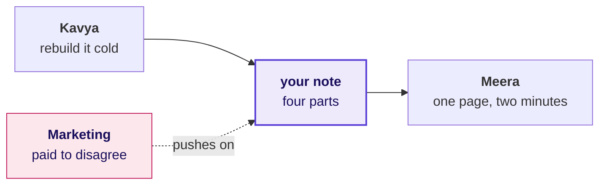
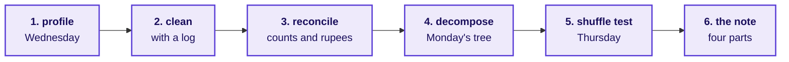
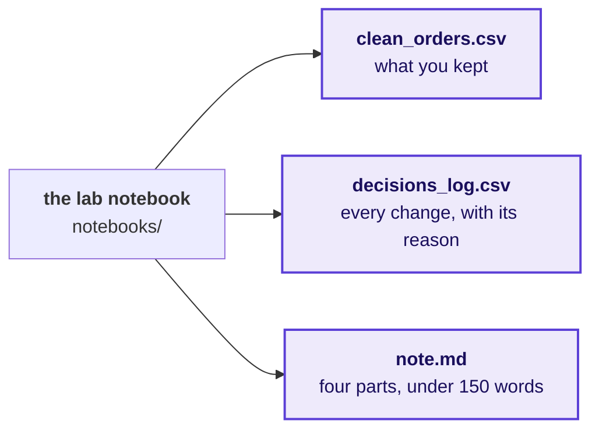
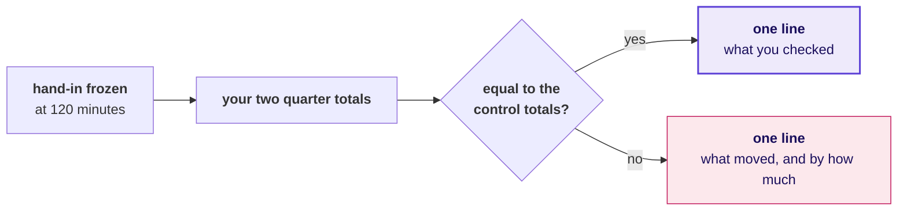

# The week, rebuilt alone

Week 1, Day 5. The lab.

Kicker: WEEK 1  ·  FRIDAY  ·  THE AI-FREE LAB
Quote: Before anything goes to Meera, rebuild the week from a raw export with no assistant and no notes.
Who: Kavya Nair, senior analyst, Kalpa Retail data team, to the trainees at Kalpa's Global Capability Centre

```notes
LIVE, one minute. Read Kavya's line aloud and leave it up. Today teaches nothing new: the morning
finds out which of the week's ideas each person owns, and the afternoon finds out whether they can
say it under pressure. Kavya's terms and the rules take ten minutes, then the clock starts.
```

---

## SECTION 1: Kavya's terms
*The growth review is on Monday, Marketing will be in the room, and the method has to be yours.*

```notes
LIVE. Chapter one is ten minutes in all: the stakes, the method as one picture, the rules and the
hand-in. Nothing here is new, and the pace matters more than the words.
```

---

## S1. Monday's room decides on what you can run alone
*Meera acts on a note only when the person who wrote it can rebuild every number in it.*



**The client asks.** Which branch of the revenue tree moved booked revenue from Q1 to Q2, in which segment, and does the number tie to Anand's control totals? A first line with the wrong sign sends Monday's review home with nothing to investigate, while Marketing's Rs 12 crore request waits on the answer.

```notes
LIVE, 2 minutes. Say the metric, who asks and what a wrong number costs, then the four questions on
the table from the row: whether the pipeline is yours or the notebook's, which step you reach for
first, whether the note survives a hostile question, and what you still cannot do without help. The
first is the morning's question and the third is the afternoon's. Do not add anything about which step matters most: the
lab measures what each person does unprompted.
```

---

## S2. The method, in the order you run it
*Six steps, each one built on a day of this week, and the order never changes.*



Each step answers a question the next one depends on: whether the file is what it claims, which rows count, whether the clean data is still the same data, which branch moved, whether chance could do it, and what Meera should do.

```notes
LIVE, 2 minutes. Walk the six boxes left to right once, naming the day each came from. Then stop
talking about the method. This picture stays on the second screen, if there is one, for the whole
lab.
```

---

## S3. Question: what do you open first on a fresh export?
*Two hours, a raw file and a stakeholder waiting: the first ten minutes decide the rest.*

**Question.** Choose one: a) the quarter totals, so Meera has a number early; b) a profile of every field, before any number; c) the segment split, because that is where last week's finding sat; d) the notebook from Wednesday, to reuse its cleaning code.

```notes
LIVE, 2 minutes. Take letters from three people. Expect some a: it is the instinct under time
pressure and the reason a total gets quoted before anybody knows what the file holds.
```

---

## S4. Answer: a profile, before any number
*A total computed before the profile is a number about a file nobody has looked at.*

```stats
value: 3 | label: counts per field | note: present, convertible, distinct
value: 1 | label: finding per mismatch | note: each count that disagrees with the field
value: 0 | label: numbers quoted | note: until the profile is read
```

**Kavya's review.** A profile costs ten minutes and tells you which of the next ninety you will spend on repairs. Skipping it moves the repairs to Monday, in front of Marketing.

```notes
LIVE, 1 minute. The answer is b. Option d is closed by the rules anyway: no other day's notebook is
open today, and the reason is that code written for Wednesday's file assumes Wednesday's defects.
```

---

## S5. The rules of the lab
*The lab shows each person which steps they own, and ranks nobody.*

```cards
icon: bot-off | eyebrow: Rule 1 | title: No assistant | body: No chat model, no autocomplete that writes code, no search for code.
icon: book-x | eyebrow: Rule 2 | title: Notes closed | body: No earlier notebook, deck or cheat sheet open on any screen.
icon: timer | eyebrow: Rule 3 | title: 120 minutes | body: The clock runs once; save as you go and hand in what you have.
icon: eye | eyebrow: Rule 4 | title: Observed, with no score | body: A TA notes where each person is at each mark; nothing goes on a wall.
```

**The rule.** Python's own documentation, reached from the notebook with `help()`, is allowed, because an analyst on the job has it too.

```notes
LIVE, 2 minutes. Read the four cards. Say plainly that the observation sets each person's first
stretch or remedial task and is never shown to the room. The support TA handles Codespace problems
only; a question about the method gets "what would you check?" and nothing more.
```

---

## S6. What you hand in, and where
*Three files, written by the notebook's last cell into its output folder.*



Open `notebooks/C2_W01_D05_lab_STUDENT.ipynb` and `exercises/unguided/C2_W01_D05_lab_brief_STUDENT.md`. The export and Finance's control totals load in the first cell.

```notes
LIVE, 1 minute. Everyone opens both files now and runs the first cell before the clock starts, so
a Codespace problem is found in the ten minutes of terms rather than inside the lab.
```

---

## SECTION 2: The clock
*120 minutes, one pass, the week's method from a raw file to a note.*

```notes
LIVE. The clock starts when this slide goes up. Leave S7 on screen for the whole lab, and change
nothing on the projector until the 120-minute mark.
```

---

## S7. The pace, if you want one
*The minutes are a pace; the order of the steps is fixed.*

```timeline
label: 0 to 20 | title: Profile | body: Three counts per field, and every mismatch written down.
label: 20 to 50 | title: Clean | body: Drop, default, or keep and flag, each with a reason in the log.
label: 50 to 65 | title: Reconcile | body: Counts and rupees, against Finance's control totals.
label: 65 to 90 | title: Decompose | body: The tree, Q1 against Q2, segment by segment.
label: 90 to 105 | title: Test | body: One shuffle, 2,000 times, on the gap that matters.
label: 105 to 120 | title: Note | body: Claim, evidence, caveat, action.
```

```notes
LIVE, the whole lab. At each mark the TAs walk their rows with the observation sheet and record the
step each learner is on, without a word. Say nothing to the room except the time remaining at 60,
90 and 110 minutes. Answer a method question with "what would you check?"
```

---

## S8. The second look, after the clock stops
*Hand-in is frozen at 120 minutes; the next twenty are yours to check what you sent.*



Write the line under your note in a new markdown cell. What you handed in stays as it was, and this line is what you will say at the debrief.

```notes
LIVE, 20 minutes. The TAs copy each learner's output folder at the 120-minute mark before anyone
edits it; that snapshot is what the observation sheet records. Then read this slide aloud. Most of
the room will find its first real number here. Do not comment on anybody's result until the
debrief.
```

---

## S9. Kavya's review of the morning
*The method is yours when its order holds under a clock.*

```stats
value: 6 | label: steps | note: in one order, every time
value: 120 | label: minutes | note: one pass, observed
value: 0 | label: assistants | note: the file is new to every model too
```

**Kavya's review.** The step you skipped when the clock ran is the step you do not own yet. Knowing which one it is, this week, costs nothing.

```notes
LIVE, 1 minute, then the ten-minute break. The first place the room broke, the reconciliation, runs for
twenty minutes after the break and closes the morning. Over lunch the TAs total the observation
sheets by step, and that tally decides which two breaks open the afternoon.
```
