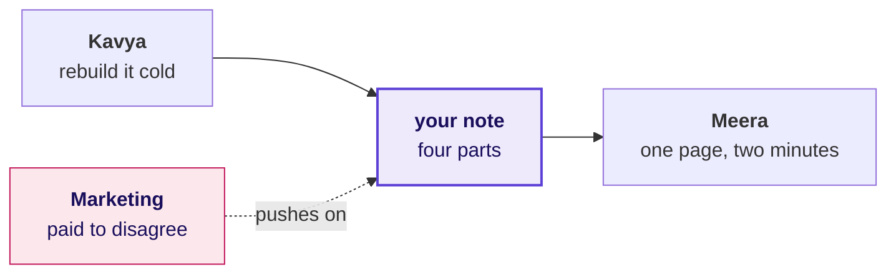
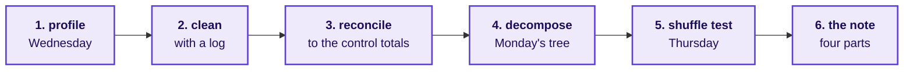
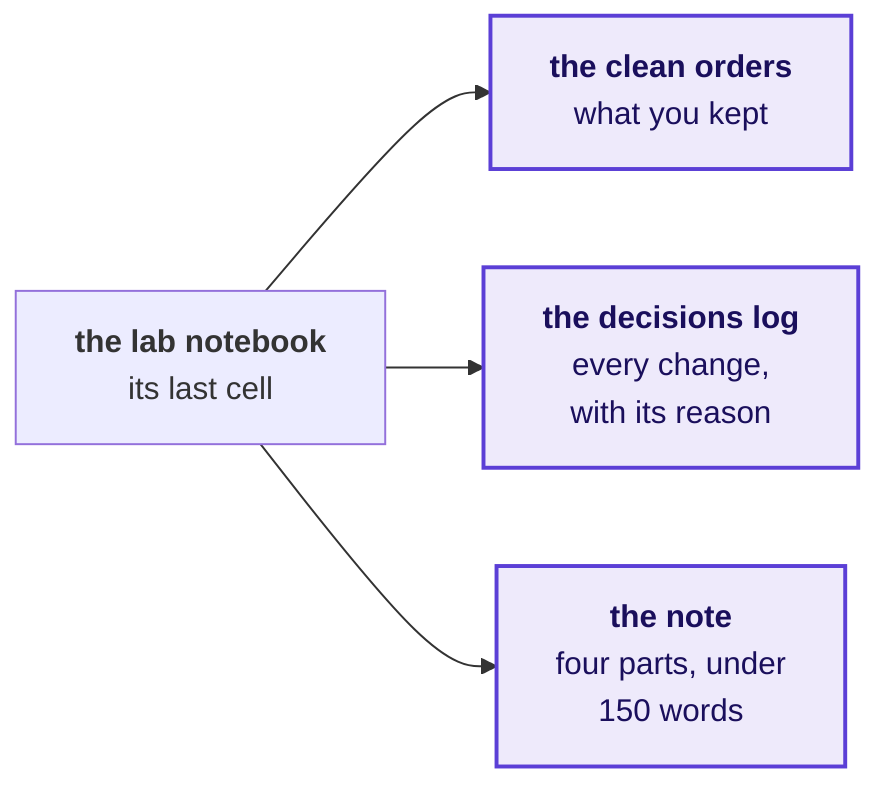
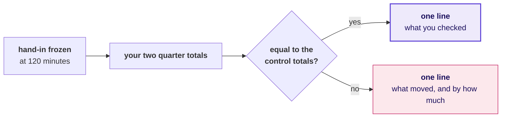

# Can you rebuild the week alone?

Week 1, Day 5. The lab.

Kicker: WEEK 1  ·  FRIDAY  ·  THE AI-FREE LAB
Quote: Before anything goes to Meera, rebuild the week from a raw export with no assistant and no notes.
Who: Kavya Nair, senior analyst, Kalpa Retail data team, to the trainees at Kalpa's Global Capability Centre

```notes
LIVE, one minute. Read Kavya's line aloud and leave it up. Today teaches nothing new: the morning
finds out which of the week's ideas each person owns, and the afternoon finds out whether they can
say it under pressure. Kavya's terms and the rules take ten minutes, then the clock starts.
```

---

## S1. One question for the whole day, in five parts
*Can you rebuild the week alone on a raw export, and hold your note when Marketing pushes?*

```timeline
label: The lab | title: Can you run it alone? | body: The week's method on an export you have not seen, 150 minutes.
label: The debrief | title: Where did it break? | body: Three chapters, one per place most rooms break.
label: The rehearsal | title: Does the note hold? | body: Thursday's note, defended against Marketing.
label: The cases | title: Which approach fits? | body: Three timed design cases, answered aloud.
label: The close | title: What is yours now? | body: The Kahoot, Saturday's paper and tonight's rerun. | tone: dark
```

```notes
LIVE, 1 minute. Read the day's question once, then the five parts. The first is the morning's
question and the third is the afternoon's; the other three follow from them.
```

---

## SECTION 1: Why rebuild it alone?
*Why does Kavya want the week rebuilt alone before Monday, and on what terms?*

```notes
LIVE. Ten minutes in all: who decides on Monday, the method as one picture, the first move, the
rules and the hand-in. Nothing here is new, so keep to the ten minutes.
```

---

## S2. Answered in four questions, in ten minutes
*Who needs this answer, and which smaller questions lead to it?*

**Who needs the answer.** Kavya Nair, before Monday's growth review: Meera acts on a note only when the person who wrote it can rebuild every number in it, and Marketing will be in the room.

```timeline
label: Question 1 | title: Who decides on Monday? | body: And on what.
label: Question 2 | title: In what order does it run? | body: The week's method, one picture.
label: Question 3 | title: What do you open first? | body: The first ten minutes.
label: Question 4 | title: What are the terms? | body: The rules and the hand-in. | tone: dark
```

```notes
LIVE, 1 minute. Read who needs the answer and the four questions, then start.
```

---

## S3. Monday's room decides on what you can run alone
*Who decides on Monday, and what will they act on?*



**The client asks.** Which branch of the revenue tree moved booked revenue from Q1 to Q2, in which segment, and does the number tie to Anand's control totals? A first line that does not tie to his books is sent back, and a misread branch sends Monday's effort to the wrong team, while Marketing's Rs 12 crore request waits on the answer.

```notes
LIVE, 2 minutes. Say the metric, who asks and what a wrong number costs, then the four questions on
the table from the row: whether the pipeline is yours or the notebook's, which step you reach for
first, whether the note survives a hostile question, and what you still cannot do without help. Do
not add anything about which step matters most: the lab measures what each person does unprompted.
```

---

## S4. Six steps, each built on a day of this week
*In what order does the week's method run, and why that order?*



Each step answers a question the next one depends on: whether the file is what it claims, which rows count, whether the clean data is still the same data, which branch moved, whether chance could do it, and what Meera should do.

```notes
LIVE, 2 minutes. Walk the six boxes left to right once, naming the day each came from. Then stop
talking about the method. During the lab only S9, the step questions and their minutes, stays on
the projector.
```

---

## S5. Question: what do you open first on a fresh export?
*Two hours, a raw file and a stakeholder waiting: where do the first ten minutes go?*

**Question.** Choose one: a) the quarter totals, so Meera has a number early; b) a profile of every field, before any number; c) the segment split, because that is where last week's finding sat; d) the notebook from Wednesday, to reuse its cleaning code.

```notes
LIVE, 2 minutes. Take letters from three people. Expect some a: it is the instinct under time
pressure and the reason a total gets quoted before anybody knows what the file holds.
```

---

## S6. Answer: a profile, before any number
*Why does the profile come before any total?*

```stats
value: 3 | label: counts per field | note: present, convertible, distinct
value: 1 | label: finding per mismatch | note: each count that disagrees with the field
value: 0 | label: numbers quoted | note: until the profile is read
```

**Kavya's review.** A profile costs twenty minutes and tells you which of the next hundred you will spend on repairs. Skipping it moves the repairs to Monday, in front of Marketing.

```notes
LIVE, 1 minute. The answer is b. Option d is closed by the rules anyway: no other notebook is open
today, because code written for Wednesday's file assumes Wednesday's defects.
```

---

## S7. Four rules, and no score on any wall
*What are the lab's rules, and why is it observed without a score?*

```cards
icon: bot-off | eyebrow: Rule 1 | title: No assistant | body: No chat model, no autocomplete that writes code, no search for code.
icon: book-x | eyebrow: Rule 2 | title: Notes closed | body: No other notebook in notebooks/, and no deck or cheat sheet, open on any screen.
icon: timer | eyebrow: Rule 3 | title: 120 minutes | body: The clock runs once; save as you go and hand in what you have.
icon: eye | eyebrow: Rule 4 | title: Observed, with no score | body: A TA notes where each person is at each mark; nothing goes on a wall.
```

**The rule.** Python's own documentation, reached from the notebook with `help()`, is allowed, because an analyst on the job has it too.

```notes
LIVE, 2 minutes. Read the four cards. Say plainly that the observation sets each person's first
stretch or remedial task and is never shown to the room. The support TA handles Codespace problems
only; a question about the method gets "what would you check?" and nothing more.
```

---

## S8. Three files, written by the notebook's last cell
*What do you hand in, and where does it go?*



The three files land in `notebooks/output/` as `clean_orders.csv`, `decisions_log.csv` and `note.md`. Open `notebooks/C2_W01_D05_lab_STUDENT.ipynb` and `exercises/unguided/C2_W01_D05_lab_brief_STUDENT.md` now; the export and Finance's control totals load in the first cell.

```notes
LIVE, 1 minute. Everyone opens both files now and runs the first cell before the clock starts, so a
Codespace problem is found in the ten minutes of terms and never inside the lab.
```

---

## SECTION 2: Can you run it alone?
*Can you take a raw export to a note Anand would sign, alone, in 120 minutes?*

```notes
LIVE. The clock starts when the next slide goes up. Leave S9 on screen for the whole lab, and change
nothing on the projector until the 120-minute mark.
```

---

## S9. Answered in six steps, at this pace
*Which six questions does the lab ask, and how long does each take?*

```timeline
label: 0 to 20 | title: What does the file hold? | body: Profile.
label: 20 to 50 | title: Which rows count? | body: Clean, with a log.
label: 50 to 65 | title: Is it still Finance's data? | body: Reconcile.
label: 65 to 90 | title: Which branch moved? | body: Decompose.
label: 90 to 105 | title: Could chance do it? | body: One shuffle test.
label: 105 to 120 | title: What should Meera do? | body: The note. | tone: dark
```

**Who needs the answer.** Anand checks the note's first line against his books, and Meera acts on it on Monday. The minutes are a pace; the order of the steps is fixed.

```notes
LIVE, the whole lab. At each mark the TAs walk their rows with the observation sheet and record the
step each learner is on, without a word. Say nothing to the room except the time remaining at 60,
90 and 110 minutes. Answer a method question with "what would you check?"
```

---

## S10. Your totals, set against the control file
*After the clock stops, what do you check, and what do you write down?*



Write the line under your note in a new markdown cell. What you handed in stays as it was, and this line is what you will say at the debrief.

```notes
LIVE, 20 minutes. The TAs copy each learner's output folder at the 120-minute mark before anyone
edits it; that snapshot is what the observation sheet records. Then read this slide aloud. Most of
the room will find its first real number here. Do not comment on anybody's result until the
debrief.
```

---

## S11. The step the clock took is the step to own
*What does the morning tell each of you?*

```stats
value: 6 | label: steps | note: in one order, every time
value: 120 | label: minutes | note: one pass, observed
value: 0 | label: assistants | note: no chat model and no autocomplete
```

**Kavya's review.** The step you skipped when the clock ran is the step you do not own yet, and this week you find out which one it is with nothing scored.

```notes
LIVE, 1 minute, then the ten-minute break. The debrief's first chapter, the reconciliation, runs for
twenty minutes after the break and closes the morning. Over lunch the TAs total the observation
sheets by step; all three chapters run whatever the tally says, and it decides where the trainer
lingers and which reserve slide replaces a self-study slide.
```
