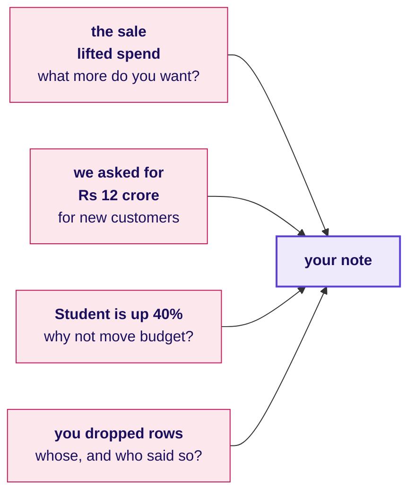
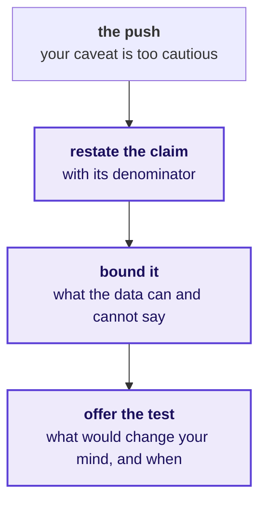
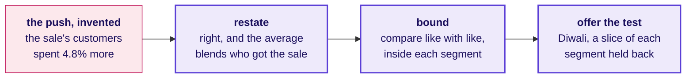
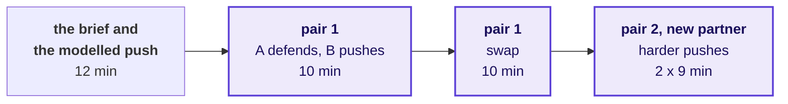
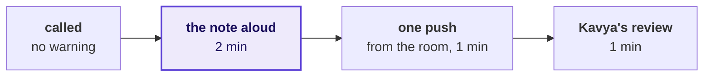
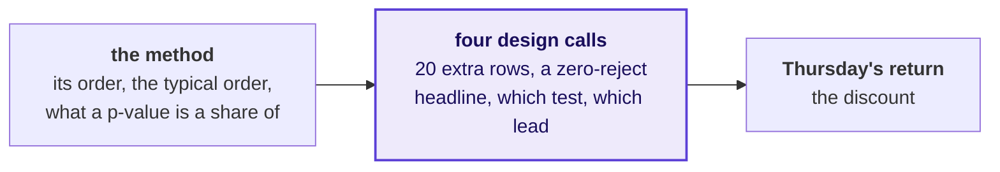

# Does your note hold when Marketing pushes?

Week 1, Day 5. The rehearsal.

Kicker: WEEK 1  ·  FRIDAY  ·  THE GROWTH-REVIEW REHEARSAL
Quote: Then say it to me the way you will say it to her, because I will push the way Marketing will.
Who: Kavya Nair, senior analyst, Kalpa Retail data team, to the trainees at Kalpa's Global Capability Centre

```notes
LIVE, inside S1's half minute. The afternoon, after the debrief's second half: the rehearsal in two rounds (100
minutes), three timed design cases (40), and the Kahoot with Saturday's preview (20). Nothing new
is taught; the afternoon is practice with a hostile listener.
```

---

## S1. Three questions for the afternoon
*Does your note hold when Marketing pushes, which approach fits each case, and what is yours now?*

```timeline
label: Section 1 | title: Does the note hold? | body: You defend Thursday's note in pairs, then to the room.
label: Section 2 | title: Which approach fits? | body: You answer three timed design cases aloud.
label: Section 3 | title: What is yours now? | body: The Kahoot, Saturday's paper and tonight's rerun close the week. | tone: dark
```

```notes
LIVE, half a minute. Read the three questions and start round one's brief.
```

---

## SECTION 1: Does the note hold?
*Does your note hold when a partner playing Marketing pushes, and can you keep its caveat without folding or overclaiming?*

```notes
LIVE. Round one is fifty minutes in pairs, round two is fifty minutes of call-outs to the room. If
time is short, cut round two first and keep round one whole.
```

---

## S2. Answered in six questions, over two rounds
*Who needs the note to hold, and which six questions test it?*

**Who needs the answer.** Meera, at Monday's growth review with Marketing in the room: a caveat that folds under a push sends her budget after a number that has not earned it, and one that overclaims loses the room.

```timeline
label: Question 1 | title: Who hears the note? | body: Each of four listens for one weakness.
label: Question 2 | title: How do two minutes fit? | body: Four parts run in one fixed order.
label: Question 3 | title: What will Marketing push? | body: Each push is a fair question with a motive.
label: Question 4 | title: How do you hold a caveat? | body: Restate it, bound it, and offer the test.
label: Question 5 | title: How do the rounds run? | body: You defend in pairs, then to the room.
label: Question 6 | title: What does a partner write? | body: The card holds four answers and no score. | tone: dark
```

```notes
LIVE, half a minute. Read who needs the answer and the six questions.
```

---

## S3. Four people hear the note, each for a weakness
*Who hears the note on Monday, and what does each listen for?*

```cards
icon: crown | eyebrow: CEO | title: Meera Raghavan | body: She wants one page in two minutes that says what to do, and she acts on its first line.
icon: megaphone | eyebrow: Owns campaigns | title: The marketing lead | body: The lead defends the monsoon sale and the acquisition budget against your reading.
icon: calculator | eyebrow: Finance | title: Anand Iyer | body: He checks that every number matches the books and can be audited.
icon: badge-check | eyebrow: Paid tier | title: The head of Retail-Plus | body: He wants to know whether the paid tier is slipping and whom to protect first.
```

**The client asks.** How do you know, what did you leave out, and what would change your mind? These are the questions every interviewer asks about a project too.

```notes
LIVE, 1 minute. Name the four and the one thing each listens for. The note being rehearsed is the
final version of Thursday's one-page note: Meera's three questions, the Retail-Plus gap, the Student
rise and the monsoon sale, each as claim, evidence, caveat and action, which is what goes to
Monday's review.
```

---

## S4. Four parts in two minutes, always in one order
*How do two minutes carry the note's four parts?*

```timeline
label: 30 seconds | title: Claim | body: One sentence carries the number and what it is out of.
label: 40 seconds | title: Evidence | body: Say what you computed, on how many, and how you checked it.
label: 30 seconds | title: Caveat | body: Name what would change the claim before anyone finds it.
label: 20 seconds | title: Action | body: Close on what to do, what it costs, and what would tell us more.
```

**Kavya's review.** Say the caveat before Marketing finds it, so the room hears it as part of the claim.

```notes
LIVE, 1 minute. The timings add to two minutes. A learner who runs long almost always ran long in
the evidence; the fix is one number fewer at the same pace.
```

---

## S5. Marketing pushes with numbers that are true
*What will a partner playing Marketing push on?*



Every push is a fair question with a motive behind it, so the answer is to the question it asks. The pair lists, with a harder set for the second pairing, are in the rehearsal brief.

```notes
LIVE, 2 minutes. Read the four pushes in a fair Marketing voice. The partner playing Marketing is
doing the defender a favour, and the room should hear that before round one starts. The first push
is the sharpest: the brief answers it in full on invented figures, and at S7 a TA reads Marketing's
lines while you model the answer once, in four minutes. It is on neither pair list.
```

---

## S6. Restate, bound, offer the test
*How do you hold a caveat without folding or overclaiming?*



**In the interview.** [D] A stakeholder attacks your caveat in front of the room; how do you hold it without overclaiming?

```notes
LIVE, 2 minutes. Demonstrate the three moves once with a volunteer playing Marketing on the Student
question. Then say what it would sound like to fold (dropping the caveat) and to overclaim (calling
the rise noise when you only know it is uncertain); the three moves sit between the two.
```

---

## S7. The answer that holds agrees with the numbers first
*How do you answer a push whose every number is true?*



On invented figures, the blend rises 4.8 percent because half the sale's customers were members who spend more anyway, against 35 percent of the rest, while inside each segment the sale's customers spent 5.0 percent less.

```notes
LIVE, 4 minutes: the modelled push. A TA reads Marketing's lines from the rehearsal brief, whose
invented averages are Rs 3,040 for the 60 customers who got the sale against Rs 2,900 for the 100
who did not, and you answer once in the three moves from the brief's invented segment table:
members Rs 3,990 against Rs 4,200 and Retail-Core Rs 2,090 against Rs 2,200, 5.0 percent less in
each. Say once that the figures are invented and that each defender's note carries Thursday's real
ones, which the same answer fits. The brief carries the answer in full; this slide is its shape.
```

---

## S8. Each person defends twice, to two partners
*How does round one run?*



In pair one each ten minutes runs: two minutes of the note read aloud, five of pushes and answers, three for the partner to fill the feedback card. Pair two takes nine: two, four and three.

```notes
LIVE, 50 minutes: S1 to S6 and S9 take eight, Marketing's sharpest push, modelled once at S7 with a
TA, takes four, and the pairs take the other 38. The TAs walk the room. Each TA also uses this round to
tell each of their learners, quietly and one at a time, the step the lab's observation sheet marked
for them, never aloud and never to a group.
```

---

## S9. The partner writes four answers and no score
*What does the partner write on the card?*

```cards
icon: hash | eyebrow: 1 | title: The claim | body: Quote the number and what it was out of, as you heard it.
icon: shield | eyebrow: 2 | title: The caveat | body: Was it said before the push, after it, or not at all?
icon: swords | eyebrow: 3 | title: The hardest push | body: Which one landed, and what answer would have held it?
icon: scissors | eyebrow: 4 | title: Keep and cut | body: Name one sentence to keep and one to cut.
```

The card is `exercises/guided/C2_W01_D05_feedback_card_STUDENT.md`, one per defence; the defender keeps it.

```notes
LIVE, 1 minute before the round starts. Say it once: the card has no score because a score turns
the partner into a judge, and the job is to be the harder audience, then the useful one.
```

---

## S10. A dozen notes, two minutes each, to the room
*How does round two run?*



About a dozen people are called in fifty minutes, so everybody prepares as if they are next.

```notes
LIVE, 50 minutes. Call names from a shuffled list, never by volunteering. The room's push comes
from a learner who has not yet been called. Kavya's review is the trainer's one minute: what held,
and the one change. This is the first round to cut if the day runs long.
```

---

## SECTION 2: Which approach fits?
*Which approach fits each case, sized how, and what would make you switch?*

```notes
LIVE. Forty minutes, thirteen per case plus one to set up. Show each answer slide only after the
two call-outs.
```

---

## S11. Answered in three cases, thirteen minutes each
*Who acts on the approach you pick, and which three cases test it?*

**Who needs the answer.** An interviewer asking the design question, and behind each case a Kalpa stakeholder who acts on the call: Meera, Anand and the product head.

```timeline
label: Case 1 | title: What do you leave out? | body: Meera wants a first read in two hours.
label: Case 2 | title: Which check runs first? | body: Zero rejects meet a Rs 20 lakh gap.
label: Case 3 | title: Can 5 of 12 beat 31 percent? | body: The product head wants to ship on 42 percent. | tone: dark
```

```notes
LIVE, half a minute. Read who needs the answer and the three cases.
```

---

## S12. Read, think, answer aloud, then two call-outs
*How does a timed design case run?*

```timeline
label: 1 minute | title: Read | body: Read the case, its options and the real company it is like.
label: 3 minutes | title: Think | body: On paper, pick an option, size it, and name what would switch it.
label: 4 minutes | title: Answer aloud | body: Each of you answers your partner for two minutes.
label: 5 minutes | title: Two call-outs | body: Two answers go to the room, then the model answer.
```

**In the interview.** A design question is scored on three things said in order: the option you choose, its size in minutes, rupees or visits, and the fact that would move you to another.

```notes
LIVE, half a minute. The prompts are in exercises/unguided/C2_W01_D05_timed_cases_STUDENT.md. The model
answers, their sizing and the real-company sources are in trainer/C2_W01_D05_timed_cases_key_TRAINER.md;
read the model after the call-outs.
```

---

## S13. Question: which step do you leave out?
*Meera wants a first read on Q3 in two hours, from a raw export of about 2,000 orders: which plan?*

**Question.** Each plan fits the clock at the lab's pace. Choose one: a) no reconciliation; b) no test, the note marked provisional; c) no tree: one segment's gap tested, with the note on that segment; d) no profile, straight to cleaning.

**In the interview.** [F] You have two hours and a raw export; what do you do first, and what do you skip? DMart is the likeness: its July to September 2025 revenue went out as a provisional update eight days before it filed the results.

```notes
LIVE, 13 minutes: read 1, think 3, pairs 4, two call-outs 3, the next slide 2. Listen for every plan
sized from the lab's pace, for the reconciliation named as the step never dropped, and for the fact
that would switch the plan. The 2,000 orders are illustrative.
```

---

## S14. Answer: keep the reconciliation, leave out the test
*Which plan fits, what does each cost, and what would switch it?*

| Plan | Minutes at the lab's pace | What it leaves out |
|---|---|---|
| A | 105 | The reconciliation, the step that can flip the first line's sign |
| B | 105 | The test; the note says provisional |
| C | 95 | The tree: one segment's gap is tested with no decomposition |
| D | 100 | The profile, so it cleans only the defects someone expected |

**The rule.** B, because every plan fits the clock and the call is which step to leave out. When Meera will act on one segment's gap, add the test on that gap and trim the tree to find the minutes, or take C if she named the segment herself. With no control total, B still holds, and the first line says the read is unreconciled.

```notes
LIVE, 2 minutes, after the call-outs. The model answer in full is in the trainer's key.
```

---

## S15. Question: which check runs first on the gap?
*The migrated ERP's first quarter shows zero rejects and a dashboard Rs 20 lakh above Anand's books: which check runs first?*

**Question.** About 50,000 rows. Choose the order: a) the ledger match first, since it names every order; b) ids against rows and the value accounting, then a monthly bridge; c) the monthly bridge first, then ids against rows once the gap is sized; d) the dashboard's own query first, since the dashboard has run for years.

**In the interview.** [S] Walk me through how you clean and check a dataset you have never seen. TSB is a loose likeness: its customers were locked out of a new platform, where this case is a total trusted before it was reconciled.

```notes
LIVE, 13 minutes. Listen for the checks ordered by cost against what each catches, for a stopping
point, and for Finance's number treated as the reference until the bridge closes. The 50,000 rows
and the Rs 20 lakh are illustrative.
```

---

## S16. Answer: two cells, then the bridge, then stop
*Which check runs first, and where do you stop?*

| Check | What it catches | Cost on 50,000 rows |
|---|---|---|
| Ids against rows | A batch posted twice | One cell, seconds |
| Every value summed or logged | Values set to zero without a log line | One cell, minutes to read |
| A rupee bridge by month | How big the gap is, and in which month | About 30 minutes |
| The ledger, order by order | Which orders differ | Most of a day |

**The rule.** b. The two cheap checks catch the commonest causes, the bridge says whether they explain the whole Rs 20 lakh, and only a month it cannot close is matched order by order. Tonight Anand hears that his number is the reference.

```notes
LIVE, 2 minutes, after the call-outs.
```

---

## S17. Question: can 5 of 12 visits beat 31 percent?
*A redesigned checkout converted 5 of 12 visits; the current one converted 31 percent of 1,200. Ship it tomorrow?*

**Question.** Choose one: a) ship to everyone now, on the 42 percent; b) keep the pilot small and wait for more weeks, at about 12 visits a week; c) split the traffic in half until each checkout has about 300 visits; d) one visit in ten to the new checkout for a fortnight, as a cautious rollout.

**In the interview.** [D] A stakeholder attacks your caveat in front of the room; how do you hold it without overclaiming? Bing is the likeness: a 12 percent revenue lift checked before anyone believed it.

```notes
LIVE, 13 minutes. Listen for the three moves from S6 and a test sized in visits and days. Folding
and overclaiming are both answers you will hear. The traffic figures are illustrative.
```

---

## S18. Answer: split the traffic for about half a week
*Which option fits, sized in visits and days, and what would switch it?*

```stats
value: 300 | label: visits per checkout | note: the case's given size to tell 42% from 31%
value: half a week | label: at 1,200 visits a week | note: a half-and-half split
value: 3 in 10 | label: chance alone | note: 5 or more of 12 at a true 31%
```

**The rule.** c. Waiting at 12 visits a week takes about 14 weeks, and shipping now bets on five conversions. Switch to d, one visit in ten for a fortnight, when a worse checkout would lose money.

```notes
LIVE, 2 minutes, after the call-outs. D gathers more evidence than C in four times the time; the
arithmetic is in the trainer's key, for a TA asked, never for the room.
```

---

## SECTION 3: What is yours now?
*What did the week make yours, what does Saturday ask, and what do you rerun tonight?*

```notes
LIVE. Twenty minutes: the Kahoot, Saturday previewed, the crux lines, tonight's tasks.
```

---

## S19. Answered in four questions, in twenty minutes
*Who will test the week's lines, and which four questions lead to tonight's rerun?*

**Who needs the answer.** You, before Saturday's paper and Monday's review: the lines you carry out of the week are the ones Marketing and an interviewer will test.

```timeline
label: Question 1 | title: Did the method stick? | body: The Kahoot tests it in eight items.
label: Question 2 | title: What does Saturday ask? | body: You hear the paper's format and marking.
label: Question 3 | title: Which lines carry over? | body: Five lines, one per step, close the week.
label: Question 4 | title: What do you rerun? | body: Tonight has three tasks, and one is a rerun. | tone: dark
```

```notes
LIVE, half a minute.
```

---

## S20. Eight ungraded questions show which calls wobble
*How will you find out which of the week's calls still wobble?*



The Kahoot is ungraded: three items on the method, four design calls and Thursday's return question.

```notes
LIVE, 8 minutes. Run kahoot/C2_W01_D05_quiz_STUDENT.md. After each item, one sentence on the wrong
answer most people picked, and move on.
```

---

## S21. Saturday puts the week on paper
*What does Saturday's paper ask, and how is it marked?*

```cards
icon: pencil | eyebrow: The paper | title: 120 minutes | body: It mixes blanks from a word bank, pairs from a match table, statements judged with their reason, scenario sets, applied maths and ordering.
icon: repeat | eyebrow: Marking | title: Swapped | body: Papers change hands and are marked against the key, read out by the Academic TA.
icon: messages-square | eyebrow: Discussion | title: Aloud | body: The most-missed items are discussed first, then the week's interview questions are answered aloud.
icon: circle-slash | eyebrow: Status | title: Ungraded | body: It is a performance indicator for you and the team, with no ranking.
```

```notes
LIVE, 4 minutes. Describe the format only; never preview an item. The pre-read for Saturday is in
preread/ and ships tonight.
```

---

## S22. Five lines, one per step the week made yours
*Which lines carry out of the week?*

1. Reconcile counts and rupees to a control total before you quote a total.
2. A zero-reject pass on a file you know is dirty is the first thing to investigate.
3. Count before rate: put the order count beside every rate before it leads a note.
4. Keep each customer's own two quarters together in every shuffle.
5. Say the claim with its denominator, the caveat before they find it, and what would change your mind.

```notes
LIVE, 4 minutes. Read all five, then ask two learners which line they broke this morning. Keep it
light; everybody broke one.
```

---

## S23. One rerun, one recap, and nothing to install
*What do you do tonight, and what does Saturday ask you to bring?*

```timeline
label: FIX | title: Rerun your step | body: Run the step the TA marked on the practice export, and write one line on what you will change.
label: RECAP | title: From memory | body: Write the note's four parts and the p-value sentence; both are on Saturday's paper.
label: SETUP | title: Sunday evening | body: Week 2 works in a live Postgres connection from VS Code; the setup steps arrive on Sunday.
```

**Kavya's review.** You have the method when its six steps, from the profile to the note, run in order under a clock and the note's caveat comes before the push, and tonight you rerun the one step the lab showed you do not own yet. On Monday, Meera hears Thursday's note from someone who ran the whole method alone this morning and held it against Marketing's pushes this afternoon.

```notes
LIVE, 3 and a half minutes. Close on the three tasks. The practice set is in exercises/practice/ and the TAs
run the practice lab from it after this block.
```
