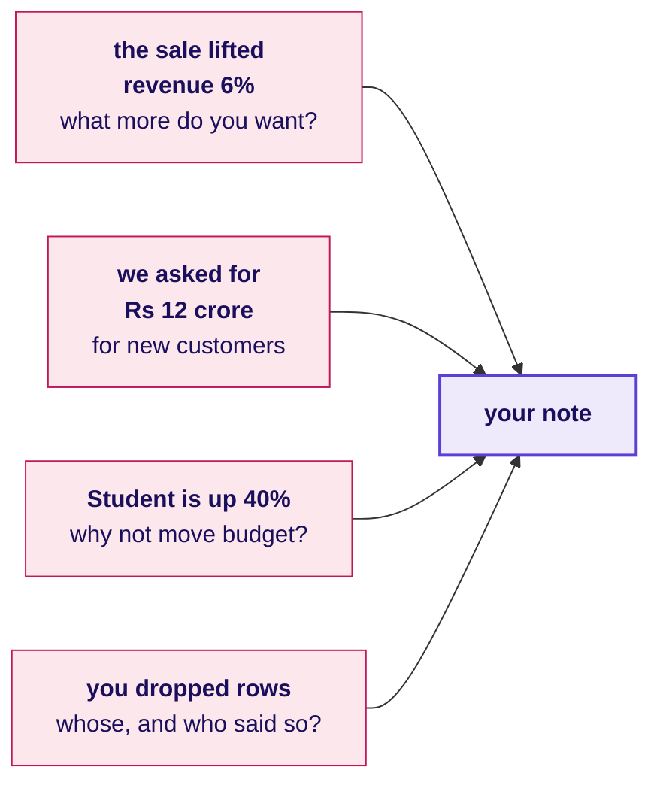
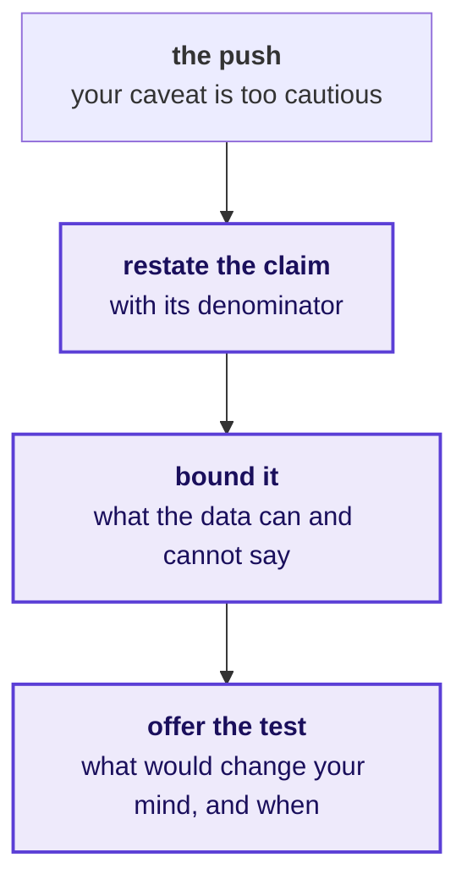
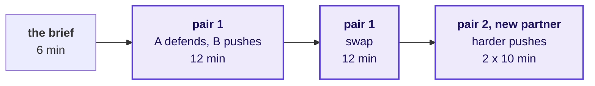
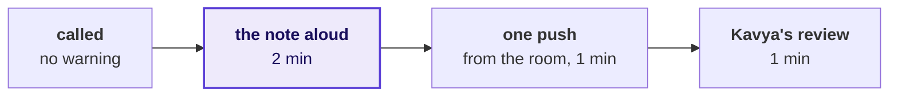
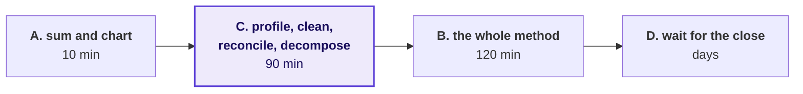
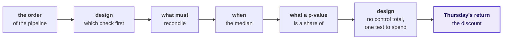

# The note, defended aloud

Week 1, Day 5. The rehearsal.

Kicker: WEEK 1  ·  FRIDAY  ·  THE GROWTH-REVIEW REHEARSAL
Quote: Then say it to me the way you will say it to her, because I will push the way Marketing will.
Who: Kavya Nair, senior analyst, Kalpa Retail data team, to the trainees at Kalpa's Global Capability Centre

```notes
LIVE, one minute. The afternoon, after the debrief's second half: the rehearsal in two rounds (100
minutes), three timed design cases (40), and the Kahoot with Saturday's preview (20). Nothing new
is taught; the afternoon is practice with a hostile listener.
```

---

## SECTION 1: The rehearsal
*A finding that cannot be said in two minutes to someone who disagrees has not been communicated.*

```notes
LIVE. Round one is fifty minutes in pairs, round two is fifty minutes of call-outs to the room.
If time is short, round two is the first thing cut, never round one.
```

---

## S1. Monday's room, and what each person wants
*Four people will hear the note, and each listens for a different weakness.*

```cards
icon: crown | eyebrow: CEO | title: Meera Raghavan | body: One page, two minutes, and what to do. She acts on the first line.
icon: megaphone | eyebrow: Owns campaigns | title: The marketing lead | body: Defends the monsoon sale and the acquisition budget against your reading.
icon: calculator | eyebrow: Finance | title: Anand Iyer | body: Checks that every number matches the books and can be audited.
icon: badge-check | eyebrow: Paid tier | title: The head of Retail-Plus | body: Wants to know whether his tier is slipping and who to protect.
```

**The client asks.** How do you know, what did you leave out, and what would change your mind? These are the questions every interviewer asks about a project too.

```notes
LIVE, 3 minutes. Name the four and the one thing each listens for. The note being rehearsed is the
final version of Thursday's one-page note: the three answers Meera asked for, which is what goes to
Monday's review.
```

---

## S2. Two minutes, four parts, one order
*The note read aloud keeps the shape it has on paper.*

```timeline
label: 30 seconds | title: Claim | body: One sentence, with the number and what it is out of.
label: 40 seconds | title: Evidence | body: What you computed, on how many, and how you checked it.
label: 30 seconds | title: Caveat | body: The thing that would change the claim, said before anyone finds it.
label: 20 seconds | title: Action | body: What to do, what it costs, and what would tell us more.
```

**Kavya's review.** The caveat said first is a sign of control. The same caveat dragged out of you by Marketing reads as a retreat.

```notes
LIVE, 2 minutes. The timings add to two minutes. A learner who runs long almost always ran long in
the evidence; the fix is one number fewer, never a faster voice.
```

---

## S3. What a partner playing Marketing pushes on
*Every push is a fair question with a motive behind it; answer the question, not the motive.*



The full list, with a harder set for the second pairing, is in `exercises/guided/C2_W01_D05_rehearsal_brief_STUDENT.md`.

```notes
LIVE, 2 minutes. Read the four pushes in a Marketing voice, not a villain's. The partner playing
Marketing is doing the defender a favour, and the room should hear that before round one starts.
The first push is the sharpest: the brief answers it in full, and a TA reads Marketing's lines while
you model the answer once.
```

---

## S4. Holding a caveat without overclaiming
*Restate, bound, offer the test: three moves that keep the claim the size the data supports.*



**In the interview.** [D] A stakeholder attacks your caveat in front of the room; how do you hold it without overclaiming?

```notes
LIVE, 3 minutes. Demonstrate the three moves once with a volunteer playing Marketing on the
Student question. Then say what it would sound like to fold (dropping the caveat) and to overclaim
(calling the rise noise when you only know it is uncertain); the three moves sit between the two.
```

---

## S5. Round one: pairs, then a new pair
*Fifty minutes: each person defends twice, to two different Marketing partners.*



In pair one each twelve minutes runs: two minutes of the note read aloud, six of pushes and answers, four for the partner to fill the feedback card. Pair two takes ten: two, five and three.

```notes
LIVE, 50 minutes, of which S1 to S4 and S6 took the first six. The TAs walk the room. Each TA also uses this round to tell each of their learners,
quietly and one at a time, the step the lab's observation sheet marked for them. Never aloud, never
to a group.
```

---

## S6. The feedback card has no score on it
*Four questions a partner answers in writing, and the defender keeps the card.*

```cards
icon: hash | eyebrow: 1 | title: The claim | body: Quote the number and what it was out of, as you heard it.
icon: shield | eyebrow: 2 | title: The caveat | body: Said before the push, after it, or not at all?
icon: swords | eyebrow: 3 | title: The hardest push | body: Which one landed, and what answer would have held it?
icon: scissors | eyebrow: 4 | title: Keep and cut | body: One sentence to keep, one to cut.
```

The card is `exercises/guided/C2_W01_D05_feedback_card_STUDENT.md`, one per defence.

```notes
LIVE, 1 minute before the round starts. Say it once: the card has no score because a score turns
the partner into a judge, and the job is to be the harder audience, then the useful one.
```

---

## S7. Round two: two minutes, to the whole room
*Random call-outs: the note read standing, one push from the room, Kavya's review.*



About a dozen people are called in fifty minutes, so everybody prepares as if they are next.

```notes
LIVE, 50 minutes. Call names from a shuffled list, never by volunteering. The room's push comes
from a learner who has not yet been called. Kavya's review is the trainer's one minute: what held,
and the one change. This is the first round to cut if the day runs long.
```

---

## SECTION 2: Three timed design cases
*The week's interview angles as a screen asks them: a situation, a clock, and your answer aloud.*

```notes
LIVE. Forty minutes, thirteen per case plus one to set up. The model answers are in the trainer's
key and are read only after the room has answered.
```

---

## S8. How a timed design case runs
*Read, think, answer to a partner, then the room hears two answers.*

```timeline
label: 1 minute | title: Read | body: The case, its options and the real company it is like.
label: 3 minutes | title: Think | body: On paper: which option fits, sized how, and what would switch it.
label: 4 minutes | title: Answer aloud | body: Two minutes each, to your partner.
label: 5 minutes | title: Two call-outs | body: Two answers to the room, then the model answer.
```

**In the interview.** A design question is scored on three things said in order: the option you choose, its size in minutes, rupees or visits, and the fact that would move you to another.

```notes
LIVE, 1 minute. The prompts are in exercises/unguided/C2_W01_D05_timed_cases_STUDENT.md. The model
answers, their sizing and the real-company sources are in trainer/C2_W01_D05_timed_cases_key_TRAINER.md;
read the model after the call-outs.
```

---

## S9. Case 1: Meera's first read in two hours
*A raw export, a review on Monday, and four plans that fit the clock differently.*

**In the interview.** [F] You have two hours and a raw export; what do you do first, and what do you skip? Here the export is Q3 from the ERP, and DMart is the likeness: it publishes a provisional quarter days before its board signs the results.



```notes
LIVE, 13 minutes. Listen for the options sized against the two hours, for the reconciliation named
as the step never dropped, and for the fact that would switch the plan.
```

---

## S10. Case 2: zero rejects and a Rs 20 lakh gap
*The first quarter out of the migrated ERP, a pass that reports nothing, and Finance disagreeing.*

**In the interview.** [S] Walk me through how you clean and check a dataset you have never seen. Here four checks cost from seconds to a day, and TSB is the likeness: a migrated platform trusted before it was reconciled.

```stats
value: 50,000 | label: rows | note: illustrative
value: 0 | label: rejects | note: as the pass reports
value: Rs 20 lakh | label: the gap | note: dashboard above Finance
```

```notes
LIVE, 13 minutes. Listen for the checks ordered by cost against what each catches, for a stopping
point, and for Finance's number treated as the reference until the bridge closes.
```

---

## S11. Case 3: 42 percent on twelve visits
*A product head wants to ship a result tomorrow, and your caveat is in the way.*

**In the interview.** [D] A stakeholder attacks your caveat in front of the room; how do you hold it without overclaiming? Here a new checkout converted 42 percent on 12 visits against 31 percent on 1,200, and Bing is the likeness: a 12 percent lift checked before anyone believed it.

```stats
value: 42% | label: new checkout | note: 5 of 12 visits
value: 31% | label: current checkout | note: of 1,200 visits
value: about 300 | label: visits per checkout | note: to tell the two apart
```

```notes
LIVE, 13 minutes. Listen for the three moves from S4 and a test sized in visits and days: about 300
visits each, about half a week at the current traffic. Folding and overclaiming are both answers you
will hear.
```

---

## SECTION 3: The close
*The week in eight questions, Saturday's paper, and the one step to rerun tonight.*

```notes
LIVE. Twenty minutes: the Kahoot, Saturday previewed, the crux lines, tonight's tasks.
```

---

## S12. The Kahoot: the week's method in eight questions
*Five on the method, two design calls and Thursday's return question, ungraded.*



```notes
LIVE, 8 minutes. Run kahoot/C2_W01_D05_quiz_STUDENT.md. After each item, one sentence on the
wrong answer most people picked, and move on.
```

---

## S13. Saturday: the week on paper
*Pen and paper, no assistant, objective items, marked by a peer against the key.*

```cards
icon: pencil | eyebrow: The paper | title: 120 minutes | body: Blanks from a word bank, pairs from a match table, statements judged with their reason, scenario sets, applied maths and ordering.
icon: repeat | eyebrow: Marking | title: Swapped | body: Papers change hands and are marked against the key, read out by the Academic TA.
icon: messages-square | eyebrow: Discussion | title: Aloud | body: The most-missed items first, then the week's interview questions as interview answers.
icon: circle-slash | eyebrow: Status | title: Ungraded | body: A performance indicator for you and the team, never a ranking.
```

```notes
LIVE, 4 minutes. Describe the format only; never preview an item. The pre-read for Saturday is in
preread/ and ships tonight.
```

---

## S14. The lines to carry out of the week
*The same five lines close the study notes, word for word.*

1. A total you have not reconciled is a guess with a decimal point.
2. Zero rejects on a file you know is dirty is a finding, not a result.
3. Count before rate: a rate on a handful of orders is a rumour with a percent sign.
4. Shuffle what belongs together: the customer, not the order.
5. Say the claim with its denominator, the caveat before they find it, and what would change your mind.

```notes
LIVE, 4 minutes. Read all five, then ask two learners which line they broke this morning. Keep it
light; everybody broke one.
```

---

## S15. Tonight, and what Saturday asks
*One rerun, one recap, and nothing to install until Sunday.*

```timeline
label: FIX | title: Rerun your step | body: The step the TA marked, on the practice export, with one line on what you will do differently.
label: RECAP | title: From memory | body: The note's four parts and the p-value sentence; both are on Saturday's paper.
label: SETUP | title: Sunday evening | body: Week 2 works in a live Postgres connection from VS Code; the setup steps arrive on Sunday.
```

**Kavya's review.** On Monday, Meera hears a note from someone who rebuilt every number in it alone this morning, and Marketing cannot say otherwise.

```notes
LIVE, 4 minutes. Close on the three tasks. The practice set is in exercises/practice/ and the TAs
run the practice lab from it after this block.
```
