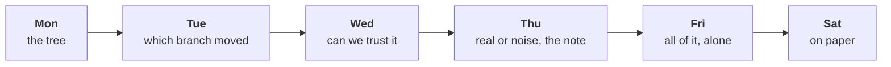

# Can you rebuild the week alone on a raw export, and hold your note when Marketing pushes?

Week 1, Friday, Kalpa Retail. Kavya Nair, senior analyst, set the day: "Before anything goes to
Meera, rebuild the week from a raw export with no assistant and no notes. Then say it to me the way
you will say it to her, because I will push the way Marketing will."

Nothing new was taught. The morning found out which of the week's ideas you own, and the afternoon
found out whether you can say them to someone who disagrees. These notes walk the method once more
as a worked case, take the three places most rooms broke as three chapters, and answer the day's
interview questions in full. Every number in the worked case and the chapters comes from an invented
export, labelled invented, which carries the week's four kinds of defect in places the lab file does
not, so the notes read the same before and after the lab. The lab file's own numbers appear only in
the debrief notebooks' your-turn cells, when you type them.

---

## What should you be able to do after Friday?

- Run the week's pipeline end to end on a file you have never seen, alone, in about two hours:
  profile, clean with a decisions log, reconcile, decompose along the tree, one test, a four-part
  note.
- Recognise, from the number alone, the four wrong numbers a hurried run produces: a total that was
  never reconciled, a pass with zero rejects that is short in rupees, a frequency rise made of
  repeated rows, and a headline rate on a handful of orders.
- Pick the test that keeps each customer's own two quarters together, and report both directions
  when the direction was chosen after looking.
- Say a note in two minutes, and hold its caveat against a push without folding and without
  overclaiming.

---

## Where does Friday sit in the week?

Monday gave the revenue tree (revenue is customers, times orders per customer, times revenue per
order) and the median. Tuesday gave the investigation ladder and the rule that a rate needs its
denominator. Wednesday gave the profile, the decisions log and the reconciliation. Thursday gave the
shuffle test and the four-part note. Friday put them in one order and took away every support. Week
2 runs the same method against a warehouse in SQL, so the order you practised today is the order you
will type queries in on Monday.

Kalpa Retail is the business every number this week belongs to. If a term here (booked revenue, a
segment, a control total) is not yet second nature, the retail and e-commerce dossier tells the
business's story from the start: `content/W01/D1/study-notes/C2_W01_D01_domain_retail_STUDENT.md`.
Its section 4 says who at Kalpa asks which question, and its section 5 writes the revenue tree and
the other metrics as formulas.

---

## What is the week's method, in one picture?

Each step answers the question the next one depends on. The profile says whether the file is what it
claims. Cleaning decides which rows count and writes down why. The reconciliation proves the clean
data is still the data Finance booked. The decomposition says which branch moved. The test says
whether chance could have done it. The note says what Meera should do.

The six steps work only in this order. A learner who knows all six and runs them out of order quotes
a total before the file is read, or tests a gap before it is reconciled, and that is what breaks first
when the clock runs.

---

## How does the method run on a fresh export, step by step?

The export in this worked case is invented: two quarters, 175 rows as it arrives, and Finance's
control totals beside it, Q1 Rs 40,00,000 on 83 orders and Q2 Rs 26,00,000 on 84 orders. A control
total is the source system's own count of orders and sum of rupees for a period. None of the
export's numbers is Kalpa's or the lab's.

### What does the file hold before you change anything?

The profile takes three counts per field: how many values are present, how many convert where a
number belongs, and how many are distinct.

| Field | Present | Convertible | Distinct |
|---|---|---|---|
| order_id | 175 | | 167 |
| amount | 175 | 174 | 130 |
| segment | 174 | | 4 |

Three findings arrive before anything is changed: 175 rows carry 167 order ids, so 8 rows repeat an
order; one amount will not convert; one row has no segment. No total has been computed yet, because
a total on this file would describe something nobody has looked at. Computing the quarter totals
first "so Meera has a number early" is how a number reaches a message before anyone knows what the
file holds, and it is very hard to take back.

### Which rows count, and why?

Every change is one of three decisions, logged as it is made with the order id and the reason.

| Decision | When | What it costs |
|---|---|---|
| Drop | A row repeats an order already kept, field for field | The count falls; revenue falls by the repeated amounts |
| Default | A field is missing and can be recovered without guessing, such as a segment the customer's other orders all carry | The value is inferred, and the log says from what |
| Keep and flag | A value is odd and real, such as an amount exported with its paise | Nothing is lost; somebody can check it later |

The amount that will not convert here is "850000.00", a corporate order exported with its paise. It
can be read without guessing, so it is read as Rs 8,50,000, kept and flagged. The row with no segment
belongs to a customer whose other orders are all Retail-Core, so it is defaulted to Retail-Core and
flagged.

### Is the clean data still the data Finance booked?

Two checks go in a cell before any analysis:

$$
\text{input} = \text{clean} + \text{rejected} \qquad 175 = 167 + 8
$$

$$
\text{clean rupees per quarter} = \text{control total per quarter}
$$

The count check proves every row is accounted for, and only the rupee check proves the values
survived the conversion. The first chapter below walks what a note says when this step is skipped,
and the bridge that closes it.

### Which branch moved, in which segment, and on how many orders?

Revenue is customers, times orders per customer, times revenue per order. The total moved, and the
tree says where.

| Segment | Customers Q1 / Q2 | Orders per customer | Revenue per order | Orders |
|---|---|---|---|---|
| Retail-Core | 24 / 24 | 1.50 / 1.50 | Rs 2,100 / Rs 2,080 | 36 / 36 |
| Retail-Plus | 16 / 16 | 2.00 / 2.00 | Rs 3,000 / Rs 2,550 | 32 / 32 |
| Student | 10 / 10 | 1.00 / 1.40 | Rs 900 / Rs 880 | 10 / 14 |
| Business | 5 / 2 | 1.00 / 1.00 | about Rs 7.6 lakh / Rs 12.2 lakh | 5 / 2 |

Two things moved: Retail-Plus's basket, down 15.0 percent on 32 orders a quarter with members and
frequency flat, and the corporate book, on five orders and then two.

### Could chance alone produce the move you will lead with?

The change worth testing is Retail-Plus's revenue per order, and the same 16 members sit in both
quarters, so the test keeps each member's own two quarters together and flips them at random. The
third chapter below runs it: 22 of 2,000 flipped worlds are as extreme, p = 0.011.

### What should Meera do, in four parts?

**Claim.** Q2 revenue fell 35.0 percent, from Rs 40,00,000 to Rs 26,00,000; Rs 13,88,200 of it is the
corporate book, and among consumers the one branch that moved is Retail-Plus's revenue per order,
down 15.0 percent from Rs 3,000 to Rs 2,550, with its 16 members and 2.00 orders each unchanged.
**Evidence.** 167 distinct orders reconcile to Finance's control totals in both quarters after
setting aside 8 repeated rows and reading one amount stored with its paise; with each member's two
quarters flipped at random, a change this large came up in 22 of 2,000 worlds, p = 0.011, and 13 of
the 16 members saw their own basket fall.
**Caveat.** The corporate book moved on five orders then two, too few to call a trend, and one Q1
order's segment was restored from its customer's other orders.
**Action.** Ask the corporate account owner why fewer orders came in, and look at Retail-Plus's
items per order and price per item before any spend.

With seven corporate orders in a file of consumer orders, the mean order here is Rs 39,521 and the
median Rs 2,350, so the note describes a typical order by its median and names what sits above it;
the mean stays for anything that must reconcile.

---

## Do the two quarters in your note match Finance's books?

**Who needs the answer.** Anand Iyer, Kalpa Retail's finance controller, reads the note's first line
against his control totals before any number reaches Meera Raghavan, the CEO, and Meera acts on that
line. A first line the wrong way round sends Monday's review after the wrong question, while
Marketing's Rs 12 crore request to win new customers is judged against a quarter that did not happen.

**The questions on the way.**

1. What headline does a pass that skips the reconciliation send?
2. Which check should run before the number is sent, and what does each one cost?
3. What does the count check fix, and what does it leave behind?
4. Which two moves walk the hurried sum to Finance's total?
5. Does a sum of the decisions themselves land on the same two moves?

The metric is booked revenue per quarter, the rupees of the orders recorded as sales in it, and its
change from Q1 to Q2. Nykaa faces the same question every quarter: it reports gross merchandise value
(GMV), the value of everything customers ordered at the prices charged before cancellations, returns
and tax come out, and revenue from operations, the income the company books in its own accounts. For
April to June 2025 they were Rs 4,182 crore and Rs 2,155 crore (FSN E-Commerce Ventures press
release, 12 August 2025), so a figure quoted without saying which it is can be out by nearly half. In
a public case from October 2020, Public Health England said 15,841 positive COVID-19 cases from 25
September to 2 October were left out of the daily figures because files exceeded a size limit (UK
government statement, 4 October 2020). No step raised an error, and the rows were simply missing.

### What headline does a pass that skips the reconciliation send?

**The plausible wrong answer.** On the invented export, a pass that keeps the rows as they arrived and
sets a value that will not convert to zero reads Q1 as Rs 31,50,000 on 83 rows and Q2 as Rs 38,16,420
on 92 rows, and reports Q2 up 21.2 percent. The books say Q2 fell 35.0 percent. The error reversed the
finding, and a note built on it tells Meera that a quarter which fell was a good one.

**Why it is wrong, and the check.** Nobody asked whether the data summed is the data Finance booked.
The reconciliation produces no new number, only a yes or a no, so it is the step a clock removes
first. The check is the control file: Q1 matches Finance's 83 orders and misses by rupees, and Q2
misses on both, 92 rows against 84 orders.

### Which check should run before the number is sent, and what does each one cost?

Each option is applied to the same hurried pass.

| Option | Analyst minutes | Needs | Headline it lets through | Points off the books |
|---|---|---|---|---|
| A. Trust the pass | 0 | nothing | +21.2% | 56.2 |
| B. Count check: rows and orders against Finance's counts | 2 | Finance's order counts | -17.5% | 17.5 |
| C. Counts and rupees against the control totals, with a bridge | 15 | Finance's rupee totals | -35.0% | 0.0 |
| D. Every order matched to Finance's ledger | about 120 | Finance's ledger | not run: no ledger came with the export | not run |

The computer's share of every option is under a millisecond, so the choice is about minutes of
thought and what each check needs from outside the file. **The best-fit call is C:** it needs only
the control file that came with the export and lands to the rupee. B is where most people who
checked at all stopped, and it still leaves the headline 17.5 points off. D would name every order
that differs, once Finance sends its ledger, and costs that request and the afternoon. **What would
change it:** no control total at all, or a bridge that will not close; then D, or a second export
from the source system, is the check.

### What does the count check fix, and what does it leave behind?

One row per order id, Wednesday's identity rule, lands every order count: 83 and 84 against
Finance's 83 and 84. The headline moves to -17.5 percent, the right direction at half the size,
because Q1 still sums to Rs 31,50,000 against Finance's Rs 40,00,000. A count check proves the rows
are there and says nothing about whether each row's value survived the conversion.

### Which two moves walk the hurried sum to Finance's total?

Rs 12,16,420 of rows Finance does not hold come out and Rs 8,50,000 is read back from text, and the
walk from Rs 69,66,420 lands on Rs 66,00,000. With both quarters on the books, the headline is a fall
of 35.0 percent. The sign changed, so the decision changed: Monday's review has Rs 14,00,000 of fall
to explain.

### Does a sum of the decisions themselves land on the same two moves?

The bridge's two moves were found by subtracting one total from another. The second route sums the
decisions on their own: the 8 rows set aside as repeats come to Rs 12,16,420 and the one log line
reads back Rs 8,50,000, each equal to its move in the bridge. Because it counts the decisions
themselves, a row set aside without its log line, or a value set to zero where it should have been
read, makes the two routes disagree. It cannot say whether each decision was right; the order-level
match answers that.

**The answer.** The two quarters match Finance's books only once counts and rupees both land. On the
invented export, the hurried +21.2 percent was a 35.0 percent fall.

---

## Every count reconciles and nothing was rejected: is the pass finished?

**Who needs the answer.** Anand's analyst audits every note before it reaches Meera and asks for the
rupees before the rows. A base quarter short by one large order can halve the fall the note reports:
nobody argues with the direction, so nobody acts at the right scale, and when Finance finds the order
every other number in the note is doubted with it.

**The questions on the way.**

1. What does a pass that sets unreadable values to zero report?
2. What do the rupees say when every count lands?
3. Which of four answers fits a value that will not convert?
4. What does reading the value change in the note?
5. Can a segment filter drop a row the same way?
6. Can the file alone, with no control total, find the gap?

The metric is Q1 booked revenue, the base every Q1 to Q2 rate divides by. JPMorgan Chase's own task
force reviewed the losses from the 2012 "London Whale" trades, as the high-risk trading in the
Synthetic Credit Portfolio of the bank's Chief Investment Office became known (FCA, 19 September
2013). It found a risk spreadsheet that "divided by their sum instead of their average", which
"likely had the effect of muting volatility by a factor of two and of lowering the VaR" (the task
force report of January 2013, as quoted by The Baseline Scenario, 9 February 2013). Muting volatility
means the model showed prices swinging half as much as they did, and VaR, value at risk, is a bank's
estimate of how much a portfolio could lose on a bad day. The losses came to $6.2 billion (FCA, 19
September 2013). The sheet ran without an error and produced a plausible number every day.

### What does a pass that sets unreadable values to zero report?

The most natural line of Python in the week is a `try` that returns 0 when `int()` fails. On the
invented export it reports Q1 on 83 orders and zero rejects, and every order count lands on
Finance's, which is exactly what a finished pass looks like.

### What do the rupees say when every count lands?

**The plausible wrong answer.** "Q1 on 83 orders, zero rejects, counts reconciled; Q2 fell 17.5
percent." The rupee check shows Q1 Rs 8,50,000 short, about a fifth of the quarter, and the note
reports a fall of 17.5 percent where the books show 35.0. The `try` turned "I could not read this
value" into "this order was worth nothing", and zero is a number, so no later step can tell the
difference. A count check cannot see it, because the row is still there.

### Which of four answers fits a value that will not convert?

| Option | Log lines | Count check | Rupee check | Headline |
|---|---|---|---|---|
| A. Zero in a try | 0 | passes | fails | -17.5% |
| B. Drop with a reason | 1 | fails | fails | -17.5% |
| C. Read it without guessing, convert, keep and flag | 1 | passes | passes | -35.0% |
| D. Hold it and ask the order's owner | 1 | fails | fails | provisional |

**The best-fit call is C** when the value can be read without guessing, as an amount exported with
its paise can. A is the one option that is never right: it sends the same wrong headline as B and
hides it, while B at least fails the count check, so its gap is visible. **What would change it:**
text that needs a guess (a word, a unit that could be lakh or crore) moves the call to D, and a row
that is not an order at all, such as a test transaction, moves it to B.

### What does reading the value change in the note?

One log line moves the reported fall from 17.5 to 35.0 percent, Rs 14,00,000 of fall on the books:
the difference between "a soft quarter" and "a quarter to explain".

### Can a segment filter drop a row the same way?

A filter on the segment name never sees a row whose segment is empty. On the invented export the
named segments fall one order short in Q1: Retail-Core reads Rs 73,250 on its named Q1 rows, so it
appears to rise 2.2 percent to Q2's Rs 74,880, and with the order restored from its customer's other
orders Q1 is Rs 75,600 and the segment fell 1.0 percent. The check is one line, that the segments
add back to the quarter in orders and in rupees, and the fix is a logged decision: restore the
segment when the customer's other orders all carry one, or keep the row as "segment unknown", named
and flagged, with the segment sums reconciled.

### Can the file alone, with no control total, find the gap?

Account for every value from inside the file: values present (167) equal those that convert (166)
plus those in the log (1), and the logged value equals the Rs 8,50,000 gap the rupee check found.
The rupee check needs a total from outside and says how much is missing; the value accounting needs
nothing outside and says where. On a file with no control total, it is the check you still have.

**The answer.** The pass is finished only once the rupees land as well as the counts. On the
invented export, zero rejects hid a value worth a fifth of the base quarter and halved the fall.

---

## Which finding leads the note, and how sure can Meera be of it?

**Who needs the answer.** Meera acts on the note's first line, and Marketing attacks any rate that
rests on a handful of orders. A trend claimed from a few orders sends a team after a segment that did
nothing, while the branch that moved waits a quarter.

**The questions on the way.**

1. Where in the tree does the fall sit?
2. How many orders does the biggest move rest on?
3. How should a team choose the lead, and what does each way cost?
4. Is the lead's fall more than chance on its members' own two quarters?
5. Is the fall broad, or carried by a few members?

The metric is the Q1 to Q2 fall split along the revenue tree by segment. IMDb will not rank a title in
its Top 250 until it has at least 25,000 ratings from regular voters, and its weighted rating pulls a
title with few votes toward the average of all titles (IMDb Help, ratings FAQ, updated 9 February
2026). In a public case, Howard Wainer showed small schools over-represented among both the best and
the worst performers, because small samples vary more, after the Gates Foundation had given about
$1.7 billion in education grants by 2001 with small schools central to them (Wainer, "The Most
Dangerous Equation", in Picturing the Uncertain World, Princeton University Press, 2009).

### Where in the tree does the fall sit?

On the invented export, Business carries Rs 13,88,200 of the Rs 14,00,000 fall, 99.2 percent, and its
revenue fell 36.3 percent. Among consumers, Retail-Plus's revenue per order fell 15.0 percent, Rs
14,400 of the fall, with its members and their frequency unchanged.

### How many orders does the biggest move rest on?

**The plausible wrong answer.** "The corporate book fell 36.3 percent and drove the whole decline; we
recommend a corporate retention plan." It is true to the rupee, and it rests on five orders in Q1 and
two in Q2. If each of the seven orders were equally likely to land in either quarter, a split at
least as uneven as five and two would come up in 45 percent of worlds. The check is to count before
you rate, and the fix says it as counts, "five corporate orders, then two", with a question to the
account owner about why fewer orders came in, which costs a phone call.

### How should a team choose the lead, and what does each way cost?

| Option | Leads with | Orders behind it | Chance alone | Minutes |
|---|---|---|---|---|
| A. Biggest rupee move | corporate revenue -36.3% | 7 | 45% of coin-flip worlds | 5 |
| B. The total, unsplit | revenue -35.0% | 167 | not asked | 2 |
| C. Count before rate | Retail-Plus revenue per order -15.0%, Rs 14,400 | 64 | p = 0.011, each member's quarters flipped | 15 |
| D. Test every segment | the smallest of four p-values | 7 to 72 | 0.011, and one of four under 0.05 | 45 |

**The best-fit call is C.** The Retail-Plus move is small in rupees and leads among consumers because
it is the one move on enough orders to test, while the corporate rupees sit beside it in the claim as
counts. B hides that 99.2 percent of the fall is the corporate book. D finds the same lead at three
times the minutes, and four tests at 0.05 carry about a one-in-five chance that one looks real by
luck, so on another file D leads with a fluke. **What would change it:** a question about which
accounts ordered less, a segment with hundreds of orders a quarter, or a second quarter of the same
move.

### Is the lead's fall more than chance on its members' own two quarters?

The same 16 members sit in both quarters, each placing one, two or three orders in each, so the fair
test keeps each member's own two quarters together. In a world where the quarter made no
difference, each member's Q1 and Q2 are as likely either way round, so the test swaps them at random
for each member, recomputes the tier's revenue per order and counts the worlds with a change at least
as large. The fall was found by reading the tree, so a rise of that size counts too. Of 2,000 flipped
worlds, 22 showed a change as large as -15.0 percent in either direction:

$$
p = \frac{22}{2000} = 0.011
$$

said in one sentence: "In 1.1 percent of the worlds where the quarter made no difference to each
member's basket, chance produced a change this large, either way." It says nothing about the chance
the finding is wrong. Counting all 65,536 ways to flip sixteen members gives 0.0107, and counted one
way it is 0.0015, a number a note quotes only when the direction was predicted before the data was
seen. A different question, "did Retail-Plus's basket move differently from Retail-Core's?",
compares different customers, so its fair test shuffles the segment label across whole customers,
each carrying all their orders: p = 0.0385 for a gap of 14.0 points. Both are fair, each for its own
question.

### Is the fall broad, or carried by a few members?

Member by member: of the 16, 13 saw their own average order fall and 3 saw it rise. Coin flips split
sixteen members at least that unevenly in 2.1 percent of worlds, either way, so the sign test agrees
with the flips. It uses only the direction of each member's change, which is why its p of 0.021 sits
above the flips' 0.011. The flips say the change is bigger than chance; the count says the fall is
broad.

**The trap in the test itself: splitting what belongs together.** Pooling every member's Q1 and Q2
revenue and dealing the quarter labels at random treats a member's own two quarters as two
strangers, and on the invented export it reads the fall as chance, p = 0.222, where flipping each
member's own quarters on the same measure gives 0.0025. Shuffling segment labels across single orders
splits one customer's orders between the groups, and it reads the gap to Retail-Core as chance too,
0.0945 against 0.0385. Here both hurried tests moved p up, because members differ in size far more
than each member's own quarters differ; on a file where a customer's orders are alike, splitting them
more often makes p too small. The rule holds either way: keep each customer's own two quarters
together, flip them as a pair when the same customers sit in both quarters, and shuffle labels across
whole customers when the groups are different customers.

**The answer.** The lead is the branch that moved on enough orders to test and survived the test,
said beside the biggest move as counts. On the invented export, Retail-Plus's basket leads at p =
0.011, broad across 13 of 16 members, with the corporate book as five orders then two.

---

## Does your note hold when Marketing pushes?

**Who needs the answer.** Meera, at Monday's growth review with Marketing in the room: a caveat that
folds under a push sends her budget after a number that has not earned it, and one that overclaims
loses the room.

**The questions on the way.**

1. Who hears the note, and what does each person listen for?
2. How do two minutes carry the note's four parts?
3. How do you hold a caveat without folding or overclaiming?

Meera wants one page in two minutes and acts on the first line; the marketing lead defends the
monsoon sale and the acquisition budget; Anand checks every number against the books; the head of
Retail-Plus wants to know whether the tier is slipping. The two-minute shape is the note's own: about
thirty seconds of claim, forty of evidence, thirty of caveat, twenty of action.

Three moves keep a claim the size the data supports. Restating with the denominator reminds the room
what the number is out of. Bounding says what the data can and cannot show, in one sentence each.
Offering the test turns the caveat into a plan with a size and a date. The two failures sit either
side: folding drops the caveat to end the argument, and overclaiming calls the uncertainty a
certainty in the other direction.

**The answer.** The note holds when its caveat comes before the push and every answer restates,
bounds and offers a test, so the room hears the caveat as part of the claim.

---

## Which approach fits each design case, sized how, and what would make you switch?

**Who needs the answer.** An interviewer asking the design question, and behind each case a Kalpa
stakeholder who acts on the call. The numbers marked illustrative in the cases are set for the case
and are not Kalpa's records.

| Case | The approaches on the table | The call, sized | The switch |
|---|---|---|---|
| Meera's first read, two hours after the export lands | Four plans at the lab's pace, each leaving one step out: no reconciliation (105 minutes), no test (105), the tree for one segment only (95), no profile (100) | The plan with no test, marked provisional, with the reconciliation never dropped | A segment gap Meera will act on: add the test on that gap and trim the tree; no control total: say so in the first line |
| Zero rejects and a Rs 20 lakh gap after the migration | Ids against rows (a cell); the value accounting (a cell); a rupee bridge by month (about 30 minutes); every order against the ledger (a day) | The two cheap checks first, then the bridge, and stop where it closes | A month the bridge cannot close gets matched order by order |
| 42 percent on twelve visits | Ship now; wait at 12 visits a week (about 14 weeks); a half-and-half split to about 300 visits each (about half a week); one visit in ten for a fortnight (about 240 new-checkout visits beside about 2,160) | The split, about half a week | A checkout that could lose money: one visit in ten for the fortnight; a dozen visits a week in all: decide on cost and reversibility |

Each case has a real likeness. DMart (Avenue Supermarts) put out its July to September 2025 standalone revenue, Rs
16,218.79 crore across 432 stores, as a provisional business update on 3 October 2025, and reported
the quarter's results in a regulatory filing on 11 October 2025 (Business Today, 11 October 2025).
TSB is a loose likeness: its April 2018 migration to a new platform left 1.9 million customers unable
to view their accounts, as The Register reported the independent review's findings in November 2019,
and in December 2022 the FCA and PRA fined it £48.65 million in total; its customers were locked out,
where case 2 is a total trusted before it was reconciled. At Bing, a headline change that had waited
more than six months lifted revenue 12 percent when tested, worth more than $100 million a year in
the US, and tripped a "too good to be true" alert before the analysis confirmed it (Kohavi and
Thomke, Harvard Business Review, September to October 2017).

In case 3, about 300 visits per checkout is the case's given size for telling 42 percent from 31;
where that figure comes from is a later week's topic. What the room can compute today is the other
side of it: 5 conversions in 12 visits would still turn up in about 3 weeks of 10 if the new checkout
were really no better than 31 percent.

**The answer.** Each case is answered with the option, its size in minutes, rupees or visits, and
the fact that would switch it, in that order.

---

## How would you answer the day's interview questions?

**[S] Walk me through how you clean and check a dataset you have never seen.**
I profile before I change anything: for every field, how many values are present, how many convert
to the type I need, and how many are distinct, and I write down each count that is not what the
field should hold. Then I clean with a decision per defect (drop, default, or keep and flag) and a
log line per decision with the reason, so someone else can follow it. Before any analysis I
reconcile twice: input rows equal clean plus rejected, and each period's rupees equal the source
system's control total. If the bridge does not land, the missing step is the finding. Only then do
I compute anything.

**[S] Tell me about an analysis you did: what did you find, and how sure are you?**
I give it in the four parts. The claim with its number and denominator: for example, that one tier's
revenue per order fell 15.0 percent on 32 orders a quarter while its 16 members and their frequency
held. The evidence: the data reconciled to Finance's totals, and the same members sat in both
quarters, so I flipped each member's two quarters at random and a change that large came up in 1.1
percent of worlds, counting either direction. How sure: below the usual 0.05 bar, with 13 of the 16
members' own baskets falling, and the cause still open, which is what I would test next. Last comes
the action I recommended, with its cost.

**[F] You have two hours and a raw export; what do you do first, and what do you skip?**
First I agree the question and the window. Then I profile the file, before I quote any number. I clean with a log and
I reconcile counts and rupees before I decompose, because a repeated batch or a lost amount can
reverse a finding. I skip what does not change today's answer: extra charts, a test on every segment,
a second source. I never skip the reconciliation, and I say out loud what I skipped.

**[D] A stakeholder attacks your caveat in front of the room; how do you hold it without
overclaiming?**
I restate the claim with its denominator, so the room hears what the number rests on. I bound it:
what the data does show and what it cannot show yet. Then I offer the test that would settle it, with
its size and how long it takes. I do not drop the caveat to end the argument, and I do not swing to
calling the result noise when all I know is that it is uncertain.

**The design question: which check, which lead, which test, sized how, and what would make you
switch?** I name the two to four ways a team could answer it, and size each on the data in front of
me: the minutes, what each needs from outside the file and the error it leaves. On a training export
that meant a count check that took two minutes and left the headline 17.5 points off, against a
counts-and-rupees check that took fifteen and landed on the books. I choose the cheapest option that
lands on the reference, and I name the fact that would move me to the next one, such as no control
total, a bridge that will not close, or a segment with too few orders to rate. For the test, the
question sets the unit: the same customers across two quarters get their own two quarters flipped,
and different customers get the label shuffled across whole customers.

---

## Which lines carry out of the week?

1. Reconcile counts and rupees to a control total before you quote a total.
2. A zero-reject pass on a file you know is dirty is the first thing to investigate.
3. Count before rate: put the order count beside every rate before it leads a note.
4. Keep each customer's own two quarters together in every shuffle.
5. Say the claim with its denominator, the caveat before they find it, and what would change your mind.

---

## What do you do tonight?

The practice lab set, `exercises/practice/C2_W01_D05_practice_STUDENT.md`, runs on a practice export
with the week's defects in other places. Start at the step your TA marked for you, rerun it in a
fresh copy of the lab notebook, and write one line under your lab note on what you will do
differently. Then write the note's four parts and the p-value sentence from memory, without looking
at these notes. The debrief notebooks' your-turn cells, run on the lab file, show where your own run
broke.

---

## Where is this tested next?

Saturday's paper is pen and paper, no assistant, objective items, marked by a peer against a key and
discussed as interview answers. The note's four parts and the p-value sentence are on it. Monday's
growth review hears the note you defended today.

---

## What do the day's terms mean?

| Term | Meaning |
|---|---|
| Profile | Present, convertible and distinct counts for every field, read before any change |
| Decisions log | One line per cleaning decision: the order id, drop or default or keep and flag, and the reason |
| Identity rule | What makes two rows the same order; here, the order id |
| Control total | The source system's own count and rupee total for a period, which a clean pass must land on |
| Reconciliation | Proving the clean data is the same data: counts, then rupees, then a bridge between them |
| Bridge | The walk from one total to another, one explained move at a time |
| Decomposition | Splitting a change along the revenue tree to find the branch and segment that moved |
| Shuffle test | Rearranging labels at random many times to see how often chance alone produces the result |
| Paired test | A shuffle test for the same customers in two periods: each customer's own two periods are swapped at random |
| Sign test | Counting the customers whose own figure fell against those whose rose, and asking how often coin flips split them that unevenly |
| p-value | The share of chance-only worlds with a result at least as large as the real one |
| Caveat | The fact that would change the claim, said before anyone finds it |
| Best-fit call | The option chosen from two to four sized ones, with the fact that would change it |
| Second route | The same number reached by an independent method, so a wrong decision in the first route shows up as a disagreement |
| Value accounting | Every value present is either summed as it came or logged with the number it was read as |
| Provisional figure | A number sent before the books close, said as provisional, with what it was checked against |

---

## Where can you read further?

- Seeing Theory, frequentist inference, to replay the shuffle idea interactively:
  https://seeing-theory.brown.edu/frequentist-inference/index.html (verified 29 Sep 2026)
- Aced (formerly Exponent), data analyst interview questions, for more of the questions the rehearsal
  practised:
  https://www.tryexponent.com/blog/top-data-analyst-interview-questions (verified 29 Sep 2026)

---

## So, can you rebuild the week alone and hold the note?

You can when the six steps run in their order under a clock and the note survives the push. The lab
showed each person which step they do not own yet; the debrief's three chapters showed that the
reconciliation, the rupees behind a clean-looking pass and the count behind a rate are where a note
most often breaks; and the rehearsal showed that a caveat said before the push holds where one
defended after it folds. Tonight you rerun your marked step on the practice export.
