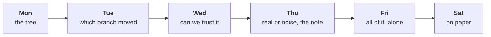

# The week, rebuilt alone

Week 1, Friday, Kalpa Retail. Kavya Nair, senior analyst, set the day: "Before anything goes to
Meera, rebuild the week from a raw export with no assistant and no notes. Then say it to me the way
you will say it to her, because I will push the way Marketing will."

Nothing new was taught. The morning found out which of the week's ideas you own, and the afternoon
found out whether you can say them to someone who disagrees. These notes walk the method once more
as a single worked case, name the places it breaks under a clock, and answer the day's interview
questions in full. Every number in the worked case is invented for these notes.

---

## What you can now do

- Run the week's pipeline end to end on a file you have never seen, alone, in about two hours:
  profile, clean with a decisions log, reconcile, decompose along the tree, one shuffle test, a
  four-part note.
- Recognise, from the number alone, the four wrong numbers a hurried run produces: a total that was
  never reconciled, a pass with zero rejects that is short in rupees, a frequency rise made of
  repeated rows, and a headline rate on a handful of orders.
- Say a note in two minutes, and hold its caveat against a push without folding and without
  overclaiming.

---

## Where this sits

Monday gave the tree and the median. Tuesday gave the investigation ladder and the rule that a rate
needs its denominator. Wednesday gave the profile, the decisions log and the reconciliation. Thursday
gave the shuffle test and the four-part note. Friday put them in one order and took away every
support. Week 2 runs the same method against a warehouse in SQL, so the order you practised today is
the order you will type queries in on Monday.

---

## The picture to remember: six steps, one order

Each step answers the question the next one depends on. The profile says whether the file is what it
claims. Cleaning decides which rows count and writes down why. The reconciliation proves the clean
data is still the same data. The decomposition says which branch moved. The shuffle says whether
chance could have done it. The note says what Meera should do.

The order is the method. A learner who knows all six steps and runs them out of order has a
collection of techniques, and a collection breaks the first time the clock runs.

---

## The worked case, step by step

The export in this case is invented: two quarters, 150 rows as it arrives, Finance's control totals
beside it. Q1's control total is Rs 50,00,000 on 70 orders and Q2's is Rs 45,00,000 on 72 orders.

### 1. Profile before any number

Three counts per field: present, convertible where a number belongs, distinct.

| Field | Present | Convertible | Distinct |
|---|---|---|---|
| order_id | 150 | | 142 |
| amount | 150 | 149 | 120 |
| segment | 149 | | 4 |

Three findings, before anything is changed: 150 rows carry 142 order ids, so 8 rows repeat an order;
one amount will not convert; one row has no segment. Each goes into the plan for cleaning. None has
been fixed yet, and no total has been computed, because a total on this file would be a total of
something nobody has described.

**The trap at this step.** Computing the quarter totals first "so Meera has a number early". That
number reaches a message before anyone knows what the file holds, and it is very hard to take back.

### 2. Clean, with a reason for every decision

Every change is one of three decisions, logged as it is made with the order id and the reason.

| Decision | When | What it costs |
|---|---|---|
| Drop | A row repeats an order already kept, field for field | The count falls; revenue falls by the repeated amounts |
| Default | A field is missing and can be recovered without guessing, such as a segment the customer's other orders all carry | The value is inferred, and the log says from what |
| Keep and flag | A value is odd and real, such as an amount written with commas | Nothing is lost; somebody can check it later |

The amount that will not convert here is "6,40,000", a corporate order typed with Indian digit
grouping. It can be read without guessing: remove the commas, convert, keep it, flag it. The row
with no segment belongs to a customer whose other three orders are all Retail-Plus, so it is
defaulted to Retail-Plus and flagged.

**The trap at this step: the pass that looks clean.** The most natural line of Python in the week is
a `try` that returns 0 when `int()` fails. It runs, it reports zero rejects, the row count
reconciles, and Q1 is short by Rs 6,40,000. Zero rejects on a file you know is dirty is a finding,
not a result.

### 3. Reconcile: counts, then rupees

Two checks, written in a cell before any analysis.

$$
\text{input} = \text{clean} + \text{rejected} \qquad 150 = 142 + 8
$$

$$
\text{clean rupees per quarter} = \text{control total per quarter}
$$

The count check proves every row is accounted for. Only the rupee check proves the values survived
the conversion. In this case the bridge from the export as a hurried sum reads it to the books runs:
Rs 97,20,000 summed as read (the text amount lost, the repeats kept), less Rs 8,60,000 of repeated
rows, plus Rs 6,40,000 recovered from text, lands on Rs 95,00,000, which is Rs 50,00,000 plus
Rs 45,00,000.

**The trap at this step, the one most rooms fall into: the reconciliation skipped.** The
reconciliation produces no new number, only a yes or a no, so it is the step a clock removes first.
Skip it here and the hurried run reads Q1 as Rs 43,60,000 and Q2 as Rs 53,60,000, and reports Q2
up 22.9 percent. The books say Q2 fell 10 percent. The error did not blur the finding; it reversed it,
and the note built on it tells Meera that the quarter that fell was a good one.

### 4. Decompose along the tree

Revenue is customers, times orders per customer, times revenue per order. The total moved; the tree
says where.

| Segment | Customers Q1 / Q2 | Orders per customer | Revenue per order | Orders |
|---|---|---|---|---|
| Retail-Core | 25 / 25 | 1.40 / 1.40 | Rs 2,400 / Rs 2,100 | 35 / 35 |
| Retail-Plus | 16 / 16 | 1.75 / 1.81 | Rs 3,000 / Rs 2,950 | 28 / 29 |
| Business | 5 / 5 | 1.40 / 1.60 | about Rs 6.9 lakh / Rs 5.4 lakh | 7 / 8 |

Two things moved: Retail-Core's basket, down 12.5 percent on 35 orders a quarter with customers and
frequency flat, and the corporate book, on seven and eight orders.

**The trap at this step: the wrong branch.** The repeated batch in this export held six
Retail-Core orders from Q2 and two corporate orders, Rs 8,60,000 in all. On the uncleaned rows
Retail-Core shows 41 Q2 orders from 25 customers: orders per customer up from 1.40 to 1.64, about a
sixth more often, and revenue up 2.5 percent, which reads as flat. The repeated rows manufactured a
frequency rise that hid the basket fall. That is why the reconciliation comes before the tree in the
method, and never after it.

**The second trap here: the headline on a handful of orders.** "Corporate revenue fell 10 percent"
may be true to the rupee, and it rests on fifteen orders. Count before rate, every time: say "8
orders against 7" before you say any percentage, and a rate on fewer than about thirty observations
goes in the caveat.

### 5. One shuffle test, on the customer

The gap worth testing is the one the decomposition points at: Retail-Core's change in revenue per
order against Retail-Plus's. Thursday's test, unchanged: measure the real gap, assume the segment
labels mean nothing, shuffle them across customers 2,000 times, and count the worlds at least as
extreme.

Suppose 30 of 2,000 shuffles produce a gap as large as the real one. Then:

$$
p = \frac{30}{2000} = 0.015
$$

said in one sentence: "In 1.5 percent of the worlds where segment does not matter, chance produced a
gap this large." It is not the chance the finding is wrong.

**The trap at this step: the wrong unit.** Shuffling orders instead of customers splits each
customer's orders across the two groups, builds worlds that could not exist, and widens the spread of
chance gaps. On the same data an order-level shuffle can report p = 0.09 where the customer-level
shuffle reports 0.015, and a real fall gets dismissed as noise. The unit you shuffle is the unit
that carries the label.

### 6. The note, in four parts

**Claim.** Q2 revenue fell 10 percent, from Rs 50,00,000 to Rs 45,00,000; among consumers, the one
branch that moved is Retail-Core's revenue per order, down 12.5 percent from Rs 2,400 to Rs 2,100,
with its 25 customers and 1.40 orders each unchanged.
**Evidence.** 142 distinct orders reconcile to Finance's control totals in both quarters after
dropping 8 repeated rows and converting one amount stored as text; the Retail-Core gap beat 1,970 of
2,000 customer-level shuffles, p = 0.015.
**Caveat.** The corporate book also moved, on seven orders then eight, too few to call a trend.
**Action.** Look at Retail-Core's items per order and price per item before any spend.

**The typical-order trap, for the note's wording.** With five corporate orders in a file of
consumer orders, the mean order is tens of thousands of rupees and the median about two thousand.
Describe a file with its median and name what sits above it; keep the mean for what must reconcile.

---

## The afternoon: defending the note

A finding that cannot be said in two minutes to someone who disagrees has not been communicated. The
two-minute shape is the note's own: about thirty seconds of claim, forty of evidence, thirty of
caveat, twenty of action.

Three moves keep a claim the size the data supports. Restating with the denominator reminds the room
what the number is out of. Bounding says what the data can and cannot show, in one sentence each.
Offering the test turns the caveat into a plan with a size and a date. The two failures sit either
side: folding drops the caveat to end the argument, and overclaiming calls the uncertainty a
certainty in the other direction. The caveat said before anyone asks reads as control; the same
caveat dragged out by a push reads as a retreat.

---

## The interview questions of the day, answered in full

**[S] Walk me through how you clean and check a dataset you have never seen.**
I profile before I change anything: for every field, how many values are present, how many convert
to the type I need, and how many are distinct, and I write down each count that is not what the
field should hold. Then I clean with a decision per defect (drop, default, or keep and flag) and a
log line per decision with the reason, so someone else can follow it. Before any analysis I
reconcile twice: input rows equal clean plus rejected, and each period's rupees equal the source
system's control total. If the bridge does not land, the missing step is the finding. Only then do
I compute anything.

**[S] Tell me about an analysis you did: what did you find, and how sure are you?**
I give it in the four parts. The claim with its number and denominator: for example, that one
segment's revenue per order fell 12.5 percent on 35 orders a quarter while its customers and their
frequency held. The evidence: the data reconciled to Finance's totals, and a shuffle on customers put
the gap at p = 0.015. How sure: sure it is not chance at the usual bar, not sure of the cause, which
is what I would test next. And the action I recommended, with its cost.

**[F] You have two hours and a raw export; what do you do first, and what do you skip?**
First I agree the question and the window. Then a profile, before any number. I clean with a log and
I reconcile counts and rupees before I decompose, because a repeated batch or a lost amount can
reverse a finding. I skip what does not change today's answer: extra charts, a test on every segment,
a second source. I never skip the reconciliation, and I say out loud what I skipped.

**[D] A stakeholder attacks your caveat in front of the room; how do you hold it without
overclaiming?**
I restate the claim with its denominator, so the room hears what the number rests on. I bound it:
what the data does show and what it cannot show yet. Then I offer the test that would settle it, with
its size and how long it takes. I do not drop the caveat to end the argument, and I do not swing to
calling the result noise when all I know is that it is uncertain.

---

## The lines to carry out of the week

1. A total you have not reconciled is a guess with a decimal point.
2. Zero rejects on a file you know is dirty is a finding, not a result.
3. Count before rate: a rate on a handful of orders is a rumour with a percent sign.
4. Shuffle what belongs together: the customer, not the order.
5. Say the claim with its denominator, the caveat before they find it, and what would change your mind.

---

## Try this yourself

The practice lab set, `exercises/practice/C2_W01_D05_practice_STUDENT.md`, runs on a practice export
with the week's defects in other places. Start at the step your TA marked for you, rerun it in a
fresh copy of the lab notebook, and write one line under your lab note on what you will do
differently. Then write the note's four parts and the p-value sentence from memory, without looking
at these notes.

---

## Where this gets tested

Saturday's paper is pen and paper, no assistant, objective items, marked by a peer against a key and
discussed as interview answers. The note's four parts and the p-value sentence are on it. Monday's
growth review hears the note you defended today.

---

## Glossary

| Term | Meaning |
|---|---|
| Profile | Present, convertible and distinct counts for every field, read before any change |
| Decisions log | One line per cleaning decision: the order id, drop or default or keep and flag, and the reason |
| Identity rule | What makes two rows the same order; here, the order id |
| Control total | The source system's own count and rupee total for a period, which a clean pass must land on |
| Reconciliation | Proving the clean data is the same data: counts, then rupees, then a bridge between them |
| Bridge | The walk from one total to another, one explained move at a time |
| Decomposition | Splitting a change along the revenue tree to find the branch and segment that moved |
| Shuffle test | Re-labelling at random many times to see how often chance alone produces the gap |
| p-value | The share of chance-only worlds with a gap at least as large as the real one |
| Caveat | The fact that would change the claim, said before anyone finds it |

---

## Go deeper

- Seeing Theory, frequentist inference, to replay the shuffle idea interactively:
  https://seeing-theory.brown.edu/frequentist-inference/index.html (verified 29 Sep 2026)
- Aced (formerly Exponent), data analyst interview questions, for more of the questions the rehearsal
  practised:
  https://www.tryexponent.com/blog/top-data-analyst-interview-questions (verified 29 Sep 2026)
