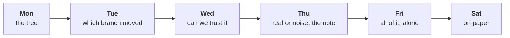

# The week, rebuilt alone

Week 1, Friday, Kalpa Retail. Kavya Nair, senior analyst, set the day: "Before anything goes to
Meera, rebuild the week from a raw export with no assistant and no notes. Then say it to me the way
you will say it to her, because I will push the way Marketing will."

Nothing new was taught. The morning found out which of the week's ideas you own, and the afternoon
found out whether you can say them to someone who disagrees. These notes walk the method once more
as a single worked case, name the places it breaks under a clock, and answer the day's interview
questions in full. The worked case uses invented numbers, so it reads the same before and after the
lab; the three debrief chapters that follow it use this morning's lab export, whose notebooks open
once the lab clock has stopped.

---

## What you can now do

- Run the week's pipeline end to end on a file you have never seen, alone, in about two hours:
  profile, clean with a decisions log, reconcile, decompose along the tree, one shuffle test, a
  four-part note.
- Recognise, from the number alone, the four wrong numbers a hurried run produces: a total that was
  never reconciled, a pass with zero rejects that is short in rupees, a frequency rise made of
  repeated rows, and a headline rate on a handful of orders.
- Say a note in two minutes, and hold its caveat against a push without folding and without
  overclaiming.

---

## Where this sits

Monday gave the tree and the median. Tuesday gave the investigation ladder and the rule that a rate
needs its denominator. Wednesday gave the profile, the decisions log and the reconciliation. Thursday
gave the shuffle test and the four-part note. Friday put them in one order and took away every
support. Week 2 runs the same method against a warehouse in SQL, so the order you practised today is
the order you will type queries in on Monday.

Kalpa Retail is the business every number this week belongs to. If a term in these notes (booked
revenue, a segment, a control total) is not yet second nature, the retail and e-commerce dossier
tells the business's story from the start: `content/W01/D1/study-notes/C2_W01_D01_domain_retail_STUDENT.md`.
Its section 4 says who at Kalpa asks which question, and its section 5 writes the revenue tree and the
other metrics as formulas.

---

## The picture to remember: six steps, one order

Each step answers the question the next one depends on. The profile says whether the file is what it
claims. Cleaning decides which rows count and writes down why. The reconciliation proves the clean
data is still the same data. The decomposition says which branch moved. The shuffle says whether
chance could have done it. The note says what Meera should do.

The order is the method. A learner who knows all six steps and runs them out of order has a
collection of techniques, and a collection breaks the first time the clock runs.

---

## The worked case, step by step

The export in this case is invented: two quarters, 150 rows as it arrives, Finance's control totals
beside it. Q1's control total is Rs 50,00,000 on 70 orders and Q2's is Rs 45,00,000 on 72 orders.

### 1. Profile before any number

Three counts per field: present, convertible where a number belongs, distinct.

| Field | Present | Convertible | Distinct |
|---|---|---|---|
| order_id | 150 | | 142 |
| amount | 150 | 149 | 120 |
| segment | 149 | | 4 |

Three findings, before anything is changed: 150 rows carry 142 order ids, so 8 rows repeat an order;
one amount will not convert; one row has no segment. Each goes into the plan for cleaning. None has
been fixed yet, and no total has been computed, because a total on this file would be a total of
something nobody has described.

**The trap at this step.** Computing the quarter totals first "so Meera has a number early". That
number reaches a message before anyone knows what the file holds, and it is very hard to take back.

### 2. Clean, with a reason for every decision

Every change is one of three decisions, logged as it is made with the order id and the reason.

| Decision | When | What it costs |
|---|---|---|
| Drop | A row repeats an order already kept, field for field | The count falls; revenue falls by the repeated amounts |
| Default | A field is missing and can be recovered without guessing, such as a segment the customer's other orders all carry | The value is inferred, and the log says from what |
| Keep and flag | A value is odd and real, such as an amount written with commas | Nothing is lost; somebody can check it later |

The amount that will not convert here is "6,40,000", a corporate order typed with Indian digit
grouping. It can be read without guessing: remove the commas, convert, keep it, flag it. The row
with no segment belongs to a customer whose other three orders are all Retail-Plus, so it is
defaulted to Retail-Plus and flagged.

**The trap at this step: the pass that looks clean.** The most natural line of Python in the week is
a `try` that returns 0 when `int()` fails. It runs, it reports zero rejects, the row count
reconciles, and Q1 is short by Rs 6,40,000. Zero rejects on a file you know is dirty is a finding,
not a result.

### 3. Reconcile: counts, then rupees

Two checks, written in a cell before any analysis.

$$
\text{input} = \text{clean} + \text{rejected} \qquad 150 = 142 + 8
$$

$$
\text{clean rupees per quarter} = \text{control total per quarter}
$$

The count check proves every row is accounted for. Only the rupee check proves the values survived
the conversion. In this case the bridge from the export as a hurried sum reads it to the books runs:
Rs 97,20,000 summed as read (the text amount lost, the repeats kept), less Rs 8,60,000 of repeated
rows, plus Rs 6,40,000 recovered from text, lands on Rs 95,00,000, which is Rs 50,00,000 plus
Rs 45,00,000.

**The trap at this step, the one most rooms fall into: the reconciliation skipped.** The
reconciliation produces no new number, only a yes or a no, so it is the step a clock removes first.
Skip it here and the hurried run reads Q1 as Rs 43,60,000 and Q2 as Rs 53,60,000, and reports Q2
up 22.9 percent. The books say Q2 fell 10 percent. The error did not blur the finding; it reversed it,
and the note built on it tells Meera that the quarter that fell was a good one.

### 4. Decompose along the tree

Revenue is customers, times orders per customer, times revenue per order. The total moved; the tree
says where.

| Segment | Customers Q1 / Q2 | Orders per customer | Revenue per order | Orders |
|---|---|---|---|---|
| Retail-Core | 25 / 25 | 1.40 / 1.40 | Rs 2,400 / Rs 2,100 | 35 / 35 |
| Retail-Plus | 16 / 16 | 1.75 / 1.81 | Rs 3,000 / Rs 2,950 | 28 / 29 |
| Business | 5 / 5 | 1.40 / 1.60 | about Rs 6.9 lakh / Rs 5.4 lakh | 7 / 8 |

Two things moved: Retail-Core's basket, down 12.5 percent on 35 orders a quarter with customers and
frequency flat, and the corporate book, on seven and eight orders.

**The trap at this step: the wrong branch.** The repeated batch in this export held six
Retail-Core orders from Q2 and two corporate orders, Rs 8,60,000 in all. On the uncleaned rows
Retail-Core shows 41 Q2 orders from 25 customers: orders per customer up from 1.40 to 1.64, about a
sixth more often, and revenue up 2.5 percent, which reads as flat. The repeated rows manufactured a
frequency rise that hid the basket fall. That is why the reconciliation comes before the tree in the
method, and never after it.

**The second trap here: the headline on a handful of orders.** "Corporate revenue fell 10 percent"
may be true to the rupee, and it rests on fifteen orders. Count before rate, every time: say "8
orders against 7" before you say any percentage, and a rate on fewer than about thirty observations
goes in the caveat.

### 5. One shuffle test, on the customer

The gap worth testing is the one the decomposition points at: Retail-Core's change in revenue per
order against Retail-Plus's. Thursday's test, unchanged: measure the real gap, assume the segment
labels mean nothing, shuffle them across customers 2,000 times, and count the worlds at least as
extreme.

Suppose 30 of 2,000 shuffles produce a gap as large as the real one. Then:

$$
p = \frac{30}{2000} = 0.015
$$

said in one sentence: "In 1.5 percent of the worlds where segment does not matter, chance produced a
gap this large." It is not the chance the finding is wrong.

**The trap at this step: the wrong unit.** Shuffling orders instead of customers treats a customer's
orders as independent, which they are not, and builds worlds that could not exist. The wrong unit can
move the p-value either way. Most often it makes p too small, because a customer's correlated orders
count as extra evidence and a chance gap looks real. When the gap is each customer's own change from
one quarter to the next, the order shuffle breaks that pairing and makes p too large instead: on the
same data it can report 0.09 where the customer-level shuffle reports 0.015. Either way the verdict
belongs to the unit, so the unit you shuffle is the unit that carries the label.

### 6. The note, in four parts

**Claim.** Q2 revenue fell 10 percent, from Rs 50,00,000 to Rs 45,00,000; among consumers, the one
branch that moved is Retail-Core's revenue per order, down 12.5 percent from Rs 2,400 to Rs 2,100,
with its 25 customers and 1.40 orders each unchanged.
**Evidence.** 142 distinct orders reconcile to Finance's control totals in both quarters after
dropping 8 repeated rows and converting one amount stored as text; the Retail-Core gap beat 1,970 of
2,000 customer-level shuffles, p = 0.015.
**Caveat.** The corporate book also moved, on seven orders then eight, too few to call a trend.
**Action.** Look at Retail-Core's items per order and price per item before any spend.

**The typical-order trap, for the note's wording.** With five corporate orders in a file of
consumer orders, the mean order is tens of thousands of rupees and the median about two thousand.
Describe a file with its median and name what sits above it; keep the mean for what must reconcile.

---

## The three places the room broke, as worked cases

Each chapter below has a notebook of the same number and title in `notebooks/`, and its numbers are
the lab export's.

### Chapter 1. The reconciliation, skipped

**The need.** Anand Iyer, the finance controller, does not act on a number that does not tie to his
control totals, and Meera Raghavan acts on the note's first line. The metric is booked revenue per
quarter and its change from Q1 to Q2. A wrong first line costs the direction of Monday's review: a
fall read as growth means nobody investigates, while Marketing's Rs 12 crore request is judged against
a quarter that did not happen.

**Who else faces it.** Nykaa reports two true numbers for one quarter. For April to June 2025 its
consolidated GMV was Rs 4,182 crore and its revenue from operations Rs 2,155 crore (FSN E-Commerce
Ventures press release, 12 August 2025), so a figure quoted without saying which it is can be out by
nearly half. In a public case from October 2020, Public Health England said 15,841 positive COVID-19
cases from 25 September to 2 October were left out of the daily figures because files exceeded a size
limit (UK government statement, 4 October 2020). No step raised an error; the rows were not there.

**The options, sized on the lab export.** Each option is applied to the hurried pass most notes were
built on, which kept rows as they arrived and set a value that would not convert to zero.

| Option | Analyst minutes | Headline it sends | Points off the books |
|---|---|---|---|
| A. Trust the pass | 0 | +11.8% | 40.3 |
| B. Count check: rows and orders against Finance's counts | 2 | -14.6% | 13.9 |
| C. Counts and rupees against the control totals, with a bridge | 15 | -28.5% | 0.0 |
| D. Every order matched to Finance's ledger | about 120 | -28.5% | 0.0 |

The computer's share of every option is under a millisecond, so the choice is about minutes of
thought. **The best-fit call is C:** it needs only the control file that came with the export and
lands to the rupee. B is where most people who checked at all stopped, and it still leaves the
headline 14 points off. D names every order that differs and costs a request to Finance and the
afternoon. **What would change it:** no control total at all, or a bridge that will not close; then
D, or a second export from the source system, is the check.

**The trap.** The hurried run reports Q1 Rs 50,63,000 and Q2 Rs 56,60,890, **Q2 up 11.8 percent**,
and the note says the top line needs no action. The check is the control file: Q1 matches Finance's
98 orders and misses by rupees, and Q2 misses on both, 109 rows against 99 orders. With counts and
rupees both on the books, Q2 fell 28.5 percent, from Rs 60,48,000 to Rs 43,25,480. The sign changed,
so the decision changed.

**The second route.** Start at each of Finance's totals, add back the rupees of the rows removed,
subtract the value read back, and land on what the hurried run summed. Both routes give -28.5
percent. Show Finance the forward bridge; run the walk back when a bridge closes suspiciously neatly,
because two mistakes that cancel pass one route and fail the other.

### Chapter 2. The pass that looks clean

**The need.** Anand's analyst audits every note, and asks for the rupees before the rows. The metric
is Q1 booked revenue, the base every Q1 to Q2 rate divides by. A base that is short by one large order
halves the fall the note reports: nobody argues with the direction, so nobody acts at the right scale.

**Who else faces it.** JPMorgan Chase's own task force, reviewing the 2012 "London Whale" losses, found
a risk spreadsheet that "divided by their sum instead of their average", which "likely had the effect
of muting volatility by a factor of two and of lowering the VaR" (the task force report of January
2013, as quoted by The Baseline Scenario, 9 February 2013). The losses came to $6.2 billion (FCA, 19
September 2013). The sheet ran without an error and produced a plausible number every day.

**The trap.** A `try` that sets a failure to zero reports **Q1 Rs 50,63,000 on 98 orders, zero
rejects**, and every order count lands on Finance's. The rupee check shows Q1 Rs 9,85,000 short, 16.3
percent of the quarter, and the note reports Q2 down 14.6 percent where the books show 28.5.

**The options for one value that will not convert.**

| Option | Log lines | Count check | Rupee check | Headline |
|---|---|---|---|---|
| A. Zero in a try | 0 | passes | fails | -14.6% |
| B. Drop with a reason | 1 | fails | fails | -14.6% |
| C. Read it without guessing, convert, keep and flag | 1 | passes | passes | -28.5% |
| D. Hold it and ask the order's owner | 1 | fails | fails | provisional |

**The best-fit call is C** when the value can be read without guessing, as digits with an Indian
ledger's grouping commas can. A is the one option that is never right: it sends the same wrong
headline as B and hides it, while B at least fails the count check, so its gap is visible. **What
would change it:** text that needs a guess (a word, a unit that could be lakh or crore) moves the call
to D, and a row that is not an order at all, such as a test transaction, moves it to B.

**The same shape one step later.** A filter on the segment name never sees a row whose segment is
empty. On the lab export the named segments fall one Q2 order short of the quarter, and Retail-Plus
reads -1.6 percent on its named rows (Rs 95,200 to Rs 93,670) where, with the order restored from its
customer's other orders, it grew 1.5 percent (to Rs 96,600). The check is one line: the segments add
back to the quarter in orders and in rupees.

**The second route.** Account for every value from inside the file: values present (197) equal those
that convert (196) plus those in the log (1), and the logged value equals the gap the rupee check
found. The rupee check needs a total from outside and says how much is missing; the value accounting
needs nothing outside and says where. On a file with no control total, it is the check you still
have.

### Chapter 3. The headline on too few orders

**The need.** With both quarters on the books, the question becomes which right number leads the note.
Meera acts on the first line, and Marketing attacks any rate that rests on a handful of orders. The
metric is the Rs 17,22,520 fall split along the tree. A trend claimed from a few orders sends a team
after a segment that did nothing, while the branch that moved waits a quarter.

**Who else faces it.** IMDb will not rank a title in its Top 250 until it has at least 25,000 ratings
from regular voters, and its weighted rating pulls a title with few votes toward the average of all
titles (IMDb Help, ratings FAQ, updated 9 February 2026). In a public case, Howard Wainer showed small
schools over-represented among both the best and the worst performers, because small samples vary
more, after the Gates Foundation had given about $1.7 billion in education grants by 2001 with small
schools central to them (Wainer, "The Most Dangerous Equation", in Picturing the Uncertain World,
Princeton University Press, 2009).

**The trap.** Business revenue fell **29.2 percent**, and it carries Rs 17,10,000 of the Rs 17,22,520
fall, 99.3 percent of it. It is true to the rupee, and it rests on six orders in Q1 and four in Q2. If
each of ten orders were equally likely to land in either quarter, a split at least as uneven as six
and four would happen in 75.4 percent of worlds. The check is to count before you rate. The fix says
it as counts, "two fewer corporate orders, six then four", with a question to the account owner about
which two, which costs a phone call.

**The options for choosing the lead.**

| Option | Leads with | Orders behind it | Chance alone | Minutes |
|---|---|---|---|---|
| A. Biggest rupee move | Business -29.2% | 10 | 0.75, coin flips | 5 |
| B. The total, unsplit | revenue -28.5% | 197 | not asked | 2 |
| C. Count before rate | Retail-Core revenue per order -17.1%, Rs 15,400 | 88 | 0.0195, shuffle | 15 |
| D. Test every segment | the smallest of four p-values | 10 to 88 | 0.19 false alarm | 45 |

**The best-fit call is C.** The Retail-Core move is small in rupees, Rs 15,400, about 0.9 percent of
the fall, and it leads among consumers because it is the one move on enough orders to test, while
the corporate Rs 17,10,000 sits beside it in the claim as counts. Retail-Core kept its 30 customers and their 1.47 orders each, and its
revenue per order fell from Rs 2,050 to Rs 1,700. Shuffling the segment label across customers, 2,000
times with `random.Random(7)`, produced a gap as large as the real -15.6 points only 39 times: p =
0.0195, a share of chance-only worlds, never the chance the finding is wrong. D runs four tests at
0.05, and the chance at least one looks real by luck is about 19 percent. **What would change it:** a
question about accounts rather than rates, a segment with hundreds of orders a quarter, or a second
quarter of the same move.

**The second route.** Customer by customer: of the 30 Retail-Core customers who ordered in both
quarters, 21 saw their own average order fall. The shuffle says the gap is bigger than chance; the
count says the fall is broad, spread across most of the segment's customers.

---

## The afternoon: defending the note

A finding that cannot be said in two minutes to someone who disagrees has not been communicated. The
two-minute shape is the note's own: about thirty seconds of claim, forty of evidence, thirty of
caveat, twenty of action.

Three moves keep a claim the size the data supports. Restating with the denominator reminds the room
what the number is out of. Bounding says what the data can and cannot show, in one sentence each.
Offering the test turns the caveat into a plan with a size and a date. The two failures sit either
side: folding drops the caveat to end the argument, and overclaiming calls the uncertainty a
certainty in the other direction. Say the caveat before anyone asks, so the room hears it as part
of the claim.

---

## The three design cases

The afternoon's timed round asked the design question three times, each set at Kalpa and each with a
real company as its likeness: which approach fits, sized how, and what would make you switch.

| Case | The approaches on the table | The call, sized | The switch |
|---|---|---|---|
| Meera's first read, two hours after the export lands | Sum and chart (10 minutes); the whole method (120); profile, clean, reconcile and decompose, marked provisional (90); wait for Finance's close (days) | The 90-minute plan, with the reconciliation never dropped | No control total: say so in the first line; a segment gap Meera will act on: add the test and cut the tree to that gap |
| Zero rejects and a Rs 20 lakh gap after the migration | Ids against rows (a cell); the value accounting (a cell); a rupee bridge by month (about 30 minutes); every order against the ledger (a day) | The two cheap checks first, then the bridge, and stop where it closes | A month the bridge cannot close gets matched order by order |
| 42 percent on twelve visits | Ship now; wait at 12 visits a week (about 14 weeks); a half-and-half split to about 300 visits each (about half a week); one visit in ten for a fortnight (about 240 new-checkout visits beside about 2,160, enough evidence in four times the time) | The split, about half a week | A checkout that could lose money: one visit in ten for the fortnight; a dozen visits a week in all: decide on cost and reversibility |

The likenesses. DMart (Avenue Supermarts) put out its July to September 2025 standalone revenue, Rs
16,218.79 crore across 432 stores, as a provisional business update on 3 October 2025, days before its
board approved the results. TSB's April 2018 migration to a new platform left 1.9 million customers
unable to view their accounts, by the independent review's count, and in December 2022 the FCA and PRA
fined it £48.65 million in total. At Bing, a headline change that had waited more than six months
lifted revenue 12 percent when tested, worth more than $100 million a year in the US, and tripped a
"too good to be true" alert before the analysis confirmed it (Kohavi and Thomke, Harvard Business
Review, September to October 2017).

The sizing in case 3 comes from the standard formula for comparing two proportions: to tell 42 percent
from 31 with a 5 percent false-alarm rate and an 80 percent chance of seeing a real difference, an
equal split needs about 300 visits per checkout. An unequal split needs fewer on the smaller side,
because the larger side is measured so precisely: one visit in ten for a fortnight gives about a 91
percent chance. And 5 conversions in 12 visits would still turn up in about 3 weeks of
10 if the new checkout were really no better than 31 percent.

---

## The interview questions of the day, answered in full

**[S] Walk me through how you clean and check a dataset you have never seen.**
I profile before I change anything: for every field, how many values are present, how many convert
to the type I need, and how many are distinct, and I write down each count that is not what the
field should hold. Then I clean with a decision per defect (drop, default, or keep and flag) and a
log line per decision with the reason, so someone else can follow it. Before any analysis I
reconcile twice: input rows equal clean plus rejected, and each period's rupees equal the source
system's control total. If the bridge does not land, the missing step is the finding. Only then do
I compute anything.

**[S] Tell me about an analysis you did: what did you find, and how sure are you?**
I give it in the four parts. The claim with its number and denominator: for example, that one
segment's revenue per order fell 12.5 percent on 35 orders a quarter while its customers and their
frequency held. The evidence: the data reconciled to Finance's totals, and a shuffle on customers put
the gap at p = 0.015. How sure: below the usual 0.05 bar, and the cause is still open, which
is what I would test next. And the action I recommended, with its cost.

**[F] You have two hours and a raw export; what do you do first, and what do you skip?**
First I agree the question and the window. Then a profile, before any number. I clean with a log and
I reconcile counts and rupees before I decompose, because a repeated batch or a lost amount can
reverse a finding. I skip what does not change today's answer: extra charts, a test on every segment,
a second source. I never skip the reconciliation, and I say out loud what I skipped.

**[D] A stakeholder attacks your caveat in front of the room; how do you hold it without
overclaiming?**
I restate the claim with its denominator, so the room hears what the number rests on. I bound it:
what the data does show and what it cannot show yet. Then I offer the test that would settle it, with
its size and how long it takes. I do not drop the caveat to end the argument, and I do not swing to
calling the result noise when all I know is that it is uncertain.

**The design question: which check, which lead, which test, sized how, and what would make you
switch?** I name the two to four ways a team could answer it, and size each on the data in front of me:
the minutes, the rows it touches and the error it leaves. On this week's lab export that meant a count
check that took two minutes and left the headline 14 points off, against a counts-and-rupees check that
took fifteen and landed on the books. I choose the cheapest option that lands on the reference, and I
name the fact that would move me to the next one, such as no control total, a bridge that will not
close, or a segment with too few orders to rate.

---

## The lines to carry out of the week

1. Reconcile counts and rupees to a control total before you quote a total.
2. A zero-reject pass on a file you know is dirty is the first thing to investigate.
3. Count before rate: put the order count beside every rate before it leads a note.
4. Shuffle what belongs together, which this week is the customer.
5. Say the claim with its denominator, the caveat before they find it, and what would change your mind.

---

## Try this yourself

The practice lab set, `exercises/practice/C2_W01_D05_practice_STUDENT.md`, runs on a practice export
with the week's defects in other places. Start at the step your TA marked for you, rerun it in a
fresh copy of the lab notebook, and write one line under your lab note on what you will do
differently. Then write the note's four parts and the p-value sentence from memory, without looking
at these notes.

---

## Where this gets tested

Saturday's paper is pen and paper, no assistant, objective items, marked by a peer against a key and
discussed as interview answers. The note's four parts and the p-value sentence are on it. Monday's
growth review hears the note you defended today.

---

## Glossary

| Term | Meaning |
|---|---|
| Profile | Present, convertible and distinct counts for every field, read before any change |
| Decisions log | One line per cleaning decision: the order id, drop or default or keep and flag, and the reason |
| Identity rule | What makes two rows the same order; here, the order id |
| Control total | The source system's own count and rupee total for a period, which a clean pass must land on |
| Reconciliation | Proving the clean data is the same data: counts, then rupees, then a bridge between them |
| Bridge | The walk from one total to another, one explained move at a time |
| Decomposition | Splitting a change along the revenue tree to find the branch and segment that moved |
| Shuffle test | Re-labelling at random many times to see how often chance alone produces the gap |
| p-value | The share of chance-only worlds with a gap at least as large as the real one |
| Caveat | The fact that would change the claim, said before anyone finds it |
| Best-fit call | The option chosen from two to four sized ones, with the fact that would change it |
| Second route | The same number reached another way, so a wrong decision in the first route shows up as a disagreement |
| Value accounting | Every value present is either summed as it came or logged with the number it was read as |
| Provisional figure | A number sent before the books close, said as provisional, with what it was checked against |

---

## Go deeper

- Seeing Theory, frequentist inference, to replay the shuffle idea interactively:
  https://seeing-theory.brown.edu/frequentist-inference/index.html (verified 29 Sep 2026)
- Aced (formerly Exponent), data analyst interview questions, for more of the questions the rehearsal
  practised:
  https://www.tryexponent.com/blog/top-data-analyst-interview-questions (verified 29 Sep 2026)
