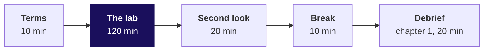
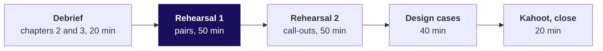

# Day sheet, Week 1 Friday: can the room rebuild the week alone, and hold the note when Marketing pushes?

**TRAINER ONLY.** Nothing on this page reaches a learner. The lab data is `v3-lab`, **proposed for
client zero v2.3** and not yet locked.

Posts to <!-- sync:module:W01/D5 -->Module 1: Foundations of AI and Data<!-- /sync:module:W01/D5 -->, on <!-- sync:day-date:W01/D5 -->Fri 09 Oct 2026<!-- /sync:day-date:W01/D5 -->.

**Who needs the answer.** Kavya Nair, who takes the room's work to Meera Raghavan's growth review on
Monday with Marketing in the room: a learner who cannot run the method alone, or who folds at
Marketing's first push, puts a number in front of Meera that nobody in the room can defend.

**The questions on the way.** Can you take a raw export to a note Finance would sign, alone, in two
hours? Where did the room break, and what should each step have been? Does your note hold when
Marketing pushes? Which approach fits each timed case? What did the week make yours? The table below
gives each part's smaller questions in the order the trainer asks them.

## Which questions does the day ask, in the order the trainer asks them?

The day's question, in Kavya Nair's words: **can you rebuild the week alone on a raw export, and hold
your note when Marketing pushes?** Ask each question below before its answer is shown. The lab's six
smaller questions reach the room only through the lab brief and at the terms; during the lab the room
hears no question beyond "what would you check?".

| Part | Its question | The smaller questions, in order |
|---|---|---|
| The lab (morning) | Can you take a raw export to a note Finance would sign, alone, in two hours? | What does this file hold before you change anything? Which rows count, and why? Is the clean data still the data Finance booked? Which branch of the revenue tree moved, in which segment, and on how many orders? Could chance alone produce the gap you will lead with? What should Meera do on Monday, and how sure is the note? |
| Debrief chapter 1 | Do the two quarters in your note match Finance's books? | What headline does a pass that skips the reconciliation send? Which check should run before the number is sent, and what does each one cost? What does the count check fix, and what does it leave behind? Which two moves walk the hurried sum to Finance's total? Does a sum of the decisions themselves land on the bridge's two moves? |
| Debrief chapter 2 | Every count reconciles and nothing was rejected: is the pass finished? | What does a pass that sets unreadable values to zero report? What do the rupees say when every count lands? Which of four answers fits a value that will not convert? What does reading the value change in the note? Can a segment filter drop a row without a word, as the zero did? Can the file alone, with no control total, find the gap? |
| Debrief chapter 3 | Which finding leads the note, and how sure can Meera be of it? | Where in the tree does the fall sit? How many orders does the biggest move rest on? How should a team choose the lead, and what does each way cost? Is the lead's fall more than chance on its members' own two quarters? Is the fall broad, or carried by a few members? |
| The rehearsal | Does your note hold when Marketing pushes? | Who hears the note, and what does each listen for? How do two minutes carry four parts? What will Marketing push on? How do you hold a caveat without folding or overclaiming? How do the rounds run? What does a partner write? |
| The design cases | Which approach fits each case, sized how, and what would make you switch? | What do you leave out when Meera wants a first read in two hours? Which check runs first when zero rejects meet a Rs 20 lakh gap? Can 5 of 12 visits beat 31 percent of 1,200? |
| The close | What did the week make yours, and what do you rerun tonight? | Did the method stick? What does Saturday ask? Which lines carry over? What do you rerun? |

The day's answer, said at the rehearsal deck's close: a learner has the method when its six steps run
in order under a clock and the note's caveat comes before the push, and tonight each learner reruns
their marked step, the one step they do not own yet.

## What does the day start from, and where does it stop?

| | |
|---|---|
| **Start from** | All of Monday to Thursday; today teaches nothing new. |
| **Go as far as** | Every learner hands in a lab notebook and a note, and defends Thursday's note at least once, and twice when round one runs in full. |
| **Stop before** | Any new technique and any SQL; Week 2 opens that on Monday. Pandas stays closed. |
| **Comes later** | Saturday's paper tests the week on paper; Monday moves the same method into the warehouse. |
| **Cut first** | The rehearsal's second round of call-outs. The observed lab is never cut, and round one is cut only once round two has gone, by giving pair two one defence each. |

**The domain.** Kalpa Retail is the room's first business. Its story (how it makes money, who
decides what, its metrics as formulas) is told in the retail and e-commerce dossier,
`content/W01/D1/study-notes/C2_W01_D01_domain_retail_STUDENT.md`, whose section 4 covers who decides
what (Anand's "Do your numbers match my books?" is its finance row) and section 5 the metrics as
formulas, the revenue tree among them. Today retells none of it. Every chapter names the metric at
stake (booked revenue per quarter and its branches), who at Kalpa asks for it and what a wrong number
costs, and a learner who is unsure of a term is sent to the dossier.

**Kavya's terms, said in the first minute.** "Before anything goes to Meera, rebuild the week from a
raw export with no assistant and no notes. Then say it to me the way you will say it to her, because
I will push the way Marketing will."

---

## How do the morning's 180 minutes run?

| Part | Slides | Beside it | What must land | If short of time |
|---|---|---|---|---|
| Terms, 10 | Lab deck S1 to S8 | Everyone opens the lab notebook and runs its first cell | The day's question and the four rules land, among them that no other notebook in `notebooks/` is open and that the lab is observed and never scored, and the first cell runs on every screen before the clock starts | Read S7 and S8 only |
| The lab, 120 | Lab deck S9 stays up, showing only the six step questions and their minutes | `exercises/unguided/C2_W01_D05_lab_brief_STUDENT.md` and `notebooks/C2_W01_D05_lab_STUDENT.ipynb`, with the TAs on the observation sheet | The room works in silence, and time is called at 60, 90 and 110 minutes with nothing else said | Never cut |
| Second look, 20 | Lab deck S10, S11 | The output folders are copied first, at the 120-minute mark | Each learner compares their totals with the control totals and writes one line | Cut to 10 minutes |
| Break, 10 | | | | |
| Debrief chapter 1, 20 | Debrief deck cover to S17, with D4, D9 and D16 left for self-study | `notebooks/C2_W01_D05_01_debrief_quarters_STUDENT.ipynb` on the projector from S7, its your-turn cells typed live | The skipped reconciliation lands on the slides' invented export and again in this morning's numbers, said aloud from the table below; then option C with its switch, the second route that sums the set-aside list and the log, and two second-look lines read aloud | Cut S14 to one sentence |

## How do the afternoon's 180 minutes run?

| Part | Slides | Beside it | What must land | If short of time |
|---|---|---|---|---|
| Debrief chapters 2 and 3, 20 | Chapter 2, S18 to S30 (10 minutes), and chapter 3, S31 to S48 (10 minutes); D20, D25, D28, D33, D40, D43, D45 and D46 stay self-study unless the tally calls one | `notebooks/C2_W01_D05_02_debrief_values_STUDENT.ipynb`, then `03_debrief_segments`, their your-turn cells typed live, and the TAs' lunch tally | Chapter 2 lands zero rejects with the rupees short and option C for a value that will not convert. Chapter 3 lands the corporate headline said as counts, option C for the lead with D run, and the lead tested with each customer's own two quarters flipped; this morning's lead is typed live in notebook 3 with `LEAD = "Retail-Core"`, giving p = 0.006 both ways, and 0.0195 is named as the answer to a different question | Cut S29 and S44 to one sentence each, and never cut a whole chapter |
| Rehearsal round one, 50 | Rehearsal deck S1 to S6 and S9 (8 minutes), then the modelled push at S7 (4) | `exercises/guided/C2_W01_D05_rehearsal_brief_STUDENT.md`, whose sharpest Marketing push (the monsoon sale's Rs 3,395 against Rs 3,200) is modelled once aloud with a TA as Marketing; the feedback cards; and, for a stuck pair, a model answer to every push in `trainer/C2_W01_D05_rehearsal_key_TRAINER.md` | Pair one runs 2 x 10 minutes and pair two 2 x 9, so every learner defends Thursday's note twice, and the TAs tell each learner their marked step in private | Cut pair two to one defence each |
| Rehearsal round two, 50 | S10 | A shuffled name list, and `trainer/C2_W01_D05_rehearsal_key_TRAINER.md` for the answer to each push, read after Kavya's review | About a dozen notes are read to the room, and each meets one push and a minute of Kavya's review | **Cut first**, in whole or in part |
| Timed design cases, 40 | S11 to S18, each answer slide shown only after the two call-outs | `exercises/unguided/C2_W01_D05_timed_cases_STUDENT.md`, with the model answers, sizing and sources in `trainer/C2_W01_D05_timed_cases_key_TRAINER.md` | Three cases at Kalpa take 13 minutes each: read 1, think 3, pairs 4, two call-outs 3 and the answer slide 2. Each answer names the option, its size and the fact that would switch it | Run case 3 only |
| Kahoot and close, 20 | S19 to S23 | `kahoot/C2_W01_D05_quiz_STUDENT.md` | The eight items land (three on the method, four design calls and Thursday's return), then Saturday's format with none of its items previewed, the five crux lines and tonight's three tasks | Cut S23 to one line |

---

## Which of this morning's numbers does the trainer say aloud at each debrief slide?

The debrief deck and the three chapter notebooks show every trap on an invented export, labelled
invented, so no learner file names what this morning's file holds. Say this morning's numbers aloud at
the slide and type them live in the notebook's empty your-turn cell; they stay off the slides. One
coincidence to expect: the invented export's one-way share in notebook 3 and the notes, 0.0015,
happens to equal this morning's revenue-per-customer route in the lab key, and the two are
unrelated.

| Slide | On the slide, invented | This morning's number, said aloud | Where the room sees it printed |
|---|---|---|---|
| S5 | Q1 Rs 31,50,000 on 83 rows, Q2 Rs 38,16,420 on 92 rows, +21.2% | Q1 Rs 50,63,000 on 98 rows, Q2 Rs 56,60,890 on 109 rows: Q2 up 11.8 percent | Notebook 1, level 1's your-turn cell |
| S7 | Q1 83 of 83 orders and Rs 31,50,000 of Rs 40,00,000; Q2 92 rows of 84 and Rs 38,16,420 of Rs 26,00,000 | Q1 98 of 98 and Rs 50,63,000 of Rs 60,48,000; Q2 109 rows of 99 and Rs 56,60,890 of Rs 43,25,480 | The same cell's table |
| S8 | +21.2%, -17.5%, -35.0%; 56.2 and 17.5 points off | +11.8%, -14.6%, -28.5%; 40.3 and 13.9 points off | Notebook 1, level 2's your-turn cell |
| S11 | 83 and 84 orders kept; Q1 Rs 31,50,000 against Rs 40,00,000; -17.5% | 98 and 99 kept; Q1 Rs 50,63,000 against Rs 60,48,000; -14.6% | Notebook 1, level 3's your-turn cell |
| S13 | Rs 69,66,420 less Rs 12,16,420 plus Rs 8,50,000 lands on Rs 66,00,000; -35.0% | Rs 1,07,23,890 less Rs 13,35,410 plus Rs 9,85,000 lands on Rs 1,03,73,480; -28.5%, a fall of Rs 17,22,520 | Notebook 1, level 4's your-turn cell draws the bridge |
| S14 | Q2 grew 21.2%, fell 17.5%, fell 35.0% | Q2 grew 11.8%, fell 14.6%, fell 28.5% | Said aloud |
| S15 | 8 rows, Rs 12,16,420; 1 log line, Rs 8,50,000 | 10 rows, Rs 13,35,410; 1 log line, Rs 9,85,000 | Notebook 1, level 5's your-turn cell, which also lists the ten rows |
| D16 | Retail-Plus orders per member 2.00 to 2.44 hurried, basket -15.0% | Retail-Core 1.47 to 1.77 hurried, +20.5 percent; basket -17.1%; revenue flat at Rs 90,200 to Rs 90,210 | Notebook 1, the depth your-turn cell |
| S21 | Q1 83 orders, 0 rejects, Rs 31,50,000 | Q1 98 orders, 0 rejects, Rs 50,63,000 | Notebook 2, level 1's your-turn cell |
| S23 | Q1 Rs 8,50,000 short, about a fifth; -17.5% against -35.0% | Q1 Rs 9,85,000 short, 16.3 percent; -14.6% against -28.5% | Notebook 2, level 2's your-turn cell |
| S24 | The invented value "850000.00"; A and B -17.5%, C -35.0% | The value "9,85,000" on KR-07073, digits with an Indian ledger's grouping commas; A and B -14.6%, C -28.5% | Notebook 2, level 3's your-turn cell prints the row |
| D28 | Retail-Core Q1 Rs 73,250 named, +2.2%; restored -1.0% | Retail-Plus Q2 34 orders and Rs 93,670 named, -1.6%; restored 35 orders and Rs 96,600, +1.5% | Notebook 2, level 5's your-turn cell |
| S29 | 167 = 166 + 1; the logged Rs 8,50,000 | 197 = 196 + 1; the logged Rs 9,85,000 | Notebook 2, level 6's your-turn cell |
| S32 and S35 | The fall Rs 14,00,000; Business Rs 13,88,200, 99.2%; Retail-Plus's basket -15.0% | The fall Rs 17,22,520; Business Rs 17,10,000, 99.3%; Retail-Core's basket -17.1%, Rs 2,050 to Rs 1,700 | Notebook 3, level 1's your-turn cell |
| S36 and S38 | Corporate -36.3% on 5 orders then 2; coin flips 45% | Business -29.2% on 6 orders then 4; coin flips 75.4% | Notebook 3, level 2's your-turn cell |
| S37 | Option c says "a handful of orders" | Ten orders; C-7304 did not reorder and C-7300 ordered once where it had ordered twice | The trainer names the accounts, and nobody types them into a cell |
| S39 | A on 7 orders, 45%; B -35.0% on 167; C Retail-Plus -15.0%, Rs 14,400, 64 orders, 0.011; D one of four under 0.05 | A on 10 orders, 75.4%; B -28.5% on 197; C Retail-Core -17.1%, Rs 15,400, 88 orders, 0.006; D Retail-Core 0.006, Retail-Plus 0.792, Student 0.271, Business 0.443 | Notebook 3, level 3's your-turn cell runs D |
| S42 | 22 of 2,000, p = 0.011; 0.0107 exact | Retail-Core 12 of 2,000, p = 0.006; 0.0035 exact over all 2^30 flips | Notebook 3, level 4's your-turn cell with `LEAD = "Retail-Core"` |
| D43 | 0.011 for the fall; 0.0385 for the gap to Retail-Core | 0.006 for the fall; 0.0195 for a gap of -15.6 points to Retail-Plus | The same cell, with `OTHER = "Retail-Plus"` |
| S44 | 13 of 16 fell, sign test 0.021 | 21 of 30 fell, sign test 0.043 | Notebook 3, level 5's your-turn cell |
| D45 | Flipped 0.0025 against pooled 0.222; whole customers 0.0385 against single orders 0.0945 | Flipped 0.0015 against pooled 0.0765; whole customers 0.0195 against single orders 0.0755 | Notebook 3, the depth your-turn cell |
| D46 | Mean Rs 39,521, median Rs 2,350 | Mean Rs 52,657, median Rs 2,120, clean | Said aloud |

## Which trap prints which wrong number, and what catches it?

Every lab number is printed by `trainer/C2_W01_D05_lab_reference_TRAINER.ipynb` and by the chapter
notebooks' your-turn cells once they are typed, and every invented number by the chapter notebooks'
saved outputs.

**The debrief's three chapters, on this morning's file.**

| Chapter | The options, and the best-fit call | The trap: the wrong number | The check that catches it | The second route |
|---|---|---|---|---|
| 1. Do the quarters tie? | Sized on what separates them: A trust the pass (0 minutes, needs nothing, +11.8%), B count check (2 minutes, Finance's order counts, -14.6%), C counts and rupees with a bridge (15 minutes, Finance's rupee totals, -28.5%), D order-level match (about 120 minutes, Finance's ledger, not run: the lab had none). The call is C, or D when there is no control total or the bridge will not close | Q2 up 11.8 percent (Q1 Rs 50,63,000, Q2 Rs 56,60,890) | Each quarter's orders and rupees against the control totals | Sum the decisions themselves: the set-aside rows (Rs 13,35,410) and the log's read-back value (Rs 9,85,000), each against its move in the bridge. It proves that every rupee moved is a logged decision, and it cannot show that each decision was right |
| 2. Is a clean pass done? | A zero in a try (1 minute, no log line, -14.6%), B drop with a reason (2, -14.6%, fails the count check), C read, convert, keep and flag (3, -28.5%), D hold and ask the owner (a wait, provisional). The call is C, D when the text cannot be read without a guess, and B when the row is not an order | Q1 Rs 50,63,000 on 98 orders, 0 rejects, counts reconciled; Q2 down 14.6 percent | Rupees against the control total: Q1 Rs 9,85,000 short | Value accounting: present 197 = convertible 196 + logged 1, and the logged value equals the gap |
| 3. Which number leads? | A biggest rupee move (Business, 10 orders), B the total unsplit, C count before rate (Retail-Core basket, 88 orders, p = 0.006 with each customer's quarters flipped), D test every segment, run: Retail-Core 0.006, Retail-Plus 0.79, Student 0.27, Business 0.44, and a 0.19 chance that one of four looks real by luck. The call is C, and the corporate move leads only when the question is about accounts, said as counts | Business revenue -29.2 percent as the headline trend | Count before rate: 6 orders then 4; coin flips split ten orders at least that unevenly 75.4 percent of the time | Customer by customer: 21 of Retail-Core's 30 customers saw their own basket fall; sign test p = 0.043 either way |

**The same chapters on the invented export, as the slides and notebooks print them.** In chapter 1
the hurried run reads +21.2%, the count check -17.5% and the books -35.0%, and the bridge is
Rs 69,66,420 less Rs 12,16,420 plus Rs 8,50,000. In chapter 2 the pass reports 83 orders and 0
rejects while Q1 is Rs 8,50,000 short, -17.5% against -35.0%, and Retail-Core reads +2.2% on named
rows against -1.0% restored. In chapter 3 Business reads -36.3% on 5 orders then 2, and coin flips
split them at least that unevenly 45% of the time; Retail-Plus's basket reads -15.0% on 64 orders,
with a change as large in 22 of 2,000 flipped worlds, p = 0.011; the sign test gives 13 of 16,
p = 0.021; and pooling gives 0.222 against 0.0025 flipped. Every figure is asserted by
`internal/C2_W01_D05_invented_export_INTERNAL.py`.

**The lab's traps, as the reference run prints them.**

| Trap | The wrong number | The right number | The check that catches it |
|---|---|---|---|
| The reconciliation skipped, the one most rooms fall into | Q2 up 11.8 percent (Q1 Rs 50,63,000, Q2 Rs 56,60,890) | Q2 down 28.5 percent (Rs 60,48,000 to Rs 43,25,480) | Input equals clean plus rejected; rupees against the control totals |
| The pass that looks clean | Q1 Rs 50,63,000, 0 rejects, 98 orders that reconcile | Rs 60,48,000 | Rupees per quarter against the control total |
| The wrong branch | Retail-Core orders per customer +20.5 percent, revenue flat | Frequency flat, revenue per order -17.1 percent | Distinct ids per segment, reconcile before the tree |
| The headline on ten orders | Corporate revenue -29.2 percent as the first line | 6 orders then 4, in the caveat | Count before rate |
| The wrong unit: single orders shuffled | p = 0.0755 | p = 0.0195 across whole customers | Read the code: the label moves with the whole customer |
| The wrong unit: paired data pooled | p = 0.0765 both ways, 0.0325 one way, on per-customer revenue; 0.0035 with the quarter label dealt across single orders, which agrees for the wrong reason | p = 0.0015 and 0.006 with each customer's quarters flipped | Read the code: each customer's own two quarters stay together |
| The typical order | Mean Rs 52,057 on the rows as read (Rs 52,657 clean) | Median Rs 2,110 as read (Rs 2,120 clean) | Sort and read the top ten |
| The empty segment dropped or bucketed silently | Segments one order and Rs 2,930 short, or a blank group nobody names; Retail-Plus Q2 34 orders, Rs 93,670, -1.6 percent, reported as falling | 35 orders, Rs 96,600, +1.5 percent restored; or 34 orders and Rs 93,670 with the unknown named, flagged and reconciled | Segments add back to the total |

The only runtime error the file forces is `ValueError: invalid literal for int() with base 10:
'9,85,000'`. The learner gives it two minutes alone and reads its last line.

**When the chapter notebooks open.** They run on the invented export, whose file is
`data/C2_W01_D05_invented_orders_STUDENT.csv`, and are released with the debrief deck, after the lab
clock stops; during the lab the rules keep every other notebook in `notebooks/` closed. Their saved
outputs and markdown carry no number from the lab file. After each step, the markdown above an empty
your-turn cell gives the lines that run the same step on the lab export, so the lab's counts, values and places appear only
on the screen of a learner who types them after the lab. Chapter 3's your-turn cells ask the learner
to name the lead their own tree found (`LEAD` and `OTHER`), so no cell names it for them.

## What is planted, and what do you do if nobody finds it?

The lab key lists each plant with its order ids. A batch was posted twice, which put ten repeat rows
in Q2 (nine Retail-Core orders from September and one corporate order of Rs 13,20,000 dated
7 August); one corporate Q1 amount is stored as the text "9,85,000"; one Q2 Retail-Plus order has an
empty segment; and Business rests on six orders then four, where C-7304 did not reorder and C-7300
ordered once where it had ordered twice. If nobody finds a plant during the lab, leave it: the lab
measures what each learner does alone, and the debrief is where each plant is found. If a learner
asks whether the file is rigged, answer "what would you check?"

## Which checkpoint question follows each part?

After chapter 1, one learner has thirty seconds to answer "What two things must reconcile, and
against what?" After chapter 2 the question is "Your pass reports zero rejects. What do you check?",
after chapter 3 it is "Your rate rests on how many orders, and which test keeps each customer's two
quarters together?", and after round one it is "When did your caveat come, before the push or after
it?"

## Which numbers must the trainer know by heart?

| Measure | Value |
|---|---|
| Rows, distinct orders, rejected | 207, 197, 10 |
| Q1 and Q2 clean, equal to control | Rs 60,48,000 (98 orders) and Rs 43,25,480 (99 orders) |
| Change, Q1 to Q2 | -28.5 percent; Rs 17,10,000 of the Rs 17,22,520 fall is Business, on 6 orders then 4 |
| Retail-Core | 30 customers both quarters, 1.47 orders each, revenue per order Rs 2,050 to Rs 1,700, -17.1 percent |
| Retail-Plus | 20 customers, 1.70 to 1.75 orders each, Rs 2,800 to Rs 2,760 per order |
| The note's test | Each Retail-Core customer's two quarters flipped: 12 of 2,000, p = 0.006 both ways (0.001 one way; 0.0042 at 20,000 flips; 0.0035 exact); seeds 1 to 20 give 0.0005 to 0.006 |
| The other fair routes | Core against Plus across whole customers 0.0195 (0.012 one way); Core against every other consumer 0.0345; sign test on 21 against 9, 0.043; revenue per customer flipped 0.0015 |
| Typical order | Median Rs 2,110, mean Rs 52,057, rows as read |

---

## How is each interview question answered in one breath?

| Tag | Question | The answer in one breath |
|---|---|---|
| [S] | Walk me through how you clean and check a dataset you have never seen. | Profile every field, clean with a written reason per decision, reconcile counts and rupees to a source total, and only then analyse. |
| [S] | Tell me about an analysis you did: what did you find, and how sure are you? | Give the claim with its number and denominator, the evidence and how it was checked, the caveat that would change it, and the action. |
| [F] | You have two hours and a raw export; what do you do first, and what do you skip? | Profile first, never skip the reconciliation, and skip anything that does not change today's answer. |
| [D] | A stakeholder attacks your caveat in front of the room; how do you hold it without overclaiming? | Restate with the denominator, bound what the data says, and offer the test that would settle it, with its size and time. |
| Design | Which check, which lead, which test: sized how, and what would make you switch? | Name the options, size each on what separates them, choose the cheapest that lands on the reference, pick the test whose unit keeps each customer's two quarters together, and name the fact that moves you to the next. |

The full answers are in the study notes; the three timed cases carry case-style follow-ups with model
answers.

## What is each design case's call, in one breath?

| Case | The real company it is like | The best fit, sized | What would switch it |
|---|---|---|---|
| 1. Meera's first read in two hours | DMart, whose provisional July to September 2025 revenue went out eight days before the results were filed | B, which profiles, cleans, reconciles and decomposes, marks the note provisional and runs no test. Every plan costs 95 to 105 minutes at the lab's pace, so the choice is the step each leaves out, and the reconciliation is never that step | If Meera will act on a segment gap, add the test on that gap and trim the tree; if there is no control total, say so in the first line |
| 2. Zero rejects and a Rs 20 lakh gap | TSB, a loose likeness: its customers were locked out of a new platform (1.9 million by The Register's report of the review), where this case is a total trusted before it was reconciled | Ids against rows, then the value accounting, a cell each; then the rupee bridge by month, about 30 minutes | If the bridge cannot close a month, match that month order by order |
| 3. 42 percent on twelve visits | Bing, whose 12 percent revenue lift was checked before anyone believed it | A half-and-half split until each checkout has about 300 visits, the case's given size, about half a week | If the new checkout could lose money, give it one visit in ten for a fortnight, which gathers more evidence than C in four times the time; if the traffic is a dozen visits a week in all, decide on cost and reversibility |

The full model answers, the arithmetic and the sources are in `trainer/C2_W01_D05_timed_cases_key_TRAINER.md`.

---

## Where do learners stall in the practice lab, and what is the one hint?

The set is `exercises/practice/C2_W01_D05_practice_STUDENT.md` on the practice export, with the
solution in `exercises/solutions/C2_W01_D05_practice_solution_STUDENT.md` and every number in the
reference notebook's last section. Each learner starts at the problem that holds the step the
observation sheet marked.

| Problem | Where learners stall | The one hint to give |
|---|---|---|
| 1, the profile and the decisions | The currency-prefixed amount, "Rs 2,260": they try int() and drop the row | "Can you read that value without guessing?" |
| 2, the reconciliation | They stop at the count check, 39 and 36, and call it done | "Your rows are all there. Are your rupees?" |
| 3, the tree and the test | They read Retail-Plus frequency on the uncleaned rows and report -40 percent, or pool the members' two quarters for the test | "How many distinct orders does Retail-Plus hold in Q1, and whose two quarters does your test keep together?" |
| 4, the note | They lead with Retail-Plus's -25 percent, or with Student's 50 percent on five orders | "What is the smallest number of orders any rate in your claim rests on, and what did your test say?" |

Items 3, 4, 6, 8, 10, 11, 12, 13 and 16 are design items, nine of sixteen, each taking two ideas or
several steps, and six of them ask for a computed sizing; item 15 is the find-the-defect item on a
zeroing try. A learner who stalled at a step answers that problem's design item aloud to the TA
before the rerun, so the choice of approach is said before the code is typed.

The practice lead is Retail-Plus's orders per member, 2.00 to 1.50 on 8 members, 16 orders then
12, under the thirty-order rule. Its fair test flips each member's own two quarters, and with four
members down one order and four unchanged the exact share is 32 of 256, **p = 0.125**, so the
practice note leads with the reconciled total (up 0.8 percent), says no segment moved on enough orders
to lead, and carries the Retail-Plus fall in its caveat as a count to watch.

A learner who asks whether Retail-Plus's change differs from Retail-Core's shuffles the segment label
across customers, which gives p = 0.047 with the order that has no customer_id kept as its own
customer and 0.011 with it left out of the file entirely; item 4's handling (kept as an order,
customer uncounted) moves the gap to about -34 points and leaves the shuffle no customer to move
(reference notebook, practice section). A learner should say which question and which handling they
chose. At a p this close to 0.05 the analyst runs 20,000 shuffles before calling it, since the
p-value's own wobble at 2,000 is about 0.005.

The practice export has 79 rows and 75 distinct orders, with 4 repeated Q1 Retail-Plus rows, one
amount written "Rs 2,260" and one Q2 order with no customer_id. Its control totals are Q1
Rs 23,21,000 and Q2 Rs 23,39,340, and Retail-Plus orders per member go from 2.00 to 1.50 (-25.0
percent, or -40.0 on the uncleaned rows).

---

## Which file serves which moment?

| Moment | File |
|---|---|
| Terms and the clock | `slides/C2_W01_D05_lab_STUDENT.pptx` |
| The lab | `exercises/unguided/C2_W01_D05_lab_brief_STUDENT.md`, `notebooks/C2_W01_D05_lab_STUDENT.ipynb`, `data/C2_W01_D05_lab_*` |
| Observing | `trainer/C2_W01_D05_observation_sheet_TRAINER.md`, one per TA |
| The debrief | `slides/C2_W01_D05_debrief_STUDENT.pptx`, with the three chapter notebooks in `notebooks/` on the projector, `01_debrief_quarters`, `02_debrief_values` and `03_debrief_segments`, released as the lab clock stops, and this page's said-aloud table for this morning's numbers |
| Every lab number | `trainer/C2_W01_D05_lab_key_TRAINER.md` |
| The rehearsal and the cases | `slides/C2_W01_D05_rehearsal_STUDENT.pptx`, `exercises/guided/`, `exercises/unguided/C2_W01_D05_timed_cases_STUDENT.md`, `trainer/C2_W01_D05_rehearsal_key_TRAINER.md`, `trainer/C2_W01_D05_timed_cases_key_TRAINER.md` |
| Close | `kahoot/C2_W01_D05_quiz_STUDENT.md` |
| Tonight | `study-notes/`, `preread/` for Saturday, `exercises/practice/` for the practice lab |

**If a Codespace will not start** for a learner, the lab runs in a local clone of the repository with
Python 3 and the two CSV files, and the TA records the minutes lost; the lab is never moved to a pair.
