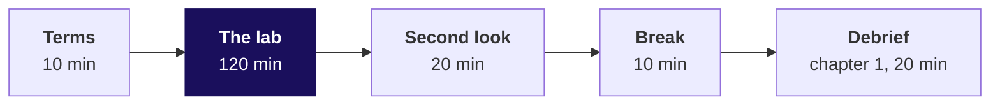
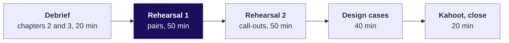

# Day sheet: Week 1, Friday. The week rebuilt alone, and the note defended aloud

**TRAINER ONLY.** Nothing on this page reaches a learner. The lab data is `v3-lab`, **proposed for
client zero v2.3** and not yet locked.

Posts to <!-- sync:module:W01/D5 -->Module 1: Foundations of AI and Data<!-- /sync:module:W01/D5 -->, on <!-- sync:day-date:W01/D5 -->Fri 09 Oct 2026<!-- /sync:day-date:W01/D5 -->.

| | |
|---|---|
| **Start from** | Monday to Thursday, all of it. Today teaches nothing new. |
| **Go as far as** | Every learner hands in a lab notebook and a note, and defends Thursday's note once. |
| **Stop before** | Any new technique and any SQL; Week 2 opens that on Monday. Pandas stays closed. |
| **Comes later** | Saturday's paper tests the week on paper; Monday moves the same method into the warehouse. |
| **Cut first** | The rehearsal's second round of call-outs. The observed lab and round one always run in full. |

**The domain.** Kalpa Retail is the room's first business. Its story (how it makes money, who
decides what, its metrics as formulas) is the retail and e-commerce dossier,
`content/W01/D1/study-notes/C2_W01_D01_domain_retail_STUDENT.md`; its section 4 is who decides
what (Anand's "Do your numbers match my books?" is its finance row) and section 5 is the metrics as
formulas, the revenue tree among them. Its one-page card is to ship in `content/W01/D1/cheatsheets/`.
Today retells none of it: every chapter names the metric at stake
(booked revenue per quarter and its branches), who at Kalpa asks for it and what a wrong number
costs, and a learner who is unsure of a term is sent to the dossier.

**Kavya's terms, said in the first minute.** "Before anything goes to Meera, rebuild the week from a
raw export with no assistant and no notes. Then say it to me the way you will say it to her, because
I will push the way Marketing will."

---

## Morning, 180 minutes

| Part | Slides | Beside it | What must land | If short of time |
|---|---|---|---|---|
| Terms, 10 | Lab deck S1 to S6 | Everyone opens the lab notebook and runs its first cell | The four rules, among them no other notebook in `notebooks/` open; observed, never scored; the first cell runs on every screen before the clock | Read S5 and S6 only |
| The lab, 120 | Lab deck S7, left up: step names and minutes only | `exercises/unguided/C2_W01_D05_lab_brief_STUDENT.md`, `notebooks/C2_W01_D05_lab_STUDENT.ipynb`; the TAs on the observation sheet | Silence. Time called at 60, 90 and 110 minutes, nothing else | Never cut |
| Second look, 20 | Lab deck S8, S9 | Output folders copied at the 120-minute mark first | Each learner compares their totals with the control totals and writes one line | To 10 minutes |
| Break, 10 | | | | |
| Debrief chapter 1, 20 | Debrief deck cover to S11 (D2 and D10 self-study) | `notebooks/C2_W01_D05_01_debrief_quarters_STUDENT.ipynb` on the projector from S5, its your-turn cells typed live | The reconciliation skipped, on the slides' invented export and in this morning's numbers said aloud from the table below; option C with its switch; the second route sums the set-aside list and the log; two second-look lines read aloud | S9 to one sentence |

## Afternoon, 180 minutes

| Part | Slides | Beside it | What must land | If short of time |
|---|---|---|---|---|
| Debrief chapters 2 and 3, 20 | Chapter 2, S12 to S20 (10 minutes); chapter 3, S21 to S28 and S31 (10 minutes); D13, D19, D22, D29, D30 self-study unless the tally calls one | `notebooks/C2_W01_D05_02_debrief_values_STUDENT.ipynb`, then `03_debrief_segments`, their your-turn cells typed live; the TAs' lunch tally | Zero rejects with the rupees short, option C for a value that will not convert; the corporate headline said as counts, option C for the lead with D run; Retail-Core tested with each customer's own two quarters flipped, p = 0.006 both ways, and 0.0195 named as the answer to a different question | S20 and S28 to one sentence each; never a whole chapter |
| Rehearsal round one, 50 | Rehearsal deck S1 to S6 (8 minutes), then the modelled push (4) | `exercises/guided/C2_W01_D05_rehearsal_brief_STUDENT.md`, whose sharpest Marketing push (the monsoon sale's Rs 3,395 against Rs 3,200) is modelled once aloud after S6 with a TA as Marketing; the feedback cards; a model answer for every push in `trainer/C2_W01_D05_rehearsal_key_TRAINER.md`, for a stuck pair | Pair one 2 x 10 minutes, pair two 2 x 9, so every learner defends Thursday's note twice; the TAs tell each learner their marked step, privately | Pair two to one defence each |
| Rehearsal round two, 50 | S7 | A shuffled name list; `trainer/C2_W01_D05_rehearsal_key_TRAINER.md` for the answer to each push, read after Kavya's review | About a dozen notes read to the room, one push each, a minute of Kavya's review | **Cut first**, whole or in part |
| Timed design cases, 40 | S8 to S11 | `exercises/unguided/C2_W01_D05_timed_cases_STUDENT.md`; the model answers, sizing and sources in `trainer/C2_W01_D05_timed_cases_key_TRAINER.md` | Three cases at Kalpa, 13 minutes each: read 1, think 3, pairs 4, two call-outs 3, model 2. Each answer names the option, its size and the fact that would switch it | Case 3 only |
| Kahoot and close, 20 | S12 to S15 | `kahoot/C2_W01_D05_quiz_STUDENT.md` | Eight items: three on the method, four design calls and Thursday's return; Saturday's format, never an item; the five crux lines; tonight's three tasks | S14 to one line |

---

## The debrief's real numbers, said aloud

The debrief deck shows every trap's mechanism on an invented export, labelled invented on the slide,
so no learner file names what this morning's file holds. These are this morning's numbers, to say
aloud at the slide and to type live in the notebook's your-turn cell. Never put them on a slide.

| Slide | On the slide, invented | This morning's number, said aloud | Where the room sees it printed |
|---|---|---|---|
| S3 | Q1 Rs 31,50,000 on 83 rows, Q2 Rs 38,16,420 on 92 rows, +21.2% | Q1 Rs 50,63,000 on 98 rows, Q2 Rs 56,60,890 on 109 rows: Q2 up 11.8 percent | Notebook 1, level 1 prints the headline; its your-turn cell prints the table |
| S5 | Q1 83 of 83 orders and Rs 31,50,000 of Rs 40,00,000; Q2 92 rows of 84 and Rs 38,16,420 of Rs 26,00,000 | Q1 98 of 98 and Rs 50,63,000 of Rs 60,48,000; Q2 109 rows of 99 and Rs 56,60,890 of Rs 43,25,480 | Notebook 1, the first your-turn cell |
| S6 | +21.2%, -17.5%, -35.0%; 56.2 and 17.5 points off | +11.8%, -14.6%, -28.5%; 40.3 and 13.9 points off | Notebook 1, the sizing cell |
| S7 | Rs 69,66,420 less Rs 12,16,420 plus Rs 8,50,000 lands on Rs 66,00,000 | Rs 1,07,23,890 less Rs 13,35,410 plus Rs 9,85,000 lands on Rs 1,03,73,480 | Notebook 1, the bridge your-turn cell |
| S8 | Q2 grew 21.2%, fell 17.5%, fell 35.0% | Q2 grew 11.8%, fell 14.6%, fell 28.5%, a fall of Rs 17,22,520 | Notebook 1, the three-headlines cell |
| S9 | Set-aside list Rs 12,16,420, the log Rs 8,50,000 | Set-aside list Rs 13,35,410 on 10 rows, the log Rs 9,85,000 on 1 line | Notebook 1, the second-route cell checks them; the rows are its last your-turn cell |
| D10 | A segment's frequency 2.00 to 2.44 on the hurried rows | Retail-Core 1.47 to 1.77, +20.5 percent, revenue flat at Rs 90,200 to Rs 90,210 | Notebook 1, the depth your-turn cell |
| S14 | Q1 83 orders, 0 rejects, Rs 31,50,000 | Q1 98 orders, 0 rejects, Rs 50,63,000 | Notebook 2, level 1 |
| S16 | Q1 Rs 8,50,000 short, 21.3 percent; -17.5% against -35.0% | Q1 Rs 9,85,000 short, 16.3 percent; -14.6% against -28.5% | Notebook 2, the gap your-turn cell |
| S17 | The invented value "850000.00", headlines -17.5% and -35.0% | The value "9,85,000" on KR-07073, digits with an Indian ledger's grouping commas; headlines -14.6% and -28.5% | Notebook 2, the options cell; the value is its your-turn cell |
| D19 | Retail-Core Q1 Rs 73,250 named, +2.2%; restored -1.0% | Retail-Plus Q2 34 orders and Rs 93,670 named, -1.6%; restored 35 orders and Rs 96,600, +1.5% | Notebook 2, level 4's your-turn cells |
| S20 | 167 = 166 + 1; the logged Rs 8,50,000 | 197 = 196 + 1; the logged Rs 9,85,000 | Notebook 2, the second-route cell checks it |
| S23 | Corporate -36.3% on 5 orders then 2; Rs 13,88,200, 99.2 percent | Business -29.2% on 6 orders then 4; Rs 17,10,000, 99.3 percent | Notebook 3, level 1 prints the rate; its your-turn cell counts the orders |
| S24 | Its option c says "a handful of orders" | Ten orders; the corporate accounts: C-7304 did not reorder and C-7300 ordered once where it had ordered twice | Notebook 3; the accounts are for the trainer to name, never to type |
| S25 | Seven orders split at least as unevenly as 5 and 2 in 45 percent of worlds | Ten orders at least as unevenly as 6 and 4 in 75.4 percent | Notebook 3, the coin-flip your-turn cell |
| S26 | Real throughout; the corporate row says "under thirty" and "most coin-flip worlds" | The corporate rate -29.2% on 10 orders, 0.754 | Notebook 3, the options cell and its your-turn cell |

## The traps, each with its exact wrong number

Every number is printed by a notebook: the chapter notebooks for the debrief's traps, and
`trainer/C2_W01_D05_lab_reference_TRAINER.ipynb` for the full lab key.

**The debrief's three chapters, on this morning's file.**

| Chapter | The options, and the best-fit call | The trap: the wrong number | The check that catches it | The second route |
|---|---|---|---|---|
| 1. The reconciliation, skipped | Sized on what separates them: A trust the pass (0 minutes, needs nothing, +11.8%), B count check (2 minutes, Finance's order counts, -14.6%), C counts and rupees with a bridge (15 minutes, Finance's rupee totals, -28.5%), D order-level match (about 120 minutes, Finance's ledger, not run: the lab had none). C; D when there is no control total or the bridge will not close | Q2 up 11.8 percent (Q1 Rs 50,63,000, Q2 Rs 56,60,890) | Each quarter's orders and rupees against the control totals | Sum the decisions themselves: the set-aside rows (Rs 13,35,410) and the log's read-back value (Rs 9,85,000), each against its move in the bridge. It proves every rupee moved is a logged decision, never that each decision was right |
| 2. The pass that looks clean | A zero in a try (1 minute, no log line, -14.6%), B drop with a reason (2, -14.6%, fails the count check), C read, convert, keep and flag (3, -28.5%), D hold and ask the owner (a wait, provisional). C; D when the text cannot be read without a guess, B when the row is not an order | Q1 Rs 50,63,000 on 98 orders, 0 rejects, counts reconciled; Q2 down 14.6 percent | Rupees against the control total: Q1 Rs 9,85,000 short | Value accounting: present 197 = convertible 196 + logged 1, and the logged value equals the gap |
| 3. The headline on too few orders | A biggest rupee move (Business, 10 orders), B the total unsplit, C count before rate (Retail-Core basket, 88 orders, p = 0.006 with each customer's quarters flipped), D test every segment, run: Retail-Core 0.006, Retail-Plus 0.79, Student 0.27, Business 0.44, and a 0.19 chance that one of four looks real by luck. C; the corporate move leads only when the question is about accounts, said as counts | Business revenue -29.2 percent as the headline trend | Count before rate: 6 orders then 4; coin flips split ten orders at least that unevenly 75.4 percent of the time | Customer by customer: 21 of Retail-Core's 30 customers saw their own basket fall; sign test p = 0.043 either way |

**The lab's traps, as the reference run prints them.**

| Trap | The wrong number | The right number | The check that catches it |
|---|---|---|---|
| The reconciliation skipped, the one most rooms fall into | Q2 up 11.8 percent (Q1 Rs 50,63,000, Q2 Rs 56,60,890) | Q2 down 28.5 percent (Rs 60,48,000 to Rs 43,25,480) | Input equals clean plus rejected; rupees against the control totals |
| The pass that looks clean | Q1 Rs 50,63,000, 0 rejects, 98 orders that reconcile | Rs 60,48,000 | Rupees per quarter against the control total |
| The wrong branch | Retail-Core orders per customer +20.5 percent, revenue flat | Frequency flat, revenue per order -17.1 percent | Distinct ids per segment, reconcile before the tree |
| The headline on ten orders | Corporate revenue -29.2 percent as the first line | 6 orders then 4, in the caveat | Count before rate |
| The wrong unit: single orders shuffled | p = 0.0755 | p = 0.0195 across whole customers | Read the code: the label moves with the whole customer |
| The wrong unit: paired data pooled | p = 0.0765 both ways, 0.0325 one way | p = 0.0015 with each customer's quarters flipped | Read the code: each customer's own two quarters stay together |
| The typical order | Mean Rs 52,057 on the rows as read (Rs 52,657 clean) | Median Rs 2,110 as read (Rs 2,120 clean) | Sort and read the top ten |
| The empty segment dropped or bucketed silently | Segments one order and Rs 2,930 short, or a blank group nobody names; Retail-Plus Q2 34 orders, Rs 93,670, -1.6 percent, reported as falling | 35 orders, Rs 96,600, +1.5 percent restored; or 34 orders and Rs 93,670 with the unknown named, flagged and reconciled | Segments add back to the total |

The only runtime error the file forces is `ValueError: invalid literal for int() with base 10:
'9,85,000'`. It gets two minutes and its last line, from the learner alone.

**When the chapter notebooks open.** They run on the lab export and are released with the debrief
deck, after the lab clock stops, never before; during the lab the rules keep every other notebook in
`notebooks/` closed. Their saved outputs print the control totals, the headlines and the consumer
tree, and every planted count, value, form or place sits behind an empty your-turn cell.

## What is planted, and what to do if nobody finds it

The list with order ids is in the lab key. In short: ten rows of a batch posted twice, all in Q2
(nine Retail-Core orders from September, one corporate order of Rs 13,20,000 dated 7 August); one
corporate Q1 amount stored as the text "9,85,000"; one Q2 Retail-Plus order with an empty segment;
Business on six orders then four, where C-7304 did not reorder and C-7300 ordered once where it had
ordered twice. During the lab, nothing is done if nobody finds a plant: the lab measures what each
learner does alone, and the debrief is where each is found. If a learner asks whether the file is
rigged, answer "what would you check?"

## Checkpoints

After chapter 1, one learner, thirty seconds: "What two things must reconcile, and against what?"
After chapter 2: "Your pass reports zero rejects. What do you check?" After chapter 3: "Your rate rests
on how many orders, and which test keeps each customer's two quarters together?" After round one:
"When did your caveat come, before the push or after it?"

## The day's numbers

| Measure | Value |
|---|---|
| Rows, distinct orders, rejected | 207, 197, 10 |
| Q1 and Q2 clean, equal to control | Rs 60,48,000 (98 orders) and Rs 43,25,480 (99 orders) |
| Change, Q1 to Q2 | -28.5 percent; Rs 17,10,000 of the Rs 17,22,520 fall is Business, on 6 orders then 4 |
| Retail-Core | 30 customers both quarters, 1.47 orders each, revenue per order Rs 2,050 to Rs 1,700, -17.1 percent |
| Retail-Plus | 20 customers, 1.70 to 1.75 orders each, Rs 2,800 to Rs 2,760 per order |
| The note's test | Each Retail-Core customer's two quarters flipped: 12 of 2,000, p = 0.006 both ways (0.001 one way; 0.004 at 20,000 flips; 0.0035 exact); seeds 1 to 20 give 0.0005 to 0.006 |
| The other fair routes | Core against Plus across whole customers 0.0195 (0.012 one way); Core against every other consumer 0.0345; sign test on 21 against 9, 0.043; revenue per customer flipped 0.0015 |
| Typical order | Median Rs 2,110, mean Rs 52,057, rows as read |

---

## The interview questions of the day, answered in one breath

| Tag | Question | The answer in one breath |
|---|---|---|
| [S] | Walk me through how you clean and check a dataset you have never seen. | Profile every field, clean with a written reason per decision, reconcile counts and rupees to a source total, and only then analyse. |
| [S] | Tell me about an analysis you did: what did you find, and how sure are you? | Claim with its number and denominator, the evidence and how it was checked, the caveat that would change it, and the action. |
| [F] | You have two hours and a raw export; what do you do first, and what do you skip? | Profile first, never skip the reconciliation, and skip anything that does not change today's answer. |
| [D] | A stakeholder attacks your caveat in front of the room; how do you hold it without overclaiming? | Restate with the denominator, bound what the data says, and offer the test that would settle it, with its size and time. |
| Design | Which check, which lead, which test: sized how, and what would make you switch? | Name the options, size each on what separates them, choose the cheapest that lands on the reference, pick the test whose unit keeps each customer's two quarters together, and name the fact that moves you to the next. |

The full answers are in the study notes; the three timed cases carry case-style follow-ups with model
answers.

## The three design cases, in one breath each

| Case | The real company it is like | The best fit, sized | What would switch it |
|---|---|---|---|
| 1. Meera's first read in two hours | DMart, whose provisional quarter goes out days before the results are filed | B: profile, clean, reconcile, decompose, marked provisional, no test. Every plan costs 95 to 105 minutes at the lab's pace, so the choice is the step each leaves out, and the reconciliation is never the one | A segment gap Meera will act on: add the test on that gap and trim the tree; no control total: say so in the first line |
| 2. Zero rejects and a Rs 20 lakh gap | TSB, a loose likeness: its customers were locked out of a new platform (1.9 million by The Register's report of the review), where this case is a total trusted before it was reconciled | Ids against rows, then the value accounting, a cell each; then the rupee bridge by month, about 30 minutes | A month the bridge cannot close: match that month order by order |
| 3. 42 percent on twelve visits | Bing, whose 12 percent revenue lift was checked before anyone believed it | A half-and-half split until each checkout has about 300 visits, the case's given size, about half a week | A checkout that could lose money: one visit in ten for a fortnight, more evidence than C in four times the time; a dozen visits a week in all: decide on cost and reversibility |

The full model answers, the arithmetic and the sources are in `trainer/C2_W01_D05_timed_cases_key_TRAINER.md`.

---

## The practice lab: the TA note

The set is `exercises/practice/C2_W01_D05_practice_STUDENT.md` on the practice export, with the
solution in `exercises/solutions/C2_W01_D05_practice_solution_STUDENT.md` and every number in the
reference notebook's last section. Each learner starts at the problem that holds the step the
observation sheet marked.

| Problem | Where learners stall | The one hint to give |
|---|---|---|
| 1, the profile and decisions | The currency-prefixed amount, "Rs 2,260": they try int() and drop the row | "Can you read that value without guessing?" |
| 2, the reconciliation | They stop at the count check, 39 and 36, and call it done | "Your rows are all there. Are your rupees?" |
| 3, the tree and the test | They read Retail-Plus frequency on the uncleaned rows and report -40 percent, or pool the members' two quarters for the test | "How many distinct orders does Retail-Plus hold in Q1, and whose two quarters does your test keep together?" |
| 4, the note | They lead with Retail-Plus's -25 percent, or with Student's 50 percent on five orders | "What is the smallest number of orders any rate in your claim rests on, and what did your test say?" |

Items 3, 4, 6, 8, 10, 11, 12, 13 and 16 are design items, nine of sixteen, each taking two ideas or
several steps; six of them ask for a computed sizing. Item 15 is the find-the-defect item on a zeroing
try. The practice lead is Retail-Plus's orders per member, 2.00 to 1.50 on 8 members, 16 orders then
12, under the thirty-order rule. Its fair test flips each member's own two quarters, and with four
members down one order and four unchanged the exact share is 32 of 256, **p = 0.125**, so the
practice note leads with the reconciled total (up 0.8 percent), says no segment moved on enough orders
to lead, and carries the Retail-Plus fall in its caveat as a count to watch. A learner who asks
whether Retail-Plus's change differs from Retail-Core's shuffles the segment label across customers:
p = 0.047 with the order that has no customer_id kept as its own customer and 0.011 with it left out
of the file entirely; item 4's handling (kept as an order, customer uncounted) moves the gap to about
-34 points and leaves the shuffle no customer to move (reference notebook, practice section). A
learner should say which question and which handling they chose. At a p this close to 0.05 the
analyst runs 20,000 shuffles before calling it, since the p-value's own wobble at 2,000 is about
0.005. A learner who stalled at a step answers that problem's design item aloud to the TA before the
rerun, so the choice of approach is said before the code is typed.

The practice numbers: 79 rows, 75 distinct orders, 4 repeated Q1 Retail-Plus rows, one amount "Rs
2,260", one Q2 order with no customer_id, Q1 Rs 23,21,000 and Q2 Rs 23,39,340 on the control totals,
Retail-Plus orders per member 2.00 to 1.50 (-25.0 percent; -40.0 on the uncleaned rows).

---

## Which file for which moment

| Moment | File |
|---|---|
| Terms and the clock | `slides/C2_W01_D05_lab_STUDENT.pptx` |
| The lab | `exercises/unguided/C2_W01_D05_lab_brief_STUDENT.md`, `notebooks/C2_W01_D05_lab_STUDENT.ipynb`, `data/C2_W01_D05_lab_*` |
| Observing | `trainer/C2_W01_D05_observation_sheet_TRAINER.md`, one per TA |
| The debrief | `slides/C2_W01_D05_debrief_STUDENT.pptx`, with the three chapter notebooks in `notebooks/` on the projector, `01_debrief_quarters`, `02_debrief_values` and `03_debrief_segments`, released as the lab clock stops, and this page's debrief table for the numbers said aloud |
| Every number | `trainer/C2_W01_D05_lab_key_TRAINER.md` |
| The rehearsal and the cases | `slides/C2_W01_D05_rehearsal_STUDENT.pptx`, `exercises/guided/`, `exercises/unguided/C2_W01_D05_timed_cases_STUDENT.md`, `trainer/C2_W01_D05_rehearsal_key_TRAINER.md`, `trainer/C2_W01_D05_timed_cases_key_TRAINER.md` |
| Close | `kahoot/C2_W01_D05_quiz_STUDENT.md` |
| Tonight | `study-notes/`, `preread/` for Saturday, `exercises/practice/` for the practice lab |

**If a Codespace will not start** for a learner, the lab runs in a local clone of the repository with Python 3 and the two
CSV files, and the TA records the minutes lost; the lab is never moved to a pair.
