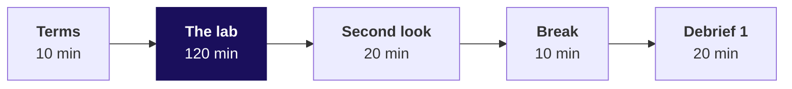
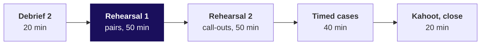

# Day sheet: Week 1, Friday. The week rebuilt alone, and the note defended aloud

**TRAINER ONLY.** Nothing on this page reaches a learner. The lab data is `v3-lab`, **proposed for
client zero v2.3** and not yet locked.

Posts to <!-- sync:module:W01/D5 -->Module 1: Foundations of AI and Data<!-- /sync:module:W01/D5 -->, on <!-- sync:day-date:W01/D5 -->Fri 09 Oct 2026<!-- /sync:day-date:W01/D5 -->.

| | |
|---|---|
| **Start from** | Monday to Thursday, all of it. Today teaches nothing new. |
| **Go as far as** | Every learner hands in a lab notebook and a note, and defends Thursday's note once. |
| **Stop before** | Any new technique and any SQL; Week 2 opens that on Monday. Pandas stays closed. |
| **Comes later** | Saturday's paper tests the week on paper; Monday moves the same method into the warehouse. |
| **Cut first** | The rehearsal's second round of call-outs. Never the observed lab, never round one. |

**Kavya's terms, said in the first minute.** "Before anything goes to Meera, rebuild the week from a
raw export with no assistant and no notes. Then say it to me the way you will say it to her, because
I will push the way Marketing will."

---

## Morning, 180 minutes

| Part | Slides | Beside it | What must land | If short of time |
|---|---|---|---|---|
| Terms, 10 | Lab deck S1 to S6 | Everyone opens the lab notebook and runs its first cell | The four rules; observed, never scored; the first cell runs on every screen before the clock | Read S5 and S6 only |
| The lab, 120 | Lab deck S7, left up | `exercises/unguided/C2_W01_D05_lab_brief_STUDENT.md`, `notebooks/C2_W01_D05_lab_STUDENT.ipynb`; the TAs on the observation sheet | Silence. Time called at 60, 90 and 110 minutes, nothing else | Never cut |
| Second look, 20 | Lab deck S8, S9 | Output folders copied at the 120-minute mark first | Each learner compares their totals with the control totals and writes one line | To 10 minutes |
| Break, 10 | | | | |
| Debrief 1, 20 | Debrief deck S1 to S6 | Reference notebook, section 3, on the projector | The reconciliation skipped: the invented case, then the four headlines on the real file, then two second-look lines read aloud | S5 to one sentence |

## Afternoon, 180 minutes

| Part | Slides | Beside it | What must land | If short of time |
|---|---|---|---|---|
| Debrief 2, 20 | Two of: debrief chapter 2 (S7 to S10), chapter 3 (S11 to S13), D14, D15; then S16 | The TAs' lunch tally; reference notebook sections 2, 4 or 5 | The two breaks the tally names, ten minutes each | One break only, then S16 |
| Rehearsal round one, 50 | Rehearsal deck S1 to S6 | `exercises/guided/C2_W01_D05_rehearsal_brief_STUDENT.md`, the feedback cards | Every learner defends Thursday's note twice; the TAs tell each learner their marked step, privately | Pair two to one defence each |
| Rehearsal round two, 50 | S7 | A shuffled name list | About a dozen notes read to the room, one push each, a minute of Kavya's review | **Cut first**, whole or in part |
| Timed cases, 40 | S8 to S11 | `exercises/unguided/C2_W01_D05_timed_cases_STUDENT.md`; the model answers in `trainer/C2_W01_D05_timed_cases_key_TRAINER.md` | Three cases, 13 minutes each: read 1, think 3, pairs 4, two call-outs 3, model 2 | Case 3 only |
| Kahoot and close, 20 | S12 to S15 | `kahoot/C2_W01_D05_quiz_STUDENT.md` | Six items; Saturday's format, never an item; the five crux lines; tonight's three tasks | S14 to one line |

The row's agenda held 240 minutes; the spine's 360-minute day keeps its order and adds the timed
cases. The break falls between the lab and the debrief, so the debrief splits across lunch: the
reconciliation first, which the row predicts, then the two breaks the observation tally names.

---

## The traps, each with its exact wrong number

Every number is printed by `trainer/C2_W01_D05_lab_reference_TRAINER.ipynb`; the full table with the
checks is in `trainer/C2_W01_D05_lab_key_TRAINER.md`.

| Trap | The wrong number | The right number | The check that catches it |
|---|---|---|---|
| The reconciliation skipped, the one most rooms fall into | Q2 up 11.8 percent (Q1 Rs 50,63,000, Q2 Rs 56,60,890) | Q2 down 28.5 percent (Rs 60,48,000 to Rs 43,25,480) | Input equals clean plus rejected; rupees against the control totals |
| The pass that looks clean | Q1 Rs 50,63,000, 0 rejects, 98 orders that reconcile | Rs 60,48,000 | Rupees per quarter against the control total |
| The wrong branch | Retail-Core orders per customer +20.5 percent, revenue flat | Frequency flat, revenue per order -17.1 percent | Distinct ids per segment, reconcile before the tree |
| The headline on ten orders | Corporate revenue -29.2 percent as the first line | 6 orders then 4, in the caveat | Count before rate |
| The wrong unit | Orders shuffled, p = 0.0755 | Customers shuffled, p = 0.0195 | The label's unit is the customer |
| The typical order | Mean Rs 52,057 | Median Rs 2,110 | Sort and read the top ten |
| The empty segment | Retail-Plus Q2 34 orders, Rs 93,670, plus a blank group | 35 orders, Rs 96,600 | Segments add back to the total |

The only runtime error the file forces is `ValueError: invalid literal for int() with base 10:
'9,85,000'`. It gets two minutes and its last line, from the learner alone.

## What is planted, and what to do if nobody finds it

The list with order ids is in the lab key. In short: ten rows of a September batch posted twice, all
in Q2 (nine Retail-Core, one corporate order of Rs 13,20,000); one corporate Q1 amount stored as the
text "9,85,000"; one Q2 Retail-Plus order with an empty segment; Business on six orders then four.
During the lab, nothing is done if nobody finds a plant: the lab measures what each learner does
alone, and the debrief is where each is found. If a learner asks whether the file is rigged, answer
"what would you check?"

## Checkpoints

After debrief 1, one learner, thirty seconds: "What two things must reconcile, and against what?"
After debrief 2: "Your rate rests on how many orders?" After round one: "When did your caveat come,
before the push or after it?"

## The day's numbers

| Measure | Value |
|---|---|
| Rows, distinct orders, rejected | 207, 197, 10 |
| Q1 and Q2 clean, equal to control | Rs 60,48,000 (98 orders) and Rs 43,25,480 (99 orders) |
| Change, Q1 to Q2 | -28.5 percent; Rs 17,10,000 of the Rs 17,22,520 fall is Business, on 6 orders then 4 |
| Retail-Core | 30 customers both quarters, 1.47 orders each, revenue per order Rs 2,050 to Rs 1,700, -17.1 percent |
| Retail-Plus | 20 customers, 1.70 to 1.75 orders each, Rs 2,800 to Rs 2,760 per order |
| Shuffle | Gap -15.6 points; only 39 of 2,000 customer-level shuffles as large; p = 0.0195; other seeds 0.0145 to 0.0270 |
| Typical order | Median Rs 2,110, mean Rs 52,057, rows as read |

---

## The interview questions of the day, answered in one breath

| Tag | Question | The answer in one breath |
|---|---|---|
| [S] | Walk me through how you clean and check a dataset you have never seen. | Profile every field, clean with a written reason per decision, reconcile counts and rupees to a source total, and only then analyse. |
| [S] | Tell me about an analysis you did: what did you find, and how sure are you? | Claim with its number and denominator, the evidence and how it was checked, the caveat that would change it, and the action. |
| [F] | You have two hours and a raw export; what do you do first, and what do you skip? | Profile first, never skip the reconciliation, and skip anything that does not change today's answer. |
| [D] | A stakeholder attacks your caveat in front of the room; how do you hold it without overclaiming? | Restate with the denominator, bound what the data says, and offer the test that would settle it. |

The full answers are in the study notes; the three timed cases carry case-style follow-ups with model
answers.

---

## The practice lab: the TA note

The set is `exercises/practice/C2_W01_D05_practice_STUDENT.md` on the practice export, with the
solution in `exercises/solutions/C2_W01_D05_practice_solution_STUDENT.md` and every number in the
reference notebook's last section. Each learner starts at the problem that holds the step the
observation sheet marked.

| Problem | Where learners stall | The one hint to give |
|---|---|---|
| 1, the profile and decisions | The currency-prefixed amount, "Rs 2,260": they try int() and drop the row | "Can you read that value without guessing?" |
| 2, the reconciliation | They stop at the count check, 39 and 36, and call it done | "Your rows are all there. Are your rupees?" |
| 3, the tree and the test | They read Retail-Plus frequency on the uncleaned rows and report -40 percent | "How many distinct orders does Retail-Plus hold in Q1?" |
| 4, the note | They lead with the flat total, or with Student's 50 percent on five orders | "What is the smallest number of orders any rate in your claim rests on?" |

The practice numbers: 79 rows, 75 distinct orders, 4 repeated Q1 Retail-Plus rows, one amount "Rs
2,260", one Q2 order with no customer_id, Q1 Rs 23,21,000 and Q2 Rs 23,39,340 on the control totals,
Retail-Plus orders per member 2.00 to 1.50 (-25.0 percent; -40.0 on the uncleaned rows).

---

## Which file for which moment

| Moment | File |
|---|---|
| Terms and the clock | `slides/C2_W01_D05_lab_STUDENT.pptx` |
| The lab | `exercises/unguided/C2_W01_D05_lab_brief_STUDENT.md`, `notebooks/C2_W01_D05_lab_STUDENT.ipynb`, `data/C2_W01_D05_lab_*` |
| Observing | `trainer/C2_W01_D05_observation_sheet_TRAINER.md`, one per TA |
| The debrief | `slides/C2_W01_D05_debrief_STUDENT.pptx`, with `trainer/C2_W01_D05_lab_reference_TRAINER.ipynb` on the projector |
| Every number | `trainer/C2_W01_D05_lab_key_TRAINER.md` |
| The rehearsal and the cases | `slides/C2_W01_D05_rehearsal_STUDENT.pptx`, `exercises/guided/`, `exercises/unguided/C2_W01_D05_timed_cases_STUDENT.md`, `trainer/C2_W01_D05_timed_cases_key_TRAINER.md` |
| Close | `kahoot/C2_W01_D05_quiz_STUDENT.md` |
| Tonight | `study-notes/`, `preread/` for Saturday, `exercises/practice/` for the practice lab |

**If a Codespace will not start** for a learner, the lab runs in a local clone of the repository with Python 3 and the two
CSV files, and the TA records the minutes lost; the lab is never moved to a pair.
