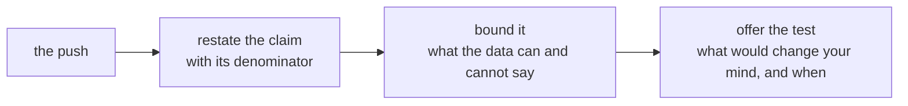

# What does a strong defender say to each Marketing push?

**TRAINER ONLY.** The eleven pushes on the pair lists are the ones in
`exercises/guided/C2_W01_D05_rehearsal_brief_STUDENT.md`, in its order, and the sharpest push is
modelled once before round one. Each answer is what a strong
defender says in one breath, with its number and the denominator the number stands on, followed by
what to say if Marketing pushes a second time. Every number comes from Thursday's note and its
sources: `content/W01/D4/trainer/C2_W01_D04_day_sheet_TRAINER.md` (the day's numbers and the traps)
and, for the rows set aside, `content/W01/D3/trainer/C2_W01_D03_day_sheet_TRAINER.md`.

**Who needs the answer.** The trainer and the TAs, when a pair is stuck in round one and after
Kavya's minute of review in round two: an answer read before the defender has tried teaches the room
to wait for it.

Use these in round two after Kavya's minute of review, and in round one only when a pair is stuck.
Read the answer after the defender has tried, never before. A defender who reaches the same shape in
their own words has it right; the numbers are the part to check.

## Which numbers does every answer draw on?

| Measure | Value |
|---|---|
| Retail-Plus | 22 members; delivered revenue per member Rs 3,279 in Q1 and Rs 2,169 in Q2, a fall of Rs 1,110 each; 135 of 5,000 shuffles as large, 0.027 |
| Retail-Plus in rupees | Rs 72,130 to Rs 47,710, a fall of Rs 24,420, which is 33.9 percent of the segment and 0.19 percent of Q2 delivered revenue |
| Retail-Plus orders | 65 in Q2 for every 100 in Q1 |
| Retail-Core, the wobble for comparison | Rs 1,509 to Rs 1,399 per member, a gap of Rs 110; 1,724 of 5,000 shuffles as large, 0.345 |
| Student | 12 orders from 2 customers, 5 in Q1 and 7 in Q2; coin flips make a 40 percent rise in 0.397 of worlds on that count |
| The monsoon sale | Blend Rs 3,395 exposed against Rs 3,200 unexposed, up 6.1 percent; inside Retail-Plus Rs 4,850 (30 exposed) against Rs 5,000 (40 unexposed), inside Retail-Core Rs 1,940 (30) against Rs 2,000 (60), both 3.0 percent less; 15 percent off needs 17.6 percent more volume to stand still |
| The retention offer | A Rs 11,000 offer pays only above a 45 percent recovery, so it is tested on half the tier |
| The rows set aside on Wednesday | 14 Q1 rows that were second copies of orders already in the file, by the order_id rule, carrying Rs 19,98,210; with them set aside and the amount written as `twelve` repaired from its migration copy, the totals tie to Finance's books |

## How is the sharpest push modelled before round one?

The brief carries Marketing's sharpest push, the monsoon sale's Rs 3,395 against Rs 3,200, with the
segment table and the answer the evidence supports, worked in full. Model it once, aloud, in the four
minutes after S6, with a TA reading Marketing's lines. It is on neither pair list, so every pair
practises on pushes they have not seen answered.

| If Marketing pushes again | The reply |
|---|---|
| "So the sale lost money?" | "At 15 percent off it needed 17.6 percent more volume to stand still, and inside each segment spend went down, so as designed it did not pay. Diwali with a random held-back slice in each segment tells us whether a different design does." |
| "Half of them were members anyway. So what?" | "So the blend compares members with non-members. Inside Retail-Plus the 30 who got the sale spent Rs 4,850 against Rs 5,000 for the 40 who did not, and inside Retail-Core Rs 1,940 against Rs 2,000: 3.0 percent less in both." |

## How does a defender answer pair one's pushes?

| The push | The answer in one breath | If Marketing pushes again |
|---|---|---|
| "We asked for Rs 12 crore to bring in new customers. Where does your note say we do not need them?" | "It says nothing about acquisition. The Retail-Plus fall is the same 22 members spending Rs 1,110 less each, so new customers would not repair it; that fall is Rs 24,420 a quarter and the acquisition case has to be made on its own numbers." | "So you are against the request?" "I have not measured it. Give me customer counts per segment for the last four quarters and I will size the customers branch the way I sized this one." |
| "Student is up 40 percent. Why are you telling Meera not to move budget there?" | "The 40 percent is 5 orders becoming 7, from 2 customers, and coin flips produce a rise that large on 12 orders in about 4 worlds of 10, so the number cannot yet carry budget." | "Growth has to start somewhere." "Agreed, and the note says watch it: once Student carries thirty orders a quarter and the rise holds, it comes back to Meera with a size in rupees." |
| "You removed rows from Finance's data. Whose rows, and who said you could?" | "Fourteen Q1 rows were second copies of orders already in the file, same order_id, Rs 19,98,210 between them; every one is in the log with its order id and reason, and with them set aside and one amount written as a word repaired, my totals tie to Anand's books to the rupee." | "Finance never signed that off." "The books are the sign-off: with the copies in, the file is Rs 20 lakh above Finance, and with them out it matches. The log goes to Anand with the note, so he can check each of the 14." |
| "Your caveat says 'not yet'. Meera needs a decision on Monday. Which is it?" | "Three decisions for Monday: do not repeat the sale as designed, test a retention offer on half of Retail-Plus's 22 members, and hold Student's budget; 'not yet' covers only Student, which stands on 12 orders." | "Half the tier is a half-decision." "A Rs 11,000 offer pays only above a 45 percent recovery; testing it on 11 members tells us whether it clears that before we spend it on all 22." |
| "What would change your mind?" | "For Retail-Plus, the retention test showing no recovery in the half that got the offer; for Student, thirty orders a quarter with the rise intact; for the sale, a Diwali held-back slice in each segment in which the exposed spend more." | "And if you are wrong about Retail-Plus?" "Then it is a Rs 24,420 a quarter mistake, 0.19 percent of revenue, and the half-tier test caps what we spend finding out." |

## How does a defender answer pair two's harder pushes?

| The push | The answer in one breath | If Marketing pushes again |
|---|---|---|
| "Your p-value is 0.03. So you are 97 percent sure. Why the hedging?" | "It is 0.027, and it says that if nothing had changed, a fall of Rs 1,110 per member would turn up in about 3 of every 100 shuffles, 135 of 5,000; that is the chance of the gap in a world with no change, which is a different thing from the chance I am wrong." | "Same thing in practice." "The size is what sets the action: the fall beats the wobble and it is still Rs 24,420 a quarter, 0.19 percent of revenue, so the action is a test on half the tier and nothing bigger." |
| "Every quarter wobbles. Why is this one any different?" | "We measured the wobble: Retail-Core's own gap of Rs 110 per member came up in 1,724 of 5,000 shuffles, ordinary, while Retail-Plus's Rs 1,110 came up in 135 of 5,000, so this one sits outside what chance does on 22 members." | "One quarter is still one quarter." "Yes, which is why the note sizes it small and asks for a test; if Q3 moves back without the offer, the half that did not get it will show that." |
| "If the sale had gone to everybody, would you still say it did not work?" | "If it had gone to everybody there would be no one to compare against and I could say nothing; as it ran, it went to 60 customers, half of them Retail-Plus against 40 percent of the 100 it missed, and inside each segment they spent 3.0 percent less than the customers it missed." | "So you want us to withhold discounts from customers?" "From a random slice of each segment for Diwali, agreed in advance, so the next time you say the sale worked, the number holds up in front of Anand." |
| "You are two weeks into this job. Why should Meera trust your number over our dashboard?" | "Meera should trust whichever number ties to Finance's books; mine does, to the rupee, and the dashboard's Q1 ran Rs 20 lakh high because 14 orders were counted twice." | "The dashboard has run for years." "Then the fix is one rule on order_id, and I will hand the 14 order ids to whoever owns it; after that the dashboard and the note should agree." |
| "Give me one number I can take to the board. Just one." | "Rs 24,420 a quarter: what Retail-Plus's 22 members stopped spending, 0.19 percent of delivered revenue, real by the shuffle and small by the rupee." | "The board wants a percent." "Then 0.19 percent of revenue. The segment's own 33.9 percent is true of a Rs 72,130 segment and will read as a crisis the company does not have." |
| "If the broken reorder feature explains the tier, why do we need your note at all?" | "The note measures that Retail-Plus spends less and that it beats the wobble, and Retail-Plus placed 65 orders in Q2 for every 100 in Q1, which fits a reorder problem; whether the feature caused it needs reorder-button events per member per week for the six weeks, which the note does not have." | "So just fix the button." "Fix it, it is cheap; the retention test on half the tier still runs, because without the events data we do not know the button is the whole story." |
