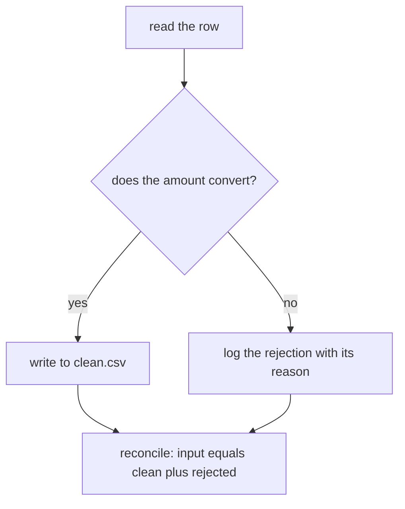

# Week 1 recap paper: answer key and peer marking guide

Trainer file. It reaches learners only through the discussion walk, never as a handout, because a circulated key turns Monday's rewrite task into a copying task.

## What the points here are and are not

The paper is ungraded. The Structure tab locks the Saturday recap as a performance indicator that carries no weight in the assessment pool, and nothing on this sheet changes that. The points below exist for one purpose: a peer marking a stranger's handwriting under time pressure needs a scheme with no judgement calls in it. Read the split out loud, let the room apply it, and record only the room-level miss rate per question. No learner's total is reported anywhere as a score.

Five points per question, forty across the paper, and every question splits 2 + 2 + 1. Uniform weights on purpose, since a peer marking a stranger's paper against a walk that keeps moving cannot also be asked to decide that Q8 is worth more than Q1. The harder questions earn their weight in the discussion time, not in the arithmetic.

## Rules the markers follow

| Rule | Reason |
|---|---|
| Whole points only. No halves. | Half points are where peer marking stops being reproducible. |
| Award on content named, not on wording. | The paper tests whether the mechanism is known, and an interviewer would accept either phrasing. |
| A part with the right value and no reason gets the value point only, never the reason point. | The reason is the interview answer. |
| A part that is right for the wrong reason gets nothing on the reason point. | Stated so markers stop arguing about it. |
| Marker writes their own identifier on the sheet and marks in a different colour. | Disputes need an owner, and the writer needs to see what was added. |
| Disputes go to the Academic TA at the end of the block, never during the walk. | One dispute mid-walk costs the room three questions. |

Verified against the Week 1 v1 file produced by `data/generate_client_zero.py`: 50 rows, 49 distinct order ids, 44 convertible amounts summing to Rs 561,145, mean Rs 12,753.30, median Rs 1,910, the whale `KR4232` at Rs 480,000, and a Student segment of exactly 12 rows.

---

## Q0. Read the diagram

**The idea being tested.** Whether a learner can read a pipeline drawing the way they read code, and spot the branch that is in the wrong place.

**(a)** The arrow from `convert the amount` to `reconcile` is the wrong one. The reconciliation runs after both writes, not off the conversion, because it needs the count of both output files. Full credit names the arrow and says it belongs after `write to clean.csv` and `log the rejection`.

**(b)** As drawn, every row that converts is written to the clean file and every row is also logged as a rejection, since nothing branches on whether the conversion succeeded. Full credit says the drawing has no decision in it at all.

**(c)** `assert len(clean) + len(rejects) == len(orders)`, or any equivalent that compares all three counts.

**What a weak answer looks like.** Naming an arrow without saying where it should go instead, or writing a check that compares only two of the three counts.

**The corrected drawing, for the discussion:**

---

## Q1. A list against a dictionary

### Full credit contains

**(a)** A list for the twelfth order, because position carries meaning there and index access is direct. A dictionary keyed on `order_id` for `KR4210`, because the id is the record's identity and the key is the lookup. The cost of the wrong choice must appear: finding `KR4210` in a list means scanning up to all 50 records, and asking a dictionary for "the twelfth" means inventing an ordering it does not promise.

**(b)** `orders[11]` and `by_id["KR4210"]`.

**(c)** Any one-line rule that names both sides. The model form is a list when position or order carries meaning, and a dictionary when a value has a name you will look it up by.

### Point split

| Part | Points | Award when |
|---|---|---|
| (a) | 1 | The list is named for the positional lookup with a reason that mentions order or index. |
| (a) | 1 | The dictionary is named for the id lookup with a reason that mentions the key or the identity. |
| (b) | 1 | `orders[11]` exactly. `orders[12]` scores zero on this point. |
| (b) | 1 | `by_id["KR4210"]`, or `by_id.get("KR4210")`. |
| (c) | 1 | The rule names both structures and what decides between them. |

The expected loss is `orders[12]`. It costs one point and it is the single most common slip on the paper, so it is worth naming in the walk.

---

## Q2. Two names, one object

### Full credit contains

**(a)** `a` is `[1, 2, 3, 9]` and `b` is `[1, 2, 3, 9]`. The reason has to say that `b = a` copied the reference rather than the list, so both names label one object in memory.

**(b)** Any two of `list(a)`, `a[:]`, `a.copy()`, `copy.copy(a)` or `copy.deepcopy(a)`.

**(c)** `record` also ends up with `amount` set to `0`, because both names hold the same dictionary. The fix is `keeper = dict(record)`, or `record.copy()`. This is exactly what `clean_record` does, and a learner who says so has connected the trap to their own Tuesday code.

### Point split

| Part | Points | Award when |
|---|---|---|
| (a) | 1 | Both values are `[1, 2, 3, 9]`. One value right and the other wrong scores zero here. |
| (a) | 1 | The reason names one object with two names, or the reference against the copy. |
| (b) | 1 | First working copy form. |
| (b) | 1 | Second working copy form that differs from the first. |
| (c) | 1 | `record` is stated as mutated and a working fix is named. |

A learner who answers `a` is `[1, 2, 3]` has the mental model that assignment copies, which is the whole point of the question. Mark it zero on both (a) points and flag the paper to the Academic TA, because that learner needs the deep pass.

---

## Q3. Reading a traceback

### Full credit contains

**(a)** The failure happened in `normalise_amount`, at line 5, in `return int(raw)`. The exception is `ValueError` and the value that caused it is the string `'twelve'`. A learner who names `clean_orders.py` as well loses nothing and gains nothing.

**(b)** Read the last line first, since it names the exception type and the offending value, which is often the whole answer. Then read the bottom-most frame, since that is where execution actually stopped. The frames above it are the call path that led there, useful for working out which record was in hand. Reading top-down starts at `<module>`, which is never the bug.

**(c)** Do not edit line 5. `int` is behaving correctly and the input is wrong. The first move is to find the record carrying `'twelve'`, decide reject or repair, and wrap the call in `except ValueError` so the record id and `str(e)` land in the rejects log.

### Point split

| Part | Points | Award when |
|---|---|---|
| (a) | 1 | `normalise_amount` and line 5 both appear. |
| (a) | 1 | `ValueError` and `'twelve'` both appear. |
| (b) | 1 | The last line or the bottom frame is named as the starting point. |
| (b) | 1 | The reason is given, in any wording that says the bottom is where it stopped and the top is the call path. |
| (c) | 1 | The move goes to the data or to the reject path. Editing `int` or wrapping in a bare `except` scores zero. |

Worth saying in the walk: the caret markers under the failing expression are printed by Python 3.11 and later, which is what a Codespace runs. On an older interpreter the frames are the same and the carets are absent, so the reading order does not change.

---

## Q4. The bare except

### Full credit contains

**(a)** Six rows contributed nothing. The reader of `561145` is never told that six rows exist, that they were skipped, or why, so the number looks like a total over 50 records when it is a total over 44.

**(b)** Dividing by 50 gives Rs 11,222.90. It is wrong because six of those 50 contributed no value to the numerator, so the denominator counts records the sum never saw. The honest divisor is 44, which gives Rs 12,753.30.

**(c)** Any narrow catch that records the failure. The model form is `except ValueError as e:` followed by an append of the order id and `str(e)` to a rejects list. Catching narrowly without logging earns the point only if the answer says the failure is recorded somewhere.

### Point split

| Part | Points | Award when |
|---|---|---|
| (a) | 1 | The number six appears. |
| (a) | 1 | The silence is named: the reader cannot tell the rows were dropped. |
| (b) | 1 | Rs 11,222.90, or 11222.9, appears. Arithmetic to two decimal places is not required, and 11,222 scores. |
| (b) | 1 | The reason names the denominator mismatch and 44 is given as the divisor. |
| (c) | 1 | The `except` is narrowed to a named exception and the failure is kept. |

The trap inside this question is that `561145` is a correct sum. A learner who writes that the number is wrong has missed the lesson, since the number is right and the description around it is what fails. Award (a) only if the answer is about what is not said.

---

## Q5. Everything out of a CSV is text

### Full credit contains

**(a)** It raises `TypeError`, with the message `'>' not supported between instances of 'str' and 'int'`. The wording has to carry `str` and `int` in some form; the exact punctuation does not matter.

**(b)** Conversion belongs at read time, in one function per field, before the record joins the clean list, so every downstream comparison can assume a number. Doing it at the comparison spreads one decision across every call site and leaves the clean list half typed, which is where the next person's bug comes from.

**(c)** Either decision scores as long as the rule is stated and applied consistently. The defensible split is repair `'12,400'`, `'24 500'` and `'Rs 8000'`, because the intent is unambiguous from formatting alone, and reject `'twelve'` and both empty strings, because word parsing does not generalise and an empty string carries no value at all. The rule underneath is that you strip formatting and never guess a value.

### Point split

| Part | Points | Award when |
|---|---|---|
| (a) | 1 | `TypeError` is named. |
| (a) | 1 | The message carries `str` and `int` as the two sides. |
| (b) | 1 | Conversion is placed at read time or at the cleaning function, before the clean list. |
| (b) | 1 | A reason is given that names either the repetition across call sites or the half typed record. |
| (c) | 1 | A rule is stated and the six values are split consistently with it. |

An answer that repairs `'twelve'` to `12` scores zero on (c) whatever rule it states, since no rule that survives contact with a second file turns a word into a number.

---

## Q6. CSV or JSON, and what flattening costs

### Full credit contains

**(a)** JSON, because the feed's structure is part of its meaning and the format holds the nesting without an agreement outside the file. CSV scores equally if the defence names the cost being accepted, for example that the consumer is fixed and flat is what it reads.

**(b)** Two costs, each tied to a named field. The strongest are that `source.amount_raw` stops announcing itself as the untouched original once it becomes a bare column beside `amount`, and that a flat row cannot say which fields describe the customer and which describe the order once `customer_id`, `city` and `signup_date` sit alongside `status` and `order_date`. Also accept the shape argument: if a second source or a second customer ever attaches to one order, a flat file needs a second row or a numbered column set, and both break the one row per order rule.

**(c)** Five columns: `customer_id`, `city`, `signup_date`, `source_system` and `source_amount_raw`. Any consistent naming scheme is fine and only the count and the five fields matter.

### Point split

| Part | Points | Award when |
|---|---|---|
| (a) | 1 | A format is chosen without hedging. |
| (a) | 1 | The defence names structure, the consumer, or the cost being accepted. |
| (b) | 1 | First cost, tied to a field named in the feed. |
| (b) | 1 | Second cost, different from the first, tied to a field named in the feed. |
| (c) | 1 | Five, with the five fields listed. |

A cost stated in the abstract, for example that CSV is less flexible, earns nothing. The field name is what makes the answer an engineer's answer.

---

## Q7. The number you hand a stakeholder

### Full credit contains

**(a)** Rs 1,910, the median, because one real order at Rs 480,000 pulls the mean above every ordinary record in the file. The supporting evidence is that dropping that single order moves the mean from Rs 12,753.30 to Rs 1,887.09 while the median only moves from Rs 1,910 to Rs 1,865, so the median is describing the typical order and the mean is describing the total.

**(b)** `KR4232` is real and it stays. Name it, report it separately, and do not delete it, since it is a finding about a customer rather than an error in the data. If the stakeholder wants total revenue, the sum is the right instrument and the whale belongs inside it.

**(c)** One sentence that carries the number, the whale and the denominator. The model form runs: across the 44 orders with a usable amount, the typical order is Rs 1,910, and one order at Rs 480,000 sits far above the rest, held out of that figure and counted in revenue.

### Point split

| Part | Points | Award when |
|---|---|---|
| (a) | 1 | Rs 1,910 or the median is chosen. |
| (a) | 1 | The reason names the pull of the extreme value on the mean. |
| (b) | 1 | The order is kept rather than deleted. |
| (b) | 1 | It is reported separately or named to the stakeholder. |
| (c) | 1 | The denominator 44 appears in the sentence. |

The denominator point is the one the room will lose. It is also the habit the whole programme is trying to build, so it is worth thirty seconds of the walk even though it is one point.

---

## Q8. Zero rejects on a file you know is dirty

### Full credit contains

**(a)** Three checks, and the order matters because each one rules out a whole class of cause before the next:

1. Did the loop run at all. Print the input count. A zero there means the path or the reader is wrong and nothing was ever tested.
2. Is the failure being swallowed. Look for a bare `except`, an `except` with `pass`, or a coercion with a default such as `int(x) if x.isdigit() else 0`, which turns a failure into a plausible number.
3. Is the check ever reached. Confirm the conversion happens inside the loop and that the reject append is not sitting after a `continue` or inside a branch that never fires.

A fourth acceptable answer in any position is to push one known-bad record through the function by hand and watch what comes back.

**(b)** The log should carry 6. A zero means the run never tested the thing it claims to have tested, so the honest reading is that the pipeline is broken rather than the file is clean.

**(c)** Input 50, clean 44, rejected 6, and 44 plus 6 equals 50.

### Point split

| Part | Points | Award when |
|---|---|---|
| (a) | 1 | Two of the three named checks appear in any order. |
| (a) | 1 | All three appear and the ordering is defensible. |
| (b) | 1 | The number 6 appears. |
| (b) | 1 | Zero is read as evidence about the code rather than about the file. |
| (c) | 1 | The reconciliation shows input equalling clean plus rejected with the three numbers. |

This is the differentiator question on the row, and it is the one to spend the most discussion time on if the hands go up for it. A candidate who checks the pipeline before trusting its output is the one who gets hired.

---

## What the Academic TA records

Per question, the count of papers that lost each part point, and nothing else. That table is the performance indicator the programme reads, it tells Monday's trainer which two ideas to re-anchor in the first fifteen minutes, and it never becomes a per-learner score.
