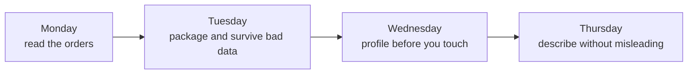
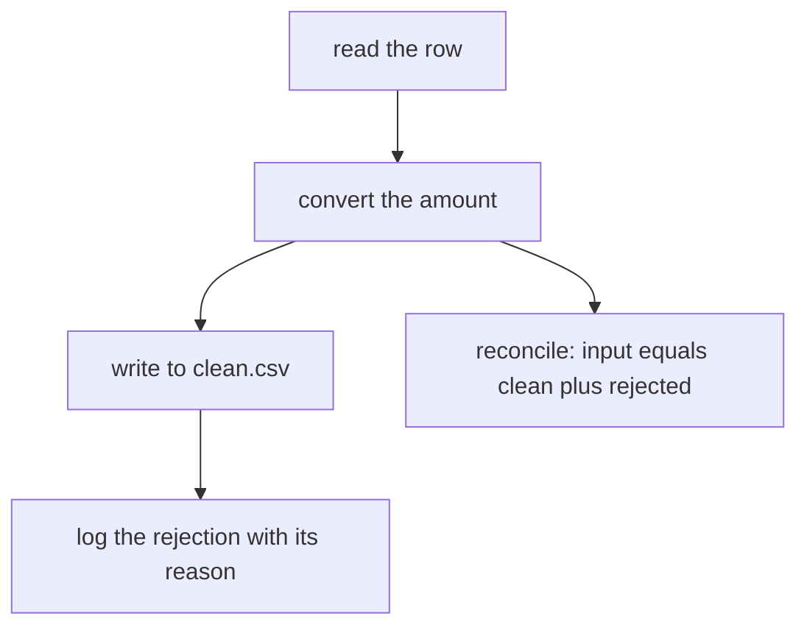

# Week 1 recap paper

Pen and paper. No laptop, no phone, no assistant of any kind. About two hours.

This paper is ungraded. The programme reads it as a performance indicator, and it carries nothing into your assessment. What it does carry is your first rehearsal of the week's ground as spoken interview answers, which is why every question is framed the way a screen would ask it.

## Before you start

| Instruction | Why it is there |
|---|---|
| Answer all nine questions. | Eight are on the week's question set and Q0 reads a diagram, and the discussion after the break walks all nine in order. |
| Pace at roughly one ninth of your time per question. | The questions are much the same size, so falling behind on one costs you a later one. |
| Write on alternate lines and start each question on a fresh side. | Another learner reads and checks your paper after the break and has to read your handwriting at speed. |
| Put the identifier you are registered with at the top of every sheet. | Papers are swapped for marking and have to come back to you. |
| Answer in short form: a selection, a value, one or two lines of reasoning. | Nothing here rewards length. An answer that fills a page and never names the mechanism does no work. |

No answers appear anywhere on this paper.

## The file every question is about

You spent the week on Kalpa Retail's Week 1 orders file. These are its real numbers, so you do not have to remember them:

| Fact | Value |
|---|---|
| Rows in the file | 50 |
| Distinct `order_id` values | 49, because `KR4201` appears twice and the two rows differ only on `order_date` |
| Amounts that convert to a number | 44 |
| Amounts that refuse to convert | 6, being `'twelve'`, two empty strings, `'12,400'`, `'24 500'` and `'Rs 8000'` |
| Sum of the 44 convertible amounts | Rs 561,145 |
| Mean of those 44 | Rs 12,753.30 |
| Median of those 44 | Rs 1,910 |
| The largest order | `KR4232` at Rs 480,000, delivered, Retail-Core, and real |
| Fields on a row | `order_id`, `customer_id`, `segment`, `amount`, `status`, `order_date`, `discount` |

---

## The week, as one picture

Every question below sits somewhere on this line. Read it once before you start.



---

## Q0. Read the diagram

Here is a cleaning pass, drawn. One arrow is wrong.



**(a)** Name the arrow that is wrong, and say in one line where it should go instead.

**(b)** In one line, say what the drawing would produce if it ran as it stands.

**(c)** Give the one line of code that checks the reconciliation, using `orders`, `clean` and `rejects`.

---

## Q1. A list against a dictionary

You hold the 50 orders as a list of records called `orders`, and you have also built `by_id`, which maps each `order_id` to its record.

**(a)** You need two things: the twelfth order in file order, and the amount on order `KR4210`. Name the structure that serves each one cheaply, and say in one line what the other structure would force you to do instead.

**(b)** Write the one line of Python you would use for each of those two lookups.

**(c)** In one line, give the rule you would hand a new joiner for choosing between the two.

---

## Q2. Two names, one object

```
a = [1, 2, 3]
b = a
b.append(9)
```

**(a)** State the value of `a` and the value of `b` after the third line, and say in one line why.

**(b)** Write two ways to copy the list on purpose, so that appending to the copy leaves `a` alone.

**(c)** The same trap in your cleaning loop looks like this:

```
keeper = record
keeper["amount"] = 0
```

State what happens to `record`, and name the change that fixes it.

---

## Q3. Reading a traceback

This ran on the orders file. Directory paths are trimmed to the file name so the frames fit the page.

```
Traceback (most recent call last):
  File "clean_orders.py", line 22, in <module>
    orders = clean_all("orders.csv")
             ^^^^^^^^^^^^^^^^^^^^^^^
  File "clean_orders.py", line 18, in clean_all
    clean.append(clean_record(row))
                 ^^^^^^^^^^^^^^^^^
  File "clean_orders.py", line 10, in clean_record
    keeper["amount"] = normalise_amount(record["amount"])
                       ^^^^^^^^^^^^^^^^^^^^^^^^^^^^^^^^^^
  File "clean_orders.py", line 5, in normalise_amount
    return int(raw)
           ^^^^^^^^
ValueError: invalid literal for int() with base 10: 'twelve'
```

**(a)** Name the function and the line number where the failure actually happened, and give the exception type together with the value that caused it.

**(b)** Which part of this output do you read first, which do you read last, and why in that order.

**(c)** You now have the file open at the failing line. State your first move, in one line.

---

## Q4. The bare except

This loop ran over the same 50 rows and printed `561145`.

```
total = 0
for row in rows:
    try:
        total += int(row["amount"])
    except:
        pass
print(total)
```

**(a)** State how many of the 50 rows contributed nothing to that printed number, and say what the person reading `561145` is never told.

**(b)** A reviewer wants the average order value and divides `561145` by 50. State the number that lands, say why it is wrong, and give the divisor you would have used.

**(c)** Rewrite the `except` line so the same run becomes honest. One line is enough.

---

## Q5. Everything out of a CSV is text

You have just read the orders file with `csv.DictReader` and have converted nothing yet.

**(a)** State what `row["amount"] > 3000` does on the first row, and give the exception type with the shape of its message.

**(b)** Name the point in your pipeline where conversion belongs, and say in one line why you do not do it at the point of comparison.

**(c)** Of the six amounts that refuse to convert, decide which you would repair and which you would reject, and state the rule you applied.

---

## Q6. CSV or JSON, and what flattening costs

The vendor feed carries each order with a nested `customer` block holding `customer_id`, `city` and `signup_date`, and a nested `source` block holding the system name and the raw amount exactly as it arrived.

**(a)** Choose CSV or JSON for this feed and defend the choice in one line.

**(b)** Your downstream tool reads CSV only. Name two things flattening costs you here, each one tied to a named field in this feed.

**(c)** State how many columns the flattened file needs to carry those two blocks, and name them.

---

## Q7. The number you hand a stakeholder

Across the 44 orders whose amounts convert, the mean is Rs 12,753.30 and the median is Rs 1,910. Order `KR4232` is Rs 480,000, it is delivered, and it is real.

**(a)** The stakeholder asks for the average order value. State the number you give and why.

**(b)** State what you say about `KR4232` in the same breath.

**(c)** Write the one sentence you send, carrying its denominator.

---

## Q8. Zero rejects on a file you know is dirty

Your cleaning run over the 50 rows finishes and the rejects log is empty.

**(a)** Name three checks, in the order you would run them.

**(b)** State the number the rejects log should carry on this file, and say what a zero is telling you instead.

**(c)** Write the one line of reconciliation that proves the run was honest.

---

## After the discussion

Rewrite, one line each, every question your marker did not give you full credit on. Bring those lines to Monday, when the same records return as tables in Postgres and as a DataFrame in pandas, and the same eight questions get asked again one level up.
