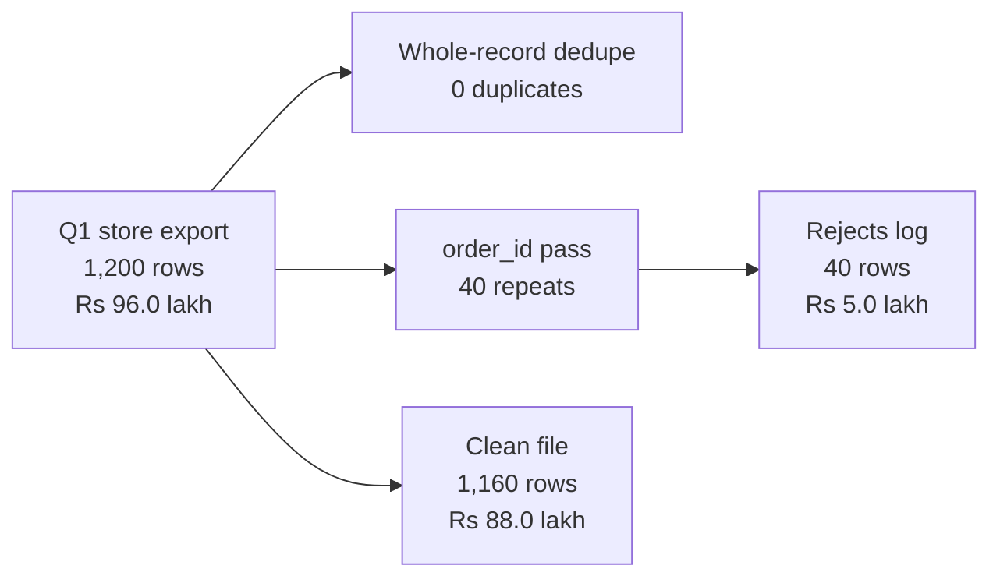

# Week 1 recap paper

Saturday 10 October 2026 · 120 minutes · 54 items in 6 parts · pen and paper, no assistant, no notes

Name: ____________________    Marked by: ____________________    Items right: ____ of 54

## What this paper is for

This week Meera Raghavan asked whether the Rs 12 crore Marketing wants for acquisition goes to the branch of revenue that is actually short, Anand Iyer disputed the Q1 figure the ERP export put on the dashboard, and Meera now has to decide whether the monsoon discount runs again at Diwali. This paper puts those decisions in front of you once more, with no notebook, no notes and no assistant, to find which of them you can make cold. The room's scores in each part, set beside the ratings you give in step one, decide where Monday's revision starts. A wrong answer tells Monday more than a blank one, so answer every item.

## How this paper works

- 120 minutes in one sitting. Each part gives its minutes as a guide, not a limit.
- Every item names its format beside its number: circle one letter, circle every correct letter, write T or F, write the word or number, show the working, or write the letters in order.
- Every item also names its level, easy, medium or hard, so you can plan your time. A hard item is several steps on an exhibit, never an obscure fact.
- A wrong answer costs nothing, so answer every item on the line under it.
- Pen and this paper only: no laptop, no phone, no notes and no assistant.
- Afterwards the papers are swapped and marked against the key, and the discussion takes the items the room missed most. The paper is ungraded and ranks nobody; the room's rates by part and by tag set Monday's revision.
- Every item is set inside Kalpa Retail, where you work as a trainee engineer in the data and AI team of its Global Capability Centre. Meera Raghavan is its CEO, Anand Iyer its finance controller and Kavya Nair a senior analyst in its data team; Marketing and Finance appear by function, and every number an item needs is on the page.

## Step one, before Part 1

Before you read any item, rate yourself from 1 to 4 on each part in the table below, as you are today. The comparison between your rating and your score in each part is the most useful thing this paper produces for Monday.

- 1: I have not used this
- 2: I can follow it when someone shows me
- 3: I can do it alone on a small problem
- 4: I can find and fix mistakes in someone else's version

Your ratings: Part 1 ___ · Part 2 ___ · Part 3 ___ · Part 4 ___ · Part 5 ___ · Part 6 ___

## The paper at a glance

| Part | What it shows | Items | Minutes | Easy | Medium | Hard |
|---|---|---|---|---|---|---|
| 1. The week's rules, cold | whether the week's definitions and rules are there without a notebook open | Q1 to Q9 (9) | 9 | 5 | 3 | 1 |
| 2. Where did the revenue go | whether you can break a revenue fall into its branches and choose the one to open first | Q10 to Q21 (12) | 27.5 | 5 | 5 | 2 |
| 3. Rows you can trust | whether you clean a file with a reason for every change and reconcile it in rows and in rupees | Q22 to Q31 (10) | 23 | 3 | 6 | 1 |
| 4. Read the code, read the data | whether you catch a wrong number in a line of Python or an export before it reaches a decision | Q32 to Q41 (10) | 21.5 | 2 | 4 | 4 |
| 5. Chance and a fair test | whether you can say what a p-value means, when a gap is worth acting on and what a fair test of a cause needs | Q42 to Q48 (7) | 16.5 | 1 | 2 | 4 |
| 6. The numbers | whether you can do the week's arithmetic by hand and show the working | Q49 to Q54 (6) | 22 | 3 | 2 | 1 |
| Total | | 54 | 119.5 | 19 | 22 | 13 |

---

## Part 1. The week's rules, cold (Q1 to Q9)

*What it shows: whether the week's definitions and rules are there without a notebook open. 9 items, about 9 minutes.*

"Say it to me the way you will say it to her, because I will push the way Marketing will." Kavya Nair, the senior analyst, starts with the week's rules, one line each, before any note goes to Meera.

#### Q1 · Medium · write the word or number · Complete the definition

The p-value is the share of chance-only worlds that show a gap at least as ____ as the one observed.

Answer: ____________________

#### Q2 · Medium · write the word or number · Name the mechanism

Customers who would have bought anyway were more likely to receive the discount. A factor that drives both receiving it and buying is called a ____.

Answer: ____________________

#### Q3 · Medium · write T or F · Read a p-value claim

A p-value of 0.03 means there is a 3 percent chance that the finding is wrong.

Answer: ____________________

#### Q4 · Easy · write T or F · Test a claim on averages

If one corporate order is fifty times the size of a normal order, the median order value barely moves while the mean jumps.

Answer: ____________________

#### Q5 · Easy · write T or F · Judge a claim on significance

A difference can be statistically real and still not be worth acting on.

Answer: ____________________

#### Q6 · Easy · write T or F · Check a claim on duplicates

Removing exact duplicate rows can change a quarter's revenue.

Answer: ____________________

#### Q7 · Easy · write T or F · Compare two counts

A rate computed on 12 orders deserves the same trust as the same rate computed on 400 orders.

Answer: ____________________

#### Q8 · Easy · write T or F · Test a causal claim

If revenue rose after a discount, the discount caused the rise.

Answer: ____________________

#### Q9 · Hard · write T or F · Judge an aggregate claim

A total can rise while every segment inside it falls, if the mix of segments shifts.

Answer: ____________________

---

## Part 2. Where did the revenue go (Q10 to Q21)

*What it shows: whether you can break a revenue fall into its branches and choose the one to open first. 12 items, about 27.5 minutes.*

"Are we losing customers, or are the ones we have buying less?" Meera Raghavan, the CEO, asks it with Q2 revenue below Q1 and Marketing asking her for Rs 12 crore to acquire new customers.

#### Q10 · Easy · circle one letter · Rule out a branch

Revenue fell from Q1 to Q2 while the customer count stayed flat. Which branch of the revenue tree can you rule out first?

a) the number of orders per customer
b) the number of items per order
c) the number of customers
d) the value of the discounts given

#### Q11 · Easy · circle one letter · Place the Rs 12 crore

Marketing asks for Rs 12 crore to acquire new customers. On the revenue tree, which branch is that money a bet on?

a) customers
b) orders per customer
c) items per order
d) price per item

#### Q12 · Easy · circle one letter · Pick the first rung

What is the first rung of the sales-drop investigation ladder?

a) Confirm that the drop is real.
b) Decompose the change along the revenue tree.
c) State a hypothesis for the cause.
d) Isolate the segment that moved.

#### Q13 · Medium · circle one letter · Repair the comparison

Q1 holds 13 weeks of orders and Q2 holds 11. What makes the revenue comparison fair?

a) Compare the two totals as they stand, since each is one calendar quarter.
b) Add two weeks at the Q2 weekly average and report that total as actual.
c) Compare the quarters month by month, three months against three.
d) Compare revenue per week, or cut both quarters to the same weeks.

#### Q14 · Hard · circle one letter · Compare the levers

With every other branch of the tree held as it is, a 10 percent lift in which branch adds the most revenue?

a) Customers, because new buyers bring in revenue that did not exist in the business before.
b) Orders per customer, because existing buyers cost nothing to reach.
c) All three add the same revenue, so the choice turns on what each costs to move.
d) Price per item, because a price rise flows straight into revenue.

#### Q15 · Easy · circle every correct letter · Define a rate

Which of these belong in a complete definition of a rate? Mark every correct option.

a) its numerator
b) its denominator
c) its value last quarter
d) the time window it covers

#### Q16 · Medium · circle every correct letter · Find what fakes a drop

Which of these can make a quarter-on-quarter drop look real when it is not? Mark every correct option.

a) reporting the median beside the mean
b) quarters holding unequal numbers of weeks
c) duplicated rows in the earlier quarter
d) a segment definition that changed between the quarters

### Set 1

**Situation.** Kalpa Retail, two quarters. Q1: 1,000 customers, 2,400 orders, revenue Rs 48.0 lakh. Q2: 1,000 customers, 2,160 orders, revenue Rs 43.2 lakh.

**Exhibit 2A.** Kalpa Retail, the two quarters as the situation gives them.

| Quarter | Customers | Orders | Revenue |
|---|---|---|---|
| Q1 | 1,000 | 2,400 | Rs 48.0 lakh |
| Q2 | 1,000 | 2,160 | Rs 43.2 lakh |

#### Q17 · Easy · circle one letter · Compute a leaf

What is orders per customer in Q2?

a) 2.00
b) 2.16
c) 2.40
d) 0.46

#### Q18 · Medium · circle one letter · Find the branch that moved

Which branch moved between the quarters?

a) the number of customers
b) orders per customer
c) revenue per order
d) all three

#### Q19 · Medium · write T or F · Test the decomposition

True or false: The whole drop can be explained without any change in revenue per order.

Answer: ____________________

#### Q20 · Hard · circle one letter · Answer Marketing's claim

Marketing says the fix is acquisition. What does the decomposition say?

a) It is not supported: customers are flat and frequency fell 10 percent.
b) It is supported, because the customer count fell between the quarters.
c) Nothing can be said, because two quarters are too few to decompose.
d) It is supported, because revenue per order fell by about 10 percent.

#### Q21 · Medium · write the letters in order · Order the ladder

Put the five rungs of the sales-drop investigation ladder in order.

a) Isolate the branch and the segment.
b) Confirm that the drop is real.
c) Hypothesise, and name the evidence that would settle it.
d) Compare like with like.
e) Decompose along the revenue tree.

Order: ____________________

---

## Part 3. Rows you can trust (Q22 to Q31)

*What it shows: whether you clean a file with a reason for every change and reconcile it in rows and in rupees. 10 items, about 23 minutes.*

"Your dashboard says Q1 was Rs 2.1 crore. Our books say 1.9." Anand Iyer, the finance controller, wrote that back to all on Tuesday's finding, and the ERP export behind the dashboard is the file on your desk.

#### Q22 · Medium · circle one letter · Repair the crash

A loop crashes on int('twelve'). Which repair is honest?

a) Replace every failed conversion with 0, so that the totals can still be computed.
b) Delete the offending row from the source file, so that the crash cannot recur.
c) Convert the whole column to float, because float accepts more kinds of text.
d) Catch the error, write the row to the rejects log with its reason, and continue.

#### Q23 · Medium · circle one letter · Decide what a duplicate is

Two rows share an order_id and differ only in one timestamp. What decides whether they are duplicates?

a) the number of rows that the file holds in total
b) the identity rule you wrote down for an order
c) whether the file arrived as CSV or as JSON
d) whether the two amounts are large or small

#### Q24 · Medium · circle one letter · Read the run's report

A cleaning run reports input 200, clean 183 and rejected 14. What does that tell you?

a) Three rows are unaccounted for, so the pipeline cannot be trusted yet.
b) Fourteen rows were duplicates, and the remaining rows are all safe to use.
c) The run reconciles, because clean rows outnumber rejected rows.
d) Seventeen rows were rejected, and the log has simply under-counted them.

#### Q25 · Medium · circle one letter · Choose the first move

The dashboard shows Rs 2.1 crore for Q1 and Finance shows Rs 1.9 crore. What is your first move?

a) Average the two figures and report Rs 2.0 crore with a note on the range.
b) Ask Finance to restate its books, because the dashboard reads the live system.
c) Report the dashboard figure, because it refreshes daily while Finance's books lag a month.
d) Profile the export for duplicates and reconcile counts and revenue against Finance.

#### Q26 · Easy · circle every correct letter · Treat a missing value

Which are valid treatments for a missing value, each with a written reason? Mark every correct option.

a) Drop the row.
b) Type a value into the export.
c) Fill a stated default.
d) Keep the row and flag it.

#### Q27 · Easy · circle every correct letter · Define the profile

What does a field profile report for each field? Mark every correct option.

a) how many values are present
b) how many values convert to the expected type
c) how many distinct values there are
d) the value to fill in where one is missing

### Set 2

**Situation.** The ERP export holds 214 rows. Your cleaning run removes 14 exact duplicates and rejects 3 more rows: one amount spelt as a word, one row missing a required field and one truncated line. Every removed row goes to the rejects log with its reason.

**Exhibit 3A.** The 214 rows of the ERP export, and what the cleaning run took out of them.

| What left the ERP export | Rows |
|---|---|
| Exact duplicates | 14 |
| Amount spelt as a word | 1 |
| Missing required field | 1 |
| Truncated line | 1 |

#### Q28 · Easy · write the word or number · Count the clean rows

The clean file holds ____ rows.

Answer: ____________________

#### Q29 · Medium · write the word or number · Size the rejects log

For the run to reconcile, the rejects log must hold ____ rows.

Answer: ____________________

#### Q30 · Hard · circle one letter · Update the comparison

All 14 duplicates sat in Q1. What happens to the Q1 to Q2 drop once they are removed?

a) It grows, because removing rows takes revenue out.
b) It stays the same, because duplicates cancel out.
c) It shrinks, because Q1 was inflated.
d) It turns into a rise in every case.

#### Q31 · Medium · write the letters in order · Order the cleaning pass

Put the cleaning pass in order.

a) Reconcile counts and revenue.
b) Profile each field.
c) Recompute the revenue tree on the clean data.
d) Decide drop, default or flag for each defect, with a written reason.

Order: ____________________

---

## Part 4. Read the code, read the data (Q32 to Q41)

*What it shows: whether you catch a wrong number in a line of Python or an export before it reaches a decision. 10 items, about 21.5 minutes.*

"You gave me a number and told me what it counts." Kavya Nair, the senior analyst, now wants the code and the export behind each number read line by line, before any of it reaches Meera.

#### Q32 · Medium · write T or F · Predict the comparison

In Python 3, the comparison '4500' > 3000 evaluates to True.

Answer: ____________________

### Set 3

**Situation.** Kalpa's store-channel export for Q1 holds 1,200 rows worth Rs 96.0 lakh. A dedupe that compares whole records reports 0 duplicates. A second pass keyed on order_id finds 40 rows whose order_id already appeared, each differing from the first row only in its timestamp. The run keeps 1,160 clean rows worth Rs 88.0 lakh and logs the 40 repeats as rejects worth Rs 5.0 lakh.

**Exhibit 4A.** The cleaning run on the store export, with the rows and the rupees at each stage.



#### Q33 · Medium · circle one letter · Choose the count to trust

Which duplicate count should the run trust?

a) Zero, because a duplicate has to match the earlier row in every field.
b) Zero, because a different timestamp proves two separate orders were placed.
c) Forty, but only once Finance has confirmed every pair by hand.
d) Forty, because the identity rule says one order_id is one order.

#### Q34 · Hard · circle one letter · Judge the reconciliation

The row counts add up: 1,160 clean plus 40 rejected is 1,200. What is the honest status of the run?

a) Reconciled, because the clean rows and the rejects add back to the 1,200 input rows.
b) Not reconciled, because Rs 3.0 lakh is in neither the clean file nor the log.
c) Not reconciled, because Rs 8.0 lakh left the file when the 40 repeats were removed.
d) Reconciled, because a gap under 5 percent of the input is within ordinary rounding.

### Set 4

**Situation.** Kalpa's April export for two segments holds 500 order rows placed by 250 distinct customers. Retail: 400 orders, revenue Rs 8.0 lakh. Business: 100 orders, revenue Rs 12.0 lakh. A slide built from the export reads: orders per customer 1.00, average order value Rs 7,000.

**Exhibit 4B.** April, two segments. The 500 order rows come from 250 distinct customers.

| Segment | Order rows | Revenue |
|---|---|---|
| Retail | 400 | Rs 8.0 lakh |
| Business | 100 | Rs 12.0 lakh |

#### Q35 · Easy · write the word or number · Count per customer

Orders per customer in this export is ____.

Answer: ____________________

#### Q36 · Medium · write the word or number · Price the average order

The average order value across both segments is Rs ____.

Answer: ____________________

#### Q37 · Hard · circle one letter · Reply in the room

Marketing reads the slide as "nobody comes back, so buy new customers". What do you say in the room?

a) Agree, because the export shows each customer placing exactly one order in April.
b) Agree, once the median order value has been checked beside the Rs 7,000 mean.
c) Push back: 250 customers placed 500 orders, so "nobody comes back" is false.
d) Push back, because the Rs 7,000 average shows customers already spend enough.

**Exhibit 4C.** Five invented orders, and the loop that counts the ones with a discount.

```python
orders = [{"order_id": "INV-1", "discount": 150},
          {"order_id": "INV-2", "discount": 0}, {"order_id": "INV-3"},
          {"order_id": "INV-4", "discount": 200}, {"order_id": "INV-5"}]
with_discount = 0
for order in orders:
    if order.get("discount", 0) > 0:
        with_discount += 1
print(with_discount, "of", len(orders), "orders had a discount")
```

#### Q38 · Medium · circle one letter · Read the discount count

The discount field is optional in Kalpa's export. Marketing reads the line this prints as "three orders in five had no discount" and wants the offer extended to those three. What is the honest reading?

a) Three in five had no discount, so the offer would reach customers who had none.
b) Two of the three are unknown, and 2 in 5 remains the share to report.
c) Two of the three are broken records, so they belong in the rejects log.
d) Two of the three are unknown, so the share is 2 of the 3 recorded.

#### Q39 · Easy · circle one letter · Predict what result holds

A function ends with print(total) and has no return statement. After result = revenue_for(seg), what does result hold?

a) 0, because a missing return defaults to zero for numbers.
b) The total, because print both displays the value and sends it back to the caller.
c) None, because a function without a return statement hands back None.
d) An error, because Python refuses to assign from such a function.

**Exhibit 4D.** The helper and the summary line, run on two cities' invented figures.

```python
def pct_change(before, after):
    change = 100 * (after - before) / before
    if abs(change) > 30:
        print(f"check by hand: {change:+.1f}%")
    else:
        return round(change, 1)
changes = {"Pune": pct_change(1.60, 0.80), "Delhi": pct_change(1.50, 1.41)}
print({city: v for city, v in changes.items() if v and v < 0})
```

#### Q40 · Hard · circle one letter · Trace the summary

The analyst sends Meera the last line this prints as the cities where orders per customer fell from Q1 to Q2. What does that line give her, and why?

a) Both cities, Pune down 50.0 percent and Delhi down 6.0, with Pune flagged for a check.
b) Delhi alone, because Pune's change came back as None and the filter dropped it.
c) Delhi alone, and rightly, since the check-by-hand line was a warning about Pune's data.
d) Delhi alone, because Pune's change came back as zero, and zero is not a fall.

**Exhibit 4E.** Four invented rows in file order, and the cleaning pass run on them.

```python
rows = [("A", "2400"), ("B", "n/a"), ("B", "1800"), ("C", "3100")]
first = {}
for order_id, amount in rows:
    first.setdefault(order_id, amount)
clean = [int(a) for a in first.values() if a != "n/a"]
print(len(rows), "rows:", len(clean), "clean,", len(rows) - len(clean),
      "set aside; Rs", sum(clean))
```

#### Q41 · Hard · circle one letter · Predict the output

Finance's books hold orders A, B and C at Rs 7,300 in all. This pass cleans four rows of the export, read in file order. What does it print?

a) 4 rows: 2 clean, 2 set aside; Rs 5500
b) 4 rows: 3 clean, 1 set aside; Rs 7300
c) 4 rows: 3 clean, 1 set aside; Rs 5500
d) 4 rows: 2 clean, 2 set aside; Rs 7300

---

## Part 5. Chance and a fair test (Q42 to Q48)

*What it shows: whether you can say what a p-value means, when a gap is worth acting on and what a fair test of a cause needs. 7 items, about 16.5 minutes.*

"Real, or the wobble we see every quarter? Should I move budget to Student? Did the discount work?" Meera Raghavan, the CEO, wants all three answered before Monday's growth review.

#### Q42 · Hard · circle one letter · Read the shuffles

Ten label shuffles produced gaps between 2 and 6 points, and the real gap is 5 points. What is the honest reading?

a) The real gap must be an error, because shuffled labels should always give zero.
b) The real gap is significant, because it is larger than most of the shuffled gaps.
c) Chance alone often produces a gap this large, so the real gap is not surprising.
d) The shuffle should be repeated until the real gap looks rare enough to report.

#### Q43 · Easy · circle one letter · Advise Meera

The Student segment grew 40 percent on 12 orders. What do you tell Meera?

a) Move budget to Student now, since it grows fastest.
b) The rate rests on too few orders to trust yet.
c) Drop Student from the report as too small to matter.
d) The growth is proven because 40 percent is large.

#### Q44 · Medium · circle every correct letter · Design a fair test

What does a fair test of 'did the discount work' need? Mark every correct option.

a) a deeper discount, so any effect is easier to see
b) a like-for-like group that did not get the discount
c) the same time window for both groups
d) a comparable mix of segments in both groups

#### Q45 · Hard · circle every correct letter · Check four p-value statements

Which statements about the p-value are correct? Mark every correct option.

a) It is computed on the assumption that chance alone is at work.
b) It is the probability that the hypothesis is true.
c) A small value means the observed gap would be rare under chance alone.
d) It says nothing about whether the gap is large enough to matter.

### Set 5

**Situation.** After the monsoon discount, total revenue rose 6 percent. Split by segment, revenue per customer fell in every segment. The customers who received the discount were, on average, more frequent buyers than those who did not.

**Exhibit 5A.** The monsoon discount, as the situation reports it.

| What was measured | What it showed |
|---|---|
| Total revenue after the monsoon discount | Rose 6 percent |
| Revenue per customer inside each segment | Fell in every segment |
| Customers who received the discount | Bought more often on average than those who did not |

#### Q46 · Hard · circle one letter · Name the pattern

What is this pattern an example of?

a) a reversal driven by a shift in the mix of customers
b) a calculation error in the segment-level revenue totals
c) a seasonal effect that the monsoon produces every year
d) a sample that is too small to show any pattern at all

#### Q47 · Medium · write T or F · Judge frequency's role

True or false: Buying frequency is a confounder for the campaign's effect.

Answer: ____________________

#### Q48 · Hard · circle one letter · Advise on Diwali

Meera asks whether to repeat the discount at Diwali. Which answer is honest?

a) Repeat it exactly as it ran, because total revenue rose 6 percent after the campaign.
b) Double the discount, because a larger offer will lift every segment in turn.
c) Say nothing yet, because a single campaign can never be evaluated at all.
d) Do not repeat it as designed: no segment improved, and the lift is a mix effect.

---

## Part 6. The numbers (Q49 to Q54)

*What it shows: whether you can do the week's arithmetic by hand and show the working. 6 items, about 22 minutes.*

"Before anything goes to Meera, rebuild the week from a raw export with no assistant and no notes." Kavya Nair, the senior analyst, wants the working as well as the answer, on the lines under each item.

#### Q49 · Easy · circle one letter · Read the two averages

Order values show a mean of Rs 9,800 and a median of Rs 1,400. What is the likeliest explanation?

a) Most orders sit close to the Rs 9,800 mean.
b) The median was miscalculated from a partial export.
c) Half the orders are above Rs 9,800.
d) A few very large orders pull the mean up.

#### Q50 · Hard · show the working, then the answer · Reason with numbers

A 15 percent discount lifts the quantity sold by 10 percent. By what percent does revenue change?

Working:

Answer: ____________________

#### Q51 · Easy · show the working, then the answer · Compute median and mean

Five order values in rupees: 800, 1,200, 1,400, 2,000 and 480,000. Give the median and the mean.

Working:

Answer: ____________________

#### Q52 · Easy · show the working, then the answer · Size the change

Revenue was Rs 2.1 crore in Q1 and Rs 1.9 crore in Q2. Give the percentage change to one decimal place.

Working:

Answer: ____________________

#### Q53 · Medium · show the working, then the answer · Read p off the shuffles

In 5,000 label shuffles, 140 produced a gap at least as large as the real one. What is the p-value?

Working:

Answer: ____________________

#### Q54 · Medium · show the working, then the answer · Build revenue from the tree

A retailer has 50,000 customers, 2 orders per customer, 3 items per order, Rs 400 per item and Rs 1 crore of discounts. What is its revenue?

Working:

Answer: ____________________

---

## Stretch: untimed, and not marked

For anyone who finishes early. Nothing here is counted. Stretch 1 to 4 are the kind an interviewer asks after your first answer, so write the answer you would say. Stretch 5 to 10 are one-line recalls of the week's rules, answered on the line.

### Stretch 1

Marketing concedes that frequency fell but says acquisition is still the cheaper way to add Rs 1 crore of revenue. What would you need to see before agreeing, and how would you say it to Meera in three sentences?

### Stretch 2

A shuffle test on the gap between two segments returns p = 0.03. Meera asks, "So we are 97 percent sure?" Answer in two sentences she can repeat to the board.

### Stretch 3

An auditor asks you to walk through the rows your cleaning run removed. Describe the four things you show them, in order.

### Stretch 4

You have two hours and a raw export, and Meera wants the Q1 figure by lunch. What do you do first, what do you skip, and what do you refuse to skip?

### Stretch 5

Revenue equals customers times orders per customer times items per order times ____ per item, less discounts.

Answer: ____________________

### Stretch 6

Orders per customer is total orders divided by the number of distinct ____.

Answer: ____________________

### Stretch 7

A function that prints its result and has no return statement hands the value ____ back to the caller.

Answer: ____________________

### Stretch 8

Every field that csv.DictReader reads arrives as the type ____ until you convert it.

Answer: ____________________

### Stretch 9

A cleaning run reconciles when input rows equal clean rows plus ____ rows.

Answer: ____________________

### Stretch 10

The stakeholder note has four parts in order: claim, evidence, ____ and action.

Answer: ____________________
