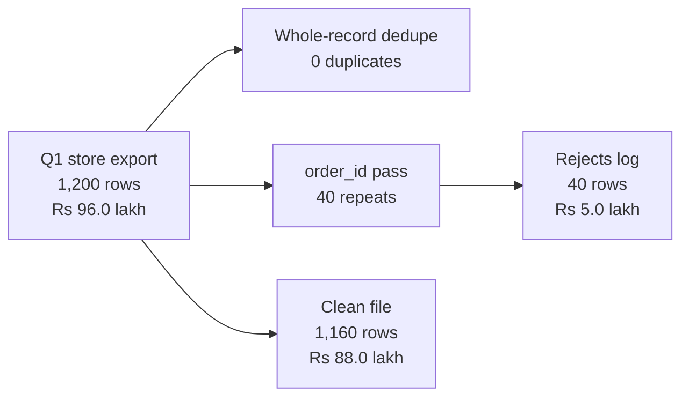

# Week 1 recap paper

Saturday 10 October 2026 · 120 minutes · 57 items · pen and paper, no assistant, no notes

Name: ____________________    Marked by: ____________________    Items right: ____ of 57

Answer every item in the space it gives you. Each section says how. After the break the papers are swapped and marked against the key, and the discussion starts with the items the room missed most.

---

## A. Fill in the blank (Q1 to Q8)

Write the missing word or number on the line.

#### Q1

Revenue equals customers times orders per customer times items per order times ____ per item, less discounts.

Answer: ____________________

#### Q2

Orders per customer is total orders divided by the number of distinct ____.

Answer: ____________________

#### Q3

A function that prints its result and has no return statement hands the value ____ back to the caller.

Answer: ____________________

#### Q4

Every field that csv.DictReader reads arrives as the type ____ until you convert it.

Answer: ____________________

#### Q5

A cleaning run reconciles when input rows equal clean rows plus ____ rows.

Answer: ____________________

#### Q6

The p-value is the share of chance-only worlds that show a gap at least as ____ as the one observed.

Answer: ____________________

#### Q7

The stakeholder note has four parts in order: claim, evidence, ____ and action.

Answer: ____________________

#### Q8

Customers who would have bought anyway were more likely to receive the discount. A factor that drives both receiving it and buying is called a ____.

Answer: ____________________

---

## B. True or false (Q9 to Q16)

Write T or F on the line.

#### Q9

A p-value of 0.03 means there is a 3 percent chance that the finding is wrong.

Answer: ____________________

#### Q10

If one corporate order is fifty times the size of a normal order, the median order value barely moves while the mean jumps.

Answer: ____________________

#### Q11

In Python 3, the comparison '4500' > 3000 evaluates to True.

Answer: ____________________

#### Q12

A difference can be statistically real and still not be worth acting on.

Answer: ____________________

#### Q13

Removing exact duplicate rows can change a quarter's revenue.

Answer: ____________________

#### Q14

A rate computed on 12 orders deserves the same trust as the same rate computed on 400 orders.

Answer: ____________________

#### Q15

If revenue rose after a discount, the discount caused the rise.

Answer: ____________________

#### Q16

A total can rise while every segment inside it falls, if the mix of segments shifts.

Answer: ____________________

---

## C. One correct option (Q17 to Q29)

Circle the one correct letter.

#### Q17

Revenue fell from Q1 to Q2 while the customer count stayed flat. Which branch of the revenue tree can you rule out first?

a) the number of orders per customer
b) the number of items per order
c) the number of customers
d) discounts

#### Q18

Marketing asks for Rs 12 crore to acquire new customers. On the revenue tree, which branch is that money a bet on?

a) customers
b) orders per customer
c) items per order
d) price per item

#### Q19

Order values show a mean of Rs 9,800 and a median of Rs 1,400. What is the likeliest explanation?

a) Most orders sit near Rs 9,800.
b) The median has been miscalculated from an incomplete export.
c) Half the orders are above Rs 9,800.
d) A few very large orders pull the mean up.

#### Q20

What is the first rung of the sales-drop investigation ladder?

a) Confirm that the drop is real.
b) Decompose the change along the revenue tree.
c) State a hypothesis for the cause.
d) Isolate the segment that moved.

#### Q21

Q1 holds 13 weeks of orders and Q2 holds 11. What makes the revenue comparison fair?

a) Compare the two totals as they stand.
b) Add two weeks at the Q2 weekly average and report that total as actual.
c) Drop Q2 from the analysis.
d) Compare revenue per week, or cut both quarters to the same weeks.

#### Q22

A function ends with print(total) and has no return statement. After result = revenue_for(seg), what does result hold?

a) 0, because a missing return defaults to zero for numbers.
b) The total, because print both displays the value and sends it back to the caller.
c) None, because a function without a return statement hands back None.
d) An error, because Python refuses to assign from such a function.

#### Q23

A loop crashes on int('twelve'). Which repair is honest?

a) Replace every failed conversion with 0, so that the totals can still be computed.
b) Delete the offending row from the source file, so that the crash cannot recur.
c) Convert the whole column to float, because float accepts more kinds of text.
d) Catch the error, write the row to the rejects log with its reason, and continue.

#### Q24

Two rows share an order_id and differ only in one timestamp. What decides whether they are duplicates?

a) the number of rows that the file holds in total
b) the identity rule you wrote down for an order
c) whether the file arrived as CSV or as JSON
d) whether the two amounts are large or small

#### Q25

A cleaning run reports input 200, clean 183 and rejected 14. What does that tell you?

a) Three rows are unaccounted for, so the pipeline cannot be trusted yet.
b) Fourteen rows were duplicates, and the remaining rows are all safe to use.
c) The run reconciles, because clean rows outnumber rejected rows.
d) Seventeen rows were rejected, and the log has simply under-counted them.

#### Q26

Ten label shuffles produced gaps between 2 and 6 points, and the real gap is 5 points. What is the honest reading?

a) The real gap must be an error, because shuffled labels should always give zero.
b) The real gap is significant, because it is larger than most of the shuffled gaps.
c) Chance alone often produces a gap this large, so the real gap is not surprising.
d) The shuffle should be repeated until the real gap looks rare enough to report.

#### Q27

The Student segment grew 40 percent on 12 orders. What do you tell Meera?

a) Move budget to Student now.
b) The rate rests on too few orders to trust yet.
c) Drop the Student segment.
d) The growth is proven because 40 percent is large.

#### Q28

The dashboard shows Rs 2.1 crore for Q1 and Finance shows Rs 1.9 crore. What is your first move?

a) Average the two figures and report Rs 2.0 crore with a note on the range.
b) Ask Finance to restate its books, because the dashboard reads the live system.
c) Report the dashboard figure, because it refreshes daily while Finance's books lag a month.
d) Profile the export for duplicates and reconcile counts and revenue against Finance.

#### Q29

With every other branch of the tree held as it is, a 10 percent lift in which branch adds the most revenue?

a) Customers, because new buyers bring in revenue that did not exist in the business before.
b) Orders per customer, because existing buyers cost nothing to reach.
c) All three add the same revenue, so the choice turns on what each costs to move.
d) Price per item, because a price rise flows straight into revenue.

---

## D. More than one correct (Q30 to Q35)

Circle every correct letter.

#### Q30

Which of these belong in a complete definition of a rate? Mark every correct option.

a) its numerator
b) its denominator
c) the colour of its chart
d) the time window it covers

#### Q31

Which of these can make a quarter-on-quarter drop look real when it is not? Mark every correct option.

a) quarters of unequal length
b) duplicated rows in the earlier quarter
c) a segment definition that changed between the quarters
d) reporting the median beside the mean

#### Q32

Which are valid treatments for a missing value, each with a written reason? Mark every correct option.

a) Drop the row.
b) Fill a stated default.
c) Keep the row and flag it.
d) Type a value into the source file.

#### Q33

What does a field profile report for each field? Mark every correct option.

a) how many values are present
b) how many values convert to the expected type
c) how many distinct values there are
d) the p-value of the field

#### Q34

What does a fair test of 'did the discount work' need? Mark every correct option.

a) a like-for-like group that did not get the discount
b) the same time window for both groups
c) a comparable mix of segments in both groups
d) a deeper discount

#### Q35

Which statements about the p-value are correct? Mark every correct option.

a) It is computed on the assumption that chance alone is at work.
b) A small value means the observed gap would be rare under chance alone.
c) It is the probability that the hypothesis is true.
d) It says nothing about whether the gap is large enough to matter.

---

## E. Scenario set (Q36 to Q50)

Each set opens on one Kalpa situation. Answer each item the way it asks: circle a letter, write T or F, or write the number or the word.

### Set 1

**Situation.** Kalpa Retail, two quarters. Q1: 1,000 customers, 2,400 orders, revenue Rs 48.0 lakh. Q2: 1,000 customers, 2,160 orders, revenue Rs 43.2 lakh.

| Quarter | Customers | Orders | Revenue |
|---|---|---|---|
| Q1 | 1,000 | 2,400 | Rs 48.0 lakh |
| Q2 | 1,000 | 2,160 | Rs 43.2 lakh |

*Kalpa Retail, the two quarters as the situation gives them.*

#### Q36

What is orders per customer in Q2?

a) 2.00
b) 2.16
c) 2.40
d) 0.46

#### Q37

Which branch moved between the quarters?

a) the number of customers
b) orders per customer
c) revenue per order
d) all three

#### Q38

True or false: The whole drop can be explained without any change in revenue per order.

Answer: ____________________

#### Q39

Marketing says the fix is acquisition. What does the decomposition say?

a) It is not supported: customers are flat and frequency fell 10 percent.
b) It is supported, because the customer count fell between the quarters.
c) Nothing can be said, because two quarters are too few to decompose.
d) It is supported, because revenue per order fell by about 10 percent.

### Set 2

**Situation.** The ERP export holds 214 rows. Your cleaning run removes 14 exact duplicates and rejects 3 more rows: one amount spelt as a word, one row missing a required field and one truncated line. Every removed row goes to the rejects log with its reason.

| What left the ERP export | Rows |
|---|---|
| Exact duplicates | 14 |
| Amount spelt as a word | 1 |
| Missing required field | 1 |
| Truncated line | 1 |

*The 214 rows of the ERP export, and what the cleaning run took out of them.*

#### Q40

The clean file holds ____ rows.

Answer: ____________________

#### Q41

For the run to reconcile, the rejects log must hold ____ rows.

Answer: ____________________

#### Q42

All 14 duplicates sat in Q1. What happens to the Q1 to Q2 drop once they are removed?

a) It grows.
b) It stays the same, because duplicates cancel out.
c) It shrinks, because Q1 was inflated.
d) It turns into a rise in every case.

### Set 3

**Situation.** After the monsoon discount, total revenue rose 6 percent. Split by segment, revenue per customer fell in every segment. The customers who received the discount were, on average, more frequent buyers than those who did not.

| What was measured | What it showed |
|---|---|
| Total revenue after the monsoon discount | Rose 6 percent |
| Revenue per customer inside each segment | Fell in every segment |
| Customers who received the discount | Bought more often on average than those who did not |

*The monsoon discount, as the situation reports it.*

#### Q43

What is this pattern an example of?

a) a reversal driven by a shift in the mix of customers
b) a calculation error in the segment-level revenue totals
c) a seasonal effect that the monsoon produces every year
d) a sample that is too small to show any pattern at all

#### Q44

True or false: Buying frequency is a confounder for the campaign's effect.

Answer: ____________________

#### Q45

Meera asks whether to repeat the discount at Diwali. Which answer is honest?

a) Repeat it exactly as it ran, because total revenue rose 6 percent after the campaign.
b) Double the discount, because a larger offer will lift every segment in turn.
c) Say nothing yet, because a single campaign can never be evaluated at all.
d) Do not repeat it as designed: no segment improved, and the lift is a mix effect.

### Set 4

**Situation.** Kalpa's April export for two segments holds 500 order rows placed by 250 distinct customers. Retail: 400 orders, revenue Rs 8.0 lakh. Business: 100 orders, revenue Rs 12.0 lakh. A slide built from the export reads: orders per customer 1.00, average order value Rs 7,000.

| Segment | Order rows | Revenue |
|---|---|---|
| Retail | 400 | Rs 8.0 lakh |
| Business | 100 | Rs 12.0 lakh |

*April, two segments. The 500 order rows come from 250 distinct customers.*

#### Q46

Orders per customer, divided by the number of distinct customers, is ____.

Answer: ____________________

#### Q47

The average order value across both segments is Rs ____.

Answer: ____________________

#### Q48

Marketing reads the slide as "nobody comes back, so buy new customers". What do you say in the room?

a) Agree, because the export shows each customer placing exactly one order in April.
b) Agree, once the median order value has been checked beside the Rs 7,000 mean.
c) Push back: 250 customers placed 500 orders, so "nobody comes back" is false.
d) Push back, because the Rs 7,000 average shows customers already spend enough.

### Set 5

**Situation.** Kalpa's store-channel export for Q1 holds 1,200 rows worth Rs 96.0 lakh. A dedupe that compares whole records reports 0 duplicates. A second pass keyed on order_id finds 40 rows whose order_id already appeared, each differing from the first row only in its timestamp. The run keeps 1,160 clean rows worth Rs 88.0 lakh and logs the 40 repeats as rejects worth Rs 5.0 lakh.

*The cleaning run on the store export, with the rows and the rupees at each stage.*

#### Q49

Which duplicate count should the run trust?

a) Zero, because a duplicate has to match the earlier row in every field.
b) Zero, because a different timestamp proves two separate orders were placed.
c) Forty, but only once Finance has confirmed every pair by hand.
d) Forty, because the identity rule says one order_id is one order.

#### Q50

The row counts add up: 1,160 clean plus 40 rejected is 1,200. What is the honest status of the run?

a) Reconciled, because the clean rows and the rejects add back to the 1,200 input rows.
b) Not reconciled, because Rs 3.0 lakh is in neither the clean file nor the log.
c) Not reconciled, because Rs 8.0 lakh left the file when the 40 repeats were removed.
d) Reconciled, because a gap under 5 percent of the input is within ordinary rounding.

---

## F. Applied maths (Q51 to Q55)

Show the working, then the answer.

#### Q51

A 15 percent discount lifts the quantity sold by 10 percent. By what percent does revenue change?

Working:

Answer: ____________________

#### Q52

Five order values in rupees: 800, 1,200, 1,400, 2,000 and 480,000. Give the median and the mean.

Working:

Answer: ____________________

#### Q53

Revenue was Rs 2.1 crore in Q1 and Rs 1.9 crore in Q2. Give the percentage change to one decimal place.

Working:

Answer: ____________________

#### Q54

In 5,000 label shuffles, 140 produced a gap at least as large as the real one. What is the p-value?

Working:

Answer: ____________________

#### Q55

A retailer has 50,000 customers, 2 orders per customer, 3 items per order, Rs 400 per item and Rs 1 crore of discounts. What is its revenue?

Working:

Answer: ____________________

---

## G. Order the steps (Q56 to Q57)

Write the letters in the right order.

#### Q56

Put the five rungs of the sales-drop investigation ladder in order.

a) Isolate the branch and the segment.
b) Confirm that the drop is real.
c) Hypothesise, and name the evidence that would settle it.
d) Compare like with like.
e) Decompose along the revenue tree.

Order: ____________________

#### Q57

Put the cleaning pass in order.

a) Reconcile counts and revenue.
b) Profile each field.
c) Recompute the revenue tree on the clean data.
d) Decide drop, default or flag for each defect, with a written reason.

Order: ____________________

---

## Stretch: untimed, and not marked

For anyone who finishes early. Nothing here is counted; each item is the kind an interviewer asks after your first answer, so write the answer you would say.

### Stretch 1

Marketing concedes that frequency fell but says acquisition is still the cheaper way to add Rs 1 crore of revenue. What would you need to see before agreeing, and how would you say it to Meera in three sentences?

### Stretch 2

A shuffle test on the gap between two segments returns p = 0.03. Meera asks, "So we are 97 percent sure?" Answer in two sentences she can repeat to the board.

### Stretch 3

An auditor asks you to walk through the rows your cleaning run removed. Describe the four things you show them, in order.

### Stretch 4

You have two hours and a raw export, and Meera wants the Q1 figure by lunch. What do you do first, what do you skip, and what do you refuse to skip?
