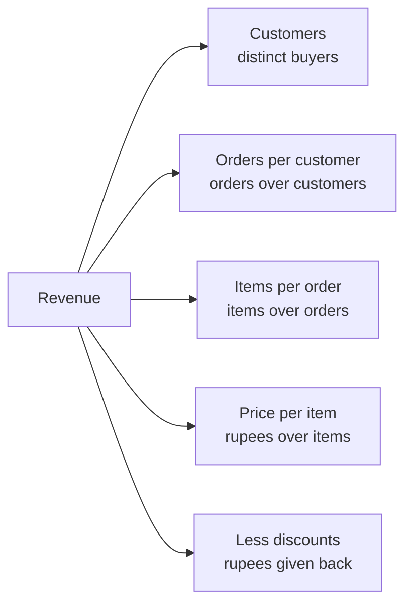
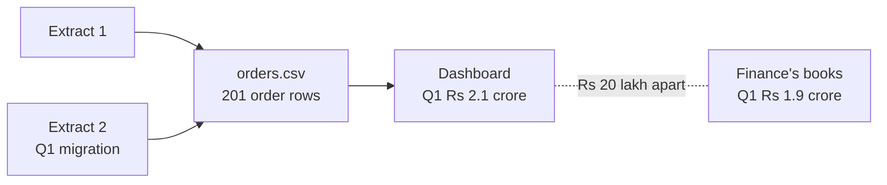
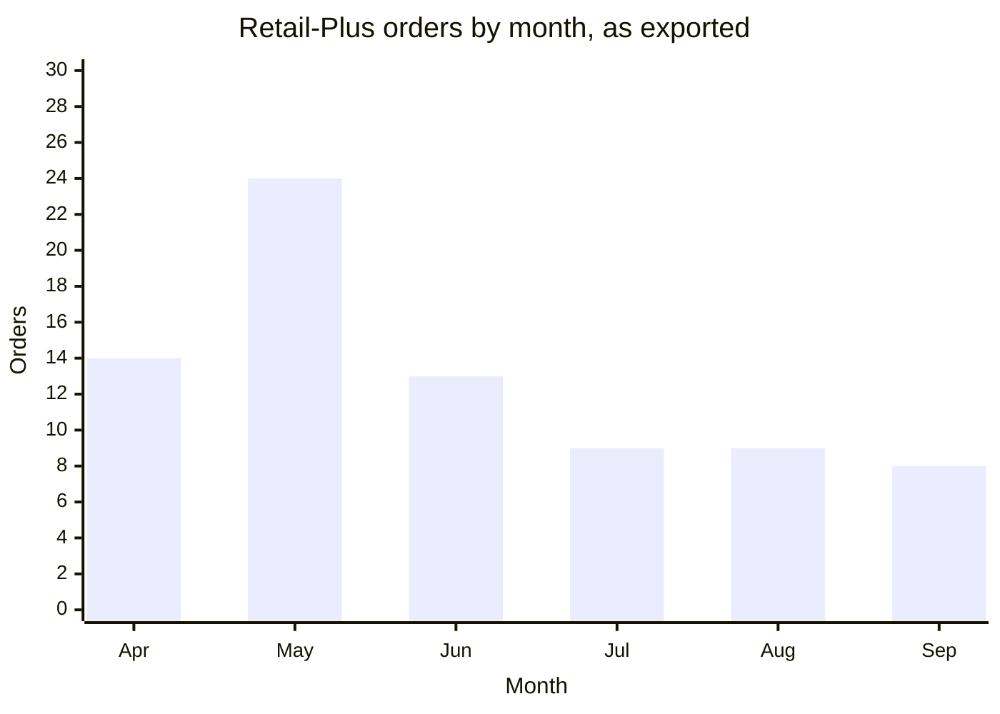
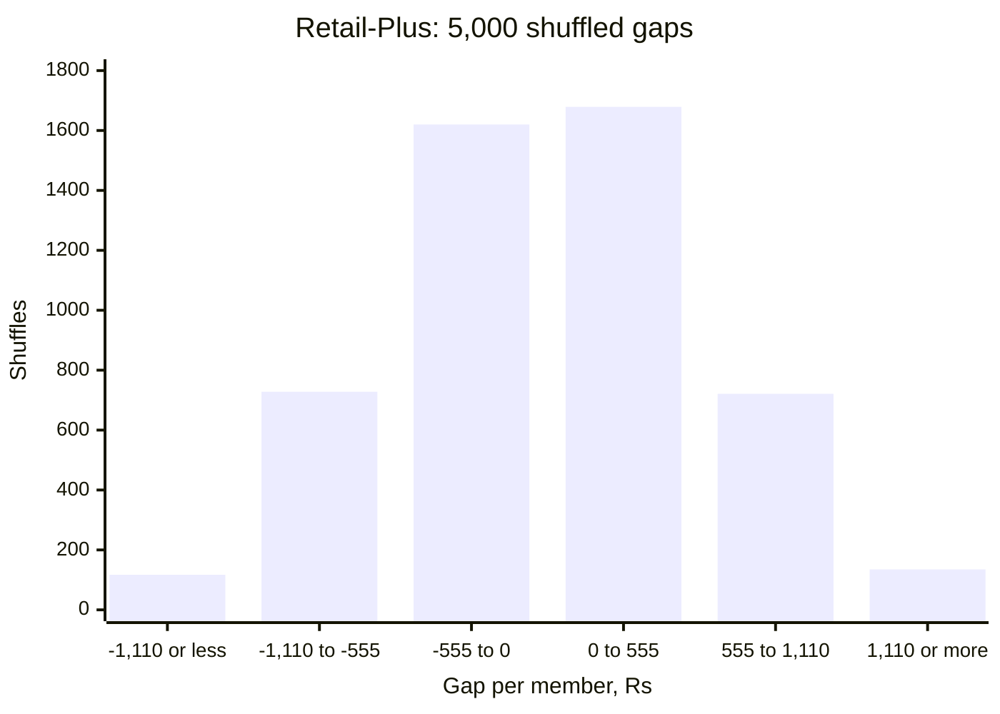
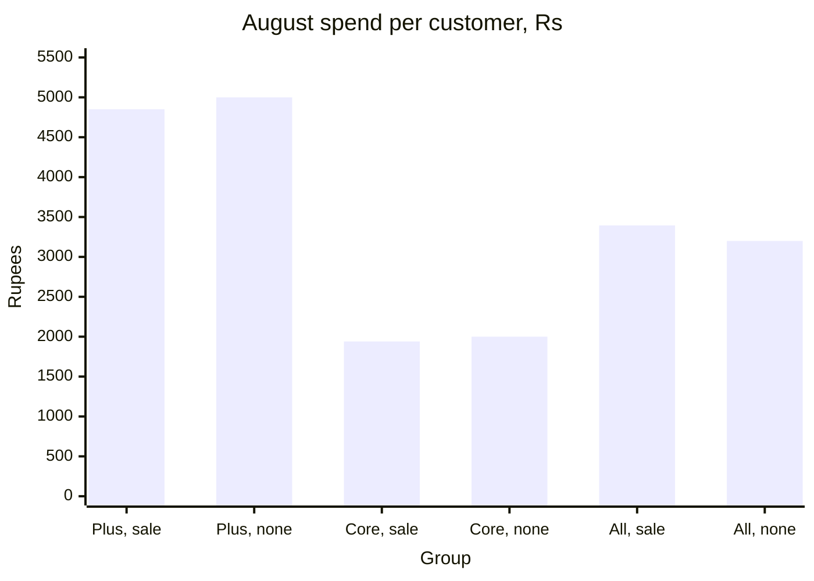
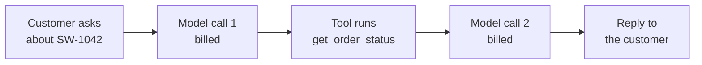
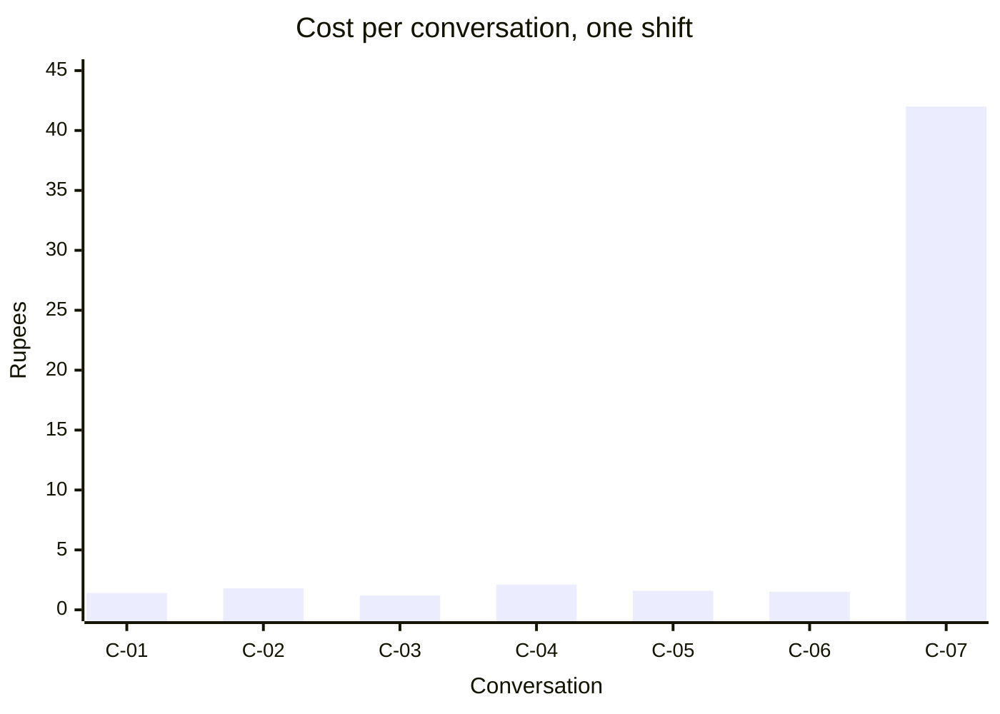

# Week 1 recap paper

Saturday 10 October 2026 · 120 minutes · 36 items in 5 parts · pen and paper, no assistant, no notes

Name: ____________________    Marked by: ____________________    Items right: ____ of 36

## What this paper is for

This week Meera Raghavan asked whether the Rs 12 crore Marketing wants for acquisition goes to the branch of revenue that is actually short, Anand Iyer disputed the Q1 figure the ERP export put on the dashboard, and Meera now has to decide whether the monsoon discount runs again at Diwali. This paper puts those decisions in front of you again, cold, and then the same traps in public cases and in an AI agent's logs, where interviewers will test them. The room's scores in each part, set beside the ratings you give in step one, decide where Monday's revision starts. A wrong answer tells Monday more than a blank one, so answer every item.

## How this paper works

- 120 minutes in one sitting. Each part gives its minutes as a guide, not a limit.
- Every item names its format beside its number: circle one letter, circle every correct letter, write T or F, write a letter from a word bank or a match table, write the word or number, show the working, or write the letters in order.
- Every item also names its level, easy, medium or hard, so you can plan your time. A hard item is several steps on an exhibit, never an obscure fact.
- A wrong answer costs nothing, so answer every item on the line under it.
- Pen and this paper only: no laptop, no phone, no notes and no assistant.
- Afterwards the papers are swapped and marked against the key, and the discussion takes the items the room missed most. The paper is ungraded and ranks nobody; the room's rates by part and by tag set Monday's revision.
- Parts 1 to 3 are set inside Kalpa Retail, where you work as a trainee engineer in the data and AI team of its Global Capability Centre: Meera Raghavan is its CEO, Anand Iyer its finance controller and Kavya Nair a senior analyst in its data team, and Marketing and Finance appear by function. Part 4 draws on public cases, each with its source named beside it, and Part 5 imagines the support agent of a food-delivery company such as Swiggy, with illustrative numbers. Every number an item needs is on the page.

## Step one, before Part 1

Before you read any item, rate yourself from 1 to 4 on each part in the table below, as you are today. The comparison between your rating and your score in each part is the most useful thing this paper produces for Monday.

- 1: I have not used this
- 2: I can follow it when someone shows me
- 3: I can do it alone on a small problem
- 4: I can find and fix mistakes in someone else's version

Your ratings: Part 1 ___ · Part 2 ___ · Part 3 ___ · Part 4 ___ · Part 5 ___

## The paper at a glance

| Part | What it shows | Items | Minutes | Easy | Medium | Hard |
|---|---|---|---|---|---|---|
| 1. Where the revenue went | whether you can read revenue from orders and say what would change a budget call | Q1 to Q8 (8) | 25.5 | 2 | 1 | 5 |
| 2. Which Q1 figure is right | whether you read an export as an auditor will and close its rows and its rupees | Q9 to Q16 (8) | 27.5 | 0 | 3 | 5 |
| 3. Real, worth it, and caused | whether you can say what chance, a count and a fair test let you claim | Q17 to Q22 (6) | 22.5 | 0 | 1 | 5 |
| 4. The same traps, in public | whether you spot the week's traps in public cases and name the check for each | Q23 to Q28 (6) | 21 | 0 | 2 | 4 |
| 5. The agent's bill and its logs | whether you can read an agent's code and log and size its cost honestly | Q29 to Q36 (8) | 23 | 0 | 6 | 2 |
| Total | | 36 | 119.5 | 2 | 13 | 21 |

---

## Part 1. Where the revenue went (Q1 to Q8)

*What it shows: whether you can read revenue from orders and say what would change a budget call. 8 items, about 25.5 minutes.*

Kalpa Retail sells through its app, its website and its stores. Its revenue is a tree of branches multiplied together: customers, orders per customer (how often each customer buys), items per order and price per item, less the discounts given; revenue per order, the average order value, is the last two branches together. Retail-Plus is Kalpa's paid-membership tier, customers who pay to be members, and Business is its segment of corporate buyers. Marketing wants Rs 12 crore to acquire new customers, and Meera Raghavan, the CEO, will not sign until the data answers her: "Is acquisition even the branch that is short?" Anand Iyer, the finance controller, adds a rule of his own: "No averages. One business customer can move an average."

**Exhibit 1A.** Kalpa's revenue tree. The branches multiply, and the discounts come off the product.



#### Q1 · Easy · show the working, then the answer · Compute median and mean

Five order values in rupees: 800, 1,200, 1,400, 2,000 and 480,000. Give the median and the mean.

Working:

Answer: ____________________

**Exhibit 1B.** Monday's 30 orders by status, and the analyst's cell. The int() is there because one amount arrived as the text "4500".

| Status | Orders | Rupees |
|---|---|---|
| delivered | 21 | 5,20,790 |
| returned | 5 | 14,970 |
| cancelled | 4 | 9,050 |
| all | 30 | 5,44,810 |

```python
sales, n = 0, 0
for o in ORDERS:
    if o["status"] == "delivered" or "returned":
        sales += int(o["amount"])
        n += 1
print(n, "orders, Rs", sales)
```

#### Q2 · Hard · circle one letter · Predict the output

Every Kalpa order carries a status: delivered (it reached the customer), returned (it came back for a refund) or cancelled (it never left the shelf). Meera asked for sales net of cancellations, and the analyst ran this cell on Monday's 30 orders. What does it print?

a) 26 orders, Rs 535760
b) 21 orders, Rs 520790
c) 30 orders, Rs 544810
d) 5 orders, Rs 14970

#### Q3 · Hard · circle one letter · Price the first order

Marketing's payback model asks what a new customer's first order is worth, and it uses Rs 18,160, the mean of Monday's 30 orders. The median of the same orders is Rs 2,205, and one Business order of Rs 4,80,000, which the room found by sorting, is 88 percent of the Rs 5,44,810 booked. What goes back to Marketing?

a) Keep Rs 18,160, since the mean times the 30 orders gives back the booked revenue exactly.
b) Use the median, about Rs 2,205, and keep the Rs 4,80,000 order in the file with a flag.
c) Delete the Rs 4,80,000 order from the file as an error, and use the mean of the other 29.
d) Use the mean of the 21 delivered orders, Rs 24,800, since only those became sales.

#### Q4 · Hard · show the working, then the answer · Size the discount's effect

A 15 percent discount lifts the quantity sold by 10 percent. By what percent does revenue change?

Working:

Answer: ____________________

**Exhibit 1C.** Tuesday's 200 orders by segment and quarter, and the analyst's cell.

| Segment | Q1 orders | Q2 orders |
|---|---|---|
| Retail-Core | 38 | 36 |
| Retail-Plus | 51 | 26 |
| Business | 20 | 17 |
| Student | 5 | 7 |
| all | 114 | 86 |

```python
SEGMENTS = ["Retail-Core", "Retail-Plus", "Business", "Student"]
orders_in = {}
for q in ["Q1", "Q2"]:
    for seg in SEGMENTS:
        n = 0
        for o in ORDERS:
            if o["quarter"] == q and o["segment"] == seg:
                n += 1
    orders_in[q] = n
change = (orders_in["Q2"] / orders_in["Q1"] - 1) * 100
print(orders_in, f"{change:+.1f}%")
```

#### Q5 · Hard · circle one letter · Predict the headline

For Meera's first slide an analyst wants the orders placed in each quarter of Tuesday's export, and writes this cell. What does it print?

a) {'Q1': 114, 'Q2': 86} -24.6%
b) {'Q1': 38, 'Q2': 36} -5.3%
c) {'Q1': 51, 'Q2': 26} -49.0%
d) {'Q1': 5, 'Q2': 7} +40.0%

#### Q6 · Easy · circle one letter · Pick the first rung

What is the first rung of the sales-drop investigation ladder?

a) Confirm that the drop is real.
b) Decompose the change along the revenue tree.
c) State a hypothesis for the cause.
d) Isolate the segment that moved.

#### Q7 · Hard · circle one letter · Name what would change the call

Tuesday's decomposition goes to Meera: the same 69 customers bought in both quarters, orders per customer fell from 1.65 to 1.25, and revenue per order rose 18 percent, mostly because the smaller Retail-Plus orders fell away. The note says frequency, how often customers come back, is the branch that moved, and proposes spending on bringing customers back before any acquisition. Which fact, if it turned up, would make acquisition the better use of Marketing's Rs 12 crore?

a) Marketing's campaigns reach more people per rupee than they did in the same quarter last year.
b) The fall in orders per customer sits almost entirely in Retail-Plus, the paid-membership tier.
c) Customers who still buy spend 18 percent more per order, so each one who returns is worth more.
d) A rupee spent winning new customers buys more revenue than a rupee spent bringing them back.

#### Q8 · Medium · write the letters in order · Order the ladder

Put the five rungs of the sales-drop investigation ladder in order.

a) Isolate the branch and the segment.
b) Confirm that the drop is real.
c) Hypothesise, and name the evidence that would settle it.
d) Compare like with like.
e) Decompose along the revenue tree.

Order: ____________________

---

## Part 2. Which Q1 figure is right (Q9 to Q16)

*What it shows: whether you read an export as an auditor will and close its rows and its rupees. 8 items, about 27.5 minutes.*

Kalpa's dashboard reads an ERP export, a copy of the orders taken out of the company's order system, while Finance's books, which Anand Iyer signs, record the revenue Kalpa reports. Anand replied to all on Tuesday's finding: "Your dashboard says Q1 was Rs 2.1 crore. Our books say 1.9." The ERP team adds that the CSV file was stitched from two extracts during the Q1 migration. A reconciliation proves which figure is right: every row of the export ends in the clean file or in the rejects log with its reason, so input rows equal clean rows plus rejected rows, and the clean rupees tie to the books.

**Exhibit 2A.** Where the two Q1 figures come from.



**Exhibit 2B.** A new analyst's read of the export.

```python
import csv
with open("C2_W01_D03_orders_STUDENT.csv") as f:
    reader = csv.DictReader(f)
    next(reader)                  # skip the header line
    rows = list(reader)
print(len(rows), rows[0]["order_id"])
```

#### Q9 · Hard · circle one letter · Predict the output

The export's first line names its columns, and 201 order rows follow it. The first order is KR-02001, a Q1 order of Rs 2,200. What does the cell print?

a) 201 KR-02001
b) 200 KR-02002
c) 200 KR-02001
d) 201 KR-02002

#### Q10 · Medium · write T or F · Predict the comparison

Every amount csv.DictReader reads arrives as text, as the amount "4500" on Monday's order KR-01008 did. True or false: in Python 3, the comparison '4500' < '30000' evaluates to True.

Answer: ____________________

**Exhibit 2C.** Two rows of the export as the reader hands them over, and the analyst's pass.

```python
rows = [{"order_id": "KR-02063", "amount": "twelve"},
        {"order_id": "KR-02064", "amount": "3150"}]
as_arrived = rows.copy()        # the export as it came, for the auditor
for r in rows:
    r["amount"] = int(r["amount"]) if r["amount"].isdigit() else 0
```

#### Q11 · Hard · circle one letter · Judge the auditor's copy

The auditor wants every amount as the export gave it, so before the pass converts the amounts in place the analyst keeps a copy. Statement: after the pass, as_arrived[0]["amount"] still holds "twelve". True or false, and why?

a) True, because rows.copy() builds a new list, and the pass only loops over rows.
b) True, because a dictionary inside a copied list is copied along with the list.
c) False, because both lists hold the same dictionaries, which the pass rewrote.
d) False, because rows.copy() hands back the very same list object as rows.

**Exhibit 2D.** Five invented rows laid out as the export's are, and a pass meant to set aside every unreadable amount.

```python
rows = [("KR-09051", "2400"), ("KR-09052", "twelve"), ("KR-09053", "n/a"),
        ("KR-09054", "1850"), ("KR-09055", "3100")]
rejects = []
for row in rows:
    if not row[1].isdigit():
        rows.remove(row)
        rejects.append(row)
print(len(rows), "+", len(rejects), "=", len(rows) + len(rejects))
```

#### Q12 · Hard · circle every correct letter · Choose every fix

The pass prints 4 + 1 = 5, so its rows reconcile, yet order KR-09053 is still among the clean rows. Which rewrites set aside every unreadable row and keep every readable one? Mark every correct option.

a) Loop over rows as now, but call rejects.append(row) before rows.remove(row).
b) Loop over a copy, for row in list(rows):, and remove each bad row from rows.
c) Loop over rows as now, and add continue straight after the rows.remove(row).
d) Build two new lists: kept from rows with digit amounts, rejects from the rest.
e) Loop over rows as now, and set a bad row's amount to "0" instead of removing it.

#### Q13 · Medium · circle one letter · Decide what a duplicate is

Order KR-02151 appears twice in Wednesday's export. Both copies are Q2 orders of Rs 3,710, one dated 25 September and one 2 August, so a check that compares whole rows reports no duplicate. What decides whether the two rows are one order?

a) whether the two rows match in every field, the dates included
b) the identity rule you wrote down for an order
c) which of the two dates falls inside the quarter being reported
d) whether the two amounts differ by more than a rounding error

### Set 1

**Situation.** Tuesday's numbers reached Meera before Wednesday's reconciliation did. A dashboard tile read on 15 September set Q2 so far, 11 of its 13 weeks, against all of Q1 and showed revenue down 25.9 percent. The closed quarters as exported read Rs 2.10 crore and Rs 1.87 crore, down 11.0 percent. The reconciliation then set aside 14 duplicated Q1 rows worth Rs 19,98,210, which brought Q1 to Rs 1.90 crore, the figure in Anand's books, and left Q2 at Rs 1.87 crore.

**Exhibit 2E.** Retail-Plus orders by month, as Tuesday's export held them.



#### Q14 · Hard · circle one letter · Choose Monday's number

Meera's growth review is on Monday. Which change in revenue goes into her note?

a) Down 25.9 percent, the tile's reading, since it is the most recent view of Q2.
b) Down 12.4 percent, the tile's weekly rate against Q1's, which levels the windows.
c) Down 11.0 percent, the closed quarters as exported, since both hold 13 weeks.
d) Down 1.6 percent, the closed quarters after the reconciliation with the books.

#### Q15 · Hard · write the word or number · Recompute the finding

The chart is Tuesday's count of Retail-Plus orders by month, as exported; Q1 is April to June and Q2 is July to September. Retail-Plus had the same 22 members in both quarters, and 11 of the 14 duplicated Q1 rows were Retail-Plus orders placed in May. Give the change in Retail-Plus orders per member from Q1 to Q2 on the reconciled file, as a percentage to one decimal place.

Answer: ____________________

#### Q16 · Medium · write the letters in order · Order the cleaning pass

Put the cleaning pass in order.

a) Reconcile counts and revenue.
b) Profile each field.
c) Recompute the revenue tree on the clean data.
d) Decide drop, default or flag for each defect, with a written reason.

Order: ____________________

---

## Part 3. Real, worth it, and caused (Q17 to Q22)

*What it shows: whether you can say what chance, a count and a fair test let you claim. 6 items, about 22.5 minutes.*

Meera has set the growth review for Monday and sent three questions. "One: Retail-Plus is down, smaller than first reported. Real, or the wobble we see every quarter? Two: Student is up 40 percent; should I move budget there? Three: marketing ran a monsoon-sale discount for Retail-Plus in August, says it lifted revenue 6 percent, and wants to repeat it for Diwali." Her constraint: "One page, two minutes. If the honest answer is 'we do not know yet', say so and tell me what would tell us." A shuffle test answers the first question: deal the members' figures to the two quarters at random thousands of times, and count how often chance alone makes a gap as large as the real one. That share is the p-value.

**Exhibit 3A.** Retail-Plus, 5,000 shuffles of its 22 members' delivered revenue between the quarters. Each gap is Q1 spend per member less Q2, in rupees, so a fall is a positive gap; the real fall is Rs 1,110 per member.



#### Q17 · Hard · circle every correct letter · Check four p-value statements

Which statements about the p-value are correct? Mark every correct option.

a) It is computed on the assumption that chance alone is at work.
b) It is the probability that the hypothesis is true.
c) A small value means the observed gap would be rare under chance alone.
d) It says nothing about whether the gap is large enough to matter.

**Exhibit 3B.** Thursday's ten cards, the class's shuffle_gaps, and the analyst's rerun.

```python
def shuffle_gaps(q1, q2, times, seed):       # as in class
    random.seed(seed)
    pool = q1 + q2
    gaps = []
    for _ in range(times):
        random.shuffle(pool)
        gaps.append(mean(pool[:len(q1)]) - mean(pool[len(q1):]))
    return gaps

q1 = [3400, 2900, 4100, 2500, 3800]
q2 = [2200, 3100, 1900, 2700, 2400]
real_gap = mean(q2) - mean(q1)               # the fall, Q2 against Q1
gaps = shuffle_gaps(q1, q2, 1000, seed=2026)
p = sum(1 for g in gaps if g >= real_gap) / len(gaps)
print(round(real_gap), p)
```

#### Q18 · Hard · circle one letter · Predict the output

Thursday's ten cards held five Q1 member totals and five Q2 totals, and in class 21 of 1,000 shuffles reached the real gap of Rs 880. An analyst reruns the test with the gap written as Q2 less Q1, the way a fall is usually shown. What does the cell print?

a) -880 0.021
b) 880 0.021
c) -880 0.981
d) -880 0.042

#### Q19 · Hard · circle one letter · Write the Student line

Student rose from 5 orders in Q1 to 7 in Q2, the 40 percent Meera asked about, on 12 orders from 2 customers. When each of those 12 orders is dealt to Q1 or Q2 by the toss of a coin, a rise of 40 percent or more turns up in 0.397 of 5,000 such worlds. Kavya's rule is no rate on fewer than 30 orders. Which line goes into the one-page note?

a) Student is our fastest-growing segment, up 40 percent; move acquisition budget to it now.
b) Up 40 percent on 12 orders, a rise chance makes 2 times in 5; hold, re-read at 30 orders.
c) Student's 0.397 is far above 0.05, which proves the rise is noise; close the Student offer.
d) Student's 12 orders are too few to say anything, so leave Student out of the note entirely.

### Set 2

**Situation.** Marketing's monsoon sale, aimed at Retail-Plus, Kalpa's paid-membership tier, took 15 percent off from 5 to 19 August and reached 60 customers, 30 Retail-Plus members and 30 Retail-Core customers. In August those 60 spent Rs 3,395 each and the 100 who did not get the sale spent Rs 3,200, a lift of 6.1 percent, which is Marketing's case for repeating it at Diwali. The chart splits the same customers by segment. Retail-Plus members buy more often and spend more than Retail-Core customers in any month.

**Exhibit 3C.** August spend per customer. The sale went to 30 Retail-Plus and 30 Retail-Core customers; 40 Retail-Plus and 60 Retail-Core customers did not get it.



#### Q20 · Hard · circle one letter · Name the pattern

What is this pattern an example of?

a) a reversal driven by a shift in the mix of customers
b) a calculation error in the segment-level revenue totals
c) a seasonal effect that the monsoon produces every year
d) a sample that is too small to show any pattern at all

#### Q21 · Hard · circle one letter · Advise on Diwali

Meera asks whether to repeat the discount at Diwali. Which answer is honest?

a) Repeat it exactly as it ran, because total revenue rose 6 percent after the campaign.
b) Double the discount, because a larger offer will lift every segment in turn.
c) Say nothing yet, because a single campaign can never be evaluated at all.
d) Do not repeat it as designed: no segment improved, and the lift is a mix effect.

#### Q22 · Medium · circle one letter · Design the Diwali test

Meera agrees to run the Diwali offer as a test. Which design lets the next note say whether the discount itself changes what customers spend?

a) Offer it to every customer, and compare this Diwali with last year's Diwali.
b) Offer it to Retail-Plus, and compare its members with Retail-Core customers.
c) Hold back a random share in each segment, and compare within the segment.
d) Let customers opt in on the app, and compare the ones who opt in with the rest.

---

## Part 4. The same traps, in public (Q23 to Q28)

*What it shows: whether you spot the week's traps in public cases and name the check for each. 6 items, about 21 minutes.*

Interviewers at strong AI and data teams like to test a method on a case the candidate has not seen. Every case in this part is on the public record, with its source named beside it, and every number an item needs is on the page. Read each one the way Kavya Nair reads a draft: what the number is, what it was computed on, and which check would have caught it.

### Set 3

**Situation.** In 2010 the economists Carmen Reinhart and Kenneth Rogoff reported that advanced economies whose public debt was above 90 percent of GDP (gross domestic product, the value of everything an economy produces in a year) grew at -0.1 percent a year on average. In 2013 Thomas Herndon, Michael Ash and Robert Pollin rebuilt the figure from the authors' working spreadsheet. The table gives the seven countries that entered the above-90 average, with the years each spent above 90 percent and its average growth in those years.

**Exhibit 4A.** The seven countries in the above-90 average. Source: Herndon, Ash and Pollin, 2013, Table 2.

| Country | Years above 90 percent | Average growth in those years, percent |
|---|---|---|
| Greece | 19 | 2.9 |
| Ireland | 7 | 2.4 |
| Italy | 10 | 1.0 |
| Japan | 11 | 0.7 |
| New Zealand | 1 | -7.6 |
| United Kingdom | 19 | 2.4 |
| United States | 4 | -2.0 |

**Exhibit 4B.** The two averages, computed on the seven countries in the table.

```python
above_90 = {"Greece": (19, 2.9), "Ireland": (7, 2.4), "Italy": (10, 1.0),
            "Japan": (11, 0.7), "New Zealand": (1, -7.6),
            "United Kingdom": (19, 2.4), "United States": (4, -2.0)}
years = sum(n for n, g in above_90.values())
by_country = sum(g for n, g in above_90.values()) / len(above_90)
by_year = sum(n * g for n, g in above_90.values()) / years
print(years, f"{by_country:.2f}", f"{by_year:.2f}")
```

#### Q23 · Hard · circle one letter · Predict the output

What does the cell print, and what explains the gap between its two averages?

a) 71 -0.03 1.68: in the first, one New Zealand year weighs as much as nineteen British years.
b) 71 1.68 -0.03: weighting by years lets New Zealand's one bad year dominate the second figure.
c) 71 -0.03 -0.03: no weighting can move an average of the same seven country figures at all.
d) 7 -0.03 1.68: years holds the count of countries, and the weights come from the years instead.

#### Q24 · Medium · circle one letter · Choose the check

The working spreadsheet held 20 countries, but the formula for each average covered rows 30 to 44 where it should have covered rows 30 to 49, which left out Australia, Austria, Belgium, Canada and Denmark; the authors accepted the error when it was found. Which check, run before publication, would have caught it?

a) Count the countries inside each average, and set that count against the sheet's 20.
b) Recompute each average as a median, which a few missing rows cannot move very far.
c) Plot growth against debt for every country, and look for a point that breaks the pattern.
d) Round every average to one decimal place, so that small slips in the sheet cannot show.

#### Q25 · Medium · circle one letter · Choose the first move

NASA's Mars Climate Orbiter was lost on 23 September 1999 as it reached Mars. One team's ground software wrote the thrusters' impulse in pound-force seconds, while the interface specification, and the navigation software that read the file, used newton-seconds, so every firing's effect was understated by a factor of 4.45. For months before arrival, navigation solutions from Doppler data alone kept placing the spacecraft closer to Mars than the other solutions did; the concern was raised informally and never resolved (NASA Mishap Investigation Board, 1999). In this week's terms, what should have happened when the two estimates disagreed?

a) Average the two navigation estimates, since each one carries an error of its own.
b) Trust the combined estimate, since it drew on more of the tracking data.
c) Treat the disagreement as the finding, and trace its cause before the next burn.
d) Widen the tolerance, since small differences build up over a nine-month cruise.

#### Q26 · Hard · circle every correct letter · Choose every reason

Google Flu Trends estimated flu activity in the United States from how often people searched for certain terms. Its builders tested 50 million search terms for those whose weekly volume best fit 1,152 data points of the CDC's figures (the Centers for Disease Control and Prevention, which counts doctor visits for flu-like illness), and weeded out terms such as high school basketball that fit well and had nothing to do with flu (Lazer and colleagues, Science, 2014). Why could basketball searches fit the flu figures? Mark every correct option.

a) Basketball games spread flu, since crowds gather indoors through the winter.
b) Winter drives both basketball searches and flu visits, so each rises with the season.
c) The CDC's figures carried errors that the basketball searches happened to match.
d) Search volume measures illness directly, so any term searched in winter measures flu.
e) Among 50 million candidate terms, some will fit 1,152 points by chance alone.

#### Q27 · Hard · circle one letter · Answer the alert

In 2012 an idea for changing how Bing displayed the headlines of its search ads had waited more than six months for a slot, until an engineer ran it as an A/B test, a controlled experiment that shows a change to a random share of users and compares them with the rest. Within hours the new version was producing abnormally high revenue, and a "too good to be true" alert fired (Kohavi and Thomke, Harvard Business Review, 2017). You are the analyst on call. What do you do first?

a) Ship the change to every user now, since each hour of delay costs revenue.
b) Treat the alert as a likely bug, and check the logging and the group split.
c) Stop the test and discard it, since a lift that large is almost always a bug.
d) Leave the test running for a quarter, until the lift settles near normal results.

#### Q28 · Hard · circle one letter · Judge the fairer figure

In the Second World War, Abraham Wald of the Statistical Research Group at Columbia University estimated how vulnerable aircraft were from the hits on the aircraft that came back and the share that did not: a hit a returning aircraft carries is a hit an aircraft can survive (Mangel and Samaniego, Journal of the American Statistical Association, 1984). Kavya lays two versions of the Retail-Plus figure side by side. Per member, over all 22 members: Rs 3,279 in Q1 and Rs 2,169 in Q2. Per buyer, over the 20 members who bought in Q1 and the 16 who bought in Q2: Rs 3,607 and Rs 2,982. Statement: the per-buyer figure is the fairer read, since a member who bought nothing has no spend to average. True or false, and why?

a) True, because averaging in members who spent nothing drags the figure down unfairly.
b) True, because the question is what buyers spend, and members who did not buy are not buyers.
c) False, because members who stopped buying drop out of it, and the fall shrinks by half.
d) False, because two different denominators make the two quarters impossible to compare.

---

## Part 5. The agent's bill and its logs (Q29 to Q36)

*What it shows: whether you can read an agent's code and log and size its cost honestly. 8 items, about 23 minutes.*

Suppose you join the AI team of a food-delivery company such as Swiggy; the agent, its logs and every number in this part are illustrative. For each customer conversation a large language model reads the message, may ask for a tool (an order's status, a refund within a limit, a hand-off to a person) and writes the reply. Every model call is billed by the token, a small piece of text, and writes one row to a log table. The head of customer support owns two numbers: the cost per conversation, and the share of conversations the agent resolves without a person.

**Exhibit 5A.** One conversation. The agent calls the model twice, and each call is billed.



**Exhibit 5B.** The agent's order-status tool, as first written. Illustrative.

```python
ORDER_STATUS = {"SW-1041": "delivered", "SW-1042": "out for delivery"}

def get_order_status(order_id):
    status = ORDER_STATUS.get(order_id, "not found")
    print(f"{order_id}: {status}")

result = get_order_status("SW-1042")
tool_message = {"role": "tool", "content": str(result)}   # sent to the model
```

#### Q29 · Hard · circle one letter · Predict what the model reads

The agent sends the model whatever the tool function returns, as the tool's result. A customer asks about order SW-1042, which is out for delivery. What does the model read as the tool's result?

a) 'out for delivery', so the reply tells the customer the order is on its way.
b) 'None', so the model has no status to report and may say it cannot find it.
c) 'SW-1042: out for delivery', the line the tool printed on the agent's console.
d) Nothing at all, since str(None) raises an error and the agent retries the call.

**Exhibit 5C.** The agent's loop, as first written. Illustrative.

```python
def run_agent(message, history=[]):
    history.append({"role": "user", "content": message})
    reply = call_model(history)            # sends every message in history
    history.append({"role": "assistant", "content": reply})
    return reply

run_agent("Where is order SW-1042?")        # customer A
run_agent("Please cancel order SW-2210")    # customer B
```

#### Q30 · Medium · circle one letter · Choose the fix

The agent keeps a conversation's messages in a list and sends the whole list to the model on every call. A minute after customer A asks about order SW-1042, customer B, on the same server, asks to cancel order SW-2210, and B's model call carries A's messages too, which leaks A's order to B and bills B for A's tokens. Which change fixes it?

a) Default history to None, and create a new list inside when it is None.
b) Move history out to one module-level list that every call appends to.
c) Keep the default list, and trim it to its last 20 messages on each call.
d) Keep the default list, and clear it only when a call raises an error.

**Exhibit 5D.** Cost per conversation in one shift, illustrative. C-01 to C-06 made 3 to 5 model calls each; C-07 looped and made 90.



#### Q31 · Hard · circle one letter · Choose the dashboard number

In C-07 the model kept calling the same tool until a timeout stopped it. The head of support wants one number on the dashboard that shows the typical conversation's cost drifting, and a control that stops the next C-07. Which pair?

a) The mean, Rs 7.37, which rises whenever any one conversation misbehaves.
b) The median, Rs 1.60, and C-07 deleted from the log as a failed run.
c) The mean without C-07, Rs 1.60, since a looping run is an error to ignore.
d) The median, Rs 1.60, with a cap on the model calls per conversation.

**Exhibit 5E.** The support head asks which tools failed at least 30 times this week. The analyst's query against the call log, with two numbered blanks.

```sql
SELECT tool, COUNT(*) AS failed_calls
FROM calls
__(1)__ status = 'error'
GROUP BY tool
__(2)__ COUNT(*) >= 30;
```

**Word bank 1.** Write the letter of the SQL word that completes each numbered blank in the query above. Each is used once at most, and some are not used.

| Letter | Word or phrase |
|---|---|
| a | ON |
| b | HAVING |
| c | LIMIT |
| d | WHERE |
| e | ORDER BY |
| f | DISTINCT |

#### Q32 · Medium · write the letter from Word bank 1 · Fill blank 1

Blank (1), which keeps only the failed calls before any grouping, is ____.

Answer: ____________________

#### Q33 · Medium · write the letter from Word bank 1 · Fill blank 2

Blank (2), which keeps only the tools with at least 30 failed calls, Kavya's floor for reading a count, is ____.

Answer: ____________________

**Exhibit 5F.** Eight calls from the log, illustrative. latency_ms is empty, NULL, when a call timed out; tool is NULL when the model replied without calling one.

| call_id | conversation_id | tool | status | latency_ms |
|---|---|---|---|---|
| 1 | CV-1 | order_status | ok | 800 |
| 2 | CV-1 | order_status | ok | 1200 |
| 3 | CV-2 | refund | error | 600 |
| 4 | CV-3 | order_status | timeout | NULL |
| 5 | CV-3 | refund | ok | 1000 |
| 6 | CV-4 | NULL | ok | 400 |
| 7 | CV-5 | handover | timeout | NULL |
| 8 | CV-6 | order_status | ok | 800 |

**Match table 1.** Write the letter of the value each query returns on the eight calls in the exhibit above. Each value is used once at most, and some are not used.

| Item | To match | Letter | Match |
|---|---|---|---|
| Q34 (Medium) | SELECT COUNT(latency_ms) FROM calls; | a | 0 |
| Q35 (Medium) | SELECT AVG(latency_ms) FROM calls; | b | 0.375 |
| Q36 (Medium) | SELECT COUNT(*) FILTER (WHERE status <> 'ok') / COUNT(*) FROM calls; | c | 6 |
|  |  | d | 8 |
|  |  | e | 600 |
|  |  | f | 800 |

Answers: Q34 ____    Q35 ____    Q36 ____

---

## Stretch: untimed, and not marked

For anyone who finishes early. Nothing here is counted; each item is the kind an interviewer asks after your first answer, so write the answer you would say.

### Stretch 1

Marketing concedes that frequency fell but says acquisition is still the cheaper way to add Rs 1 crore of revenue. What would you need to see before agreeing, and how would you say it to Meera in three sentences?

### Stretch 2

A shuffle test on the gap between two segments returns p = 0.03. Meera asks, "So we are 97 percent sure?" Answer in two sentences she can repeat to the board.

### Stretch 3

You have two hours and a raw export, and Meera wants the Q1 figure at the end of them. What do you do first, what do you skip, and what do you refuse to skip?

### Stretch 4

The head of customer support asks for one number for the support agent's weekly review. Which number do you give, and what goes beside it so that it cannot mislead?
